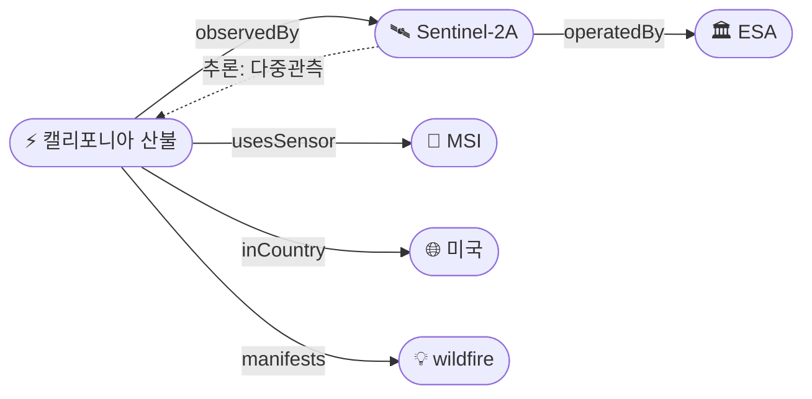

# 보고서 형식

## 보고서 경로
`reports/YYYY/MM/YYYY-MM-DD.md`

## 필수 구조

```markdown
---
title: "YYYY-MM-DD 위성영상 관측 이벤트 OSINT 일일 보고서"
date: YYYY-MM-DD
topic: "위성영상 관측 가능 지구 이벤트 일일 모니터링"
sources_count: N
new_items: N
updated_items: N
new_entities: N
new_triples: N
inferred_triples: N
multi_sat_events: N
korea_focus_events: N
---

# YYYY-MM-DD 위성영상 관측 이벤트 OSINT 일일 보고서

## 요약
(3-5문장 핵심 요약. 도메인별 신규 이벤트 수, 다중 위성 교차검증 건수, 한반도 관측 건수 명시. 특이사항 없으면 config의 report.empty_report_message 사용)

## 오늘의 핵심 (Top 5)
| 순위 | 이벤트 | 도메인 | 위성 | 지역 | 신뢰도 |
|------|--------|--------|------|------|--------|
| 1 | ... | Disaster | Sentinel-2A + Landsat 9 | ... | 0.95 |

## 다중 위성 교차검증 이벤트
(2개 이상 독립 위성·센서로 확인된 고신뢰 이벤트)

## 한반도 GeoFocus
(KOMPSAT 우선 관측 + 동·서·남해 이벤트 별도 정리)

## 자연재해 (Disaster)
### 1. [이벤트명]
- **출처:** [매체명](URL)
- **위성·센서:** Sentinel-2A (MSI 10m), Landsat 9 (OLI/TIRS 30m)
- **관측일:** YYYY-MM-DD
- **위치:** 국가, 지역 (lat, lon)
- **현상:** wildfire / flood / earthquake_damage / ...
- **상태:** 신규 / 업데이트 (← YYYY-MM-DD "이전 항목 제목")
- **분석:** 2-3문장 요약 (전후 비교 가능 여부, 영향규모)

## 인간활동 (Human Activity)
(deforestation, urban_expansion, mining, oil_spill, construction 등)

## 기후·환경 (Climate & Environment)
(glacier_retreat, methane_plume, air_pollution, sea_level_change 등)

## 농업·해양 (Agriculture & Maritime)
(NDVI 변화, 작황, 어선 활동, 적조 등)

## 국방·안보 (Defense — OSINT 한정)
(군사 시설 변화·해상 함정 — *공개 OSINT만*; 좌표 정밀도는 보안 고려하여 일반화)

## 인도주의 (Humanitarian)
(난민캠프 확장, 인프라 파괴, 식량 위기 신호 등)

## 센서·플랫폼별 묶음
- **Sentinel-1 (SAR):** ...
- **Sentinel-2 (광학):** ...
- **Sentinel-5P (가스):** ...
- **Landsat 8/9:** ...
- **MODIS / VIIRS:** ...
- **Planet (PlanetScope/SkySat):** ...
- **Maxar (WorldView-3):** ...
- **KOMPSAT-3A / 5 / CAS500-1:** ...

## 전후 비교(before/after) 영상 보유 이벤트
(원문에서 before/after 위성영상이 제공된 항목)

## 미검증 의혹
(위성 출처가 미확인된 이벤트 — 후속 검증 대기)

## 지식그래프

### 오늘의 주요 관계
(오늘 새로 발견/강화된 주요 관계를 텍스트로 설명)

### 전체 지식그래프 시각화


### 도메인별 세부 그래프
(자연재해 / 인간활동 / 기후·환경 / 농업·해양 / 국방 / 인도주의 — 전체 그래프가 복잡할 때)

## 온톨로지 변경
| 변경 유형 | 대상 | 근거 |
|----------|------|------|
| 새 클래스 | ... | ... |
| 새 관계 유형 | ... | ... |
| 새 엔티티 | ... | ... |

## 추론 결과
| 추론 | 신뢰도 | 근거 |
|------|--------|------|
| Event-X multi_satellite_confirmation | 0.95 | Sentinel-2A + Landsat 9 동시 관측 |
| Event-Y triggeredBy Event-Z | 0.82 | 같은 지역 7일 이내 태풍→홍수 |

## 분석 및 평가
(수집된 보도 + 추론 결과 기반 종합 분석. 도메인별 동향, 위성 활용 패턴, 한반도 관측 특이사항)

## 추적 항목
| 항목 | 최초 보고 | 상태 | 최신 업데이트 |
|------|----------|------|-------------|

## 출처 목록
1. [제목](URL) - 매체명, 날짜
```

## KG 시각화 규칙

### Mermaid 다이어그램 규칙
- `graph LR` (좌→우) 또는 `graph TD` (상→하) 사용
- **색상(classDef fill)을 사용하지 않는다** — GitHub 라이트/다크 모드 모두에서 가독성을 보장하기 위해 Mermaid 기본 테마 색상을 그대로 사용
- 엔티티 유형 구분은 노드 라벨에 접두 이모지로 표현:
  - Event: `⚡`
  - Satellite: `🛰`
  - Sensor: `📡`
  - Organization: `🏛`
  - Location: `📍`
  - Country: `🌐`
  - Phenomenon: `💡`
  - DataProduct: `📦`
- 노드 형태로 유형을 추가 구분:
  - 둥근 사각형 `(["..."])` — 기본
  - 육각형 `{{"..."}}` — 추론으로만 발견된 노드 (선택)
- 명시적 관계: 실선 화살표 `-->`
- 추론된 관계: 점선 화살표 `-.->` + "추론:" 접두사
- 노드 수가 config의 `report.max_kg_nodes`를 초과하면 중요도 순으로 잘라냄

### 복잡도 관리
- 노드 15개 이하: 단일 전체 그래프
- 노드 15~30개: 전체 그래프 + 도메인별 세부 그래프
- 노드 30개 초과: 도메인별 세부 그래프만 (전체는 텍스트 요약)

## 포함 기준
- `report-basis.md`에서 "포함"으로 결정된 항목만 넣는다
- `tag: new` → 상태: 신규
- `tag: update` → 상태: 업데이트 (← 이전 보고서 참조)
- `tag: reported` → 포함하지 않음
- 출처 URL 없는 정보는 포함하지 않는다
- 좌표 또는 admin level이 없는 Event는 포함하지 않는다 (CLAUDE.md 도메인 규칙)
- 위성 출처 미확인 이벤트는 본문이 아닌 "미검증 의혹" 섹션으로 분리
- 동일 이벤트를 여러 매체가 보도한 경우 대표 1개를 본문에, 나머지를 출처 목록에

## 특이사항 없음 처리
포함 항목이 0건이면 동일 구조로 config의 `report.empty_report_message` 보고서를 생성한다.
KG 시각화가 없으면 해당 섹션을 "변동 없음"으로 표시한다.

## Wiki 발행 규칙
config의 `report.wiki_publish`가 true일 때만 실행한다.
- GitHub Wiki는 YAML frontmatter를 지원하지 않는다
- Wiki 복사 시 frontmatter 블록(`---`로 감싼 부분)을 반드시 제거한다
- 메인 리포 `reports/` 파일에는 frontmatter를 유지한다
- Home.md에 최신 보고서 링크 추가
- _Sidebar.md에 최근 14일 유지
- Monthly-YYYY-MM.md 월별 인덱스 업데이트
