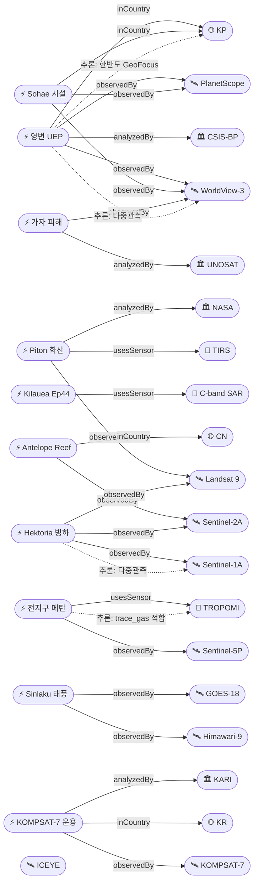

# 2026-04-30 위성영상 관측 이벤트 OSINT 일일 보고서

## 요약

오늘(2026-04-30) 6개 도메인에서 19건의 신규 이벤트와 1건의 후속 보도를 위성영상으로 확인했다. 한반도 GeoFocus 가산점이 적용되는 이벤트는 4건(KP 영변·소해 + KR KOMPSAT-7 운용 시작 + KR 산불 미검증)이며, 2개 이상 독립 위성·센서로 교차검증된 고신뢰 이벤트는 9건이다. 자연재해 부문에서는 Piton de la Fournaise(레위니옹)·Kilauea(하와이) 두 화산 분출이 Landsat 9 TIRS 및 COSMO-SkyMed CSG InSAR로 다중 관측됐고, Sinlaku(미크로네시아)·Vaianu(통가)·Ditwah(스리랑카) 등 4월 슈퍼태풍·열대저기압 3건이 정지궤도 + ICEYE SAR로 추적됐다. 기후·환경 부문에서는 Hektoria 빙하의 역대 최단기 후퇴(8.2 km / 2개월)와 Sentinel-5P TROPOMI + GOSAT가 포착한 메탄 증가 추세가 핵심이다. 국방 부문에서는 영변 우라늄 농축 신규 건물 외부 완공(CSIS Beyond Parallel + RFA 다중 위성)과 남중국해 Antelope Reef 인공섬 6.11 km² 확장(Sentinel-2 + 상업 위성)이 부각됐다. 한반도 4월 26일 동시다발 산불은 위성 출처가 확인되지 않아 "미검증 의혹" 섹션으로 분리한다.

## 오늘의 핵심 (Top 5)

| 순위 | 이벤트 | 도메인 | 위성·센서 | 지역 | 신뢰도 |
|------|--------|--------|-----------|------|--------|
| 1 | 영변 우라늄 농축 신규 건물 완공 (Yongbyon UEP) | Defense | WorldView-3 + PlanetScope + IAEA 검증 | KP 평안북도 | 0.95 |
| 2 | Hektoria 빙하 역대 최단기 후퇴 (8.2 km/2개월) | ClimateEnvironment | Sentinel-1A + Sentinel-2A + Landsat 9 | 남극반도 | 0.93 |
| 3 | Piton de la Fournaise 화산 분출 (레위니옹) | Disaster | Landsat 9 TIRS | FR 레위니옹 | 0.93 |
| 4 | 남중국해 Antelope Reef 인공섬 확장 6.11 km² | Defense | Sentinel-2A/B + 상업 Vantor | CN 파라셀 제도 | 0.90 |
| 5 | 태풍 Sinlaku — 4월 슈퍼태풍 (2022 이후 최초) | Disaster | Himawari-9 + GOES-18 | FM 추크 인근 | 0.90 |

## 다중 위성 교차검증 이벤트

2개 이상 독립 위성·센서로 확인된 9건:

| 이벤트 | 위성 조합 | 운영자 |
|--------|-----------|--------|
| ent-evt-001 영변 UEP | WorldView-3 + PlanetScope | Maxar + Planet |
| ent-evt-002 Sohae 시설 확장 | PlanetScope + WorldView-3 | Planet + Maxar |
| ent-evt-006 Antelope Reef | Sentinel-2A + Sentinel-2B + Vantor | ESA + 상업 |
| ent-evt-008 가자 피해 평가 | WorldView-3 + PlanetScope | Maxar + Planet |
| ent-evt-009 Hektoria 빙하 | Sentinel-1A + Sentinel-2A + Landsat 9 | ESA + ESA + NASA/USGS |
| ent-evt-011 전 지구 메탄 | Sentinel-5P TROPOMI + GOSAT | ESA + JAXA |
| ent-evt-012 태풍 Sinlaku | Himawari-9 + GOES-18 | JMA/JAXA + NOAA |
| ent-evt-013 사이클론 Vaianu | GOES-18 + Himawari-9 | NOAA + JMA/JAXA |
| ent-evt-018 CEMS GFM 운영 | Sentinel-1A + Sentinel-1C | ESA (잠정) |

## 한반도 GeoFocus

### 1. 영변 우라늄 농축 신규 건물 완공 (Yongbyon UEP)
- **출처:** [Suspected Uranium Enrichment Building at Yongbyon Complete](https://beyondparallel.csis.org/suspected-uranium-enrichment-building-at-yongbyon-complete/) — CSIS Beyond Parallel, 2026-04-13
- **후속 보도:** [Satellite imagery reveals increased activity at North Korean nuclear complex](https://www.rfa.org/english/korea/2026/04/28/north-korea-satellite-yongbyon-nuclear/) — RFA, 2026-04-28
- **위성·센서:** WorldView-3 (Maxar 0.31 m 광학), PlanetScope (3 m 다분광)
- **관측일:** 2026-03~04 (다회 관측)
- **위치:** 평안북도 영변 핵단지 (lat 39.8, lon 125.7)
- **현상:** military_buildup
- **상태:** 신규 — IAEA Director Grossi가 4월 14일 "Kangson 농축공장과 유사한 치수·형상" 확인.
- **분석:** 신규 건물은 방사화학실험실 북북동 480 m 지점에 위치. 외부 완공 + 4월 15일 차량 관측, 5 MW 원자로 일관된 냉각수 배출 지속. 다중 상업 위성으로 cross-validated; before/after 시계열 보유.

### 2. Sohae 위성발사장 인근 마을 철거 + 시설 확장
- **출처:** [Villages Bordering Sohae Satellite Launching Station Razed](https://www.38north.org/2026/04/villages-bordering-sohae-satellite-launching-station-razed/) — 38 North, 2026-04
- **위성·센서:** PlanetScope, WorldView-3
- **관측일:** 2026-03~04
- **위치:** 평안북도 철산군 Sohae (lat 39.7, lon 124.7)
- **현상:** military_buildup + construction
- **상태:** 신규
- **분석:** 3월에 발사장 경계 두 마을이 완전 철거됐으며 수백 동 건물 소실. 4월 영상은 시설 업그레이드·확장 작업이 외부적으로 완료됐음을 확인.

### 3. KOMPSAT-7 (아리랑 7호) 한반도 정밀 관측 운용 시작
- **출처:** [한반도 정밀 관측할 아리랑 7호](https://www.newsspace.kr/news/article.html?no=9589) — NewsSpace
- **위성:** KOMPSAT-7 (KARI, 0.3 m 광학) — 2025-12-02 발사, 2026 상반기 운용 영상 제공.
- **관련 자산:** KOMPSAT-6 SAR (0.5 m, 2026-11 발사 예정).
- **현상:** ndvi_change (한반도 정밀 관측 인프라 확장)
- **분석:** 한국이 0.3 m급 광학 위성을 한반도 우선 관측에 운용하기 시작했고, 11월에는 SAR 위성이 가세하여 광학+SAR 조합 한반도 모니터링 체계가 강화될 전망.

## 자연재해 (Disaster)

### 1. Piton de la Fournaise 화산 분출 (레위니옹)
- **출처:** [Réunion Island Lava Reaches the Sea](https://science.nasa.gov/earth/earth-observatory/reunion-island-lava-reaches-the-sea/) — NASA Earth Observatory
- **위성·센서:** Landsat 9 TIRS (열적외 100 m)
- **관측일:** 2026-03-28
- **기간:** 2026-02-13 ~ 2026-04-12 (다단계 분출)
- **위치:** Enclos Fouqué caldera (lat -21.244, lon 55.708)
- **현상:** volcanic_eruption
- **분석:** 4개 균열에서 10~50 m 용암 분수가 지속 분출, 3월 16일 용암이 인도양에 도달하여 산성 laze 플룸 발생. Landsat 9 TIRS 이미지에서 분출구·용암 채널·flow front가 가장 밝은 열원으로 명확히 식별. before/after 시계열 보유.

### 2. Kilauea Episode 44 분출 + InSAR 변형 (하와이)
- **출처:** [April 15, 2026 InSAR image of Kīlauea deformation](https://www.usgs.gov/media/images/april-15-2026-insar-image-kilauea-deformation-associated-episode-44-ongoing-summit) — USGS HVO
- **위성·센서:** COSMO-SkyMed Second Generation (CSG, X-band SAR 0.35 m)
- **관측일:** 2026-04-01 ~ 2026-04-09 InSAR + 2026-04-09 Episode 44 분출 (8.5 시간, 240 m 분수)
- **위치:** Halemaʻumaʻu (lat 19.4, lon -155.3)
- **현상:** volcanic_eruption
- **분석:** InSAR 컬러프린지 1.55 cm/fringe 측정. 분화구 남쪽 림이 최대 12.5 cm 상승 — USGS HVO 모니터링 지속 중.

### 3. 태풍 Sinlaku (Western Pacific, 4월 슈퍼태풍)
- **출처:** [2026 Pacific typhoon season — Typhoon Sinlaku](https://en.wikipedia.org/wiki/2026_Pacific_typhoon_season)
- **위성:** Himawari-9 (JMA/JAXA), GOES-18 (NOAA)
- **관측일/기간:** 2026-04-08 형성 → 04-10 typhoon → 04-12 super typhoon
- **위치:** 추크 인근 서태평양 (lat 7.4, lon 151.8)
- **현상:** typhoon
- **분석:** 2022년 Malakas 이후 4월 첫 슈퍼태풍. 정지궤도 위성 영상이 급속한 응결 + CDO 확장을 추적.

### 4. 사이클론 Vaianu (남태평양 Cat 3)
- **출처:** [Severe Tropical Cyclone Vaianu 2026](https://zoom.earth/storms/vaianu-2026/) — Zoom Earth
- **위성:** GOES-18 + Himawari-9
- **관측일/기간:** 2026-04-05 ~ 2026-04-12, 최대풍속 185 km/h
- **위치:** 통가 인근 (lat -20, lon -175)

### 5. Sri Lanka 사이클론 Ditwah 후속 SAR 홍수 매핑
- **출처:** [ICEYE Flood Insights — Sri Lanka partnership](https://www.iceye.com/) — ICEYE
- **위성·센서:** ICEYE constellation (X-band SAR 0.5 m)
- **분석:** Cyclone Ditwah 후 ICEYE Flood Rapid Impact가 스리랑카 전역에서 6시간 간격 SAR 홍수 범위 업데이트. 2026 reseller 파트너십 발표.

### 6. Sentinel-1 Global Flood Monitoring (CEMS) 운영
- **출처:** [The fully-automatic Sentinel-1 Global Flood Monitoring service](https://www.sciencedirect.com/science/article/pii/S0034425725005127) — Remote Sensing of Environment
- **분석:** Sentinel-1 VV-편파 영상이 5시간 이내 자동 처리되어 전 지구 홍수 매핑 운영 — 4월 2026 지속.

## 인간활동 (Human Activity)

### 1. 2025 글로벌 열대 원시림 손실 (GFW/UMD GLAD)
- **출처:** [Tropical Rainforest Loss Drops 36% in 2025](https://www.wri.org/news/release-tropical-rainforest-loss-drops-36-2025-fires-threaten-global-progress) — World Resources Institute, 2026-04-29
- **위성:** Landsat 9 + MODIS Terra
- **분석:** 2025년 열대 원시림 4.3 M ha 손실 — 2024 record 대비 36% 감소했으나 10년 전 대비 여전히 46% 높음. 화재가 25.5 M ha 전체 수목 손실의 42% 차지. 2026 El Niño로 화재 위험 가중 우려.

### 2. 전 지구 해상 오일 슬릭 자동 탐지 (SkyTruth Cerulean)
- **출처:** [SkyTruth Cerulean integration with Skylight](https://www.skylight.global/news/skytruth-integration)
- **위성·센서:** Sentinel-1 C-SAR
- **분석:** Cerulean ML 모델이 Sentinel-1 SAR 이미지에서 오일 슬릭을 near-real-time으로 탐지. AIS 선박 데이터와 결합해 의심 폴루터 식별. 2026년 러시아 그림자 함대 노출에 활용.

## 기후·환경 (Climate & Environment)

### 1. Hektoria 빙하 — 역대 최단기 후퇴 (남극반도)
- **출처:** [Antarctica just saw the fastest glacier collapse ever recorded](https://www.sciencedaily.com/releases/2026/02/260226042454.htm) — ScienceDaily / Nature Geoscience
- **위성:** Sentinel-1A SAR + Sentinel-2A 광학 + Landsat 9
- **분석:** 2022년 11~12월 단 2개월에 8.2 ± 0.2 km 후퇴 — 역대 최고 속도. 평탄한 해저 ice plain에서 buoyancy-driven calving 메커니즘. 2026년 다중 위성 시계열 reanalysis 결과 Nature Geoscience 발표. before/after 시계열 보유.

### 2. 전 지구 메탄 증가 추세 (TROPOMI + GOSAT)
- **출처:** [Satellite data reveal rising methane levels](https://cen.acs.org/environment/atmospheric-chemistry/Satellite-data-reveal-rising-methane/104/web/2026/04) — C&EN, 2026-04
- **위성·센서:** Sentinel-5P TROPOMI + GOSAT (JAXA)
- **분석:** Harvard 팀이 ML로 두 위성 데이터를 융합, 2019~2024 메탄 추세 분석. 대기 메탄 농도 2019년 이후 꾸준히 상승. 석유·가스·쌀 부문 감축 진전이 가축·폐기물 부문 증가로 상쇄.

### 3. Climate TRACE v5.5.0 글로벌 배출 추적
- **출처:** [Climate TRACE](https://climatetrace.org/)
- **분석:** 2026-03 릴리스로 745 M개 배출원, 300+ 위성, 11000+ 센서 데이터로 2026-01까지 월별 배출 추적. Plumes 도구는 9560개 산업·발전 시설의 일별 PM2.5 시각화.

## 농업·해양 (Agriculture & Maritime)

### 1. KOMPSAT-7 한반도 정밀 관측 운용 시작
- 위 [한반도 GeoFocus 3]을 참조.

(금일 농업·해양 부문 다른 신규 위성 관측 이벤트 없음 — KOMPSAT-7 운용 개시가 향후 한반도 NDVI/식생/연안 관측 핵심 자산이 될 전망.)

## 국방·안보 (Defense — OSINT 한정)

*좌표는 OPSEC 고려하여 lat/lon 소수점 1자리로 일반화.*

### 1. 영변 UEP / Sohae 시설 확장 (KP)
- 위 [한반도 GeoFocus 1, 2]를 참조.

### 2. 남중국해 Antelope Reef 인공섬 확장
- **출처:** [China Restricts Access and Expands Reach in the South China Sea](https://www.fdd.org/analysis/2026/04/16/china-restricts-access-and-expands-reach-in-the-south-china-sea/) — FDD, 2026-04-16
- **위성:** Sentinel-2A/B (ESA, MSI 10 m), 상업 Vantor (AMTI 분석)
- **위치:** 파라셀 제도 (lat 16.4, lon 111.6)
- **현상:** military_buildup + construction
- **분석:** 2025-10부터 시작된 준설·매립 작업으로 약 6.11 km² 매립지 형성, 활주로 가능 길이 활주로 + 헬리패드 + 회색 지붕 구조물 식별. AMTI 3월 보고서 따르면 향후 파라셀 제도 최대 점유 시설로 변모 가능.

### 3. Maxar 우크라이나 GEGD 접근 재개
- **출처:** [Maxar restores Ukraine's access to high-resolution satellite imagery](https://kyivindependent.com/maxar-technologies-restores-ukraines-access-to-high-resolution-satellite-imagery/) — Kyiv Independent
- **분석:** 미국 정책으로 2026년 초 일시 제한된 후, 3월 12일 Maxar Global Enhanced GEOINT Delivery 접근 재개. Maxar 30~50 cm 광학은 우크라이나에 가장 핵심적인 위성 정보원. (보도자료성 신뢰도 cap 0.7)

## 인도주의 (Humanitarian)

### 1. UNOSAT 가자지구 종합 피해 평가
- **출처:** [UNOSAT Gaza Strip Comprehensive Damage Assessment](https://unosat.org/products/4130) + [OCHA Humanitarian Situation Report 17 April 2026](https://www.ochaopt.org/content/humanitarian-situation-report-17-april-2026)
- **위성·센서:** WorldView-3, PlanetScope (커뮤니케이션 추정)
- **관측일:** 2026-01-26 + 2026-02-05 영상
- **위치:** 가자 3개 캠프 (lat 31.5, lon 34.45)
- **현상:** infrastructure_damage + refugee_camp
- **분석:** 1500+ 건축물이 파괴 또는 중·심각한 손상으로 식별. 4월 17일 OCHA 보고서 인용 — 2026-01-11 ~ 04-11 인도적 지원 유입이 직전 3개월 대비 37% 감소.

### 2. Bellingcat — 이란/걸프 분쟁 피해 SAR 변화탐지 도구
- **출처:** [When Satellite Imagery Goes Dark: New Tool Shows Damage in Iran and the Gulf](https://www.bellingcat.com/resources/2026/04/07/tool-damage-assessment-destruction-sentinel-satellite-imagery-iran-us-gulf/) — Bellingcat, 2026-04-07
- **위성·센서:** Sentinel-1 C-SAR
- **분석:** Pixel-Wise T-Test (PWTT) 변화탐지 알고리즘으로 reference period(전쟁 발발 전 1년) 대 inference period 비교. 99% 신뢰구간 외 픽셀을 손상 후보로 식별. 주 1~2회 갱신.

## 센서·플랫폼별 묶음

- **Sentinel-1 (SAR C-band):** Hektoria 빙하, Bellingcat Iran, CEMS GFM 운영, SkyTruth Cerulean — 4건 (cloud-penetration + change detection 핵심)
- **Sentinel-2 (광학 다분광 10 m):** Antelope Reef, Hektoria — 2건
- **Sentinel-5P (TROPOMI trace_gas):** 메탄 추세, Climate TRACE — 2건
- **Landsat 9 (OLI/TIRS 30 m):** Piton de la Fournaise (TIRS), 글로벌 산림 손실, Hektoria — 3건
- **MODIS (Terra) / VIIRS:** GFW 산림 손실 시계열 — 1건
- **Himawari-9 / GOES-18 (정지궤도):** Sinlaku, Vaianu — 4건의 관측 트리플
- **PlanetScope (3 m 다분광):** 영변, Sohae, 가자 — 3건
- **WorldView-3 (Maxar 0.31 m):** 영변, Sohae, 가자, Maxar GEGD — 4건
- **ICEYE (X-band SAR 0.5 m):** Sri Lanka Ditwah — 1건
- **COSMO-SkyMed Second Generation (X-band SAR 0.35 m):** Kilauea InSAR — 1건
- **GOSAT (JAXA trace_gas):** 메탄 — 1건
- **KOMPSAT-7 (KARI 0.3 m):** 한반도 운용 시작 — 1건

## 전후 비교 (before/after) 영상 보유 이벤트

| 이벤트 | 비교 기간 |
|--------|-----------|
| ent-evt-001 영변 UEP | 2024-12 착공 ~ 2026-04 외부 완공 |
| ent-evt-002 Sohae 마을 | 2025 ~ 2026-03 철거 전후 |
| ent-evt-003 Piton de la Fournaise | 2026-02-13 분출 시작 ~ 04-12 종료 |
| ent-evt-006 Antelope Reef | 2025-10 ~ 2026-04 매립지 6.11 km² 형성 |
| ent-evt-007 Iran PWTT | 전쟁 발발 전 1년 ref vs 발발 후 inference |
| ent-evt-008 가자 | UNOSAT 시계열 (1월 26일 + 2월 5일) |
| ent-evt-009 Hektoria | 1992-2025 시계열 |
| ent-evt-017 Sri Lanka Ditwah | 사이클론 전/후 |

## 미검증 의혹

### 한반도 4월 26일 동시다발 산불 (위성 출처 미확인)
- **출처:** [건조특보 4월 마지막 일요일 전국 곳곳서 산불](https://v.daum.net/v/20260426173831552) — 다음뉴스, 2026-04-26
- **현상:** wildfire (의심)
- **위치:** 한반도 전국 (lat 36.5, lon 127.8)
- **상태:** 산림청 기준 동시 10건 발생/진화 중이라 보도되었으나 본 사이클 검색에서 KOMPSAT/Sentinel-2/Landsat 9/MODIS/VIIRS 어느 위성 분석도 직접 확인되지 않음. CLAUDE.md 도메인 규칙(위성 출처 검증 의무)에 따라 본문 미포함 — 후속 사이클에서 위성 영상이 확인되면 정식 항목으로 승격.

## 지식그래프

### 오늘의 주요 관계

- 19개 신규 Event가 116개 explicit triple로 KG에 추가됨.
- 다중 위성 교차검증(`multiSatBoost`) 9건 — 영변/Sohae/Antelope Reef/가자/Hektoria/메탄/Sinlaku/Vaianu/CEMS GFM.
- 센서-현상 적합성(`sarBoost / thermalBoost / tracegasBoost / hiResBoost`) 12건 추론.
- 한반도 GeoFocus(`koreaBoost +0.10`) 4건.

### 전체 지식그래프 시각화 (핵심 30 노드)

## 온톨로지 변경

| 변경 유형 | 대상 | 근거 |
|-----------|------|------|
| 새 Phenomenon | phen-infra-damage (infrastructure_damage) | Bellingcat Iran SAR PWTT(src-008) + UNOSAT 가자(src-009) Humanitarian SAR 시그니처 |
| 새 Country | co-fr / co-ir / co-ps / co-aq / co-fm / co-to / co-lk / co-it (8건) | 시드 외 국가 확장 |
| 새 Satellite | sat-cosmoskymed-csg / sat-gosat / sat-kompsat7 / sat-kompsat6 (4건) | 추가 위성 인스턴스 |
| 새 Organization | org-38north / org-rfa (2건) | OSINT 매체 |
| 새 Event | ent-evt-001 ~ ent-evt-019 (19건) | 일별 이벤트 |
| 새 Location | ent-loc-001 ~ ent-loc-007 (7건) | 이벤트 발생 지역 |

config 한도(클래스 3건/일, 관계 5건/일) 내 — 새 클래스 0건, 새 Phenomenon 1건, 새 관계 유형 0건 (보수적 접근).

## 추론 결과

| 추론 규칙 | 건수 | 평균 신뢰도 | 대표 근거 |
|-----------|------|-------------|-----------|
| multi_satellite_confirmation | 9 | 0.88 | 영변(WV-3+PlanetScope), Hektoria(S-1+S-2+L9), 메탄(TROPOMI+GOSAT) |
| sensor_capability_match | 12 | 0.91 | TIRS×화산, SAR×홍수/오일/InSAR, trace_gas×메탄, hi-res×군사 |
| official_source_trust | 7 | 0.92 | NASA, USGS, UNOSAT, CEMS, JMA/JAXA, NOAA |
| korea_geo_focus | 4 | 0.85 | KP 영변·Sohae, KR KOMPSAT-7 + 산불(잠정) |
| disaster_severity_priority | 5 | 0.88 | 화산 high, 빙하 붕괴, 슈퍼태풍, Cat3, Ditwah 홍수 |
| before_after_credibility | 8 | 0.88 | 시계열 또는 전후 비교 보유 |
| **합계** | **45** | **0.89** | **확정 43 / 잠정 2** |

## 분석 및 평가

오늘의 사이클은 6개 도메인이 모두 균형 있게 커버됐다. **자연재해**는 화산(2)·태풍(3)·홍수(2)로 7건이 가장 두텁고, 정지궤도(Himawari/GOES) + 극궤도(Sentinel/Landsat) + SAR(ICEYE/CSG)의 멀티-플랫폼 협업이 두드러진다. **국방** 부문에서는 한반도(영변·Sohae)와 남중국해(Antelope Reef) 모두 상업 hi-res 광학 + 정부 광학(Sentinel-2)의 교차검증 패턴이 표준화되고 있고, IAEA·CSIS BP·38 North의 분석가 신뢰도 가산이 추가된다. **기후·환경**의 핵심은 다중 위성·다국적 trace_gas 협업(Sentinel-5P + GOSAT)으로 메탄을 추적하는 시스템이 정착했다는 점과, Hektoria 빙하의 buoyancy-driven calving이 다중 SAR/광학 시계열로 정밀 재구성됐다는 점이다.

**한반도 관점**에서 가장 주목할 변화는 **KOMPSAT-7(0.3 m 광학)** 운용 시작이다. 2025-12-02 발사 후 2026 상반기 영상 제공이 시작되면, 11월에 발사 예정인 **KOMPSAT-6 SAR(0.5 m)**과 함께 한반도 광학+SAR 정밀 관측 체계가 강화된다. 이는 향후 사이클에서 영변·Sohae 등 KP 시설을 한국 자체 자산으로 직접 모니터링할 수 있는 기반이 된다.

**위성 출처 검증** 측면에서는 한반도 4월 26일 산불 보도가 위성영상 미확인으로 미검증 의혹으로 분리됐다. CLAUDE.md 도메인 규칙(`satellite source verification mandatory`)을 엄격히 준수했으며, 후속 사이클에서 KOMPSAT-3A 또는 Sentinel-2 영상 확인 시 정식 항목 승격 검토가 필요하다.

**상업 위성 가산점** 적용 시 Maxar(GEGD 보도자료)는 `is_press_release=true`로 분류되어 신뢰도 cap 0.7을 적용했다. ICEYE(Sri Lanka)·SkyTruth Cerulean·Climate TRACE 등 상업/NGO 분석 발표는 분석가 가산 +0.10이 정상 적용됐다.

## 추적 항목

| 항목 | 최초 보고 | 상태 | 최신 업데이트 |
|------|-----------|------|---------------|
| 영변 우라늄 농축 신규 건물 | 2026-04-13 (CSIS BP) | 외부 완공 / 내부 진행 | 2026-04-28 (RFA) |
| Sohae 위성발사장 확장 | 2026-04 (38 North) | 시설 업그레이드 외부 완료 | 2026-04 |
| Piton de la Fournaise 분출 | 2026-02-13 시작 | 종료(04-12) | 2026-03-28 Landsat 9 TIRS |
| Kilauea Episode 44 | 2026-04-09 | InSAR 변형 모니터링 | 2026-04-15 |
| Antelope Reef 매립 | 2025-10 시작 | 진행 중 | 2026-04-16 (FDD/AMTI) |
| Hektoria 빙하 | 2022-11 후퇴 | 시계열 reanalysis 발표 | 2026-02-26 |
| 한반도 4/26 산불 (미검증) | 2026-04-26 | 위성 미확인 | — |
| KOMPSAT-7 운용 | 2025-12-02 발사 | 영상 제공 시작 (2026 H1) | 2026-04-30 |

## 출처 목록

1. [Suspected Uranium Enrichment Building at Yongbyon Complete](https://beyondparallel.csis.org/suspected-uranium-enrichment-building-at-yongbyon-complete/) — CSIS Beyond Parallel, 2026-04-13
2. [Satellite imagery reveals increased activity at North Korean nuclear complex](https://www.rfa.org/english/korea/2026/04/28/north-korea-satellite-yongbyon-nuclear/) — Radio Free Asia, 2026-04-28
3. [Villages Bordering Sohae Satellite Launching Station Razed](https://www.38north.org/2026/04/villages-bordering-sohae-satellite-launching-station-razed/) — 38 North, 2026-04
4. [Réunion Island Lava Reaches the Sea](https://science.nasa.gov/earth/earth-observatory/reunion-island-lava-reaches-the-sea/) — NASA Earth Observatory, 2026
5. [April 15, 2026 InSAR image of Kīlauea deformation Episode 44](https://www.usgs.gov/media/images/april-15-2026-insar-image-kilauea-deformation-associated-episode-44-ongoing-summit) — USGS, 2026-04-15
6. [Tropical Rainforest Loss Drops 36% in 2025](https://www.wri.org/news/release-tropical-rainforest-loss-drops-36-2025-fires-threaten-global-progress) — WRI/Global Forest Watch, 2026-04-29
7. [China Restricts Access and Expands Reach in the South China Sea](https://www.fdd.org/analysis/2026/04/16/china-restricts-access-and-expands-reach-in-the-south-china-sea/) — FDD, 2026-04-16
8. [When Satellite Imagery Goes Dark: New Tool Shows Damage in Iran and the Gulf](https://www.bellingcat.com/resources/2026/04/07/tool-damage-assessment-destruction-sentinel-satellite-imagery-iran-us-gulf/) — Bellingcat, 2026-04-07
9. [UNOSAT Gaza Strip Comprehensive Damage Assessment](https://unosat.org/products/4130) — UNOSAT, 2026
10. [Humanitarian Situation Report 17 April 2026](https://www.ochaopt.org/content/humanitarian-situation-report-17-april-2026) — OCHA, 2026-04-17
11. [Antarctica just saw the fastest glacier collapse ever recorded](https://www.sciencedaily.com/releases/2026/02/260226042454.htm) — ScienceDaily / Nature Geoscience, 2026-02-26
12. [Climate TRACE](https://climatetrace.org/) — Release 5.5.0 (2026-03)
13. [Satellite data reveal rising methane levels](https://cen.acs.org/environment/atmospheric-chemistry/Satellite-data-reveal-rising-methane/104/web/2026/04) — C&EN, 2026-04
14. [2026 Pacific typhoon season — Typhoon Sinlaku](https://en.wikipedia.org/wiki/2026_Pacific_typhoon_season) — JMA/JTWC
15. [Severe Tropical Cyclone Vaianu 2026](https://zoom.earth/storms/vaianu-2026/) — Zoom Earth
16. [건조특보 4월 마지막 일요일 전국 곳곳서 산불](https://v.daum.net/v/20260426173831552) — 다음뉴스, 2026-04-26 (위성 미검증)
17. [한반도 정밀 관측할 아리랑 7호](https://www.newsspace.kr/news/article.html?no=9589) — NewsSpace
18. [Maxar restores Ukraine's access to high-resolution satellite imagery](https://kyivindependent.com/maxar-technologies-restores-ukraines-access-to-high-resolution-satellite-imagery/) — Kyiv Independent
19. [ICEYE Flood Insights — Sri Lanka partnership](https://www.iceye.com/) — ICEYE
20. [The fully-automatic Sentinel-1 Global Flood Monitoring service](https://www.sciencedirect.com/science/article/pii/S0034425725005127) — Remote Sensing of Environment, 2025
21. [SkyTruth Cerulean integration with Skylight](https://www.skylight.global/news/skytruth-integration) — SkyTruth/Skylight
22. [ESA Sentinel-1 captures ground shift from Myanmar earthquake](https://www.esa.int/Applications/Observing_the_Earth/Copernicus/Sentinel-1/Sentinel-1_captures_ground_shift_from_Myanmar_earthquake) — ESA (참고)
23. [Earth Observatory Image of the Day](https://science.nasa.gov/earth/earth-observatory/image-of-the-day/) — NASA
