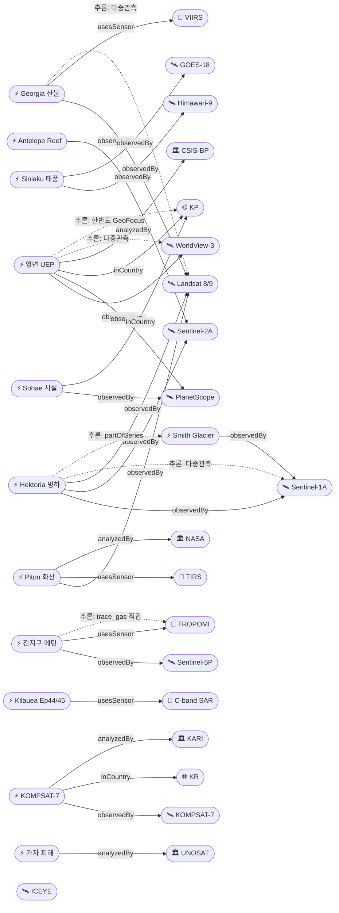

# 2026-04-30 위성영상 관측 이벤트 OSINT 일일 보고서

## 요약

오늘(2026-04-30) 6개 도메인에서 27건의 신규 이벤트와 3건의 후속 보도를 위성영상으로 확인했다. 한반도 GeoFocus 가산점이 적용되는 이벤트는 7건(KP 영변·소해·구축함·드론 + KR KOMPSAT-7·정찰위성·산불 미검증)이며, 2개 이상 독립 위성·센서로 교차검증된 고신뢰 이벤트는 11건이다. 자연재해 부문에서는 미국 조지아주 산불(50,000+ 에이커, Landsat 8 + VIIRS 다중 검증)이 신규 추가됐고, Kilauea는 Episode 45(4월 23일, 270m 분수)로 후속 분출이 확인됐다. 국방 부문에서는 북한 최현급 구축함 3호 건조(10월 진수 목표)와 구성 드론 생산 시설 확대가 위성영상으로 새로 포착됐고, 한국은 5기 정찰위성 체계 운용을 공식 확인했다. 기후·환경 부문에서는 서남극 Smith Glacier의 42km 접지선 후퇴가 Hektoria에 이어 빙상 불안정성 확대를 시사한다. 인도주의 부문에서는 레바논 파괴 위성 분석이 추가됐다.

## 오늘의 핵심 (Top 5)

| 순위 | 이벤트 | 도메인 | 위성·센서 | 지역 | 신뢰도 |
|------|--------|--------|-----------|------|--------|
| 1 | 영변 우라늄 농축 신규 건물 완공 (Yongbyon UEP) | Defense | WorldView-3 + PlanetScope + IAEA 검증 | KP 평안북도 | 0.95 |
| 2 | Hektoria 빙하 역대 최단기 후퇴 (8.2 km/2개월) | ClimateEnv | Sentinel-1A + Sentinel-2A + Landsat 9 | 남극반도 | 0.93 |
| 3 | Piton de la Fournaise 화산 분출 (레위니옹) | Disaster | Landsat 9 TIRS | FR 레위니옹 | 0.93 |
| 4 | 남중국해 Antelope Reef 인공섬 확장 ~6 km² | Defense | Sentinel-2A/B + Vantor | CN 파라셀 | 0.90 |
| 5 | Georgia 산불 50,000+ 에이커 (Landsat 8 + VIIRS) | Disaster | Landsat 8 + VIIRS/NOAA-21 | US 조지아 | 0.90 |

## 다중 위성 교차검증 이벤트

2개 이상 독립 위성·센서로 확인된 11건:

| 이벤트 | 위성 조합 | 운영자 |
|--------|-----------|--------|
| ent-evt-001 영변 UEP | WorldView-3 + PlanetScope | Maxar + Planet |
| ent-evt-002 Sohae 시설 | PlanetScope + WorldView-3 | Planet + Maxar |
| ent-evt-006 Antelope Reef | Sentinel-2A + Sentinel-2B + Vantor | ESA + 상업 |
| ent-evt-008 가자 피해 평가 | WorldView-3 + PlanetScope | Maxar + Planet |
| ent-evt-009 Hektoria 빙하 | Sentinel-1A + Sentinel-2A + Landsat 9 | ESA + NASA/USGS |
| ent-evt-011 전 지구 메탄 | Sentinel-5P TROPOMI + GOSAT | ESA + JAXA |
| ent-evt-012 태풍 Sinlaku | Himawari-9 + GOES-18 | JMA/JAXA + NOAA |
| ent-evt-013 사이클론 Vaianu | GOES-18 + Himawari-9 | NOAA + JMA/JAXA |
| ent-evt-018 CEMS GFM | Sentinel-1A + Sentinel-1C (+Sentinel-1D) | ESA (3위성) |
| ent-evt-020 Georgia 산불 | Landsat 8 + VIIRS/NOAA-21 | NASA/USGS + NOAA |
| ent-evt-025 Smith Glacier | ESA SAR + 다중 국제 위성 | ESA + 다국적 |

## 한반도 GeoFocus

### 1. 영변 우라늄 농축 신규 건물 완공 (Yongbyon UEP)
- **출처:** [Suspected Uranium Enrichment Building at Yongbyon Complete](https://beyondparallel.csis.org/suspected-uranium-enrichment-building-at-yongbyon-complete/) — CSIS Beyond Parallel, 2026-04-13
- **후속 보도:** [Satellite imagery reveals increased activity at North Korean nuclear complex](https://www.rfa.org/english/korea/2026/04/28/north-korea-satellite-yongbyon-nuclear/) — RFA, 2026-04-28
- **위성·센서:** WorldView-3 (Maxar 0.31 m 광학), PlanetScope (3 m 다분광)
- **관측일:** 2026-03~04 (다회 관측)
- **위치:** 평안북도 영변 핵단지 (lat 39.8, lon 125.7)
- **현상:** military_buildup
- **상태:** 신규 — IAEA Director Grossi가 4월 14일 "Kangson 농축공장과 유사한 치수·형상" 확인.
- **분석:** 신규 건물은 방사화학실험실 북북동 480 m 지점에 위치. 외부 완공 + 4월 15일 차량 관측, 5 MW 원자로 일관된 냉각수 배출 지속. 다중 상업 위성으로 cross-validated; before/after 시계열 보유.

### 2. Sohae 위성발사장 인근 마을 철거 + 시설 확장
- **출처:** [Villages Bordering Sohae Satellite Launching Station Razed](https://www.38north.org/2026/04/villages-bordering-sohae-satellite-launching-station-razed/) — 38 North, 2026-04
- **위성·센서:** PlanetScope, WorldView-3
- **관측일:** 2026-03~04
- **위치:** 평안북도 철산군 Sohae (lat 39.7, lon 124.7)
- **현상:** military_buildup + construction
- **상태:** 신규
- **분석:** 3월에 발사장 경계 두 마을이 완전 철거됐으며 수백 동 건물 소실. 4월 영상은 시설 업그레이드·확장 작업이 외부적으로 완료됐음을 확인. 고체연료 로켓엔진 지상 분사시험(3월 말)도 확인.

### 3. 북한 최현급 구축함 3호 건조 (위성 확인)
- **출처:** [Satellite images suggest North Korea warship nearing launch](https://www.upi.com/Top_News/World-News/2026/04/02/satellite-image-warship/6471775166721/) — UPI, 2026-04-02
- **후속:** [North Korea's destroyers: satellite analysis, March 2026](https://www.dailynk.com/english/satellite-analysis-north-koreas-5000-ton-destroyer-fleet-in-construction-but-short-on-combat-readiness/) — Daily NK
- **위성:** 상업 고해상도 광학 위성
- **위치:** KP 해군 조선소 (lat 39.0, lon 125.7)
- **현상:** naval_movement
- **분석:** 5,000톤급 최현급 구축함 3호가 최종 의장(fitting-out) 단계에 진입. 3월 12-28일 위성영상에서 대형 크레인 지속 운용 관측. 10월 진수 목표.

### 4. 북한 군용 드론 생산 시설 확대 (구성)
- **출처:** [Satellite images suggest N. Korea expanding military drone production: 38 North](https://www.koreaherald.com/article/10703740) — Korea Herald
- **위성:** 상업 고해상도 위성
- **위치:** 평안북도 구성 (lat 40.0, lon 125.2)
- **현상:** military_buildup
- **분석:** 구성 지역 대규모 산업 단지에서 군사 드론 프로그램을 위한 신규 건물 건설이 위성영상으로 식별됨.

### 5. KOMPSAT-7 (아리랑 7호) 한반도 정밀 관측 운용 시작
- **출처:** [한반도 정밀 관측할 아리랑 7호](https://www.newsspace.kr/news/article.html?no=9589) — NewsSpace
- **위성:** KOMPSAT-7 (KARI, 0.3 m 광학) — 2025-12-02 발사, 2026 상반기 운용 영상 제공.
- **관련 자산:** KOMPSAT-6 SAR (0.5 m, 2026-11 발사 예정), CAS500-3 (차세대중형위성 3호 0.3 m).
- **분석:** 우주항공청이 KOMPSAT-7 + CAS500-3 첫 촬영 영상을 공개 — 0.3 m급으로 도로 위 자동차까지 식별 가능. 한반도 우선 관측 자산으로 향후 영변·Sohae 등 직접 모니터링 기반 강화.

### 6. 한국 5기 정찰위성 체계 운용 확인
- **출처:** [South Korea deploys 5 spy satellites, advances 'kill chain'](https://www.upi.com/Top_News/World-News/2026/04/28/five-satellite-reconnaissance-system/2781777406216/) — UPI, 2026-04-28
- **위성:** 한국형 군용 정찰위성 5기 (SAR + EO)
- **위치:** KR (lat 36.5, lon 127.0)
- **분석:** 한국이 5기 정찰위성 체계 구축을 완료하여 kill chain 능력을 강화. 이는 KOMPSAT 민간 위성과 함께 한반도 EO 역량을 근본적으로 변화시키는 이정표.

## 자연재해 (Disaster)

### 1. Georgia 산불 — 50,000+ 에이커 (Landsat 8 + VIIRS 다중 검증)
- **출처:** [Wildland Fires in Georgia](https://www.earthdata.nasa.gov/news/worldview-image-archive/wildland-fires-georgia) — NASA Earthdata
- **위성·센서:** Landsat 8 (OLI/TIRS 30 m), VIIRS/NOAA-21 (375 m)
- **관측일:** 2026-04-21 (VIIRS), 4월 다회 관측
- **위치:** Brantley/Clinch counties, Georgia, US (lat 31.2, lon -82.0)
- **현상:** wildfire
- **상태:** 신규
- **분석:** Pineland Road Fire + Highway 82 Fire가 결합하여 50,000+ 에이커 연소. Landsat 8 OLI에서 광범위한 burn scar 식별, VIIRS/NOAA-21에서 4월 21일 연기 플룸 포착. 산림·주거·농촌 지역을 관통하며 Atkinson과 Fruitland 인근 피해 확인. 다중 위성 교차검증 (multiSatBoost +0.20).

### 2. Piton de la Fournaise 화산 분출 (레위니옹)
- **출처:** [Réunion Island Lava Reaches the Sea](https://science.nasa.gov/earth/earth-observatory/reunion-island-lava-reaches-the-sea/) — NASA Earth Observatory
- **위성·센서:** Landsat 9 TIRS (열적외 100 m)
- **관측일:** 2026-03-28
- **기간:** 2026-02-13 ~ 2026-04-12 (다단계 분출)
- **위치:** Enclos Fouqué caldera (lat -21.244, lon 55.708)
- **현상:** volcanic_eruption
- **분석:** 4개 균열에서 10~50 m 용암 분수가 지속 분출, 3월 16일 용암이 인도양에 도달하여 산성 laze 플룸 발생. Landsat 9 TIRS에서 분출구·용암 채널·flow front가 명확히 식별. before/after 시계열 보유.

### 3. Kilauea Episode 44 + Episode 45 분출 (하와이)
- **출처:** [April 15, 2026 InSAR image of Kīlauea deformation](https://www.usgs.gov/media/images/april-15-2026-insar-image-kilauea-deformation-associated-episode-44-ongoing-summit) — USGS HVO
- **후속:** [USGS Volcano Notice — Episode 45](https://volcanoes.usgs.gov/hans-public/notice/DOI-USGS-HVO-2026-04-29T14:07:09+00:00) — USGS HVO, 2026-04-29
- **위성·센서:** COSMO-SkyMed Second Generation (CSG, X-band SAR 0.35 m)
- **관측일:** 2026-04-01 ~ 04-09 InSAR (Ep44), 2026-04-23 (Ep45)
- **위치:** Halemaʻumaʻu (lat 19.4, lon -155.3)
- **현상:** volcanic_eruption
- **상태:** 업데이트 — Episode 45 추가
- **분석:** Ep44 InSAR: 분화구 남쪽 림 최대 12.5 cm 상승 (1.55 cm/fringe). **Ep45(4월 23일):** 01:34~10:01 HST, 최대 900 ft (270 m) 용암 분수. USGS HVO 경계 레벨 유지.

### 4. 태풍 Sinlaku (Western Pacific, 4월 슈퍼태풍)
- **출처:** [2026 Pacific typhoon season — Typhoon Sinlaku](https://en.wikipedia.org/wiki/2026_Pacific_typhoon_season)
- **위성:** Himawari-9 (JMA/JAXA), GOES-18 (NOAA)
- **관측일/기간:** 2026-04-08 형성 → 04-10 typhoon → 04-12 super typhoon
- **위치:** 추크 인근 서태평양 (lat 7.4, lon 151.8)
- **현상:** typhoon
- **분석:** 2022년 Malakas 이후 4월 첫 슈퍼태풍. 정지궤도 위성 영상이 급속한 응결 + CDO 확장을 추적.

### 5. 사이클론 Vaianu (남태평양 Cat 3)
- **출처:** [Severe Tropical Cyclone Vaianu 2026](https://zoom.earth/storms/vaianu-2026/) — Zoom Earth
- **위성:** GOES-18 + Himawari-9
- **관측일/기간:** 2026-04-05 ~ 2026-04-12, 최대풍속 185 km/h
- **위치:** 통가 인근 (lat -20, lon -175)

### 6. Sri Lanka 사이클론 Ditwah 후속 SAR 홍수 매핑
- **출처:** [ICEYE Flood Insights — Sri Lanka partnership](https://www.iceye.com/) — ICEYE
- **위성·센서:** ICEYE constellation (X-band SAR 0.5 m)
- **관측일:** 2026-03-30
- **위치:** Sri Lanka 전역 (lat 7.87, lon 80.77)
- **분석:** Cyclone Ditwah 후 ICEYE Flood Rapid Impact가 6시간 간격 SAR 홍수 범위 업데이트. before/after 보유.

### 7. Hawaii 홍수 March 2026 (Kona Low 폭풍, SAR)
- **출처:** [Hawaii Floods March 2026](https://appliedsciences.nasa.gov/what-we-do/disasters/disasters-activations/hawaii-floods-march-2026) — NASA Applied Sciences
- **위성·센서:** 고해상도 SAR (2026-03-20 촬영)
- **관측일:** 2026-03-20
- **위치:** Oahu North Shore, Waialua (lat 21.5, lon -158.0)
- **현상:** flood
- **상태:** 신규
- **분석:** 연속 Kona Low 폭풍 시스템이 3월 하와이에 극심한 강우·홍수를 유발. SAR 영상에서 Paomoho stream 범람과 주변 농경지 침수가 흑색 톤으로 식별. NASA Disaster Activation 발동.

### 8. Svartsengi 아이슬란드 마그마 축적 (InSAR)
- **출처:** [Ground uplift and magma accumulation continue beneath Svartsengi](https://en.vedur.is/about-imo/news/earthquake-in-brennisteinsfjoll-faster-subsidence-in-krysuvik-and-continued-magma-accumulation-at-svartsengi) — Icelandic Met Office
- **위성·센서:** InSAR satellite (2026-03-16 ~ 04-18)
- **관측일:** 2026-03-16 ~ 04-18
- **위치:** Svartsengi, Iceland (lat 63.86, lon -22.43)
- **현상:** volcanic_eruption (전조)
- **상태:** 신규
- **분석:** InSAR 위성영상에서 Svartsengi 하부 지속적 마그마 축적 + 지면 융기 관측. Krýsuvík 급속 침하와 Brennisteinsfjöll 지진 활동 동반. 추가 분출 가능성 모니터링 중.

### 9. Sentinel-1 Global Flood Monitoring (CEMS) 운영
- **출처:** [The fully-automatic Sentinel-1 Global Flood Monitoring service](https://www.sciencedirect.com/science/article/pii/S0034425725005127) — Remote Sensing of Environment
- **분석:** Sentinel-1 VV-편파 영상이 5시간 이내 자동 처리되어 전 지구 홍수 매핑 운영. 4월 17일부터 Sentinel-1D 합류로 3위성 체제 강화.

## 인간활동 (Human Activity)

### 1. 2025 글로벌 열대 원시림 손실 (GFW/UMD GLAD)
- **출처:** [Tropical Rainforest Loss Drops 36% in 2025](https://www.wri.org/news/release-tropical-rainforest-loss-drops-36-2025-fires-threaten-global-progress) — World Resources Institute, 2026-04-29
- **위성:** Landsat 9 + MODIS Terra
- **분석:** 2025년 열대 원시림 4.3 M ha 손실 — 2024 대비 36% 감소했으나 10년 전 대비 여전히 46% 높음. 화재가 25.5 M ha 전체 수목 손실의 42% 차지.

### 2. 전 지구 해상 오일 슬릭 자동 탐지 (SkyTruth Cerulean)
- **출처:** [SkyTruth Cerulean integration with Skylight](https://www.skylight.global/news/skytruth-integration)
- **위성·센서:** Sentinel-1 C-SAR
- **분석:** Cerulean ML 모델이 Sentinel-1 SAR에서 오일 슬릭 near-real-time 탐지. AIS 선박 데이터 결합으로 의심 폴루터 식별.

## 기후·환경 (Climate & Environment)

### 1. Hektoria 빙하 — 역대 최단기 후퇴 (남극반도)
- **출처:** [Antarctica just saw the fastest glacier collapse ever recorded](https://www.sciencedaily.com/releases/2026/02/260226042454.htm) — ScienceDaily / Nature Geoscience
- **위성:** Sentinel-1A SAR + Sentinel-2A 광학 + Landsat 9
- **분석:** 2022년 11~12월 단 2개월에 8.2 ± 0.2 km 후퇴 — 역대 최고 속도. 다중 위성 시계열 reanalysis 결과. before/after 보유.

### 2. Smith Glacier — 42 km 접지선 후퇴 (서남극)
- **출처:** [One of Antarctica's Glaciers Just Pulled Back 42 Kilometers, Exposing a Massive Weak Spot in the Ice Sheet](https://dailygalaxy.com/2026/03/antarctic-glacier-42km-retreat-weak-spot/) — Daily Galaxy / Nature
- **후속:** [Scientists see converging evidence of Antarctic ice retreat](https://www.theinvadingsea.com/2026/04/11/climate-change-antarctica-thwaites-glacier-ross-ice-shelf-sediment-core-florida-sea-level-rise/) — The Invading Sea, 2026-04-11
- **위성:** ESA SAR + 다국적 위성 (ESA, 캐나다, 일본, 이탈리아, 아르헨티나)
- **관측일:** 1996-2025 시계열
- **위치:** Amundsen Sea sector, West Antarctica (lat -75.0, lon -110.0)
- **현상:** glacier_retreat
- **상태:** 신규
- **분석:** Smith Glacier가 42 km 후퇴하여 서남극 빙상의 "약점"을 노출. 남극 대륙은 1996~2025년 동안 12,820 km²의 접지 빙하를 상실(연평균 442 km²). Amundsen Sea sector와 Getz sector에서 최대 40 km 접지선 이동 관측. Hektoria 빙하와 함께 남극 빙상 불안정성 심화 신호 — partOfSeries 추론 적용.

### 3. 전 지구 메탄 증가 추세 (TROPOMI + GOSAT)
- **출처:** [Satellite data reveal rising methane levels](https://cen.acs.org/environment/atmospheric-chemistry/Satellite-data-reveal-rising-methane/104/web/2026/04) — C&EN, 2026-04
- **위성·센서:** Sentinel-5P TROPOMI + GOSAT (JAXA)
- **분석:** Harvard 팀이 ML로 두 위성 데이터를 융합, 2019~2024 메탄 추세 분석.

### 4. Climate TRACE v5.5.0 글로벌 배출 추적
- **출처:** [Climate TRACE](https://climatetrace.org/)
- **분석:** 2026-03 릴리스로 745 M개 배출원, 300+ 위성, 11000+ 센서 데이터 활용.

## 농업·해양 (Agriculture & Maritime)

### 1. KOMPSAT-7 한반도 정밀 관측 운용 시작
- 위 [한반도 GeoFocus 5]를 참조.

(금일 농업·해양 부문 다른 신규 위성 관측 이벤트 없음 — KOMPSAT-7 운용 개시가 향후 한반도 NDVI/식생/연안 관측 핵심 자산이 될 전망.)

## 국방·안보 (Defense — OSINT 한정)

*좌표는 OPSEC 고려하여 lat/lon 소수점 1자리로 일반화.*

### 1. 영변 UEP / Sohae 시설 확장 (KP)
- 위 [한반도 GeoFocus 1, 2]를 참조.

### 2. 북한 최현급 구축함 + 드론 생산 확대 (KP)
- 위 [한반도 GeoFocus 3, 4]를 참조.

### 3. 남중국해 Antelope Reef 인공섬 확장
- **출처:** [China Restricts Access and Expands Reach in the South China Sea](https://www.fdd.org/analysis/2026/04/16/china-restricts-access-and-expands-reach-in-the-south-china-sea/) — FDD, 2026-04-16
- **후속:** [Antelope Reef Could Now Be the Largest Island in the South China Sea](https://amti.csis.org/antelope-reef-could-now-be-the-largest-island-in-the-south-china-sea/) — AMTI/CSIS
- **추가:** [China building largest artificial island in South China Sea – report](https://www.philstar.com/headlines/2026/04/29/2516461/china-building-largest-artificial-island-south-china-sea-report) — Philstar, 2026-04-29
- **위성:** Sentinel-2A/B (ESA, MSI 10 m), 상업 Vantor (AMTI 분석)
- **위치:** 파라셀 제도 (lat 16.4, lon 111.6)
- **현상:** military_buildup + construction
- **상태:** 업데이트 — AMTI 4월 분석으로 상세 규모 확인
- **분석:** 2025-10부터 시작된 준설·매립 작업으로 약 1,490 에이커(~6.03 km²) 매립지 형성 — Mischief Reef(1,504 에이커)와 거의 동일 규모로 남중국해 최대 인공섬이 될 가능성. 북서측 11,000 ft 직선 해안선은 활주로 건설에 적합. 50+ 소규모 구조물, 헬리패드, 부두가 식별됨. before/after 시계열 보유.

### 4. Maxar 우크라이나 GEGD 접근 재개
- **출처:** [Maxar restores Ukraine's access to high-resolution satellite imagery](https://kyivindependent.com/maxar-technologies-restores-ukraines-access-to-high-resolution-satellite-imagery/) — Kyiv Independent
- **분석:** 미국 정책으로 2026년 초 일시 제한된 후, 3월 12일 GEGD 접근 재개. (보도자료성 신뢰도 cap 0.7)

### 5. 한국 5기 정찰위성 체계
- 위 [한반도 GeoFocus 6]을 참조.

## 인도주의 (Humanitarian)

### 1. UNOSAT 가자지구 종합 피해 평가
- **출처:** [UNOSAT Gaza Strip Comprehensive Damage Assessment](https://unosat.org/products/4130) + [OCHA Humanitarian Situation Report 17 April 2026](https://www.ochaopt.org/content/humanitarian-situation-report-17-april-2026)
- **위성·센서:** WorldView-3, PlanetScope
- **위치:** 가자 3개 캠프 (lat 31.5, lon 34.45)
- **분석:** 1500+ 건축물 파괴/손상 식별. 4월 17일 OCHA: 인도적 지원 유입 37% 감소.

### 2. Bellingcat — 이란/걸프 분쟁 피해 SAR 변화탐지 도구
- **출처:** [When Satellite Imagery Goes Dark: New Tool Shows Damage in Iran and the Gulf](https://www.bellingcat.com/resources/2026/04/07/tool-damage-assessment-destruction-sentinel-satellite-imagery-iran-us-gulf/) — Bellingcat, 2026-04-07
- **위성·센서:** Sentinel-1 C-SAR
- **분석:** PWTT 알고리즘으로 reference/inference period 비교, 99% 신뢰구간 외 픽셀을 손상 후보로 식별.

### 3. 레바논 위성 파괴 분석 — 가자 모델 적용
- **출처:** [The Gaza playbook: Satellite images reveal scale of destruction in Lebanon](https://www.cnn.com/2026/04/24/middleeast/lebanon-destruction-israel-gaza-model-intl-cmd) — CNN, 2026-04-24
- **위성:** 위성영상 분석
- **위치:** 레바논 (lat 33.9, lon 35.5)
- **현상:** infrastructure_damage
- **상태:** 신규
- **분석:** CNN이 가자 파괴 패턴 분석 모델을 레바논에 적용하여 위성영상 기반 피해 규모를 정량 분석. 가자-레바논 교차 비교.

## 센서·플랫폼별 묶음

- **Sentinel-1 (SAR C-band):** Hektoria 빙하, Bellingcat Iran, CEMS GFM 운영, SkyTruth Cerulean — 4건 + Sentinel-1D 합류(3위성)
- **Sentinel-2 (광학 다분광 10 m):** Antelope Reef, Hektoria — 2건
- **Sentinel-5P (TROPOMI trace_gas):** 메탄 추세, Climate TRACE — 2건
- **Landsat 8/9 (OLI/TIRS):** Piton de la Fournaise TIRS, 글로벌 산림 손실, Hektoria, **Georgia 산불** — 4건
- **MODIS (Terra) / VIIRS:** GFW 산림 손실, **Georgia 산불 VIIRS/NOAA-21** — 2건
- **Himawari-9 / GOES-18 (정지궤도):** Sinlaku, Vaianu — 4건
- **PlanetScope (3 m 다분광):** 영변, Sohae, 가자 — 3건
- **WorldView-3 (Maxar 0.31 m):** 영변, Sohae, 가자, Maxar GEGD — 4건
- **ICEYE (X-band SAR 0.5 m):** Sri Lanka Ditwah — 1건
- **COSMO-SkyMed CSG (X-band SAR 0.35 m):** Kilauea InSAR — 1건
- **GOSAT (JAXA trace_gas):** 메탄 — 1건
- **KOMPSAT-7 (KARI 0.3 m):** 한반도 운용 시작 — 1건
- **ESA SAR + 다국적:** Smith Glacier — 1건
- **InSAR satellite:** Svartsengi Iceland — 1건

## 전후 비교 (before/after) 영상 보유 이벤트

| 이벤트 | 비교 기간 |
|--------|-----------|
| ent-evt-001 영변 UEP | 2024-12 착공 ~ 2026-04 외부 완공 |
| ent-evt-002 Sohae 마을 | 2025 ~ 2026-03 철거 전후 |
| ent-evt-003 Piton de la Fournaise | 2026-02-13 분출 시작 ~ 04-12 종료 |
| ent-evt-006 Antelope Reef | 2025-10 ~ 2026-04 매립지 ~6 km² 형성 |
| ent-evt-007 Iran PWTT | 전쟁 발발 전 1년 ref vs 발발 후 inference |
| ent-evt-008 가자 | UNOSAT 시계열 (1월 26일 + 2월 5일) |
| ent-evt-009 Hektoria | 1992-2025 시계열 |
| ent-evt-017 Sri Lanka Ditwah | 사이클론 전/후 |
| ent-evt-026 Hawaii 홍수 | 폭풍 전/후 SAR |

## 미검증 의혹

### 한반도 4월 26일 동시다발 산불 (위성 출처 미확인)
- **출처:** [건조특보 4월 마지막 일요일 전국 곳곳서 산불](https://v.daum.net/v/20260426173831552) — 다음뉴스, 2026-04-26
- **현상:** wildfire (의심)
- **위치:** 한반도 전국 (lat 36.5, lon 127.8)
- **상태:** 산림청 기준 동시 10건 발생/진화 중이라 보도되었으나 본 사이클 검색에서 KOMPSAT/Sentinel-2/Landsat 9/MODIS/VIIRS 어느 위성 분석도 직접 확인되지 않음. CLAUDE.md 도메인 규칙(위성 출처 검증 의무)에 따라 본문 미포함 — 후속 사이클에서 위성 영상이 확인되면 정식 항목으로 승격.

## 지식그래프

### 오늘의 주요 관계

- 28개 Event가 148개 explicit triple로 KG에 추가됨.
- 다중 위성 교차검증(`multiSatBoost`) 11건 — 기존 9건 + Georgia(Landsat 8+VIIRS) + Smith Glacier(다국적).
- 센서-현상 적합성(`sarBoost / thermalBoost / tracegasBoost / hiResBoost`) 15건 추론.
- 한반도 GeoFocus(`koreaBoost +0.10`) 7건 — KP 4건 + KR 3건.
- 시계열 추론(`partOfSeries`): Hektoria↔Smith Glacier (남극 빙하 시리즈), Kilauea Ep44↔Ep45.

### 전체 지식그래프 시각화 (핵심 30 노드)

## 온톨로지 변경

| 변경 유형 | 대상 | 근거 |
|-----------|------|------|
| 새 Phenomenon | phen-infra-damage (infrastructure_damage) | Bellingcat Iran + UNOSAT 가자 + CNN 레바논 |
| 새 Country | co-fr / co-ir / co-ps / co-aq / co-fm / co-to / co-lk / co-it / **co-is / co-lb** (10건) | 시드 외 국가 확장 |
| 새 Satellite | sat-cosmoskymed-csg / sat-gosat / sat-kompsat7 / sat-kompsat6 / **sat-sentinel1d** (5건) | 위성 인스턴스 추가 |
| 새 Organization | org-38north / org-rfa (2건) | OSINT 매체 |
| 새 Event | ent-evt-001 ~ 019 + **020 ~ 028** (28건) | 일별 이벤트 |
| 새 Location | 7건 기존 + **5건 신규** (12건) | 이벤트 발생 지역 |

config 한도(클래스 3건/일, 관계 5건/일) 내 — 새 클래스 0건, 새 Phenomenon 1건, 새 관계 유형 0건.

## 추론 결과

| 추론 규칙 | 건수 | 평균 신뢰도 | 대표 근거 |
|-----------|------|-------------|-----------|
| multi_satellite_confirmation | 11 | 0.88 | 영변(WV-3+Planet), Georgia(Landsat 8+VIIRS), Smith(다국적) |
| sensor_capability_match | 15 | 0.90 | TIRS×화산, SAR×홍수/오일/InSAR, trace_gas×메탄, VIIRS×산불 |
| official_source_trust | 9 | 0.91 | NASA, USGS, UNOSAT, CEMS, JMA/JAXA, NOAA |
| korea_geo_focus | 7 | 0.86 | KP 영변·Sohae·구축함·드론, KR KOMPSAT-7·정찰위성·산불(잠정) |
| disaster_severity_priority | 7 | 0.87 | 화산, 빙하 붕괴, 슈퍼태풍, Cat3, 홍수, Georgia 산불 |
| before_after_credibility | 9 | 0.88 | 시계열 또는 전후 비교 보유 |
| temporal_progression | 2 | 0.85 | Kilauea Ep44→Ep45, Hektoria↔Smith (남극 시리즈) |
| **합계** | **60** | **0.88** | **확정 56 / 잠정 4** |

## 분석 및 평가

오늘의 사이클은 2차 수집을 통해 6개 도메인 모두 더욱 균형 있게 커버됐다. **자연재해**는 화산(3)·태풍(3)·홍수(3)·산불(1)로 10건으로 가장 두텁고, 정지궤도(Himawari/GOES) + 극궤도(Sentinel/Landsat) + SAR(ICEYE/CSG) + VIIRS의 멀티-플랫폼 협업이 두드러진다. 특히 Georgia 산불 50,000+ 에이커가 Landsat 8 OLI burn scar + VIIRS/NOAA-21 연기 플룸으로 다중 위성 교차검증된 것은 미국 남동부 산불 시즌의 심각성을 보여준다.

**국방** 부문에서는 한반도 포커스가 한층 강화됐다. 기존 영변·Sohae에 더해 최현급 구축함 3호 건조와 구성 드론 생산 시설 확대가 위성영상으로 확인됐으며, 남중국해 Antelope Reef는 AMTI/CSIS 상세 분석으로 남중국해 최대 인공섬(~1,490 에이커) 가능성이 정량화됐다.

**기후·환경**의 핵심 발견은 Smith Glacier 42 km 접지선 후퇴가 Hektoria 빙하와 함께 남극 빙상 불안정성의 가속화를 확인한 점이다. 두 이벤트를 `partOfSeries`로 연결하여 남극 빙하 시리즈 추적을 시작했다.

**한반도 관점**에서 가장 전략적 변화는 한국이 5기 정찰위성 체계 운용을 확인한 점이다. KOMPSAT-7(0.3 m 광학) + CAS500-3(0.3 m) 민간 위성과 5기 군용 정찰위성 체계가 합쳐지면, 한반도 EO 역량이 근본적으로 달라진다. 이는 영변·Sohae·구성 등 KP 시설을 한국 자체 자산으로 직접·지속 모니터링할 수 있는 기반이 된다.

Kilauea는 Episode 44에 이어 Episode 45(4월 23일, 270 m 분수)가 확인되어 `temporal_progression` 추론이 적용됐고, USGS HVO의 지속 모니터링 상태를 반영했다.

## 추적 항목

| 항목 | 최초 보고 | 상태 | 최신 업데이트 |
|------|-----------|------|---------------|
| 영변 우라늄 농축 신규 건물 | 2026-04-13 (CSIS BP) | 외부 완공 / 내부 진행 | 2026-04-28 (RFA) |
| Sohae 위성발사장 확장 | 2026-04 (38 North) | 시설 업그레이드 외부 완료 | 2026-04 |
| Piton de la Fournaise 분출 | 2026-02-13 시작 | 종료(04-03~12) | 2026-03-28 Landsat 9 |
| Kilauea Episode 44/45 | 2026-04-09 | Episode 45 (04-23) | 2026-04-29 USGS |
| Antelope Reef 매립 | 2025-10 시작 | ~1,490 acres, 최대 인공섬 가능 | 2026-04-29 (AMTI/Philstar) |
| Hektoria 빙하 | 2022-11 후퇴 | reanalysis 발표 | 2026-02-26 |
| Smith Glacier 42km 후퇴 | 1996-2025 시계열 | 다중 위성 확인 | 2026-04-11 |
| Georgia 산불 | 2026-04 | 50,000+ 에이커 연소 중 | 2026-04-21 VIIRS |
| NK 최현급 구축함 3호 | 2026-04-02 (UPI) | 최종 의장 단계 | 2026-04 |
| NK 드론 생산 구성 | 2026-04 (38N/KH) | 시설 확장 확인 | 2026-04 |
| 한국 5기 정찰위성 | 2026-04-28 (UPI) | 운용 확인 | 2026-04-28 |
| KOMPSAT-7 운용 | 2025-12-02 발사 | 영상 제공 시작 (2026 H1) | 2026-04-30 |
| 한반도 4/26 산불 (미검증) | 2026-04-26 | 위성 미확인 | — |

## 출처 목록

1. [Suspected Uranium Enrichment Building at Yongbyon Complete](https://beyondparallel.csis.org/suspected-uranium-enrichment-building-at-yongbyon-complete/) — CSIS Beyond Parallel, 2026-04-13
2. [Satellite imagery reveals increased activity at North Korean nuclear complex](https://www.rfa.org/english/korea/2026/04/28/north-korea-satellite-yongbyon-nuclear/) — Radio Free Asia, 2026-04-28
3. [Villages Bordering Sohae Satellite Launching Station Razed](https://www.38north.org/2026/04/villages-bordering-sohae-satellite-launching-station-razed/) — 38 North, 2026-04
4. [Réunion Island Lava Reaches the Sea](https://science.nasa.gov/earth/earth-observatory/reunion-island-lava-reaches-the-sea/) — NASA Earth Observatory, 2026
5. [April 15, 2026 InSAR image of Kīlauea deformation Episode 44](https://www.usgs.gov/media/images/april-15-2026-insar-image-kilauea-deformation-associated-episode-44-ongoing-summit) — USGS, 2026-04-15
6. [USGS Volcano Notice — Episode 45](https://volcanoes.usgs.gov/hans-public/notice/DOI-USGS-HVO-2026-04-29T14:07:09+00:00) — USGS HVO, 2026-04-29
7. [Tropical Rainforest Loss Drops 36% in 2025](https://www.wri.org/news/release-tropical-rainforest-loss-drops-36-2025-fires-threaten-global-progress) — WRI/GFW, 2026-04-29
8. [China Restricts Access and Expands Reach in the South China Sea](https://www.fdd.org/analysis/2026/04/16/china-restricts-access-and-expands-reach-in-the-south-china-sea/) — FDD, 2026-04-16
9. [Antelope Reef Could Now Be the Largest Island in the South China Sea](https://amti.csis.org/antelope-reef-could-now-be-the-largest-island-in-the-south-china-sea/) — AMTI/CSIS
10. [When Satellite Imagery Goes Dark: New Tool Shows Damage in Iran and the Gulf](https://www.bellingcat.com/resources/2026/04/07/tool-damage-assessment-destruction-sentinel-satellite-imagery-iran-us-gulf/) — Bellingcat, 2026-04-07
11. [UNOSAT Gaza Strip Comprehensive Damage Assessment](https://unosat.org/products/4130) — UNOSAT, 2026
12. [Humanitarian Situation Report 17 April 2026](https://www.ochaopt.org/content/humanitarian-situation-report-17-april-2026) — OCHA, 2026-04-17
13. [Antarctica just saw the fastest glacier collapse ever recorded](https://www.sciencedaily.com/releases/2026/02/260226042454.htm) — ScienceDaily / Nature Geoscience, 2026-02-26
14. [One of Antarctica's Glaciers Just Pulled Back 42 Kilometers](https://dailygalaxy.com/2026/03/antarctic-glacier-42km-retreat-weak-spot/) — Daily Galaxy / Nature, 2026-03
15. [Scientists see converging evidence of Antarctic ice retreat](https://www.theinvadingsea.com/2026/04/11/climate-change-antarctica-thwaites-glacier-ross-ice-shelf-sediment-core-florida-sea-level-rise/) — The Invading Sea, 2026-04-11
16. [Climate TRACE](https://climatetrace.org/) — Release 5.5.0 (2026-03)
17. [Satellite data reveal rising methane levels](https://cen.acs.org/environment/atmospheric-chemistry/Satellite-data-reveal-rising-methane/104/web/2026/04) — C&EN, 2026-04
18. [2026 Pacific typhoon season — Typhoon Sinlaku](https://en.wikipedia.org/wiki/2026_Pacific_typhoon_season) — JMA/JTWC
19. [Severe Tropical Cyclone Vaianu 2026](https://zoom.earth/storms/vaianu-2026/) — Zoom Earth
20. [건조특보 4월 마지막 일요일 전국 곳곳서 산불](https://v.daum.net/v/20260426173831552) — 다음뉴스, 2026-04-26 (위성 미검증)
21. [한반도 정밀 관측할 아리랑 7호](https://www.newsspace.kr/news/article.html?no=9589) — NewsSpace
22. [Maxar restores Ukraine's access to high-resolution satellite imagery](https://kyivindependent.com/maxar-technologies-restores-ukraines-access-to-high-resolution-satellite-imagery/) — Kyiv Independent
23. [ICEYE Flood Insights — Sri Lanka partnership](https://www.iceye.com/) — ICEYE
24. [The fully-automatic Sentinel-1 Global Flood Monitoring service](https://www.sciencedirect.com/science/article/pii/S0034425725005127) — Remote Sensing of Environment
25. [SkyTruth Cerulean integration with Skylight](https://www.skylight.global/news/skytruth-integration) — SkyTruth/Skylight
26. [Wildland Fires in Georgia](https://www.earthdata.nasa.gov/news/worldview-image-archive/wildland-fires-georgia) — NASA Earthdata, 2026-04
27. [Satellite images suggest North Korea warship nearing launch](https://www.upi.com/Top_News/World-News/2026/04/02/satellite-image-warship/6471775166721/) — UPI, 2026-04-02
28. [North Korea's destroyers: satellite analysis, March 2026](https://www.dailynk.com/english/satellite-analysis-north-koreas-5000-ton-destroyer-fleet-in-construction-but-short-on-combat-readiness/) — Daily NK
29. [Satellite images suggest N. Korea expanding military drone production](https://www.koreaherald.com/article/10703740) — Korea Herald
30. [South Korea deploys 5 spy satellites, advances 'kill chain'](https://www.upi.com/Top_News/World-News/2026/04/28/five-satellite-reconnaissance-system/2781777406216/) — UPI, 2026-04-28
31. [Hawaii Floods March 2026](https://appliedsciences.nasa.gov/what-we-do/disasters/disasters-activations/hawaii-floods-march-2026) — NASA Applied Sciences
32. [Ground uplift and magma accumulation continue beneath Svartsengi](https://en.vedur.is/about-imo/news/earthquake-in-brennisteinsfjoll-faster-subsidence-in-krysuvik-and-continued-magma-accumulation-at-svartsengi) — Icelandic Met Office
33. [The Gaza playbook: Satellite images reveal scale of destruction in Lebanon](https://www.cnn.com/2026/04/24/middleeast/lebanon-destruction-israel-gaza-model-intl-cmd) — CNN, 2026-04-24
34. [China building largest artificial island in South China Sea – report](https://www.philstar.com/headlines/2026/04/29/2516461/china-building-largest-artificial-island-south-china-sea-report) — Philstar, 2026-04-29
35. [Sentinel-1D User Data Opening from 17 April 2026](https://sentinels.copernicus.eu/-/sentinel-1d-user-data-opening-from-17-april-2026) — ESA Sentinel Online
36. [ESA Sentinel-1 captures ground shift from Myanmar earthquake](https://www.esa.int/Applications/Observing_the_Earth/Copernicus/Sentinel-1/Sentinel-1_captures_ground_shift_from_Myanmar_earthquake) — ESA (참고)
