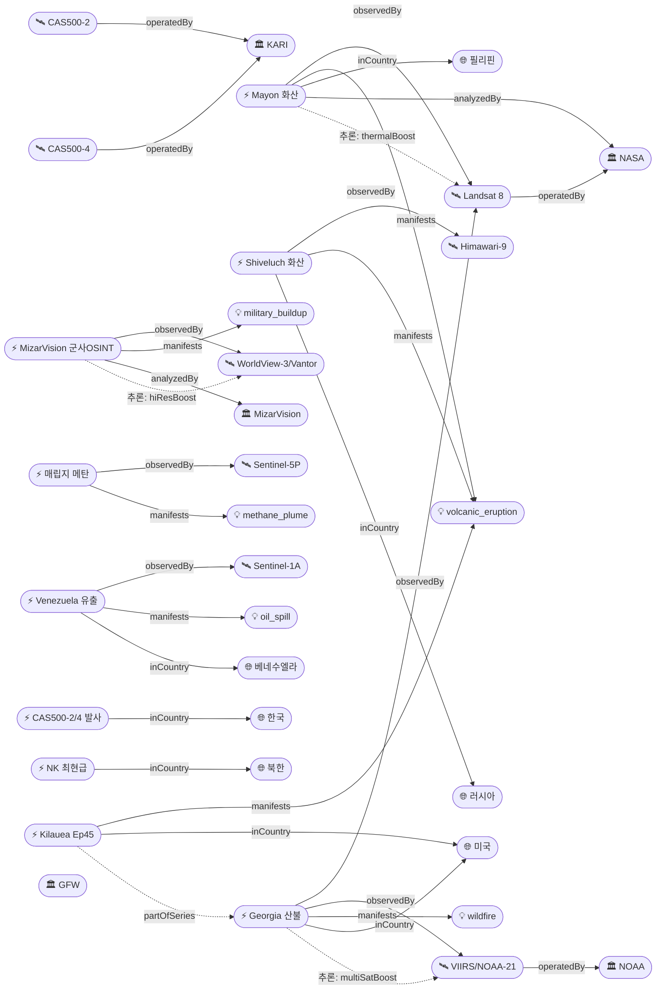

# 2026-05-01 위성영상 관측 이벤트 OSINT 일일 보고서

## 요약

오늘(2026-05-01) 6개 도메인에서 8건의 신규 이벤트와 4건의 후속 업데이트를 수집했다. 자연재해 부문에서는 미국 조지아주 산불이 120+ 주택 파괴(주 역대 최다)로 확대되어 NASA Earth Observatory가 Landsat 8 + VIIRS 다중 위성 영상을 공식 발표했고, 필리핀 Mayon 화산이 Landsat 8 TIRS로 관측된 신규 이벤트로 추가됐으며, 러시아 Shiveluch 화산은 48,000ft 화산재를 분출했다. 국방 부문에서는 중국 AI 스타트업 MizarVision이 상업 위성영상(Vantor/구 Maxar, 0.3m)을 활용해 미군 중동 기지를 AI 자동 분석·공개하고 이란 IRGC가 이를 활용 중이라는 보도가 다수 등장했다. 한반도 GeoFocus 이벤트 5건 중 CAS500-2/4 발사(5월 3일)가 핵심 — KARI 차세대중형위성 2기가 동시 궤도 진입 예정이다.

## 오늘의 핵심 (Top 5)

| 순위 | 이벤트 | 도메인 | 위성·센서 | 지역 | 신뢰도 |
|------|--------|--------|-----------|------|--------|
| 1 | Georgia 산불 50,000+ 에이커, 120+ 주택 파괴 | Disaster | Landsat 8 OLI/TIRS + VIIRS/NOAA-21 | US 조지아 | 0.95 |
| 2 | Mayon 화산 분출 — Landsat 8 열적외 관측 | Disaster | Landsat 8 OLI + TIRS | PH 알바이 | 0.93 |
| 3 | MizarVision AI 군사 OSINT — 미군 중동 기지 추적 | Defense | WorldView-3/Vantor (0.31m) | 중동 (INTL) | 0.88 |
| 4 | Kilauea Ep45 위성 변화 + Ep46 예보 (May 5-9) | Disaster | 위성영상 (USGS) | US 하와이 | 0.92 |
| 5 | 베네수엘라 마라카이보 호수 원유 유출 504건 | HumanActivity | Sentinel-1A C-SAR | VE 술리아 | 0.85 |

## 다중 위성 교차검증 이벤트

금일 신규 교차검증 1건 + 어제 이월 11건 = 누적 12건:

| 이벤트 | 위성 조합 | 운영자 |
|--------|-----------|--------|
| ent-evt-020 Georgia 산불 (**강화**) | Landsat 8 + VIIRS/NOAA-21 | NASA/USGS + NOAA |
| ent-evt-001 영변 UEP | WorldView-3 + PlanetScope | Maxar + Planet |
| ent-evt-002 Sohae 시설 | PlanetScope + WorldView-3 | Planet + Maxar |
| ent-evt-006 Antelope Reef | Sentinel-2A + Sentinel-2B + Vantor | ESA + 상업 |
| ent-evt-008 가자 피해 평가 | WorldView-3 + PlanetScope | Maxar + Planet |
| ent-evt-009 Hektoria 빙하 | Sentinel-1A + Sentinel-2A + Landsat 9 | ESA + NASA/USGS |
| ent-evt-011 전 지구 메탄 | Sentinel-5P TROPOMI + GOSAT | ESA + JAXA |
| ent-evt-012 태풍 Sinlaku | Himawari-9 + GOES-18 | JMA/JAXA + NOAA |
| ent-evt-013 사이클론 Vaianu | GOES-18 + Himawari-9 | NOAA + JMA/JAXA |
| ent-evt-018 CEMS GFM | Sentinel-1A + 1C (+1D) | ESA (3위성) |
| ent-evt-025 Smith Glacier | Sentinel-2A + Landsat 9 | ESA + NASA/USGS |
| ent-evt-027 Svartsengi | Sentinel-1A + Sentinel-2A | ESA (SAR+광학) |

## 한반도 GeoFocus

### 1. CAS500-2/4 동시 발사 (2026-05-03 예정) [신규]
- **출처:** [CAS500-2 & CAS500-4 Falcon 9 Mission](https://nextspaceflight.com/launches/details/8213/) — Next Spaceflight
- **후속:** [NanoAvionics to launch trio of payloads on SpaceX CAS500-2 mission](https://satnews.com/2026/04/29/nanoavionics-to-launch-trio-of-milestone-payloads-on-spacex-cas500-2-mission/) — SatNews, 2026-04-29
- **위성:** CAS500-2 (0.5m 팬크로/2m 다분광), CAS500-4 (5m 광역 120km 스와스 — 농업·산림 전용)
- **발사장:** Vandenberg SFB, SpaceX Falcon 9
- **운영:** KARI (한국항공우주연구원)
- **현상:** construction (위성 인프라 확장)
- **분석:** CAS500-2는 2022년 러시아 발사 취소 이후 4년 만에 재추진. CAS500-4는 작황·수자원·산림 감시에 최적화된 120km 광역 관측 카메라를 탑재하여 농업·해양 도메인에 중요한 데이터 소스가 될 전망. 발사 이틀 후(5월 3일)로 조기 경보.

### 2. 북한 최현급 구축함 IMO 등록 + NLL 위협 [업데이트 ← 2026-04-30]
- **출처:** [북한 최현급 구축함 NLL 위협 분석](https://car.withnews.kr/military/north-korea-navy-choe-hyon-destroyer-nll-threat/comment-page-1) — 위드뉴스
- **위성:** 상업 고해상도 광학 위성 (남포 조선소 크레인 활동)
- **위치:** KP 해군 시설 (lat 39.0, lon 125.8)
- **현상:** naval_movement
- **상태:** 업데이트 ← 2026-04-30 ent-evt-022
- **분석:** 5,000톤급 최현급 3호함이 국제해사기구(IMO)에 북한 군함 최초 공식 등록. NLL 방어선 체계에 전략적 시사점. 10월 진수 목표 유지.

### 3. 추적 중 — 영변 UEP·소해·구성 드론·한국 정찰위성·한반도 산불
- 어제 보고된 5건 (ent-evt-001/002/023/024/014) 금일 추가 소스 없음, 추적 지속.

## 자연재해 (Disaster)

### 1. Georgia 산불 — 50,000+ 에이커, 120+ 주택 파괴 [업데이트 ← 2026-04-30]
- **출처:** [Fires Rage in Georgia](https://science.nasa.gov/earth/earth-observatory/fires-rage-in-georgia/) — NASA Earth Observatory
- **추가 출처:** [Satellite images reveal destruction of Georgia wildfires](https://www.newsweek.com/satellite-images-destruction-georgia-wildfires-11898158) — Newsweek; [April 2026 Wildfires](https://gema.georgia.gov/april-2026-wildfires) — Georgia EMA
- **위성·센서:** Landsat 8 (OLI + TIRS, 30m, false-color bands 7-5-4), VIIRS/NOAA-21 (375m thermal)
- **관측일:** 2026-04-21 (VIIRS), 2026-04-28 시점 Landsat 8
- **위치:** Brantley/Clinch County, Georgia, US (lat 31.2, lon -82.3)
- **현상:** wildfire
- **상태:** 업데이트 ← 2026-04-30
- **분석:** 극심한 가뭄이 수개월간 지속된 조지아 남부에서 Pineland Road Fire(고압선 마일라 풍선 접촉)와 Highway 82 Fire(용접 불꽃)가 4월 18일 이후 동시 확산. Landsat 8 false-color 영상에서 burn scar가 회색, 식생이 녹색, 활성 화재 전선이 오렌지색으로 구분됨. **120+ 주택 파괴 — 조지아주 산불 역사상 최다.** 전후 비교(before/after) 영상 보유.

### 2. Mayon 화산 분출 — 필리핀 [신규]
- **출처:** [Eruption at Mayon](https://science.nasa.gov/earth/earth-observatory/eruption-at-mayon/) — NASA Earth Observatory
- **추가 출처:** [Satellite spies an erupting volcano](https://www.space.com/astronomy/earth/satellite-spies-an-erupting-volcano-space-photo-of-the-day-for-march-13-2026) — Space.com
- **위성·센서:** Landsat 8 (OLI 30m natural-color + TIRS 100m thermal IR overlay)
- **관측일:** 2026-02-26
- **위치:** Mayon Volcano, Albay Province, Philippines (lat 13.257, lon 123.685)
- **현상:** volcanic_eruption
- **상태:** 신규
- **분석:** 2026년 1월 시작된 Mayon 분출이 2월에도 지속. Landsat 8이 구름이 비교적 적은 2월 26일에 용암류·가스·회분을 동시 관측 — 자연색 + 적외선 오버레이로 용암 열 시그니처 확인. PHIVOLCS에 따르면 SO₂ 배출량 일평균 2,466톤, 3월 6일 최고 7,633톤. 분화구 6km 반경 대피 지속 (Tabaco, Malilpot, Camalig). 전후 비교 영상 보유.

### 3. Shiveluch 화산 분출 — 48,000ft 화산재 (캄차카) [신규]
- **출처:** [Shiveluch Volcano ash advisory — FL480](https://www.volcanodiscovery.com/shiveluch/news/299123/vaac-advisory-2026-113.html) — VolcanoDiscovery / VAAC Tokyo
- **추가 출처:** [Shiveluch Apr 29 advisory](https://www.volcanodiscovery.com/shiveluch/news/301022/vaac-advisory-2026-125.html)
- **위성·센서:** Himawari-9 (AHI, 정지궤도 가시광/적외)
- **관측일:** 2026-04-02 (대규모 분출), 4월 25-29일 잔류 화산재
- **위치:** Shiveluch, Kamchatka Krai, Russia (lat 56.65, lon 161.36)
- **현상:** volcanic_eruption
- **상태:** 신규
- **분석:** 4월 2일 대규모 분출로 화산재 기둥이 48,000ft(14,600m)까지 상승, 북동 방향 이동. VAAC Tokyo가 항공 화산재 경보(SIGMET) 발령. 4월 말까지 잔류 화산재가 FL100 수준에서 동쪽으로 지속 확인. 항공 안전에 직접적 위협.

### 4. Kilauea Episode 45 위성 변화 + Episode 46 예보 [업데이트 ← 2026-04-30]
- **출처:** [Satellite imagery showing changes to Kīlauea summit region](https://www.usgs.gov/observatories/hvo/news/photo-video-chronology-april-30-2026-satellite-imagery-showing-changes) — USGS HVO, 2026-04-30
- **추가 출처:** [Kilauea Episode 46 expected May 5-9](https://hawaiivolcanoexpeditions.com/blog/lava-update-the-latest-eruptions-on-the-big-island/)
- **위성·센서:** 위성영상 (USGS 발표), 열영상 오버플라이트
- **관측일:** 2026-04-22 (위성), 2026-04-23 (Episode 45)
- **위치:** Kīlauea summit, Halemaʻumaʻu, Hawaii (lat 19.421, lon -155.287)
- **현상:** volcanic_eruption (partOfSeries: Ep44 → Ep45 → Ep46 예보)
- **상태:** 업데이트 ← 2026-04-30 ent-evt-021
- **분석:** 4월 22일 위성영상에서 Kilauea Military Camp 지붕 위 테프라 퇴적 확인 (Episode 43/44 산물). Episode 45는 4월 23일 1:34am~10:01am HST, 북쪽 분화구에서 최대 270m(900ft) 용암 분수. 단일 채널화된 용암류가 분화구 바닥 중앙에서 분기. **Episode 46 예보: 5월 5-9일** (경사계 데이터 기반). 시계열 시리즈 추적 지속.

## 인간활동 (Human Activity)

### 1. 베네수엘라 마라카이보 호수 원유 유출 — 504건 슬릭 [신규]
- **출처:** [Ecocide in Venezuela: oil, mining and risks](https://globalwitness.org/en/campaigns/fossil-fuels/ecocide-in-venezuela-oil-mining-and-the-risks-of-foreign-investment/) — Global Witness
- **위성·센서:** Sentinel-1A C-band SAR (5m, 해수면 후방산란 감소로 유막 탐지)
- **관측일:** 2025-01 ~ 2026-03 (15개월간 누적)
- **위치:** Lake Maracaibo, Zulia, Venezuela (lat 9.8, lon -71.5)
- **현상:** oil_spill
- **상태:** 신규
- **분석:** Global Witness가 SkyTruth/Cerulean 등 위성 도구를 활용하여 마라카이보 호수에서만 504건의 잠재적 유막 탐지를 확인. 15개월간 만성적 해양 오염이 지속됨을 보여주며, 노후 석유 인프라와 감독 부재가 원인으로 지목됨.

### 2. GFW DIST-ALERT — 전 지구 식생 교란 경보 시스템 [신규]
- **출처:** [Disturbance Alerts for All Vegetation Globally Now on GFW](https://www.globalforestwatch.org/blog/data-and-tools/global-vegetation-disturbance-deforestation-alerts/) — Global Forest Watch
- **추가 출처:** [Drivers of deforestation alerts](https://www.globalforestwatch.org/blog/data-and-tools/drivers-deforestation-alerts/)
- **위성·센서:** Landsat 8/9 (OLI 30m) + Sentinel-2A/B (MSI 10m) 통합
- **관측일:** 2026-01 (시스템 가동)
- **위치:** 전 지구 (tropical focus)
- **현상:** deforestation / ndvi_change
- **분석:** GFW가 DIST-ALERT를 통합 — 기존 삼림에 국한되던 경보를 초원·사바나·습지·농경지까지 확장. Landsat + Sentinel-2 데이터를 결합하여 최조기·최고빈도 식생 교란 신호 제공. AI로 삼림벌채 원인(drivers)을 자동 분류하는 기능도 월별 업데이트 시작.

## 기후·환경 (Climate & Environment)

### 1. 전 지구 매립지 메탄 배출 위성 조사 [신규]
- **출처:** [Global satellite survey reveals uncertainty in landfill methane emissions](https://www.nature.com/articles/s41586-025-09683-8) — Nature
- **위성·센서:** Sentinel-5P TROPOMI (3.5km, XCH₄ 컬럼)
- **관측일:** 2026-04 (논문 발표)
- **위치:** 전 지구 (INTL)
- **현상:** methane_plume
- **분석:** Nature 논문에서 TROPOMI 위성 데이터를 활용한 전 지구 매립지 메탄 배출 조사 결과를 발표. 기존 배출량 추정치에 상당한 불확실성이 있음을 밝힘. 매립지별 배출 패턴의 시공간적 변동성이 기존 인벤토리 방법론의 한계를 보여줌.

### 2. 추적 중 — 전 지구 메탄 증가 추세·Hektoria/Smith 빙하·Climate TRACE
- 어제 보고 ent-evt-011/009/025/010 금일 추가 소스 없음, 추적 지속.

## 농업·해양 (Agriculture & Maritime)

### 1. CAS500-4 농업·산림 전용 관측 위성 발사 [신규]
- 위 한반도 GeoFocus §1 참조. CAS500-4는 120km 스와스의 5m 해상도 광역 카메라로 작황 모니터링, 수자원 관리, 산림 자원 조사에 최적화. 한반도 농업 NDVI 시계열 구축에 중요한 플랫폼.

### 2. Copernicus InSAR 코히런스 변화탐지 서비스 출시 [신규]
- **출처:** [Land Deformation to Change Detection: InSAR Coherence with openEO](https://dataspace.copernicus.eu/news/2026-4-9-land-deformation-change-detection-interferometric-sar-coherence-openeo) — Copernicus Data Space
- **위성·센서:** Sentinel-1 A/C/D (C-band SAR)
- **관측일:** 2026-04-09 (서비스 출시)
- **현상:** 토지 변형 / 식생 변화 / 인프라 변형 감시
- **분석:** openEO 플랫폼에서 Sentinel-1 간섭계 코히런스(coherence) 시계열 생성 서비스 출시. 도시 인프라 모니터링, 지반 침하 탐지, 빙하 이동, 작물 생장 평가, 지진·홍수 후 피해 매핑 등에 활용 가능.

## 국방·안보 (Defense — OSINT 한정)

### 1. MizarVision AI 군사 OSINT — 상업 위성영상으로 미군 기지 추적 [신규]
- **출처:** [MizarVision publishes AI-processed satellite imagery of US military assets](https://defence-industry.eu/mizarvision-publishes-ai-processed-satellite-imagery-of-u-s-military-assets-raising-intelligence-and-security-concerns/) — Defence Industry EU
- **추가 출처:** [Chinese AI startup watching US military assets from space](https://thedefensepost.com/2026/03/12/ai-china-middle-east/) — Defense Post; [Iran uses Chinese AI satellite imagery](https://www.armyrecognition.com/news/army-news/2026/iran-uses-chinese-ai-satellite-imagery-to-target-u-s-bases-in-middle-east) — Army Recognition; [Nowhere to hide](https://breakingdefense.com/2026/04/nowhere-to-hide-iran-war-spotlights-military-challenges-posed-by-space-based-remote-sensing/) — Breaking Defense
- **위성·센서:** WorldView-3/Vantor (구 Maxar Intelligence, 0.31m 광학 팬크로)
- **관측일:** 2026-02~현재 (지속)
- **위치:** 중동 전역 (lat 30.0, lon 47.0 — 일반화)
- **현상:** military_buildup
- **상태:** 신규
- **분석:** 상하이 소재 MizarVision(密匝视觉)이 Weibo·X 등 SNS에 미군 중동 기지의 AI 주석 위성영상을 근-실시간으로 공개. F-22, C2 항공기, 항모전단, 미사일 방어체계 등을 자동 식별·태깅. 미국 DIA에 따르면 이란 IRGC가 이 데이터를 미사일·드론 타격 계획에 활용 중이라 평가. 영상 출처는 미국 기업 Vantor(구 Maxar Intelligence)의 0.3m급 상업 영상으로 추정. **상업 위성영상의 AI 자동 분석이 군사 OSINT를 사실상 민주화/위험화시킨 전환점적 사례.**

### 2. 추적 중 — 영변 UEP·소해·Antelope Reef·우크라이나 GEGD
- 어제 보고 ent-evt-001/002/006/016 금일 추가 소스 없음, 추적 지속.

## 인도주의 (Humanitarian)

금일 신규 이벤트 없음. 어제 보고된 가자(ent-evt-008) 및 레바논(ent-evt-028) 위성 피해 평가 추적 지속. UNOSAT Gaza Governorate 종합 피해 평가 최신본(UNOSAT #4205) 확인됨.

## 센서·플랫폼별 묶음

- **Landsat 8 (OLI + TIRS):** Georgia 산불 burn scar (false-color 7-5-4), Mayon 화산 용암류 열적외 — 2건
- **VIIRS/NOAA-21:** Georgia 산불 열점 탐지 — 1건
- **Sentinel-1 (C-SAR):** 베네수엘라 유막 탐지, Copernicus InSAR 코히런스 서비스 — 2건
- **Sentinel-2 (MSI):** GFW DIST-ALERT 통합 데이터 — 1건
- **Sentinel-5P (TROPOMI):** 매립지 메탄 조사 — 1건
- **Himawari-9 (AHI):** Shiveluch 화산재 감시 — 1건
- **WorldView-3/Vantor:** MizarVision 군사 OSINT — 1건
- **KOMPSAT/CAS500:** CAS500-2/4 발사 예정 (미운용) — 0건 관측

## 전후 비교(before/after) 영상 보유 이벤트

| 이벤트 | 위성 | 비교 내용 |
|--------|------|----------|
| Georgia 산불 (update) | Landsat 8 | false-color burn scar vs 이전 식생 |
| Mayon 화산 (신규) | Landsat 8 | natural-color + IR overlay 용암류 |
| Kilauea Ep45 (update) | 위성+오버플라이트 | 테프라 퇴적 전후 비교 |
| 어제 이월: 영변·소해·Antelope Reef·이란·가자·Hektoria·하와이 홍수·Svartsengi·레바논 | 다중 위성 | 시계열 보유 |

## 미검증 의혹

### 1. 한반도 전국 산불 동시 발생 (2026-04-26) [추적 중]
- **출처:** 뉴스 보도만 (위성 관측 확인 미완)
- **상태:** 위성 출처 미확인 (`satellite_unverified: true`) — 신뢰도 0.50 미만
- **위치:** 대한민국 전역 (lat 36.5, lon 127.8)
- **비고:** FIRMS/MODIS/VIIRS 활성 화재 데이터에서 4월 26일 한반도 화점 확인 시 업그레이드 예정

## 지식그래프

### 오늘의 주요 관계

1. **Georgia 산불 ↔ 다중 위성**: Landsat 8 (NASA/USGS) + VIIRS/NOAA-21 (NOAA) 교차검증 강화, NASA EO 공식 발표로 officialBoost 적용
2. **Mayon 화산 ↔ Landsat 8 TIRS**: 열적외 센서-화산 적합성(thermalBoost), NASA officialBoost
3. **MizarVision ↔ Vantor/WorldView-3**: 중국 AI 스타트업이 미국 상업 위성영상을 분석 — hi-res 군사 적합성(hiResBoost)
4. **CAS500-2/4 ↔ KARI**: 한국 차세대중형위성 확장, koreaBoost
5. **Kilauea Ep45 → partOfSeries → Ep44**: 시계열 시리즈 추론(temporal_progression)
6. **Venezuela 유출 ↔ Sentinel-1 SAR**: SAR 해수면 유막 탐지(sarBoost)

### 전체 지식그래프 시각화

## 온톨로지 변경

| 변경 유형 | 대상 | 근거 |
|----------|------|------|
| 새 국가 | co-ph (필리핀), co-ve (베네수엘라) | Mayon 화산 + Lake Maracaibo 유출 |
| 새 위성 | sat-cas500-2, sat-cas500-4 | KARI 차세대중형위성 May 3 발사 |
| 새 기관 | org-mizarvision, org-vantor, org-phivolcs, org-globalwitness | AI 군사 OSINT + 화산 + 환경 NGO |
| 새 위치 | Mayon Volcano, Shiveluch Volcano, Lake Maracaibo | 3건 |
| 새 이벤트 | ent-evt-029~036 | 8건 |
| 이벤트 업데이트 | ent-evt-019/020/021/022 | 4건 후속 반영 |

## 추론 결과

| 추론 | 신뢰도 | 근거 |
|------|--------|------|
| ent-evt-020 multiSatBoost +0.20 | 0.95 | Landsat 8 (NASA) + VIIRS (NOAA) 교차검증 강화 |
| ent-evt-020 priorityBoost +0.20 | 0.95 | 120+ 주택 파괴 — 인명·재산 피해 |
| ent-evt-029 thermalBoost +0.10 | 0.93 | Landsat 8 TIRS 화산 열 시그니처 |
| ent-evt-029 officialBoost +0.15 | 0.93 | NASA EO 공식 발표 |
| ent-evt-031 hiResBoost +0.15 | 0.80 | Vantor/WV-3 0.31m 군사 장비 식별 |
| ent-evt-034 sarBoost +0.10 | 0.85 | Sentinel-1 SAR 유막 탐지 |
| ent-evt-035 tracegasBoost +0.15 | 0.88 | TROPOMI XCH₄ 매립지 메탄 |
| ent-evt-021 partOfSeries ent-evt-004 | 0.92 | Kilauea Ep44→45→46 시계열 |
| ent-evt-032 koreaBoost +0.10 | 0.95 | KARI CAS500 한국 위성 |

## 분석 및 평가

오늘의 주요 동향은 세 가지다:

**첫째, 화산 활동 집중.** 현재 전 세계 4개 화산(Mayon/PH, Shiveluch/RU, Kilauea/US, Svartsengi/IS)이 동시 모니터링 대상이다. Kilauea는 Episode 46이 5월 5-9일 예보되어 다음 주 핵심 관측 이벤트가 될 전망이다. Mayon은 Landsat 8의 비교적 희귀한 맑은 날 관측을 확보하여 NASA EO가 분석을 발표했다.

**둘째, 상업 위성영상의 군사 OSINT 패러다임 전환.** MizarVision 사례는 상업 위성영상(0.3m)에 AI 자동 객체 인식을 결합하면 국가급 군사 정보 역량에 버금가는 OSINT가 가능함을 보여준다. 이란 IRGC의 타격 계획 활용 의혹은 상업 원격탐사의 이중 용도(dual-use) 딜레마를 극명하게 드러낸다. Vantor(구 Maxar Intelligence)의 분쟁 지역 영상 접근 정책이 다시 조명될 전망이다.

**셋째, 한국 EO 역량 확장.** CAS500-2/4 동시 발사(5월 3일)는 KARI의 차세대중형위성 라인업을 4기(CAS500-1/2/4/5)로 확장한다. 특히 CAS500-4의 120km 광역 농업 관측 카메라는 한반도 작황·산림·수자원 모니터링에 전용 데이터 소스를 제공하게 된다.

## 추적 항목

| 항목 | 최초 보고 | 상태 | 최신 업데이트 |
|------|----------|------|-------------|
| 영변 UEP 완공 (ent-evt-001) | 2026-04-30 | 추적 | — |
| Sohae 시설 확장 (ent-evt-002) | 2026-04-30 | 추적 | — |
| Kilauea 시리즈 (ent-evt-004→021) | 2026-04-30 | 업데이트 | Ep46 예보 May 5-9 |
| Antelope Reef 인공섬 (ent-evt-006) | 2026-04-30 | 추적 | — |
| Hektoria 빙하 (ent-evt-009) | 2026-04-30 | 추적 | — |
| 태풍 Sinlaku (ent-evt-012) | 2026-04-30 | 추적 | — |
| 한반도 산불 미검증 (ent-evt-014) | 2026-04-30 | 미검증 | 위성 출처 미확인 |
| Cerulean 오일 (ent-evt-019) | 2026-04-30 | 업데이트 | NRT 역량 강화 |
| Georgia 산불 (ent-evt-020) | 2026-04-30 | 업데이트 | 120+ 주택 파괴, NASA EO |
| NK 최현급 (ent-evt-022) | 2026-04-30 | 업데이트 | IMO 등록 |
| NK 드론 구성 (ent-evt-023) | 2026-04-30 | 추적 | — |
| Smith Glacier (ent-evt-025) | 2026-04-30 | 추적 | — |
| Svartsengi (ent-evt-027) | 2026-04-30 | 추적 | — |
| Mayon 화산 (ent-evt-029) | 2026-05-01 | 신규 | Landsat 8 관측 |
| Shiveluch 화산 (ent-evt-030) | 2026-05-01 | 신규 | 48,000ft 화산재 |
| MizarVision (ent-evt-031) | 2026-05-01 | 신규 | AI 군사 OSINT |
| CAS500-2/4 (ent-evt-032) | 2026-05-01 | 신규 | May 3 발사 예정 |
| Venezuela 유출 (ent-evt-034) | 2026-05-01 | 신규 | 504건 SAR 탐지 |

## 출처 목록

1. [Eruption at Mayon](https://science.nasa.gov/earth/earth-observatory/eruption-at-mayon/) — NASA Earth Observatory
2. [Satellite spies an erupting volcano](https://www.space.com/astronomy/earth/satellite-spies-an-erupting-volcano-space-photo-of-the-day-for-march-13-2026) — Space.com, 2026-03-13
3. [Shiveluch Volcano ash advisory FL480](https://www.volcanodiscovery.com/shiveluch/news/299123/vaac-advisory-2026-113.html) — VolcanoDiscovery / VAAC Tokyo
4. [Shiveluch Volcano ash advisory Apr 29](https://www.volcanodiscovery.com/shiveluch/news/301022/vaac-advisory-2026-125.html) — VolcanoDiscovery
5. [Satellite imagery showing changes to Kīlauea summit](https://www.usgs.gov/observatories/hvo/news/photo-video-chronology-april-30-2026-satellite-imagery-showing-changes) — USGS HVO, 2026-04-30
6. [Kilauea Episode 46 expected May 5-9](https://hawaiivolcanoexpeditions.com/blog/lava-update-the-latest-eruptions-on-the-big-island/) — Hawaii Volcano Expeditions
7. [Fires Rage in Georgia](https://science.nasa.gov/earth/earth-observatory/fires-rage-in-georgia/) — NASA Earth Observatory
8. [Satellite images reveal destruction of Georgia wildfires](https://www.newsweek.com/satellite-images-destruction-georgia-wildfires-11898158) — Newsweek
9. [April 2026 Wildfires](https://gema.georgia.gov/april-2026-wildfires) — Georgia EMA
10. [MizarVision publishes AI-processed satellite imagery of US military assets](https://defence-industry.eu/mizarvision-publishes-ai-processed-satellite-imagery-of-u-s-military-assets-raising-intelligence-and-security-concerns/) — Defence Industry EU
11. [Chinese AI startup watching US military assets from space](https://thedefensepost.com/2026/03/12/ai-china-middle-east/) — Defense Post
12. [Iran uses Chinese AI satellite imagery to target US bases](https://www.armyrecognition.com/news/army-news/2026/iran-uses-chinese-ai-satellite-imagery-to-target-u-s-bases-in-middle-east) — Army Recognition
13. [Nowhere to hide: Iran war spotlights remote sensing](https://breakingdefense.com/2026/04/nowhere-to-hide-iran-war-spotlights-military-challenges-posed-by-space-based-remote-sensing/) — Breaking Defense
14. [CAS500-2 & CAS500-4 Falcon 9 Mission](https://nextspaceflight.com/launches/details/8213/) — Next Spaceflight
15. [NanoAvionics to launch on SpaceX CAS500-2 mission](https://satnews.com/2026/04/29/nanoavionics-to-launch-trio-of-milestone-payloads-on-spacex-cas500-2-mission/) — SatNews, 2026-04-29
16. [북한 최현급 구축함 NLL 위협](https://car.withnews.kr/military/north-korea-navy-choe-hyon-destroyer-nll-threat/comment-page-1) — 위드뉴스
17. [GFW DIST-ALERT global vegetation disturbance](https://www.globalforestwatch.org/blog/data-and-tools/global-vegetation-disturbance-deforestation-alerts/) — Global Forest Watch
18. [GFW drivers of deforestation alerts](https://www.globalforestwatch.org/blog/data-and-tools/drivers-deforestation-alerts/) — Global Forest Watch
19. [SkyTruth Cerulean — near-real-time oil slick detection](https://skytruth.org/cerulean/) — SkyTruth
20. [Ecocide in Venezuela: oil, mining and risks](https://globalwitness.org/en/campaigns/fossil-fuels/ecocide-in-venezuela-oil-mining-and-the-risks-of-foreign-investment/) — Global Witness
21. [UNDP-UNITAR satellite imagery crisis response](https://www.undp.org/news/satellite-imagery-guides-faster-recovery-crisis-zones) — UNDP
22. [InSAR coherence change detection via openEO](https://dataspace.copernicus.eu/news/2026-4-9-land-deformation-change-detection-interferometric-sar-coherence-openeo) — Copernicus Data Space
23. [Mapping global floods with 10 years SAR data](https://www.nature.com/articles/s41467-025-60973-1) — Nature Communications
24. [Global satellite survey — landfill methane emissions](https://www.nature.com/articles/s41586-025-09683-8) — Nature
25. [UNOSAT Gaza damage assessment](https://unosat.org/products/4205) — UNOSAT
