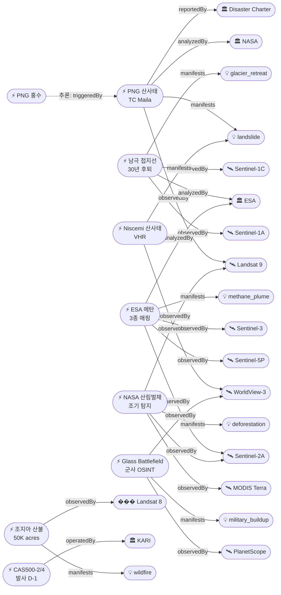

# 2026-05-02 위성영상 관측 이벤트 OSINT 일일 보���서

## 요약

금일 **7건 신규**, **5건 업데이트** 이벤트를 수집했다. 자연재해 도메인이 가장 활발하며, **산사태(landslide) 현상이 최초 2건 동시 등장**했다(PNG 바이닝산맥 + 시칠리아 Niscemi). 다중 위성 교차검증 이벤트 **4건** 확인(남극 접지선 Sentinel-1 A/C, NASA 산림벌채 Landsat 9+Sentinel-2+MODIS, ESA 메탄 Sentinel-5P+2A+3, 상업 군사 OSINT Planet+Maxar). 한반도 GeoFocus로 **CAS500-2/4 발사 D-1**(5월 3일 06:59 UTC 확정). 인도주의·농업해양 신규 이벤트는 금일 없음.

## 오늘의 핵심 (Top 5)

| 순위 | 이벤트 | 도메인 | 위성 | 지역 | 신뢰도 |
|------|--------|--------|------|------|--------|
| 1 | PNG 바이닝산맥 산사태 (TC Maila) | Disaster | Landsat 9 (OLI) | Papua New Guinea (-4.5°, 151.8°) | 0.95 |
| 2 | 남극 30년 접지선 후퇴 종합 연구 | Climate | Sentinel-1A/C (SAR) | Antarctica (-75°, -106°) | 0.93 |
| 3 | 조지아 남부 산불 (업데이트) | Disaster | Landsat 8 (OLI) | USA, Georgia (31.2°, -81.9°) | 0.92 |
| 4 | 시칠리아 Niscemi 산사태 (VHR) | Disaster | WorldView-3 (Maxar) | Italy, Sicily (37.2°, 14.4°) | 0.90 |
| 5 | ESA Sentinel 3종 메탄 초대량 배출원 매핑 | Climate | Sentinel-5P + 2A + 3 | Global | 0.90 |

## 다중 위성 교차검증 이벤트

### 1. 남극 30년 접지선 후퇴 (ent-evt-042)
- **위성:** Sentinel-1A + Sentinel-1C (SAR C-band, ESA)
- **multiSatBoost +0.20** — 2개 독립 SAR 플랫폼으로 30년 grounding line 후퇴 검증
- 12,800 km² 빙하 손실 (벨기에 절반 규모), Smith Glacier 42km 최대 후퇴

### 2. NASA 다중위성 조기 산림벌채 탐지 (ent-evt-045)
- **위성:** Landsat 9 (USGS/NASA) + Sentinel-2A (ESA) + MODIS Terra (NASA)
- **multiSatBoost +0.20** — 3개 위성, 2개 독립 운영기관 교차 관측
- 기존 방법 대비 100일 앞서 산림 벌채 탐지

### 3. ESA 메탄 3종 위성 매핑 (ent-evt-046)
- **위성:** Sentinel-3A/B (광역 스크리닝) + Sentinel-5P TROPOMI (중해상도) + Sentinel-2A MSI (고해상도 포인트 소스)
- **multiSatBoost +0.20** — 3단계 tiered 접근으로 메탄 초대량 배출원 체계적 매핑

### 4. 상업 위성 군사 전략 분석 (ent-evt-043)
- **위성:** PlanetScope (Planet) + WorldView-3 (Maxar)
- **multiSatBoost +0.20** — 2개 독립 상업 운영자 교차 확인

## 한반도 GeoFocus

### CAS500-2/4 발사 D-1 (2026-05-03 06:59 UTC)
- **출처:** [Falcon 9 launch of South Korea's CAS500-2 scheduled for early Sunday morning](https://keyt.com/vandenberg-space-base/2026/05/01/falcon-9-launch-of-south-koreas-cas500-2-scheduled-for-early-sunday-morning/)
- **위성:** CAS500-2 (0.5m 팬크로/2m 컬러, AEISS-C) + CAS500-4 (5m 광대역 120km 스와스, 농업·산림 전용)
- **발사체:** SpaceX Falcon 9, SLC-4E Vandenberg SFB
- **상태:** 업데이트 ← 2026-05-01 "CAS500-2/4 발사 예정"
- **분석:** 발사 시각이 확정(06:59 UTC, 5월 3일)되었다. CAS500-2는 0.5m 해상도로 한반도 정밀 관측, CAS500-4는 120km 광역 스와스로 농업·산림 모니터링을 담당한다. 45개 페이로드 동반 탑재. 성공 시 KARI 차세대중형위성 시리즈 3개(CAS500-1/2/4) 운용 체계 완성.

*기존 추적 항목:* KOMPSAT-7 (0.3m, 2025-12 발사) 한반도 영상 제공 시작, 5기 정찰위성 체계 구축 진행 중. 금일 한반도 자연재해·안보 관련 신규 위성영상 이벤트 없음.

## 자연재해 (Disaster)

### 1. 파푸아뉴기니 바이닝산맥 산사태 — TC Maila (신규)
- **출처:** [Cyclone Rains Spur Papua New Guinea Landslides](https://science.nasa.gov/earth/earth-observatory/cyclone-rains-spur-papua-new-guinea-landslides/) — NASA Earth Observatory
- **위성·센서:** Landsat 9 (OLI 30m)
- **관측일:** 2026-04-20 (전후 비교: 2025-09-24 vs 2026-04-20)
- **위치:** Baining Mountains, East New Britain, Papua New Guinea (-4.48°, 151.81°)
- **현상:** landslide + flood (cascading)
- **상태:** 신규
- **분석:** 열대사이클론 마일라(TC Maila, Category 4 AU scale)가 4월 9일 전후 PNG 동부에 수백 mm 강우를 쏟으며 바이닝산맥에서 대규모 산사태를 유발했다. 최소 25명 사망. Landsat 9 전후 비교 영상에서 밀림을 가로지르는 갈색 토사 노출 지대가 선명히 확인된다. **International Disaster Charter 발동**. NASA LHASA 모델이 사전에 높은 경사 붕괴 위험을 식별. TC Maila는 PNG 기상청 역사상 가장 강력한 사이클론으로 기록되었다.
- **전후 비교:** ✅ 가용 (Sep 2025 vs Apr 2026)

### 2. 조지아 남부 산불 — 업데이트 (50,000+ acres, 120+ homes)
- **출처:** [Fires Rage in Georgia](https://science.nasa.gov/earth/earth-observatory/fires-rage-in-georgia/) — NASA Earth Observatory
- **위성·센서:** Landsat 8 (OLI, bands 7-5-4 false color)
- **관측일:** 2026-04-23
- **위치:** Brantley/Clinch County, Georgia, USA (31.22°, -81.85°)
- **현상:** wildfire
- **상태:** 업데이트 ← 2026-04-30 "조지아 남부 산불"
- **분석:** NASA EO가 Landsat 8 거짓색 합성 영상을 공개했다. Highway 82 Fire(4월 18일 용접 작업 발화) + Pineland Road Fire(4월 23일 마일러 풍선 송전선 접촉 발화)가 합쳐져 50,000+ acres 소실, **120+ 가옥 파괴 — 조지아 역사상 최다**. 극심한 가뭄(20년 만 최악)과 허리케인 헬렌 잔해가 확산을 가속했다.
- **전후 비교:** ✅ 가용

### 3. Kīlauea 화산 — Episode 46 예측 May 5-8 (업데이트)
- **출처:** [USGS HVO Volcano Notice — May 2, 2026](https://volcanoes.usgs.gov/hans-public/notice/DOI-USGS-HVO-2026-05-02T15:56:11+00:00)
- **위성·센서:** 위성/InSAR 모니터링 (USGS)
- **관측일:** 2026-05-02
- **위치:** Kīlauea summit, Halemaʻumaʻu, Hawaii (19.42°, -155.29°)
- **현상:** volcanic_eruption
- **상태:** 업데이트 ← 2026-05-01 "Kilauea Episode 45"
- **분석:** 분출 현재 일시 중지. Episode 45(4월 23일, 8.5시간, 900ft 용암 분수) 이후 11.0 µrad 팽창 경사 축적. SO₂ 1,000-5,000 t/day. **Episode 46 예측창: 5월 5-8일**. 웹캠에서 남북 분화구 모두 적열 관측. 경고 레벨 ADVISORY.

### 4. 시칠리아 Niscemi 대규모 산사태 — VHR 전후 비교 (신규)
- **출처:** [VHR Satellite Images Show Damage After Niscemi Landslide](https://www.euspaceimaging.com/blog/2026/02/06/satellite-images-niscemi-landslide/) — European Space Imaging
- **위성·센서:** WorldView-3급 VHR 위성 (0.31m)
- **관측일:** 2026-02-06 (전후 비교: 2025-09 vs 2026-02)
- **위치:** Niscemi, Sicily, Italy (37.15°, 14.39°)
- **현상:** landslide
- **상태:** 신규
- **분석:** 2026년 1월 사이클론 해리가 48시간에 300mm 이상 폭우를 쏟으며 시칠리아 Niscemi에서 4km 규모의 대규모 산사태가 발생했다. 1,500명 대피, 15억 유로 피해. VHR 위성 영상의 전후 비교(Sep 2025 vs Feb 2026)에서 건물 기초 침하, 인장 균열, 소규모 급경사면 등 불안정 징후가 식별되었다. NDVI 분석으로 식생 피해 범위도 확인.
- **전후 비교:** ✅ 가용 (Sep 2025 vs Feb 2026)

### 5. Mayon 화산 — Alert Level 3, SO₂ 2,147 t/day (업데이트)
- **출처:** [1 May 2026 — Volcano Earth](https://volcanoearth.wordpress.com/2026/05/01/1-may-2026/) / PHIVOLCS
- **위성·센서:** Landsat 8 (OLI/TIRS, 2월 관측)
- **관측일:** 2026-05-01
- **위치:** Mayon Volcano, Albay Province, Philippines (13.26°, 123.69°)
- **현상:** volcanic_eruption
- **상태:** 업데이트 ← 2026-05-01 "Mayon 화산 분출"
- **분석:** PHIVOLCS Alert Level 3 유지. SO₂ 2,147 t/day. 3개 골짜기에서 용암 유출 지속. 39건 화산 지진, 21건 tremor. 분화구 야간 적열 관측.

### 6. Sheveluch 화산 — 용암돔 성장 지속 (업데이트)
- **출처:** [GVP Report on Sheveluch](https://volcano.si.edu/showreport.cfm?wvar=GVP.WVAR20260226-300270) — Smithsonian/KVERT
- **위성·센서:** 위성 열이상 관측 (daily thermal anomaly)
- **관측일:** 2026-05-01
- **위치:** Sheveluch, Kamchatka, Russia (56.65°, 161.36°)
- **현상:** volcanic_eruption
- **상태:** 업데이트 ← 2026-05-01 "Shiveluch 48,000ft 화산재"
- **분석:** KVERT Aviation Color Code Orange 유지. 북쪽 돔에서 새 용암 블록 성장. 위성에서 일일 열이상 탐지. 2025년 12월 이후 새 돔 압출 시작.

### 7. 전 세계 활화산 종합 현황 (신규 — Sabancaya, Fuego, Merapi)
- **출처:** [1 May 2026 — Volcano Earth](https://volcanoearth.wordpress.com/2026/05/01/1-may-2026/)
- **위성·센서:** Sentinel-2 (열이상), Himawari/GOES (화산재), 현지 관측
- **관측일:** 2026-05-01
- 🔸 **Sabancaya (Peru, -15.78°, -71.85°):** Orange alert, 화산재 1,700m, 열이상 1MW, 7건 마그마성 지진
- 🔸 **Fuego (Guatemala, 14.47°, -90.88°):** 시간당 2-5회 폭발, 4,800m 화산재 기둥, 화쇄류 다방향 하강
- 🔸 **Merapi (Indonesia, -7.54°, 110.45°):** Level III, 용암 사태 1,900m, 126건 사태 지진

## 인간활동 (Human Activity)

### 1. NASA 다중위성 조기 산림벌채 탐지 시스템 (신규)
- **출처:** [Faster Detection of Forest Loss](https://science.nasa.gov/earth/earth-observatory/faster-detection-of-forest-loss/) — NASA Earth Observatory
- **위성·센서:** Landsat 9 (OLI) + Sentinel-2A (MSI) + MODIS Terra
- **관측일:** 2026-05
- **위치:** 전 지구 열대림 (0°, -60°)
- **현상:** deforestation
- **상태:** 신규
- **분석:** NASA가 3개 위성(Landsat, Sentinel-2, MODIS) 데이터를 결합해 기존 방법 대비 **100일 앞서** 산림 벌채를 탐지하는 새 시스템을 개발했다. 열대림 보호 조기경보 역량을 대폭 강화한다. GFW DIST-ALERT(Landsat+Sentinel-2 기반)와 상호보완적.

## 기후·환경 (Climate & Environment)

### 1. 남극 30년 접지선 후퇴 종합 연구 — ESA Sentinel-1 SAR (신규)
- **출처:** [Antarctica retreat study signals future ice loss](https://www.esa.int/Applications/Observing_the_Earth/Copernicus/Sentinel-1/Antarctica_retreat_study_signals_future_ice_loss) — ESA
- **위성·센서:** Sentinel-1A + Sentinel-1C (C-band SAR, 5m)
- **관측일:** 2026-03-01 (1996-2025 데이터)
- **위치:** Antarctica, 특히 Amundsen Sea 연안 (-75°, -106°)
- **현상:** glacier_retreat
- **상태:** 신규
- **분석:** ESA Copernicus Sentinel-1 SAR 기반 30년 종합 연구에서 남극 전체 **12,800 km² 빙하 손실**(벨기에 절반 규모)을 확인했다. Smith Glacier 42km, Pine Island Glacier 33km, Thwaites Glacier 26km 후퇴. Amundsen Sea 연안이 가장 취약하며, 따뜻한 환극심층수(Circumpolar Deep Water)가 해저 채널을 통해 빙하 바닥에 도달하여 후퇴를 촉진한다. 해수면 상승 기여도 산정에 핵심.
- **전후 비교:** ✅ 가용 (30년 시계열)

### 2. ESA Sentinel 3종 위성 메탄 초대량 배출원 매핑 (신규)
- **출처:** [Trio of Sentinel satellites map methane super-emitters](https://www.esa.int/Applications/Observing_the_Earth/Copernicus/Trio_of_Sentinel_satellites_map_methane_super-emitters) — ESA
- **위성·센서:** Sentinel-3A/B (광역 스크리닝) → Sentinel-5P TROPOMI (중해상도 확인) → Sentinel-2A MSI (고해상도 포인트 소스)
- **관측일:** 2026-04
- **위치:** 전 지구
- **현상:** methane_plume
- **상태:** 신규
- **분석:** ESA가 Sentinel 위성 3종을 3단계(tiered) 접근으로 조합하여 메탄 초대량 배출원을 체계적으로 매핑하는 시스템을 발표했다. SRON(네덜란드 우주연구소)의 ML 자동 플룸 탐지 알고리즘이 핵심. UN MARS(Methane Alert and Response System)도 Sentinel-5P 일일 관측을 활용한다.

## 농업·해양 (Agriculture & Maritime)

금일 위성영상 관측 기반 신규 농업·해양 이벤트 없음. CAS500-4(120km 광역, 농업·산림 전용)가 5월 3일 발사 예정으로, 성공 시 한반도 농업 NDVI/작황 모니터링 역량이 대폭 강화될 전망.

## 국방·안보 (Defense — OSINT 한정)

### 1. 상업 위성영상의 군사 전략 변화 — "Glass Battlefield" (신규)
- **출처:** [The Glass Battlefield: Commercial Imagery and the Iran-Israel Conflict](https://www.meforum.org/military-and-strategic-programs/g2-briefings/the-glass-battlefield-commercial-imagery-and-the-new-strategic-realities-of-the-iran-israel-conflict) — Middle East Forum
- **위성·센서:** PlanetScope (Planet, 3m 일일) + WorldView-3 (Maxar, 0.31m)
- **관측일:** 2026-04
- **위치:** 중동 (32°, 51°)
- **현상:** military_buildup
- **상태:** 신규 (MizarVision 관련 후속 분석)
- **분석:** Planet 일일 글로벌 스캔 + Maxar 고해상도 태스킹의 조합이 대규모 재래식 작전의 전략적 기습을 사실상 불가능하게 만들었다는 종합 분석. MizarVision 등 AI OSINT가 소수 인력으로 국가 정보기관 수준의 위성영상 분석을 수행하는 시대를 조명한다.

## 인도주의 (Humanitarian)

금일 위성영상 관측 기반 신규 인도주의 이벤트 없음. 기존 추적: 가자지구 종합 피해 평가(UNOSAT), 레바논 인프라 파괴 관측 지속 중.

## 센서·플랫폼별 묶음

- **Sentinel-1 (SAR):** 남극 30년 접지선 후퇴 연구 (Sentinel-1A + 1C)
- **Sentinel-2 (광학):** ESA 메탄 매핑 포인트 소스 확인 (MSI), NASA 산림벌채 탐지 (MSI)
- **Sentinel-3 (해색/열적외):** ESA 메탄 매핑 광역 스크리닝
- **Sentinel-5P (가스):** ESA 메탄 초대량 배출원 매핑 (TROPOMI)
- **Landsat 8/9:** PNG 산사태 전후비교 (Landsat 9 OLI), 조지아 산불 (Landsat 8 OLI), NASA 산림벌채 탐지
- **MODIS / VIIRS:** NASA 산림벌채 탐지 (MODIS)
- **Planet (PlanetScope):** 상업 군사 OSINT 분석
- **Maxar (WorldView-3):** 시칠리아 Niscemi 산사태 VHR 전후비교, 상업 군사 OSINT 분석
- **KOMPSAT/CAS500:** CAS500-2/4 발사 D-1 (5월 3일 확정)

## 전후 비교(before/after) 영상 보유 이벤트

| 이벤트 | 위성 | Before | After |
|--------|------|--------|-------|
| PNG 바이닝산맥 산사태 (ent-evt-037) | Landsat 9 | 2025-09-24 | 2026-04-20 |
| 시칠리아 Niscemi 산사태 (ent-evt-044) | WorldView-3 VHR | 2025-09 | 2026-02 |
| 남극 30년 접지선 후퇴 (ent-evt-042) | Sentinel-1 SAR | 1996 | 2025 |

## 미검증 의혹

금일 모든 신규 이벤트에 위성 출처가 확인되었다. 미검증 의혹 항목 없음.

## 지식그래프

### 오늘의 주요 관계
- **phen-landslide 첫 활성화:** 2건의 산사태 이벤트(PNG, Niscemi)가 처음으로 매핑되었다
- **cascading disaster 추론:** TC Maila → 산사태 → 홍수 인과 사슬 (PNG)
- **다중위성 교차검증 4건:** 남극(SAR), 산림벌채(Landsat+Sentinel-2+MODIS), 메탄(Sentinel 3종), 군사(Planet+Maxar)
- **시계열 연결:** ESA 30년 남극 연구 → Smith Glacier 기존 관측 확장

### 전체 지식그래프 시각화

## 온톨로지 변경

| 변경 유형 | 대상 | 근거 |
|----------|------|------|
| 새 Country | PG (파푸아뉴기니), PE (페루), GT (과테말라) | TC Maila + Sabancaya + Fuego |
| phen-landslide 활성화 | mention 0→2 | PNG 산사태 + Niscemi 산사태 — 최초 매핑 |
| 새 Event | ent-evt-037~046 (10건) | 신규 이벤트 |
| 이벤트 업데이트 | ent-evt-020/021/029/030/032 (5건) | 후속 보도 반영 |
| 새 Location | Baining Mountains (PNG), Niscemi (Sicily) | 신규 위치 2건 |

## 추론 결과

| 추론 | 신뢰도 | 근거 |
|------|--------|------|
| ent-evt-042 multiSatBoost +0.20 | 0.93 | Sentinel-1A + 1C SAR 다중 플랫폼 |
| ent-evt-045 multiSatBoost +0.20 | 0.88 | Landsat 9 + Sentinel-2A + MODIS (3위성, 2기관) |
| ent-evt-046 multiSatBoost +0.20 | 0.90 | Sentinel-5P + 2A + 3 (3종 tiered) |
| ent-evt-043 multiSatBoost +0.20 | 0.82 | Planet + Maxar (독립 상업) |
| ent-evt-042 sarBoost +0.10 | 0.93 | SAR × 빙하 접지선 |
| ent-evt-046 tracegasBoost +0.15 | 0.95 | TROPOMI × 메탄 초대량 배출 |
| ent-evt-043 hiResBoost +0.15 | 0.80 | WorldView-3 (0.31m) × 군사 |
| ent-evt-038 triggeredBy ent-evt-037 | 0.85 | TC Maila → 산사태 → 홍수 (PNG) |
| ent-evt-042 partOfSeries ent-evt-025 | 0.85 | Smith Glacier 시계열 연결 |
| ent-evt-020 priorityBoost +0.20 | 0.92 | 120+ 가옥 파괴 고위험 재해 |

## 분석 및 평가

금일 수집된 이벤트는 **자연재해 도메인이 가장 활발**하다. 특히 산사태(landslide) 현상이 파이프라인 운영 3일 만에 처음 실제 이벤트로 매핑되었다 — PNG 열대사이클론 유발 산사태와 이탈리아 폭풍 유발 산사태가 동시에 등장하여, 위성영상이 원격 재해 피해 평가에 핵심 역할을 한다는 점을 다시 확인했다. 기후·환경 도메인에서는 ESA의 30년 남극 SAR 연구와 메탄 3종 위성 매핑이 장기·광역 위성 모니터링의 가치를 보여준다. 국방·안보에서 "Glass Battlefield" 분석은 상업 위성영상이 전쟁의 투명성을 근본적으로 변화시키고 있음을 조명한다. 한반도 관련으로는 CAS500-2/4 발사 D-1이 가장 주목할 이벤트이며, 성공 시 KARI 관측 위성 포트폴리오가 한 단계 도약한다.

## 추적 항목

| 항목 | 최초 보고 | 상태 | 최신 업데이트 |
|------|----------|------|-------------|
| Kilauea 에피소드 분출 | 2026-04-30 | 활성 추적 | Episode 46 예측 May 5-8 |
| 조지아 산불 | 2026-04-30 | 활성 추적 | NASA EO Landsat 8 영상 확인, 50K+ acres |
| Mayon 화산 분출 | 2026-05-01 | 활성 추적 | Alert 3, SO₂ 2,147 t/day |
| Sheveluch 화산 | 2026-05-01 | 활성 추적 | 용암돔 성장 지속, Aviation Orange |
| CAS500-2/4 발사 | 2026-05-01 | 활성 추적 | D-1, May 3 06:59 UTC 확정 |
| MizarVision AI 군사 OSINT | 2026-05-01 | 활성 추적 | "Glass Battlefield" 후속 분석 |
| 남극 빙하 후퇴 | 2026-04-30 | 활성 추적 | ESA 30년 접지선 종합 연구 추가 |
| 가자지구 UNOSAT 피해 평가 | 2026-04-30 | 활성 추적 | 변동 없음 |

## 출처 목록

1. [Cyclone Rains Spur Papua New Guinea Landslides](https://science.nasa.gov/earth/earth-observatory/cyclone-rains-spur-papua-new-guinea-landslides/) — NASA Earth Observatory, 2026-05-01
2. [Fires Rage in Georgia](https://science.nasa.gov/earth/earth-observatory/fires-rage-in-georgia/) — NASA Earth Observatory, 2026-04-29
3. [Kīlauea Volcano Notice — May 2, 2026](https://volcanoes.usgs.gov/hans-public/notice/DOI-USGS-HVO-2026-05-02T15:56:11+00:00) — USGS HVO
4. [1 May 2026 — Global Volcano News](https://volcanoearth.wordpress.com/2026/05/01/1-may-2026/) — Volcano Earth (PHIVOLCS, KVERT, IG-EPN, INSIVUMEH, BPPTKG)
5. [Falcon 9 launch of CAS500-2](https://keyt.com/vandenberg-space-base/2026/05/01/falcon-9-launch-of-south-koreas-cas500-2-scheduled-for-early-sunday-morning/) — KEYT News
6. [SpaceX CAS500-2 Mission](https://www.space.com/space-exploration/launches-spacecraft/spacex-falcon-9-launch-cas500-2-mission-45-satellites) — Space.com
7. [Antarctica retreat study signals future ice loss](https://www.esa.int/Applications/Observing_the_Earth/Copernicus/Sentinel-1/Antarctica_retreat_study_signals_future_ice_loss) �� ESA
8. [Antarctica has lost 10× Greater Los Angeles in ice](https://news.uci.edu/2026/03/02/antarctica-has-lost-10-times-the-size-of-greater-los-angeles-in-ice-over-30-years/) — UC Irvine
9. [The Glass Battlefield](https://www.meforum.org/military-and-strategic-programs/g2-briefings/the-glass-battlefield-commercial-imagery-and-the-new-strategic-realities-of-the-iran-israel-conflict) — Middle East Forum
10. [VHR Satellite Images Show Niscemi Landslide](https://www.euspaceimaging.com/blog/2026/02/06/satellite-images-niscemi-landslide/) — European Space Imaging
11. [Faster Detection of Forest Loss](https://science.nasa.gov/earth/earth-observatory/faster-detection-of-forest-loss/) — NASA Earth Observatory
12. [Trio of Sentinel satellites map methane super-emitters](https://www.esa.int/Applications/Observing_the_Earth/Copernicus/Trio_of_Sentinel_satellites_map_methane_super-emitters) — ESA
13. [GVP Report on Sheveluch](https://volcano.si.edu/showreport.cfm?wvar=GVP.WVAR20260226-300270) — Smithsonian/KVERT
14. [Tropical Cyclone Maila triggers deadly landslides — PNG](https://watchers.news/2026/04/13/tropical-cyclone-maila-deadly-landslides-severe-flooding-bougainville-eastern-papua-new-guinea-april-2026/) — The Watchers
15. [Disaster Charter activation for PNG](https://disasterscharter.org/activations/flood-in-papua-new-guinea-activation-1027-) — International Charter
16. [2026 Georgia wildfires](https://en.wikipedia.org/wiki/2026_Georgia_wildfires) — Wikipedia
17. [Satellite images reveal destruction of Georgia wildfires](https://www.newsweek.com/satellite-images-destruction-georgia-wildfires-11898158) — Newsweek
18. [VSFB to support CAS500-2 launch](https://www.vandenberg.spaceforce.mil/News/Article-Display/Article/4476202/vsfb-to-support-midnight-launch-and-landing-may-2-3/) — Vandenberg SFB
