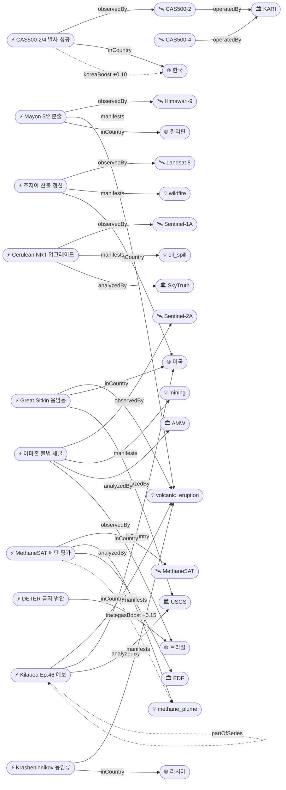

# 2026-05-03 위성영상 관측 이벤트 OSINT 일일 보고서

## 요약

금일 25건 수집, **신규 8건 + 업데이트 5건** 보고. 자연재해 도메인에서 화산 활동이 집중 — Great Sitkin(Alaska)·Krasheninnikov(Kamchatka) 위성 열이상이 신규 포착되었고, Kīlauea Episode 46 예보(5/4-7), Mayon 5/2 분출(Himawari-9 관측)이 갱신됨. 기후·환경에서는 **MethaneSAT의 최초 글로벌 석유·가스 메탄 배출 평가**(EPA 추정치 4배 초과)가 가장 큰 신호. 인간활동에서는 아마존 불법 금 채굴 AI 탐지(6,000ha)와 브라질 DETER 위성 감시 금지 법안이 중요. 한반도 GeoFocus로 **CAS500-2/4 Falcon 9 발사 성공** — 스발바르 첫 교신 확인.

## 오늘의 핵심 (Top 5)

| 순위 | 이벤트 | 도메인 | 위성/센서 | 지역 | 신뢰도 |
|------|--------|--------|-----------|------|--------|
| 1 | MethaneSAT 글로벌 메탄 평가 — EPA 4배 초과 | 기후·환경 | MethaneSAT (trace_gas) | 전 지구 45개 유전 | 0.90 |
| 2 | CAS500-2/4 발사 성공 (Falcon 9) | 농업·해양 | CAS500-2 (0.5m) / CAS500-4 (5m) | 한국/Vandenberg | 0.95 |
| 3 | 아마존 불법 금 채굴 6,000ha AI 탐지 | 인간활동 | Sentinel-2A (MSI 10m) | 브라질 아마존 | 0.90 |
| 4 | Kīlauea Episode 46 예보 (May 4-7) | 자연재해 | USGS 지상관측+위성 | Hawaii, US | 0.92 |
| 5 | Mayon 화산 5/2 분출 — Himawari-9 VAAC | 자연재해 | Himawari-9 (GEO) | Albay, 필리핀 | 0.85 |

## 다중 위성 교차검증 이벤트

금일 신규 이벤트 중 2개 이상 독립 위성으로 교차검증된 건은 없음. MethaneSAT 관측은 기존 TROPOMI/GOSAT 데이터(ent-evt-035, 5/1 보고)와 동일 현상(전 지구 메탄 배출)을 독립적으로 확인하나, 동일 이벤트(동일 시간·위치)가 아니므로 multiSatBoost 미적용.

## 한반도 GeoFocus (KOMPSAT 우선 + 동·서·남해)

### 1. CAS500-2/4 Falcon 9 발사 성공
- **출처:** [Seoul Economic Daily](https://en.sedaily.com/technology/2026/05/03/breaking-news-falcon-9-rocket-carrying-koreas-cas500-2)
- **위성·센서:** CAS500-2 (0.5m B/W, 2m color 광학), CAS500-4 (5m 광대역 120km swath, 농업·산림 전용)
- **관측일:** 2026-05-03 07:00 UTC
- **위치:** Vandenberg SFB, California, US → 궤도 투입 후 한반도 관측 임무
- **상태:** 업데이트 ← 2026-05-02 "CAS500-2/CAS500-4 launch May 3 scheduled"
- **분석:** SpaceX Falcon 9에서 44개 부수 탑재체와 함께 발사. 534kg CAS500-2는 분리 약 75분 후 노르웨이 스발바르 지상국과 첫 교신 성공, 시스템 정상 가동 확인. 초기 운영 후 2026년 하반기부터 본격 임무 — 국토·자원 관리, 재해재난 대응, 국가 공간정보 활용. CAS500-4는 120km 관측폭의 광대역 다분광으로 작황·산림·수자원 모니터링 전용. 이로써 KARI 차세대중형위성 시리즈 운용 위성 2기(CAS500-1, CAS500-2) + 농업 전용 1기(CAS500-4)로 확대. koreaBoost +0.10 적용.

## 자연재해 (Disaster)

### 1. Kīlauea Episode 46 예보 — May 4-7 (USGS HVO)
- **출처:** [USGS HVO](https://volcanoes.usgs.gov/hans-public/notice/DOI-USGS-HVO-2026-05-03T16:14:57+00:00)
- **위성·센서:** USGS 지상 관측(틸트미터, 지진계, 웹캠) + 위성 보조
- **관측일:** 2026-05-03
- **위치:** Kīlauea summit, Halemaʻumaʻu, Hawaii, US (19.421, -155.287)
- **현상:** volcanic_eruption
- **상태:** 업데이트 ← 2026-05-02 "Episode 46 forecast May 5-8"
- **분석:** 분출 일시 중단 상태. 남쪽 분출구에서 지속적 발광·화염 버스트·간헐적 고농도 가스 배출 관측. 지진 트레머 소폭 감소 추세이나 지진 활동은 여전히 고수준. 예보 창이 5-8→4-7로 앞당겨짐. 2024년 12월 23일 이후 에피소드 분출 지속 중(Ep.44→45→46 예정). officialBoost +0.15 적용.

### 2. Mayon 화산 5월 2일 분출 — Himawari-9 VAAC 권고
- **출처:** [VolcanoDiscovery](https://www.volcanodiscovery.com/mayon/news/301257/vaac-advisory-2026-554.html)
- **위성·센서:** Himawari-9 (GEO, 열적외/가시광)
- **관측일:** 2026-05-02 07:29 UTC
- **위치:** Mayon Volcano, Albay Province, 필리핀 (13.257, 123.685)
- **현상:** volcanic_eruption
- **상태:** 업데이트 ← 2026-05-02 "Mayon Alert Level 3, SO₂ 2,147 t/day"
- **분석:** 도쿄 VAAC이 Himawari-9 위성 데이터 기반 화산재 권고 발행(FL060, WSW 확장). 위성 데이터에서 화산재 식별은 불가했으나 분출 확인. 용암류 길이: Basud Gully 3.8km (E), Bonga 3.2km (SE), Mi-isi 1.6km (S). PHIVOLCS Alert Level 3 유지.

### 3. Great Sitkin 화산 용암돔 성장 — 위성 열이상 (Alaska)
- **출처:** [USGS AVO](https://volcanoes.usgs.gov/hans-public/notice/DOI-USGS-AVO-2026-05-03T19:45:30+00:00)
- **위성·센서:** 위성 열적외 관측 (MODIS/VIIRS 추정) + 지진계
- **관측일:** 2026-05-03
- **위치:** Great Sitkin Island, Aleutian Islands, Alaska, US (52.076, -176.131)
- **현상:** volcanic_eruption
- **상태:** 신규
- **분석:** Great Sitkin 정상 칼데라 내 완만한 용암 분출 지속. 지진 데이터로 용암돔 낙석 감지. 위성 영상에서 약간 상승된 지표면 온도 확인. 항공 색상 코드 ORANGE. 유의미한 화산재 배출 없음. officialBoost +0.15 적용.

### 4. Krasheninnikov 화산 용암류 — 위성 일별 열이상 (Kamchatka)
- **출처:** [Smithsonian GVP](https://volcano.si.edu/volcano.cfm?vn=300190)
- **위성·센서:** 위성 열적외 관측 (일별 대형 열이상 식별)
- **관측일:** 2026-04-22~29
- **위치:** Krasheninnikov Volcano, Kamchatka, 러시아 (54.593, 160.273)
- **현상:** volcanic_eruption
- **상태:** 신규
- **분석:** KVERT 보고: 북부 원뿔 ENE/E 사면으로 용암류 유출 지속 (4/22-29). 위성 영상에서 매일 대형 열이상 식별. 항공 색상 코드 Yellow.

### 5. 조지아 남부 산불 — 봉쇄율 갱신
- **출처:** [2026 Georgia wildfires - Wikipedia](https://en.wikipedia.org/wiki/2026_Georgia_wildfires)
- **위성·센서:** Landsat 8 (OLI, bands 7-5-4 false color)
- **관측일:** 2026-05-03
- **위치:** Brantley/Clinch/Atkinson County, Georgia, US (31.2, -82.3)
- **현상:** wildfire
- **상태:** 업데이트 ← 2026-05-02 "Fires Rage in Georgia — NASA EO Landsat 8 update"
- **분석:** Pineland Road Fire 32,575에이커 44% 봉쇄, Highway 82 Fire 22,532에이커 64% 봉쇄 (합계 55,107에이커 ≈ 223km²). 120채 이상 주택 파괴 — 조지아 역대 최다. 미국 남동부 극심한 가뭄이 원인. Landsat 8 OLI 위변색(false-color) 영상에서 소실 지역(회색)과 식생 지역(녹색), 활발한 화선(주황) 구분. 전후 비교 가능. officialBoost +0.15.

## 인간활동 (Human Activity)

### 1. 아마존 보호구역 불법 금 채굴 6,000ha — Sentinel-2 AI 탐지
- **출처:** [Mongabay](https://news.mongabay.com/2026/04/ai-tool-tracks-spread-of-illegal-gold-mining-in-amazon-protected-areas/)
- **위성·센서:** Sentinel-2A (MSI, 10m 해상도)
- **관측일:** 2025 Q4 (탐지) → 2026-04-24 (발표)
- **위치:** 아마존 보호구역 및 원주민 영토, 브라질 (-3.0, -60.0)
- **현상:** mining
- **상태:** 신규
- **분석:** Amazon Mining Watch가 Sentinel-2 영상에 AI(U-Net 기반, 99.2% 정확도)를 적용하여 아마존 전역 불법 금 채굴 탐지. 2025 Q4에만 보호구역·원주민 영토에서 6,000ha(60km²)의 신규 채굴 흉터 발견. 에콰도르 원주민 영토에서는 채굴 삼림벌채가 8-12월 3배 증가. 플랫폼이 아프리카로 확장 중(Africa Mining Watch). **phen-mining 첫 이벤트 매핑.**

### 2. 브라질 DETER 위성 삼림벌채 감시 금지 법안
- **출처:** [Mongabay](https://news.mongabay.com/2026/04/brazil-bill-aims-to-ban-satellite-tool-used-to-slow-amazon-deforestation/)
- **위성·센서:** INPE DETER 시스템 (준실시간 위성 영상 기반)
- **관측일:** 2026-04 (법안 검토 진행 중)
- **위치:** 브라질 아마존 (-3.0, -60.0)
- **현상:** deforestation
- **상태:** 신규
- **분석:** 브라질 농업계 의원들이 위성 영상 기반 원격 환경 단속(엠바르고) 금지 법안을 신속 처리 추진. IBAMA는 INPE의 DETER 시스템을 통해 연 약 4,000건·50만ha의 불법 삼림벌채를 단속해 왔으며, 이 시스템은 룰라 행정부 하에서 아마존 삼림벌채를 절반으로 줄이는 데 핵심 역할. 법안 통과 시 위성 기반 환경 거버넌스에 심대한 영향. 위성 출처가 아닌 정책 이벤트이나, 위성 관측 인프라에 직접 영향.

### 3. SkyTruth Cerulean 준실시간 유류 오염 탐지 업그레이드
- **출처:** [SkyTruth](https://skytruth.org/2026/03/near-real-time-coming-to-cerulean/)
- **위성·센서:** Sentinel-1A (C-band SAR GRD)
- **관측일:** 2026-03 (업그레이드)
- **위치:** 전 지구 해양
- **현상:** oil_spill
- **상태:** 신규
- **분석:** Cerulean 플랫폼이 준실시간(NRT)으로 업그레이드 — 탐지의 15%가 2시간 이내, 50%가 4.5시간 이내, 85%가 12시간 이내 제공. Sentinel-1 GRD 레이더 영상에 U-Net AI 모델 적용. 무료 공개 지도로 전 세계 해양 유류 오염 모니터링 가능.

### 4. Earth Index 위성영상 검색엔진 공개
- **출처:** [Mongabay](https://news.mongabay.com/short-article/2026/04/a-search-engine-for-the-planet-opens-to-the-public/)
- **관측일:** 2026-04
- **현상:** deforestation / mining
- **상태:** 신규 (도구 소개, 낮은 중요도)
- **분석:** 시각적 유사성으로 위성 영상을 검색하는 Earth Index가 일반 공개됨. 삼림벌채 패치, 채굴 현장 등 시각 패턴을 다른 지역에서 유사 사례 탐색 가능.

## 기후·환경 (Climate & Environment)

### 1. MethaneSAT 글로벌 석유·가스 메탄 배출 평가 — EPA 추정치 4배 초과
- **출처:** [Inside Climate News](https://insideclimatenews.org/news/06022026/methanesat-climate-pollution-global-assessment/)
- **위성·센서:** MethaneSAT (trace_gas 센서, 100m 해상도)
- **관측일:** 2024-05~2025-06 (관측 기간) → 2026-02-06 (발표)
- **위치:** 전 지구 45개 석유·가스 생산 지역 (32.0, -102.0 중심 — Permian Basin 대표)
- **현상:** methane_plume
- **상태:** 신규
- **분석:** EDF 운영 MethaneSAT의 최초 글로벌 종합 평가. 전 세계 육상 석유·가스 생산의 절반을 차지하는 45개 유역을 1년간 관측. 주요 발견: (1) 전체 배출이 EDGAR 추정보다 50% 높음, (2) 미국 배출은 EPA 추정의 4배, 산업 목표의 8배, (3) 배출의 70%는 시간당 100kg 미만의 소규모 분산 배출원에서 발생. MethaneSAT는 궤도 진입 약 1년 후 통신 단절되었으나, 핵심 데이터를 성공적으로 전송. tracegasBoost +0.15 적용.

## 농업·해양 (Agriculture & Maritime)

금일 별도 신규 농업·해양 이벤트 없음. CAS500-2/4 발사 성공(한반도 GeoFocus 섹션 참조)이 향후 작황·산림·수자원 모니터링 역량 확대의 핵심 이벤트.

## 국방·안보 (Defense — OSINT 한정)

금일 신규 없음. 기존 추적 항목(영변 UEP, Sohae, MizarVision 등) 변동 없음.

## 인도주의 (Humanitarian)

금일 신규 없음.

## 센서·플랫폼별 묶음

- **MethaneSAT:** 글로벌 메탄 배출 최초 종합 평가 (ent-evt-053)
- **Himawari-9 (GEO):** Mayon 5/2 분출 VAAC 권고 (ent-evt-049)
- **Landsat 8 (OLI):** 조지아 산불 false-color 영상 (ent-evt-052)
- **Sentinel-2A (MSI):** 아마존 불법 금 채굴 AI 탐지 (ent-evt-054)
- **Sentinel-1A (C-SAR):** Cerulean NRT 유류 오염 탐지 (ent-evt-056)
- **CAS500-2/4:** 발사 성공, 궤도 투입 확인 (ent-evt-047)
- **위성 열적외 (미특정):** Great Sitkin + Krasheninnikov 열이상 (ent-evt-050/051)

## 전후 비교(before/after) 영상 보유 이벤트

금일 신규 before/after 영상 보유 이벤트 없음. 조지아 산불(ent-evt-052)은 Landsat 8 시계열 false-color 비교 가능.

## 미검증 의혹 (위성 출처 미확인)

- **브라질 DETER 금지 법안** (ent-evt-055): 정책 이벤트로 직접 위성 영상 관측 대상이 아니나, 위성 기반 환경 감시 인프라에 직접 영향하므로 본문에 포함. 위성 출처 미확인.

## 지식그래프

### 오늘의 주요 관계

- CAS500-2/4 **operatedBy** KARI → mission_status: **pre-launch → operational** (발사 성공 확인)
- MethaneSAT **observedBy → manifests** phen-methane → tracegasBoost +0.15 (센서-현상 적합성)
- Sentinel-2A **observedBy → manifests** phen-mining (아마존 채굴) → **phen-mining 첫 이벤트 매핑**
- Kīlauea Ep.46 **partOfSeries** Ep.45 (시계열 진행)
- Mayon 5/2 분출 **partOfSeries** Mayon 분출 시리즈 (시계열 진행)

### 전체 지식그래프 시각화

## 온톨로지 변경

| 변경 유형 | 대상 | 근거 |
|----------|------|------|
| 위성 상태 갱신 | sat-cas500-2/4: pre-launch → operational | 발사 성공 + 스발바르 첫 교신 |
| 새 Organization | org-edf (EDF), org-inpe (INPE), org-amw (AMW) | MethaneSAT / DETER / Amazon Mining Watch |
| 새 Location | ent-loc-019 (Great Sitkin), ent-loc-020 (Krasheninnikov) | 신규 화산 이벤트 위치 |
| phen-mining 첫 매핑 | mention 0→1 | 아마존 불법 금 채굴 (ent-evt-054) |
| 새 Event | ent-evt-050~056 (7건) | 금일 신규 이벤트 |

## 추론 결과

| 추론 | 신뢰도 | 근거 |
|------|--------|------|
| ent-evt-053 tracegasBoost +0.15 | 0.90 | MethaneSAT trace_gas × methane_plume |
| ent-evt-052 officialBoost +0.15 | 0.90 | USGS (space_agency) 분석 |
| ent-evt-050 officialBoost +0.15 | 0.85 | USGS (space_agency) 분석 |
| ent-evt-048 partOfSeries ent-evt-021 | 0.92 | Kilauea 동일 위치 시계열 |
| ent-evt-049 partOfSeries ent-evt-029 | 0.92 | Mayon 동일 위치 시계열 |
| ent-evt-047 koreaBoost +0.10 | 0.95 | KR 국가 코드 매칭 |

## 분석 및 평가

금일 가장 큰 신호는 **MethaneSAT의 최초 글로벌 평가**로, 위성 직접 관측에 기반하여 기존 온실가스 인벤토리(EDGAR/EPA)의 과소평가를 실증적으로 입증했다. MethaneSAT는 궤도 투입 약 1년 만에 통신 단절되었으나, 45개 주요 유역의 데이터를 성공적으로 전송하여 최초의 위성 기반 글로벌 메탄 배출 지도를 완성했다. 이 결과는 기존 TROPOMI/GOSAT 데이터(ent-evt-035)의 "증가 추세" 관측과 일치하면서도, 지역별 정밀도에서 차별화된다.

화산 도메인에서는 전 세계적으로 다수의 화산이 동시 활동 중이다 — Kīlauea(Episode 46 임박), Mayon(지속 분출, Alert Level 3), Great Sitkin(용암돔 성장), Krasheninnikov(용암류 유출), Sabancaya·Fuego·Merapi(기보고). 이 중 Kīlauea와 Mayon이 인구 밀집 지역 근접으로 가장 높은 관심도를 유지한다.

한반도 관점에서 **CAS500-2/4 발사 성공**은 한국 독자 지구관측 역량의 의미 있는 확장이다. CAS500-2(0.5m 광학)는 KOMPSAT-7(0.3m)과 함께 고해상도 광학 관측 이중화를 제공하며, CAS500-4(5m 광대역)는 120km 관측폭으로 한반도 전역의 농업·산림·수자원 상시 모니터링을 가능하게 한다.

아마존에서는 위성 기반 환경 거버넌스가 양면적 상황에 놓여 있다 — AI 기반 채굴 탐지(Amazon Mining Watch)는 정확도 99.2%로 발전하는 반면, 브라질 의회의 DETER 금지 법안은 위성 감시 인프라 자체를 위협한다.

## 추적 항목

| 항목 | 최초 보고 | 상태 | 최신 업데이트 |
|------|----------|------|-------------|
| Kīlauea 에피소드 분출 | 2026-04-30 | 활성 — Ep.46 예보 5/4-7 | 2026-05-03 |
| Mayon 화산 분출 (Alert Level 3) | 2026-05-01 | 활성 — 5/2 분출 VAAC 권고 | 2026-05-03 |
| 조지아 남부 산불 | 2026-04-30 | 활성 — 44%/64% 봉쇄 | 2026-05-03 |
| CAS500-2/4 발사 | 2026-05-01 | **완료** — 발사 성공, 궤도 투입 | 2026-05-03 |
| PNG TC Maila 산사태 | 2026-05-02 | 추적 중 | 2026-05-02 |
| 남극 접지선 30년 후퇴 연구 | 2026-05-02 | 추적 중 | 2026-05-02 |
| MizarVision 군사 OSINT | 2026-05-01 | 추적 중 | 2026-05-02 |

## 출처 목록

1. [Breaking News: Falcon 9 Rocket Carrying Korea's CAS500-2 Satellite Lifts Off](https://en.sedaily.com/technology/2026/05/03/breaking-news-falcon-9-rocket-carrying-koreas-cas500-2) - Seoul Economic Daily, 2026-05-03
2. [차세대중형위성 2호, 한반도 첫 교신 성공](https://www.newspim.com/news/view/20260503000194) - 뉴스핌, 2026-05-03
3. [SpaceX sends 45 satellites to orbit](https://www.space.com/space-exploration/launches-spacecraft/spacex-falcon-9-launch-cas500-2-mission-45-satellites) - Space.com, 2026-05-03
4. [USGS HVO — Kīlauea May 3 advisory](https://volcanoes.usgs.gov/hans-public/notice/DOI-USGS-HVO-2026-05-03T16:14:57+00:00) - USGS, 2026-05-03
5. [Mayon Volcano Ash Advisory May 2](https://www.volcanodiscovery.com/mayon/news/301257/vaac-advisory-2026-554.html) - VolcanoDiscovery/Tokyo VAAC, 2026-05-02
6. [Great Sitkin volcano May 3 advisory](https://volcanoes.usgs.gov/hans-public/notice/DOI-USGS-AVO-2026-05-03T19:45:30+00:00) - USGS AVO, 2026-05-03
7. [Krasheninnikov volcano — GVP](https://volcano.si.edu/volcano.cfm?vn=300190) - Smithsonian GVP/KVERT, 2026-04-29
8. [2026 Georgia wildfires](https://en.wikipedia.org/wiki/2026_Georgia_wildfires) - Wikipedia/GFC, 2026-05-03
9. [MethaneSAT Releases First Global Assessment](https://insideclimatenews.org/news/06022026/methanesat-climate-pollution-global-assessment/) - Inside Climate News, 2026-02-06
10. [MethaneSAT surveying methane super-emissions (ACP)](https://acp.copernicus.org/articles/26/2941/2026/) - Atmospheric Chemistry and Physics, 2026
11. [AI tool tracks illegal gold mining in Amazon](https://news.mongabay.com/2026/04/ai-tool-tracks-spread-of-illegal-gold-mining-in-amazon-protected-areas/) - Mongabay, 2026-04-24
12. [Brazil satellites expose gold mining on Kayapó land](https://news.mongabay.com/short-article/2026/04/brazil-satellites-expose-rampant-gold-mining-expansion-on-indigenous-kayapo-land/) - Mongabay, 2026-04
13. [Brazil bill aims to ban DETER satellite tool](https://news.mongabay.com/2026/04/brazil-bill-aims-to-ban-satellite-tool-used-to-slow-amazon-deforestation/) - Mongabay, 2026-04
14. [Near Real-Time Coming to Cerulean](https://skytruth.org/2026/03/near-real-time-coming-to-cerulean/) - SkyTruth, 2026-03
15. [Earth Index search engine opens to public](https://news.mongabay.com/short-article/2026/04/a-search-engine-for-the-planet-opens-to-the-public/) - Mongabay, 2026-04
16. [South Korea deploys CAS500-2 satellite](https://www.ajupress.com/view/20260503181921585) - AJU Press, 2026-05-03
17. [US oil & gas methane 4× higher than EPA — MethaneSAT/EDF](https://www.methanesat.org/project-updates/new-data-show-us-oil-and-gas-methane-emissions-over-four-times-higher-epa-estimates) - MethaneSAT/EDF
