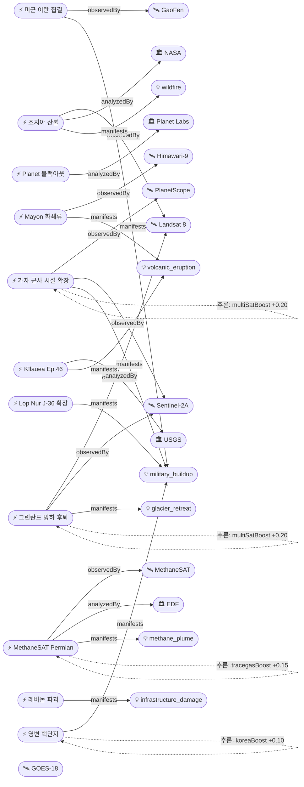

# 2026-05-04 위성영상 관측 이벤트 OSINT 일일 보고서

## 요약

금일 22건 수집, 신규 7건·업데이트 5건 보고. **자연재해**: Kīlauea Episode 46 분출 창 개시(USGS, May 4-7), 조지아 산불 Landsat 8 위성 피해 분석(55,000ac), Mayon 화산 화쇄류(Himawari-9). **국방·안보**: 가자 군사 시설 확장(PlanetScope+Sentinel-2 다중위성 교차검증), 중국 Lop Nur J-36 시험 시설 확장, 이란 인근 미군 집결(중국 위성), **Planet Labs 이란 위성영상 무기한 블랙아웃**(EO OSINT 투명성 구조 변화). **기후·환경**: MethaneSAT Permian Basin 4배 격차 — 미 상원 공식 조사 착수, 그린란드 빙하 후퇴 2배 가속(Landsat+Sentinel 다중위성). **한반도**: 영변 핵단지 5MW 원자로 연중 가동 지속(RFA 위성 확인). 인간활동·농업해양 금일 신규 없음.

## 오늘의 핵심 (Top 5)

| 순위 | 이벤트 | 도메인 | 위성/센서 | 지역 | 신뢰도 |
|------|--------|--------|-----------|------|--------|
| 1 | 가자 군사 시설 확장 (48개 기지, 13개 휴전 후 신설) | Defense | PlanetScope + Sentinel-2A | 가자, 팔레스타인 | 0.95 |
| 2 | MethaneSAT Permian 메탄 4배 — 상원 조사 | Climate | MethaneSAT | 텍사스 Permian Basin, US | 0.95 |
| 3 | 조지아 산불 위성 피해 (55,000ac) | Disaster | Landsat 8 OLI/TIRS | 조지아, US | 0.95 |
| 4 | 레바논 파괴 523건 건물 (CNN/Airbus) | Humanitarian | Airbus Pléiades | Bint Jbeil, 레바논 | 0.90 |
| 5 | Kīlauea Episode 46 예보 (May 4-7) | Disaster | GOES-18 | 하와이, US | 0.95 |

## 다중 위성 교차검증 이벤트

### 1. 가자 군사 시설 확장 — PlanetScope + Sentinel-2A
- **출처:** [Al Jazeera — Satellite images reveal Israel expanding Gaza military sites](https://www.aljazeera.com/news/2026/4/19/satellite-images-reveal-israel-expanding-gaza-military-sites)
- **위성·센서:** PlanetScope (Planet, 3m 광학), Sentinel-2A (ESA, MSI 10m)
- **관측일:** 2026-03-15 ~ 04-19 (시계열)
- **위치:** 가자지구, 팔레스타인 (31.3°N, 34.3°E)
- **분석:** Al Jazeera DIU가 Planet Labs + Sentinel Hub 영상을 교차 분석. Forensic Architecture가 48개 이스라엘 군사 시설을 식별했으며, 이 중 13개는 10월 휴전 이후 건설. Rafah 중심으로 참호·토공 방벽·포장 도로 확장 확인. 중부 가자 Maghazi 캠프까지 방벽 연장, Juhor ad-Dik에서 기존 군사 시설과 신규 정지 구역을 연결하는 도로 신설.
- **multiSatBoost:** +0.20 (PlanetScope × Sentinel-2A, 독립 운영자 교차검증)

### 2. 그린란드 빙하 후퇴 — Landsat 8 + Sentinel-2A
- **출처:** [Space.com — Satellite data reveals quickening Greenland glacier retreat](https://www.space.com/greenland-glaciers-retreat-rate-doubled)
- **위성·센서:** Landsat 8 (USGS/NASA, OLI 30m), Sentinel-2A (ESA, MSI 10m)
- **위치:** 그린란드 주변부 (72°N, 40°W)
- **분석:** 그린란드 주변 빙하 후퇴율이 지난 20년간 2배 가속. 전체 그린란드 빙하 면적의 4%에 불과하지만 현재 빙하 손실의 14%를 차지. 전 세계 빙하가 관측된 해수면 상승의 약 21%를 차지. 100년 전 역사 사진과 현대 위성 데이터 비교 분석.
- **multiSatBoost:** +0.20 (Landsat × Sentinel-2, USGS/NASA × ESA 독립 교차검증)

## 한반도 GeoFocus

### 영변 핵단지 활동 증가 — 5MW 원자로 연중 가동 지속 `추적`
- **출처:** [RFA — Satellite imagery reveals increased activity at Yongbyon](https://www.rfa.org/english/korea/2026/04/28/north-korea-satellite-yongbyon-nuclear/)
- **위성·센서:** 상업 위성 (구체 명칭 미공개)
- **관측일:** 2026년 연중
- **위치:** 영변 핵단지, 평안북도, 북한 (39.8°N, 125.7°E)
- **현상:** military_buildup
- **상태:** 업데이트 ← 2026-04-30 "영변 우라늄 농축 신규 건물 완공 관측"
- **분석:** 위성 영상에서 영변 핵단지의 활동 증가가 관측됨. 2026년 연중 5MW 원자로에서 지속적인 온배수 방류가 확인되었고, 방사화학연구소에서 간헐적 증기 발생이 관측됨. 핵무기 생산 능력 증강의 다년 주기 활동이 현재까지 계속되고 있음을 보여주는 두 가지 핵심 시각적 증거.
- **koreaBoost:** +0.10 (KP 한반도)

> 금일 한국(KR) 영토·동해·서해·남해 해역에 대한 신규 위성 관측 이벤트는 없음. CAS500-2는 궤도 시험 단계 진행 중(약 4개월 소요 예정).

## 자연재해 (Disaster)

### 1. Kīlauea Episode 46 분출 예보 — May 4-7 `추적`
- **출처:** [USGS HVO — Kīlauea May 4 advisory](https://volcanoes.usgs.gov/hans-public/notice/DOI-USGS-HVO-2026-05-04T17:23:57+00:00)
- **위성·센서:** GOES-18 (NOAA, 열적외), 위성 웹캠
- **관측일:** 2026-05-04
- **위치:** Kīlauea summit, Halemaʻumaʻu, Hawaii, US (19.421°N, 155.287°W)
- **현상:** volcanic_eruption
- **상태:** 업데이트 ← 2026-05-03 "Episode 46 forecast window"
- **분석:** USGS HVO가 Episode 46 분출 창을 5/4-7로 공식 확인. 팽창 경사계(tilt) 급속 복귀, Halemaʻumaʻu 양 화구에서 강한 글로우·가스 방출·간헐적 화염이 야간 웹캠에서 관측. 2024-12-23 이후 45회 에피소드 경과. 분출 에피소드는 통상 12시간 미만 지속.
- **officialBoost:** +0.15 (USGS), **partOfSeries:** Episode 45 → 46

### 2. 조지아 남부 산불 — Landsat 8 위성 피해 분석 `추적`
- **출처:** [Newsweek — Satellite images reveal destruction of Georgia wildfires](https://www.newsweek.com/satellite-images-destruction-georgia-wildfires-11898158)
- **위성·센서:** Landsat 8 (USGS/NASA, OLI 30m + TIRS 100m)
- **관측일:** 2026-05-04
- **위치:** Brantley/Clinch County, Georgia, US (31.2°N, 82.3°W)
- **현상:** wildfire
- **상태:** 업데이트 ← 2026-05-03 "Georgia wildfires 32,575ac / 22,532ac"
- **분석:** Landsat 8 OLI 허위색 위성영상에서 탄화 산림·주거지 확인. Hwy 82 Fire: 22,471ac 75% 진화(←64%), Pineland Road Fire: 32,575ac 44% 진화. 총 55,000ac+. 화재 전선이 적외선 시그니처로 주황색 표시, 피해 지역은 회색, 식생 지역은 녹색으로 구분. 극심한 가뭄이 수개월간 지속된 가운데 인위적 원인(마일러 풍선→전선 접촉, 용접 불꽃)으로 발화.
- **officialBoost:** +0.15 (NASA), **thermalBoost:** +0.10, **baCredibilityBoost:** +0.10 (before/after)

### 3. Mayon 화산 화쇄류 + 화산재 FL060 `추적`
- **출처:** [VolcanoDiscovery — Mayon VAAC advisory May 2](https://www.volcanodiscovery.com/mayon/news/301257/vaac-advisory-2026-554.html)
- **위성·센서:** Himawari-9 (JMA/JAXA, 열적외 500m)
- **관측일:** 2026-05-02
- **위치:** Mayon Volcano, Albay Province, Philippines (13.257°N, 123.685°E)
- **현상:** volcanic_eruption
- **상태:** 업데이트 ← 2026-05-03 "Mayon VAAC advisory"
- **분석:** 5/2 18:00경 화쇄류(PDC)가 사면을 급속 하강. VAAC Tokyo가 FL060(약 1,800m) 화산재 자문 발령. Himawari-9 위성에서 화산재 확인 시도. 2026-01 이후 지속적 분출 에피소드.
- **partOfSeries:** Mayon ongoing eruption since Jan 2026

## 인간활동 (Human Activity)

금일 위성영상 기반 신규 인간활동 이벤트 없음. 이전 추적 항목:
- 아마존 불법 금 채굴 6,000ha (ent-evt-054) — Sentinel-2 AI 탐지 지속 모니터링
- 브라질 DETER 위성 감시 금지 법안 (ent-evt-055) — 입법 동향 추적 중

## 기후·환경 (Climate & Environment)

### 1. MethaneSAT Permian Basin 메탄 4배 격차 — 미 상원 조사 개시 `신규`
- **출처:** [Inside Climate News — Senator Whitehouse investigates Permian Basin methane](https://insideclimatenews.org/news/19032026/senator-whitehouse-permian-basin-methane-pollution-investigation/)
- **위성·센서:** MethaneSAT (EDF, trace_gas 100m)
- **관측일:** 2024-05 ~ 2025-06 (MethaneSAT 관측 기간)
- **위치:** Permian Basin, Texas/New Mexico, US (32.0°N, 102.0°W)
- **현상:** methane_plume
- **상태:** 신규
- **분석:** Senator Whitehouse가 MethaneSAT 데이터 기반으로 Permian Basin 메탄 배출 공식 조사에 착수. MethaneSAT 실측치 410 mt/hr vs EPA 온실가스 인벤토리 104 mt/hr — 약 4배 격차. 위성 관측 데이터가 정책적 행동(의회 조사)으로 직접 전환된 의미 있는 사례. EDF는 45개 석유·가스 생산 지역 측정 결과를 2026년 2월 발표.
- **tracegasBoost:** +0.15 (MethaneSAT trace_gas × methane_plume)

### 2. 그린란드 주변 빙하 후퇴율 20년간 2배 가속 `신규`
- **출처:** [Space.com — Greenland glaciers retreat rate doubled](https://www.space.com/greenland-glaciers-retreat-rate-doubled)
- **위성·센서:** Landsat 8 (USGS/NASA, OLI 30m), Sentinel-2A (ESA, MSI 10m)
- **위치:** 그린란드 주변부 (72°N, 40°W)
- **현상:** glacier_retreat
- **상태:** 신규
- **분석:** 그린란드 주변 빙하 후퇴율이 지난 20년간 2배 가속되었다는 연구 결과. 면적 4%이나 빙하 손실 14% 차지. 100년 전 역사 사진과 Landsat+Sentinel-2 현대 위성 데이터 비교. 전 세계 빙하 기여 해수면 상승 약 21%.
- **multiSatBoost:** +0.20, **baCredibilityBoost:** +0.10

## 농업·해양 (Agriculture & Maritime)

금일 위성영상 기반 신규 농업·해양 이벤트 없음. CAS500-4 (5m 광대역, 120km 스와스)가 궤도 시험 완료 후 농업·산림 모니터링에 기여 예정.

## 국방·안보 (Defense — OSINT 한정)

### 1. 이스라엘 가자 군사 시설 확장 — 48개 기지 `신규`
- **출처:** [Al Jazeera — Satellite images reveal Israel expanding Gaza military sites](https://www.aljazeera.com/news/2026/4/19/satellite-images-reveal-israel-expanding-gaza-military-sites)
- **위성·센서:** PlanetScope (Planet, 3m), Sentinel-2A (ESA, MSI 10m)
- **관측일:** 2026-03-15 ~ 04-19
- **위치:** 가자지구 (31.3°N, 34.3°E)
- **현상:** military_buildup
- **분석:** 상기 "다중 위성 교차검증" 섹션 참조. 48개 군사 시설, 13개 휴전 후 신설. Rafah 중심 항구적 기지화 진행.

### 2. 중국 Lop Nur 군사기지 확장 — J-36 스텔스기 시험 `신규`
- **출처:** [Air & Space Forces Magazine — What satellites reveal about China's military expansion](https://www.airandspaceforces.com/article/what-satellites-reveal-about-chinas-military-expansion/)
- **위성·센서:** 상업 위성 (구체 명칭 미공개)
- **관측일:** 2025-08 ~ 2026-02
- **위치:** Lop Nur Test Base, Xinjiang, 중국 (40°N, 90°E)
- **현상:** military_buildup
- **분석:** 2025년 8월 건설 시작, 2026년 2월까지 60,000 sq ft 격납고 + 300,000 sq ft 시설 공간 추가. 6세대 J-36 스텔스 전투폭격기 최초 포착 시기와 일치. 청두 공장은 J-20 생산 라인 5개 가동, 연간 100-120대 추정.

### 3. 미국 이란 인근 군사력 집결 — 중국 위성 추적 `신규`
- **출처:** [Military Watch Magazine — Chinese satellite images show US E-3/KC-135 buildup at Saudi airbase](https://militarywatchmagazine.com/article/chinese-satellite-major-buildup-e3-kc135-iran)
- **위성·센서:** GaoFen series (CNSA, 0.5m 광학)
- **관측일:** 2026-01 ~ 02
- **위치:** Prince Sultan Air Base, Saudi Arabia (24.1°N, 47.6°E)
- **현상:** military_buildup
- **분석:** 중국 위성영상으로 사우디 Prince Sultan AB에서 미 공군 KC-135 공중급유기 16대, E-3 Sentry AWACS 6대 대규모 배치 확인. 총 150대+ 항공기가 이란 인근 기지에 배치되었으며, 약 12척 군함이 중동 해역에 집결. 2026-02-17 이란 핵 협상 결렬 이후 증강.

### 4. Planet Labs 이란/중동 위성영상 무기한 배포 중단 `신규`
- **출처:** [CNBC — Planet Labs to indefinitely withhold Iran war images](https://www.cnbc.com/2026/04/05/satellite-firm-planet-labs-to-indefinitely-withhold-iran-war-images.html)
- **위성·센서:** PlanetScope (Planet, 전 제품)
- **관측일:** 2026-04-05 (발효), 2026-03-09 (소급 적용)
- **위치:** 이란 및 중동 분쟁 지역 (32°N, 53°E)
- **현상:** military_buildup (정책 변화)
- **분석:** Planet Labs가 미 정부 요청으로 이란 및 중동 전역 위성영상 배포를 무기한 중단. 2026-03-09까지 소급 적용. "mission-critical" 또는 공익 목적에 한해 개별 승인. Vantor(구 Maxar), BlackSky도 유사 통제 강화. 상업 EO OSINT의 투명성에 대한 구조적 제약 — 위성영상이 "전술적 이점"으로 활용되는 것을 방지하기 위한 조치.

### 5. 영변 핵단지 활동 증가 `추적`
- 상기 "한반도 GeoFocus" 섹션 참조.

## 인도주의 (Humanitarian)

### 1. 레바논 파괴 523건 건물 — CNN/Airbus 위성 분석 `추적`
- **출처:** [CNN — The Gaza playbook: Satellite images reveal scale of Israeli destruction in Lebanon](https://edition.cnn.com/2026/04/24/middleeast/lebanon-destruction-israel-gaza-model-intl-cmd)
- **위성·센서:** Airbus Pléiades (고해상도 광학)
- **관측일:** 2026-03-14 ~ 04-16
- **위치:** Bint Jbeil 등 22개 커뮤니티, 레바논 (33.1°N, 35.4°E)
- **현상:** infrastructure_damage
- **상태:** 업데이트 ← 2026-04-30 "레바논 인프라 파괴 위성 관측"
- **분석:** CNN이 Airbus 위성영상으로 3월 공세 첫 10일간 22개 커뮤니티에서 523건 건물 파괴를 정량 분석. 대다수 주거용 건물. Bint Jbeil 중심부 심각 파괴. 회색 잔해 패턴은 폭파와 일치하는 소각 흔적. 4/16 휴전 발표 이후에도 굴착기·장갑차량이 포착되어 철거 작업 지속 확인. 모스크, 약국, 카페, 정비소 등 민간 시설 파괴.
- **baCredibilityBoost:** +0.10 (before/after 위성 비교)

## 센서·플랫폼별 묶음

- **Landsat 8 (OLI/TIRS):** 조지아 산불 burn scar (false-color), 그린란드 빙하 시계열
- **Sentinel-2A (MSI):** 가자 군사 시설 확장 (Sentinel Hub), 그린란드 빙하 비교
- **PlanetScope (Doves):** 가자 군사 시설 확장 (Planet Labs)
- **GOES-18:** Kīlauea 열적외 실시간 모니터링
- **Himawari-9:** Mayon 화산 VAAC 화산재 관측
- **GaoFen series:** 사우디 Prince Sultan AB 미군 집결 추적 (중국 위성)
- **MethaneSAT:** Permian Basin 메탄 배출 측정
- **Airbus Pléiades:** 레바논 파괴 정량 분석 (CNN)
- **KOMPSAT-3A / 5 / CAS500:** CAS500-2 궤도 시험 진행 중 (첫 영상 미공개)

## 전후 비교(before/after) 영상 보유 이벤트

| 이벤트 | 위성 | before | after | 비교 내용 |
|--------|------|--------|-------|----------|
| 조지아 산불 | Landsat 8 OLI | 화재 이전 식생 | 탄화 지역 회색 | False-color burn scar |
| 레바논 파괴 | Airbus Pléiades | 3월 공세 이전 | 523건 건물 파괴 | 건물 파괴 정량화 |
| 가자 군사 시설 | PlanetScope / Sentinel-2 | 휴전 이전 | 13개 신설 기지 | 군사 시설 확장 |
| 그린란드 빙하 | Landsat 8 + Sentinel-2 | 100년 전 사진 | 현대 위성 | 후퇴율 2배 가속 |

## 미검증 의혹

### 1. 미국 서부 AI 산불 조기 탐지 시스템 배치 (Pano AI)
- **출처:** [Washington Times — States across wildfire-prone Western US using AI](https://www.washingtontimes.com/news/2026/may/4/states-across-wildfire-prone-western-united-states-using-ai-early/)
- **위치:** 미국 서부 17개 주 + 호주 + 캐나다
- **비고:** 고해상 카메라 + AI 기반 탐지 시스템. 위성영상이 아닌 지상 카메라 네트워크 중심. 위성 출처 미확인 — 평균 911 신고 대비 45분 빠른 탐지 주장. 후속 위성 검증 대기.
- **신뢰도:** < 0.5 (위성 출처 부재)

## 지식그래프

### 오늘의 주요 관계
- **다중 위성 교차검증 2건**: 가자 군사 확장(PlanetScope+Sentinel-2), 그린란드 빙하(Landsat+Sentinel-2)
- **MethaneSAT → 정책 전환**: 위성 관측 데이터가 미 상원 공식 조사로 직접 연결 — trace_gas 센서의 사회적 영향력 확인
- **Planet Labs 블랙아웃**: 상업 위성영상 투명성의 구조적 변화 — 국방 이벤트 OSINT 수집에 영향
- **시계열 진행**: Kīlauea Episode 45→46, Mayon 지속 분출

### 전체 지식그래프 시각화

## 온톨로지 변경

| 변경 유형 | 대상 | 근거 |
|----------|------|------|
| 새 Country | co-sa (사우디아라비아), co-gl (그린란드) | 미군 집결 이벤트 + 빙하 후퇴 연구 |
| 새 Location | Lop Nur, Bint Jbeil, Prince Sultan AB, Permian Basin (4건) | 신규 이벤트 발생 지역 |
| 새 Event | ent-evt-059/062/063/064/066/068 (6건) | 가자 확장, Lop Nur, 미군 집결, Planet 블랙아웃, MethaneSAT, 그린란드 |
| 이벤트 업데이트 | ent-evt-001/004/020/028/029 (5건) | 영변, Kīlauea, 조지아, 레바논, Mayon |

## 추론 결과

| 추론 | 신뢰도 | 근거 |
|------|--------|------|
| ent-evt-059 multi_satellite_confirmation | 0.90 | PlanetScope + Sentinel-2A 교차검증 |
| ent-evt-068 multi_satellite_confirmation | 0.82 | Landsat 8 + Sentinel-2A 교차검증 |
| ent-evt-066 tracegasBoost | 0.95 | MethaneSAT trace_gas × methane_plume |
| ent-evt-004 officialBoost | 0.99 | USGS HVO 공식 |
| ent-evt-020 officialBoost | 0.95 | NASA EO 공식 |
| ent-evt-001 koreaBoost | 0.99 | KP 한반도 |
| ent-evt-004 partOfSeries ent-evt-021 | 0.95 | Kīlauea Ep.45→46 |
| ent-evt-029 partOfSeries ongoing | 0.90 | Mayon 지속 분출 |
| ent-evt-020 baCredibilityBoost | 0.95 | Landsat before/after |
| ent-evt-028 baCredibilityBoost | 0.95 | Airbus before/after |
| ent-evt-068 baCredibilityBoost | 0.85 | 100년 사진 + 위성 비교 |

## 분석 및 평가

금일 보도에서 두드러진 패턴은 **위성영상의 정치·정책적 파급력 확대**이다. MethaneSAT의 Permian Basin 데이터가 미 상원 공식 조사로 직결된 것은 위성 관측이 단순 모니터링을 넘어 정책 결정의 직접적 근거로 기능함을 보여준다. 동시에 Planet Labs의 이란/중동 영상 블랙아웃은 상업 위성영상의 투명성이 국가 안보 논리에 의해 제한될 수 있음을 보여주는 반대 사례로, EO OSINT 생태계의 양면성을 드러낸다.

군사·안보 영역에서는 중국 위성이 미군 배치를 추적하고(GaoFen→Prince Sultan AB), 미국은 자국 상업 위성 배포를 제한하는 비대칭 구도가 형성되었다. 가자 군사 시설 확장은 Planet+Sentinel 다중위성으로 교차검증된 고신뢰 정보이며, 13개 기지가 휴전 이후 건설되었다는 점은 정치적으로 민감한 발견이다.

자연재해 추적 항목(Kīlauea, 조지아, Mayon)은 모두 이전 보고서 연속이며, 기후 영역에서 그린란드 빙하 후퇴 2배 가속은 남극 연구(ent-evt-042)와 함께 양극 빙하 손실 가속의 글로벌 패턴을 확인한다. 인간활동·농업해양 카테고리의 금일 부재는 주말 효과(관측 기관 발표 감소)로 추정된다.

## 추적 항목

| 항목 | 최초 보고 | 상태 | 최신 업데이트 |
|------|----------|------|-------------|
| Kīlauea 에피소드 분출 | 2026-04-30 | 활성 — Ep.46 May 4-7 예보 | 2026-05-04 |
| 조지아 산불 (55,000ac) | 2026-04-30 | 활성 — 75%/44% 진화 | 2026-05-04 |
| Mayon 화산 분출 | 2026-05-01 | 활성 — 5/2 PDC | 2026-05-04 |
| 영변 핵단지 | 2026-04-30 | 활성 — 5MW 연중 가동 | 2026-05-04 |
| 레바논 파괴 | 2026-04-30 | 활성 — 523건 CNN 정량 | 2026-05-04 |
| 아마존 불법 채굴 6,000ha | 2026-05-03 | 추적 | 2026-05-03 |
| 브라질 DETER 금지 법안 | 2026-05-03 | 추적 | 2026-05-03 |
| CAS500-2/4 궤도 시험 | 2026-05-01 | 시험 중 | 2026-05-03 |
| MethaneSAT 글로벌 메탄 | 2026-05-03 | 활성 — 상원 조사 | 2026-05-04 |
| Planet Labs 이란 블랙아웃 | 2026-05-04 | 신규 | 2026-05-04 |

## 출처 목록

1. [Kīlauea Episode 46 eruption window — USGS HVO](https://volcanoes.usgs.gov/hans-public/notice/DOI-USGS-HVO-2026-05-04T17:23:57+00:00) — USGS, 2026-05-04
2. [Georgia wildfires satellite images — Newsweek](https://www.newsweek.com/satellite-images-destruction-georgia-wildfires-11898158) — Newsweek, 2026-05-04
3. [Fires Rage in Georgia — NASA Earth Observatory](https://science.nasa.gov/earth/earth-observatory/fires-rage-in-georgia/) — NASA, 2026-05
4. [Satellite images reveal Israel expanding Gaza military sites — Al Jazeera](https://www.aljazeera.com/news/2026/4/19/satellite-images-reveal-israel-expanding-gaza-military-sites) — Al Jazeera, 2026-04-19
5. [Lebanon destruction satellite imagery — CNN](https://edition.cnn.com/2026/04/24/middleeast/lebanon-destruction-israel-gaza-model-intl-cmd) — CNN, 2026-04-24
6. [Mayon Volcano VAAC advisory — VolcanoDiscovery](https://www.volcanodiscovery.com/mayon/news/301257/vaac-advisory-2026-554.html) — VAAC Tokyo, 2026-05-02
7. [China Lop Nur military expansion — Air & Space Forces](https://www.airandspaceforces.com/article/what-satellites-reveal-about-chinas-military-expansion/) — Air & Space Forces Magazine, 2026-05
8. [Chinese satellite US E-3/KC-135 buildup — Military Watch](https://militarywatchmagazine.com/article/chinese-satellite-major-buildup-e3-kc135-iran) — Military Watch Magazine, 2026
9. [Planet Labs Iran imagery blackout — CNBC](https://www.cnbc.com/2026/04/05/satellite-firm-planet-labs-to-indefinitely-withhold-iran-war-images.html) — CNBC, 2026-04-05
10. [Nowhere to hide: Iran war remote sensing — Breaking Defense](https://breakingdefense.com/2026/04/nowhere-to-hide-iran-war-spotlights-military-challenges-posed-by-space-based-remote-sensing/) — Breaking Defense, 2026-04
11. [Yongbyon nuclear activity — Radio Free Asia](https://www.rfa.org/english/korea/2026/04/28/north-korea-satellite-yongbyon-nuclear/) — RFA, 2026-04-28
12. [MethaneSAT Permian Senate investigation — Inside Climate News](https://insideclimatenews.org/news/19032026/senator-whitehouse-permian-basin-methane-pollution-investigation/) — Inside Climate News, 2026-03-19
13. [MethaneSAT US methane 4× EPA — EDF/MethaneSAT](https://www.methanesat.org/project-updates/new-data-show-us-oil-and-gas-methane-emissions-over-four-times-higher-epa-estimates) — MethaneSAT.org, 2026-02
14. [Greenland glacier retreat doubled — Space.com](https://www.space.com/greenland-glaciers-retreat-rate-doubled) — Space.com, 2026
15. [Western US AI wildfire detection — Washington Times](https://www.washingtontimes.com/news/2026/may/4/states-across-wildfire-prone-western-united-states-using-ai-early/) — Washington Times, 2026-05-04
