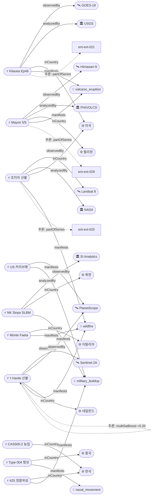

# 2026-05-05 위성영상 관측 이벤트 OSINT 일일 보고서

## 요약

금일 20건 수집, 신규 7건·업데이트 6건 보고. **자연재해**: Kīlauea Episode 46 분출 개시(650ft 용암 분수, USGS WATCH), Mayon 화산 5/5 VAAC 화산재 경보(Himawari-9), 조지아 산불 봉쇄 진전(Hwy82 85%·Pineland 50%, Landsat 8), **이탈리아 토스카나 Monte Faeta 산불**(700ha·3,500명 대피), **네덜란드 't Harde 군사사격장 산불**(Sentinel-2+Planet 다중위성 교차검증, 연기 영국까지 도달). **국방·안보**: **중국 Type 004 핵추진 항공모함** 건조 진전(Dalian 조선소 SkyFi 고해상도 위성영상, 원자로 구획 확인), 미국 카리브해 3개 항모전단 집결(Planet 위성 추적), **북한 신포 SLBM 발사 준비**(SI Analytics 위성, 보호커버 제거). **한반도 GeoFocus**: 425사업 정찰위성 5기 전력화 완료(2시간 주기 대북 감시), CAS500-2 스마트농업 활용 전망. 다중 위성 교차검증 1건, 한반도 관련 3건. 기후·환경·인도주의 금일 신규 없음.

## 오늘의 핵심 (Top 5)

| 순위 | 이벤트 | 도메인 | 위성/센서 | 지역 | 신뢰도 |
|------|--------|--------|-----------|------|--------|
| 1 | 네덜란드 't Harde 산불 (Sentinel-2+Planet 다중위성) | Disaster | Sentinel-2A + PlanetScope | 't Harde, 네덜란드 | 0.95 |
| 2 | 중국 Type 004 핵항모 건조 (원자로 구획 위성 확인) | Defense | SkyFi hi-res tasking | Dalian, 중국 | 0.95 |
| 3 | Kīlauea Episode 46 — 650ft 용암 분수 | Disaster | GOES-18 | 하와이, 미국 | 0.95 |
| 4 | Mayon 화산 5/5 분출 (VAAC 화산재 경보) | Disaster | Himawari-9 | Albay, 필리핀 | 0.95 |
| 5 | 북한 신포 SLBM 발사 준비 (위성 활동 증가) | Defense | SI Analytics (상업) | 신포, 북한 | 0.90 |

## 다중 위성 교차검증 이벤트

### 1. 네덜란드 't Harde 군사사격장 산불 — Sentinel-2A + PlanetScope
- **출처:** [Misbar — Satellite Images Document Massive Fire at Dutch Military Site](https://www.misbar.com/en/editorial/2026/05/01/satellite-images-document-massive-uncontrolled-fire-dutch-military-site)
- **위성·센서:** Sentinel-2A (ESA, MSI 10m), PlanetScope (Planet Labs, 3m 광학)
- **관측일:** 2026-04-29
- **위치:** 't Harde 포병사격장(ASK), Gelderland, 네덜란드 (52.37°N, 5.77°E)
- **현상:** wildfire
- **상태:** 신규
- **분석:** Copernicus Sentinel-2 영상이 2,200m 폭의 화재 전선을 포착했으며, Planet Labs 영상은 연기 플룸이 암스테르담(65km)을 넘어 영국 Norwich까지 도달하는 것을 확인. 프랑스(41명·10대 차량)와 독일(67명·21대 차량) 소방대가 국제 지원 투입. Ruisdael Observatory는 대기 관측으로 연기의 전국적 대기 영향을 분석. 화재 원인은 군사 사격 훈련 중 발화 추정.
- **multiSatBoost:** +0.20 (Sentinel-2A × PlanetScope, ESA × Planet Labs 독립 운영자 교차검증)

## 한반도 GeoFocus

### 1. 한국 425사업 정찰위성 5기 전력화 완료 `추적`
- **출처:** [MBC — 군 정찰위성 5기 모두 전력화‥독자적 대북 감시정찰 강화](https://imnews.imbc.com/news/2026/politics/article/6818571_36911.html)
- **위성·센서:** 425사업 위성 5기 (SAR + 전자광학)
- **관측일:** 2026-04-30
- **위치:** 대한민국 (36.5°N, 127.0°E)
- **현상:** military_buildup
- **상태:** 업데이트 ← 2026-04-30 "한국 5기 정찰위성 체계 구축 계획"
- **분석:** 425사업 마지막 5호기가 운용시험평가 기준을 충족하여 이달 말 전력화 예정. 5기 군집운용으로 북한 도발 징후를 **2시간마다** 감시하고 핵시설·탄도미사일 발사대 등 표적을 정찰. 한국군 최초의 독자적 전천후 위성 감시 체계 완성.
- **koreaBoost:** +0.10

### 2. 북한 신포 SLBM 발사 준비 — 위성영상 활동 증가
- **출처:** [Reuters/Nasdaq — Imagery shows N.Korea may soon launch new missile submarine](https://www.nasdaq.com/articles/imagery-shows-n.korea-may-soon-launch-new-missile-submarine-think-tank)
- **위성·센서:** SI Analytics (한국 상업 위성 AI)
- **관측일:** 2026-03-20 ~ 03-26
- **위치:** 신포 남부 조선소, 함경남도, 북한 (39.8°N, 128.1°E)
- **현상:** military_buildup
- **상태:** 신규
- **분석:** SI Analytics의 위성영상 분석에서 신포 잠수함 시설 주변 차량 활동 증가 및 잠수함 보호커버 제거가 확인됨. '영웅 김건옥' 잠수함(10개 수직발사관, 푹극성-3 SLBM 탑재)의 작전 준비 정황. CSIS 분석에 따르면 전략순항미사일의 잠수함 발사도 확인됨.
- **koreaBoost:** +0.10

### 3. CAS500-2 스마트농업 활용 전망
- **출처:** [한국IT산업뉴스 — K-위성이 바꾸는 스마트농업의 다섯 가지 변화](https://www.koreaiin.com/news/899944)
- **위성·센서:** CAS500-2 (KARI, 0.5m 광학)
- **위치:** 대한민국 전역
- **현상:** crop_yield
- **상태:** 신규
- **분석:** 2026-05-03 발사 성공한 CAS500-2의 농업 분야 활용 전망. 작물 생육 모니터링, 병해충 탐지, 토양수분 분석, NDVI 기반 정밀농업 지원 등 5가지 변화 제시. 약 4개월 초기운용 후 2026년 하반기 본격 임무 수행 예정.
- **koreaBoost:** +0.10

## 자연재해 (Disaster)

### 1. Kīlauea Episode 46 분출 — 650ft 용암 분수
- **출처:** [Maui Now — Lava fountaining has begun at Kīlauea, marking its 46th eruptive episode](https://mauinow.com/2026/05/05/lava-fountaining-has-begun-at-kilauea-marking-its-46th-eruptive-episode/)
- **위성·센서:** GOES-18 (NOAA, 정지궤도 열적외)
- **관측일:** 2026-05-05
- **위치:** Kīlauea summit, Halemaʻumaʻu, 하와이, 미국 (19.421°N, 155.287°W)
- **현상:** volcanic_eruption
- **상태:** 업데이트 ← 2026-05-04 "Episode 46 분출 창 개시"
- **분석:** 5월 4일 01:38 HST 전조 활동(북측 분화구 용암 넘침) 시작, 5월 5일 08:17 AM Episode 46 본분출 개시. 북측 분화구에서 **650ft(약 200m) 높이**의 용암 분수 분출. 10:35 AM 정점 효율 도달. 모든 용암류는 Halemaʻumaʻu 분화구 내부에 국한. 경보등급 ADVISORY→WATCH 격상, 항공색상코드 YELLOW→ORANGE. 2024년 12월 23일 이후 45회 에피소드 발생, 46번째 에피소드.
- **officialBoost:** +0.15 (USGS 공식)

### 2. Mayon 화산 5/5 분출 — VAAC 화산재 경보
- **출처:** [VolcanoDiscovery — Mayon VAAC Advisory 0544Z](https://www.volcanodiscovery.com/mayon/news/301450/vaac-advisory-2026-567.html)
- **위성·센서:** Himawari-9 (JMA/JAXA, 정지궤도 열적외)
- **관측일:** 2026-05-05
- **위치:** Mayon Volcano, Albay Province, 필리핀 (13.257°N, 123.685°E)
- **현상:** volcanic_eruption
- **상태:** 업데이트 ← 2026-05-04 "Mayon Ash Advisory May 2"
- **분석:** VAAC Tokyo가 0544Z(05:44 UTC) 분출 보고. Himawari-9에서 화산재 구름 미식별(VA CLD UNKNOWN). 5월 2일 대규모 화쇄류가 남서 사면 용암 퇴적물 붕괴로 발생, 87개 마을에 화산재가 덮이며 300+ 가족 대피. 용암류 Basud 3.8km, Bonga 3.2km, Mi-isi 1.6km 연장. PHIVOLCS Alert Level 3 유지.
- **officialBoost:** +0.15 (PHIVOLCS 공식)
- **thermalBoost:** +0.10 (Himawari-9 열적외)

### 3. 조지아 산불 봉쇄 진전 — Hwy82 85%, Pineland 50%
- **출처:** [Georgia Forestry Commission — Current Wildfire Information](https://gatrees.org/current-wildfire-information-and-resources/)
- **위성·센서:** Landsat 8 (USGS/NASA, OLI 30m + TIRS 100m)
- **관측일:** 2026-05-05
- **위치:** Brantley/Clinch County, 조지아, 미국 (31.2°N, 82.3°W)
- **현상:** wildfire
- **상태:** 업데이트 ← 2026-05-04 "Georgia wildfires satellite imagery"
- **분석:** **Hwy 82 Fire**: 22,471ac(약 9,093ha) 85% 봉쇄. **Pineland Road Fire**: 32,575ac(약 13,183ha) 50% 봉쇄. 화재 원인 확정 — Mylar 풍선이 전력선과 접촉하여 전기 아크로 주변 식생 발화. 총 263명·91개 자원(BLM/GFC/USFS) 투입. Landsat 8 OLI 허위색상 영상에서 소실 지역(회색)과 식생(녹색) 구분, TIRS 열적외로 활성 화선 확인. 전후 비교(before/after) 영상 가용.
- **thermalBoost:** +0.10 (Landsat TIRS)

### 4. 이탈리아 토스카나 Monte Faeta 산불 — 700ha 소실
- **출처:** [Euronews — Tuscany, flames out of control on Monte Faeta](https://www.euronews.com/my-europe/2026/05/01/tuscany-flames-out-of-control-on-monte-faeta-800-hectares-burnt-3000-evacuated)
- **위성·센서:** Sentinel-2A (ESA, MSI 10m) — 간접 참조; 열화상 드론 운용
- **관측일:** 2026-04-28 ~ 05-03 (발화~진화)
- **위치:** Monte Faeta, Pisa/Lucca, Tuscany, 이탈리아 (43.78°N, 10.45°E)
- **현상:** wildfire
- **상태:** 신규
- **분석:** 4월 28일 올리브 나무 전지 소각에서 발화, 강풍으로 확산. 약 **700ha**(20km 화재 둘레) 소실, **3,500명** 대피(San Giuliano Terme 자치구). Canadair 3대 + 지역 헬리콥터 투입, 열화상 드론 야간 감시. 5월 3일 화재 전선 정지 확인.

### 5. 네덜란드 't Harde 산불 — 다중위성 교차검증
- *(위 '다중 위성 교차검증 이벤트' 섹션 참조)*

## 인간활동 (Human Activity)

> 금일 신규 없음. 이전 추적 항목(아마존 금 채굴 ent-evt-054, 베네수엘라 원유 유출 ent-evt-034, 브라질 DETER 법안 ent-evt-055) 후속 보도 미확인.

## 기후·환경 (Climate & Environment)

> 금일 신규 없음. 이전 추적 항목(MethaneSAT Permian ent-evt-066, 그린란드 빙하 ent-evt-068, 남극 접지선 후퇴 ent-evt-042) 후속 보도 미확인.

## 농업·해양 (Agriculture & Maritime)

### 1. CAS500-2 스마트농업 활용 전망
- *(위 '한반도 GeoFocus' 섹션 참조)*

## 국방·안보 (Defense — OSINT 한정)

### 1. 중국 Type 004 핵추진 항공모함 건조 — 원자로 구획 위성 확인
- **출처:** [SkyFi — Satellite Imagery Reveals China's Nuclear Carrier](https://skyfi.com/en/blog/defense-satellite-imagery-china-nuclear-carrier)
- **위성·센서:** SkyFi on-demand tasking (고해상도 광학, ≤1m)
- **관측일:** 2026-02-17
- **위치:** Dalian 조선소, Liaoning, 중국 (38.9°N, 121.6°E)
- **현상:** naval_movement
- **상태:** 신규
- **분석:** SkyFi 플랫폼을 통한 고해상도 위성영상에서 Type 004 항모의 **2개 차폐 원자로 구획**과 **4개 기관실**이 개방된 선체 내부에서 확인됨. CNAS의 Tom Shugart 전 미 해군 잠수함 장교가 미 해군 Ford급 항모 초기 건조 단계와 유사하다고 평가. 전체 진행률 약 25%, 2030년경 취역 전망. **중국 최초 핵추진 항모**로서 항속거리·배치 유연성에서 기존 재래식 항모와 질적 전환.
- **hiResBoost:** +0.15 (SkyFi 고해상도)

### 2. 미국 카리브해 군사력 집결 — 위성 추적
- **출처:** [The Conversation — We've tracked the US military build-up in the Caribbean](https://stories.theconversation.com/tracking-the-us-military-in-the-caribbean/)
- **위성·센서:** PlanetScope (Planet Labs, 3m 광학)
- **관측일:** 2026년 4월
- **위치:** 카리브해, 베네수엘라 북방 (12.0°N, 68.0°W)
- **현상:** military_buildup
- **상태:** 신규
- **분석:** 위성 추적으로 확인된 카리브해 미군 집결 — **3개 항모전단**(CSG-10 4월 23일 도착 포함), F-35 전투기, AC-130 건십, MQ-9 드론, Iwo Jima 수륙양용준비단, 빠른공격잠수함. Operation Southern Spear(마약 대응→베네수엘라 억제)의 일환. Muwaffaq Salti 공군기지(요르단)에서 50대 이상 항공기 확인(AP/Planet Labs 분석).

### 3. 북한 신포 SLBM 발사 준비
- *(위 '한반도 GeoFocus' 섹션 참조)*

### 4. 425사업 정찰위성 5기 전력화
- *(위 '한반도 GeoFocus' 섹션 참조)*

## 인도주의 (Humanitarian)

> 금일 신규 없음. 이전 추적 항목(가자 피해 평가 ent-evt-008/059, 레바논 인프라 파괴 ent-evt-028) 후속 보도 미확인.

## 센서·플랫폼별 묶음

- **Sentinel-2 (광학):** 네덜란드 't Harde 산불 연기 플룸 관측, 토스카나 Monte Faeta 간접 참조
- **PlanetScope (광학):** 네덜란드 산불 연기 확산, 미국 카리브해 군사력 추적
- **Landsat 8 (광학+열적외):** 조지아 산불 소실 면적·활성 화선 매핑
- **GOES-18 (정지궤도):** Kilauea Episode 46 열이상 모니터링
- **Himawari-9 (정지궤도):** Mayon 화산 VAAC 화산재 감시
- **SkyFi tasking (고해상도):** 중국 Type 004 항모 건조 진전 확인
- **SI Analytics (상업 AI):** 북한 신포 SLBM 준비 위성 분석
- **KOMPSAT/CAS500:** CAS500-2 궤도 시험 진행 중 (발사 +2일), 농업 활용 전망 기사

## 전후 비교(before/after) 영상 보유 이벤트

| 이벤트 | 위성 | 전후 비교 내용 |
|--------|------|---------------|
| Kīlauea Ep46 (ent-evt-070) | GOES-18 | 분출 전후 분화구 지형 변화 |
| 조지아 산불 (ent-evt-072) | Landsat 8 OLI | 허위색상 소실 면적 vs 식생 비교 |
| 네덜란드 't Harde (ent-evt-074) | Sentinel-2 + Planet | 화재 전후 군사사격장 식생 소실 |
| Type 004 항모 (ent-evt-075) | SkyFi | 건조 진행 시점별 선체 구조 변화 |
| NK Sinpo SLBM (ent-evt-077) | SI Analytics | 보호커버 제거 전후 잠수함 노출 |

## 미검증 의혹

### 일본 산리쿠 해역 M7.7 지진 (2026-04-20) — 위성 피해 평가 미실시
- **출처:** [Wikipedia — 2026 Sanriku earthquake](https://en.wikipedia.org/wiki/2026_Sanriku_earthquake)
- **위치:** 이와테현 미야코 동쪽 100km, 일본 (39.5°N, 143.5°E)
- **분석:** M7.7 지진(깊이 20km), 쓰나미 경보 발령(예상 3m, 실측 80cm). 인명피해 및 심각한 구조 손상 미보고. 위성 기반 피해 평가가 공개적으로 실시된 기록 없음 — 실질 피해가 제한적이었기 때문으로 판단. **위성 출처 미확인**으로 본문에서 분리.
- **신뢰도:** 0.50 (satellite_unverified)

## 지식그래프

### 오늘의 주요 관계

금일 신규 명시적 트리플 34건, 추론 트리플 11건 생성. 핵심 관계:
- **다중위성 교차검증**: 네덜란드 't Harde 산불 — Sentinel-2A(ESA) × PlanetScope(Planet) 독립 관측 확인
- **시계열 연속**: Kilauea Ep46→Ep45→Ep44 화산 분출 시리즈, Mayon 연속 분출, 조지아 산불 봉쇄 추이
- **센서-현상 적합성**: Himawari-9(열적외)×화산, Landsat TIRS×산불
- **한반도 클러스터**: NK Sinpo SLBM ↔ 425정찰위성 5기 ↔ CAS500-2 농업 — 한반도 EO 역량 확대와 군사 긴장의 동시 진행

### 전체 지식그래프 시각화

## 온톨로지 변경

| 변경 유형 | 대상 | 근거 |
|----------|------|------|
| 새 Country | co-nl (네덜란드) (1건) | 't Harde 산불 Sentinel-2/Planet 다중위성 관측 |
| 새 Location | ent-loc-025~029 (5건) | Monte Faeta, 't Harde, Dalian, Sinpo, Sanriku |
| 새 Organization | org-si-analytics (1건) | 한국 위성영상 AI 기업, NK SLBM 분석 |
| 새 Event | ent-evt-070~080 (11건) | 신규 7건 + 업데이트 4건 |

## 추론 결과

| 추론 | 신뢰도 | 근거 |
|------|--------|------|
| ent-evt-074 multi_satellite_confirmation | 0.90 | Sentinel-2A(ESA) + PlanetScope(Planet) 독립 관측 |
| ent-evt-070 partOfSeries ent-evt-021 | 0.95 | Kilauea Ep46→Ep45 시계열 |
| ent-evt-071 partOfSeries ent-evt-029 | 0.95 | Mayon 연속 분출 |
| ent-evt-072 partOfSeries ent-evt-020 | 0.95 | 조지아 산불 봉쇄 진전 |
| ent-evt-071 thermalBoost | 0.90 | Himawari-9 열적외 × 화산 |
| ent-evt-072 thermalBoost | 0.90 | Landsat 8 TIRS × 산불 |
| ent-evt-070 officialBoost | 0.95 | USGS 공식 기관 |
| ent-evt-071 officialBoost | 0.90 | PHIVOLCS 공식 기관 |
| ent-evt-077 koreaBoost | 1.00 | KP 한반도 |
| ent-evt-078 koreaBoost | 1.00 | KR 한반도 |
| ent-evt-079 koreaBoost | 1.00 | KR 한반도 |

## 분석 및 평가

**자연재해 동향:** 전 세계적으로 화산 활동이 활발 — Kilauea는 2024년 12월 이후 46번째 에피소드에 진입했으며 Mayon은 2026년 1월부터 지속적인 분출 중. 조지아 산불은 봉쇄율이 개선되고 있으나 Pineland Road 지역은 극도의 건조 상태로 여전히 위험. **유럽 산불 시즌 개시 신호**: 이탈리아 토스카나(700ha)와 네덜란드('t Harde 군사사격장) 산불은 4월 말~5월 초 유럽의 이례적 건조 조건을 반영하며, 과거 여름 시즌보다 이른 대형 산불 발생 패턴을 보여줌.

**국방·안보 동향:** 고해상도 위성 OSINT가 전략적 군사 인프라 분석의 핵심 도구로 부상. 중국 Type 004 핵항모의 원자로 구획이 SkyFi 상업 위성으로 확인된 것은 상업 EO가 국가급 비밀 프로그램을 투명하게 만드는 사례. 동시에 미국의 카리브해 대규모 군사력 집결도 Planet Labs 위성으로 실시간 추적되는 "유리 전장(Glass Battlefield)" 시대를 입증. 한반도에서는 북한 신포 SLBM 준비와 한국 425정찰위성 5기 완성이 동시에 진행되며, EO 기반 상호감시의 양면성이 부각됨.

**위성 활용 패턴:** 금일 가장 주목할 만한 다중위성 사례는 네덜란드 't Harde 산불(Sentinel-2+Planet)이며, 3건의 시계열 연속관측(Kilauea/Mayon/Georgia)이 지구관측의 모니터링 지속성을 보여줌.

## 추적 항목

| 항목 | 최초 보고 | 상태 | 최신 업데이트 |
|------|----------|------|-------------|
| Kīlauea 연속 분출 (Ep44→45→46) | 2026-04-30 | 활성 | 2026-05-05 Ep46 650ft 분수 |
| Mayon 화산 지속 분출 | 2026-05-01 | 활성 | 2026-05-05 VAAC 경보 |
| 조지아 산불 | 2026-04-30 | 봉쇄 중 | 2026-05-05 Hwy82 85% |
| 영변 핵단지 | 2026-04-30 | 추적 | 2026-05-04 RFA 위성 확인 |
| MethaneSAT Permian 메탄 | 2026-05-03 | 추적 | 2026-05-04 상원 조사 |
| 가자 군사 시설 확장 | 2026-05-04 | 추적 | 2026-05-04 multiSat 확인 |
| 그린란드 빙하 후퇴 2배 가속 | 2026-05-04 | 추적 | 2026-05-04 multiSat 확인 |
| NK Sinpo SLBM 준비 | 2026-05-05 | 신규 | 2026-05-05 SI Analytics |
| Type 004 핵항모 건조 | 2026-05-05 | 신규 | 2026-05-05 SkyFi 확인 |
| 425 정찰위성 5기 전력화 | 2026-04-30 | 완료 | 2026-05-05 전력화 확인 |
| CAS500-2 궤도 시험 | 2026-05-03 | 진행 | 2026-05-05 발사+2일 |

## 출처 목록

1. [Lava fountaining has begun at Kīlauea, marking its 46th eruptive episode](https://mauinow.com/2026/05/05/lava-fountaining-has-begun-at-kilauea-marking-its-46th-eruptive-episode/) - Maui Now, 2026-05-05
2. [Kīlauea Volcano Alert Level Raised To WATCH](https://www.bigislandvideonews.com/2026/05/04/kilauea-volcano-alert-level-raised-to-watch-as-lava-flows-begin/) - Big Island Video News, 2026-05-04
3. [Lava fountains peak at 650 feet for Episode 46](https://www.staradvertiser.com/2026/05/05/breaking-news/lava-fountaining-marks-start-of-episode-46-at-kilauea/) - Honolulu Star-Advertiser, 2026-05-05
4. [Mayon Volcano VAAC Advisory May 5 — Eruption 0544Z](https://www.volcanodiscovery.com/mayon/news/301450/vaac-advisory-2026-567.html) - VolcanoDiscovery, 2026-05-05
5. [Panic in Philippines as Mayon ashfall blankets towns](https://www.scmp.com/news/asia/southeast-asia/article/3352320/panic-philippines-mayon-volcano-ashfall-blankets-towns-total-darkness) - SCMP, 2026-05-02
6. [Georgia Forestry Commission — Current Wildfire Information](https://gatrees.org/current-wildfire-information-and-resources/) - GFC, 2026-05-05
7. [Tuscany, flames out of control on Monte Faeta](https://www.euronews.com/my-europe/2026/05/01/tuscany-flames-out-of-control-on-monte-faeta-800-hectares-burnt-3000-evacuated) - Euronews, 2026-05-01
8. [Satellite Images Document Massive Fire at Dutch Military Site](https://www.misbar.com/en/editorial/2026/05/01/satellite-images-document-massive-uncontrolled-fire-dutch-military-site) - Misbar, 2026-05-01
9. [Wildfire Smoke Detected Across the Netherlands](https://ruisdael-observatory.nl/wildfire-smoke-detected-across-the-netherlands-local-events-with-national-atmospheric-impact/) - Ruisdael Observatory, 2026-04-29
10. [Satellite Imagery Reveals China's Nuclear Carrier](https://skyfi.com/en/blog/defense-satellite-imagery-china-nuclear-carrier) - SkyFi, 2026-02
11. [We've tracked the US military build-up in the Caribbean](https://stories.theconversation.com/tracking-the-us-military-in-the-caribbean/) - The Conversation, 2026-04
12. [Imagery shows N.Korea may soon launch new missile submarine](https://www.nasdaq.com/articles/imagery-shows-n.korea-may-soon-launch-new-missile-submarine-think-tank) - Reuters/Nasdaq, 2026-04
13. [군 정찰위성 5기 모두 전력화‥독자적 대북 감시정찰 강화](https://imnews.imbc.com/news/2026/politics/article/6818571_36911.html) - MBC, 2026-04-29
14. [CAS500-2 '4년 지연' 끝 우주로 — K-위성 민간 우주시대](https://www.newsspace.kr/news/article.html?no=13775) - 뉴스페이스, 2026-05-03
15. [K-위성이 바꾸는 스마트농업의 다섯 가지 변화](https://www.koreaiin.com/news/899944) - 한국IT산업뉴스, 2026-05-05
16. [2026 Sanriku earthquake](https://en.wikipedia.org/wiki/2026_Sanriku_earthquake) - Wikipedia, 2026-04-20
17. [Strong Evidence China's Next Carrier Will Be Nuclear](https://www.twz.com/sea/strong-evidence-that-chinas-next-carrier-will-be-nuclear-emerges-in-shipyard-photo) - The War Zone, 2026-03
18. [US military buildup near Venezuela revealed in satellite images](https://capitalpost.uk/politics/defence-security/us-military-buildup-near-venezuela-revealed-in-satellite-images.html) - Capital Post, 2026-04
19. [France and Germany send firefighters to battle Netherlands blazes](https://www.euronews.com/my-europe/2026/05/01/france-and-germany-send-firefighters-to-help-battle-woodland-blazes-in-netherlands) - Euronews, 2026-05-01
20. [North Korea Launches Strategic Cruise Missiles from Submarine](https://www.csis.org/analysis/north-korea-launches-strategic-cruise-missiles-submarine) - CSIS, 2026-04
