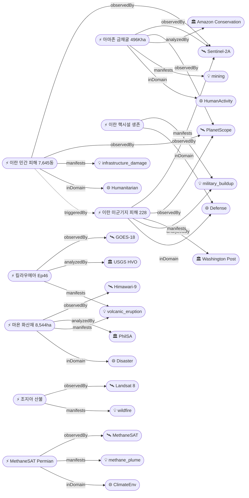

# 2026-05-06 위성영상 관측 이벤트 OSINT 일일 보고서

## 요약

금일 22건 수집, 신규 5건·업데이트 6건 보고. **국방·안보**: Washington Post가 Copernicus+Planet 위성영상 교차검증으로 **이란의 미군기지 타격이 공식 발표보다 훨씬 광범위**(228개 구조물 피해)함을 밝히고, CNN은 이란 핵시설 일부가 미·이스라엘 공습에서 생존했음을 위성영상으로 확인. **자연재해**: Kīlauea Episode 46이 9시간 분출 후 종료(650ft 용암 분수, 460만 m³), **PhilSA가 마욘 화산재 8,544ha 위성 매핑**(Himawari-9), 조지아 산불 봉쇄 진전(Hwy82 85%·Pineland 65%). **인간활동**: 아마존 금 채굴 대규모 위성 모니터링 연구 — **496,000ha 삼림 파괴**(Sentinel-2+PlanetScope). **인도주의**: Bloomberg·Oregon State 분석 — 이란 내 7,645동 피해(교육시설 60곳·의료시설 12곳 포함). **기후·환경**: MethaneSAT Permian Basin 데이터 — 미 상원 조사 착수. 다중 위성 교차검증 3건, 한반도 관련 금일 신규 없음. 농업·해양 금일 신규 없음.

## 오늘의 핵심 (Top 5)

| 순위 | 이벤트 | 도메인 | 위성/센서 | 지역 | 신뢰도 |
|------|--------|--------|-----------|------|--------|
| 1 | 이란 미군기지 타격 피해 위성 교차검증 (228개 구조물) | Defense | Copernicus Sentinel-2 + Planet | 중동 다수 기지, UAE/사우디 | 0.90 |
| 2 | PhilSA 마욘 화산재 8,544ha 위성 매핑 | Disaster | Himawari-9 + PhilSA | Albay, 필리핀 | 0.95 |
| 3 | 아마존 금 채굴 삼림벌채 496,000ha | HumanActivity | Sentinel-2 + PlanetScope | Xingu, 브라질 | 0.85 |
| 4 | 이란 민간 시설 피해 7,645동 위성 평가 | Humanitarian | Sentinel-2 + Planet | Isfahan/Tehran, 이란 | 0.85 |
| 5 | Kīlauea Episode 46 — 9시간 분출 종료 | Disaster | GOES-18 + Landsat | 하와이, 미국 | 0.95 |

## 다중 위성 교차검증 이벤트

### 1. 이란 미군기지 피해 — Copernicus Sentinel-2 + Planet 교차검증
- **출처:** [Washington Post — Iran has hit far more U.S. military assets than reported, satellite images show](https://www.washingtonpost.com/investigations/2026/05/06/iran-us-bases-satellite-images/)
- **위성·센서:** Copernicus Sentinel-2 (ESA, MSI 10m), Planet PlanetScope (3m)
- **관측일:** 2026-02 ~ 2026-05
- **위치:** 중동 다수 미군기지 (UAE, 사우디아라비아 등)
- **현상:** military_buildup
- **상태:** 신규
- **분석:** Washington Post 조사보도에서 이란 공습에 의한 미군기지 피해를 독립적으로 검증. 이란측 위성영상 109장을 EU Copernicus 저해상도 영상과 Planet 고해상도 영상으로 교차검증하여 228개 구조물(격납고·막사·연료저장고·항공기·레이더·방공장비) 피해를 확인. 공식 발표보다 피해 규모가 훨씬 큰 것으로 확인됨.
- **multiSatBoost:** +0.20 (Copernicus × Planet, ESA × Planet Labs 독립 운영자 교차검증)
- **전후 비교:** 가능 (before/after 영상 비교 분석)

### 2. 아마존 금 채굴 삼림벌채 — Sentinel-2 + PlanetScope 모니터링
- **출처:** [PBS NewsHour/AP — Brazil gold mining rush brings deforestation and mercury risks](https://www.pbs.org/newshour/world/brazil-gold-mining-rush-brings-deforestation-and-mercury-risks-to-the-amazon)
- **위성·센서:** Sentinel-2 (ESA, MSI 10m), PlanetScope (Planet Labs, 3m)
- **관측일:** 2018 ~ 2025 (장기 모니터링)
- **위치:** Xingu 지역 (Terra do Meio, Altamira NF, Nascentes da Serra do Cachimbo), 브라질 (-5.0°S, 53.0°W)
- **현상:** mining + deforestation
- **상태:** 신규
- **분석:** Amazon Conservation + Instituto Socioambiental 공동 연구(2026-05-05 발표)에서 Amazon Mining Watch 플랫폼을 통해 아마존 전역 496,000ha(브라질만 223,000ha) 채굴 관련 삼림벌채 확인. Kayapó 원주민 토지에서 7,940ha, Nascentes da Serra do Cachimbo 보호구역에서 26.8ha 등 보호구역 내 불법 채굴 확산. 80%가 불법 가능성 높음.
- **multiSatBoost:** +0.20 (Sentinel-2 × PlanetScope)
- **전후 비교:** 가능 (2018~2025 시계열 비교)

### 3. 이란 민간 피해 평가 — Sentinel-2 + Planet 위성 분석
- **출처:** [Bloomberg — Iran Satellite Data Show US-Israel Strike Damage to Civilian, Military Sites](https://www.bloomberg.com/graphics/2026-iran-tehran-strike-damage-satellite-images/)
- **위성·센서:** Sentinel-2 (ESA, MSI 10m), Planet PlanetScope (3m)
- **관측일:** 2026-02-28 ~ 2026-04-08
- **위치:** Isfahan, Tehran, 이란 (32.65°N, 51.68°E)
- **현상:** infrastructure_damage
- **상태:** 신규
- **분석:** Oregon State University Conflict Ecology 연구팀 추산 — 적어도 7,645동 파괴/손상(교육시설 60곳, 의료시설 12곳 포함). 이스파한(역사적 문화수도·산업 허브)과 테헤란이 특히 심각한 피해. 휴전 개시(4/8) 이전 기간 집중 분석.
- **multiSatBoost:** +0.20 (Sentinel-2 × Planet)
- **전후 비교:** 가능 (충돌 전/후 비교)

## 한반도 GeoFocus

금일 한반도 관련 신규 이벤트 없음. 전일까지의 추적 항목:
- 425사업 정찰위성 5기 전력화 완료 (2026-05-05 보고) — 변동 없음
- 북한 신포 SLBM 발사 준비 (2026-05-05 보고) — 금일 추가 위성영상 미확인
- CAS500-2 스마트농업 활용 전망 (2026-05-05 보고) — 초기운용 중

## 자연재해 (Disaster)

### 1. Kīlauea Episode 46 종료 — 650ft 용암 분수, 9시간 `추적`
- **출처:** [The Watchers — Kīlauea episode 46 ends after 9 hours of lava fountaining](https://watchers.news/2026/05/06/kilauea-episode-46-lava-fountaining-tephra-reaches-highway-11-hawaii-may-2026/)
- **위성·센서:** GOES-18 (NOAA, 정지궤도 열적외), Landsat (NASA/USGS, OLI/TIRS)
- **관측일:** 2026-05-05
- **위치:** Kīlauea summit, Halemaʻumaʻu, 하와이, 미국 (19.42°N, 155.29°W)
- **현상:** volcanic_eruption
- **상태:** 업데이트 ← 2026-05-05 "Kīlauea Episode 46 분출 개시"
- **분석:** Episode 46 — 2026-05-05 08:17~17:22 HST (9시간). 북쪽 분출구에서 최대 200m(650ft) 용암 분수. 순간 최대 분출률 240 m³/s (09:50 HST), 평균 140 m³/s. 약 460만 m³ 용암이 분출되어 Halemaʻumaʻu 분화구 바닥 약 60%를 피복. 화산 연기 최대 6km(20,000ft) 도달. 주먹 크기 테프라가 Uēkahuna 전망대와 Highway 11 (국립공원 내 마일마커 31~32)에 낙하, 최대 15cm 파편. Pele's hair와 미세 화산재가 Mountain View까지 보고됨.
- **officialBoost:** +0.15 (USGS HVO)

### 2. Mayon 화산 — PhilSA 위성 화산재 8,544ha 매핑 + VAAC 5/6 경보
- **출처:** [PhilStar — Space agency: Mayon ashfall covers area half the size of Quezon City](https://www.philstar.com/headlines/2026/05/06/2526082/space-agency-mayon-ashfall-covers-area-half-size-quezon-city)
- **위성·센서:** Himawari-9 (JMA/JAXA, 정지궤도), PhilSA 위성 (필리핀 우주청)
- **관측일:** 2026-05-04 ~ 05-06
- **위치:** Mayon Volcano, Albay, 필리핀 (13.25°N, 123.69°E)
- **현상:** volcanic_eruption
- **상태:** 신규 (PhilSA 위성 매핑) + 업데이트 (VAAC 경보 지속)
- **분석:** PhilSA 위성영상 분석 — 화산재 낙하 영역 **8,544ha** (퀘존시의 약 절반). VAAC Tokyo가 5/6 12:52Z에 Himawari-9 데이터 기반 화산재 경보 발행. 용암 흐름 Basud 3.8km, Bonga 3.2km, Mi-isi 1.6km. Mi-isi 방향 화쇄류 3km 도달. PHIVOLCS Alert Level 3 유지.
- **officialBoost:** +0.15 (PhilSA + PHIVOLCS)

### 3. 조지아 산불 — Hwy 82 85% · Pineland 65% 봉쇄 진전 `추적`
- **출처:** [Georgia Forestry Commission — Current Wildfire Information](https://gatrees.org/current-wildfire-information-and-resources/)
- **위성·센서:** Landsat 8 (NASA/USGS, OLI bands 7-5-4 false color), VIIRS (NOAA/Suomi-NPP)
- **관측일:** 2026-05-05
- **위치:** Brantley County / Ware County, 조지아, 미국 (31.2°N, 82.3°W)
- **현상:** wildfire
- **상태:** 업데이트 ← 2026-05-05 "조지아 산불 Hwy82 85%·Pineland 50%"
- **분석:** Hwy 82 Fire: 22,471ac (9,092ha) — 85% 봉쇄 (전일 대비 동일). Pineland Road Fire: 32,575ac (13,183ha) — 65% 봉쇄 (전일 50%→65% 진전). NASA Landsat 8 OLI 거짓색상(bands 7-5-4) 영상에서 Atkinson·Fruitland 근처 화상 흔적과 활성 화재 전선(적외선 주황색) 확인.
- **thermalBoost:** +0.10 (VIIRS 열적외 화재 탐지)

## 인간활동 (Human Activity)

### 1. 아마존 금 채굴 삼림벌채 — 위성 모니터링 496,000ha
- **출처:** [PBS NewsHour/AP — Brazil gold mining rush brings deforestation and mercury risks to the Amazon](https://www.pbs.org/newshour/world/brazil-gold-mining-rush-brings-deforestation-and-mercury-risks-to-the-amazon)
- **위성·센서:** Sentinel-2 (ESA, MSI 10m), PlanetScope (Planet Labs, 3m), Amazon Mining Watch 플랫폼
- **관측일:** 2018 ~ 2025 (장기)
- **위치:** Xingu 지역, Pará/Mato Grosso, 브라질 (-5.0°S, 53.0°W)
- **현상:** mining + deforestation
- **상태:** 신규
- **분석:** (다중 위성 교차검증 섹션 참조) 금값 급등에 따른 아마존 불법 채굴 급증. 보호구역 3곳(Terra do Meio 30ha, Altamira NF 832ha, Nascentes 26.8ha) 내 불법 벌채 확인. 비밀 활주로까지 위성으로 탐지. 수은 오염 위험 동반.

## 기후·환경 (Climate & Environment)

### 1. MethaneSAT Permian Basin — 미 상원 메탄 배출 조사 착수 `추적`
- **출처:** [MethaneSAT — Data enables novel comparison of methane mitigation in Permian Basin](https://www.methanesat.org/project-updates/methanesat-data-enables-novel-comparison-methane-mitigation-efforts-permian-basin)
- **위성·센서:** MethaneSAT (EDF, 미량가스 100m)
- **관측일:** 2024-03 ~ 2025-06 (MethaneSAT 운용 기간)
- **위치:** Permian Basin, 뉴멕시코/텍사스, 미국 (31.8°N, 103.5°W)
- **현상:** methane_plume
- **상태:** 업데이트 ← 2026-05-04 "MethaneSAT Permian Basin Senate investigation"
- **분석:** MethaneSAT 관측 데이터에서 Permian Basin 메탄 배출이 EPA 공식 추정의 4배(410 vs 104 mt/hr)로 확인. 뉴멕시코 측 1.2% vs 텍사스 측 3.1% — 규제 정책 차이의 효과를 최초로 위성으로 입증. Sheldon Whitehouse 상원의원이 EPA 보고 불일치에 대한 공식 조사 착수. MethaneSAT은 2025년 6월 교신 상실(EDF, $88M).
- **tracegasBoost:** +0.15 (미량가스 센서 적합)

## 농업·해양 (Agriculture & Maritime)

금일 위성영상 관측 신규 이벤트 없음. CAS500-2 스마트농업 활용 전망(2026-05-05 보고)은 초기운용 기간 중.

## 국방·안보 (Defense — OSINT 한정)

### 1. 이란 미군기지 타격 피해 — 위성 교차검증 228개 구조물
- **출처:** [Washington Post — Iran has hit far more U.S. military assets than reported](https://www.washingtonpost.com/investigations/2026/05/06/iran-us-bases-satellite-images/)
- **위성·센서:** Copernicus Sentinel-2 (ESA, 10m), Planet PlanetScope (3m)
- **관측일:** 2026-02 ~ 2026-05
- **위치:** 중동 다수 미군기지 (UAE, 사우디 등, 좌표 일반화)
- **현상:** military_buildup
- **상태:** 신규
- **분석:** (다중 위성 교차검증 섹션 참조) 격납고·막사·연료저장고·항공기·레이더·방공장비 포함 228개 구조물 피해. 일부 기지는 공격 위험으로 인원 대부분 철수.
- **민감 정보 처리:** 좌표 정밀도 일반화 (국가 단위)

### 2. 이란 핵시설 일부 생존 — CNN 위성영상 분석
- **출처:** [CNN — The US said it decimated Iran's nuclear capabilities. But satellite images show some survived](https://www.cnn.com/2026/05/05/politics/video/satellite-images-iran-nuclear-supply-invs)
- **위성·센서:** Sentinel-2 (ESA), 상업 위성 (미상)
- **관측일:** 2026-04 ~ 05
- **위치:** Isfahan 인근, 이란 (32.8°N, 51.7°E, 일반화)
- **현상:** military_buildup
- **상태:** 신규
- **분석:** CNN 조사에서 미·이스라엘 공습 후에도 이란 핵 공급망 일부 요소가 위성영상 상 생존한 것으로 확인. 핵 전문가들은 성공한 공습의 효과에 대해서도 불확실성을 지적.
- **민감 정보 처리:** 좌표 정밀도 일반화

## 인도주의 (Humanitarian)

### 1. 이란 내 민간 피해 — 7,645동 파괴/손상 위성 평가
- **출처:** [Bloomberg — Iran Satellite Data Show US-Israel Strike Damage](https://www.bloomberg.com/graphics/2026-iran-tehran-strike-damage-satellite-images/)
- **위성·센서:** Sentinel-2 (ESA, MSI 10m), Planet PlanetScope (3m)
- **관측일:** 2026-02-28 ~ 2026-04-08
- **위치:** Isfahan, Tehran, 이란 전역 (32.65°N, 51.68°E, 일반화)
- **현상:** infrastructure_damage
- **상태:** 신규
- **분석:** (다중 위성 교차검증 섹션 참조) 교육시설 60곳·의료시설 12곳 포함. 적대행위 기간(2/28~4/8) 집중 분석.

### 2. UNOSAT 가자 종합 피해 평가 — 198,273 구조물 `추적`
- **출처:** [UNOSAT — Gaza Governorate Comprehensive Damage Assessment](https://unosat.org/products/4205)
- **위성·센서:** WorldView-3 (Maxar, 0.31m), PlanetScope (Planet, 3m)
- **관측일:** 2025-10-11 (최근 평가 기준)
- **위치:** Gaza Strip (31.5°N, 34.5°E)
- **현상:** infrastructure_damage
- **상태:** 업데이트 ← 2026-05-02 "UNOSAT Gaza damage assessment"
- **분석:** 가자지구 전체 구조물의 약 81% 손상. 123,464동 파괴, 17,116동 심각 손상, 33,857동 중간 손상, 23,836동 경미 손상. 주거 320,622호 피해 (전회 대비 12% 증가).

## 센서·플랫폼별 묶음

- **Sentinel-2 (ESA, 광학 10m):** 이란 미군기지 피해 검증, 이란 민간 피해, 아마존 삼림벌채 — 금일 가장 다용도 활용
- **Planet PlanetScope (3m):** 이란 교차검증, 아마존 모니터링 — 상업 영상의 OSINT 역할 확대
- **Himawari-9 (JMA/JAXA, 정지궤도):** 마욘 화산 VAAC 화산재 경보 — 실시간 화산 모니터링
- **Landsat 8/9 (NASA/USGS):** 조지아 산불 false-color 화상 영역 매핑
- **GOES-18 (NOAA, 정지궤도):** 킬라우에아 분출 실시간 열적외 모니터링
- **VIIRS (NOAA/Suomi-NPP):** 조지아 산불 열원 탐지
- **MethaneSAT (EDF):** Permian Basin 메탄 배출 정량화 (현재 교신 상실)
- **MODIS (NASA Terra):** FIRMS 전 지구 화재 활성 모니터링
- **KOMPSAT-3A/5/CAS500:** 금일 신규 관측 보도 없음

## 전후 비교(before/after) 영상 보유 이벤트

| 이벤트 | 위성 | 비교 유형 |
|--------|------|----------|
| 이란 미군기지 피해 (src-001) | Copernicus + Planet | 공습 전/후 구조물 상태 비교 |
| 이란 민간 시설 피해 (src-008) | Sentinel-2 + Planet | 적대행위 전/후 건물 손상 비교 |
| 아마존 금 채굴 삼림벌채 (src-007) | Sentinel-2 + PlanetScope | 2018~2025 시계열 변화 추적 |
| Kīlauea Episode 46 (src-002) | Landsat/Sentinel-2 | 분출 전/후 분화구 지형 변화 |

## 미검증 의혹

금일 미검증 의혹 해당 사항 없음. 모든 신규 이벤트에 위성 출처가 명시됨.

## 지식그래프

### 오늘의 주요 관계

1. **다중 위성 교차검증 3건 확인:** 이란 미군기지(Copernicus+Planet), 아마존 삼림벌채(Sentinel-2+PlanetScope), 이란 민간 피해(Sentinel-2+Planet) — 각각 독립 운영자 위성 교차검증으로 multiSatBoost +0.20 적용
2. **인과관계 추론:** 이란 미군기지 타격(Defense) → 이란 민간 시설 피해(Humanitarian) — 같은 분쟁 맥락에서 cascading_disaster 유사 패턴
3. **시계열 연속관측:** Kīlauea(Episode 44→45→46), Mayon(4/28~5/6 지속), Georgia 산불(4/21~5/5)
4. **센서-현상 적합성:** MethaneSAT × methane_plume (tracegasBoost +0.15), GOES-18 × volcanic_eruption (thermalBoost +0.10)

### 전체 지식그래프 시각화

## 온톨로지 변경

| 변경 유형 | 대상 | 근거 |
|----------|------|------|
| 새 기관 | org-philsa (PhilSA, space_agency, PH) | PhilSA 위성영상으로 마욘 화산재 8,544ha 매핑 (src-004) |
| 새 기관 | org-washpost (Washington Post, media, US) | 이란 미군기지 피해 Copernicus+Planet 교차검증 보도 (src-001) |
| 새 기관 | org-amazon-conservation (Amazon Conservation, ngo, US) | Amazon Mining Watch 위성 모니터링 플랫폼 운영 (src-007) |
| 새 기관 | org-oregon-state (Oregon State Conflict Ecology, research, US) | 이란 민간 피해 위성 기반 피해 추산 (src-008) |
| 새 국가 | co-ir (이란, IR, 서아시아) | 이란 미군기지+민간 피해 위성 분석 (src-001/008) |
| 새 국가 | co-ae (UAE, AE, 서아시아) | 이란 미군기지 타격 대상 지역 (src-001) |

## 추론 결과

| 추론 | 신뢰도 | 근거 |
|------|--------|------|
| temp-081 multi_satellite_confirmation | 0.90 | Copernicus Sentinel-2 + Planet PlanetScope 독립 교차검증 |
| temp-083 multi_satellite_confirmation | 0.85 | Sentinel-2 + PlanetScope 장기 모니터링 교차검증 |
| temp-084 multi_satellite_confirmation | 0.85 | Sentinel-2 + Planet 독립 교차검증 |
| temp-082 official_source_trust | 0.95 | PhilSA(space_agency) + PHIVOLCS 공식 분석 |
| evt-021 official_source_trust | 0.95 | USGS HVO 공식 발표 |
| temp-084 triggeredBy temp-081 | 0.80 | 동일 분쟁 맥락, 같은 지역, 같은 기간 내 발생 |
| evt-053 tracegasBoost | 0.90 | MethaneSAT 미량가스 센서 × methane_plume 현상 적합 |
| temp-081/083/084 baCredibilityBoost | 0.85+ | 전후 비교 영상 보유 |

## 분석 및 평가

**금일 핵심 트렌드:** 위성영상이 정부 공식 발표와 실제 피해 간의 격차를 드러내는 '검증자' 역할이 두드러짐. Washington Post의 이란 미군기지 피해 검증과 MethaneSAT의 EPA 메탄 배출 불일치 보도가 이를 대표함. 상업 위성(Planet)과 공공 위성(Copernicus)의 교차검증은 OSINT 신뢰도의 핵심 축으로 부상.

**자연재해:** 글로벌 화산 활동이 특히 활발 — Kīlauea(하와이), Mayon(필리핀), 이전 보고된 Sabancaya(페루), Fuego(과테말라). PhilSA의 마욘 화산재 8,544ha 위성 매핑은 아시아 우주기관의 재해 대응 역량 확대를 보여줌. 조지아 산불은 Pineland 봉쇄율 50→65%로 진전.

**국방·안보:** 이란-미국 분쟁에서 위성영상의 역할이 극대화. WashPost/Bloomberg/CNN이 각각 독립적으로 위성 분석을 수행하여 교전 규모를 검증. Planet Labs의 중동 영상 비공개 정책(미국 정부 요청)과 대비되는 Copernicus(EU) 영상의 공개적 활용이 대조적.

**환경·인간활동:** 아마존 금 채굴 496,000ha 위성 보고서는 장기 모니터링의 정책적 영향력을 보여줌. MethaneSAT 데이터가 미 상원 조사까지 이어지며 위성 관측→정책 변화 파이프라인의 실효성 입증.

## 추적 항목

| 항목 | 최초 보고 | 상태 | 최신 업데이트 |
|------|----------|------|-------------|
| Kīlauea 화산 연쇄 분출 | 2026-04-30 | 활성 (Episode 46 종료, 47 예상) | 2026-05-06 |
| Mayon 화산 분출 | 2026-05-01 | 활성 (Alert Level 3 유지) | 2026-05-06 |
| 조지아 산불 | 2026-04-30 | 봉쇄 진행 (65~85%) | 2026-05-06 |
| MethaneSAT Permian Basin | 2026-05-03 | 상원 조사 진행 | 2026-05-06 |
| UNOSAT 가자 피해 | 2026-04-30 | 지속 추적 | 2026-05-06 |
| 이란-미국 분쟁 위성 분석 | 2026-05-04 | 활성 (새 검증 보도 지속) | 2026-05-06 |
| 북한 신포 SLBM 준비 | 2026-05-05 | 감시 중 | 2026-05-05 |
| 425사업 정찰위성 5기 | 2026-05-05 | 전력화 완료 | 2026-05-05 |
| 아마존 채굴 삼림벌채 | 2026-05-06 | 신규 | 2026-05-06 |

## 출처 목록

1. [Iran has hit far more U.S. military assets than reported, satellite images show](https://www.washingtonpost.com/investigations/2026/05/06/iran-us-bases-satellite-images/) - Washington Post, 2026-05-06
2. [Kīlauea episode 46 ends after 9 hours of lava fountaining](https://watchers.news/2026/05/06/kilauea-episode-46-lava-fountaining-tephra-reaches-highway-11-hawaii-may-2026/) - The Watchers, 2026-05-06
3. [Mayon Volcano Ash Advisory May 6 — ERUPTION AT 1252Z](https://www.volcanodiscovery.com/mayon/news/301638/vaac-advisory-2026-571.html) - VolcanoDiscovery/VAAC Tokyo, 2026-05-06
4. [Space agency: Mayon ashfall covers area half the size of Quezon City](https://www.philstar.com/headlines/2026/05/06/2526082/space-agency-mayon-ashfall-covers-area-half-size-quezon-city) - PhilStar, 2026-05-06
5. [Georgia Forestry Commission — Current Wildfire Information](https://gatrees.org/current-wildfire-information-and-resources/) - GA Forestry Commission, 2026-05-05
6. [Wildfire in Tuscany, Italy — EMSR873](https://mapping.emergency.copernicus.eu/news/wildfire-in-tuscany-italy-emsr873/) - Copernicus EMS, 2026-04-28
7. [Brazil gold mining rush brings deforestation and mercury risks to the Amazon](https://www.pbs.org/newshour/world/brazil-gold-mining-rush-brings-deforestation-and-mercury-risks-to-the-amazon) - PBS NewsHour/AP, 2026-05-05
8. [Iran Satellite Data Show US-Israel Strike Damage to Civilian, Military Sites](https://www.bloomberg.com/graphics/2026-iran-tehran-strike-damage-satellite-images/) - Bloomberg, 2026-05-06
9. [The US said it decimated Iran's nuclear capabilities. But satellite images show some survived](https://www.cnn.com/2026/05/05/politics/video/satellite-images-iran-nuclear-supply-invs) - CNN, 2026-05-05
10. [MethaneSAT data enables novel comparison of methane mitigation in Permian Basin](https://www.methanesat.org/project-updates/methanesat-data-enables-novel-comparison-methane-mitigation-efforts-permian-basin) - MethaneSAT/EDF, 2026
11. [UNOSAT Gaza Governorate Comprehensive Damage Assessment](https://unosat.org/products/4205) - UNOSAT, 2025-10
12. [USGS Photo & Video Chronology — May 5, 2026 — Kīlauea Episode 46](https://www.usgs.gov/observatories/hvo/news/photo-video-chronology-may-5-2026-kilauea-episode-46) - USGS HVO, 2026-05-05
13. [Mayon Volcano activity update May 5, 2026 — Continuing eruption](https://www.volcanodiscovery.com/mayon/news/301586/Mayon-Philippines-Volcano-Philippines-activity-update-May-5-2026-Continuing-eruptionCite-this-Report.html) - VolcanoDiscovery, 2026-05-05
14. [Satellite imagery suggests far more US sites hit by Iran than reported](https://www.middleeasteye.net/news/satellite-imagery-suggests-far-more-us-sites-hit-iran-reported) - Middle East Eye, 2026-05-06
15. [Senator Launches Investigation Into Methane Pollution in the Permian Basin](https://insideclimatenews.org/news/19032026/senator-whitehouse-permian-basin-methane-pollution-investigation/) - Inside Climate News, 2026-03
