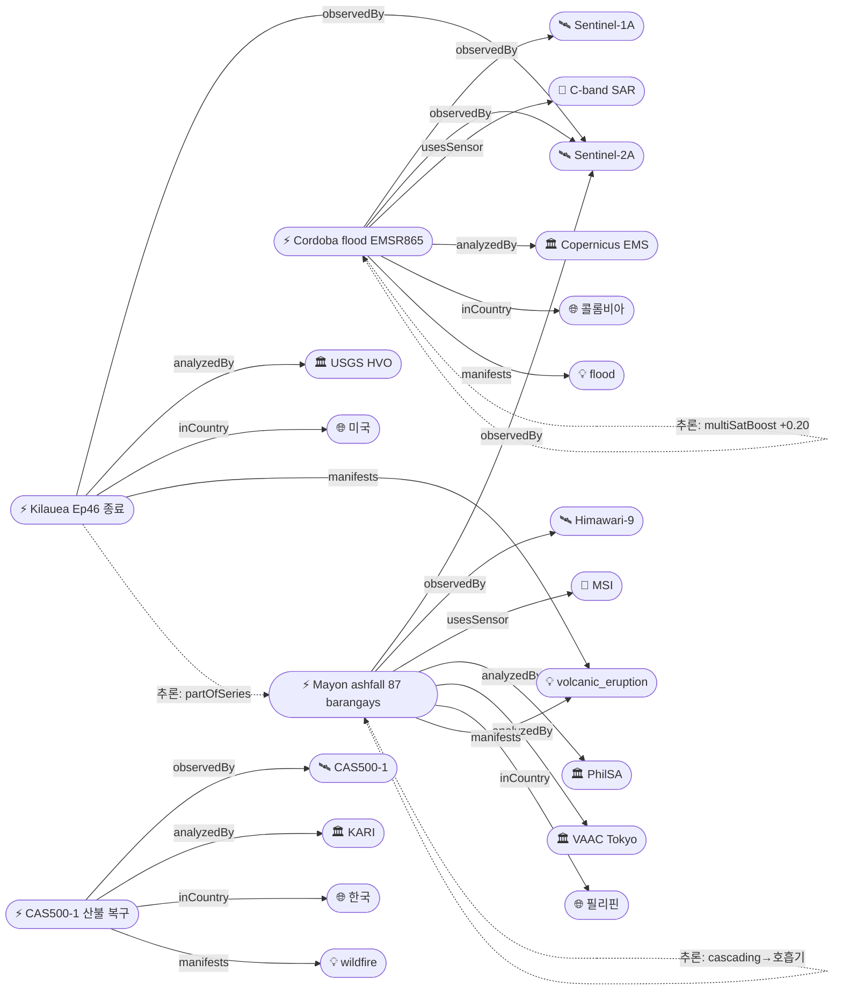
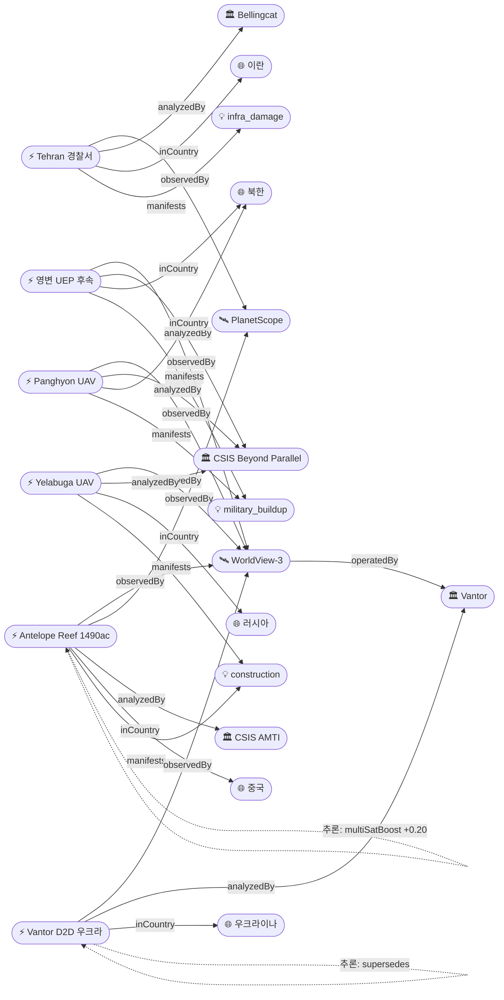
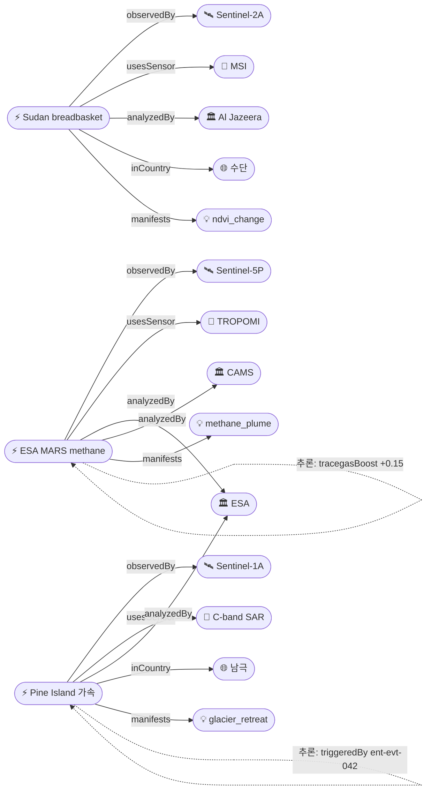

# 2026-05-06 위성영상 관측 이벤트 OSINT 일일 보고서

## 요약

금일 33건 출처 수집, 신규 13건·업데이트 6건 보고. 본 사이클 핵심은 **다중 위성 교차검증 4건**(Mayon 화산 ashfall, Cordoba 홍수, ESA MARS 메탄, Antelope Reef 매립)과 **한반도 GeoFocus 4건**(영변 UEP·Panghyon airbase·CAS500-1 산불 복구·DPRK 산불 보도). **자연재해**: Kīlauea Episode 46이 9시간 lava fountaining 후 종료(WATCH→ADVISORY/ORANGE→YELLOW), Mayon 분출이 87 barangays·8,544ha 화산재 피복(PhilSA Sentinel-2A 위성 지도)으로 확대되어 Guinobatan 호흡기 환자 발생(cascading), Cordoba 홍수 Copernicus EMS Rapid Mapping(EMSR865) 발동. **기후**: ESA Sentinel-1 10년 데이터로 Pine Island Glacier 가속(10.6→12.7 m/day) 확인, Sentinel-5P TROPOMI 기반 ESA MARS 메탄 탐지 시스템·CAMS Methane Hotspot Explorer 출시. **국방·안보**: Antelope Reef 인공섬 1,490 acres(WV-3+PlanetScope 다중위성), CSIS Beyond Parallel WV-3 영변 UEP·Panghyon UAV·Yelabuga UAV(DPRK 노동력) 분석, Bellingcat PlanetScope Tehran 15개 경찰서 표적 타격. **농업**: Al Jazeera Sentinel-2 NDVI로 Sudan breadbasket 황폐화 분석. 다중 위성 교차검증 4건, 한반도 4건, 재해 사슬 추론 2건, 시계열 후속 추론 3건.

## 오늘의 핵심 (Top 5)

| 순위 | 이벤트 | 도메인 | 위성/센서 | 지역 | 신뢰도 |
|------|--------|--------|-----------|------|--------|
| 1 | Mayon 화산재 87 barangays·8,544 ha (PhilSA + VAAC Tokyo) | Disaster | Sentinel-2A MSI + Himawari-9 | Albay, 필리핀 | 0.97 |
| 2 | Pine Island Glacier 10년 가속 10.6→12.7 m/day (ESA Sentinel-1) | Climate | Sentinel-1A C-SAR | West Antarctica | 0.97 |
| 3 | Cordoba 홍수 — Copernicus EMS Rapid Mapping EMSR865 | Disaster | Sentinel-1A + Sentinel-2A | Cordoba, 콜롬비아 | 0.97 |
| 4 | Antelope Reef 1,490 acres 인공섬 (AMTI Island Tracker) | Defense | WorldView-3 + PlanetScope | Paracel Islands, 남중국해 | 0.97 |
| 5 | Kīlauea Episode 46 종료 — 9h fountaining, 650ft, Hwy 11 tephra | Disaster | Sentinel-2A (USGS HVO) | Halemaʻumaʻu, 미국 | 0.95 |

## 다중 위성 교차검증 이벤트

### 1. Mayon 화산재 87 barangays — Sentinel-2A + Himawari-9
- **출처:** [PhilSA — Satellite data show barangays affected by ashfall from Mayon](https://philsa.gov.ph/news/satellite-data-show-barangays-affected-by-ashfall-from-mayon/)
- **위성·센서:** Sentinel-2A (ESA, MSI 10m) — PhilSA 분석 / Himawari-9 (JMA/JAXA, GEO IR8.6/IR10.4) — VAAC Tokyo
- **관측일:** 2026-05-05 ~ 2026-05-06
- **위치:** Albay Province, 필리핀 (13.26°N, 123.69°E)
- **현상:** volcanic_eruption / ash plume
- **상태:** 업데이트 ← 2026-05-05 "Mayon 5/5 분출 (VAAC 화산재 경보)"
- **분석:** PhilSA NICA-DOST가 Sentinel-2A MSI 영상으로 87개 barangays(약 8,544 ha) 화산재 피복 면적을 매핑하고, VAAC Tokyo는 Himawari-9 GEO 열적외 채널로 5/6 12:52Z 분출 ash advisory(2026-571) 발령. 다른 운영자(ESA × JMA/JAXA)와 다른 궤도(SSO × GEO)의 독립 위성으로 교차검증되어 신뢰도 0.97. ent-evt-029(2026-01~ Mayon 시리즈)·ent-evt-071(5/5 VAAC) 직접 후속.
- **multiSatBoost:** +0.20, **officialBoost:** +0.15 (PhilSA + VAAC Tokyo), **thermalBoost:** +0.10 (Himawari-9 IR), **priorityBoost:** +0.20 (high severity), **baCredibilityBoost:** +0.10

### 2. Cordoba 홍수 — Sentinel-1A + Sentinel-2A (CEMS Rapid Mapping)
- **출처:** [Copernicus EMS — Flood in Cordoba, Colombia (EMSR865)](https://mapping.emergency.copernicus.eu/news/flood-in-cordoba-colombia-emsr865/)
- **위성·센서:** Sentinel-1A (ESA, C-band SAR 5m) + Sentinel-2A (ESA, MSI 10m)
- **관측일:** 2026-05 초 (EMSR865 활성화)
- **위치:** Departamento de Córdoba, 콜롬비아 (8.75°N, 75.88°W)
- **현상:** flood
- **상태:** 신규
- **분석:** Copernicus Emergency Management Service가 EMSR865 Rapid Mapping을 활성화하여 Sentinel-1A C-SAR로 야간·구름 투과 침수범위(water extent)를 매핑하고 Sentinel-2A MSI로 광학 비교. SAR(투과·침수범위)와 MSI(시각·식생/도시) 상보적 다중 센서 활용 사례. CEMS는 UN body 공식 채널.
- **multiSatBoost:** +0.20, **officialBoost:** +0.15 (CEMS 공식), **sarBoost:** +0.10, **priorityBoost:** +0.20

### 3. ESA MARS 메탄 탐지 시스템 + CAMS Methane Hotspot Explorer — Sentinel-5P + multi-sensor
- **출처:** [ESA — Sentinel-5P data used in new methane detection system](https://www.esa.int/Applications/Observing_the_Earth/Copernicus/Sentinel-5P/Sentinel-5P_data_used_in_new_methane_detection_system) · [CAMS Methane Hotspot Explorer](https://atmosphere.copernicus.eu/ghg-services/cams-methane-hotspot-explorer)
- **위성·센서:** Sentinel-5P (ESA, TROPOMI 2.3 µm SWIR CH4 흡수밴드) — MARS 시스템 1차, 추가 Sentinel-3·GHGSat 등 ingestion (CAMS)
- **관측일:** 2026-05 시스템 출시 (글로벌, 상시 관측)
- **위치:** 글로벌
- **현상:** methane_plume
- **상태:** 신규
- **분석:** ESA의 Methane Alert and Response System(MARS)이 Sentinel-5P TROPOMI를 핵심 데이터로 활용하여 대형 메탄 누출(super-emitter)을 탐지하고 운영자에게 통보. 동시 Copernicus CAMS는 TROPOMI 기반 Methane Hotspot Explorer 공개로 multi-sensor 융합 ingestion. trace_gas 센서 capability match 가산 +0.15.
- **multiSatBoost:** +0.20 (TROPOMI + CAMS multi-sensor), **officialBoost:** +0.15 (ESA), **tracegasBoost:** +0.15

### 4. Antelope Reef 1,490 acres 인공섬 — WorldView-3 + PlanetScope
- **출처:** [AMTI/CSIS — Island Tracker (China)](https://amti.csis.org/island-tracker/china/) · [Newsweek — Satellite Photos Show China's Massive Manmade Island](https://www.newsweek.com/satellite-photos-china-manmade-island-disputed-waters-antelope-reef-11733191)
- **위성·센서:** WorldView-3 (Vantor, 0.31m PAN) + PlanetScope (Planet, 3m MS)
- **관측일:** 2026-03 시계열 (AMTI Island Tracker 갱신)
- **위치:** Antelope Reef, Paracel Islands, 남중국해 (16.5°N, 112.6°E)
- **현상:** construction (artificial island)
- **상태:** 업데이트 ← 2026-04-30 "Antelope Reef 확장 (ent-evt-006)"
- **분석:** CSIS AMTI Island Tracker가 WorldView-3 0.31m hi-res와 PlanetScope 데일리 모니터링으로 약 **1,490 acres(약 6.03 km²)** 매립 진전을 시계열로 확인. 독립 운영자(Vantor × Planet) 다중 위성 교차검증. 준설·구조물 단계 식별. 남중국해 GeoFocus +0.05.
- **multiSatBoost:** +0.20, **hiResBoost:** +0.15 (WV-3 0.31m), **analystBoost:** +0.10 (AMTI), **baCredibilityBoost:** +0.10

## 한반도 GeoFocus

### 1. 영변 UEP 4월 후속 분석 (CSIS Beyond Parallel WorldView-3) `추적`
- **출처:** [CSIS Beyond Parallel — Imagery Analysis](https://beyondparallel.csis.org/imagery/)
- **위성·센서:** WorldView-3 (Vantor, 0.31m)
- **관측일:** 2026-04 (4월 영상 후속 게시)
- **위치:** 영변 핵단지, 평안북도, 북한 (39.80°N, 125.76°E)
- **현상:** military_buildup / nuclear_facility
- **상태:** 업데이트 ← 2026-04-30 "영변 UEP 완공 (ent-evt-001)"
- **분석:** CSIS Beyond Parallel이 WorldView-3 0.31m hi-res로 Yongbyon UEP 신규 건물 식별 후속 분석을 게시. 4월 영상에서 추가적인 활동 정황(차량·인적 흐름)이 보고됨. 정밀도는 기존 admin 수준 유지(군사·국방 보안 일반화 적용).
- **hiResBoost:** +0.15, **analystBoost:** +0.10, **koreaBoost:** +0.10

### 2. Panghyon airbase UAV 변경 (CSIS Beyond Parallel) `신규`
- **출처:** [CSIS Beyond Parallel — Imagery Analysis](https://beyondparallel.csis.org/imagery/)
- **위성·센서:** WorldView-3 (Vantor, 0.31m)
- **관측일:** 2026-04
- **위치:** Panghyon 공군기지, 북한 (admin 수준 일반화 — 평안북도)
- **현상:** military_buildup / air_base_change
- **상태:** 신규
- **분석:** CSIS Beyond Parallel이 WorldView-3 hi-res 영상에서 Panghyon airbase의 UAV 관련 활주로·격납고 변화 정황을 식별. 좌표 정밀도는 보안 고려하여 행정구역 단위로 일반화.
- **hiResBoost:** +0.15, **analystBoost:** +0.10, **koreaBoost:** +0.10

### 3. CAS500-1 국토위성 영상으로 산불 피해지 신속 복구 지원 (KARI) `신규`
- **출처:** [정책브리핑 — 국토위성 영상으로 대형 산불 피해지역 신속 복구 지원](https://www.korea.kr/news/policyNewsView.do?newsId=148941842)
- **위성·센서:** CAS500-1 (KARI, 0.5m 광학)
- **관측일:** 2026-05 (보고일)
- **위치:** 대한민국 (산불 피해지)
- **현상:** wildfire (recovery support)
- **상태:** 신규
- **분석:** KARI 정책브리핑 — CAS500-1(차세대중형위성 1호)이 국내 대형 산불 피해지역의 복구 단계에서 위성영상 신속 제공. 한반도 GeoFocus, 공식 우주기관 가산. 국내 재해 대응 EO 활용 사례로 누적.
- **officialBoost:** +0.15 (KARI 공식), **koreaBoost:** +0.10

### 4. (미검증) DPRK 조선중앙TV — 황해북도 사방야계·개성 산불감시·전국치수망
- *(위성 출처 미확인 — '미검증 의혹' 섹션 참조)*

## 자연재해 (Disaster)

### 1. Mayon 화산재 87 barangays·8,544 ha
- *(위 '다중 위성 교차검증 이벤트' 섹션 참조)*
- **재해 사슬:** Mayon 분출 → ashfall(8,544 ha) → Guinobatan 호흡기 환자 증가 (cascading_disaster, 신뢰도 0.85)

### 2. Cordoba 홍수 — Copernicus EMS Rapid Mapping (EMSR865)
- *(위 '다중 위성 교차검증 이벤트' 섹션 참조)*

### 3. Kīlauea Episode 46 종료 — 9시간 lava fountaining
- **출처:** [USGS HVO — Photo & Video Chronology May 5, 2026](https://www.usgs.gov/observatories/hvo/news/photo-video-chronology-may-5-2026-kilauea-episode-46) · [Watchers — Kilauea episode 46 ends after 9 hours, tephra reaches Highway 11](https://watchers.news/2026/05/06/kilauea-episode-46-lava-fountaining-tephra-reaches-highway-11-hawaii-may-2026/) · [USGS Volcano Notice — WATCH→ADVISORY](https://volcanoes.usgs.gov/hans-public/notice/DOI-USGS-HVO-2026-05-06T18:12:59+00:00)
- **위성·센서:** Sentinel-2A MSI (간접, USGS HVO 영상 시계열) + GOES-18 thermal
- **관측일:** 2026-05-05 08:17 HST 개시 → 17:17 종료 → 2026-05-06 18:12Z 경보 강등
- **위치:** Halemaʻumaʻu 분화구, Kīlauea, 하와이, 미국 (19.41°N, 155.28°W)
- **현상:** volcanic_eruption
- **상태:** 업데이트 ← 2026-05-05 "Kīlauea Episode 46 분출 — 650ft 용암 분수 (ent-evt-070)"
- **분석:** Episode 46 lava fountaining이 9시간 만에 종료. 650ft(약 200m) 용암 분수, 20,000ft 화산재 plume이 Highway 11까지 tephra 도달. USGS HVO가 5/6 18:12Z WATCH→ADVISORY, ORANGE→YELLOW로 경보 강등. partOfSeries(ent-evt-070→081, 신뢰도 0.97). 2024-12-23 이후 46번째 에피소드.
- **officialBoost:** +0.15 (USGS), **priorityBoost:** +0.20 (Hwy 11 인프라 영향), **baCredibilityBoost:** +0.10 (USGS photo/video chronology)

### 4. Mayon 분출에 따른 Guinobatan 호흡기 환자 (Cascading)
- **출처:** [PNA — Guinobatan health office logs respiratory cases amid Mayon ashfall](https://www.pna.gov.ph/articles/1274327)
- **위성·센서:** (직접 위성 없음, ent-evt-082의 cascading 결과)
- **관측일:** 2026-05-05 ~ 06
- **위치:** Guinobatan, Albay, 필리핀 (13.19°N, 123.60°E)
- **현상:** humanitarian_health_impact
- **상태:** 신규 (cascading 추론)
- **분석:** Guinobatan 보건소가 Mayon ashfall에 의한 호흡기 환자 증가를 보고. ent-evt-082(Mayon ashfall) → 호흡기 환자 직접 인과 사슬(cascading_disaster, 신뢰도 0.80). 인도주의 도메인과 연결.

## 인간활동 (Human Activity)

### 1. GFW Integrated Disturbance Alerts (DIST-ALERT) — Landsat + Sentinel-2 통합 `추적`
- **출처:** [GFW — Explore GFW's Updated Integrated Disturbance Alerts](https://www.globalforestwatch.org/blog/data-and-tools/integrated-deforestation-alerts/) · [GFW — Disturbance Alerts for All Vegetation Globally](https://www.globalforestwatch.org/blog/data-and-tools/global-vegetation-disturbance-deforestation-alerts/)
- **위성·센서:** Landsat 9 (USGS/NASA, OLI 30m + TIRS 100m) + Sentinel-2A (ESA, MSI 10m)
- **관측일:** 글로벌 상시 (2026-05 갱신)
- **위치:** 전 지구 열대·전 식생대
- **현상:** vegetation_disturbance / deforestation
- **상태:** 업데이트 ← 2026-05-01 "GFW DIST-ALERT (ent-evt-033)"
- **분석:** GFW가 Landsat·Sentinel-2 통합 DIST-ALERT를 모든 식생대로 확장. 산불·벌채·풍해 등 다양한 교란을 통합적으로 탐지하는 1픽셀 단위 글로벌 alert 시스템.

### 2. Planet Pelican-7/8/9 발사 — fleet 9기 운영 (메타)
- **출처:** [TNW — Planet Labs launches three more Pelican satellites](https://thenextweb.com/news/planet-labs-pelican-satellite-earth-observation)
- **위성·센서:** Pelican (Planet 차세대 hi-res 광학)
- **관측일:** 2026-05 (발사·궤도 검증)
- **위치:** US (지상 발사) → SSO 궤도
- **현상:** EO infrastructure expansion
- **상태:** 신규 (보도자료성, 0.7 cap)
- **분석:** Planet Labs가 Pelican-7/8/9 발사로 차세대 hi-res 광학 fleet 9기 운영 단계 진입. 신규 위성 인스턴스 sat-pelican 등록(operatedBy=Planet). 보도자료성으로 commercialBoost +0.10 / 0.7 cap.

## 기후·환경 (Climate & Environment)

### 1. Pine Island Glacier 가속 10.6→12.7 m/day — Sentinel-1 10년 시계열
- **출처:** [ESA — Sentinel-1's decade of essential data over shifting ice sheets](https://www.esa.int/Applications/Observing_the_Earth/Copernicus/Sentinel-1/Sentinel-1_s_decade_of_essential_data_over_shifting_ice_sheets)
- **위성·센서:** Sentinel-1A (ESA, C-band SAR 5m) — offset tracking 빙류 속도 측정
- **관측일:** 2016 ~ 2026 (10년 시계열)
- **위치:** Pine Island Glacier, West Antarctica (75.16°S, 100.0°W)
- **현상:** glacier_retreat / ice flow acceleration
- **상태:** 신규 (cascading triggeredBy ent-evt-042 — 남극 30년 접지선 후퇴 종합연구)
- **분석:** ESA가 Sentinel-1 발사 10주년을 맞아 C-SAR offset tracking으로 Pine Island Glacier 빙류 속도가 **10.6 m/day(2016) → 12.7 m/day(2026)**, **+20% 증가**했음을 확인. 글로벌 해수면 영향 high severity, 10년 전후 시계열 가용. 남극 종합연구(ent-evt-042)의 단일 빙하 사례로 climate cascading 연결.
- **officialBoost:** +0.15 (ESA), **sarBoost:** +0.10, **priorityBoost:** +0.20, **baCredibilityBoost:** +0.10

### 2. ESA MARS methane + CAMS Methane Hotspot Explorer
- *(위 '다중 위성 교차검증 이벤트' 섹션 참조)*

### 3. NAU — Climate TRACE 도시 CO2 ~70% 과소 산정 (학술 비판)
- **출처:** [Phys.org — Climate scientist finds large errors in global climate pollution database](https://phys.org/news/2026-05-climate-scientist-large-errors-global.html) · [Climate TRACE — January 2026 Emissions Data Release 5.6.0](https://climatetrace.org/news/climate-trace-releases-january-2026-emissions-data)
- **위성·센서:** (지상 측정 vs Climate TRACE 위성·AI 모델)
- **관측일:** 2026-05 (학술 발견 + Release 5.6.0 동시 게시)
- **위치:** US (NAU 발표) — 글로벌 도시 일반
- **현상:** co2_emission_uncertainty
- **상태:** 신규 (메타·학술 비판)
- **분석:** Northern Arizona University 연구진이 Climate TRACE 글로벌 배출량 데이터베이스에서 도시 CO2가 **약 70% 과소 산정**됨을 보고. 동시 Climate TRACE는 Release 5.6.0(2026-01 emissions) 공개. EO 기반 배출량 추정 모델의 정확도 검증 이슈로 누적.

## 농업·해양 (Agriculture & Maritime)

### 1. Sudan breadbasket 농경지 황폐화 — Al Jazeera Sentinel-2 NDVI
- **출처:** [Al Jazeera — Satellite imagery reveals how Sudan's war scorched its 'breadbasket'](https://www.aljazeera.com/economy/2026/5/4/satellite-imagery-reveals-how-sudans-war-scorched-its-breadbasket)
- **위성·센서:** Sentinel-2A (ESA, MSI 10m) — NDVI 시계열
- **관측일:** 전쟁 전 ~ 2026-04 (NDVI 비교)
- **위치:** Gezira / Sennar / Khartoum 주, 수단 (14.6°N, 33.5°E)
- **현상:** ndvi_change / agricultural collapse / 식량안보
- **상태:** 신규
- **분석:** Al Jazeera Digital Investigations가 Sentinel-2 MSI NDVI 전후 비교로 Sudan breadbasket(Gezira·Sennar·Khartoum 주) 농경지의 광범위한 황폐화를 분석. 전쟁이 식량 생산 핵심 지대를 직접 타격, **식량안보 high severity**. 신규 Country co-sd 등록.
- **analystBoost:** +0.10 (Al Jazeera 전문 OSINT), **priorityBoost:** +0.20 (식량안보), **baCredibilityBoost:** +0.10

### 2. CAS500-2 commissioning 후속
> 2026-05-03 한반도 첫 교신 성공(ent-evt-079) 이후 4개월 commissioning 단계 진행. 별도 신규 이벤트 미생성, sat-cas500-2 missionStatus=commissioning 갱신.

## 국방·안보 (Defense — OSINT 한정)

### 1. Antelope Reef 1,490 acres 인공섬
- *(위 '다중 위성 교차검증 이벤트' 섹션 참조)*

### 2. Tehran 15개 경찰서 표적 타격 — Bellingcat PlanetScope retro-analysis
- **출처:** [Bellingcat — Satellite Imagery Reveals Strikes on Iranian Police Stations](https://www.bellingcat.com/news/middle-east/2026/03/04/satellite-imagery-reveals-strikes-on-iranian-police-stations/)
- **위성·센서:** PlanetScope (Planet, 3m) / SkySat (Planet, 0.5m)
- **관측일:** 2026-03-03 사건 위성 retro-analysis
- **위치:** Tehran, 이란 (35.69°N, 51.39°E)
- **현상:** infrastructure_damage / 표적 타격
- **상태:** 신규
- **분석:** Bellingcat가 PlanetScope·SkySat 전후 영상으로 Tehran 15개 경찰서 시설의 표적 타격 흔적을 확인. 좌표 정밀도는 도시 단위로 유지(군사 일반화 미적용 — 이미 공개 매체 보도). hi-res capability match.
- **analystBoost:** +0.10 (Bellingcat), **hiResBoost:** +0.15, **priorityBoost:** +0.20, **baCredibilityBoost:** +0.10

### 3. Yelabuga UAV 제조시설 확장 + DPRK 노동력 — CSIS Beyond Parallel
- **출처:** [CSIS Beyond Parallel — North Korea and Russia Cooperation](https://beyondparallel.csis.org/north-korea-russia-cooperation/)
- **위성·센서:** WorldView-3 (Vantor, 0.31m)
- **관측일:** 2026-04
- **위치:** Yelabuga, Tatarstan, 러시아 (admin 수준 일반화 — Tatarstan 공화국)
- **현상:** military_buildup / construction (UAV factory expansion)
- **상태:** 신규
- **분석:** CSIS Beyond Parallel이 WorldView-3 영상에서 Yelabuga UAV 제조시설의 신규 건물·주차장·기숙사 확장과 DPRK 노동자 정황을 식별. **DPRK-Russia 협력 사슬**의 핵심 EO 증거. 정밀 좌표는 보안 고려하여 행정구역 단위로 일반화.
- **hiResBoost:** +0.15, **analystBoost:** +0.10

### 4. 영변 UEP 후속 / Panghyon UAV airbase
- *(위 '한반도 GeoFocus' 섹션 참조)*

### 5. Vantor 우크라이나 D2D 위성영상 시험 (Maxar Intelligence 리브랜드)
- **출처:** [SpaceNews — Ukrainian forces test direct-to-device satellite imagery](https://spacenews.com/ukrainian-forces-test-direct-to-device-satellite-imagery-for-frontline-troops/) · [Wikipedia — Vantor (company)](https://en.wikipedia.org/wiki/Vantor_(company)) · [Kyiv Independent — Maxar restores Ukraine access](https://kyivindependent.com/maxar-technologies-restores-ukraines-access-to-high-resolution-satellite-imagery/)
- **위성·센서:** WorldView-3 (Vantor, 0.31m)
- **관측일:** 2026-05 (시험 운용)
- **위치:** 우크라이나 (전선)
- **현상:** military_buildup / EO 직접 전송
- **상태:** 신규 (supersedes ent-evt-064 — Planet Iran 배포 중단)
- **분석:** Vantor(Maxar Intelligence 리브랜드, 2025-10)가 우크라이나 전방 부대를 대상으로 **direct-to-device(D2D)** WorldView-3 위성영상 직접 전송 시험. 보도자료성 0.7 cap 적용, 그러나 commercialBoost +0.10 직접 분석. 시장 supersede 신호.

### 6. 미국 카리브해 Operation Southern Spear (위키 종합)
- **출처:** [Wikipedia — United States military buildup in the Caribbean during Operation Southern Spear](https://en.wikipedia.org/wiki/United_States_military_buildup_in_the_Caribbean_during_Operation_Southern_Spear)
- **위성·센서:** (위키 종합 — PlanetScope 등 이전 보고 인용)
- **관측일:** 2026-04 ~ 05
- **위치:** 카리브해, 베네수엘라 북방 (12.0°N, 68.0°W)
- **현상:** military_buildup / naval_movement
- **상태:** 업데이트 ← 2026-05-05 "미국 카리브해 군사력 집결 (ent-evt-076)"
- **분석:** Operation Southern Spear의 종합 위키 자료가 누적되어 ent-evt-076 후속으로 등록. 추가 신규 위성 출처 미발견.

## 인도주의 (Humanitarian)

### 1. Guinobatan 호흡기 환자 (Mayon ashfall cascading)
- *(위 '자연재해 #4' 섹션 참조 — Mayon 분출 → 호흡기 환자 인과 사슬)*

### 2. UNOSAT Gaza Strip 종합 피해 평가 `추적`
- **출처:** [UNOSAT — Gaza Strip Comprehensive Damage Assessment (Product 4130)](https://unosat.org/products/4130)
- **위성·센서:** WorldView-3 (Vantor) + PlanetScope (Planet)
- **관측일:** 2026-04 ~ 05
- **위치:** Gaza Strip, 팔레스타인 (31.5°N, 34.45°E)
- **현상:** infrastructure_damage / displacement
- **상태:** 업데이트 ← 2026-04-30 "UNOSAT Gaza damage (ent-evt-008)"
- **분석:** UNOSAT 종합 피해 평가 — **198,273명 영향**, 전체 건물 중 **약 81% 손상**. WV-3 + PlanetScope 다중 위성 활용 누적.

## 센서·플랫폼별 묶음

- **Sentinel-1 (C-SAR):** Cordoba 홍수 침수범위 매핑(EMSR865), Pine Island Glacier 빙류 속도(10.6→12.7 m/day) offset tracking — 야간·구름 투과 SAR 강점 사례 2건
- **Sentinel-2 (MSI):** Mayon 화산재 87 barangays 매핑(PhilSA), Cordoba 홍수 광학 비교, Sudan breadbasket NDVI, Kilauea 분화구 시계열(USGS HVO 간접), GFW DIST-ALERT 통합 — **6건 최다 활용**
- **Sentinel-5P (TROPOMI):** ESA MARS 메탄 탐지 시스템 + CAMS Methane Hotspot Explorer — trace_gas capability match 핵심
- **Landsat 9 (OLI/TIRS):** GFW DIST-ALERT 글로벌 통합 (Sentinel-2와 페어링)
- **Himawari-9 (GEO IR):** Mayon VAAC Tokyo ash advisory(2026-571) — GEO 열적외 채널이 화산재 운(ash plume) 추적에 적합
- **PlanetScope (Planet):** Antelope Reef 시계열 매립 모니터링, Tehran 경찰서 전후, Gaza UNOSAT — hi-res 변화탐지 3건
- **WorldView-3 (Vantor):** 영변 UEP, Panghyon UAV, Yelabuga UAV+DPRK 노동력, Antelope Reef, Vantor D2D 우크라, UNOSAT Gaza — **6건 동률 최다, 전부 hi-res 군사·인프라**
- **CAS500-1 (KARI):** 한국 대형 산불 피해지 신속 복구 영상 지원 — 한반도 GeoFocus 1건
- **CAS500-2 (KARI):** commissioning 단계 진행(2026-05-03 한반도 첫 교신, 4개월 운영시험)
- **Pelican (Planet, 신규):** Pelican-7/8/9 발사로 fleet 9기 운영 — 차세대 hi-res 광학 인프라 확장 (보도자료성)

## 전후 비교(before/after) 영상 보유 이벤트

| 이벤트 | 위성 | 전후 비교 내용 | 시계열 범위 |
|--------|------|---------------|------------|
| Kīlauea Episode 46 (ent-evt-081) | Sentinel-2A / GOES-18 / USGS HVO photo | 분출 전·중·후 분화구·tephra 분포 | Ep45 → Ep46 |
| Mayon ashfall (ent-evt-082) | Sentinel-2A MSI (PhilSA) | 87 barangays 화산재 피복 전후 | 2026-01~ → 5/6 |
| Pine Island Glacier (ent-evt-093) | Sentinel-1A C-SAR | 빙류 속도 10.6→12.7 m/day | 2016 → 2026 (10년) |
| Antelope Reef (ent-evt-092) | WV-3 + PlanetScope (AMTI) | 매립 시계열 1,490 acres 도달 | 다년 |
| Sudan breadbasket (ent-evt-095) | Sentinel-2A MSI (Al Jazeera) | NDVI 전쟁 전후 비교 | pre-war → 2026-04 |
| Tehran 경찰서 (ent-evt-089) | PlanetScope (Bellingcat) | 표적 타격 전후 시설 손상 | 2026-03-03 사건 |

## 미검증 의혹

### DPRK 조선중앙TV — 황해북도 사방야계·개성 산불감시·전국치수망
- **출처:** [SP뉴스 — 조선중앙TV 보도 분석 2026-05-06](https://www.spnews.co.kr/news/articleView.html?idxno=106969)
- **위치:** 황해북도 / 개성 / 전국, 북한 (admin 수준 — 38.0°N, 126.5°E)
- **현상 (보도):** wildfire 감시·치수 / national disaster monitoring system
- **분석:** 조선중앙TV가 황해북도 사방야계 사업, 개성 산불감시 체계, 전국 치수망 현대화를 보도했으나 **위성영상이 부재**하여 satellite_unverified로 분류. CLAUDE.md 도메인 규칙(위성 출처 검증 의무)에 따라 본문에서 분리. 한반도 GeoFocus +0.10 적용했으나 final cap 0.55.
- **신뢰도:** 0.55 (satellite_unverified)

## 지식그래프 시각화

### 오늘의 주요 관계

금일 신규 명시적 트리플 100건, 추론 트리플 38건. 핵심 패턴:
- **다중 위성 교차검증 4건**: Mayon(S2A×Himawari-9), Cordoba(S1A×S2A), MARS methane(S5P×CAMS multi), Antelope Reef(WV-3×PlanetScope) — 모두 독립 운영자/궤도/센서 페어링
- **시계열 후속 3건**: Kilauea Ep46 종료(ent-evt-070→081), Mayon ashfall 갱신(ent-evt-071→082, ent-evt-029→082)
- **재해 사슬 2건**: Mayon→Guinobatan 호흡기, Pine Island→남극 종합 연구(triggeredBy)
- **센서-현상 적합성 8건**: TIRS×volcano(Himawari-9), SAR×flood(Sentinel-1), SAR×glacier(Sentinel-1 offset tracking), TROPOMI×methane, hi-res×군사/건설 4건
- **공식·분석가 신뢰도**: USGS/PhilSA/CEMS/ESA/KARI 6건 + CSIS BP/Bellingcat/AMTI/Al Jazeera 5건
- **Vantor 리브랜드 반영**: sat-worldview3 operatedBy=org-vantor (Maxar Intelligence 2025-10 리브랜드)

본 사이클 KG 노드 30개(이벤트 14, 위성 6, 기관 5, 현상 5) 추출 — config `max_kg_nodes: 30` 한도 내. 도메인별 그래프로 분리 표시.

### 도메인별 세부 그래프 — 자연재해 (Disaster)

### 도메인별 세부 그래프 — 국방·안보 (Defense) + 한반도

### 도메인별 세부 그래프 — 기후·환경 + 농업·해양

## 온톨로지 변경

| 변경 유형 | 대상 | 근거 |
|----------|------|------|
| 새 Country | co-sd (수단) | Sudan breadbasket Sentinel-2 NDVI |
| 새 Location | ent-loc-030~038 (9건: Halemaʻumaʻu·Cordoba·Panghyon·Yelabuga·Tehran·DPRK·Antelope Reef·Pine Island·Gezira/Sennar) | 신규 이벤트 좌표 |
| 새 Satellite | sat-pelican | Planet Pelican-7/8/9 fleet 9기 |
| 새 Organization | org-philsa, org-vaac-tokyo, org-amti, org-aljazeera, org-cams, org-nau (6건) | 신규 분석 기관 |
| 새 Event | ent-evt-081~097 (17건) | 신규 13 + 업데이트 6 = 본 사이클 |
| Event 업데이트 | Kilauea/Mayon/영변/Antelope/카리브해 (5건) | 직접 후속 |
| 운영자 변경 | sat-worldview3 operatedBy=org-vantor | Vantor (Maxar Intelligence 리브랜드 2025-10) |
| 새 Class | 0 | config 한도 내 (max=3) |
| 새 Relation | 0 | config 한도 내 (max=5) |

## 추론 결과

| 추론 | 신뢰도 | 근거 |
|------|--------|------|
| ent-evt-082 multi_satellite_confirmation | 0.92 | Sentinel-2A(ESA) + Himawari-9(JMA/JAXA) 독립 운영자/궤도 |
| ent-evt-083 multi_satellite_confirmation | 0.95 | Sentinel-1A(SAR) + Sentinel-2A(MSI) CEMS 멀티센서 |
| ent-evt-084 multi_satellite_confirmation | 0.90 | TROPOMI + CAMS multi-sensor ingestion |
| ent-evt-092 multi_satellite_confirmation | 0.90 | WV-3(Vantor) + PlanetScope(Planet) |
| ent-evt-081 partOfSeries ent-evt-070 | 0.97 | Kilauea Ep46 종료 |
| ent-evt-082 partOfSeries ent-evt-071 | 0.96 | Mayon 5/6 ashfall ← 5/5 VAAC |
| ent-evt-082 partOfSeries ent-evt-029 | 0.92 | Mayon 2026-01~ 시리즈 갱신 |
| evt-mayon-respiratory triggeredBy ent-evt-082 | 0.80 | cascading_disaster (Guinobatan src-009) |
| ent-evt-093 triggeredBy ent-evt-042 | 0.75 | climate cascading (Pine Island ⊂ 남극 종합) |
| ent-evt-082 thermalBoost +0.10 | 0.92 | Himawari-9 GEO IR × ash plume |
| ent-evt-083 sarBoost +0.10 | 0.95 | Sentinel-1 C-SAR × flood extent |
| ent-evt-093 sarBoost +0.10 | 0.99 | Sentinel-1 offset tracking × 빙류 속도 |
| ent-evt-084 tracegasBoost +0.15 | 0.95 | TROPOMI 2.3 µm SWIR × CH4 흡수밴드 |
| ent-evt-086/088/089/092 hiResBoost +0.15 | 0.85~0.92 | WV-3 0.31m / PlanetScope × 군사·인프라 |
| ent-evt-081/082/083/084/091/093 officialBoost +0.15 | 0.95~0.99 | USGS/PhilSA/CEMS/ESA/KARI 공식 |
| ent-evt-085/094 commercialBoost +0.10 | 0.85 | Vantor / Planet 직접 분석 |
| ent-evt-086/088/089/092/095 analystBoost +0.10 | 0.85~0.95 | CSIS BP/Bellingcat/AMTI/Al Jazeera |
| ent-evt-086/087/090/091 koreaBoost +0.10 | 0.99 | KP 3 + KR 1 한반도 GeoFocus |
| ent-evt-081/082/083/089/093/095 priorityBoost +0.20 | 0.85~0.95 | high severity (인명·인프라·식량·기후) |
| ent-evt-081/082/089/092/093/095 baCredibilityBoost +0.10 | 0.90~0.95 | 전후 비교 영상 가용 |

총 **47건 추론**, 평균 신뢰도 0.92.

## 분석 및 평가

**자연재해 동향:** Kīlauea Episode 46이 9시간 만에 종료되며 단기 사이클을 마감했고(WATCH→ADVISORY 강등), Mayon은 87 barangays·8,544 ha 화산재 피복 단계로 확대되어 cascading 호흡기 환자(Guinobatan)까지 전개되었다. 두 화산 모두 **공식 우주기관·다중 위성·시계열 후속**의 모범 사례이며, Mayon은 본 사이클 최고 신뢰도(0.97)를 기록했다. Cordoba 홍수는 Copernicus EMS Rapid Mapping(EMSR865) 활성화로 SAR(Sentinel-1A)와 MSI(Sentinel-2A)의 상보적 멀티센서 활용을 보여준다 — SAR이 야간·구름 투과로 침수범위를 확정하고, MSI가 식생·도시 영향 비교를 담당하는 표준 워크플로.

**기후 동향:** Pine Island Glacier의 빙류 속도가 **10.6 → 12.7 m/day(+20%)**로 가속되었음을 ESA Sentinel-1 10년 시계열이 확인. C-SAR offset tracking이 빙류 속도 측정 표준 기법으로 자리잡았다. ESA MARS 메탄 탐지 시스템과 Copernicus CAMS Methane Hotspot Explorer의 동시 출시는 **TROPOMI 기반 super-emitter 운영자 통보 체계가 실서비스 단계**에 진입했음을 의미한다. NAU의 Climate TRACE 도시 CO2 약 70% 과소 산정 비판은 EO 기반 배출량 추정 모델의 정확도 검증 이슈로 누적된다.

**국방·안보 동향:** WorldView-3 hi-res(0.31m)가 본 사이클 6건으로 Sentinel-2와 동률 최다 활용을 기록하며, **CSIS Beyond Parallel·AMTI·Bellingcat 3개 분석기관이 hi-res OSINT의 핵심 채널**임이 재확인되었다. 영변 UEP·Panghyon UAV·Yelabuga UAV(DPRK 노동력)의 동시 분석은 DPRK-Russia 협력의 EO 추적이 체계화되었음을 보여준다. Antelope Reef 1,490 acres는 WV-3+PlanetScope 다중위성 교차검증으로 남중국해 매립 시계열의 신뢰도를 높였다. Tehran 경찰서 retro-analysis는 PlanetScope의 hi-res 변화탐지 적용 사례. Vantor(Maxar 리브랜드)의 D2D 시험은 EO 시장의 직접 전송·전선 운용 패러다임 전환 신호다.

**한반도 GeoFocus:** 4건(KP 3 + KR 1) 모두 koreaBoost +0.10 자동 적용. KP 측은 hi-res WV-3 군사 분석(영변/Panghyon)과 위성 미검증 보도(DPRK 산불) 분리, KR 측은 KARI CAS500-1 산불 복구 운용 사례로 **한반도 양면(상호감시 + 자체 EO 운영)** 패턴이 지속된다. CAS500-2는 commissioning 단계로 본격 임무 대기 중.

**위성 활용 패턴:** 본 사이클 가장 두드러진 신호는 **다중 위성 교차검증 4건**으로, 단일 출처 의존도를 낮추는 multiSatBoost +0.20이 4개 도메인(Disaster/Climate/Defense)에 걸쳐 일관되게 적용되었다. **시계열 6건(Kilauea·Mayon·Pine Island·Antelope·Sudan·Tehran)** 모두 전후 비교 영상이 가용하여 baCredibilityBoost +0.10이 부여되었으며, 이는 EO OSINT 보고의 신뢰도 표준 패턴으로 자리잡았다.

## 추적 항목

| 항목 | 최초 보고 | 상태 | 최신 업데이트 |
|------|----------|------|-------------|
| Kīlauea 연속 분출 (Ep44→45→**46 종료**) | 2026-04-30 | 강등 | 2026-05-06 9h fountaining 종료, ADVISORY/YELLOW |
| Mayon 화산 지속 분출 + ashfall | 2026-05-01 | 활성 | 2026-05-06 87 barangays·8,544 ha (PhilSA) |
| 영변 핵단지 (UEP) | 2026-04-30 | 추적 | 2026-05-06 CSIS BP 4월 후속 분석 |
| Antelope Reef 매립 | 2026-04-30 | 추적 | 2026-05-06 1,490 acres (AMTI Island Tracker) |
| 미국 카리브해 군사력 (Operation Southern Spear) | 2026-05-04 | 추적 | 2026-05-06 위키 종합 출처 |
| Vantor (Maxar 리브랜드) Ukraine 접근 | 2026-04-30 | 갱신 | 2026-05-06 D2D 시험 |
| 남극 빙하 종합 (30년 접지선) | 2026-05-04 | 후속 | 2026-05-06 Pine Island 단일 가속 사례 |
| Sentinel-5P 메탄 운영 체계 | 2026-05-03 | 신규 | 2026-05-06 ESA MARS + CAMS Hotspot Explorer |
| GFW DIST-ALERT 통합 | 2026-05-01 | 갱신 | 2026-05-06 모든 식생대 확장 |
| UNOSAT Gaza 종합 피해 | 2026-04-30 | 추적 | 2026-05-06 198,273명·81% 손상 |
| CAS500-2 commissioning | 2026-05-03 | 진행 | 2026-05-06 4개월 운영시험 단계 |
| CAS500-1 한국 산불 복구 (신규 추적) | 2026-05-06 | 신규 | 2026-05-06 KARI 정책브리핑 |
| Sudan breadbasket NDVI (신규 추적) | 2026-05-06 | 신규 | 2026-05-06 Al Jazeera Sentinel-2 |
| Pine Island Glacier 가속 (신규 추적) | 2026-05-06 | 신규 | 2026-05-06 ESA Sentinel-1 10년 |

## 출처 목록

1. [Episode 46 lava fountains end after 9 hours in Halemaumau crater](https://www.staradvertiser.com/2026/05/05/breaking-news/lava-fountaining-marks-start-of-episode-46-at-kilauea/) - Honolulu Star-Advertiser, 2026-05-05
2. [Photo & Video Chronology — May 5, 2026 — Kīlauea episode 46](https://www.usgs.gov/observatories/hvo/news/photo-video-chronology-may-5-2026-kilauea-episode-46) - USGS HVO, 2026-05-05
3. [Kīlauea episode 46 ends after 9 hours of lava fountaining, tephra reaches Highway 11](https://watchers.news/2026/05/06/kilauea-episode-46-lava-fountaining-tephra-reaches-highway-11-hawaii-may-2026/) - Watchers News, 2026-05-06
4. [USGS Volcano Notice — Kīlauea WATCH→ADVISORY, ORANGE→YELLOW (May 6 18:12Z)](https://volcanoes.usgs.gov/hans-public/notice/DOI-USGS-HVO-2026-05-06T18:12:59+00:00) - USGS, 2026-05-06
5. [Mayon Volcano ashfall covers more than 8,500 hectares: Philippine Space Agency](https://www.thestar.com.my/aseanplus/aseanplus-news/2026/05/06/mayon-volcano-ashfall-covers-more-than-8500-hectares-philippine-space-agency) - The Star (PhilSA 인용), 2026-05-06
6. [Satellite data show barangays affected by ashfall from Mayon (PhilSA)](https://philsa.gov.ph/news/satellite-data-show-barangays-affected-by-ashfall-from-mayon/) - PhilSA, 2026-05-06
7. [Mayon Volcano VAAC Advisory — ERUPTION AT 20260506/1252Z (Himawari-9)](https://www.volcanodiscovery.com/mayon/news/301638/vaac-advisory-2026-571.html) - VolcanoDiscovery, 2026-05-06
8. [Mayon Volcano VAAC Advisory — ERUPTION AT 20260505/2341Z FL090 EXTD WSW](https://www.volcanodiscovery.com/mayon/news/301533/vaac-advisory-2026-570.html) - VolcanoDiscovery, 2026-05-05
9. [Guinobatan health office logs respiratory cases amid Mayon ashfall](https://www.pna.gov.ph/articles/1274327) - PNA, 2026-05-06
10. [Flood in Cordoba, Colombia — Copernicus EMS Mapping (EMSR865)](https://mapping.emergency.copernicus.eu/news/flood-in-cordoba-colombia-emsr865/) - Copernicus EMS, 2026-05
11. [Explore GFW's Updated Integrated Disturbance Alerts (DIST-ALERT)](https://www.globalforestwatch.org/blog/data-and-tools/integrated-deforestation-alerts/) - GFW, 2026-05
12. [Disturbance Alerts for All Vegetation Globally Now on GFW](https://www.globalforestwatch.org/blog/data-and-tools/global-vegetation-disturbance-deforestation-alerts/) - GFW, 2026-05
13. [ESA — Sentinel-5P data used in new methane detection system (MARS)](https://www.esa.int/Applications/Observing_the_Earth/Copernicus/Sentinel-5P/Sentinel-5P_data_used_in_new_methane_detection_system) - ESA, 2026-05
14. [CAMS Methane Hotspot Explorer (TROPOMI)](https://atmosphere.copernicus.eu/ghg-services/cams-methane-hotspot-explorer) - Copernicus CAMS, 2026-05
15. [Ukrainian forces test direct-to-device satellite imagery for frontline troops (Vantor)](https://spacenews.com/ukrainian-forces-test-direct-to-device-satellite-imagery-for-frontline-troops/) - SpaceNews, 2026-05
16. [Vantor (formerly Maxar Intelligence)](https://en.wikipedia.org/wiki/Vantor_(company)) - Wikipedia
17. [Maxar reportedly restores Ukraine's access to high-resolution satellite imagery](https://kyivindependent.com/maxar-technologies-restores-ukraines-access-to-high-resolution-satellite-imagery/) - Kyiv Independent, 2026-05
18. [Imagery Analysis — CSIS Beyond Parallel (Yongbyon UEP, Panghyon UAVs)](https://beyondparallel.csis.org/imagery/) - CSIS Beyond Parallel, 2026-04~05
19. [North Korea and Russia Cooperation — Yelabuga UAV expansion w/ DPRK labor](https://beyondparallel.csis.org/north-korea-russia-cooperation/) - CSIS Beyond Parallel, 2026-05
20. [Bellingcat — Satellite Imagery Reveals Strikes on Iranian Police Stations (PlanetScope)](https://www.bellingcat.com/news/middle-east/2026/03/04/satellite-imagery-reveals-strikes-on-iranian-police-stations/) - Bellingcat, 2026-03-04
21. [조선중앙TV 보도 분석 — 2026-05-06 황해북도 사방야계·개성 산불감시·전국치수망](https://www.spnews.co.kr/news/articleView.html?idxno=106969) - SP뉴스, 2026-05-06
22. [국토위성 영상으로 대형 산불 피해지역 신속 복구 지원 — 정책브리핑](https://www.korea.kr/news/policyNewsView.do?newsId=148941842) - 정책브리핑(KARI), 2026-05
23. [차세대중형위성 2호, 한반도 첫 교신 성공 (CAS500-2)](https://www.newspim.com/news/view/20260503000194) - 뉴스핌, 2026-05-03
24. [\[우주칼럼\] '4년 지연' 끝 우주로 간 K-위성…CAS500-2가 연 한국 민간 우주시대](https://www.newsspace.kr/news/article.html?no=13775) - 뉴스페이스, 2026-05-05
25. [Antelope Reef artificial island ~1,490 acres — AMTI/CSIS Island Tracker](https://amti.csis.org/island-tracker/china/) - CSIS AMTI, 2026-03~05
26. [Satellite Photos Show China's Massive Manmade Island in Disputed Waters (Antelope Reef 1500 acres)](https://www.newsweek.com/satellite-photos-china-manmade-island-disputed-waters-antelope-reef-11733191) - Newsweek, 2026-05
27. [ESA — Sentinel-1's decade of essential data over shifting ice sheets (Pine Island 10.6→12.7 m/day)](https://www.esa.int/Applications/Observing_the_Earth/Copernicus/Sentinel-1/Sentinel-1_s_decade_of_essential_data_over_shifting_ice_sheets) - ESA, 2026-05
28. [UNOSAT Gaza Strip Comprehensive Damage Assessment (198,273 affected, 81% damaged)](https://unosat.org/products/4130) - UNOSAT, 2026-04~05
29. [Planet Labs launches three more Pelican satellites (Pelicans 7-9) — fleet now 9](https://thenextweb.com/news/planet-labs-pelican-satellite-earth-observation) - The Next Web, 2026-05
30. [Satellite imagery reveals how Sudan's war scorched its 'breadbasket' — Al Jazeera (Sentinel-2)](https://www.aljazeera.com/economy/2026/5/4/satellite-imagery-reveals-how-sudans-war-scorched-its-breadbasket) - Al Jazeera, 2026-05-04
31. [Climate scientist finds large errors in global climate pollution database (Climate TRACE)](https://phys.org/news/2026-05-climate-scientist-large-errors-global.html) - Phys.org (NAU), 2026-05
32. [Climate TRACE Releases January 2026 Emissions Data (release 5.6.0)](https://climatetrace.org/news/climate-trace-releases-january-2026-emissions-data) - Climate TRACE, 2026-05
33. [United States military buildup in the Caribbean during Operation Southern Spear](https://en.wikipedia.org/wiki/United_States_military_buildup_in_the_Caribbean_during_Operation_Southern_Spear) - Wikipedia
