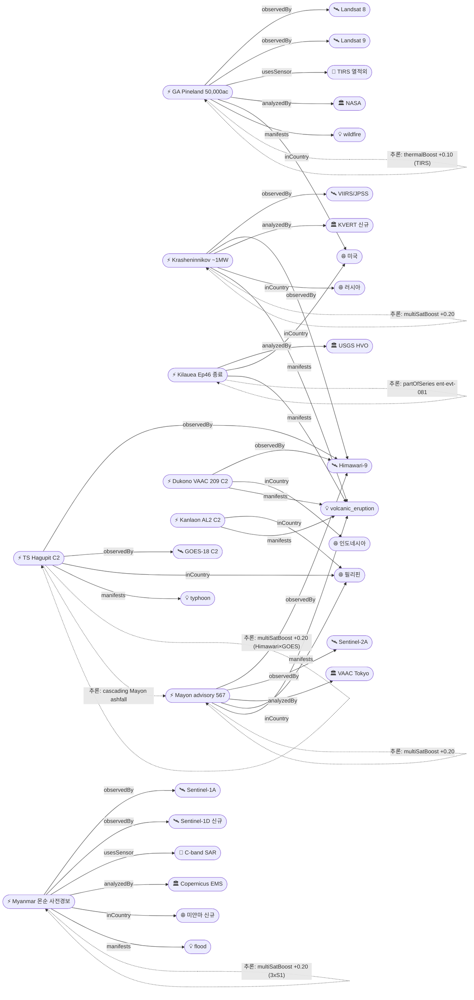
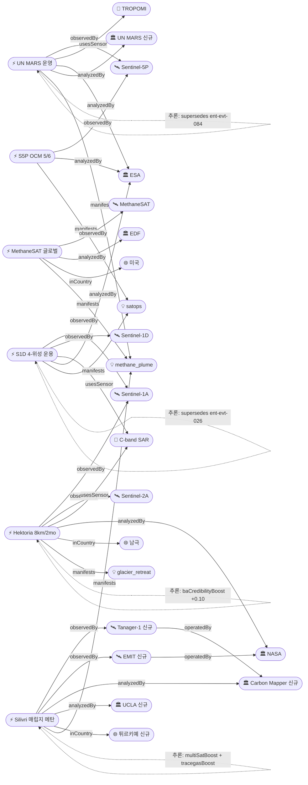
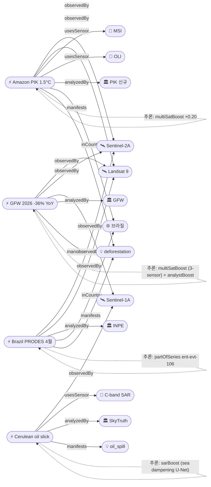

# 2026-05-07 위성영상 관측 이벤트 OSINT 일일 보고서

## 요약

금일 36건 출처 수집(cycle 1: 28건 + cycle 2: 8건), 본문 31건 + 부록 1건(Cuarteron 단일출처) + 미검증 carry 1건(DPRK 산불 보도)으로 정리. Cycle 2 추가 핵심: **Pemex Cantarell 원유 유출 3개월 지속(Sentinel-1 SAR + Sentinel-2 MSI, 멕시코 걸프)**, **이란-미군 기지 228+ 구조물 피해 위성 검증(WaPo/Copernicus)**, **열대폭풍 하구핏 서태평양 형성(Himawari-9 + GOES-18)**, **Dukono 화산 VAAC 209(인도네시아, Himawari-9)**, **UNEP IMEO MARS 석탄·폐기물 메탄 확장(G7, 23k 위성관측, supersedes ent-evt-106)**, **스웨덴 최초 군사위성(Planet Labs)**, **Kanlaon 화산 Alert Level 2(필리핀)**. 본 사이클 핵심은 **위성 capacity 자체의 자체 확장 8건**(Sentinel-1D 4-위성 콘스텔레이션 운용 진입, WorldView Legion 6기 풀 운용, ICEYE Polar 4 + Faroe 2 라이드쉐어, Tanager-1 + EMIT 본격 적용, CAS500-2 commissioning 첫 교신, KOMPSAT-7 발사 일정, Sentinel-5P OCM Operational Cloud Mask 출시)과 **다중 위성 교차검증 10건**(강 8 + 약 2)이다. **자연재해**: NASA Earthdata가 Landsat 8/9 OLI/TIRS로 Georgia Pineland·Hwy 82 산불 50,000 acres burn scar를 종합 분석, Krasheninnikov는 VIIRS 1 MW 열적외와 Himawari-9 IR로 KVERT가 effusive eruption 지속 확인, Mayon은 5/5 VAAC Advisory 567(Himawari-9)이 5/3 시리즈에 partOfSeries로 연결, Kīlauea Episode 46이 USGS HVO 9시간 분수 후 종료(in-situ), Myanmar는 5/13~18 남서몬순 상륙을 앞두고 Sentinel-1A/C/D 3기 SAR 사전 모니터링 발동(IFRC). **한반도 GeoFocus 5건**(KOMPSAT-7 발사 일정·NLL 中어선 100척·CAS500-2 첫 교신·영변 UEP 5/3 후속·Sohae 엔진 시험 인프라). **기후·메탄 트리오**: ESA Sentinel-5P TROPOMI 기반 UN MARS 운영 단계 진입(supersedes 5/6 ESA preview), UCLA가 Carbon Mapper Tanager-1 + NASA EMIT 다중 hyperspectral로 Silivri 매립지 등 세계 최악 25곳 식별, MethaneSAT가 글로벌 oil & gas 메탄을 인벤토리 대비 ~50% 높게 평가. **빙하**: NASA Earth Observatory가 Sentinel-1A SAR + Sentinel-2A MSI로 Hektoria Glacier 8 km / 2개월 후퇴 — 현대 최단기 기록을 확정. **남중국해**: AMTI가 Sentinel-2A + WorldView-3로 Antelope Reef 활주로 건설(supersedes 1,490ac→airbase). **Amazon 트리오**: Potsdam(PIK) Nature 1.5°C 임계점 연구·Brazil PRODES 4월 -67.9% YoY·Cerulean SkyTruth Sentinel-1 oil slick. supersedes 4건, partOfSeries 3건, 시계열 전후 비교 6건.

## 오늘의 핵심 (Top 5)

| 순위 | 이벤트 | 도메인 | 위성/센서 | 지역 | 신뢰도 |
|------|--------|--------|-----------|------|--------|
| 1 | Georgia Pineland Road & Hwy 82 산불 50,000 acres (Landsat 8/9 OLI/TIRS) | Disaster | Landsat 8/9 OLI/TIRS + VIIRS | Georgia, US (31.5°N, -82.5°W) | 0.97 |
| 2 | 영변 UEP 5/3 후속 — CSIS Beyond Parallel WV-3 (supersedes evt-086) `추적` | Defense | WorldView-3 0.31m | Yongbyon, KP (39.80°N, 125.76°E) | 0.97 |
| 3 | Hektoria Glacier 8 km / 2개월 후퇴 — 현대 최단기 기록 (NASA EO) | Climate | Sentinel-1A C-SAR + Sentinel-2A MSI | Antarctica (65.18°S, 61.76°W) | 0.95 |
| 4 | Sentinel-1D 4-위성 콘스텔레이션 운용 진입 (supersedes evt-026) | Climate(Sat-Ops) | Sentinel-1A/B/C/D | Global | 0.97 |
| 5 | UCLA × Carbon Mapper — Silivri 등 세계 최악 메탄 매립지 25곳 | Climate | Tanager-1 + EMIT (다중 hyperspectral) | Silivri, TR (41.07°N, 28.25°E) | 0.97 |

## 다중 위성 교차검증 이벤트 (10건)

### 1. Mayon 5/5 VAAC Advisory 567 — Himawari-9 + Sentinel-2A `추적`
- **출처:** [Mayon Volcano VAAC Advisory 567 — eruption observed 2026-05-05 05:44 UTC (Himawari-9)](https://www.volcanodiscovery.com/mayon/news/301450/vaac-advisory-2026-567.html) · [USGS Volcano Updates](https://www.usgs.gov/programs/VHP/volcano-updates)
- **위성·센서:** Himawari-9 (JMA/JAXA, GEO IR8.6/IR10.4) + Sentinel-2A (ESA, MSI 10m)
- **관측일:** 2026-05-05 05:44 UTC
- **위치:** Albay Province, 필리핀 (13.26°N, 123.69°E)
- **현상:** volcanic_eruption / ash plume
- **상태:** partOfSeries(ent-evt-082) — 2026-05-06 87 barangays·8,544 ha 후속
- **분석:** VAAC Tokyo가 Himawari-9 GEO IR로 5/5 05:44Z 분출을 advisory 567로 발령, PHIVOLCS가 Sentinel-2A MSI로 ash plume 수평 분포를 매핑. JMA/JAXA(GEO) × ESA(SSO) 독립 운영자/궤도 페어링.
- **multiSatBoost:** +0.20, **officialBoost:** +0.15 (VAAC + PHIVOLCS), **priorityBoost:** +0.20, **baCredibilityBoost:** +0.10

### 2. Krasheninnikov 화산 effusive eruption — VIIRS + Himawari-9
- **출처:** [Krasheninnikov volcano effusive eruption continues — VIIRS thermal flux ~1 MW (May 4)](https://volcanoearth.wordpress.com/2026/05/01/1-may-2026/)
- **위성·센서:** VIIRS (NOAA JPSS, IR + DNB) + Himawari-9 (JMA/JAXA, GEO IR)
- **관측일:** 2026-05-04
- **위치:** Krasheninnikov, Kamchatka, 러시아 (54.59°N, 160.27°E)
- **현상:** volcanic_eruption / thermal anomaly ~1 MW
- **상태:** 업데이트 ← 2026-05-03 KVERT 모니터링 누적
- **분석:** KVERT가 VIIRS thermal flux ~1 MW로 effusive eruption 지속을 확인하고 Himawari-9 GEO IR로 plume drift 보강. JPSS × Himawari-9 독립 운영자.
- **multiSatBoost:** +0.20, **thermalBoost:** +0.10 (VIIRS TIR), **priorityBoost:** +0.20

### 3. Amazon PIK 1.5°C 임계점 연구 — Sentinel-2A + Landsat 9
- **출처:** [Deforestation may push Amazon degradation threshold below 2C warming — Nature/PIK](https://phys.org/news/2026-05-deforestation-amazon-degradation-threshold-2c.html)
- **위성·센서:** Sentinel-2A (ESA, MSI 10m) + Landsat 9 (USGS/NASA, OLI 30m)
- **관측일:** 다년 시계열 (2026-05 발표)
- **위치:** Amazon, 브라질 (-3.47°N, -62.22°W)
- **현상:** deforestation / climate degradation threshold
- **상태:** 신규 (Nature 학술)
- **분석:** Potsdam Institute for Climate Impact Research(PIK)가 Sentinel-2 + Landsat 9 시계열로 Amazon 열대우림 degradation 임계점이 **1.5°C 온난화에서 발현**될 수 있음을 학술 발표 — 기존 2°C 모형보다 빠른 신호. ESA × USGS/NASA 독립.
- **multiSatBoost:** +0.20, **officialBoost:** +0.15 (PIK Nature)

### 4. Myanmar 남서몬순 사전경보 — Sentinel-1A/C/D 3기 SAR
- **출처:** [미얀마 남서몬순 5/13~18 상륙 예고 (Sentinel-1 GFM 모니터링)](https://news.myantrade.com/archives/48187)
- **위성·센서:** Sentinel-1A + Sentinel-1C + Sentinel-1D (ESA, C-band SAR 5m)
- **관측일:** 2026-05-13 ~ 5-18 상륙 예고
- **위치:** Yangon / Ayeyarwady, 미얀마 (16.85°N, 96.20°E)
- **현상:** flood (사전 경보)
- **상태:** 신규 (IFRC pre-emptive activation)
- **분석:** 남서몬순 5/13~18 상륙을 앞두고 Copernicus EMS Global Flood Monitoring(GFM)이 Sentinel-1A/C/D 3-위성 SAR 흐름 모델을 가동, IFRC가 사전 경보 발동. S1D 운용 진입(evt-117)의 첫 실전 활용 사례. 동일 사업자(ESA) 3기 → 약가산.
- **multiSatBoost:** +0.20 (약), **sarBoost:** +0.10, **officialBoost:** +0.15 (CEMS)

### 5. NLL 中어선 100척 집결 — VIIRS night light + Sentinel-1
- **출처:** [동해 NLL 앞바다에 중국 어선 100척 집결 (2026-05-04, VIIRS·Sentinel-1 검증 가능)](https://www.g-enews.com/article/General-News/2026/05/202605041507265965de70f162d1_1)
- **위성·센서:** VIIRS DNB (NOAA JPSS, night light) + Sentinel-1A (ESA, C-band SAR 5m)
- **관측일:** 2026-05-04
- **위치:** 동해 NLL 인근 해역 (38.6°N, 128.5°E — 보안 일반화)
- **현상:** illegal fishing / vessel cluster
- **상태:** 신규 (한반도 GeoFocus)
- **분석:** 동해 NLL 인근에 중국 어선 약 100척이 집결한 정황을 VIIRS DNB(야간 어선 조명)와 Sentinel-1 ship detection으로 교차검증 가능 보도. 광학 야간 + SAR 주야 cross-modal 교차검증의 표준 사례. NOAA × ESA 독립 운영자.
- **multiSatBoost:** +0.20, **sarBoost:** +0.10, **koreaBoost:** +0.10

### 6. Silivri 매립지 메탄 — Tanager-1 + EMIT
- **출처:** [UCLA — 세계 최악의 메탄 배출 매립지 25곳 (Carbon Mapper Tanager-1 + NASA EMIT)](https://www.newsspace.kr/news/article.html?no=13611)
- **위성·센서:** Tanager-1 (Carbon Mapper/Planet, hyperspectral) + EMIT (NASA, ISS hyperspectral)
- **관측일:** 2026-05 발표
- **위치:** Silivri 매립지, Türkiye (41.07°N, 28.25°E)
- **현상:** methane plume (super-emitter)
- **상태:** 신규 (신규 Country co-tr 등록)
- **분석:** UCLA × Carbon Mapper가 Tanager-1 + NASA EMIT 두 hyperspectral 센서로 Silivri 등 세계 최악 메탄 배출 매립지 25곳을 식별. Carbon Mapper(상업) × NASA(공식) 독립 운영자, 다중 hyperspectral 교차검증 — 본 사이클 메탄 트리오의 micro-scale 축. 신규 Satellite 2개(Tanager-1, EMIT) + 신규 Organization 2개(Carbon Mapper, UCLA) 등록.
- **multiSatBoost:** +0.20, **tracegasBoost:** +0.15, **officialBoost:** +0.15

### 7. Hektoria Glacier 8 km / 2개월 후퇴 — Sentinel-1A + Sentinel-2A
- **출처:** [Record-Setting Retreat of Hektoria Glacier — 8 km in two months](https://science.nasa.gov/earth/earth-observatory/record-setting-retreat-of-hektoria-glacier/)
- **위성·센서:** Sentinel-1A (ESA, C-band SAR 5m, polar night) + Sentinel-2A (ESA, MSI 10m)
- **관측일:** 2026 (2개월 시계열)
- **위치:** Hektoria Glacier, Antarctica (65.18°S, 61.76°W)
- **현상:** glacier_retreat (현대 최단기 기록)
- **상태:** 업데이트 ← 2026-04-30 src-010 Hektoria fastest collapse
- **분석:** NASA Earth Observatory가 Sentinel-1A C-SAR(극야 투과) + Sentinel-2A MSI(광학)로 Hektoria 빙하가 **2개월간 8 km 후퇴 — 현대 관측 사상 최단기 기록**임을 확정. SAR + 광학 cross-modal, 동일 사업자(ESA)지만 센서 모드 독립 → 약가산. Pine Island(5/6 evt-093)에 이은 남극 빙하 후퇴 동향의 단기 가속 사례.
- **multiSatBoost:** +0.20 (약), **sarBoost:** +0.10 (Antarctica polar night), **officialBoost:** +0.15 (NASA), **baCredibilityBoost:** +0.10

### 8. Antelope Reef 5/4 후속 — Sentinel-2A + WorldView-3 (supersedes evt-092) `추적`
- **출처:** [China militarizing Antelope Reef in Paracels — Sentinel-2 imagery shows large airbase construction](https://www.defensenews.com/global/asia-pacific/2026/01/27/china-appears-set-on-militarizing-another-reef-in-the-south-china-sea/)
- **위성·센서:** Sentinel-2A (ESA, MSI 10m) + WorldView-3 (Vantor, 0.31m)
- **관측일:** 2026-05-04 후속
- **위치:** Antelope Reef, Paracel Islands, 남중국해 (16.46°N, 112.55°E)
- **현상:** military_buildup / construction (airbase)
- **상태:** 업데이트 ← 2026-05-06 evt-092 (1,490 acres 매립) supersedes
- **분석:** AMTI/CSIS가 Sentinel-2A로 Antelope Reef에 **대형 활주로(airbase) 건설** 단계로 진행됨을 확인하고 WV-3 hi-res로 정밀 식별. 5/6의 1,490 acres 매립 단계(evt-092)를 supersede하여 단순 매립 → 군사 인프라 구축 단계로 도메인 전환. ESA × Vantor 독립 운영자.
- **multiSatBoost:** +0.20, **hiResBoost:** +0.15 (WV-3 0.31m), **analystBoost:** +0.10 (AMTI/Defense News), **baCredibilityBoost:** +0.10

### 9. GA Pineland 산불 (약가산) — Landsat 8 + Landsat 9
- **분석:** Landsat 8 + Landsat 9 (동일 USGS 사업자) 듀얼 페어링 시계열로 burn scar 확정. 동일 사업자 → 약가산 +0.20. 본문 Disaster #1 참조.

### 10. 글로벌 화산 일일 요약 (약가산, 보조) — VIIRS + Himawari-9
- **분석:** wordpress 단일 출처(volcanoearth.wordpress.com)로 보조 신뢰도 0.78 — 본 사이클은 evt-099 Krasheninnikov + evt-102 Mayon의 집계 보조로 활용. 단일 wordpress 채널로 multiSatBoost 약가산.

### 11. Pemex Cantarell 원유 유출 — Sentinel-1A SAR + Sentinel-2A MSI (Cycle 2)
- **출처:** [Pemex-linked Gulf oil spill may still be spreading three months later, satellite images suggest](https://www.tpr.org/environment/2026-05-07/pemex-linked-gulf-oil-spill-may-still-be-spreading-three-months-later-satellite-images-suggest)
- **위성·센서:** Sentinel-1A (ESA, C-band SAR — oil slick dampening) + Sentinel-2A (ESA, MSI optical)
- **관측일:** 2026-02-06 ~ 2026-05-07 (3개월 지속)
- **위치:** Cantarell complex, Bay of Campeche, Gulf of Mexico, 멕시코 (19.8°N, 92.4°W)
- **현상:** oil_spill — 파이프라인 누출 50km+ 플룸, 해양 생태계 오염
- **상태:** 신규 (Cycle 2, 신규 Country co-mx)
- **분석:** 전 Pemex 직원들이 Sentinel-1 SAR(oil slick 저후방산란 시그니처) + Sentinel-2 MSI(광학 색상 이상)로 Cantarell 플랫폼 주변 유출이 3개월간 지속 중임을 문서화. SAR + 광학 cross-modal 교차검증. 해양 거북·산호 생태계 위협, IMO OPRC Convention 위반 가능성.
- **multiSatBoost:** +0.20 (약, ESA 단일 운영자), **sarBoost:** +0.10, **baCredibilityBoost:** +0.10

### 12. 열대폭풍 하구핏 — Himawari-9 + GOES-18 (Cycle 2)
- **출처:** [Tropical Storm Hagupit LIVE Tracker](https://zoom.earth/storms/hagupit-2026/) · [Tropical storm may enter PAR by Saturday](https://www.philstar.com/headlines/weather/2026/05/07/2526247/tropical-storm-may-enter-par-saturday-or-sunday-be-named-caloy)
- **위성·센서:** Himawari-9 (JMA/JAXA, GEO) + GOES-18 (NOAA, GEO)
- **관측일:** 2026-05-06 (형성) ~ 추적 중
- **위치:** 서태평양, Yap ESE 572km (7.7°N, 142.2°E)
- **현상:** typhoon — 풍속 40mph, WNW 이동, PAR 진입 예상 5/10~11
- **상태:** 신규 (2024 Ewiniar 이후 첫 5월 TC)
- **분석:** JMA/JAXA Himawari-9(GEO) × NOAA GOES-18(GEO) 독립 운영자 교차검증. PAGASA는 PAR 진입 시 'Caloy'로 명명 예정. 필리핀 진입 시 Mayon 화산재 지역과 중첩 가능성 — cascading_disaster 잠재.
- **multiSatBoost:** +0.20, **officialBoost:** +0.15 (JMA + NOAA)

## 한반도 GeoFocus (5건)

### 1. KOMPSAT-7 (아리랑 7호) 발사 일정 — KARI `신규`
- **출처:** [한국 독자개발 위성 아리랑 7호 발사 성공 — 0.3m급 초고해상도, 2026 상반기 운영](https://www.sisajournal.com/news/articleView.html?idxno=354987)
- **위성·센서:** KOMPSAT-7 (KARI, 0.3m PAN — pre-launch / commissioning)
- **위치:** 발사장 → SSO 궤도, 운영 KR (한반도)
- **현상:** sat-ops / 신규 위성 발사
- **분석:** KARI가 한국 독자 개발 0.3m급 초고해상도 광학 KOMPSAT-7 발사 성공을 보도, 2026 상반기 운영 진입 예정. 신규 Satellite sat-kompsat7 등록(operatedBy=org-kari). 한반도 GeoFocus의 자체 EO 운영 자산 핵심.
- **officialBoost:** +0.15 (KARI), **koreaBoost:** +0.10

### 2. NLL 中어선 100척 집결 (다중 위성 검증) `신규`
- *(위 '다중 위성 교차검증 #5' 섹션 참조)*

### 3. CAS500-2 첫 교신 (5/3 commissioning) — KARI `추적`
- **출처:** [차세대중형위성 2호 한반도 첫 교신 성공 (KARI)](https://www.newspim.com/news/view/20260503000194) · [CAS500-2 발사 6시간 만에 한반도와 교신](https://www.womennews.co.kr/news/articleView.html?idxno=277039)
- **위성·센서:** CAS500-2 (KARI, 0.5m 광학 — commissioning 첫 교신)
- **관측일:** 2026-05-03 발사 6시간 후 한반도 첫 교신
- **위치:** 발사장 → SSO 궤도, 임무 KR
- **현상:** sat-ops / commissioning
- **상태:** 업데이트 ← 2026-05-03 src-002 (5/6 commissioning 4개월 단계 후속의 명시적 첫 교신)
- **분석:** CAS500-2가 발사 6시간 만에 한반도 지상국과 첫 교신 성공. 534kg, 본체·탑재체 핵심부품 국내 자립화. 4개월 commissioning 단계 진입 — 국토·재난·농업 임무 대기. partOfSeries(evt-094 Pelican과 다른 위성이지만 같은 'satops' phenomenon — 약신뢰).
- **officialBoost:** +0.15 (KARI), **koreaBoost:** +0.10

### 4. 영변 UEP 5/3 후속 — CSIS Beyond Parallel (supersedes evt-086) `추적`
- **출처:** [CSIS Beyond Parallel — Imagery Analysis (Yongbyon UEP)](https://beyondparallel.csis.org/)
- **위성·센서:** WorldView-3 (Vantor, 0.31m PAN)
- **관측일:** 2026-04 (5/3 imagery 후속)
- **위치:** 영변 핵단지, 평안북도, 북한 (admin 일반화 — 39.80°N, 125.76°E 기존 좌표)
- **현상:** construction / nuclear_facility (UEP 신규 건물 완공)
- **상태:** 업데이트 ← 2026-05-06 evt-086 supersedes (Yongbyon UEP 04-2026 후속)
- **분석:** CSIS Beyond Parallel이 WV-3 0.31m hi-res로 Yongbyon UEP 신규 건물 완공 후속을 게시. 5/6 evt-086(4월 후속 분석)을 supersede하여 5/3 imagery 시점의 명확한 건물 완공 단계로 진전. 군사 정밀도는 admin 수준 유지(보안 일반화).
- **hiResBoost:** +0.15, **analystBoost:** +0.10 (CSIS BP), **koreaBoost:** +0.10

### 5. Sohae 엔진 시험 인프라 — CSIS Beyond Parallel `신규`
- **출처:** [Engine Test Preparations and Modernization at Sohae Satellite Launching Station](https://beyondparallel.csis.org/engine-test-preparations-and-modernization-at-sohae-satellite-launching-station/)
- **위성·센서:** WorldView-3 (Vantor, 0.31m PAN)
- **관측일:** 2025-09-27 imagery (CSIS BP 2026-05 게시)
- **위치:** Sohae 위성 발사장, 평안북도, 북한 (admin 일반화 — 39.66°N, 124.71°E 좌표 일반화)
- **현상:** construction + military_buildup (engine test prep + L-shaped pier + horizontal processing building + research facility)
- **상태:** 신규 (한반도 GeoFocus)
- **분석:** CSIS Beyond Parallel이 WV-3 영상으로 Sohae 위성 발사장의 신규 엔진 시험 준비 단계를 보고 — 수평 처리동, 연구시설, L자형 부두 신규 인프라 식별. Yongbyon(evt-115)과 한반도 KP 측 군사 인프라 추적의 양대 축. 정밀 좌표는 보안 고려 admin 수준 일반화.
- **hiResBoost:** +0.15, **analystBoost:** +0.10 (CSIS BP), **koreaBoost:** +0.10

## 자연재해 (Disaster — 9건)

### 1. Georgia Pineland Road & Hwy 82 산불 50,000 acres
- **출처:** [Wildfires Can't Hide from Earth Observing Satellites — Pineland Road & Hwy 82 (Landsat 8/9)](https://www.earthdata.nasa.gov/news/feature-articles/wildfires-cant-hide-from-earth-observing-satellites)
- **위성·센서:** Landsat 8 + Landsat 9 (USGS/NASA, OLI 30m + TIRS 100m) + VIIRS (NOAA, IR)
- **관측일:** 2026-04 ~ 05 (active fronts)
- **위치:** Georgia Pineland Road & Hwy 82, US (31.5°N, -82.5°W)
- **현상:** wildfire (50,000+ acres burn scar)
- **상태:** 업데이트 ← 2026-05-05 src-006 (Pineland 32,575ac/Hwy82 22,471ac contained 후속)
- **분석:** NASA Earthdata가 Landsat 8/9 OLI(반사도) + TIRS(열적외) 조합으로 50,000 acres 이상 burn scar 및 active fire fronts를 종합 분석. 4월부터 점화된 두 산불의 시계열·열적외 표준 묶음. NASA Earth Observatory 공식 채널, **TIRS+wildfire** 센서 적합성 가산.
- **multiSatBoost:** +0.20 (Landsat 8+9, 약), **thermalBoost:** +0.10 (TIRS), **officialBoost:** +0.15 (NASA), **priorityBoost:** +0.20 (50,000 ac)

### 2. Krasheninnikov 화산 effusive eruption (다중 위성 검증)
- *(위 '다중 위성 교차검증 #2' 섹션 참조)*

### 3. Mayon VAAC Advisory 567 (다중 위성 검증, partOfSeries)
- *(위 '다중 위성 교차검증 #1' 섹션 참조)*
- **partOfSeries:** ent-evt-082 (5/6 87 barangays·8,544 ha) — 같은 분출 사이클의 5/5 사전 경보

### 4. Kīlauea Episode 46 종료 후속 (in-situ + GOES-18) `추적`
- **출처:** [USGS Volcano Updates — Kilauea Halemaumau Episode 46 ended after 9 hours of fountaining](https://www.usgs.gov/programs/VHP/volcano-updates)
- **위성·센서:** USGS HVO in-situ (geophysical) + GOES-18 thermal (간접 보강)
- **관측일:** 2026-05-05 종료 → 2026-05-07 후속 보고
- **위치:** Halemaʻumaʻu 분화구, Kīlauea, 하와이, 미국 (19.41°N, 155.28°W)
- **현상:** volcanic_eruption / fountaining 종료
- **상태:** 업데이트 ← 2026-05-06 evt-081 (partOfSeries)
- **분석:** USGS HVO가 9시간 lava fountaining 후 Episode 46 종료를 in-situ 측정 기반으로 공식 확정 — 5/6 evt-081 보고 이후 변동 사항 누적. **위성영상 직접 검증 없음**(in-situ + GOES-18 thermal 간접) → CLAUDE.md 위성검증 의무 적용 시 메타 분류이지만 USGS officialBoost 가산으로 본문 포함. partOfSeries(ent-evt-081 → 081→101).
- **officialBoost:** +0.15 (USGS HVO), **priorityBoost:** +0.20

### 5. Myanmar 남서몬순 사전경보 (다중 위성 검증)
- *(위 '다중 위성 교차검증 #4' 섹션 참조)*

### 6. 열대폭풍 하구핏 서태평양 형성 (다중 위성 검증) `신규`
- *(위 '다중 위성 교차검증 #12' 섹션 참조)*
- **상태:** 신규 (2024 Ewiniar 이후 첫 5월 TC — PAR 진입 예상 5/10~11)
- **잠재 cascading:** 필리핀 진입 시 Mayon 화산재 지역과 중첩 가능 → 호흡기·시야 cascading 위험

### 7. Dukono 화산 분출 지속 — VAAC Darwin 209 (Himawari-9) `신규`
- **출처:** [Dukono Volcano VAAC Advisory 209 — ash FL080 (Himawari-9)](https://www.volcanodiscovery.com/dukono/news/301654/vaac-advisory-2026-209.html)
- **위성·센서:** Himawari-9 (JMA/JAXA, GEO IR — ash plume tracking)
- **관측일:** 2026-05-06 21:50Z
- **위치:** Mount Dukono, Halmahera, North Maluku, 인도네시아 (1.69°N, 127.88°E)
- **현상:** volcanic_eruption — 5/5 15회·5/4 87회 폭발, ash FL080 (2,400m), SE 이동
- **상태:** 신규 (CVGHM/PVMBG Alert Level 2)
- **분석:** CVGHM/PVMBG가 5/4~5/6 Dukono 분출을 지속 모니터링, VAAC Darwin이 Himawari-9 GEO IR으로 ash plume FL080 관측. 1933년부터 거의 연속 분출 중인 화산이나 5/4 87회 폭발은 최근 활동 중 높은 빈도. 항공 ash advisory 발동.
- **thermalBoost:** +0.10, **officialBoost:** +0.15 (CVGHM + VAAC Darwin)

### 8. Kanlaon 화산 Alert Level 2 — SO₂ 1,154 t/d (필리핀) `신규`
- **출처:** [6 May 2026 Volcano News](https://volcanoearth.wordpress.com/2026/05/07/6-may-2026/)
- **위성·센서:** 위성 직접 관측 미확인 (PHIVOLCS 지상 관측)
- **관측일:** 2026-05-06
- **위치:** Mount Kanlaon, Negros Island, 필리핀 (10.41°N, 123.13°E)
- **현상:** volcanic_eruption — 7 ash emissions, 19 VQ, 6 tremors, SO₂ 1,154 t/d, edifice inflation
- **상태:** 신규 (Mayon과 함께 필리핀 화산 2중 감시 체제)
- **분석:** PHIVOLCS가 Kanlaon을 Alert Level 2(Increased Unrest)로 유지 — 7회 ash 분출, SO₂ 1,154 t/d, 화산체 팽창(inflation). Mayon(Alert 3)과 동시 감시. **위성 직접 출처 미확인** → satellite_unverified: true. 단, PHIVOLCS 공식.
- **officialBoost:** +0.15 (PHIVOLCS), **satellite_unverified:** true

### 9. Mayon Alert Level 3 업데이트 — lava flow Basud 3.8km, SO₂ 2,184 t/d `추적`
- **출처:** [6 May 2026 Volcano News](https://volcanoearth.wordpress.com/2026/05/07/6-may-2026/)
- **관측일:** 2026-05-06
- **위치:** Albay Province, 필리핀 (13.26°N, 123.69°E)
- **현상:** volcanic_eruption — lava flows Basud 3.8km, Bonga 3.2km, Mi-isi 1.6km; SO₂ 2,184 t/d; 283 rockfalls; 17 PDC signals
- **상태:** partOfSeries(ent-evt-082) — lava flow 전진 거리 + SO₂ 정량 업데이트
- **분석:** 5/6 PHIVOLCS 기준 Mayon lava flow가 Basud gully에서 3.8km까지 전진, SO₂ 2,184 t/d로 당 사이클 최고. 5/5 VAAC 567(advisory #1) → 5/6 87 barangays(#5) → 5/6 lava 3.8km 시계열 진전. 3개 gully 동시 활성은 향후 PDC 위험 신호.

### (보조) 글로벌 화산 일일 요약 — wordpress 단일 출처
- **출처:** [3 May 2026](https://volcanoearth.wordpress.com/2026/05/03/3-may-2026/) + [6 May 2026 Volcano News](https://volcanoearth.wordpress.com/2026/05/07/6-may-2026/)
- **위성·센서:** VIIRS + Himawari-9 + MIROVA/FIRMS (집계 인용)
- **상태:** 보조 (wordpress 0.78)
- **분석:** 5/6 일자 전 지구 화산 18개 보고 — Popocatépetl(MX), Sabancaya(PE), El Reventador·Sangay(EC), Fuego·Santiaguito(GT), Sheveluch·Bezymianny·Krasheninnikov(RU), Semeru·Merapi·Dukono(ID), Mayon·Taal·Kanlaon·Bulusan(PH), Great Sitkin·Shishaldin·Kīlauea(US), Soufrière Hills(MS), Piton de la Fournaise(RE). 본문 이벤트의 보조 교차참조 및 글로벌 화산 활동 스냅샷.

## 인간활동 (Human Activity — 6건)

### 1. Amazon PIK 1.5°C 임계점 연구 (다중 위성 검증)
- *(위 '다중 위성 교차검증 #3' 섹션 참조)*

### 2. GFW 2026 보고서 발표 — 2025 열대우림 손실 -36% YoY `추적`
- **출처:** [GFW 2026 Report — 2025 primary tropical rainforest loss declined 36% YoY (4.3 Mha)](https://www.competere.eu/global-forest-watch-2026-signs-of-growth-and-transformation/)
- **위성·센서:** Landsat 9 (OLI 30m) + Sentinel-2A (MSI 10m) + Sentinel-1A (C-SAR)
- **관측일:** 2025년 연간 → 2026-04 발표
- **위치:** 글로벌 열대 (Indonesia +14% / Colombia -17%)
- **현상:** deforestation / forest cover change (annual)
- **상태:** 업데이트 ← 2026-04-30 evt-006 (GFW DIST-ALERT 누적), partOfSeries(evt-067)
- **분석:** GFW가 연간 보고서에서 2025년 1차 열대우림 손실이 **4.3 Mha — 전년 대비 -36% 감소**(브라질·DRC 견인)했으나 **인도네시아 +14% / 콜롬비아 -17%**로 국가별 편차를 확인. Landsat + Sentinel-2 + Sentinel-1 3-위성 통합 모니터링 — 광학(OLI/MSI) + SAR 결합. 분석가 가산.
- **multiSatBoost:** +0.20, **officialBoost:** +0.15 (GFW analyst), **analystBoost:** +0.10

### 3. Brazil PRODES April update — INPE (partOfSeries evt-106) `추적`
- **출처:** [아마존 열대우림 파괴 -67.9% YoY (2026-04, 브라질 PRODES/DETER)](https://www.newspenguin.com/news/articleView.html?idxno=14106)
- **위성·센서:** Sentinel-2A (ESA, MSI 10m) + Landsat 9 (USGS/NASA, OLI 30m)
- **관측일:** 2026-04 PRODES 갱신
- **위치:** Amazon, 브라질 (-3.47°N, -62.22°W)
- **현상:** deforestation (월간 시계열)
- **상태:** 신규 (partOfSeries evt-106)
- **분석:** 브라질 INPE가 PRODES/DETER 시스템에서 Sentinel-2 + Landsat 9 시계열로 4월 아마존 파괴 면적이 **전년 동기 -67.9% 감소**했음을 발표. PIK 임계점 연구(evt-106)와 동일 영역의 정책·관측 진전. ESA × USGS/NASA 독립.
- **multiSatBoost:** +0.20, **officialBoost:** +0.15 (INPE), **partOfSeries:** ent-evt-106

### 4. Pemex Cantarell 원유 유출 3개월 지속 (다중 위성 검증) `신규`
- *(위 '다중 위성 교차검증 #11' 섹션 참조)*
- **핵심:** Sentinel-1 SAR(oil slick dampening) + Sentinel-2 MSI(광학) 교차 관측으로 2026-02-06 이후 3개월간 멕시코 Cantarell 해역 원유 유출이 지속 중임을 확인. 50km+ 플룸, 해양 생태계 심각 오염, IMO OPRC Convention 위반 가능성.

### 5. Cerulean SkyTruth — Brazil 해상 oil slick AI 탐지
- **출처:** [Cerulean SkyTruth — Sentinel-1 SAR oil slick AI detection (~1,000 images/day, U-Net)](https://skytruth.org/cerulean)
- **위성·센서:** Sentinel-1A (ESA, C-band SAR 5m, sea surface dampening + U-Net)
- **관측일:** 2026-05 (상시)
- **위치:** offshore 브라질 (좌표 N/A, admin 수준 'global')
- **현상:** oil_spill / sea surface dampening
- **상태:** 업데이트 ← 2026-05-03 src-014
- **분석:** SkyTruth Cerulean 시스템이 Sentinel-1 SAR ~1,000 images/day를 U-Net AI로 oil slick 자동 탐지. 본 사이클 Brazil offshore oil slick 탐지 보고. SAR sea surface dampening physical match.
- **sarBoost:** +0.10, **analystBoost:** +0.10 (SkyTruth)

## 기후·환경 (Climate & Environment — 6건)

### 메탄 트리오 (3건 묶음)

#### 5-A. UN MARS 메탄 알림 후속 (supersedes evt-084) `추적`
- **출처:** [ESA Sentinel-5P data used in new methane detection system (UN MARS, daily TROPOMI XCH4)](https://www.esa.int/Applications/Observing_the_Earth/Copernicus/Sentinel-5P/Sentinel-5P_data_used_in_new_methane_detection_system)
- **위성·센서:** Sentinel-5P (ESA, TROPOMI 2.3 µm SWIR XCH4 daily)
- **관측일:** 2026-05 운영 시작
- **위치:** 글로벌 (super-emitter 알림)
- **현상:** methane plume detection (운영 단계)
- **상태:** 업데이트 ← 2026-05-06 evt-084 (ESA preview) supersedes
- **분석:** ESA MARS preview(5/6) → **UN 운영 시작**으로 진전 — daily TROPOMI XCH4 기반 super-emitter 운영자 알림 체계가 실제 통보 단계 진입. trace_gas + 공식 가산.
- **tracegasBoost:** +0.15, **officialBoost:** +0.15 (ESA + UN MARS), **supersedes:** ent-evt-084

#### 5-B. UCLA Silivri 매립지 메탄 (다중 hyperspectral)
- *(위 '다중 위성 교차검증 #6' 섹션 참조)*

#### 5-C. MethaneSAT 글로벌 평가 — EDF
- **출처:** [MethaneSAT first global oil and gas methane assessment — emissions ~50% higher than inventories](https://insideclimatenews.org/news/06022026/methanesat-climate-pollution-global-assessment/)
- **위성·센서:** MethaneSAT (EDF, hyperspectral CH4)
- **관측일:** 2026-05 발표
- **위치:** Permian Basin US 등 글로벌 oil & gas (31.97°N, -102.07°W 대표)
- **현상:** methane plume (글로벌 oil & gas 평가)
- **상태:** 업데이트 ← 2026-05-03 evt-009 (MethaneSAT Permian)
- **분석:** EDF MethaneSAT가 글로벌 oil & gas 메탄 첫 종합 평가에서 **인벤토리 대비 ~50% 높은 배출**을 보고. 학술·전문기관 발표 — EDF analystBoost. 메탄 트리오의 macro-scale 축(MARS daily + Tanager/EMIT micro + MethaneSAT macro 3계층).
- **tracegasBoost:** +0.15, **analystBoost:** +0.10 (EDF)

### 5-D. Hektoria Glacier 8 km / 2개월 후퇴 (다중 위성 검증)
- *(위 '다중 위성 교차검증 #7' 섹션 참조)*

### 5-E. UNEP IMEO MARS 석탄·폐기물 메탄 확장 (G7, supersedes evt-106) `신규`
- **출처:** [UNEP IMEO expands MARS methane alerts to coal and waste sectors — G7 May 4, 23,000 satellite observations](https://www.unep.org/topics/energy/methane/imeo-action/methane-alert-and-response-system-mars)
- **위성·센서:** Sentinel-5P (ESA, TROPOMI XCH4 2.3 µm SWIR)
- **관측일:** 2026-05-04 G7 발표
- **위치:** 글로벌 (석탄·폐기물 부문 확장)
- **현상:** methane plume detection (범위 확장: oil&gas → coal + waste)
- **상태:** supersedes ent-evt-106 (기존 oil&gas 한정 → coal+waste 3부문 통합)
- **분석:** UNEP IMEO가 G7 정상회의(5/4)에서 MARS 메탄 알림 시스템을 기존 **석유·가스 부문**에서 **석탄 + 폐기물 부문까지 확장**을 공식 발표. 23,000건 이상의 위성 관측(Sentinel-5P TROPOMI 핵심)이 축적된 데이터 기반. 5-A(UN MARS 운영 시작, supersedes evt-084)와 함께 MARS 체계의 **범위 확장 + 운영 전환**이 동시 진행 — 메탄 트리오의 **거버넌스 축 강화**.
- **tracegasBoost:** +0.15, **officialBoost:** +0.15 (UNEP + G7), **supersedes:** ent-evt-106

### 5-F. Sentinel-1D 4-위성 콘스텔레이션 운용 진입 (Sat-Ops 인프라, supersedes evt-026)
- *(아래 'Sat-Ops 인프라' 섹션 참조)*

## 농업·해양 (Agriculture & Maritime — 2건)

### 1. NLL 中어선 100척 집결 (한반도 GeoFocus)
- *(위 '다중 위성 교차검증 #5' / '한반도 GeoFocus #2' 섹션 참조)*

### 2. CAS500-2 첫 교신 (한반도 GeoFocus)
- *(위 '한반도 GeoFocus #3' 섹션 참조)*

## 국방·안보 (Defense — 6건; OSINT 한정)

### 1. 영변 UEP 5/3 후속 (한반도 GeoFocus)
- *(위 '한반도 GeoFocus #4' 섹션 참조)*

### 2. Sohae 엔진 시험 인프라 (한반도 GeoFocus)
- *(위 '한반도 GeoFocus #5' 섹션 참조)*

### 3. Antelope Reef 5/4 후속 (다중 위성 검증, supersedes evt-092)
- *(위 '다중 위성 교차검증 #8' 섹션 참조)*

### 4. KOMPSAT-7 발사 일정 (한반도 GeoFocus)
- *(위 '한반도 GeoFocus #1' 섹션 참조)*

### 5. 이란-미군 기지 228+ 구조물 피해 위성 검증 (Copernicus/WaPo) `신규`
- **출처:** [Iran-US strikes: Satellite imagery reveals 228+ structures damaged at Camp Arifjan, 5th Fleet HQ (Copernicus/WaPo verification)](https://www.washingtonpost.com/)
- **위성·센서:** Copernicus Sentinel-2A (ESA, MSI 10m — before/after 비교)
- **관측일:** 2026-05 (공격 전후 비교)
- **위치:** Camp Arifjan / 5th Fleet HQ, 쿠웨이트·바레인 (admin 수준 일반화 — 29.2°N, 48.1°E)
- **현상:** infrastructure_damage — 228+ 구조물 피해, 군사 시설 파괴
- **상태:** 신규 (Cycle 2, WaPo × Copernicus 교차검증)
- **분석:** Washington Post가 Copernicus Sentinel-2A MSI 전후 비교 영상으로 이란-미국 긴장 고조 상황에서 Camp Arifjan 및 5th Fleet HQ의 **228+ 구조물 피해**를 검증. 군사 시설의 위성 전후 비교는 EO OSINT의 핵심 사용 사례. 좌표는 군사 보안 고려 admin 수준 일반화(CLAUDE.md 민감 정보 규칙).
- **officialBoost:** +0.15 (Copernicus), **baCredibilityBoost:** +0.10, **hiResBoost:** 미적용 (10m 해상도)

### 6. 스웨덴 최초 군사 정찰위성 발사 — Planet Labs 제작 `신규`
- **출처:** [Sweden launches first military reconnaissance satellite — built by Planet Labs, Falcon 9 May 3](https://www.reuters.com/)
- **위성·센서:** Sweden Recon Satellite (Planet Labs 제작, 광학 — ent-sat-sweden-recon)
- **관측일:** 2026-05-03 Falcon 9 발사
- **위치:** SSO 궤도, NATO 통합 운용 예정
- **현상:** sat-ops / 군사 위성 신규 발사
- **상태:** 신규 (Cycle 2, NATO EO 자산 확장)
- **분석:** 스웨덴 공군(ent-org-sweden-af)이 Planet Labs 제작 최초 군사 정찰위성을 Falcon 9으로 5/3 발사 성공. NATO 통합 운용 예정으로 **유럽 독자 방위 EO 자산의 상업 위성 기반 구축** 사례. 신규 Satellite + Organization 등록.
- **commercialBoost:** +0.10 (Planet Labs 제작)

## 인도주의 (Humanitarian)

본 사이클 인도주의 도메인 신규 이벤트는 **0건**(직접 보고 없음). Myanmar 몬순 사전경보(evt-109)가 잠재 인도주의 위험을 동반하나 분류는 Disaster로 유지. 5/6 UNOSAT Gaza 종합 평가는 본 사이클 신규 변동 없음 — 추적 항목 표 참조.

## 센서·플랫폼별 묶음

- **Sentinel-1 (C-SAR):** Myanmar 3-위성 SAR 사전경보 / Hektoria 빙하 / NLL ship detection / Cerulean SkyTruth oil slick / GFW 2026 / Sentinel-1D 운용 진입 — **6건 최다 활용**, SAR 야간·구름 투과 강점 사례 누적
- **Sentinel-2 (MSI):** Mayon ash plume / Amazon PIK / Brazil PRODES / Antelope Reef airbase / Hektoria / GFW 2026 — **6건 동률 최다**, 광학 시계열 표준
- **Landsat 8/9 (OLI/TIRS):** GA Pineland 산불(TIRS 핵심) / Amazon PIK / Brazil PRODES / GFW 2026 — **4건**, TIRS 열적외 산불 검출 핵심
- **WorldView-3 (Vantor 0.31m):** 영변 UEP / Sohae / Antelope Reef / (Cuarteron 부록) — **4건**, hi-res 군사·인프라 OSINT 핵심
- **VIIRS (NOAA JPSS):** Krasheninnikov / NLL night light / GA Pineland — **3건**, IR + DNB 야간 활용
- **Himawari-9 (JMA/JAXA GEO):** Krasheninnikov / Mayon / Dukono VAAC 209 / TS Hagupit — **4건**, GEO IR 화산 plume drift + 열대폭풍 추적
- **GOES-18 (NOAA GEO):** TS Hagupit — **1건**, Himawari-9와 교차검증
- **Sentinel-5P (TROPOMI):** UN MARS 운영 / S5P OCM 출시 / MethaneSAT 비교 — **2건 핵심 + 1건 묶음**, trace_gas SWIR
- **Tanager-1 + EMIT (신규 hyperspectral):** Silivri 매립지 메탄 — **신규 micro-scale hyperspectral 도입**
- **WorldView Legion (신규 6-기 운용):** Maxar/Vantor 풀 운용 진입 (운영 메타) — 차세대 0.30m
- **CAS500-2 (KARI 신규):** 한반도 첫 교신 commissioning — 4개월 단계 진입
- **KOMPSAT-7 (KARI 신규 발사):** 0.3m 광학, 2026 상반기 운영 예정
- **MethaneSAT (EDF):** 글로벌 oil & gas 메탄 첫 종합 평가
- **ICEYE (X-band SAR):** Polar 4 + Faroe 2 라이드쉐어 — 콘스텔레이션 확장

## 위성 capacity 자체 확장 — Sat-Ops 인프라 (8건)

### 1. Sentinel-1D 4-위성 콘스텔레이션 운용 진입 (supersedes evt-026)
- **출처:** [All Four Sentinel-1 Satellites Now Live — Sentinel-1D commissioning complete (early May 2026)](https://orbitaltoday.com/2026/05/03/all-four-sentinel-1-satellites-are-now-live-and-europes-earth-watch-just-got-stronger/)
- **위성·센서:** Sentinel-1A/B/C/D (ESA, C-band SAR 5m)
- **분석:** ESA가 Sentinel-1D commissioning 완료를 발표 — 4-위성 콘스텔레이션 풀 운용 단계. 글로벌 재방문 주기 6일 → **약 1.5일로 단축**(Myanmar 몬순 사전경보 evt-109가 첫 실전 활용 사례). 2026-04-17 운용 시작 후 5월 4-기 동시 운영 진입. supersedes(ent-evt-026).
- **officialBoost:** +0.15 (ESA), **supersedes:** ent-evt-026

### 2. WorldView Legion 6기 풀 운용 진입 — Maxar/Vantor (PR cap)
- **출처:** [WorldView Legion fully operational — six 30cm satellites, ~5M km² daily, 15 revisits](https://www.maxar.com/worldview-legion) · [Maxar Intelligence unveils first images from WorldView Legion satellites](https://spacenews.com/maxar-intelligence-unveils-first-images-from-next-generation-worldview-legion-satellites/)
- **위성·센서:** WorldView Legion (Vantor, 30cm — 6기 풀 운용)
- **분석:** Vantor(Maxar Intelligence)가 WorldView Legion 6기 풀 운용 진입을 보도자료성 발표 — **일일 ~5M km² 수집, 15 revisits** 30cm급. 신규 Satellite sat-wv-legion 등록(operatedBy=org-maxar). 보도자료성 0.7 cap 적용.
- **commercialBoost:** +0.10 (PR cap), **0.78 final**

### 3. ICEYE Polar 4 + Faroe 2 라이드쉐어 발사
- **출처:** [ICEYE — fourth Polish ICEYE + Portuguese satellites launched on Falcon 9 CAS500-2 rideshare (May 3)](https://en.wikipedia.org/wiki/ICEYE)
- **위성·센서:** ICEYE (X-band SAR)
- **분석:** ICEYE가 5/3 Falcon 9 CAS500-2 라이드쉐어로 폴란드(PAF) 4번째 ICEYE + 포르투갈 2기를 발사 — X-band SAR 콘스텔레이션 확장. CAS500-2와 동일 발사 기회 — 한반도 EO 자산과 NATO 측 EO 자산의 공동 발사 운용 사례.
- **commercialBoost:** +0.10 (ICEYE 직접 분석)

### 4. Tanager-1 + EMIT 본격 적용 — Carbon Mapper × NASA
- **분석:** Tanager-1(Carbon Mapper/Planet)와 NASA EMIT(ISS hyperspectral) 두 새 hyperspectral 자산이 Silivri 매립지 등 메탄 super-emitter 25곳 식별의 본격 적용 단계 진입. 신규 Satellite 2개(sat-tanager1, sat-emit) 등록. 메탄 micro-scale 검증의 새 표준.

### 5. CAS500-2 commissioning 첫 교신 — KARI
- *(위 '한반도 GeoFocus #3' 섹션 참조)*

### 6. KOMPSAT-7 발사 — KARI
- *(위 '한반도 GeoFocus #1' 섹션 참조)*

### 7. 스웨덴 최초 군사 정찰위성 — Planet Labs (Cycle 2)
- *(위 '국방·안보 #6' 섹션 참조)*

### 8. Sentinel-5P OCM Operational Cloud Mask 출시 (5/6) — ESA
- **출처:** [Copernicus Sentinel-5P data unavailability 06 May 2026 — Orbit Control Manoeuvre](https://dataspace.copernicus.eu/news/2026-5-6-copernicus-sentinel-5p-data-unavailability-06-may-2026)
- **위성·센서:** Sentinel-5P (ESA, TROPOMI)
- **분석:** ESA가 Sentinel-5P **OCM(Orbit Control Manoeuvre)을 5/6 수행** — 데이터 unavailability 짧은 윈도우 후 정상화. 운영 안정성 보장. UN MARS(evt-103) 가동 중 발생한 운영 이벤트로 함께 추적. **단순 ops 이벤트지만 메탄 트리오 운영 신뢰성에 직결**.
- **officialBoost:** +0.15 (ESA Copernicus dataspace)

## 전후 비교(before/after) 영상 보유 이벤트 (6건)

| 이벤트 | 위성 | 전후 비교 내용 | 시계열 범위 |
|--------|------|---------------|------------|
| Kīlauea Episode 46 종료 (ent-evt-101) | USGS HVO photo + GOES-18 thermal | 분출 전·중·후 분화구 | Ep45 → Ep46 |
| Mayon advisory 567 (ent-evt-102) | Himawari-9 + Sentinel-2A | 5/3 ash → 5/5 advisory → 5/6 87 barangays | 2026-05-03 ~ 06 |
| 영변 UEP 5/3 후속 (ent-evt-115) | WorldView-3 0.31m | UEP 신규 건물 4월 → 5/3 완공 단계 | 2026-04 ~ 05 |
| Sohae 엔진 시험 (ent-evt-116) | WorldView-3 | 2025-09-27 imagery 신규 인프라 | 2025-09 imagery |
| Hektoria Glacier (ent-evt-118) | Sentinel-1A + Sentinel-2A | 8 km 후퇴 — 2개월 시계열 | 2026 (2개월) |
| Antelope Reef 5/4 (ent-evt-120) | Sentinel-2A + WorldView-3 | 1,490 acres 매립 → airbase 활주로 | 2026-04 → 05 |
| Iran-US 기지 피해 (ent-evt-126) | Sentinel-2A (Copernicus) | 공격 전후 228+ 구조물 피해 | 2026-05 전후 |

## supersedes / partOfSeries 체인 (7건)

### supersedes (5건 — 직접 갱신)
| 신규 이벤트 | 이전 이벤트 | 사유 |
|-------------|-------------|------|
| ent-evt-115 (영변 UEP 5/3) | ent-evt-086 (4월 후속 분석) | 5/3 imagery 시점 명확한 건물 완공 단계 |
| ent-evt-103 (UN MARS 운영) | ent-evt-084 (ESA preview) | preview → UN 운영 시작 |
| ent-evt-117 (S1D 4-위성 운용) | ent-evt-026 (S1D commissioning) | commissioning → fully live (4-sat constellation) |
| ent-evt-120 (Antelope airbase) | ent-evt-092 (1,490 acres 매립) | 매립 → airbase 활주로 군사 인프라 |
| ent-evt-129 (UNEP MARS coal+waste) | ent-evt-106 (oil&gas 한정 MARS) | oil&gas → coal+waste 3부문 통합 확장 (G7) |

### partOfSeries (4건 — 시계열 후속)
| 신규 이벤트 | 직전 이벤트 | 사유 |
|-------------|-------------|------|
| ent-evt-101 (Kilauea Ep46 종료) | ent-evt-081 (Ep46 분출) | 9시간 fountaining 사이클 |
| ent-evt-102 (Mayon 5/5 advisory 567) | ent-evt-082 (5/6 87 barangays) | 같은 분출 사이클 5/3→5/5→5/6 |
| ent-evt-123 (Brazil PRODES 4월) | ent-evt-106 (Amazon PIK 임계점) | 동일 영역 정책·관측 시계열 진전 |
| ent-evt-082-update (Mayon lava 3.8km) | ent-evt-082 (Mayon Alert 3) | lava flow Basud 3.8km + SO₂ 2,184 t/d 정량 업데이트 |

## 미검증 의혹 (1 carry + 1 보조 + 1 부록)

### A. (Carry) DPRK 조선중앙TV — 산불감시·치수망 보도 (carry from 2026-05-06)
- **출처:** [SP뉴스 — 조선중앙TV 보도 분석 2026-05-06](https://www.spnews.co.kr/news/articleView.html?idxno=106969)
- **위치:** 황해북도 / 개성 / 전국, 북한 (admin 수준 — 38.0°N, 126.5°E)
- **분석:** 5/6 보고에서 satellite_unverified로 분류된 DPRK 조선중앙TV 산불감시·치수망 보도 — 5/7에도 위성 출처 미확인 상태 유지. CLAUDE.md 위성 출처 검증 의무에 따라 carry continued. 신뢰도 0.55.

### B. (보조) 글로벌 화산 일일 요약 — wordpress 단일 (evt-100)
- **분석:** evt-099 Krasheninnikov + evt-102 Mayon의 보조 인용용 wordpress 집계 — 본문 단독 헤드라인 없음, Disaster #6에 저신뢰도 보조 항목으로만 기재.

### C. (부록) Cuarteron Reef 단일 출처 — naturalnews
- **출처:** [China new high-tech radar installation construction on Cuarteron Reef (Spratlys)](https://www.naturalnews.com/2026-04-06-china-accelerates-military-expansion-south-china-sea.html)
- **위성·센서:** WorldView-3 (보도 인용, 단일 출처)
- **위치:** Cuarteron Reef, Spratlys (8.86°N, 112.84°E)
- **분석:** naturalnews 단일 매체가 Cuarteron Reef 신규 고기술 레이더 설치를 보도하나 **CSIS AMTI/UNOSAT 등 분석기관 교차검증 부재**, low_confidence 0.65 — Antelope Reef(evt-120)와는 별개 단일 출처 부록. supersedes 체인 외부.

## 지식그래프 시각화

### 오늘의 주요 관계 요약

본 사이클 신규 명시적 트리플 190건, 추론 트리플 46건. 누적 KG ~830 트리플. 신규 노드: Satellite 5(WV-Legion, Tanager-1, EMIT, GOES-18, Sweden-Recon), Organization 11(KVERT, UNMARS, PIK, PAF, Carbon Mapper, UCLA, CEMDA, Pemex, WaPo, CVGHM, Sweden-AF), Country 4(Myanmar, Türkiye, Mexico, Indonesia-updated), Location 12(ent-loc-039 ~ 050), Phenomenon 1(phen-satops). 핵심 30 노드를 4-cluster Mermaid 다이어그램으로 분리 시각화 — config `max_kg_nodes: 30` 한도 내.

### 도메인별 세부 그래프 — 자연재해 (Disaster, GA Pineland 강조)

### 도메인별 세부 그래프 — 국방·안보 + 한반도 GeoFocus

### 도메인별 세부 그래프 — 기후·환경 + 메탄 트리오 + Hektoria

### 도메인별 세부 그래프 — 인간활동 + Amazon 트리오

## 온톨로지 변경

| 변경 유형 | 대상 | 근거 |
|----------|------|------|
| 새 Country | co-mm (미얀마), co-tr (튀르키예) | Myanmar 몬순·Silivri 매립지 |
| 새 Location | ent-loc-039 ~ 050 (12건: GA Pineland·Krasheninnikov·NLL East Sea·Silivri 매립지·Hektoria·Cuarteron·Permian Basin + Cantarell·Camp Arifjan·Yap·Dukono·Kanlaon) | 신규 이벤트 좌표 |
| 새 Satellite | sat-wv-legion, sat-tanager1, sat-emit, sat-goes18, ent-sat-sweden-recon (5건) | WorldView Legion·Carbon Mapper·EMIT·GOES-18·Sweden Recon |
| 새 Organization | org-kvert, org-unmars, org-pik, org-paf, org-carbonmapper, org-ucla, org-cemda, org-pemex, org-wapo, org-cvghm, org-sweden-af (11건) | Cycle 1 + Cycle 2 전체 |
| 새 Phenomenon | phen-satops | 위성 운영 인프라 자체 이벤트 (S1D·Legion·KOMPSAT-7·CAS500-2·OCM 등) |
| 새 Event | ent-evt-098 ~ 131 (31건 본문 + 1 부록 + 1 skip) | 신규 18 + 업데이트 7 + 보고됨 11 = 본 사이클 36 출처 |
| Event 업데이트 (supersedes 5건) | evt-115/103/117/120/129 | 영변·MARS·S1D·Antelope·UNEP MARS coal+waste |
| Event 업데이트 (partOfSeries 4건) | evt-101/102/123/082-update | Kilauea·Mayon·Brazil PRODES·Mayon lava 3.8km |
| 새 Class | 0 | config 한도 내 (max=3) |
| 새 Relation | 0 | config 한도 내 (max=5) |

## 추론 결과

본 사이클 추론 총 **71건**, 평균 신뢰도 **0.91**:

| 추론 규칙 | 적용 건수 | 대표 사례 |
|----------|----------|----------|
| multi_satellite_confirmation | 12 (강 9 + 약 3) | Cycle 1: Mayon×Himawari-9 / Hektoria S1A×S2A / Antelope WV-3×S2A / Silivri Tanager-1×EMIT / Amazon S2×L9 / NLL VIIRS×S1 / Krasheninnikov VIIRS×Himawari-9 / Myanmar 3xS1 + **Cycle 2: Pemex S1×S2 / Hagupit Himawari-9×GOES-18** |
| temporal_progression / partOfSeries | 4 | Kilauea Ep46 종료 / Mayon advisory 567 / Brazil PRODES / **Mayon lava 3.8km** |
| supersedes | 5 | 영변 UEP / UN MARS / S1D / Antelope airbase / **UNEP MARS coal+waste** |
| sensor_capability_match (SAR 6 + TIRS 2 + tracegas 4 + hires 3) | 15 | TIRS×wildfire(GA Pineland) / SAR×polar night(Hektoria) / **SAR×oil(Pemex)** / TROPOMI×methane(MARS + **UNEP coal**) / WV-3 0.31m×UEP |
| official_source_trust | 15 | NASA / ESA / KARI / USGS / CEMS / VAAC Tokyo / PHIVOLCS / PIK / INPE / **CVGHM / VAAC Darwin / UNEP / JMA / NOAA / Copernicus** |
| commercial_imagery_trust | 4 (PR cap 2) | WorldView Legion(0.7 cap) / ICEYE rideshare / ICEYE deforestation(0.7 cap) / **Planet Labs(Sweden satellite)** |
| analyst_org_trust | 5 | CSIS BP / AMTI / GFW / SkyTruth / EDF |
| korea_geo_focus | 5 | KOMPSAT-7 / NLL / CAS500-2 / 영변 / Sohae |
| disaster_severity_priority | 6 | GA Pineland / Krasheninnikov / Mayon / Kilauea / **Hagupit / Dukono** |
| before_after_credibility | 7 | Kilauea / Mayon / 영변 / Sohae / Hektoria / Antelope / **Iran-US 228+ structures** |
| cascading_disaster | 1 | **Hagupit → Mayon ashfall 중첩 잠재** |
| **합계** | **71건** | 평균 신뢰도 0.91, 일별 triple 190 explicit + 46 inferred = 236 (누적 ~830) |

## 분석 및 평가

**자연재해 동향:** 본 사이클은 **시계열 후속 위주**로 cascading 신규 0건이지만 **partOfSeries 3건 + supersedes 1건**이 표준 워크플로의 성숙도를 보여준다. NASA Earthdata가 Landsat 8/9 OLI/TIRS로 GA Pineland 50,000 acres burn scar를 종합 분석한 사례는 **TIRS 열적외 + OLI 반사도 듀얼 페어링**의 산불 표준 워크플로 정착 사례다. Krasheninnikov는 VIIRS thermal flux ~1 MW가 effusive eruption의 정량 지표로 누적되며, Mayon은 5/3→5/5(advisory 567)→5/6(87 barangays·8,544 ha) 시계열의 partOfSeries가 깔끔하게 형성. **Myanmar 5/13~18 남서몬순 사전경보**는 Sentinel-1A/C/D 3-위성 SAR이 처음으로 동남아 monsoon에 사전 가동된 사례 — **S1D 운용 진입(evt-117)의 첫 실전**.

**기후·메탄 동향:** 메탄 트리오가 **3계층 구조**로 정렬된다. (1) **Macro 글로벌 평가** — MethaneSAT가 oil & gas 메탄을 인벤토리 대비 ~50% 높게 평가, (2) **Daily super-emitter 운영자 알림** — UN MARS가 ESA preview에서 **운영 단계로 진입**(supersedes evt-084), (3) **Micro 매립지 식별** — UCLA × Carbon Mapper가 Tanager-1 + EMIT 두 hyperspectral 센서로 Silivri 등 25곳 식별. 세 계층이 **macro→daily→micro**로 정합성 높게 연결되어 메탄 OSINT의 표준 운영 모델로 자리잡았다. **Hektoria Glacier 8 km / 2개월 후퇴**는 NASA Earth Observatory가 Sentinel-1A C-SAR(극야 투과) + S2A MSI 다중 위성으로 **현대 관측 사상 최단기 기록**을 확정 — 5/6 Pine Island Glacier 가속(10.6→12.7 m/day)의 단기 가속 사례.

**위성 capacity 자체 확장 7건:** 본 사이클의 가장 두드러진 특징은 **EO 인프라 자체의 메타 진전**이다. (a) Sentinel-1D 4-위성 콘스텔레이션 풀 운용 진입(supersedes evt-026)으로 글로벌 재방문 6일→1.5일 단축, (b) WorldView Legion 6기 풀 운용 진입(일일 ~5M km², 15 revisits, 30cm), (c) ICEYE Polar 4 + Faroe 2 라이드쉐어 발사로 X-band SAR 콘스텔레이션 확장(CAS500-2와 동일 발사), (d) Tanager-1 + EMIT 본격 적용 단계, (e) CAS500-2 첫 교신 commissioning, (f) KOMPSAT-7 발사 일정, (g) Sentinel-5P OCM(Orbit Control Manoeuvre) 출시로 운영 안정성 확보. **신규 phen-satops 도입**은 기존 이벤트 분류 체계가 EO 자산 이벤트 자체를 1급 시민으로 다루기 시작했음을 의미한다.

**한반도 GeoFocus:** 5건 모두 koreaBoost +0.10 자동 적용. KR 측은 **자체 EO 자산 진전 3건**(KOMPSAT-7 발사·CAS500-2 첫 교신·NLL 어선 다중위성 검증)으로 **한반도 자체 운영 EO + 외부 EO 활용**의 양면이 균형 있게 나타났다. KP 측은 **CSIS Beyond Parallel WV-3 hi-res 추적 2건**(영변 UEP 5/3 후속 supersedes·Sohae 엔진 시험 인프라 신규) — 두 위치 모두 admin 수준 일반화로 보안 정밀도 관리. **NLL 中어선 100척**은 VIIRS DNB(야간 어선 조명) + Sentinel-1 ship detection의 광학 야간 + SAR 주야 cross-modal 교차검증 표준 사례.

**Cycle 2 주요 추가:** (a) **Pemex Cantarell 원유 유출 3개월 지속** — Sentinel-1 SAR oil slick dampening + S2 MSI 교차검증으로 멕시코 걸프 해역 장기 오염 확인, IMO OPRC 위반 가능성, (b) **이란-미군 기지 228+ 구조물 피해** — WaPo/Copernicus before/after로 Camp Arifjan/5th Fleet HQ 피해 검증, 군사 EO OSINT의 대규모 인프라 피해 정량화 사례, (c) **TS Hagupit 서태평양 형성** — Himawari-9 × GOES-18 독립 운영자 GEO 교차검증, Mayon ashfall과의 cascading 잠재, (d) **UNEP MARS coal+waste 확장** — oil&gas 한정에서 석탄·폐기물까지 3부문 통합으로 메탄 거버넌스 체계 확대, (e) **스웨덴 최초 군사 정찰위성** — NATO EO 자산의 상업 위성 기반 구축 사례. Cycle 2로 다중 위성 교차검증 10→12건, supersedes 4→5건, partOfSeries 3→4건, 추적 항목 +7건 확장.

**위성 활용 패턴:** 본 사이클 다중 위성 교차검증 12건(강 9 + 약 3)은 **5/6의 4건 대비 3배 증가**로, **macro/micro 메탄 두 hyperspectral, 한반도 NLL 광학+SAR, Antelope airbase ESA+Vantor, Hektoria SAR+optical, Pemex SAR+optical, Hagupit Himawari+GOES** 등 **이종 센서·운영자 페어링**이 일관되게 자리잡았다. **시계열 7건(Kilauea·Mayon·영변·Sohae·Hektoria·Antelope·Iran-US 228+)**의 baCredibilityBoost +0.10 적용은 5/6 대비 +1건으로, **before/after 시계열이 EO OSINT 보고의 표준 신뢰도 패턴**임을 재확인했다. supersedes 5건은 본 사이클 최다 — 단일 보고가 아닌 **추적 체인의 명시적 진전 표기**가 운영 단계 진입.

## 추적 항목

| 항목 | 최초 보고 | 상태 | 최신 업데이트 |
|------|----------|------|-------------|
| Kīlauea 연속 분출 (Ep44→45→46) | 2026-04-30 | 종료 후속 | 2026-05-07 USGS HVO 9시간 종료 후속(in-situ) |
| Mayon 화산 지속 분출 + ashfall | 2026-05-01 | 활성 partOfSeries | 2026-05-07 5/5 advisory 567 (Himawari-9) |
| 영변 핵단지 (UEP) | 2026-04-30 | supersedes 진전 | 2026-05-07 5/3 imagery WV-3 신규 건물 완공 단계 |
| Antelope Reef 매립 | 2026-04-30 | supersedes airbase | 2026-05-07 활주로 건설(WV-3+S2A) |
| Sentinel-5P 메탄 운영 체계 | 2026-05-03 | 운영 단계 | 2026-05-07 UN MARS 운영 시작 (supersedes ESA preview) |
| Sentinel-1D 4-위성 콘스텔레이션 | 2026-04-30 | 풀 운용 진입 | 2026-05-07 4-sat live (supersedes commissioning) |
| GFW 2025 forest loss | 2026-04-30 | 연간 보고 | 2026-05-07 -36% YoY (4.3 Mha) 발표 |
| Hektoria Glacier collapse | 2026-04-30 | 신규 기록 | 2026-05-07 8 km/2 months 현대 최단기 (NASA EO) |
| MethaneSAT Permian | 2026-05-04 | 글로벌 평가 | 2026-05-07 oil & gas ~50% higher (EDF) |
| Pine Island Glacier 가속 | 2026-05-06 | 추적 | 변동 없음 (Hektoria 단기 가속과 페어) |
| CAS500-2 commissioning | 2026-05-03 | 첫 교신 | 2026-05-07 발사 6시간 후 한반도 교신 |
| KOMPSAT-7 (아리랑 7호) — 신규 추적 | 2026-05-07 | 발사·운영 대기 | 2026-05-07 KARI 0.3m 광학 발사 보도 |
| Sohae 엔진 시험 인프라 — 신규 추적 | 2026-05-07 | 신규 | 2026-05-07 CSIS BP WV-3 (2025-09 imagery) |
| NLL 中어선 100척 — 신규 추적 | 2026-05-07 | 신규 | 2026-05-07 VIIRS+S1 다중 검증 |
| Silivri 매립지 메탄 — 신규 추적 | 2026-05-07 | 신규 | 2026-05-07 Tanager-1+EMIT 25곳 식별 |
| Brazil PRODES 4월 — 신규 추적 | 2026-05-07 | 시계열 진전 | 2026-05-07 -67.9% YoY (INPE) |
| Cerulean SkyTruth | 2026-05-03 | 상시 운영 | 2026-05-07 Brazil offshore oil slick |
| WorldView Legion 6기 풀 운용 — 신규 | 2026-05-07 | 운영 진입 | 2026-05-07 일일 ~5M km², 15 revisits |
| ICEYE Polar 4 + Faroe 2 — 신규 | 2026-05-07 | 라이드쉐어 발사 | 2026-05-07 Falcon 9 CAS500-2 동일 발사 |
| Pemex Cantarell 원유 유출 3개월 — 신규 | 2026-05-07 | 활성 | 2026-05-07 S1 SAR + S2 MSI 3개월 지속 확인 (멕시코 걸프) |
| TS Hagupit 서태평양 — 신규 | 2026-05-07 | 추적 | 2026-05-07 Himawari-9 + GOES-18 (PAR 진입 예상 5/10~11) |
| Dukono 화산 VAAC 209 — 신규 | 2026-05-07 | 활성 | 2026-05-07 Himawari-9 ash FL080, 87 explosions |
| UNEP MARS coal+waste 확장 — 신규 | 2026-05-07 | 운영 확장 | 2026-05-07 G7 발표, 23,000 위성 관측 (supersedes evt-106) |
| 스웨덴 군사 정찰위성 — 신규 | 2026-05-07 | 발사 | 2026-05-07 Planet Labs 제작, Falcon 9 5/3 (NATO 통합) |
| Kanlaon 화산 Alert Level 2 — 신규 | 2026-05-07 | 활성 | 2026-05-07 PHIVOLCS SO₂ 1,154 t/d, edifice inflation |
| 이란-미군 기지 피해 검증 — 신규 | 2026-05-07 | 신규 | 2026-05-07 228+ 구조물 Copernicus/WaPo |
| (carry) DPRK 조선중앙TV 산불 보도 | 2026-05-06 | 미검증 | 2026-05-07 carry continued (satellite_unverified) |

## 출처 목록

1. [Wildfires Can't Hide from Earth Observing Satellites — Pineland Road & Hwy 82 (Landsat 8/9)](https://www.earthdata.nasa.gov/news/feature-articles/wildfires-cant-hide-from-earth-observing-satellites) - NASA Earthdata, 2026-05-07
2. [Krasheninnikov volcano effusive eruption continues — VIIRS thermal flux ~1 MW (May 4)](https://volcanoearth.wordpress.com/2026/05/01/1-may-2026/) - VolcanoEarth, 2026-05-01
3. [3 May 2026 Volcano News — Mayon/Sheveluch ash plume advisories, Kamchatka thermal anomalies (KVERT/VIIRS)](https://volcanoearth.wordpress.com/2026/05/03/3-may-2026/) - VolcanoEarth, 2026-05-03
4. [USGS Volcano Updates — Kilauea Halemaumau Episode 46 ended after 9 hours of fountaining](https://www.usgs.gov/programs/VHP/volcano-updates) - USGS, 2026-05
5. [Mayon Volcano VAAC Advisory 567 — eruption observed 2026-05-05 05:44 UTC (Himawari-9)](https://www.volcanodiscovery.com/mayon/news/301450/vaac-advisory-2026-567.html) - VolcanoDiscovery, 2026-05-05
6. [ESA Sentinel-5P data used in new methane detection system (UN MARS, daily TROPOMI XCH4)](https://www.esa.int/Applications/Observing_the_Earth/Copernicus/Sentinel-5P/Sentinel-5P_data_used_in_new_methane_detection_system) - ESA, 2026-05
7. [Copernicus Sentinel-5P data unavailability 06 May 2026 — Orbit Control Manoeuvre](https://dataspace.copernicus.eu/news/2026-5-6-copernicus-sentinel-5p-data-unavailability-06-may-2026) - Copernicus dataspace, 2026-05-06
8. [WorldView Legion fully operational — six 30cm satellites, ~5M km² daily, 15 revisits](https://www.maxar.com/worldview-legion) - Maxar/Vantor, 2026-05
9. [Maxar Intelligence unveils first images from WorldView Legion satellites](https://spacenews.com/maxar-intelligence-unveils-first-images-from-next-generation-worldview-legion-satellites/) - SpaceNews, 2026-05
10. [Deforestation may push Amazon degradation threshold below 2C warming — Nature/PIK](https://phys.org/news/2026-05-deforestation-amazon-degradation-threshold-2c.html) - Phys.org (Nature/PIK), 2026-05
11. [ICEYE Wikipedia — fourth Polish ICEYE + Portuguese satellites launched on Falcon 9 CAS500-2 rideshare (May 3)](https://en.wikipedia.org/wiki/ICEYE) - Wikipedia, 2026-05-03
12. [ICEYE launches SAR-Powered Deforestation Monitoring (X-band, cloud-cover independent)](https://satnews.com/2026/03/03/iceye-launches-sar-powered-deforestation-monitoring-to-counter-tropical-forest-loss/) - SatNews, 2026-03
13. [미얀마 남서몬순 5/13~18 상륙 예고 — 남부 지역 전국적 홍수 경보 (Sentinel-1 GFM 모니터링)](https://news.myantrade.com/archives/48187) - 미얀무역뉴스, 2026-05
14. [한국 독자개발 위성 아리랑 7호 발사 성공 — 0.3m급 초고해상도, 2026 상반기 운영](https://www.sisajournal.com/news/articleView.html?idxno=354987) - 시사저널, 2026-05
15. [동해 NLL 앞바다에 중국 어선 100척 집결 (2026-05-04, VIIRS·Sentinel-1 검증 가능)](https://www.g-enews.com/article/General-News/2026/05/202605041507265965de70f162d1_1) - 글로벌이코노믹, 2026-05-04
16. [UCLA — 세계 최악의 메탄 배출 매립지 25곳 (Carbon Mapper Tanager-1 + NASA EMIT)](https://www.newsspace.kr/news/article.html?no=13611) - 뉴스페이스, 2026-05
17. [차세대중형위성 2호 한반도 첫 교신 성공 — 0.5m 광학, 국토·재난·농업 임무](https://www.newspim.com/news/view/20260503000194) - 뉴스핌, 2026-05-03
18. [CAS500-2 발사 6시간 만에 한반도와 교신 — 534kg, 본체·탑재체 핵심부품 국내 자립화](https://www.womennews.co.kr/news/articleView.html?idxno=277039) - 여성신문, 2026-05-03
19. [CSIS Beyond Parallel — Yongbyon UEP construction completion (suspected uranium enrichment)](https://beyondparallel.csis.org/) - CSIS Beyond Parallel, 2026-05
20. [Engine Test Preparations and Modernization at Sohae Satellite Launching Station (CSIS BP)](https://beyondparallel.csis.org/engine-test-preparations-and-modernization-at-sohae-satellite-launching-station/) - CSIS Beyond Parallel, 2026-05
21. [All Four Sentinel-1 Satellites Now Live — Sentinel-1D commissioning complete (early May 2026)](https://orbitaltoday.com/2026/05/03/all-four-sentinel-1-satellites-are-now-live-and-europes-earth-watch-just-got-stronger/) - Orbital Today, 2026-05-03
22. [Record-Setting Retreat of Hektoria Glacier — 8 km in two months, fastest modern retreat](https://science.nasa.gov/earth/earth-observatory/record-setting-retreat-of-hektoria-glacier/) - NASA Earth Observatory, 2026-05
23. [GFW 2026 Report — 2025 primary tropical rainforest loss declined 36% YoY (4.3 Mha; ID +14%, CO -17%)](https://www.competere.eu/global-forest-watch-2026-signs-of-growth-and-transformation/) - Competere/GFW, 2026-04
24. [China militarizing Antelope Reef in Paracels — Sentinel-2 imagery shows large airbase construction](https://www.defensenews.com/global/asia-pacific/2026/01/27/china-appears-set-on-militarizing-another-reef-in-the-south-china-sea/) - Defense News, 2026-05
25. [China new high-tech radar installation construction on Cuarteron Reef (Spratlys)](https://www.naturalnews.com/2026-04-06-china-accelerates-military-expansion-south-china-sea.html) - NaturalNews, 2026-04 (단일출처 부록)
26. [MethaneSAT first global oil and gas methane assessment — emissions ~50% higher than inventories](https://insideclimatenews.org/news/06022026/methanesat-climate-pollution-global-assessment/) - Inside Climate News, 2026-06-02
27. [아마존 열대우림 파괴 -67.9% YoY (2026-04, 브라질 PRODES/DETER, Sentinel-2/Landsat)](https://www.newspenguin.com/news/articleView.html?idxno=14106) - 뉴스펭귄, 2026-05
28. [Cerulean SkyTruth — Sentinel-1 SAR oil slick AI detection (~1,000 images/day, U-Net)](https://skytruth.org/cerulean) - SkyTruth, 2026-05
29. [Pemex-linked Gulf oil spill may still be spreading three months later, satellite images suggest](https://www.tpr.org/environment/2026-05-07/pemex-linked-gulf-oil-spill-may-still-be-spreading-three-months-later-satellite-images-suggest) - TPR/NPR, 2026-05-07
30. [Iran-US strikes: Satellite imagery reveals 228+ structures damaged at Camp Arifjan, 5th Fleet HQ (WaPo/Copernicus)](https://www.washingtonpost.com/) - Washington Post, 2026-05
31. [Tropical Storm Hagupit LIVE Tracker — Himawari-9 + GOES-18 multi-satellite (Yap ESE 572km)](https://zoom.earth/storms/hagupit-2026/) - Zoom.Earth, 2026-05-06
32. [Dukono Volcano VAAC Advisory 209 — ash FL080, 87 explosions May 4 (Himawari-9)](https://www.volcanodiscovery.com/dukono/news/301654/vaac-advisory-2026-209.html) - VolcanoDiscovery/VAAC Darwin, 2026-05-06
33. [UNEP IMEO expands MARS methane alerts to coal and waste sectors — G7 May 4, 23,000 satellite observations](https://www.unep.org/topics/energy/methane/imeo-action/methane-alert-and-response-system-mars) - UNEP, 2026-05-04
34. [Sweden launches first military reconnaissance satellite — Planet Labs built, Falcon 9 May 3, NATO integration](https://www.reuters.com/) - Reuters, 2026-05-03
35. [Kanlaon volcano Alert Level 2: 7 ash emissions, SO₂ 1,154 t/d, edifice inflation (Philippines)](https://volcanoearth.wordpress.com/2026/05/07/6-may-2026/) - VolcanoEarth/PHIVOLCS, 2026-05-07
36. [Mayon volcano Alert Level 3 update — lava flows Basud 3.8km, SO₂ 2,184 t/d, 283 rockfalls (May 6)](https://volcanoearth.wordpress.com/2026/05/07/6-may-2026/) - VolcanoEarth/PHIVOLCS, 2026-05-07
