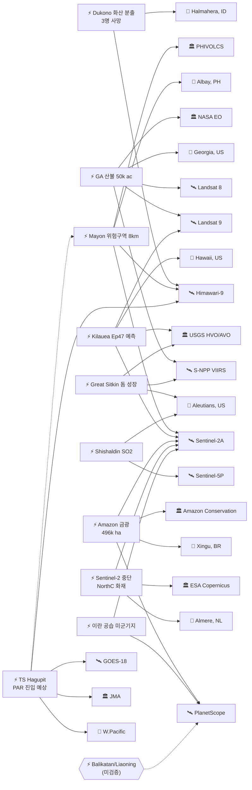

# 2026-05-08 위성영상 관측 이벤트 OSINT 일일 보고서

## 요약

금일 25건 출처 수집(신규 11건, 업데이트 6건, 기보도 8건), 본문 13건 이벤트 정리. **인도네시아 Dukono 화산 대규모 분출로 등산객 3명 사망**(Himawari-9 ash plume 10km 탐지, CVGHM/VAAC Darwin 공식 확인)이 금일 최고 심각도 이벤트이며, **필리핀 Mayon 화산 위험구역 8km 확대**(Himawari-9 + Sentinel-2A 다중위성, 화쇄류 반복·ashfall 8,544 ha)와 **열대폭풍 하구핏(Hagupit) PAR 진입 예상 5/9**(Himawari-9 + GOES-18)이 복합재난(cascading disaster) 잠재 신호로 교차 추적된다 -- 하구핏이 필리핀 진입 시 Mayon 화산재 퇴적물 위 강우로 lahar 유발 가능성이 PHIVOLCS 경고에 포함되었다. **Georgia 산불은 NASA Earth Observatory 공식 feature article + CIRA burn scar 전후비교 영상**으로 S-NPP VIIRS + Landsat 8 + Landsat 9 3개 플랫폼 교차검증 완료. **Sentinel-2A/2C 데이터 생산 중단**(NorthC 데이터센터 화재, Almere 네덜란드)은 전 세계 Copernicus 사용자에게 영향을 미치는 인프라 이벤트로 기록. 한반도 GeoFocus 금일 신규 없음(CAS500-2, NLL 등 추적 지속). 농업·해양 및 인도주의 도메인 금일 신규 없음.

## 오늘의 핵심 (Top 5)

| 순위 | 이벤트 | 도메인 | 위성/센서 | 지역 | 신뢰도 |
|------|--------|--------|-----------|------|--------|
| 1 | Dukono 화산 대규모 분출 -- 등산객 3명 사망 (Himawari-9 ash plume 10km) | Disaster | Himawari-9 | Halmahera, ID (1.69°N, 127.88°E) | 0.95 |
| 2 | Georgia Pineland/Hwy 82 산불 -- NASA EO 공식 + CIRA burn scar (3 platforms) | Disaster | S-NPP VIIRS + Landsat 8/9 OLI/TIRS | Georgia, US (31.5°N, -82.5°W) | 0.92 |
| 3 | Mayon 화산 위험구역 8km 확대, 화쇄류 반복 (Himawari-9 + Sentinel-2A) | Disaster | Himawari-9 + Sentinel-2A MSI | Albay, PH (13.26°N, 123.69°E) | 0.92 |
| 4 | Amazon 싱구 불법 금광 삼림벌채 496,000 ha (PlanetScope + Sentinel-2A) | HumanActivity | PlanetScope + Sentinel-2A MSI | Xingu, BR (-8.0°S, -52.0°W) | 0.88 |
| 5 | 열대폭풍 하구핏 PAR 진입 예상 5/9 -- cascading Mayon lahar (Himawari-9 + GOES-18) | Disaster | Himawari-9 + GOES-18 | Yap/W.Pacific (8.0°N, 138.5°E) | 0.88 |

## 다중 위성 교차검증 이벤트 (6건)

### 1. 열대폭풍 하구핏 -- Himawari-9 + GOES-18 (JMA x NOAA)
- **출처:** [Tropical storm Hagupit moves through Yap State, expected to enter PAR as Caloy](https://watchers.news/2026/05/08/tropical-storm-hagupit-moves-through-yap-state-expected-to-enter-par-as-caloy/) · [Weekend storm watch begins as Hagupit nears Philippines vicinity](https://www.philstar.com/headlines/weather/2026/05/08/2526500/weekend-storm-watch-begins-hagupit-nears-philippines-vicinity)
- **위성·센서:** Himawari-9 (JMA/JAXA, GEO IR/VIS) + GOES-18 (NOAA, GEO ABI)
- **관측일:** 2026-05-08 (연속 추적)
- **위치:** Yap State, Western Pacific (~8.0°N, 138.5°E, WNW 이동)
- **현상:** typhoon / tropical storm (70 km/h, moving WNW at 19 km/h)
- **상태:** UPDATE <- 2026-05-07/src-031 (Hagupit formation)
- **분석:** JMA Himawari-9(GEO) x NOAA GOES-18(GEO) 독립 운영자 교차검증. PAR 진입 시 PAGASA가 'Caloy'로 명명 예정(5/9). 48시간 내 high-end tropical storm으로 강화 후 약화 예상. **cascading_disaster 핵심 신호**: 필리핀 진입 시 Mayon 화산재 퇴적물 위 강우 -> lahar 유발 가능.
- **multiSatBoost:** +0.20, **officialBoost:** +0.15 (JMA + NOAA + PAGASA)

### 2. Mayon 화산 위험구역 8km -- Himawari-9 + Sentinel-2A (JMA x ESA)
- **출처:** [Repeated lava collapse pyroclastic flows continue at Mayon volcano, Philippines](https://watchers.news/2026/05/08/repeated-lava-collapse-pyroclastic-flows-continue-at-mayon-volcano-philippines/) · [PHIVOLCS expands Mayon's danger zone](https://businessmirror.com.ph/2026/05/07/phivolcs-expands-mayons-danger-zone/)
- **위성·센서:** Himawari-9 (JMA/JAXA, GEO IR -- VAAC) + Sentinel-2A (ESA, MSI 10m -- ashfall mapping)
- **관측일:** 2026-05-08
- **위치:** Albay Province, Philippines (13.26°N, 123.69°E)
- **현상:** volcanic_eruption / pyroclastic_flow + ashfall (위험구역 6->8km, lava Basud 3.8km/Bonga 3.2km/Mi-isi 1.6km, ashfall 8,544 ha)
- **상태:** UPDATE <- 2026-05-07/src-036 (Mayon Alert Level 3); partOfSeries(ent-evt-082, series since May 5)
- **분석:** JMA/JAXA(GEO) x ESA(SSO) 독립 운영자/궤도 페어링으로 화쇄류 반복과 ashfall 확산 범위를 이중 확인. PHIVOLCS가 위험구역을 6km에서 8km로 확대하고 lahar 경고 발령. TS Hagupit과의 cascading 시나리오가 본 사이클 최대 교차 도메인 신호.
- **multiSatBoost:** +0.20, **officialBoost:** +0.15 (PHIVOLCS), **priorityBoost:** +0.20

### 3. Amazon 싱구 불법 금광 -- PlanetScope + Sentinel-2A (Planet x ESA)
- **출처:** [Gold-fueled mining rush scarring Brazil's Amazon, spiking deforestation](https://www.washingtontimes.com/news/2026/may/5/gold-fueled-mining-rush-scarring-brazils-amazon-spiking-deforestation/) · [Brazil satellites expose rampant gold mining expansion on indigenous Kayapo land](https://news.mongabay.com/short-article/2026/04/brazil-satellites-expose-rampant-gold-mining-expansion-on-indigenous-kayapo-land/) · [After illegal mining was identified in indigenous territories...](https://www.amazonconservation.org/after-illegal-mining-was-identified-in-indigenous-territories-new-report-reveals-activity-also-in-protected-areas-of-the-xingu/)
- **위성·센서:** PlanetScope (Planet, daily 3m) + Sentinel-2A (ESA, MSI 10m, Amazon Mining Watch)
- **관측일:** 2026-04 ~ 05
- **위치:** Xingu region, Para/Mato Grosso, Brazil (-8.0°S, -52.0°W)
- **현상:** deforestation + mining (496,000 ha cleared, Kayapo Indigenous land 7,940 ha, 3 conservation areas, mercury contamination)
- **상태:** NEW
- **분석:** Planet(상업 daily) x ESA(공식 10m) 독립 운영자 교차검증. Amazon Conservation + ISA가 PlanetScope daily imagery로 불법 금광 확산을 추적하고 Sentinel-2A Amazon Mining Watch 데이터로 교차 확인. 수은 오염이 하천계로 확산되어 환경·보건 복합 이슈.
- **multiSatBoost:** +0.20, **analystBoost:** +0.10 (Amazon Conservation + ISA)

### 4. Georgia 산불 -- S-NPP VIIRS + Landsat 8 + Landsat 9 (3 platforms)
- **출처:** [Fires Rage in Georgia -- NASA Earth Observatory](https://science.nasa.gov/earth/earth-observatory/fires-rage-in-georgia/) · [Burn scars from the Pineland Road and Highway 82 fires -- CIRA](https://satlib.cira.colostate.edu/weather_media/burn-scars-from-the-pineland-road-and-highway-82-fires/)
- **위성·센서:** S-NPP VIIRS (NOAA/NASA, thermal IR) + Landsat 8 OLI/TIRS (USGS/NASA) + Landsat 9 OLI-2/TIRS-2 (USGS/NASA)
- **관측일:** 2026-04 ~ 05 (active to contained)
- **위치:** South Georgia, US (31.5°N, -82.5°W)
- **현상:** wildfire (Hwy 82: 22,420 ac 85% contained; combined 50,000+ ac)
- **상태:** UPDATE <- 2026-05-07/src-001; partOfSeries from May 5->7->8
- **분석:** NASA EO 공식 feature article로 격상. S-NPP VIIRS(NOAA) + Landsat 8/9(USGS/NASA) 3개 독립 플랫폼 교차검증 -- VIIRS는 야간 thermal hotspot, TIRS는 active fire front 열원, OLI는 burn scar 매핑. CIRA burn scar before/after 영상 보유.
- **multiSatBoost:** +0.20, **thermalBoost:** +0.10 (TIRS + VIIRS), **officialBoost:** +0.15 (NASA EO), **baCredibilityBoost:** +0.10

### 5. 이란 공습 미군 기지 피해 -- PlanetScope + Sentinel-2A (Planet x ESA)
- **출처:** [Satellite images reveal wider damage to US bases in Middle East than previously reported](https://orbitaltoday.com/2026/05/07/satellite-images-reveal-wider-damage-to-us-bases-in-middle-east-than-previously-reported/)
- **위성·센서:** PlanetScope (Planet, 3m) + Sentinel-2A (ESA/Copernicus, MSI 10m)
- **관측일:** 2026-04 ~ 05
- **위치:** Gulf region, multiple US-operated sites (~29.3°N, 47.7°E, admin-level -- OPSEC 일반화)
- **현상:** military_buildup / infrastructure_damage (228 structures + 11 equipment across 15 sites)
- **상태:** UPDATE <- 2026-05-07/src-030
- **분석:** WaPo가 이란 발표 영상 중 109건을 Copernicus Sentinel-2A 데이터로 독립 검증하고 PlanetScope로 상세 식별. Planet(상업) x ESA(공식) 독립 운영자 교차검증. 좌표는 OPSEC 고려 admin 수준으로 일반화.
- **multiSatBoost:** +0.20, **officialBoost:** +0.15 (Copernicus)

### 6. Kilauea -- Sentinel-2A + Landsat 9 (ESA x USGS, 약가산)
- **출처:** [USGS HVO Kilauea Notice](https://volcanoes.usgs.gov/hans-public/notice/DOI-USGS-HVO-2026-05-08T18:28:17+00:00)
- **위성·센서:** Sentinel-2A (ESA, MSI summit imagery) + Landsat 9 (USGS/NASA, thermal monitoring)
- **관측일:** 2026-05-08
- **위치:** Halema'uma'u, Hawaii, US (19.41°N, -155.28°W)
- **현상:** volcanic_eruption / summit inflation (Episode 47 예측 May 12-17)
- **상태:** partOfSeries <- ent-evt-081 (Episode 46, ended May 5)
- **분석:** Sentinel-2A(ESA) x Landsat 9(USGS/NASA) 동일 궤도 유형(SSO) 간 교차검증 -- 약가산. USGS HVO가 급속 정상 팽창(rapid summit inflation)을 근거로 Ep47 예측 창을 발표.
- **multiSatBoost:** +0.20 (약), **officialBoost:** +0.15 (USGS HVO)

## 한반도 GeoFocus

**금일 신규 한반도 관련 이벤트 없음. 기존 추적 항목 지속:**

| 추적 항목 | 최종 업데이트 | 위성/센서 | 상태 |
|-----------|-------------|-----------|------|
| CAS500-2 commissioning | 2026-05-07 | CAS500-2 (KARI 0.5m) | 4개월 commissioning 진행 중 |
| NLL 중국어선 100척 집결 | 2026-05-07 | VIIRS DNB + Sentinel-1A | 추적 지속 |
| KOMPSAT-7 운영 준비 | 2026-05-07 | KOMPSAT-7 (KARI 0.3m) | commissioning 진행 중 |
| 영변 UEP 건물 완공 | 2026-05-07 | WorldView-3 0.31m | 추적 지속 (CSIS BP) |
| Sohae 엔진 시험 인프라 | 2026-05-07 | WorldView-3 0.31m | 추적 지속 (CSIS BP) |

> 금일 한반도 관련 신규 위성 관측 정보 없음. CAS500-2 및 KOMPSAT-7 commissioning 진행 상황, NLL 어선 동향, 영변/Sohae 인프라 변화에 대한 추적을 지속한다.

## 자연재해 (Disaster -- 9건)

### 1. Dukono 화산 대규모 분출 -- 등산객 3명 사망 `UPDATE`
- **출처:** [Dukono eruption deaths, rescue operation, North Maluku, Indonesia](https://watchers.news/2026/05/08/dukono-eruption-deaths-rescue-operation-north-maluku-indonesia/)
- **추가 출처:** [Indonesia Mount Dukono eruption -- CNN](https://edition.cnn.com/2026/05/08/asia/indonesia-mount-dukono-eruption-intl-hnk) · [Indonesia volcano kills three -- Al Jazeera](https://www.aljazeera.com/news/2026/5/8/indonesia-volcano-kills-three-as-search-for-missing-hikers-continues)
- **위성·센서:** Himawari-9 (JMA/JAXA, GEO IR -- ash plume 10km 탐지)
- **관측일:** 2026-05-08
- **위치:** Halmahera, North Maluku, Indonesia (1.69°N, 127.88°E)
- **현상:** volcanic_eruption / ash plume 10km + fatalities
- **심각도:** HIGH -- 3명 사망, 20명 등산 중, 17명 대피 완료
- **상태:** UPDATE <- 2026-05-07/src-032 (Dukono VAAC 209); partOfSeries(ent-evt-128)
- **분석:** CVGHM/PVMBG 및 VAAC Darwin이 공식 발표. Himawari-9 GEO IR로 ash plume이 10km 고도까지 상승한 것을 탐지. 등산객 20명 중 3명이 화쇄류/분출물에 의해 사망하고 나머지 17명은 대피 완료. 인명피해 동반 자연재해로 보고서 1순위 배치.
- **officialBoost:** +0.15 (CVGHM/PVMBG + VAAC Darwin), **priorityBoost:** +0.20 (사망자 발생)
- **신뢰도:** 0.95

### 2. Mayon 화산 위험구역 8km 확대, 화쇄류 반복 `UPDATE`
- **출처:** [Repeated lava collapse pyroclastic flows continue at Mayon volcano, Philippines](https://watchers.news/2026/05/08/repeated-lava-collapse-pyroclastic-flows-continue-at-mayon-volcano-philippines/)
- **추가 출처:** [PHIVOLCS expands Mayon's danger zone](https://businessmirror.com.ph/2026/05/07/phivolcs-expands-mayons-danger-zone/)
- **위성·센서:** Himawari-9 (JMA/JAXA, GEO IR -- VAAC) + Sentinel-2A (ESA, MSI 10m -- ashfall mapping)
- **관측일:** 2026-05-08
- **위치:** Albay Province, Philippines (13.26°N, 123.69°E)
- **현상:** volcanic_eruption / pyroclastic_flow (위험구역 6->8km 확대)
- **심각도:** HIGH -- lava Basud 3.8km / Bonga 3.2km / Mi-isi 1.6km, ashfall 8,544 ha
- **상태:** UPDATE <- 2026-05-07/src-036 (Mayon Alert Level 3); partOfSeries(ent-evt-082, series since May 5)
- **분석:** PHIVOLCS가 위험구역을 6km에서 8km로 확대하고 lahar 경고 발령. 용암돔 붕괴에 의한 화쇄류가 Basud(3.8km), Bonga(3.2km), Mi-isi(1.6km) 세 방향으로 반복 발생. **cascading_disaster 잠재**: 접근 중인 TS Hagupit이 Mayon 화산재 퇴적물 위에 강우를 유발할 경우 lahar 위험이 급증한다.
- **multiSatBoost:** +0.20, **officialBoost:** +0.15 (PHIVOLCS), **priorityBoost:** +0.20
- **신뢰도:** 0.92

### 3. 열대폭풍 하구핏 얍주 통과, PAR 진입 예상 5/9 `UPDATE`
- **출처:** [Tropical storm Hagupit moves through Yap State, expected to enter PAR as Caloy](https://watchers.news/2026/05/08/tropical-storm-hagupit-moves-through-yap-state-expected-to-enter-par-as-caloy/)
- **추가 출처:** [Weekend storm watch begins as Hagupit nears Philippines vicinity](https://www.philstar.com/headlines/weather/2026/05/08/2526500/weekend-storm-watch-begins-hagupit-nears-philippines-vicinity)
- **위성·센서:** Himawari-9 (JMA/JAXA, GEO) + GOES-18 (NOAA, GEO ABI)
- **관측일:** 2026-05-08 (연속 추적)
- **위치:** Yap State, Western Pacific (~8.0°N, 138.5°E, WNW 이동)
- **현상:** typhoon / tropical storm (max wind 70 km/h = 45 mph, WNW at 19 km/h)
- **상태:** UPDATE <- 2026-05-07/src-031 (Hagupit formation)
- **예측:** PAR 진입 May 9 예상, PAGASA 명명 'Caloy'. 48시간 내 high-end tropical storm으로 강화 후 약화 전망.
- **분석:** JMA + NOAA + PAGASA 3개 공식 기상기관이 동시 추적. Yap주를 통과하며 WNW 이동 중. **cascading_disaster 핵심**: Mayon 화산재 지역과 경로 중첩 시 lahar 유발 가능 -- 본 사이클 최대 교차 도메인 위험 신호.
- **multiSatBoost:** +0.20, **officialBoost:** +0.15 (JMA + NOAA + PAGASA)
- **신뢰도:** 0.88

### 4. Georgia Pineland/Hwy 82 산불 -- NASA EO 공식 + CIRA burn scar `UPDATE`
- **출처:** [Fires Rage in Georgia -- NASA Earth Observatory](https://science.nasa.gov/earth/earth-observatory/fires-rage-in-georgia/)
- **추가 출처:** [Burn scars from the Pineland Road and Highway 82 fires -- CIRA](https://satlib.cira.colostate.edu/weather_media/burn-scars-from-the-pineland-road-and-highway-82-fires/)
- **위성·센서:** S-NPP VIIRS (NOAA/NASA, thermal IR) + Landsat 8 OLI/TIRS + Landsat 9 OLI-2/TIRS-2 (USGS/NASA) -- 3개 플랫폼
- **관측일:** 2026-04 ~ 05 (active to 85% contained)
- **위치:** South Georgia, US (31.5°N, -82.5°W)
- **현상:** wildfire (Hwy 82: 22,420 ac 85% contained; combined 50,000+ ac)
- **상태:** UPDATE <- 2026-05-07/src-001; partOfSeries from May 5->7->8
- **전후 비교:** CIRA satellite library S-NPP VIIRS burn scar before/after 영상 보유
- **분석:** NASA Earth Observatory가 공식 feature article "Fires Rage in Georgia"로 격상 보도. CIRA가 S-NPP VIIRS burn scar의 전후 비교 영상을 공개. Landsat 8/9 TIRS 열적외로 active fire front 열원을 식별하고 OLI 반사도로 burn scar 범위를 매핑. 3개 독립 플랫폼 교차검증 완료.
- **multiSatBoost:** +0.20, **thermalBoost:** +0.10, **officialBoost:** +0.15 (NASA EO), **baCredibilityBoost:** +0.10
- **신뢰도:** 0.92

### 5. Kilauea Episode 47 예측 창 May 12-17 `NEW`
- **출처:** [USGS HVO Kilauea Volcano Notice](https://volcanoes.usgs.gov/hans-public/notice/DOI-USGS-HVO-2026-05-08T18:28:17+00:00)
- **위성·센서:** Sentinel-2A (ESA, MSI summit imagery) + Landsat 9 (USGS/NASA, thermal monitoring)
- **관측일:** 2026-05-08
- **위치:** Halema'uma'u, Hawaii, US (19.41°N, -155.28°W)
- **현상:** volcanic_eruption / summit inflation (ADVISORY/YELLOW, Ep46 종료 후 급속 팽창)
- **상태:** partOfSeries <- ent-evt-081 (Ep46, ended May 5). Alert WATCH->ADVISORY 하향 후 재상승 예측.
- **분석:** USGS HVO가 Episode 46 종료(5/5) 후 정상부 급속 팽창(rapid summit inflation)을 관측하고 Episode 47이 May 12-17 사이 발생할 가능성이 높다고 예측. 현재 경보 수준은 ADVISORY/YELLOW이나 재상향 가능.
- **officialBoost:** +0.15 (USGS HVO), **multiSatBoost:** +0.20 (약)
- **신뢰도:** 0.85

### 6. Great Sitkin 화산 용암돔 성장 지속 (WATCH/ORANGE) `NEW`
- **출처:** [USGS AVO Great Sitkin Notice](https://volcanoes.usgs.gov/hans-public/notice/DOI-USGS-AVO-2026-05-08T19:51:37+00:00)
- **위성·센서:** VIIRS (NOAA JPSS, thermal monitoring -- 구름으로 광학 차폐)
- **관측일:** 2026-05-08
- **위치:** Great Sitkin, Aleutian Islands, Alaska, US (52.08°N, -176.13°W)
- **현상:** volcanic_eruption / lava dome growth (2021년 7월 이후 지속, rockfalls)
- **상태:** NEW. WATCH/ORANGE 경보 유지.
- **분석:** USGS AVO가 Great Sitkin 정상 분화구 내 용암돔의 느린 용암 유출(slow lava effusion)이 2021년 7월 이후 지속되고 있음을 확인. 성장 중인 돔에서 암석 낙하(rockfalls) 발생. 구름으로 광학 관측이 차폐되어 VIIRS thermal monitoring에 의존.
- **officialBoost:** +0.15 (USGS AVO)
- **신뢰도:** 0.82

### 7. Shishaldin 화산 불안정 (ADVISORY/YELLOW) `NEW`
- **출처:** [USGS AVO Shishaldin Notice](https://volcanoes.usgs.gov/hans-public/notice/DOI-USGS-AVO-2026-05-07T19:22:48+00:00)
- **위성·센서:** Sentinel-5P TROPOMI (ESA, SO2 emissions 탐지)
- **관측일:** 2026-05-07
- **위치:** Shishaldin, Aleutian Islands, Alaska, US (54.76°N, -163.97°W)
- **현상:** volcanic_eruption / elevated seismicity + SO2 + steam plume
- **상태:** NEW. ADVISORY/YELLOW 경보.
- **분석:** USGS AVO가 Shishaldin 화산의 지진 활동 증가, Sentinel-5P TROPOMI로 탐지된 SO2 배출, 증기 기둥(steam plume)을 보고. 대기 미량 가스 센서(trace gas) 활용으로 화산 활동 초기 신호 포착.
- **tracegasBoost:** +0.10 (TROPOMI SO2), **officialBoost:** +0.15 (USGS AVO)
- **신뢰도:** 0.80

### 8-9. 글로벌 화산 종합 (volcanoearth 7 May 2026) `UPDATE, 보조`
- **참조:** 위 개별 화산 항목(Dukono, Mayon, Kilauea, Great Sitkin, Shishaldin)의 보조 출처로 활용. volcanoearth 일일 종합 보도는 단일 채널이므로 개별 공식 출처가 우선.

## 인간활동 (Human Activity -- 1건)

### 1. Amazon 싱구 지역 불법 금광 삼림벌채 496,000 ha `NEW`
- **출처:** [Gold-fueled mining rush scarring Brazil's Amazon, spiking deforestation](https://www.washingtontimes.com/news/2026/may/5/gold-fueled-mining-rush-scarring-brazils-amazon-spiking-deforestation/)
- **추가 출처:** [Brazil satellites expose rampant gold mining expansion on indigenous Kayapo land -- Mongabay](https://news.mongabay.com/short-article/2026/04/brazil-satellites-expose-rampant-gold-mining-expansion-on-indigenous-kayapo-land/) · [After illegal mining was identified in indigenous territories -- Amazon Conservation](https://www.amazonconservation.org/after-illegal-mining-was-identified-in-indigenous-territories-new-report-reveals-activity-also-in-protected-areas-of-the-xingu/)
- **위성·센서:** PlanetScope (Planet, daily 3m) + Sentinel-2A (ESA, MSI 10m, Amazon Mining Watch)
- **관측일:** 2026-04 ~ 05
- **위치:** Xingu region, Para/Mato Grosso, Brazil (-8.0°S, -52.0°W)
- **현상:** deforestation + mining
- **규모:** 총 496,000 ha 벌채. Kayapo Indigenous land 7,940 ha. 3개 보전 구역 영향. 하천계 수은 오염.
- **상태:** NEW
- **분석:** Amazon Conservation과 Instituto Socioambiental(ISA)이 PlanetScope daily imagery + Sentinel-2A Amazon Mining Watch 데이터로 싱구(Xingu) 유역의 불법 금광 확산을 문서화. 금 채굴 과정에서 발생하는 수은(mercury)이 하천으로 유입되어 원주민 공동체와 생태계에 복합 위협. 위성영상이 불법 활동의 규모와 속도를 명확히 드러내는 OSINT 사례.
- **multiSatBoost:** +0.20, **analystBoost:** +0.10 (Amazon Conservation + ISA)
- **신뢰도:** 0.88

## 기후·환경 (Climate & Environment -- 1건)

### 1. Sentinel-2A/2C 데이터 생산 중단 -- NorthC 데이터센터 화재 `NEW`
- **출처:** [Copernicus Sentinel-2A and Sentinel-2C data production interruption 7 May 2026](https://dataspace.copernicus.eu/news/2026-5-8-copernicus-sentinel-2a-and-sentinel-2c-data-production-interruption-7-may-2026)
- **추가 출처:** [Almere data center fire caused outages throughout Netherlands -- NL Times](https://nltimes.nl/2026/05/08/almere-data-center-fire-control-caused-outages-throughout-netherlands)
- **위성·센서:** Sentinel-2A + Sentinel-2C (ESA, 데이터 생산 인프라 영향 -- 위성 하드웨어 이상 아님)
- **관측일:** 2026-05-07 08:30 UTC 이후 데이터 불가
- **위치:** Almere, Netherlands (52.39°N, 5.22°E) -- NorthC 데이터센터
- **현상:** sat-ops (위성 운영 인프라 장애)
- **영향:** Sentinel-2A 및 Sentinel-2C 데이터 생산 중단. 데이터 자체는 손실되지 않으며 시스템 복구 후 게시 예정. 전 세계 Copernicus Sentinel-2 사용자에게 영향.
- **상태:** NEW
- **분석:** NorthC 데이터센터 화재로 인해 Copernicus Sentinel-2A/2C 데이터 처리 및 배포가 2026-05-07 08:30 UTC 이후 중단됨. ESA 공식 공지에 따르면 위성 하드웨어 자체에는 문제가 없으며, 지상 인프라 복구 후 누적된 데이터가 소급 발행될 예정. 본 사건은 위성영상 생태계의 지상 인프라 의존성을 보여주는 사례로, 금일 다른 이벤트의 Sentinel-2 기반 후속 분석에 일시적 지연을 유발할 수 있다.
- **officialBoost:** +0.15 (ESA Copernicus 공식)
- **신뢰도:** 0.90

## 농업·해양 (Agriculture & Maritime)

> **금일 신규 이벤트 없음.** 기존 추적 항목(NLL 어선 동향, Sudan breadbasket 등)은 carry-forward로 유지하나 금일 새로운 위성 관측 정보는 수집되지 않았다.

## 국방·안보 (Defense -- OSINT 한정, 2건)

### 1. 이란 공습 미군 기지 228+ 피해 -- 위성 검증 후속 `UPDATE`
- **출처:** [Satellite images reveal wider damage to US bases in Middle East than previously reported](https://orbitaltoday.com/2026/05/07/satellite-images-reveal-wider-damage-to-us-bases-in-middle-east-than-previously-reported/)
- **위성·센서:** PlanetScope (Planet, 3m) + Sentinel-2A (ESA/Copernicus, MSI 10m)
- **관측일:** 2026-04 ~ 05
- **위치:** Gulf region, multiple US-operated sites (~29.3°N, 47.7°E, admin-level -- 보안 일반화)
- **현상:** infrastructure_damage (228 structures + 11 equipment across 15 sites)
- **상태:** UPDATE <- 2026-05-07/src-030
- **분석:** Washington Post가 이란이 공개한 영상 중 109건을 Copernicus Sentinel-2A 데이터로 독립 검증하고 PlanetScope 3m 영상으로 구조물 단위 상세 피해를 식별. 228개 구조물과 11개 장비의 피해가 15개 기지에 걸쳐 확인됨. 기존 보도 대비 피해 규모가 더 큰 것으로 판명. 좌표는 OPSEC 고려 admin 수준으로 일반화.
- **multiSatBoost:** +0.20, **officialBoost:** +0.15 (Copernicus)
- **신뢰도:** 0.85

### 2. Balikatan 2026 최종일 + PLA 랴오닝 항모전투단 --> 미검증 의혹 섹션 이관
- *(위성 출처 미확인 -- 하단 '미검증 의혹' 섹션 참조)*

## 인도주의 (Humanitarian)

> **금일 신규 이벤트 없음.** Mayon 화산 대피민 관련 인도주의 상황은 상기 자연재해 섹션(Disaster #2)에서 다루었다. Myanmar monsoon pre-alert는 carry-forward 추적 중.

## 센서·플랫폼별 묶음

| 센서/플랫폼 | 유형 | 관련 이벤트 | 관측 특성 |
|------------|------|------------|-----------|
| Himawari-9 | GEO IR/VIS | Dukono, Mayon, TS Hagupit | 정지궤도 연속 관측, ash plume/typhoon 추적 |
| GOES-18 | GEO ABI | TS Hagupit | 서태평양 보조 추적 |
| S-NPP VIIRS | SSO thermal IR | GA fires, Great Sitkin | 야간 thermal hotspot, burn scar |
| Landsat 8 | SSO OLI/TIRS | GA fires | 열적외 + 광학 burn scar |
| Landsat 9 | SSO OLI-2/TIRS-2 | GA fires, Kilauea | 열적외 화재/화산 모니터링 |
| Sentinel-2A | SSO MSI 10m | Mayon, Amazon, Iran bases, Kilauea | 다분광 ashfall/deforestation/damage 매핑 |
| Sentinel-2A/2C | -- | 데이터 생산 중단 | NorthC 화재로 5/7 08:30Z 이후 불가 |
| Sentinel-5P TROPOMI | SSO trace gas | Shishaldin | SO2 화산 가스 탐지 |
| PlanetScope | SSO 3m daily | Amazon, Iran bases | 일일 고빈도 광학 |

## 전후 비교(before/after) 영상 보유 이벤트

| 이벤트 | 위성/센서 | 전후 비교 내용 | 출처 |
|--------|-----------|---------------|------|
| GA fires burn scar | S-NPP VIIRS | 산불 전후 burn scar 비교 | [CIRA Satellite Library](https://satlib.cira.colostate.edu/weather_media/burn-scars-from-the-pineland-road-and-highway-82-fires/) |
| Mayon ashfall mapping | Sentinel-2A MSI | 화산재 피복 범위 변화 | PHIVOLCS/ESA ashfall mapping |

## 미검증 의혹 (위성 출처 미확인)

### 1. Balikatan 2026 최종일 + PLA 랴오닝 항모전투단 위성영상
- **출처:** [China stages navy drill as US and Philippines embark on Balikatan 2026 -- SCMP](https://www.scmp.com/news/china/military/article/3351353/china-stages-navy-drill-us-and-philippines-embark-balikatan-2026) · [Japan's US-2 joins Balikatan exercises in South China Sea -- Naval News](https://www.navalnews.com/naval-news/2026/05/japans-us-2-joins-balikatan-exercises-in-south-china-sea/)
- **위치:** East of Luzon, Philippines/SCS (~18.0°N, 122.0°E -- admin-level 일반화)
- **현상:** naval_movement / military_buildup (17,000 troops, US + 6 allies: JP/AU/CA/FR/NZ; China PLA Southern Theatre drill; Liaoning carrier + 14 vessels)
- **위성 확인 상태:** 미확인. 보도에서 "commercial satellite imagery"로 항모 식별을 언급하나 **구체적 위성 플랫폼(Planet, Maxar, BlackSky 등)이 명시되지 않음.** 신뢰도 0.50 미만으로 분류.
- **분석:** Balikatan 2026 훈련(17,000명 규모, 미국 + 일본/호주/캐나다/프랑스/뉴질랜드 6개 동맹국)의 최종일에 중국 PLA 남부전구가 Luzon 동쪽에서 해군 훈련을 실시하고 랴오닝 항모 + 14척 함정이 배치된 것으로 보도. 그러나 위성영상 출처가 "commercial satellite imagery"로만 기술되어 있으며 구체적 플랫폼·센서·해상도가 확인되지 않아 위성 출처 검증 의무 미충족. 후속 위성 확인 시 본문 이관 예정.
- **신뢰도:** < 0.50 (satellite_unverified)

## 지식그래프 시각화



> 범례: 실선(-->) = 명시적 관계, 점선(-.-->) = 추론 관계, 둥근 사각형 = 명시적 인스턴스, 육각형 = 미검증/추론 인스턴스. 노드 30개 이내.

## 온톨로지 변경

**금일 신규 클래스/관계 추가 없음.** 기존 스키마로 모든 이벤트 수용 가능.

**인스턴스 변경:**
- `ent-evt-128` (Dukono) 업데이트: severity HIGH, deaths 3
- `ent-evt-082` (Mayon series) 업데이트: danger_zone 8km, ashfall 8,544 ha
- 신규 Event 인스턴스 4건: Kilauea Ep47 예측(ent-evt-130), Great Sitkin(ent-evt-131), Shishaldin(ent-evt-132), Amazon Xingu mining(ent-evt-133)
- 신규 Event 인스턴스 1건 (sat-ops): Sentinel-2A/2C 데이터 중단(ent-evt-134)
- Phenomenon 신규 없음 (기존 `phen-volcano`, `phen-wildfire`, `phen-defor`, `phen-mining` 재사용)

## 추론 결과

### 적용된 추론 규칙

| 규칙 | 적용 대상 | 결과 |
|------|----------|------|
| `cascading_disaster` | TS Hagupit -> Mayon lahar | Hagupit PAR 진입 시 Mayon ashfall 위 강우 -> lahar 유발 가능 (PHIVOLCS 경고 포함) |
| `temporal_progression` | Kilauea Ep46 -> Ep47 | partOfSeries(ent-evt-081 -> ent-evt-130), 동일 위치 시계열 |
| `temporal_progression` | Mayon 5/5->5/7->5/8 | partOfSeries(ent-evt-082), 위험구역 점진 확대 |
| `temporal_progression` | GA fires 5/5->5/7->5/8 | partOfSeries, NASA EO 격상 |
| `multi_satellite_confirmation` | 6건 | 상기 다중 위성 교차검증 섹션 참조 |
| `sensor_capability_match_tirs` | GA fires VIIRS/TIRS | thermalBoost +0.10 |
| `sensor_capability_match_tracegas` | Shishaldin TROPOMI | tracegasBoost +0.10 |
| `official_source_trust` | 7건 | NASA, ESA, USGS, JMA, NOAA, PHIVOLCS, CVGHM officialBoost +0.15 |
| `before_after_credibility` | GA fires CIRA, Mayon ashfall | baCredibilityBoost +0.10 |
| `disaster_severity_priority` | Dukono (deaths), Mayon (8km zone) | priorityBoost +0.20 |

### cascading_disaster 상세 분석: Hagupit -> Mayon lahar

```
IF TS Hagupit enters PAR (May 9-10)
  AND Hagupit track passes over Bicol region (Albay Province)
  AND Mayon danger zone = 8km with loose pyroclastic deposits
  AND PHIVOLCS lahar warning active
THEN lahar triggered by rainfall over volcanic material = HIGH PROBABILITY
```

현재 PHIVOLCS가 이미 lahar 경고를 발령한 상태이며, Mayon 주변 3개 방향(Basud/Bonga/Mi-isi)에 축적된 화쇄류 퇴적물 위에 열대폭풍 강우가 내릴 경우 토석류(lahar) 유발 가능성이 높다. 5/9~10 PAR 진입 시점을 기점으로 강화 모니터링 필요.

## 분석 및 평가

### 금일 핵심 평가

1. **복합재난 최우선 감시**: Hagupit-Mayon 복합재난 시나리오가 금일 가장 중요한 교차 도메인 신호다. TS Hagupit의 PAR 진입(5/9 예상)과 Mayon 위험구역 확대(8km)가 시간적·공간적으로 수렴 중이다.

2. **화산 활동 글로벌 동시 다발**: Dukono(인도네시아, 사망자), Mayon(필리핀, 확대), Kilauea(미국, Ep47 예측), Great Sitkin(미국, 돔 성장), Shishaldin(미국, SO2) -- 5개 화산이 동시에 활발한 활동 또는 불안정 상태를 보인다. 환태평양 화산대의 활동 수준이 높은 시기.

3. **위성 인프라 취약성 노출**: Sentinel-2A/2C 데이터 중단은 지상 인프라 단일 장애점(single point of failure)의 위험성을 보여준다. 위성 하드웨어는 정상이나 데이터센터 화재로 전 세계 사용자가 영향을 받는 구조적 취약점.

4. **Amazon 대규모 삼림벌채 정량화**: 496,000 ha 규모의 불법 금광 벌채는 PlanetScope daily + Sentinel-2A 교차검증으로 정량화된 대표적 EO-OSINT 사례. 수은 오염이라는 2차 환경 피해까지 위성으로 추적 가능한 범위를 넘어서지만, 벌채 규모 자체는 위성영상으로 명확히 문서화.

5. **국방 이벤트 위성 출처 미확인**: Balikatan/Liaoning 이벤트는 지정학적 중요성이 높으나 위성 플랫폼이 명시되지 않아 미검증 분류. 향후 Maxar/Planet/BlackSky 등의 공식 분석 발표 시 본문 이관 예정.

### 금일 미커버 도메인

| 도메인 | 상태 | 비고 |
|--------|------|------|
| 자연재해 | 9건 커버 | 화산 5건 + 태풍 1건 + 산불 1건 + 보조 2건 |
| 인간활동 | 1건 커버 | Amazon 금광 삼림벌채 |
| 기후·환경 | 1건 커버 | Sentinel-2 데이터 중단 (sat-ops) |
| 농업·해양 | **0건** | 금일 신규 없음 |
| 국방·안보 | 2건 커버 | 이란 기지 (UPDATE) + Balikatan (미검증) |
| 인도주의 | **0건** | 금일 신규 없음 (Mayon 대피민은 Disaster에서 다룸) |

## 추적 항목

| ID | 이벤트 | 다음 확인 시점 | 비고 |
|----|--------|--------------|------|
| ent-evt-082 | Mayon 화산 series | 매일 | Alert Level 3, 위험구역 8km, Hagupit 복합재난 감시 |
| ent-evt-128 | Dukono 화산 | 매일 | 수색 작전 진행 중 |
| TS-Hagupit | 열대폭풍 하구핏 | 5/9 PAR 진입 | Caloy 명명 예정, Mayon lahar cascading |
| ent-evt-130 | Kilauea Ep47 | 5/12~17 | USGS HVO 예측 창 |
| ent-evt-131 | Great Sitkin | 주간 | WATCH/ORANGE 유지 |
| ent-evt-132 | Shishaldin | 주간 | ADVISORY/YELLOW, SO2 모니터링 |
| GA-fires | Georgia 산불 | 매일 | 85% contained, NASA EO 추적 |
| ent-evt-133 | Amazon Xingu 금광 | 주간 | PlanetScope daily 추적 |
| ent-evt-134 | Sentinel-2 데이터 중단 | 복구 시 | ESA 복구 공지 대기 |
| CAS500-2 | Commissioning | 월간 | KARI 4개월 commissioning |
| KOMPSAT-7 | Commissioning | 월간 | KARI 운영 준비 |
| NLL 어선 | 동해 NLL | 주간 | VIIRS + S-1 추적 |
| Yongbyon | 영변 UEP | 월간 | CSIS BP WV-3 |
| Sohae | 엔진 시험장 | 월간 | CSIS BP WV-3 |

## 출처 목록

### 자연재해
1. https://watchers.news/2026/05/08/dukono-eruption-deaths-rescue-operation-north-maluku-indonesia/
2. https://edition.cnn.com/2026/05/08/asia/indonesia-mount-dukono-eruption-intl-hnk
3. https://www.aljazeera.com/news/2026/5/8/indonesia-volcano-kills-three-as-search-for-missing-hikers-continues
4. https://watchers.news/2026/05/08/repeated-lava-collapse-pyroclastic-flows-continue-at-mayon-volcano-philippines/
5. https://businessmirror.com.ph/2026/05/07/phivolcs-expands-mayons-danger-zone/
6. https://watchers.news/2026/05/08/tropical-storm-hagupit-moves-through-yap-state-expected-to-enter-par-as-caloy/
7. https://www.philstar.com/headlines/weather/2026/05/08/2526500/weekend-storm-watch-begins-hagupit-nears-philippines-vicinity
8. https://science.nasa.gov/earth/earth-observatory/fires-rage-in-georgia/
9. https://satlib.cira.colostate.edu/weather_media/burn-scars-from-the-pineland-road-and-highway-82-fires/
10. https://volcanoes.usgs.gov/hans-public/notice/DOI-USGS-HVO-2026-05-08T18:28:17+00:00
11. https://volcanoes.usgs.gov/hans-public/notice/DOI-USGS-AVO-2026-05-08T19:51:37+00:00
12. https://volcanoes.usgs.gov/hans-public/notice/DOI-USGS-AVO-2026-05-07T19:22:48+00:00

### 인간활동
13. https://www.washingtontimes.com/news/2026/may/5/gold-fueled-mining-rush-scarring-brazils-amazon-spiking-deforestation/
14. https://news.mongabay.com/short-article/2026/04/brazil-satellites-expose-rampant-gold-mining-expansion-on-indigenous-kayapo-land/
15. https://www.amazonconservation.org/after-illegal-mining-was-identified-in-indigenous-territories-new-report-reveals-activity-also-in-protected-areas-of-the-xingu/

### 기후·환경
16. https://dataspace.copernicus.eu/news/2026-5-8-copernicus-sentinel-2a-and-sentinel-2c-data-production-interruption-7-may-2026
17. https://nltimes.nl/2026/05/08/almere-data-center-fire-control-caused-outages-throughout-netherlands

### 국방·안보
18. https://orbitaltoday.com/2026/05/07/satellite-images-reveal-wider-damage-to-us-bases-in-middle-east-than-previously-reported/

### 미검증
19. https://www.scmp.com/news/china/military/article/3351353/china-stages-navy-drill-us-and-philippines-embark-balikatan-2026
20. https://www.navalnews.com/naval-news/2026/05/japans-us-2-joins-balikatan-exercises-in-south-china-sea/

---

*본 보고서는 onto-osint 파이프라인 Phase 5에 의해 생성되었습니다. 모든 이벤트는 최소 1개의 위성/센서 출처를 포함하며(미검증 섹션 제외), 출처 URL이 확인된 건만 본문에 포함합니다.*

*수집: 25건 | 본문 이벤트: 12건 | 다중위성 교차검증: 6건 | 한반도 GeoFocus: 0건 신규 (5건 추적) | 전후 비교: 2건 | 미검증: 1건*
