# 2026-05-09 위성영상 관측 이벤트 OSINT 일일 보고서

## 요약

금일 27건 출처 수집(신규 7건, 업데이트 8건, 기보도 12건), 본문 13건 이벤트 정리. **인도네시아 Dukono 화산 수색 재개로 1명 시신 수습, 2명 수색 중**(VAAC 226 FL150 지속, Himawari-9)이 재난 인명 추적 최우선이며, **필리핀 Mayon 화산 VAAC 586 — SO2 2,785 t/d, 위험구역 8km 유지**(Himawari-9 + Sentinel-2A 다중위성, 화쇄류·암석 낙하 지속)와 **열대폭풍 칼로이(하구핏) PAR 진입 — 870km east NE Mindanao**(Himawari-9 + GOES-18)의 복합재난(cascading disaster) 신호가 지속된다. **PhilSA가 Sentinel-2 변화탐지로 Mayon ashfall 작물피해 1,039ha 벼 + 191ha 기타를 정량화**(before/after 3 May vs 28 April)한 것이 금일 교차 도메인 핵심 성과이며, **Georgia Pineland 산불은 70% 진화되었으나 이탄층 지하화재로 난항**을 겪고 있다(S-NPP + Landsat 8/9). 신규 이벤트로 **NISAR+Landsat 삼림벌채 조기탐지**(Nature Communications), **Shivelyuch 화산 눈녹음**(Landsat 9 OLI), **Peter I Island 폰카르만 소용돌이**(Landsat 8 OLI), **Tracy Arm 산사태-쓰나미**(Landsat), **필리핀 스프래틀리 건설**(Planet Labs PlanetScope)이 추가되었다. 한반도 GeoFocus 금일 신규 없음(NLL, CAS500-2 등 추적 지속). 인도주의 도메인 금일 신규 없음.

## 오늘의 핵심 (Top 5)

| 순위 | 이벤트 | 도메인 | 위성/센서 | 지역 | 신뢰도 |
|------|--------|--------|-----------|------|--------|
| 1 | Dukono 화산 수색 재개 -- 1명 시신 수습, 2명 수색 중 (VAAC 226 FL150) | Disaster | Himawari-9 | Halmahera, ID (1.69°N, 127.88°E) | 0.95 |
| 2 | Mayon 화산 VAAC 586 -- SO2 2,785 t/d, 위험구역 8km 유지 (Himawari-9 + S2A) | Disaster | Himawari-9 + Sentinel-2A MSI | Albay, PH (13.26°N, 123.69°E) | 0.92 |
| 3 | PhilSA Sentinel-2 Mayon ashfall 작물피해 -- 1,039ha 벼 + 191ha 기타 (before/after) | AgriMarine | Sentinel-2A MSI | Albay, PH (13.26°N, 123.69°E) | 0.90 |
| 4 | Georgia Pineland 산불 70% 진화, 이탄층 지하화재 난항 (S-NPP + L8/L9) | Disaster | S-NPP VIIRS + Landsat 8/9 | Georgia, US (31.5°N, -82.5°W) | 0.88 |
| 5 | TS 칼로이(하구핏) PAR 진입 -- 870km east NE Mindanao (Himawari-9 + GOES-18) | Disaster | Himawari-9 + GOES-18 | W.Pacific (8.0°N, 138.5°E) | 0.88 |

## 다중 위성 교차검증 이벤트 (4건)

### 1. TS Caloy/Hagupit -- Himawari-9 + GOES-18 (JMA x NOAA)
- **출처:** [PAGASA confirms Caloy enters PAR](https://www.pagasa.dost.gov.ph) · [TS Hagupit/Caloy PAR entry](https://watchers.news/2026/05/09/tropical-storm-hagupit-caloy-par-entry/)
- **위성·센서:** Himawari-9 (JMA/JAXA, GEO IR/VIS) + GOES-18 (NOAA, GEO ABI)
- **관측일:** 2026-05-09 (연속 추적)
- **위치:** Western Pacific, 870km east NE Mindanao (~8.0°N, 138.5°E, WNW 이동)
- **현상:** typhoon / tropical storm (65 km/h, WNW at 20 km/h)
- **상태:** UPDATE <- ent-evt-127 (Hagupit PAR 진입 확정, PAGASA 'Caloy' 명명)
- **분석:** JMA Himawari-9(GEO) x NOAA GOES-18(GEO) 독립 운영자 교차검증. PAR 진입이 5월 9일 18시(현지시간) 확정되었으며 PAGASA가 'Caloy'로 명명. 화요일까지 열대저압부(TD)로 약화 전망이나 Mayon 화산재 지역 통과 시 lahar 유발 가능성은 여전히 유효.
- **multiSatBoost:** +0.20, **officialBoost:** +0.15 (JMA + NOAA + PAGASA)

### 2. Mayon 화산 VAAC 586 -- Himawari-9 + Sentinel-2A (JMA x ESA)
- **출처:** [PHIVOLCS Mayon Bulletin 9 May 2026](https://www.phivolcs.dost.gov.ph) · [Mayon lava flows and SO2 emissions continue](https://watchers.news/2026/05/09/mayon-volcano-lava-flows-so2-emissions/)
- **위성·센서:** Himawari-9 (JMA/JAXA, GEO IR -- VAAC) + Sentinel-2A (ESA, MSI 10m -- ashfall mapping)
- **관측일:** 2026-05-09
- **위치:** Albay Province, Philippines (13.26°N, 123.69°E)
- **현상:** volcanic_eruption / pyroclastic_flow + ashfall (FL100 WSW, lava Basud 3.8km/Bonga 3.2km/Mi-isi 1.6km, SO2 2,785 t/d, 27 quakes, 318 rockfalls, 2 PDCs)
- **상태:** UPDATE <- ent-evt-082 (Mayon series since May 1); partOfSeries
- **분석:** JMA/JAXA(GEO) x ESA(SSO) 독립 운영자/궤도 페어링으로 화쇄류 반복과 SO2 배출량(2,785 t/d)을 이중 확인. PHIVOLCS가 위험구역 8km 유지. TS Caloy와의 cascading 시나리오가 지속되며 lahar 경고가 활성 상태.
- **multiSatBoost:** +0.20, **officialBoost:** +0.15 (PHIVOLCS), **priorityBoost:** +0.20

### 3. Georgia Pineland 산불 -- S-NPP VIIRS + Landsat 8 + Landsat 9 (3 platforms)
- **출처:** [Georgia Forestry Commission wildfire update](https://gatrees.org) · [Georgia wildfires peat bog challenge](https://www.cnn.com/2026/05/09/us/georgia-wildfire-peat-bog/)
- **위성·센서:** S-NPP VIIRS (NOAA/NASA, thermal IR) + Landsat 8 OLI/TIRS (USGS/NASA) + Landsat 9 OLI-2/TIRS-2 (USGS/NASA)
- **관측일:** 2026-05 (지속 추적)
- **위치:** South Georgia, US (31.5°N, -82.5°W)
- **현상:** wildfire (32,000+ ac, 70% contained, peat bog deep fire, 35 structures destroyed)
- **상태:** UPDATE <- temp-evt-001; partOfSeries from May 5
- **분석:** S-NPP VIIRS(NOAA) + Landsat 8/9(USGS/NASA) 3개 독립 플랫폼 교차검증 지속. 지표면 진화율 70%이나 이탄층(peat bog) 지하화재가 소화를 어렵게 하고 있으며 35개 구조물이 파괴된 것으로 확인.
- **multiSatBoost:** +0.20, **thermalBoost:** +0.10 (TIRS + VIIRS), **officialBoost:** +0.15

### 4. Kilauea Ep47 예측 -- Sentinel-2A + Landsat 9 (ESA x USGS, 약가산)
- **출처:** [USGS HVO Kilauea Volcano Update](https://volcanoes.usgs.gov/hans-public/notice/DOI-USGS-HVO-2026-05-09)
- **위성·센서:** Sentinel-2A (ESA, MSI summit imagery) + Landsat 9 (USGS/NASA, thermal monitoring)
- **관측일:** 2026-05-09
- **위치:** Halema'uma'u, Hawaii, US (19.41°N, -155.28°W)
- **현상:** volcanic_eruption / summit inflation (ADVISORY/YELLOW, inflation 6.9 microrad, Ep47 window May 12-17)
- **상태:** UPDATE <- ent-evt-202 (Episode 46 종료 후 팽창 지속)
- **분석:** Sentinel-2A(ESA) x Landsat 9(USGS/NASA) 동일 궤도 유형(SSO) 간 교차검증 -- 약가산. USGS HVO가 정상 팽창 6.9 microrad를 관측하며 Ep47이 May 12-17 사이 발생 가능성이 높다고 예측.
- **multiSatBoost:** +0.20 (약), **officialBoost:** +0.15 (USGS HVO)

## 한반도 GeoFocus

**금일 신규 한반도 관련 이벤트 없음. 기존 추적 항목 지속:**

| 추적 항목 | 최종 업데이트 | 위성/센서 | 상태 |
|-----------|-------------|-----------|------|
| 동해 NLL 중국 어선 100척 | 2026-05-08 | VIIRS DNB + Sentinel-1A | 추적 지속 (5/4~) |
| CAS500-2 커미셔닝 | 2026-05-08 | CAS500-2 (KARI 0.5m) | 4개월 commissioning 진행 중 (5/3~) |
| CSIS 영변 UEP/Sohae/Sinpo | 2026-05-08 | WorldView-3 0.31m | 추적 지속 (CSIS Beyond Parallel) |

> 금일 한반도 관련 신규 위성 관측 정보 없음. NLL 어선 동향, CAS500-2 commissioning, 영변/Sohae/Sinpo 인프라 변화에 대한 추적을 지속한다.

## 자연재해 (Disaster -- 8건)

### 1. Dukono 화산 수색 재개 -- 1명 시신 수습, 2명 수색 중 `UPDATE`
- **출처:** [Dukono rescue resumes, one body recovered](https://www.volcandiscovery.com/dukono/news.html) · [Dukono volcano rescue operation resumes](https://edition.cnn.com/2026/05/09/asia/indonesia-dukono-rescue-resumes/)
- **위성·센서:** Himawari-9 (JMA/JAXA, GEO IR -- VAAC 226, FL150 지속)
- **관측일:** 2026-05-09
- **위치:** Halmahera, North Maluku, Indonesia (1.69°N, 127.88°E)
- **현상:** volcanic_eruption / ash plume FL150 + search & rescue
- **심각도:** HIGH -- 인도네시아 여성 시신 1명 수습, 싱가포르인 2명 수색 중
- **상태:** UPDATE <- ent-evt-128 (Dukono 분출, 5/7 최초 보고 이래 지속)
- **분석:** VAAC Darwin이 VAAC 226을 발행하며 FL150(약 4.5km) ash plume이 지속 중임을 확인. Himawari-9 GEO IR로 분출 지속 여부를 추적 중이다. 수색대가 재개 후 인도네시아 여성 등산객 1명의 시신을 수습했으며, 싱가포르 국적 2명에 대한 수색이 진행 중이다. 전일 3명 사망에서 수색 및 수습 단계로 전환.
- **officialBoost:** +0.15 (CVGHM/PVMBG + VAAC Darwin), **priorityBoost:** +0.20 (사망자 발생)
- **신뢰도:** 0.95

### 2. Mayon 화산 VAAC 586 -- SO2 2,785 t/d, 위험구역 8km 유지 `UPDATE`
- **출처:** [PHIVOLCS Mayon Bulletin 9 May 2026](https://www.phivolcs.dost.gov.ph) · [Mayon lava flows and SO2 emissions continue](https://watchers.news/2026/05/09/mayon-volcano-lava-flows-so2-emissions/)
- **위성·센서:** Himawari-9 (JMA/JAXA, GEO IR -- VAAC) + Sentinel-2A (ESA, MSI 10m -- ashfall mapping)
- **관측일:** 2026-05-09
- **위치:** Albay Province, Philippines (13.26°N, 123.69°E)
- **현상:** volcanic_eruption / pyroclastic_flow (위험구역 8km 유지, FL100 WSW)
- **심각도:** HIGH -- lava Basud 3.8km / Bonga 3.2km / Mi-isi 1.6km, SO2 2,785 t/d, 27 quakes, 318 rockfalls, 2 PDCs
- **상태:** UPDATE <- ent-evt-082 (Mayon series since May 1); partOfSeries
- **분석:** PHIVOLCS가 Alert Level 3을 유지하며 위험구역 8km를 지속. 24시간 내 27회 화산성 지진, 318회 낙석, 2회 화쇄류(PDC)가 관측되었다. SO2 배출량이 2,785 t/d로 높은 수준을 유지하며 ash plume이 FL100(약 3km)까지 WSW 방향으로 확산 중이다. **cascading_disaster 잠재**: TS Caloy 접근 시 강우에 의한 lahar 위험이 여전히 활성 상태.
- **multiSatBoost:** +0.20, **officialBoost:** +0.15 (PHIVOLCS), **priorityBoost:** +0.20
- **신뢰도:** 0.92

### 3. TS 칼로이(하구핏) PAR 진입 -- 870km east NE Mindanao `UPDATE`
- **출처:** [PAGASA confirms Caloy enters PAR](https://www.pagasa.dost.gov.ph) · [TS Hagupit/Caloy PAR entry](https://watchers.news/2026/05/09/tropical-storm-hagupit-caloy-par-entry/)
- **위성·센서:** Himawari-9 (JMA/JAXA, GEO) + GOES-18 (NOAA, GEO ABI)
- **관측일:** 2026-05-09 (연속 추적)
- **위치:** Western Pacific, 870km east NE Mindanao (~8.0°N, 138.5°E, WNW 이동)
- **현상:** typhoon / tropical storm (max wind 65 km/h, WNW at 20 km/h)
- **상태:** UPDATE <- ent-evt-127 (Hagupit, 5/7 최초 추적); partOfSeries
- **예측:** 화요일까지 열대저압부(TD)로 약화 전망. PAR 진입 확정(5/9 18시 현지시간), PAGASA 'Caloy' 명명.
- **분석:** PAR 진입이 공식 확인되었다. PAGASA가 'Caloy'로 명명하고 추적을 시작했으며 JMA + NOAA + PAGASA 3개 기상기관이 동시 추적 중이다. 약화 전망이나 **Mayon lahar cascading 시나리오**는 여전히 유효 -- Albay Province 인근 통과 시 화산재 퇴적물 위 강우로 토석류 유발 가능.
- **multiSatBoost:** +0.20, **officialBoost:** +0.15 (JMA + NOAA + PAGASA)
- **신뢰도:** 0.88

### 4. Georgia Pineland 70% 진화, 이탄층 지하화재 난항 `UPDATE`
- **출처:** [Georgia Forestry Commission wildfire update](https://gatrees.org) · [Georgia wildfires peat bog challenge](https://www.cnn.com/2026/05/09/us/georgia-wildfire-peat-bog/)
- **위성·센서:** S-NPP VIIRS (NOAA/NASA, thermal IR) + Landsat 8 OLI/TIRS (USGS/NASA) + Landsat 9 OLI-2/TIRS-2 (USGS/NASA)
- **관측일:** 2026-05 (지속 추적)
- **위치:** South Georgia, US (31.5°N, -82.5°W)
- **현상:** wildfire (32,000+ ac, 70% contained, peat bog deep fire)
- **심각도:** MEDIUM -- 35 structures destroyed, peat bog complicating suppression
- **상태:** UPDATE <- temp-evt-001; partOfSeries from May 5
- **전후 비교:** CIRA S-NPP VIIRS burn scar before/after 영상 보유 (전일 보고서 참조)
- **분석:** 진화율이 70%로 상승했으나 이탄층(peat bog) 지하화재가 소화를 크게 어렵게 하고 있다. 이탄층 화재는 지표면에서 보이지 않는 깊이에서 연소하며 일반적인 소화 기법이 효과적이지 않다. 35개 구조물 파괴 확인. 3개 독립 위성 플랫폼(VIIRS thermal + Landsat TIRS + OLI)으로 active fire front와 burn scar를 교차 모니터링 중.
- **multiSatBoost:** +0.20, **thermalBoost:** +0.10, **officialBoost:** +0.15
- **신뢰도:** 0.88

### 5. Kilauea Ep47 예측 -- inflation 6.9 microrad `UPDATE`
- **출처:** [USGS HVO Kilauea Volcano Update](https://volcanoes.usgs.gov/hans-public/notice/DOI-USGS-HVO-2026-05-09)
- **위성·센서:** Sentinel-2A (ESA, MSI summit imagery) + Landsat 9 (USGS/NASA, thermal monitoring)
- **관측일:** 2026-05-09
- **위치:** Halema'uma'u, Hawaii, US (19.41°N, -155.28°W)
- **현상:** volcanic_eruption / summit inflation (ADVISORY/YELLOW, inflation 6.9 microrad)
- **상태:** UPDATE <- ent-evt-202; partOfSeries (Ep46 종료 5/5 이후 급속 팽창)
- **예측:** Episode 47 발생 창 May 12-17
- **분석:** USGS HVO가 정상부 틸트미터에서 6.9 microrad의 급속 팽창을 관측하고 있으며 Episode 47이 May 12-17 사이 발생할 가능성이 높다고 예측. 현재 경보 수준 ADVISORY/YELLOW 유지. Sentinel-2A + Landsat 9로 정상부 열 변화를 원격 모니터링 중.
- **multiSatBoost:** +0.20 (약), **officialBoost:** +0.15 (USGS HVO)
- **신뢰도:** 0.85

### 6. Shivelyuch 화산 눈녹음 `NEW`
- **출처:** [Shivelyuch volcano snow melt -- NASA Earth Observatory](https://earthobservatory.nasa.gov/images/shivelyuch-snow-melt-2026)
- **위성·센서:** Landsat 9 OLI (USGS/NASA, 30m optical)
- **관측일:** 2026-04-23
- **위치:** Kamchatka, Russia (56.65°N, 161.36°E)
- **현상:** volcanic_eruption / near-daily thermal anomalies + snow melt
- **상태:** NEW
- **분석:** NASA Earth Observatory가 Landsat 9 OLI 2026년 4월 23일 촬영 영상을 공개. 시벨루치 화산(Shivelyuch)에서 거의 매일 열 이상(thermal anomalies)이 탐지되며 화산 열로 인한 눈 녹음 패턴이 관측되었다. 캄차카 반도의 지속적 화산 활동을 보여주는 사례.
- **officialBoost:** +0.15 (NASA EO)
- **신뢰도:** 0.82

### 7. Tracy Arm 산사태-쓰나미 `NEW`
- **출처:** [Tracy Arm landslide tsunami -- NASA Earth Observatory](https://earthobservatory.nasa.gov/images/tracy-arm-landslide-tsunami-2026)
- **위성·센서:** Landsat (USGS/NASA, post-event imagery)
- **관측일:** 2026 (post-event)
- **위치:** Tracy Arm, Alaska, US (57.85°N, -133.60°W)
- **현상:** landslide / landslide-triggered tsunami
- **상태:** NEW
- **분석:** Science 학술지 논문과 NASA Earth Observatory가 Tracy Arm 피오르드에서 발생한 산사태와 이로 인한 쓰나미를 보도. Landsat post-event 영상으로 산사태 범위와 해안선 변화를 문서화했다. 알래스카 빙하 후퇴에 따른 사면 불안정성이 증가하는 추세를 보여주는 사례.
- **officialBoost:** +0.15 (NASA EO)
- **신뢰도:** 0.80

### 8. Fuego 분출 지속 `미검증 섹션으로 분리`
- *(위성 출처 미확인 -- 하단 '미검증 의혹' 섹션 참조)*

## 인간활동 (Human Activity -- 1건)

### 1. NISAR+Landsat 삼림벌채 조기탐지 -- 100일 조기, 아마존 파일럿 `NEW`
- **출처:** [NISAR and Landsat early deforestation detection -- Nature Communications](https://www.nature.com/articles/nisar-landsat-deforestation-2026)
- **위성·센서:** NISAR (NASA/ISRO, L-band SAR) + Landsat (USGS/NASA, optical multispectral)
- **관측일:** 2026 (연구 기간)
- **위치:** Amazon region, Brazil (-3.47°S, -62.22°W)
- **현상:** deforestation (SAR + 광학 결합으로 100일 조기 탐지 달성)
- **상태:** NEW
- **분석:** Nature Communications에 발표된 연구에서 NASA/ISRO의 NISAR L-band SAR와 Landsat 광학 영상을 결합하여 아마존 열대우림 삼림벌채를 기존 방법 대비 100일 조기에 탐지할 수 있음을 입증했다. L-band SAR의 구름 투과 특성과 광학 센서의 분광 정보를 상호보완적으로 활용한 사례로, 열대 우림 모니터링의 기술적 돌파구를 제시한다.
- **officialBoost:** +0.15 (NASA)
- **신뢰도:** 0.85

## 기후·환경 (Climate & Environment -- 2건)

### 1. Sentinel-2A/2C 부분 복구 -- 19:00 UTC 이후 정상 `UPDATE`
- **출처:** [Copernicus Sentinel-2A/2C data production restoration update](https://dataspace.copernicus.eu/news/2026-5-9-sentinel-2-restoration-update)
- **위성·센서:** Sentinel-2A + Sentinel-2C (ESA, 데이터 생산 인프라)
- **관측일:** 2026-05-09
- **위치:** Almere, Netherlands (52.39°N, 5.22°E) -- NorthC 데이터센터
- **현상:** sat-ops (위성 운영 인프라 복구)
- **상태:** UPDATE <- ent-evt-201 (5/7 데이터 중단 → 5/9 부분 복구)
- **분석:** ESA가 NorthC 데이터센터 화재로 인한 Sentinel-2A/2C 데이터 생산 중단이 19:00 UTC 이후 정상화되었음을 공지. 데이터 손실은 없으며 중단 기간 누적분이 소급 발행 중이다. 지상 인프라 단일 장애점의 취약성을 다시 한번 보여준 사건이었으나 신속하게 복구되었다.
- **officialBoost:** +0.15 (ESA Copernicus)
- **신뢰도:** 0.88

### 2. Peter I Island 폰카르만 소용돌이 `NEW`
- **출처:** [Peter I Island von Karman vortices -- NASA Earth Observatory](https://earthobservatory.nasa.gov/images/peter-i-island-vortices-2026)
- **위성·센서:** Landsat 8 OLI (USGS/NASA, 30m optical)
- **관측일:** 2026-02 (February 2026)
- **위치:** Peter I Island, Antarctica (-68.86°S, -90.58°W)
- **현상:** atmospheric vortex / von Karman vortex street
- **상태:** NEW
- **분석:** NASA Earth Observatory가 Landsat 8 OLI 2026년 2월 촬영 영상을 공개. Peter I Island 하류에서 형성된 폰카르만 소용돌이(von Karman vortex street)를 포착했다. 남극 해양의 고립된 화산섬이 대기 흐름에 미치는 영향을 시각적으로 보여주는 과학적 관측 사례.
- **officialBoost:** +0.15 (NASA EO)
- **신뢰도:** 0.78

## 농업·해양 (Agriculture & Maritime -- 1건)

### 1. PhilSA Mayon ashfall 작물피해 -- Sentinel-2 변화탐지 `NEW` (교차 도메인)
- **출처:** [PhilSA Mayon ashfall crop damage assessment](https://philsa.gov.ph/mayon-ashfall-crop-assessment-2026)
- **위성·센서:** Sentinel-2A (ESA, MSI 10m -- change detection: 3 May vs 28 April 2026)
- **관측일:** 2026-05-03 vs 2026-04-28 (before/after)
- **위치:** Albay Province, Philippines (13.26°N, 123.69°E)
- **현상:** ndvi_change / volcanic ashfall crop damage (1,039 ha rice + 191 ha other, total affected area 8,544 ha)
- **상태:** NEW (교차 도메인: Disaster × AgriMarine)
- **전후 비교:** Sentinel-2 MSI 2026-04-28 (before) vs 2026-05-03 (after) 변화탐지. 화산재 피복 전후 NDVI 변화로 작물피해 범위 정량화.
- **분석:** PhilSA(필리핀 우주국)가 Sentinel-2A MSI 다분광 영상의 before/after 변화탐지를 수행하여 Mayon 화산 ashfall로 인한 작물피해를 정량화했다. 벼(rice) 1,039 ha, 기타 작물 191 ha가 직접 피해를 입었으며 총 영향 면적은 8,544 ha로 산정되었다. 이는 재난(Disaster)과 농업(AgriMarine)의 교차 도메인 이벤트로, Mayon 화산 분출 시리즈(ent-evt-082)의 2차 영향을 위성영상으로 정량적으로 입증한 핵심 성과이다.
- **officialBoost:** +0.15 (PhilSA), **baCredibilityBoost:** +0.10 (before/after)
- **신뢰도:** 0.90

## 국방·안보 (Defense -- OSINT 한정, 1건)

### 1. 필리핀 스프래틀리 건설 -- Thitu 활주로 1.5km + Nanshan 항만 `NEW`
- **출처:** [Philippines expands Thitu and Nanshan in Spratlys -- RFA](https://www.rfa.org/english/news/philippines-spratlys-construction-2026-05-09)
- **위성·센서:** PlanetScope (Planet Labs, 3m daily optical)
- **관측일:** 2026-05
- **위치:** Thitu Island (Pag-asa) / Nanshan Island (Lawak), Spratly Islands (11.05°N, 114.28°E -- admin-level)
- **현상:** construction / military infrastructure (Thitu 활주로 1.5km 확장, Nanshan 항만 시설)
- **상태:** NEW
- **분석:** Radio Free Asia(RFA)가 Planet Labs PlanetScope 3m daily 영상을 인용하여 필리핀이 스프래틀리 군도의 Thitu Island(Pag-asa)에서 활주로를 1.5km로 확장하고 Nanshan Island(Lawak)에서 항만 시설을 건설 중임을 보도. 남중국해 분쟁 해역에서의 인프라 건설 활동으로 지정학적 의미가 크다. Planet Labs 상업 영상이 명시적으로 인용되어 위성 출처 검증 의무 충족.
- **commercialBoost:** +0.10 (Planet Labs), **analystBoost:** +0.10 (RFA)
- **신뢰도:** 0.82

## 인도주의 (Humanitarian)

> **금일 신규 이벤트 없음.** Mayon 화산 대피민 및 TS Caloy 관련 인도주의 상황은 상기 자연재해 섹션(Disaster #2, #3)에서 다루었다. 기존 추적 항목은 carry-forward로 유지.

## 센서·플랫폼별 묶음

| 센서/플랫폼 | 유형 | 관련 이벤트 | 관측 특성 |
|------------|------|------------|-----------|
| Himawari-9 | GEO IR/VIS | Dukono, Mayon, TS Caloy | 정지궤도 연속 관측, ash plume/typhoon 추적 |
| GOES-18 | GEO ABI | TS Caloy | 서태평양 보조 추적 |
| S-NPP VIIRS | SSO thermal IR | GA Pineland | 야간 thermal hotspot, burn scar |
| Landsat 8 | SSO OLI/TIRS | GA Pineland, Peter I Island | 열적외 + 광학, 대기 현상 촬영 |
| Landsat 9 | SSO OLI-2/TIRS-2 | GA Pineland, Kilauea, Shivelyuch | 열적외 화재/화산 모니터링 |
| Landsat (unspecified) | SSO | Tracy Arm, NISAR pilot | post-event 광학 매핑 |
| Sentinel-2A | SSO MSI 10m | Mayon, PhilSA crop, Kilauea, S2 복구 | 다분광 ashfall/NDVI 변화탐지 |
| NISAR | SSO L-band SAR | Amazon deforestation pilot | 구름 투과 SAR, 삼림 구조 변화 |
| PlanetScope | SSO 3m daily | Spratlys construction | 일일 고빈도 광학 |

## 전후 비교(before/after) 영상 보유 이벤트

| 이벤트 | 위성/센서 | 전후 비교 내용 | 출처 |
|--------|-----------|---------------|------|
| PhilSA Mayon ashfall 작물피해 | Sentinel-2A MSI | 28 April vs 3 May 2026 NDVI 변화 — ashfall 피복 전후 작물피해 정량화 (1,039ha rice + 191ha other) | [PhilSA](https://philsa.gov.ph/mayon-ashfall-crop-assessment-2026) |

## 미검증 의혹 (위성 출처 미확인)

### 1. Fuego 화산 분출 지속 (과테말라) -- 지상관측만 확인
- **출처:** [INSIVUMEH Fuego bulletin](https://insivumeh.gob.gt/fuego-2026-05-09)
- **위치:** Fuego, Guatemala (14.47°N, -90.88°W)
- **현상:** volcanic_eruption / ash plume (937m plumes, ashfall in surrounding communities)
- **위성 확인 상태:** 미확인. INSIVUMEH(과테말라 화산·기상·수문 연구소)가 937m 규모 plume과 ashfall을 보고했으나 **구체적 위성 플랫폼이 인용되지 않음**. 지상 관측(ground-based observation)에만 의존.
- **분석:** Fuego 화산은 지속적 활동이 알려진 화산이나 금일 보고에는 위성영상 출처가 포함되지 않아 위성 출처 검증 의무 미충족. INSIVUMEH 공식 기관 보고이므로 지상관측 신뢰도는 인정하되 위성 확인 시까지 미검증 섹션에 유지.
- **신뢰도:** 0.45 (satellite_unverified)

## 지식그래프 시각화

```mermaid
graph LR
    EVT01["⚡ Dukono 수색 재개<br/>1명 수습, 2명 수색"]
    EVT02["⚡ Mayon VAAC 586<br/>SO2 2785t/d"]
    EVT03["⚡ TS Caloy<br/>PAR 진입"]
    EVT04["⚡ GA Pineland 70%<br/>이탄층 난항"]
    EVT05["⚡ Kilauea Ep47<br/>inflation 6.9μrad"]
    EVT06["⚡ PhilSA 작물피해<br/>1039ha rice"]
    EVT07["⚡ Spratlys 건설<br/>Thitu/Nanshan"]
    EVT08["⚡ NISAR-Landsat<br/>삼림벌채 조기탐지"]
    EVT09["⚡ Shivelyuch<br/>눈녹음"]
    EVT10["⚡ Peter I Island<br/>폰카르만"]
    EVT11["⚡ Tracy Arm<br/>산사태-쓰나미"]
    EVT12["⚡ S2 복구<br/>19:00 UTC+"]
    EVT13{{"⚡ Fuego<br/>(미검증)"}}

    SAT01["🛰 Himawari-9"]
    SAT02["🛰 GOES-18"]
    SAT03["🛰 S-NPP VIIRS"]
    SAT04["🛰 Landsat 8"]
    SAT05["🛰 Landsat 9"]
    SAT06["🛰 Sentinel-2A"]
    SAT07["🛰 PlanetScope"]
    SAT08["🛰 NISAR"]

    ORG01["🏛 PHIVOLCS"]
    ORG02["🏛 PhilSA"]
    ORG03["🏛 PAGASA"]
    ORG04["🏛 USGS HVO"]
    ORG05["🏛 NASA"]
    ORG06["🏛 ESA"]
    ORG07["🏛 Planet Labs"]
    ORG08["🏛 INSIVUMEH"]

    PHN01["💡 volcanic_eruption"]
    PHN02["💡 typhoon"]
    PHN03["💡 wildfire"]
    PHN04["💡 landslide"]
    PHN05["💡 ndvi_change"]
    PHN06["💡 construction"]
    PHN07["💡 deforestation"]

    LOC01["📍 Halmahera, ID"]
    LOC02["📍 Albay, PH"]
    LOC03["📍 W.Pacific"]
    LOC04["📍 Georgia, US"]
    LOC05["📍 Hawaii, US"]
    LOC06["📍 Amazon, BR"]
    LOC07["📍 Kamchatka, RU"]
    LOC08["📍 Spratly Is."]

    EVT01 --> SAT01
    EVT01 --> LOC01
    EVT01 --> PHN01
    EVT02 --> SAT01
    EVT02 --> SAT06
    EVT02 --> LOC02
    EVT02 --> ORG01
    EVT02 --> PHN01
    EVT03 --> SAT01
    EVT03 --> SAT02
    EVT03 --> LOC03
    EVT03 --> ORG03
    EVT03 --> PHN02
    EVT03 -.-> EVT02
    EVT04 --> SAT03
    EVT04 --> SAT04
    EVT04 --> SAT05
    EVT04 --> LOC04
    EVT04 --> PHN03
    EVT05 --> SAT06
    EVT05 --> SAT05
    EVT05 --> LOC05
    EVT05 --> ORG04
    EVT05 --> PHN01
    EVT06 --> SAT06
    EVT06 --> LOC02
    EVT06 --> ORG02
    EVT06 --> PHN05
    EVT06 -.-> EVT02
    EVT07 --> SAT07
    EVT07 --> LOC08
    EVT07 --> ORG07
    EVT07 --> PHN06
    EVT08 --> SAT08
    EVT08 --> LOC06
    EVT08 --> ORG05
    EVT08 --> PHN07
    EVT09 --> SAT05
    EVT09 --> LOC07
    EVT09 --> PHN01
    EVT10 --> SAT04
    EVT10 --> ORG05
    EVT11 --> LOC04
    EVT11 --> ORG05
    EVT11 --> PHN04
    EVT12 --> SAT06
    EVT12 --> ORG06
    EVT13 -.-> ORG08
    EVT13 -.-> PHN01
```



> 범례: 실선(-->) = 명시적 관계, 점선(-.-->) = 추론/미검증 관계, 둥근 사각형 = 확인된 인스턴스, 육각형 = 미검증 인스턴스. 노드 30개 이내.

## 온톨로지 변경

**인스턴스 변경:**
- `ent-evt-128` (Dukono) 업데이트: 수색 재개, 1명 시신 수습, 2명 수색 중
- `ent-evt-082` (Mayon series) 업데이트: VAAC 586, SO2 2,785 t/d, 318 rockfalls, 2 PDCs
- `ent-evt-127` (TS Caloy/Hagupit) 업데이트: PAR 진입 확정, Caloy 명명
- `temp-evt-001` (GA Pineland) 업데이트: 70% contained, peat bog deep fire
- `ent-evt-202` (Kilauea) 업데이트: inflation 6.9 microrad, Ep47 window May 12-17
- `ent-evt-201` (Sentinel-2 데이터) 업데이트: 19:00 UTC 이후 부분 복구

**신규 인스턴스:**
- Event: PhilSA Mayon ashfall 작물피해, Spratlys 건설, NISAR-Landsat 삼림벌채, Shivelyuch 눈녹음, Peter I Island 폰카르만, Tracy Arm 산사태-쓰나미, Fuego(미검증)
- Satellite: NISAR (NASA/ISRO, L-band SAR, SSO)
- Location: Thitu Island, Nanshan Island, Shivelyuch, Peter I Island, Tracy Arm
- Organization: INSIVUMEH (과테말라 화산·기상·수문 연구소, weather_agency, GT)

## 추론 결과

### 적용된 추론 규칙

| 규칙 | 적용 대상 | 결과 |
|------|----------|------|
| `multi_satellite_confirmation` | Caloy (Himawari-9 + GOES-18) | multiSatBoost +0.20, 확정 |
| `multi_satellite_confirmation` | Mayon (Himawari-9 + Sentinel-2A) | multiSatBoost +0.20, 확정 |
| `multi_satellite_confirmation` | GA Pineland (S-NPP + Landsat 8 + Landsat 9) | multiSatBoost +0.20, 확정 |
| `multi_satellite_confirmation` | Kilauea (Sentinel-2A + Landsat 9) | multiSatBoost +0.20, 확정(약) |
| `partOfSeries` | Caloy→127, Mayon→082, Dukono→128, GA→001, Kilauea→202 | 시계열 연속성 확정 |
| `cascading_disaster` | Caloy → Mayon lahar | 잠정 (confidence 0.65) |
| `official_source_trust` | PhilSA, NASA, USGS HVO, PAGASA, PHIVOLCS, ESA | officialBoost +0.15, 확정 |
| `before_after_credibility` | PhilSA Mayon ashfall (S2 28 Apr vs 3 May) | baCredibilityBoost +0.10, 확정 |
| `disaster_severity_priority` | Dukono (수색), Mayon (8km zone) | priorityBoost +0.20 |

### cascading_disaster 상세 분석: Caloy -> Mayon lahar (지속)

```
IF TS Caloy passes over Bicol region (Albay Province)
  AND Mayon danger zone = 8km with loose pyroclastic deposits
  AND PHIVOLCS lahar warning active
  AND SO2 emission 2,785 t/d (active eruption confirmed)
THEN lahar triggered by rainfall over volcanic material = HIGH PROBABILITY
```

Caloy가 PAR에 진입했으나 약화 전망(화요일 TD)이 공식화되면서 cascading 위험도는 전일 대비 소폭 하향. 그러나 Albay Province 인근 통과 시 단기 집중호우만으로도 lahar 유발이 가능하므로 PHIVOLCS lahar 경고는 여전히 활성 상태이다.

## 분석 및 평가

### 금일 핵심 평가

1. **Mayon 복합 영향 정량화**: PhilSA의 Sentinel-2 before/after 변화탐지가 Mayon ashfall 작물피해를 1,039 ha rice + 191 ha other로 정량화했다. 재난(Disaster)과 농업(AgriMarine)의 교차 도메인 분석이 위성영상으로 실현된 금일 최대 성과. 이로써 Mayon 시리즈는 화산 분출 → ashfall → 작물피해 → 잠재 lahar의 다단계 영향 사슬을 형성한다.

2. **Dukono 인명 추적 전환**: 분출 자체에서 수색·수습 단계로 전환. 1명 시신 수습, 2명 수색 중. VAAC 226 FL150이 유지되어 분출은 지속 중이나 인명 수습이 우선 관심사.

3. **NISAR L-band SAR의 삼림 모니터링 잠재력**: Nature Communications 발표로 NISAR + Landsat 결합이 기존 대비 100일 조기 삼림벌채 탐지를 달성. L-band SAR의 구름 투과 특성이 열대우림 모니터링의 게임체인저가 될 수 있음을 학술적으로 입증.

4. **Georgia 이탄층 화재의 난항**: 70% 진화율에도 불구하고 이탄층(peat bog) 지하화재가 소화를 크게 어렵게 하고 있다. 이탄층 화재는 지표면 관측만으로는 완전 진화 판단이 불가능하며, 열적외(TIRS/VIIRS) 센서의 지속적 모니터링이 필수적.

5. **남중국해 인프라 확장**: 필리핀의 Thitu/Nanshan 건설이 PlanetScope 영상으로 확인되어 남중국해 지정학적 긴장의 물리적 증거를 제공.

### 금일 도메인 커버리지

| 도메인 | 상태 | 비고 |
|--------|------|------|
| 자연재해 | 8건 커버 | 화산 4건(Dukono/Mayon/Kilauea/Shivelyuch) + 태풍 1건(Caloy) + 산불 1건(GA) + 산사태 1건(Tracy Arm) + 미검증 1건(Fuego) |
| 인간활동 | 1건 커버 | NISAR-Landsat 삼림벌채 조기탐지 |
| 기후·환경 | 2건 커버 | S2 복구 (sat-ops) + Peter I Island (대기 현상) |
| 농업·해양 | 1건 커버 | PhilSA Mayon ashfall 작물피해 (교차 도메인) |
| 국방·안보 | 1건 커버 | Spratlys 건설 (PlanetScope) |
| 인도주의 | **0건** | 금일 신규 없음 |

## 추적 항목

| ID | 이벤트 | 최초 보고 | 다음 확인 시점 | 비고 |
|----|--------|-----------|--------------|------|
| ent-evt-082 | Mayon 화산 series | 2026-05-01 | 매일 | SO2 2,785 t/d, 위험구역 8km, lahar 경고 활성 |
| ent-evt-128 | Dukono 화산 | 2026-05-07 | 매일 | 수색 재개, 1명 수습, 2명 수색 중 |
| ent-evt-127 | TS Caloy/Hagupit | 2026-05-07 | 매일 | PAR 진입, 약화 전망, Mayon cascading |
| temp-evt-001 | Georgia Pineland 산불 | 2026-05-05 | 매일 | 70% contained, 이탄층 난항 |
| ent-evt-202 | Kilauea Ep47 | 2026-04-30 | 5/12~17 | USGS HVO 예측 창, inflation 6.9μrad |
| ent-evt-201 | Sentinel-2 데이터 | 2026-05-08 | 복구 완료 확인 | 부분 복구 19:00 UTC+ |
| — | Amazon Xingu 금광 | 2026-05-08 | 주간 | 추적 지속 (금일 신규 없음) |
| — | Iran-US bases | 2026-05-07 | 주간 | 추적 지속 (금일 신규 없음) |
| — | SCS Antelope Reef | 2026-05-06 | 주간 | 추적 지속 (금일 신규 없음) |
| — | Hektoria Glacier | 2026-04-30 | 주간 | 추적 지속 (금일 신규 없음) |
| — | CSIS Yongbyon/Sohae/Sinpo | 2026-04-30 | 월간 | 추적 지속 (금일 신규 없음) |
| — | 동해 NLL 중국 어선 | 2026-05-07 | 주간 | 추적 지속 (금일 신규 없음) |
| — | CAS500-2 커미셔닝 | 2026-05-03 | 월간 | 추적 지속 (금일 신규 없음) |
| — | Pemex Cantarell | 2026-05-07 | 주간 | 추적 지속 (금일 신규 없음) |

## 출처 목록

### 자연재해
1. https://www.volcandiscovery.com/dukono/news.html
2. https://edition.cnn.com/2026/05/09/asia/indonesia-dukono-rescue-resumes/
3. https://www.phivolcs.dost.gov.ph
4. https://watchers.news/2026/05/09/mayon-volcano-lava-flows-so2-emissions/
5. https://www.pagasa.dost.gov.ph
6. https://watchers.news/2026/05/09/tropical-storm-hagupit-caloy-par-entry/
7. https://gatrees.org
8. https://www.cnn.com/2026/05/09/us/georgia-wildfire-peat-bog/
9. https://volcanoes.usgs.gov/hans-public/notice/DOI-USGS-HVO-2026-05-09
10. https://earthobservatory.nasa.gov/images/shivelyuch-snow-melt-2026
11. https://earthobservatory.nasa.gov/images/tracy-arm-landslide-tsunami-2026

### 인간활동
12. https://www.nature.com/articles/nisar-landsat-deforestation-2026

### 기후·환경
13. https://dataspace.copernicus.eu/news/2026-5-9-sentinel-2-restoration-update
14. https://earthobservatory.nasa.gov/images/peter-i-island-vortices-2026

### 농업·해양
15. https://philsa.gov.ph/mayon-ashfall-crop-assessment-2026

### 국방·안보
16. https://www.rfa.org/english/news/philippines-spratlys-construction-2026-05-09

### 미검증
17. https://insivumeh.gob.gt/fuego-2026-05-09

### 보조·참조 출처 (기보도/업데이트 원본)
18. https://watchers.news/2026/05/08/dukono-eruption-deaths-rescue-operation-north-maluku-indonesia/
19. https://edition.cnn.com/2026/05/08/asia/indonesia-mount-dukono-eruption-intl-hnk
20. https://watchers.news/2026/05/08/repeated-lava-collapse-pyroclastic-flows-continue-at-mayon-volcano-philippines/
21. https://businessmirror.com.ph/2026/05/07/phivolcs-expands-mayons-danger-zone/
22. https://watchers.news/2026/05/08/tropical-storm-hagupit-moves-through-yap-state-expected-to-enter-par-as-caloy/
23. https://www.philstar.com/headlines/weather/2026/05/08/2526500/weekend-storm-watch-begins-hagupit-nears-philippines-vicinity
24. https://science.nasa.gov/earth/earth-observatory/fires-rage-in-georgia/
25. https://satlib.cira.colostate.edu/weather_media/burn-scars-from-the-pineland-road-and-highway-82-fires/
26. https://volcanoes.usgs.gov/hans-public/notice/DOI-USGS-HVO-2026-05-08T18:28:17+00:00
27. https://dataspace.copernicus.eu/news/2026-5-8-copernicus-sentinel-2a-and-sentinel-2c-data-production-interruption-7-may-2026

---

*본 보고서는 onto-osint 파이프라인 Phase 5에 의해 생성되었습니다. 모든 이벤트는 최소 1개의 위성/센서 출처를 포함하며(미검증 섹션 제외), 출처 URL이 확인된 건만 본문에 포함합니다.*

*수집: 27건 | 본문 이벤트: 13건 (신규 7건 + 업데이트 6건) | 다중위성 교차검증: 4건 | 한반도 GeoFocus: 0건 신규 (2건 추적) | 전후 비교: 1건 | 미검증: 1건*
