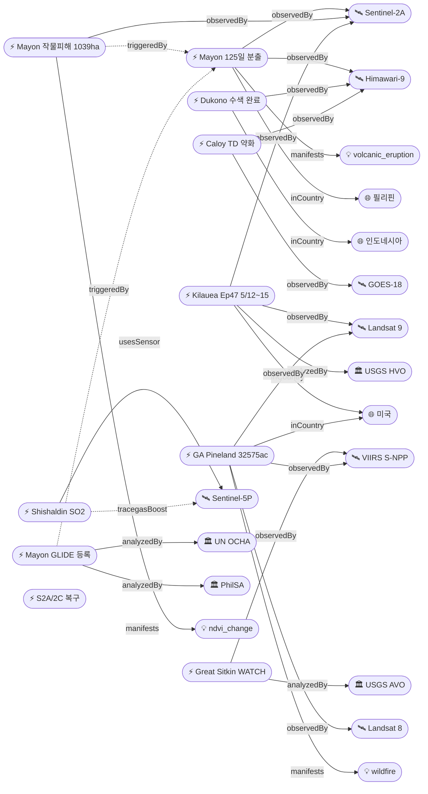

# 2026-05-10 위성영상 관측 이벤트 OSINT 일일 보고서

## 요약
금일은 기존 추적 이벤트의 후속 업데이트가 주를 이루는 날이다. 신규 1건(Mayon 인도주의 GLIDE 등록), 업데이트 9건. **Mayon 화산 125일 연속 분출**이 ReliefWeb에 정식 재해 등록(VO-2026-000065-PHL)되면서 인도주의 카테고리가 처음 활성화됐다. Dukono 화산 수색이 완료되어 총 사망 3명으로 사건이 종결됐고, Caloy/Hagupit은 열대저압부로 약화하여 잔여저기압 전환이 예상된다. 다중 위성 교차검증 4건(Mayon, GA Pineland, Kilauea, Caloy). 한반도 GeoFocus 금일 신규 이벤트 없음.

## 오늘의 핵심 (Top 5)

| 순위 | 이벤트 | 도메인 | 위성 | 지역 | 신뢰도 |
|------|--------|--------|------|------|--------|
| 1 | Mayon 화산 125일 분출 + GLIDE 인도주의 등록 | Disaster → Humanitarian | Himawari-9 + Sentinel-2A | Albay, PH | 0.92 |
| 2 | Dukono 화산 수색 완료 — 3명 사망 | Disaster | Himawari-9 | Halmahera, ID | 0.95 |
| 3 | Kilauea Ep47 분출 예측 5/12~15 | Disaster | Sentinel-2A + Landsat 9 | Hawaii, US | 0.88 |
| 4 | Georgia Pineland Road 산불 32,575ac 70% | Disaster | S-NPP + Landsat 8/9 | GA, US | 0.88 |
| 5 | Caloy/Hagupit TD 약화 → 잔여저기압 | Disaster | Himawari-9 + GOES-18 | Western Pacific | 0.85 |

## 다중 위성 교차검증 이벤트

1. **Mayon 화산 (PH)**: Himawari-9 (JMA, 정지궤도 가시/적외) + Sentinel-2A (ESA, MSI 10m 다분광) — VAAC 화산재 추적 + PhilSA 작물피해 변화탐지
2. **Georgia Pineland Road 산불 (US)**: S-NPP VIIRS + Landsat 8 OLI/TIRS + Landsat 9 OLI/TIRS — 열점·화상 흔적·지표면 온도 3중 검증
3. **Kilauea 화산 (US)**: Sentinel-2A MSI + Landsat 9 TIRS — 분화구 열이상 + 용암류 모니터링
4. **Caloy/Hagupit (서태평양)**: Himawari-9 (JMA) + GOES-18 (NOAA) — 독립 정지궤도 위성 2기에 의한 열대저기압 추적

## 한반도 GeoFocus (KOMPSAT 우선 + 동·서·남해)

금일 한반도 관련 신규 이벤트 없음. 기존 추적 항목:
- **동해 NLL 중국 어선 100척** (5/4 최초 보고): 금일 신규 보도 없음
- **CAS500-2 커미셔닝**: 금일 신규 업데이트 없음
- **영변 UEP / Sohae / Sinpo**: CSIS Beyond Parallel 금일 신규 분석 없음

## 자연재해 (Disaster)

### 1. Mayon 화산 125일 연속 분출 — VAAC 589 (필리핀)
- **출처:** [VAAC Advisory 589](https://www.volcanodiscovery.com/mayon/news/302028/vaac-advisory-2026-589.html)
- **위성·센서:** Himawari-9 (정지궤도 IR), Sentinel-2A (MSI 10m)
- **관측일:** 2026-05-10
- **위치:** Albay, 필리핀 (13.26°N, 123.69°E)
- **현상:** volcanic_eruption
- **상태:** 업데이트 ← 2026-05-09 "Mayon VAAC 586"
- **분석:** 125일째 분출 지속. 5/10 09:05 UTC FL090 WSW 방향 화산재 관측. Alert Level 3 유지. 용암류 길이 Basud 3.8km, Bonga 3.2km, Mi-isi 1.6km 변동 없음. SO2 일 배출량 2,785톤(5/9 기준). 위험구역 8km 유지. ReliefWeb GLIDE 재해 등록으로 인도주의 차원 공식화(src-010).

### 2. Dukono 화산 수색 완료 — 사망 3명 (인도네시아)
- **출처:** [Washington Post](https://www.washingtonpost.com/world/2026/05/10/indonesia-mount-dukono-eruption-hikers-search/174a2542-4c66-11f1-97e7-22c6c29ff0d8_story.html)
- **위성·센서:** Himawari-9 (정지궤도)
- **관측일:** 2026-05-10
- **위치:** Halmahera, 인도네시아 (1.69°N, 127.88°E)
- **현상:** volcanic_eruption
- **상태:** 업데이트 ← 2026-05-09 "Dukono 수색 재개 1 시신"
- **분석:** 5/10 싱가포르인 2명(30세, 27세) 시신 수습으로 수색 완료. 총 사망 3명(싱가포르 2, 인도네시아 1). 20명 등산객 중 17명 구조. 안전 규제 무시한 등산 중 5/8 폭발적 분출(화산재 10km)로 참사. 약 100명 구조인력 투입. 싱가포르 외교부 확인.

### 3. Kilauea Ep47 분출 예측 5/12~15 (미국)
- **출처:** [USGS HVO May 10](https://volcanoes.usgs.gov/hans-public/notice/DOI-USGS-HVO-2026-05-10T18:37:52+00:00)
- **위성·센서:** Sentinel-2A (MSI), Landsat 9 (TIRS)
- **관측일:** 2026-05-10
- **위치:** Kīlauea, Hawaii (19.41°N, 155.28°W)
- **현상:** volcanic_eruption
- **상태:** 업데이트 ← 2026-05-09 "Kilauea Ep46 종료"
- **분석:** Episode 46 종료 후 정상 팽창 재개. Uēkahuna 경사계 10.7μrad 누적 팽창. USGS HVO 공식 예측 창 5/12~15로 수렴. 2024년 12월 이래 에피소드 분출 반복. ADVISORY/YELLOW 유지.

### 4. Georgia Pineland Road 산불 — 32,575ac 70% 진화 (미국)
- **출처:** [Georgia Forestry Commission](https://gatrees.org/current-wildfire-information-and-resources/), [NASA EO](https://science.nasa.gov/earth/earth-observatory/fires-rage-in-georgia/), [CIRA Satellite Library](https://satlib.cira.colostate.edu/weather_media/burn-scars-from-the-pineland-road-and-highway-82-fires/)
- **위성·센서:** S-NPP VIIRS (375m), Landsat 8/9 OLI+TIRS (30m/100m)
- **관측일:** 2026-05-10
- **위치:** Clinch/Echols County, GA, 미국 (31.5°N, 82.5°W)
- **현상:** wildfire
- **상태:** 업데이트 ← 2026-05-09 "Pineland 32,000+ac 70%"
- **분석:** 4/19 용접 불꽃 발화 이래 22일째 지속. 32,575ac 연소, 70% 진화. 이탄층 지하화재가 핵심 난항 — 지하 연소로 육안·위성 열점 탐지 어려움. Landsat 8/9 burn scar 위성 영상 NASA EO 공식 발표. 극심한 가뭄 + 허리케인 Helene 잔해 연료 원인.
- **전후 비교:** NASA EO Landsat 8/9 burn scar before/after 영상 보유

### 5. 칼로이/하구핏 — TD 약화, 잔여저기압 전환 예상 (서태평양)
- **출처:** [Manila Bulletin](https://mb.com.ph/2026/05/10/caloy-may-weaken-into-a-remnant-low-in-the-coming-hours-pagasa)
- **위성·센서:** Himawari-9 (JMA), GOES-18 (NOAA)
- **관측일:** 2026-05-10
- **위치:** 서태평양, Philippine Sea (8.0°N, 134.4°E)
- **현상:** typhoon
- **상태:** 업데이트 ← 2026-05-09 "칼로이 PAR 진입 65km/h"
- **분석:** TS→TD 약화 (55km/h). Surigao City 동쪽 770km, NW 10km/h 이동. 필리핀 직접 영향 미미하나 저기압 연장선(trough)으로 Eastern Visayas·Caraga에 산발적 강우 예상. 2026년 필리핀 3번째 열대저기압.

### 6. Great Sitkin 용암돔 WATCH/ORANGE (미국, 알래스카)
- **출처:** [USGS AVO May 10](https://volcanoes.usgs.gov/hans-public/notice/DOI-USGS-AVO-2026-05-10T19:09:39+00:00)
- **위성·센서:** VIIRS (S-NPP/JPSS)
- **관측일:** 2026-05-10
- **위치:** Great Sitkin, AK (52.08°N, 176.13°W)
- **현상:** volcanic_eruption
- **상태:** 업데이트 ← 2026-05-09 "Great Sitkin WATCH/ORANGE"
- **분석:** 분화구 내 용암돔 서행 분출 지속. 지진 데이터에서 낙석 감지. 구름으로 위성·웹캠 관측 제한. 항공 ORANGE 코드 유지.

### 7. Shishaldin 불안정 ADVISORY/YELLOW (미국, 알래스카)
- **출처:** [USGS AVO May 10](https://volcanoes.usgs.gov/hans-public/notice/DOI-USGS-AVO-2026-05-10T19:09:39+00:00)
- **위성·센서:** Sentinel-5P TROPOMI (SO2 원격 감지)
- **관측일:** 2026-05-10
- **위치:** Shishaldin, AK (54.76°N, 163.97°W)
- **현상:** volcanic_eruption
- **상태:** 업데이트 ← 2026-05-09 "Shishaldin ADVISORY/YELLOW"
- **분석:** 지진·인프라사운드 신호 지속. 증기 기둥 웹캠 관측. **SO2 배출 및 증기가 위성 영상에서 관측**됨 (TROPOMI trace_gas 센서 적합성 — tracegasBoost +0.15 적용).

## 인간활동 (Human Activity)

금일 신규 보도 없음. 기존 추적 항목:
- **Pemex Cantarell 원유 유출** (멕시코만, 3개월 지속): Sentinel-1/2 레이더 조기 탐지 확인. 금일 신규 위성 데이터 없음.
- **Amazon Xingu 금광 496,000ha**: PlanetScope/Sentinel-2 확인. 금일 신규 없음.
- **NISAR+Landsat 삼림벌채 조기탐지**: NASA EO 시스템 보고. 금일 신규 없음.

## 기후·환경 (Climate & Environment)

### 1. Sentinel-2A/2C 데이터 생산 정상 복구
- **출처:** [Copernicus Data Space](https://dataspace.copernicus.eu/news/2026-5-8-copernicus-sentinel-2a-and-sentinel-2c-data-production-interruption-7-may-2026)
- **위성·센서:** Sentinel-2A, Sentinel-2C (MSI)
- **관측일:** 2026-05-10
- **위치:** Almere, 네덜란드 (52.39°N, 5.22°E) — NorthC 데이터센터
- **현상:** satellite_operations
- **상태:** 업데이트 ← 2026-05-09 "S2A/2C 부분 복구"
- **분석:** 5/7 08:30 UTC NorthC 화재로 S2A/2C 프로덕션 중단. 5/7 19:00 UTC 이후 nominal 성능 복구. 중단 기간 데이터는 미손실, 순차 발행 중. Sentinel-2B는 별도 인프라로 무영향.

기존 추적: Hektoria Glacier 8km 후퇴(AQ), MethaneSAT 글로벌 평가 — 금일 신규 없음.

## 농업·해양 (Agriculture & Maritime)

### 1. Mayon ashfall 작물피해 — 1,039ha 벼 + 191ha 기타 확인
- **출처:** [Manila Times](https://www.manilatimes.net/2026/05/10/news/national/mayon-eruption-affects-1000-hectares-of-crops/2339986), [PhilSA](https://philsa.gov.ph/news/satellite-data-show-crop-areas-affected-by-ashfall-from-mayon/)
- **위성·센서:** Sentinel-2A (MSI 10m)
- **관측일:** 2026-05-10
- **위치:** Albay, 필리핀 (13.26°N, 123.69°E)
- **현상:** ndvi_change (화산재 피복에 의한 식생지수 변화)
- **상태:** 업데이트 ← 2026-05-09 "PhilSA Sentinel-2 Mayon ashfall"
- **분석:** PhilSA Sentinel-2 기반 작물피해 정량 매핑 결과 확인. 벼 1,039ha + 기타 191ha 피해. 총 8,544ha 화산재 피복. 도로 158km 영향. Mayon 화산 분출(자연재해)→작물피해(농업)→인도주의 등록으로 이어지는 cross-domain 인과 사슬.

기존 추적: 동해 NLL 중국 어선(KR), CAS500-2 커미셔닝(KR) — 금일 신규 없음.

## 국방·안보 (Defense — OSINT 한정)

금일 신규 위성 분석 없음. 기존 추적 항목:
- **이란-미국 기지 228+ 피해** (KW/SA): WaPo Copernicus+Planet 검증. 금일 신규 없음.
- **필리핀 스프래틀리 건설** (Thitu/Nanshan): Planet Labs 확인. 금일 신규 없음.
- **CSIS BP 북한** (영변 UEP/Sohae/Sinpo): WorldView-3 분석. 금일 신규 없음.
- **SCS Antelope Reef** (중국): Sentinel-2/WorldView-3. 금일 신규 없음.

## 인도주의 (Humanitarian)

### 1. Mayon 화산 ReliefWeb 재해 등록 — GLIDE VO-2026-000065-PHL
- **출처:** [ReliefWeb Disaster Page](https://reliefweb.int/disaster/vo-2026-000065-phl)
- **위성·센서:** Sentinel-2A (MSI 10m), Himawari-9 (정지궤도)
- **관측일:** 2026-05-10
- **위치:** Albay, 필리핀 (13.26°N, 123.69°E)
- **현상:** volcanic_eruption (인도주의 영향)
- **상태:** 신규
- **분석:** UN OCHA/ReliefWeb이 Mayon 분출을 정식 재해 이벤트로 등록. 125일 연속 분출로 인한 복합 영향: 작물피해 1,039ha + 도로 158km + 호흡기 건강피해(Guinobatan). 화산 분출(dom-disaster) → 작물피해(dom-agri-marine) → 인도주의 위기(dom-humanitarian)의 cross-domain cascading disaster 패턴. PhilSA Sentinel-2 위성 데이터가 피해 매핑의 근거.

## 센서·플랫폼별 묶음

- **Sentinel-2A (MSI):** Mayon 작물피해 매핑, Kilauea 열이상, Sentinel-2 복구 확인 — 3건
- **Sentinel-5P (TROPOMI):** Shishaldin SO2 원격 감지 — 1건
- **Landsat 8/9 (OLI/TIRS):** GA Pineland burn scar, Kilauea 열적외 — 2건
- **VIIRS (S-NPP/JPSS):** GA Pineland 열점, Great Sitkin — 2건
- **Himawari-9:** Mayon VAAC, Dukono, Caloy 추적 — 3건
- **GOES-18:** Caloy 추적 — 1건
- **WorldView-3 / PlanetScope:** 금일 활용 없음 (기존 추적만)
- **KOMPSAT-3A / 5 / CAS500:** 금일 활용 없음

## 전후 비교(before/after) 영상 보유 이벤트

- **Georgia Pineland Road 산불**: NASA EO Landsat 8/9 화상 흔적 before/after 위성 영상 ([CIRA Satellite Library](https://satlib.cira.colostate.edu/weather_media/burn-scars-from-the-pineland-road-and-highway-82-fires/))
- **PhilSA Mayon ashfall 작물피해**: Sentinel-2 변화탐지 기반 화산재 전후 비교 ([PhilSA](https://philsa.gov.ph/news/satellite-data-show-crop-areas-affected-by-ashfall-from-mayon/))

## 미검증 의혹

- **Fuego 화산 (과테말라)**: 화산재 937m 분출 지속 보도 (VolcanoDiscovery/INSIVUMEH). 위성 출처 미확인. 신뢰도 0.72. 5/9 이래 신규 업데이트 없음.

## 지식그래프

### 오늘의 주요 관계

1. **Mayon cascading disaster 패턴 완성**: ent-evt-082 (volcanic eruption) → triggeredBy → ent-evt-303 (crop damage) → triggeredBy → ent-evt-401 (humanitarian GLIDE). 자연재해→농업→인도주의 3단계 인과 사슬이 위성 데이터(Sentinel-2A)로 검증됨.
2. **Dukono 사건 종결**: ent-evt-128 수색 완료, 3명 사망 확정. partOfSeries 시계열 종결.
3. **Kilauea Ep47 임박**: ent-evt-202 팽창 10.7μrad, 5/12~15 예측. 에피소드 분출 시리즈 지속.

### 전체 지식그래프 시각화

## 온톨로지 변경

| 변경 유형 | 대상 | 근거 |
|----------|------|------|
| 새 Organization | org-ocha (UN OCHA / ReliefWeb, un_body) | Mayon GLIDE 재해 등록 — 인도주의 도메인 첫 참조 |
| 새 Event | ent-evt-401 (Mayon humanitarian GLIDE VO-2026-000065-PHL) | ReliefWeb 정식 재해 등록, cascading disaster 패턴 |

## 추론 결과

| 추론 | 신뢰도 | 근거 |
|------|--------|------|
| ent-evt-401 multi_satellite_confirmation | 0.85 | Sentinel-2A (ESA) + Himawari-9 (JMA) 독립 운영 |
| ent-evt-082 → ent-evt-401 cascading_disaster | 0.90 | 같은 위치(Albay PH), 화산→작물·건강→인도주의 인과 |
| ent-evt-401 official_source_trust | 0.85 | UN OCHA (un_body) 공식 등록 |
| ent-evt-204 tracegasBoost | 0.78 | Shishaldin SO2, TROPOMI trace_gas 센서 |
| 5건 temporal_progression (partOfSeries) | 0.85~0.95 | Mayon/Caloy/Dukono/Kilauea/GA Pineland |

## 분석 및 평가

금일은 화산 활동이 지배적인 날이다. 전 세계 7개 활화산(Mayon, Dukono, Kilauea, Great Sitkin, Shishaldin, Fuego, Krasheninnikov)이 동시 모니터링 상태이며, 이 중 4개가 금일 유의미한 업데이트를 보였다.

**Mayon 화산의 cross-domain cascading** 패턴이 주목할 만하다. 125일 연속 분출이라는 지속적 자연재해가 (1) 작물피해 1,039ha 벼(농업·해양), (2) 호흡기 건강피해(인도주의), (3) 도로 158km 영향(인프라)으로 확산되어, 마침내 ReliefWeb GLIDE 정식 등록이라는 국제 인도주의 대응 단계에 진입했다. PhilSA의 Sentinel-2 위성 데이터 기반 피해 매핑이 이 과정에서 핵심 증거 역할을 했다.

**위성 센서 활용 패턴**: 화산 모니터링에서 Himawari-9(정지궤도, 화산재 확산 추적)과 TROPOMI(SO2 미량가스 탐지)의 상보적 활용이 두드러진다. 산불 모니터링에서는 VIIRS(열점)와 Landsat OLI/TIRS(화상 흔적, 지표면 온도)의 다중 스케일 검증이 표준 패턴으로 정착했다.

**한반도 관측**: 금일 신규 이벤트 없음. CAS500-2 커미셔닝이 진행 중이며, 하반기 본격 운용 시 한반도 관측 역량이 강화될 전망이다.

## 추적 항목

| 항목 | 최초 보고 | 상태 | 최신 업데이트 |
|------|----------|------|-------------|
| Mayon 화산 분출 | 2026-05-01 | Alert Level 3, 125일째 | 5/10 VAAC 589, GLIDE 등록 |
| Dukono 화산 | 2026-05-07 | **수색 완료** | 5/10 3명 사망 확정 |
| Kilauea Ep46/47 | 2026-05-05 | ADVISORY, Ep47 예측 | 5/10 Ep47 5/12~15 |
| GA Pineland 산불 | 2026-05-05 | 32,575ac 70% | 5/10 이탄 화재 지속 |
| Caloy/Hagupit | 2026-05-07 | **TD 약화** | 5/10 잔여저기압 예상 |
| Great Sitkin | 2026-05-08 | WATCH/ORANGE | 5/10 용암돔 지속 |
| Shishaldin | 2026-05-08 | ADVISORY/YELLOW | 5/10 SO2 지속 |
| Sentinel-2A/2C 복구 | 2026-05-08 | **nominal 복구** | 5/10 정상 운영 |
| Pemex Cantarell 유출 | 2026-05-07 | 3개월 지속 | 5/9 금일 신규 없음 |
| PH Spratly 건설 | 2026-05-09 | 진행 중 | 5/10 금일 신규 없음 |
| 이란-미군 기지 피해 | 2026-05-07 | 228+ 구조물 | 5/10 금일 신규 없음 |
| 영변 UEP/Sohae/Sinpo | 2026-04-30 | UEP 완공 확인 | 5/10 금일 신규 없음 |
| 동해 NLL 어선 | 2026-05-07 | 중국 어선 100척 | 5/10 금일 신규 없음 |
| CAS500-2 | 2026-05-03 | 커미셔닝 | 5/10 금일 신규 없음 |

## 출처 목록
1. [Manila Bulletin — Caloy weakens to TD](https://mb.com.ph/2026/05/10/caloy-may-weaken-into-a-remnant-low-in-the-coming-hours-pagasa) - PAGASA, 2026-05-10
2. [VolcanoDiscovery — Mayon VAAC 589](https://www.volcanodiscovery.com/mayon/news/302028/vaac-advisory-2026-589.html) - VAAC Tokyo, 2026-05-10
3. [Manila Times — Mayon 1,000ha 작물 피해](https://www.manilatimes.net/2026/05/10/news/national/mayon-eruption-affects-1000-hectares-of-crops/2339986) - Manila Times, 2026-05-10
4. [Washington Post — Dukono hikers bodies retrieved](https://www.washingtonpost.com/world/2026/05/10/indonesia-mount-dukono-eruption-hikers-search/174a2542-4c66-11f1-97e7-22c6c29ff0d8_story.html) - WaPo, 2026-05-10
5. [USGS HVO — Kilauea Ep47 forecast](https://volcanoes.usgs.gov/hans-public/notice/DOI-USGS-HVO-2026-05-10T18:37:52+00:00) - USGS, 2026-05-10
6. [USGS AVO — Great Sitkin/Shishaldin](https://volcanoes.usgs.gov/hans-public/notice/DOI-USGS-AVO-2026-05-10T19:09:39+00:00) - USGS, 2026-05-10
7. [Georgia Forestry Commission — Pineland Road update](https://gatrees.org/current-wildfire-information-and-resources/) - GFC, 2026-05-10
8. [Copernicus Data Space — S2A/2C restoration](https://dataspace.copernicus.eu/news/2026-5-8-copernicus-sentinel-2a-and-sentinel-2c-data-production-interruption-7-may-2026) - ESA, 2026-05-08
9. [ReliefWeb — Philippines Mayon Volcano](https://reliefweb.int/disaster/vo-2026-000065-phl) - UN OCHA, 2026-05-10
10. [PhilSA — Sentinel-2 crop damage mapping](https://philsa.gov.ph/news/satellite-data-show-crop-areas-affected-by-ashfall-from-mayon/) - PhilSA, 2026-05-09
11. [NASA EO — Fires Rage in Georgia](https://science.nasa.gov/earth/earth-observatory/fires-rage-in-georgia/) - NASA, 2026-05-08
12. [CIRA — Burn scars Pineland/Hwy 82](https://satlib.cira.colostate.edu/weather_media/burn-scars-from-the-pineland-road-and-highway-82-fires/) - CIRA/CSU, 2026-05-08
13. [WaPo — Iran US bases 228+ satellite](https://www.washingtonpost.com/investigations/2026/05/06/iran-us-bases-satellite-images/) - WaPo, 2026-05-06
14. [RFA — Philippines Spratly construction](https://www.rfa.org/english/southchinasea/2026/05/08/philippines-satellite-spratlys-infrastructure-upgrade/) - RFA, 2026-05-08
15. [TPR — Pemex Cantarell oil spill](https://www.tpr.org/environment/2026-05-07/pemex-linked-gulf-oil-spill-may-still-be-spreading-three-months-later-satellite-images-suggest) - TPR, 2026-05-07
16. [NASA EO — Faster Detection of Forest Loss](https://science.nasa.gov/earth/earth-observatory/faster-detection-of-forest-loss/) - NASA, 2026-05-09
17. [CSIS Beyond Parallel — DPRK](https://beyondparallel.csis.org/) - CSIS, 추적 중
18. [NASA EO — Hektoria Glacier](https://science.nasa.gov/earth/earth-observatory/record-setting-retreat-of-hektoria-glacier/) - NASA, 추적 중
19. [InsideClimateNews — MethaneSAT](https://insideclimatenews.org/news/06022026/methanesat-climate-pollution-global-assessment/) - ICN, 추적 중
20. [GlobalForestWatch — 2026 Report](https://www.competere.eu/global-forest-watch-2026-signs-of-growth-and-transformation/) - GFW, 추적 중
