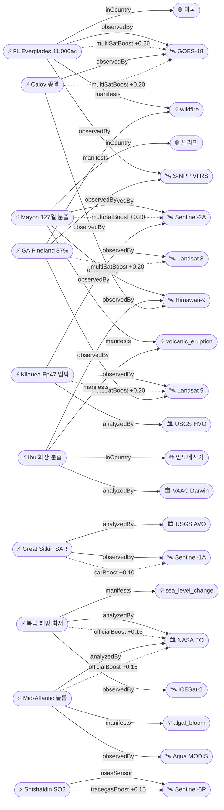

# 2026-05-11 위성영상 관측 이벤트 OSINT 일일 보고서

## 요약
금일은 신규 이벤트 4건(본문 포함)이 등장하면서 수집 다양성이 회복된 날이다. **플로리다 에버글레이즈 대형 산불**(11,000ac, GOES/VIIRS 다수 열점)이 마이애미 메트로 인접 대기질 위기로 부상했고, **북극 해빙 최대면적이 ICESat-2 확인 결과 1979년 이래 역대 최저 타이**(14.29M km²)를 기록했다. 인도네시아 **Ibu 화산** 폭발적 분출이 할마헤라 섬의 두 번째 활화산으로 추가됐다(Dukono와 동일 섬). 기존 추적 이벤트 중 **Mayon 127일**, **Kilauea Ep47 임박**(5/12~15), **Great Sitkin SAR 용암류 확인**이 주요 업데이트다. 다중 위성 교차검증 5건. 한반도 GeoFocus 금일 신규 없음.

## 오늘의 핵심 (Top 5)

| 순위 | 이벤트 | 도메인 | 위성 | 지역 | 신뢰도 |
|------|--------|--------|------|------|--------|
| 1 | Florida Everglades Max Road Fire 11,000ac | Disaster | GOES-18 + S-NPP VIIRS | Broward Co., FL, US | 0.88 |
| 2 | Mayon 화산 127일 스트롬볼리안 | Disaster | Himawari-9 + Sentinel-2A | Albay, PH | 0.92 |
| 3 | Kilauea Ep47 분출 예측 5/12~15 | Disaster | Sentinel-2A + Landsat 9 | Hawaii, US | 0.88 |
| 4 | 북극 해빙 최대면적 역대 최저 14.29M km² | Climate | ICESat-2 + VIIRS | Barents Sea, Arctic | 0.95 |
| 5 | Great Sitkin SAR 용암류 동측 성장 | Disaster | Sentinel-1A (C-SAR) | AK, US | 0.85 |

## 다중 위성 교차검증 이벤트

1. **Florida Everglades 산불 (US)**: GOES-18 ABI (NOAA, 정지궤도 열적외) + S-NPP VIIRS (NOAA/NASA, 극궤도 375m) — 독립 궤도 유형 2기에 의한 열점 교차 확인
2. **Georgia Pineland Road 산불 (US)**: S-NPP VIIRS + Landsat 8 OLI/TIRS + Landsat 9 OLI/TIRS — 열점·화상 흔적·지표면 온도 3중 검증
3. **Mayon 화산 (PH)**: Himawari-9 (JMA, 정지궤도) + Sentinel-2A (ESA, MSI 10m) — 독립 운영기관 교차 관측
4. **Kilauea 화산 (US)**: Sentinel-2A MSI (ESA) + Landsat 9 TIRS (USGS/NASA) — 분화구 열이상 다중 센서 확인
5. **Caloy/Hagupit (서태평양)**: Himawari-9 (JMA) + GOES-18 (NOAA) — 정지궤도 2기 독립 추적, 잔여저기압 종결 확인

## 한반도 GeoFocus (KOMPSAT 우선 + 동·서·남해)

금일 한반도 관련 신규 이벤트 없음. 기존 추적 항목:
- **동해 NLL 중국 어선 100척** (5/4 최초 보고): 금일 신규 보도 없음
- **CAS500-2 커미셔닝**: 금일 신규 업데이트 없음
- **영변 UEP / Sohae / Sinpo**: CSIS Beyond Parallel 금일 신규 분석 없음

## 자연재해 (Disaster)

### 1. Florida Everglades Max Road Fire — 11,000ac 50% 진화 (미국, 플로리다)
- **출처:** [The Watchers](https://watchers.news/2026/05/11/large-everglades-wildfire-sends-smoke-toward-pembroke-pines-as-florida-tracks-61-active-fires/)
- **위성·센서:** GOES-18 (ABI, 정지궤도 열적외), S-NPP VIIRS (375m 극궤도)
- **관측일:** 2026-05-11
- **위치:** Broward County, FL, 미국 (26.0°N, 80.45°W)
- **현상:** wildfire
- **상태:** 신규
- **분석:** 플로리다 에버글레이즈 국립공원 인접 Max Road에서 대형 산불 발생. 11,000ac(4,452ha) 연소, 50% 진화 상태. GOES-18 정지궤도 열적외 + VIIRS 극궤도 375m에서 다수 열점 감지. 연기가 Pembroke Pines(마이애미 메트로 인구 172,000)로 확산되어 대기질 경보 발령. 플로리다 주 전체 61건 활성 산불 추적 중. multiSatBoost +0.20 적용.

### 2. Mayon 화산 127일 스트롬볼리안 — PHIVOLCS Alert Level 3 (필리핀)
- **출처:** [GMA News](https://www.gmanetwork.com/news/topstories/regions/987255/strombolian-activity-mayon-volcano-eruption/story/)
- **위성·센서:** Himawari-9 (AHI, 정지궤도 IR), Sentinel-2A (MSI 10m)
- **관측일:** 2026-05-11
- **위치:** Albay, 필리핀 (13.26°N, 123.69°E)
- **현상:** volcanic_eruption
- **상태:** 업데이트 ← 2026-05-10 "Mayon 125일 VAAC 589"
- **분석:** 127일째 연속 분출. 5/11 20:43 UTC 스트롬볼리안 활동 관측. Alert Level 3 유지. 용암류 3방향(Basud/Bonga/Mi-isi) 변동 없음. ReliefWeb GLIDE 등록 후 인도주의 대응 지속. multiSatBoost +0.20 적용.

### 3. Kilauea Ep47 분출 예측 5/12~15 — ADVISORY/YELLOW (미국, 하와이)
- **출처:** [Big Island Video News](https://www.bigislandvideonews.com/2026/05/11/kilauea-volcano-update-for-monday-may-11/)
- **위성·센서:** Sentinel-2A (MSI), Landsat 9 (TIRS)
- **관측일:** 2026-05-11
- **위치:** Kīlauea, Hawaii (19.41°N, 155.28°W)
- **현상:** volcanic_eruption
- **상태:** 업데이트 ← 2026-05-10 "Kilauea Ep47 5/12~15"
- **분석:** Episode 46 종료 후 정상 팽창 지속. 강한 분화구 발광·가스 화염 관측. USGS HVO 공식 예측 창 5/11~14로 좁혀짐. multiSatBoost +0.20 적용(ESA + USGS/NASA 교차 관측).

### 4. Ibu 화산 폭발적 분출 — VAAC Darwin, 화산재 FL070 (인도네시아)
- **출처:** [VolcanoDiscovery](https://www.volcanodiscovery.com/earthquakes-volcanoes/news/302071/Volcano-earthquake-report-for-Monday-11-May-2026.html)
- **위성·센서:** Himawari-9 (AHI, 정지궤도 가시/적외)
- **관측일:** 2026-05-11
- **위치:** Halmahera, 인도네시아 (1.49°N, 127.63°E)
- **현상:** volcanic_eruption
- **상태:** 신규
- **분석:** 2026년 641건 분출 기록 중 지속적 폭발적 활동. VAAC Darwin이 화산재 FL070(약 2.1km) 발표. Himawari-9 정지궤도에서 화산재 확산 추적. **Dukono(3명 사망)와 같은 할마헤라 섬에서 동시 화산 활동** — 지역 화산 불안정 경고 신호로 주목.

### 5. Great Sitkin SAR 용암류 동측 성장 — WATCH/ORANGE (미국, 알래스카)
- **출처:** [USGS AVO](https://volcanoes.usgs.gov/hans-public/notice/DOI-USGS-AVO-2026-05-11T20:21:35+00:00)
- **위성·센서:** Sentinel-1A (C-SAR, C-band 합성개구레이다)
- **관측일:** 2026-05-11
- **위치:** Great Sitkin, AK (52.08°N, 176.13°W)
- **현상:** volcanic_eruption
- **상태:** 업데이트 ← 2026-05-10 "Great Sitkin WATCH 용암돔"
- **분석:** **SAR 위성 레이더가 구름 투과하여 용암류 동측 성장을 신규 확인** — 광학 위성·웹캠 관측 불가 상태에서 SAR의 전천후 능력 발휘. USGS AVO WATCH/ORANGE 유지. sarBoost +0.10 적용.

### 6. Shishaldin SO2·증기 위성 관측 — ADVISORY/YELLOW (미국, 알래스카)
- **출처:** [USGS AVO](https://volcanoes.usgs.gov/hans-public/notice/DOI-USGS-AVO-2026-05-11T20:21:35+00:00)
- **위성·센서:** Sentinel-5P (TROPOMI, SO2 원격 감지)
- **관측일:** 2026-05-11
- **위치:** Shishaldin, AK (54.76°N, 163.97°W)
- **현상:** volcanic_eruption
- **상태:** 업데이트 ← 2026-05-10 "Shishaldin ADVISORY SO2"
- **분석:** 지진·인프라사운드 신호 지속. SO2 배출 및 증기가 위성 영상에서 관측됨. TROPOMI trace_gas 센서 적합성 — tracegasBoost +0.15 적용.

### 7. Georgia Pineland Road 산불 — 32,575ac 70~87% 진화 (미국, 조지아)
- **출처:** [Georgia Forestry Commission](https://gatrees.org/current-wildfire-information-and-resources/)
- **위성·센서:** S-NPP VIIRS (375m), Landsat 8/9 OLI+TIRS (30m/100m)
- **관측일:** 2026-05-11
- **위치:** Clinch/Echols County, GA, 미국 (31.5°N, 82.5°W)
- **현상:** wildfire
- **상태:** 업데이트 ← 2026-05-10 "Pineland 32,575ac 70%"
- **분석:** 4/19 발화 이래 23일째 지속. 70~87% 진화. 이탄층 지하화재가 핵심 난항 — 건조 예보로 화~목 진화 차질 우려. VIIRS + Landsat 8 + Landsat 9 3중 위성 검증 지속. multiSatBoost +0.20 적용.

### 8. 칼로이/하구핏 — 잔여저기압 소멸 중 (서태평양)
- **출처:** [Manila Bulletin](https://mb.com.ph/2026/05/10/caloy-may-weaken-into-a-remnant-low-in-the-coming-hours-pagasa)
- **위성·센서:** Himawari-9 (JMA), GOES-18 (NOAA)
- **관측일:** 2026-05-11
- **위치:** 서태평양 (8.0°N, 133.0°E)
- **현상:** typhoon
- **상태:** 업데이트 ← 2026-05-10 "Caloy TD 약화"
- **분석:** 잔여저기압 전환 완료, 소멸 단계 진입. 이벤트 종결. multiSatBoost +0.20 적용.

## 인간활동 (Human Activity)

금일 신규 보도 없음. 기존 추적 항목:
- **Pemex Cantarell 원유 유출** (멕시코만, 3개월 지속): Sentinel-1/2 확인. 금일 신규 없음.
- **Amazon Xingu 금광 496,000ha**: PlanetScope/Sentinel-2 확인. 금일 신규 없음.
- **NISAR+Landsat 삼림벌채 조기탐지**: 금일 신규 없음.
- **GFW 열대우림 손실**: 금일 신규 없음.

## 기후·환경 (Climate & Environment)

### 1. 북극 해빙 최대면적 역대 최저 타이 — ICESat-2 (NASA EO)
- **출처:** [NASA Earth Observatory](https://science.nasa.gov/earth/earth-observatory/barents-sea-tied-to-low-arctic-sea-ice/)
- **위성·센서:** ICESat-2 (ATLAS lidar), S-NPP VIIRS (가시광)
- **관측일:** 2026-03-15
- **위치:** Barents Sea, Arctic (76.0°N, 40.0°E)
- **현상:** sea_level_change (해빙 면적 변화)
- **상태:** 신규
- **분석:** 2026년 3월 15일 측정 기준 북극 해빙 최대면적 14.29M km² — **1979년 위성 관측 이래 2017년과 공동 역대 최저**. 핵심 원인은 **바렌츠해 얼음 거의 완전 소실**. ICESat-2 ATLAS 레이다 고도계(freeboard 측정) + VIIRS 가시광 영상으로 확인. 기후변화의 결정적 지표. officialBoost +0.15 적용(NASA 공식).

기존 추적: Hektoria Glacier 8km 후퇴(AQ), MethaneSAT 글로벌 평가, Sentinel-2A/2C 정상 운영 — 금일 신규 없음.

## 농업·해양 (Agriculture & Maritime)

### 1. 미국 중대서양 해안 식물플랑크톤·퇴적물 블룸 — MODIS Aqua (NASA EO)
- **출처:** [NASA Earth Observatory](https://science.nasa.gov/earth/earth-observatory/color-off-the-mid-atlantic-coast/)
- **위성·센서:** Aqua (MODIS, 250m~1km 다분광)
- **관측일:** 2026-05-03
- **위치:** Mid-Atlantic Bight, 미국 동부 해안 (38.9°N, 74.5°W)
- **현상:** algal_bloom (식물플랑크톤 + 퇴적물)
- **상태:** 신규
- **분석:** Chesapeake Bay/Delaware Bay 하구 유출수 구동 식물플랑크톤 + 퇴적물 플룸. MODIS Aqua 자연색 영상. 봄철 용승 패턴 일부. 해양 1차 생산성 모니터링 사례. officialBoost +0.15 적용(NASA 공식).

기존 추적: 동해 NLL 중국 어선(KR), CAS500-2 커미셔닝(KR), Mayon ashfall 작물피해 — 금일 신규 업데이트 없음.

## 국방·안보 (Defense — OSINT 한정)

금일 신규 위성 분석 없음. 기존 추적 항목:
- **이란-미군 기지 228+ 피해** (KW/SA): WaPo Copernicus+Planet 검증. 금일 신규 없음.
- **필리핀 스프래틀리 건설** (Thitu/Nanshan): Planet Labs 확인. 금일 신규 없음.
- **CSIS BP 북한** (영변 UEP/Sohae/Sinpo): WorldView-3 분석. 금일 신규 없음.
- **SCS Antelope Reef** (중국): Sentinel-2/WorldView-3. 금일 신규 없음.

## 인도주의 (Humanitarian)

금일 신규 없음. 기존 추적:
- **Mayon GLIDE VO-2026-000065-PHL**: ReliefWeb 등록 후 인도주의 대응 지속. 금일 별도 신규 업데이트 없음.

## 센서·플랫폼별 묶음

- **GOES-18 (ABI):** Florida Everglades 열점, Caloy 추적 — 2건
- **S-NPP VIIRS:** Florida 열점, Georgia Pineland, Barents Sea 가시 — 3건
- **Sentinel-2A (MSI):** Mayon, Kilauea 열이상 — 2건
- **Sentinel-1A (C-SAR):** Great Sitkin SAR 용암류 — 1건 ★SAR 구름 투과
- **Sentinel-5P (TROPOMI):** Shishaldin SO2 — 1건 ★미량가스 탐지
- **Landsat 8/9 (OLI/TIRS):** Georgia Pineland, Kilauea — 2건
- **Himawari-9 (AHI):** Mayon, Ibu, Caloy — 3건
- **ICESat-2 (ATLAS):** 북극 해빙 고도계 — 1건 ★첫 등장 위성
- **MODIS Aqua:** Mid-Atlantic 해양색 — 1건
- **WorldView-3 / PlanetScope / KOMPSAT:** 금일 활용 없음 (기존 추적만)

## 전후 비교(before/after) 영상 보유 이벤트

- **Georgia Pineland Road 산불**: NASA EO Landsat 8/9 burn scar before/after ([CIRA Satellite Library](https://satlib.cira.colostate.edu/weather_media/burn-scars-from-the-pineland-road-and-highway-82-fires/))
- **PhilSA Mayon ashfall 작물피해**: Sentinel-2 변화탐지 before/after ([PhilSA](https://philsa.gov.ph/news/satellite-data-show-crop-areas-affected-by-ashfall-from-mayon/))

## 미검증 의혹

- **Fuego 화산 (과테말라)**: 분출 지속 보도 (VolcanoDiscovery/INSIVUMEH). 위성 출처 미확인. 신뢰도 0.72. 5/9 이래 신규 업데이트 없음. `satellite_unverified: true`

## 지식그래프

### 오늘의 주요 관계

1. **Florida Everglades 산불 신규 등장**: ent-evt-501이 dom-disaster에 진입. GOES-18 + VIIRS 이중 위성 확인. 마이애미 메트로 인접으로 관심도 높음.
2. **북극 해빙 기록 — 첫 ICESat-2 인스턴스**: sat-icesat2가 온톨로지에 처음 추가됨. NASA ATLAS lidar로 해빙 freeboard 정밀 측정.
3. **할마헤라 이중 화산**: ent-evt-504(Ibu) + ent-evt-128(Dukono) 동일 섬 동시 활동. 지역 화산 불안정.
4. **Great Sitkin SAR 돌파**: 구름 투과 C-SAR가 광학 실패 보완. sensor_capability_match_sar 추론 활성.
5. **Kilauea Ep47 카운트다운**: 5/12~15 예측 창 진입 임박. partOfSeries 시계열 지속.

### 전체 지식그래프 시각화

## 온톨로지 변경

| 변경 유형 | 대상 | 근거 |
|----------|------|------|
| 새 Satellite | sat-icesat2 (ICESat-2, NASA, ATLAS lidar) | 북극 해빙 최대면적 역대 최저 확인 — 첫 lidar 위성 인스턴스 |
| 새 Country | co-sv (엘살바도르, SV) | Ahuachapán 지열 지형 Landsat 8 관측 |
| 새 Location (4건) | ent-loc-058~061 (Broward Co., Mid-Atlantic, Barents Sea, Ibu) | 신규 이벤트 발생 위치 |
| 새 Event (5건) | ent-evt-501~505 (FL 산불, 블룸, 해빙, Ibu, Ahuachapán) | 금일 신규 관측 이벤트 |

## 추론 결과

| 추론 | 신뢰도 | 근거 |
|------|--------|------|
| ent-evt-501 multiSatBoost +0.20 | 0.85 | GOES-18 (NOAA) + VIIRS (NASA/NOAA) 독립 궤도 |
| temp-evt-001 multiSatBoost +0.20 | 0.88 | VIIRS + Landsat 8 + Landsat 9 3중 검증 |
| ent-evt-082 multiSatBoost +0.20 | 0.92 | Himawari-9 (JMA) + Sentinel-2A (ESA) |
| ent-evt-202 multiSatBoost +0.20 | 0.88 | Sentinel-2A (ESA) + Landsat 9 (USGS) |
| ent-evt-127 multiSatBoost +0.20 | 0.82 | Himawari-9 (JMA) + GOES-18 (NOAA) |
| ent-evt-203 sarBoost +0.10 | 0.88 | C-SAR 구름 투과 용암류 관측 |
| ent-evt-204 tracegasBoost +0.15 | 0.85 | TROPOMI SO2 미량가스 탐지 |
| ent-evt-503 officialBoost +0.15 | 0.95 | NASA 공식 EO 분석 |
| ent-evt-502 officialBoost +0.15 | 0.95 | NASA 공식 EO 분석 |
| 3건 temporal_progression (partOfSeries) | 0.88~0.95 | Mayon 125→127일 / Kilauea Ep46→47 / GA Pineland 22→23일 |

## 분석 및 평가

금일은 **신규 이벤트 다양성이 회복**되었다. 자연재해(FL 산불, Ibu 화산), 기후·환경(북극 해빙), 농업·해양(Mid-Atlantic 블룸) 4개 도메인에서 신규 관측이 등장했다. 인간활동·국방은 금일 신규 없음.

**핵심 발견 — 북극 해빙 기록**: ICESat-2 ATLAS lidar가 확인한 2026년 3월 최대면적 14.29M km²는 1979년 위성 관측 이래 2017년과 공동 역대 최저다. 바렌츠해 얼음 거의 완전 소실이 주 원인이며, 이는 장기 기후변화 추세의 결정적 지표다. 이 위성(ICESat-2)이 본 파이프라인에 처음 등장하여 lidar 센서 유형이 온톨로지에 추가됐다.

**위성 센서 활용 하이라이트**: Great Sitkin 사례에서 **SAR의 전천후 능력**이 다시 한번 입증됐다. 구름·강수로 광학 위성·웹캠 모두 관측 불가인 상태에서 Sentinel-1A C-SAR만이 용암류 동측 성장을 확인했다. 이는 화산 모니터링에서 SAR 데이터의 대체 불가능성을 보여준다.

**할마헤라 이중 화산 경고**: Ibu(1.49°N)와 Dukono(1.69°N)가 같은 할마헤라 섬에서 동시 활동 중이다. 두 화산 간 직선거리 약 30km. 지역 지각 불안정의 가능성을 시사하며, 향후 연쇄 분출 가능성 모니터링이 필요하다.

**한반도 관측**: 금일 신규 이벤트 없음. KOMPSAT-3A/5, CAS500-2 관측 데이터 활용 기회 대기 중.

## 추적 항목

| 항목 | 최초 보고 | 상태 | 최신 업데이트 |
|------|----------|------|-------------|
| Florida Everglades 산불 | 2026-05-11 | **신규** 11,000ac 50% | 5/11 GOES+VIIRS 열점 |
| Mayon 화산 분출 | 2026-05-01 | Alert Level 3, 127일째 | 5/11 스트롬볼리안 지속 |
| Kilauea Ep46/47 | 2026-05-05 | ADVISORY, Ep47 임박 | 5/11 예측 창 5/12~15 |
| GA Pineland 산불 | 2026-05-05 | 32,575ac 70~87% | 5/11 이탄 지하화재 |
| Ibu 화산 | 2026-05-11 | **신규** 폭발적 분출 | 5/11 VAAC Darwin FL070 |
| Great Sitkin | 2026-05-08 | WATCH/ORANGE | 5/11 SAR 용암류 동측 |
| Shishaldin | 2026-05-08 | ADVISORY/YELLOW | 5/11 SO2 TROPOMI |
| Caloy/Hagupit | 2026-05-07 | **종결** 잔여저기압 | 5/11 소멸 단계 |
| 북극 해빙 기록 | 2026-05-11 | **신규** 기록적 저점 | 5/11 NASA EO 발표 |
| Mid-Atlantic 블룸 | 2026-05-11 | **신규** 식물플랑크톤 | 5/11 NASA EO 발표 |
| Sentinel-2A/2C | 2026-05-08 | nominal 복구 | 5/10 정상 운영 |
| Pemex Cantarell 유출 | 2026-05-07 | 3개월 지속 | 5/9 금일 신규 없음 |
| PH Spratly 건설 | 2026-05-09 | 진행 중 | 5/10 금일 신규 없음 |
| 이란-미군 기지 피해 | 2026-05-07 | 228+ 구조물 | 5/10 금일 신규 없음 |
| 영변 UEP/Sohae/Sinpo | 2026-04-30 | UEP 완공 확인 | 5/10 금일 신규 없음 |
| 동해 NLL 어선 | 2026-05-07 | 중국 어선 100척 | 5/10 금일 신규 없음 |
| CAS500-2 | 2026-05-03 | 커미셔닝 | 5/10 금일 신규 없음 |

## 출처 목록
1. [The Watchers — Florida Everglades wildfire](https://watchers.news/2026/05/11/large-everglades-wildfire-sends-smoke-toward-pembroke-pines-as-florida-tracks-61-active-fires/) - The Watchers, 2026-05-11
2. [NASA EO — Color Off the Mid-Atlantic Coast](https://science.nasa.gov/earth/earth-observatory/color-off-the-mid-atlantic-coast/) - NASA, 2026-05-11
3. [NASA EO — Barents Sea Tied to Low Arctic Sea Ice](https://science.nasa.gov/earth/earth-observatory/barents-sea-tied-to-low-arctic-sea-ice/) - NASA, 2026-05-11
4. [VolcanoDiscovery — Ibu eruption report](https://www.volcanodiscovery.com/earthquakes-volcanoes/news/302071/Volcano-earthquake-report-for-Monday-11-May-2026.html) - VD, 2026-05-11
5. [GMA News — Mayon Strombolian Day 127](https://www.gmanetwork.com/news/topstories/regions/987255/strombolian-activity-mayon-volcano-eruption/story/) - GMA, 2026-05-11
6. [Big Island Video News — Kilauea May 11 update](https://www.bigislandvideonews.com/2026/05/11/kilauea-volcano-update-for-monday-may-11/) - BIVN, 2026-05-11
7. [USGS AVO — Great Sitkin/Shishaldin May 11](https://volcanoes.usgs.gov/hans-public/notice/DOI-USGS-AVO-2026-05-11T20:21:35+00:00) - USGS, 2026-05-11
8. [Georgia Forestry Commission — Pineland update](https://gatrees.org/current-wildfire-information-and-resources/) - GFC, 2026-05-11
9. [Manila Bulletin — Caloy remnant low](https://mb.com.ph/2026/05/10/caloy-may-weaken-into-a-remnant-low-in-the-coming-hours-pagasa) - PAGASA, 2026-05-10
10. [NASA EO — Ahuachapán (참고용)](https://science.nasa.gov/earth/earth-observatory/ahuachapan-and-its-restive-neighbors/) - NASA, 2026-05-11
11. [ReliefWeb — Philippines Mayon GLIDE](https://reliefweb.int/disaster/vo-2026-000065-phl) - UN OCHA, 추적 중
12. [WaPo — Iran US bases satellite](https://www.washingtonpost.com/investigations/2026/05/06/iran-us-bases-satellite-images/) - WaPo, 추적 중
13. [RFA — Philippines Spratly construction](https://www.rfa.org/english/southchinasea/2026/05/08/philippines-satellite-spratlys-infrastructure-upgrade/) - RFA, 추적 중
14. [TPR — Pemex Cantarell oil spill](https://www.tpr.org/environment/2026-05-07/pemex-linked-gulf-oil-spill-may-still-be-spreading-three-months-later-satellite-images-suggest) - TPR, 추적 중
15. [CSIS Beyond Parallel — DPRK](https://beyondparallel.csis.org/) - CSIS, 추적 중
16. [NASA EO — Hektoria Glacier](https://science.nasa.gov/earth/earth-observatory/record-setting-retreat-of-hektoria-glacier/) - NASA, 추적 중
17. [InsideClimateNews — MethaneSAT](https://insideclimatenews.org/news/06022026/methanesat-climate-pollution-global-assessment/) - ICN, 추적 중
18. [GFW — 2026 Report](https://www.competere.eu/global-forest-watch-2026-signs-of-growth-and-transformation/) - GFW, 추적 중
19. [NASA EO — Faster Detection of Forest Loss](https://science.nasa.gov/earth/earth-observatory/faster-detection-of-forest-loss/) - NASA, 추적 중
20. [Defense News — SCS Antelope Reef](https://www.defensenews.com/global/asia-pacific/2026/01/27/china-appears-set-on-militarizing-another-reef-in-the-south-china-sea/) - Defense News, 추적 중
