# 2026-05-12 위성영상 관측 이벤트 OSINT 일일 보고서

## 요약
금일은 **국방·인도주의 도메인에서 고해상도 위성영상 기반 OSINT가 집중**된 날이다. **이라크 Al-Anbar 이스라엘 비밀 군사기지**가 PlanetScope/WorldView-3 위성영상으로 공개되었고(before/after 확보), **우크라이나 오데사 Grande Pettine 호텔 피격**이 Maxar 5/12 당일 영상으로 문서화되었다. 자연재해 도메인에서는 **Kilauea Ep47 분출이 5/12~14 예측 창에 진입**하여 수일 내 분수 분출 개시가 유력하며, 알래스카 **Mt Kupreanof가 ADVISORY/YELLOW로 새로 상향**되어 Sentinel-5P TROPOMI에서 SO2 8회 관측이 확인됐다. **남중국해 Antelope Reef 인공섬이 1,490ac에 도달**하여 역대 최대 SCS 인공섬(Mischief Reef 1,504ac)에 근접, 베트남이 공식 항의했다. 다중 위성 교차검증 **6건**(역대 최다 수준). 한반도 GeoFocus 금일 신규 없음.

## 오늘의 핵심 (Top 5)

| 순위 | 이벤트 | 도메인 | 위성 | 지역 | 신뢰도 |
|------|--------|--------|------|------|--------|
| 1 | Kilauea Ep47 분출 5/12~14 예측 | Disaster | Sentinel-2A + Landsat 9 | Hawaii, US | 0.90 |
| 2 | 이라크 이스라엘 비밀 군사기지 위성 공개 | Defense | PlanetScope + WorldView-3 | Al-Anbar, IQ | 0.85 |
| 3 | Antelope Reef 1,490ac — 베트남 항의 | Defense | Sentinel-2A + WorldView-3 | Paracel Is., CN | 0.92 |
| 4 | Mayon 화산 Day 128+ 스트롬볼리안 | Disaster | Himawari-9 + Sentinel-2A | Albay, PH | 0.92 |
| 5 | Florida Everglades 지하 이탄화재 | Disaster | GOES-18 + S-NPP VIIRS | Broward Co., FL, US | 0.90 |

## 다중 위성 교차검증 이벤트

1. **Florida Everglades 산불 (US)**: GOES-18 ABI (NOAA, 정지궤도 열적외) + S-NPP VIIRS (NOAA/NASA, 극궤도 375m) — GEO+LEO 독립 궤도 유형 교차
2. **Kilauea 화산 (US)**: Sentinel-2A MSI (ESA) + Landsat 9 TIRS (USGS/NASA) — 분화구 열이상 다기관 관측
3. **Mayon 화산 (PH)**: Himawari-9 (JMA, 정지궤도) + Sentinel-2A (ESA, MSI 10m) — 독립 운영기관 교차
4. **Georgia Pineland Road 산불 (US)**: S-NPP VIIRS + Landsat 8 + Landsat 9 — 3중 위성 검증
5. **이라크 이스라엘 비밀기지 (IQ)**: PlanetScope (Planet Labs, 3m) + WorldView-3 (Maxar, 0.31m) — 상업 위성 교차
6. **Antelope Reef (CN)**: Sentinel-2A (ESA, 10m) + WorldView-3 (Maxar, 0.31m) — 공공+상업 위성 교차

## 한반도 GeoFocus (KOMPSAT 우선 + 동·서·남해)

금일 한반도 관련 신규 이벤트 없음. 기존 추적 항목:
- **동해 NLL 중국 어선 100척** (5/4 최초 보고): 금일 신규 보도 없음
- **CAS500-2 커미셔닝**: 금일 신규 업데이트 없음
- **영변 UEP / Sohae / Sinpo**: CSIS Beyond Parallel 금일 신규 분석 없음

## 자연재해 (Disaster)

### 1. Kilauea Ep47 분출 예측 5/12~14 — ADVISORY/YELLOW (미국, 하와이)
- **출처:** [Big Island Video News](https://www.bigislandvideonews.com/2026/05/12/kilauea-volcano-update-for-tuesday-may-12/), [Big Island Now](https://bigislandnow.com/2026/05/12/fountaining-episode-at-kilauea-predicted-to-start-this-week/)
- **위성·센서:** Sentinel-2A (MSI), Landsat 9 (TIRS)
- **관측일:** 2026-05-12
- **위치:** Kīlauea, Hawaii (19.41°N, 155.28°W)
- **현상:** volcanic_eruption
- **상태:** 업데이트 ← 2026-05-11 "Kilauea Ep47 5/11~14"
- **분석:** Episode 46 종료 후 정상 팽창 지속. **남측 분출구에서 강한 일관된 발광 + 빈번한 대형 화염** 관측. 북측 분출구는 약한 발광 + 간헐적 스패터. USGS HVO 예측 창 5/12~14, **화요일(5/12) 또는 수요일(5/13)에 Ep47 개시 가능성 최고**. 양 분출구에서 지속적 탈가스. multiSatBoost +0.20 · officialBoost +0.15 적용.

### 2. Mayon 화산 Day 128+ 스트롬볼리안 — Alert Level 3 (필리핀)
- **출처:** [ASIS Online](https://www.asisonline.org/security-management-magazine/latest-news/today-in-security/2026/may/mayon-volcano-ashfall-eruption/), [ReliefWeb](https://reliefweb.int/disaster/vo-2026-000065-phl)
- **위성·센서:** Himawari-9 (AHI, 정지궤도 IR), Sentinel-2A (MSI 10m)
- **관측일:** 2026-05-12
- **위치:** Albay, 필리핀 (13.26°N, 123.69°E)
- **현상:** volcanic_eruption
- **상태:** 업데이트 ← 2026-05-11 "Mayon Day 127"
- **분석:** 128일째 연속 분출. 용암류 3방향(Basud/Bonga/Mi-isi) 지속. **21건 화산지진 기록 (14건 화산 트레머 포함)**. 6km 영구 위험구역 진입 금지. GLIDE VO-2026-000065-PHL 인도주의 등록 지속. multiSatBoost +0.20 적용.

### 3. Mount Kupreanof — ADVISORY/YELLOW, 마그마 관입 (미국, 알래스카) ★신규
- **출처:** [The Watchers](https://watchers.news/2026/05/09/increased-seismicity-gas-emissions-kupreanof-volcano-alaska-may-2026/), [USGS AVO](https://volcanoes.usgs.gov/hans-public/notice/DOI-USGS-AVO-2026-05-12T20:06:22+00:00)
- **위성·센서:** Sentinel-5P (TROPOMI, SO2 원격 감지)
- **관측일:** 2026-05-12
- **위치:** Alaska Peninsula, 미국 (56.01°N, 159.79°W)
- **현상:** volcanic_eruption (전조 단계)
- **상태:** 신규
- **분석:** 4월 초부터 얕은 지진 활동 증가, 최대 M3.1 (4/12, 4/22). **4월 4일 이후 Sentinel-5P TROPOMI에서 SO2 배출 8회 감지, 100~1,000 t/d**. 마그마가 수심 5km 미만으로 관입하여 해발 5,000ft 분기공 활성화 추정. 마그마 관입이 반드시 분출로 이어지지는 않음. tracegasBoost +0.15 · officialBoost +0.15 적용.

### 4. Florida Everglades Max Road Fire — 11,300ac 70% 진화 (미국, 플로리다)
- **출처:** [Daily Dispatch](https://dailydispatch.com/fire-news/wildland/max-road-fire-in-florida-everglades-grows-to-11000-acres-burned-60-contained/), [ABC17/CNN Weather](https://abc17news.com/weather/insider-blog/2026/05/12/why-the-everglades-is-burning-from-the-inside-out/)
- **위성·센서:** GOES-18 (ABI, 정지궤도 열적외), S-NPP VIIRS (375m 극궤도)
- **관측일:** 2026-05-12
- **위치:** Broward County, FL, 미국 (26.0°N, 80.45°W)
- **현상:** wildfire
- **상태:** 업데이트 ← 2026-05-11 "Everglades 11,000ac 50%"
- **분석:** 11,300ac(4,573ha)로 확대, 진화율 50%→70%. **지하 이탄화재가 핵심 난항** — 100% 주 전역 가뭄으로 수위 12~24인치(30~60cm) 하강, 이탄층이 지표 아래에서 고온 연소. 헬기·항공기 투입 중. Pembroke Pines(마이애미 인구 172,000) 대기질 영향 지속. multiSatBoost +0.20 적용.

### 5. Great Sitkin SAR 용암류 + 소지진·낙석 — WATCH/ORANGE (미국, 알래스카)
- **출처:** [USGS AVO](https://volcanoes.usgs.gov/hans-public/notice/DOI-USGS-AVO-2026-05-12T20:06:22+00:00)
- **위성·센서:** Sentinel-1A (C-SAR, C-band 합성개구레이다)
- **관측일:** 2026-05-12
- **위치:** Great Sitkin, AK (52.08°N, 176.13°W)
- **현상:** volcanic_eruption
- **상태:** 업데이트 ← 2026-05-11 "Great Sitkin SAR 용암류"
- **분석:** 정상 분화구 내 느린 용암 유출 지속. **소규모 지진 + 성장하는 용암돔 낙석** 기록. 구름으로 광학 위성·웹캠 관측 불가 — **SAR 전천후 능력**이 유일한 관측 수단. 2021년 7월 분출 개시 이래 분화구 대부분 충전. sarBoost +0.10 적용.

### 6. Shishaldin SO2·지진·인프라사운드 — ADVISORY/YELLOW (미국, 알래스카)
- **출처:** [USGS AVO](https://volcanoes.usgs.gov/hans-public/notice/DOI-USGS-AVO-2026-05-12T20:06:22+00:00)
- **위성·센서:** Sentinel-5P (TROPOMI, SO2)
- **관측일:** 2026-05-12
- **위치:** Shishaldin, AK (54.76°N, 163.97°W)
- **현상:** volcanic_eruption
- **상태:** 업데이트 ← 2026-05-11 "Shishaldin ADVISORY SO2"
- **분석:** 지진·인프라사운드 계속 상승. SO2 배출이 위성 영상에서 관측됨. tracegasBoost +0.15 적용.

### 7. Georgia Pineland Road 산불 — ~32,575ac ~90% 진화 (미국, 조지아)
- **출처:** [Georgia Forestry Commission](https://gatrees.org/current-wildfire-information-and-resources/)
- **위성·센서:** S-NPP VIIRS (375m), Landsat 8/9 OLI+TIRS
- **관측일:** 2026-05-12
- **위치:** Clinch/Echols County, GA (31.5°N, 82.5°W)
- **현상:** wildfire
- **상태:** 업데이트 ← 2026-05-11 "Pineland 70~87%"
- **분석:** 4/19 발화 이래 Day 24. **주 산림관 번 밴 해제**(5/12) — 진화 마무리 단계. 이탄층 지하화재는 여전히 잔존. multiSatBoost +0.20 적용(3중 위성).

### 8. Ibu 화산 폭발 지속 — VAAC Darwin 화산재 FL070 (인도네시아)
- **출처:** [VolcanoDiscovery](https://www.volcanodiscovery.com/ibu/news/302174/vaac-advisory-2026-535.html)
- **위성·센서:** Himawari-9 (AHI, 정지궤도)
- **관측일:** 2026-05-12
- **위치:** Halmahera, 인도네시아 (1.49°N, 127.63°E)
- **현상:** volcanic_eruption
- **상태:** 업데이트 ← 2026-05-11 "Ibu 화산 FL070"
- **분석:** 5/12 08:13Z 화산재 방출. FL070(약 2.1km), 북서 방향 10kt 이동. 2026년 641회 분출 기록 중 지속적 활동. VAAC Advisory #535.

## 인간활동 (Human Activity)

금일 신규 보도 없음. 기존 추적 항목:
- **Pemex Cantarell 원유 유출** (멕시코만, 3개월 지속): SAR 영상에서 슬릭 지속 확인. 금일 신규 없음.
- **Amazon Xingu 금광 496,000ha**: PlanetScope/Sentinel-2 확인. 금일 신규 없음.
- **NISAR+Landsat 삼림벌채 조기탐지**: 금일 신규 없음.
- **GFW 열대우림 손실**: 금일 신규 없음.

## 기후·환경 (Climate & Environment)

금일 신규 이벤트 없음. 기존 추적:
- **북극 해빙 최대면적 역대 최저 타이 14.29M km²** (ICESat-2): 금일 신규 없음
- **Hektoria Glacier 8km 후퇴** (AQ, Sentinel-1/2): 금일 신규 없음
- **MethaneSAT 글로벌 평가**: 금일 신규 없음
- **Sentinel-2A/2C nominal**: 데이터 생산 정상 운영 확인

## 농업·해양 (Agriculture & Maritime)

금일 신규 이벤트 없음. 기존 추적:
- **동해 NLL 중국 어선 100척** (5/4): 금일 신규 없음
- **CAS500-2 커미셔닝**: 진행 중, 금일 신규 없음

## 국방·안보 (Defense — OSINT 한정)

### 1. 이라크 사막 이스라엘 비밀 군사기지 — 위성영상 공개 ★신규
- **출처:** [Al Jazeera](https://www.aljazeera.com/news/2026/5/12/a-secret-israeli-base-in-iraq-what-we-know), [Israel Hayom](https://www.israelhayom.com/2026/05/10/satellite-images-reveal-possible-secret-israeli-base-in-iraq), [Times of Israel](https://www.timesofisrael.com/liveblog_entry/analysts-appear-to-locate-israels-secret-military-base-in-iraqi-desert/)
- **위성·센서:** PlanetScope (Planet Labs, 3m), WorldView-3 (Maxar, 0.31m)
- **관측일:** 2026년 2~3월 (분석 공개 5/10~12)
- **위치:** Al-Anbar Governorate, 이라크 (31.5°N, 43.5°E) — Najaf 서쪽 ~180km
- **현상:** military_buildup
- **상태:** 신규
- **분석:** 2026년 2월 말 위성영상에서 **와디(건천) 내부 1.5km 즉석 활주로** 건설 확인. 3월 초 영상에서 텐트·헬기·군용 차량이 추가로 포착. Operation Roaring Lion(2/28 개시, 대이란 합동 항공 작전) 지원 시설로, **조종사 수색·구조(SAR) 및 특수작전 부대**가 주둔. 현지 목동의 제보로 이라크 당국에 알려짐. **3/25~30 폭우·돌발 홍수로 건조 호수 진흙화 → 시설 무력화**. GEOINT 분석가들이 정확한 위치를 특정. **before/after 영상 확보**. multiSatBoost +0.20 · hiResBoost +0.15 · baCredibilityBoost +0.10 적용.

### 2. Antelope Reef 인공섬 1,490ac — 베트남 공식 항의 ★신규 (업데이트)
- **출처:** [Newsweek](https://www.newsweek.com/satellite-photos-china-manmade-island-disputed-waters-antelope-reef-11733191), [CSIS AMTI](https://amti.csis.org/antelope-reef-could-now-be-the-largest-island-in-the-south-china-sea/), [Lowy Institute](https://www.lowyinstitute.org/the-interpreter/china-remaking-south-china-sea-return-island-building)
- **위성·센서:** Sentinel-2A (MSI, 10m), WorldView-3 (Maxar, 0.31m)
- **관측일:** 2026-05 (최신 상업 위성영상)
- **위치:** Antelope Reef, Paracel Islands (16.5°N, 112.6°E)
- **현상:** construction (군사화)
- **상태:** 업데이트 ← 이전 "Antelope Reef 군사화" 추적
- **분석:** 중국의 남중국해 Antelope Reef 매립이 **1,490ac(603ha)**에 도달, Mischief Reef(1,504ac)에 육박하여 **역대 최대 SCS 인공섬**에 근접. 북서 직선화 구간에 **9,000ft(2.7km) 활주로** 건설 가능. **헬기장, 50+ 소형 건물, 잔교** 확인. **라군은 해군·준군사 함정 수용 가능**. 2017년 이후 최초 대규모 도서 건설. **베트남이 이례적 공식 항의** 표명. multiSatBoost +0.20 적용. 좌표 정밀도 admin level로 일반화(보안).

기존 추적:
- **이란 공습 미군 기지 228+ 피해** (Copernicus/Planet): 금일 신규 없음
- **필리핀 스프래틀리 2개 섬 건설** (Planet): 금일 신규 없음
- **CSIS Beyond Parallel 영변/소해/신포**: 금일 신규 분석 없음

## 인도주의 (Humanitarian)

### 1. 우크라이나 오데사 Grande Pettine 호텔 — Maxar 피해 영상 ★신규
- **출처:** [SatNews](https://news.satnews.com/2022/05/13/maxars-satellite-imagery-brings-to-light-additional-damage-to-the-ukraine-by-russian-attack-forces/)
- **위성·센서:** WorldView Legion (Maxar, 0.30m)
- **관측일:** 2026-05-12
- **위치:** Odesa, 우크라이나 (46.4°N, 30.7°E)
- **현상:** infrastructure_damage
- **상태:** 신규
- **분석:** 러시아 공격으로 흑해 해안가 Grande Pettine 호텔이 피격. **Maxar 위성이 5/12 당일 고해상도(0.30m) 영상 수집**, 건물 구조 피해를 확인. **before/after 영상 확보**. hiResBoost +0.15 · baCredibilityBoost +0.10 적용.

기존 추적:
- **Mayon GLIDE VO-2026-000065-PHL**: 인도주의 대응 지속, 금일 신규 없음

## 센서·플랫폼별 묶음

- **Sentinel-1A (SAR):** Great Sitkin 용암류 (구름 투과 유일 관측 수단)
- **Sentinel-2A (광학):** Kilauea 열이상, Mayon 모니터링, Antelope Reef 매립 변화
- **Sentinel-5P (TROPOMI):** Mt Kupreanof SO2 8회 탐지, Shishaldin SO2 지속
- **Landsat 8/9:** Kilauea TIRS 열이상, GA Pineland 화상 흔적/지표 온도
- **GOES-18 / VIIRS:** Everglades 열점 (GEO+LEO 교차), GA Pineland 열점
- **Himawari-9:** Mayon 정지궤도 모니터링, Ibu 화산재 추적
- **PlanetScope + WorldView-3:** 이라크 비밀기지 다중 해상도 관측
- **WorldView Legion (Maxar):** 오데사 호텔 피격 0.30m 피해 확인
- **KOMPSAT-3A / 5 / CAS500-1/2:** 금일 직접 참조 이벤트 없음 (CAS500-2 커미셔닝 중)

## 전후 비교(before/after) 영상 보유 이벤트

1. **이라크 이스라엘 비밀기지**: 2월 말(건설 전) vs 3월 초(활주로·텐트·차량 등장) — PlanetScope/WorldView-3
2. **오데사 Grande Pettine 호텔**: 공격 전 vs 5/12 피해 후 — WorldView Legion

## 미검증 의혹

| 이벤트 | 위치 | 이유 |
|--------|------|------|
| Fuego 화산 분출 지속 | Guatemala (14.47°N, 90.88°W) | 위성 출처 미확인, INSIVUMEH 지상 관측만 — 신뢰도 0.72 |

## 지식그래프

### 오늘의 주요 관계
- **Mt Kupreanof** → Sentinel-5P TROPOMI SO2 탐지로 첫 이벤트 등록
- **이라크 비밀기지** → PlanetScope + WorldView-3 다중 상업 위성 교차검증 + before/after
- **오데사 호텔** → WorldView Legion 당일 고해상도 피해 문서화
- **Antelope Reef** → 베트남 항의로 외교 에스컬레이션 관계 추가
- **알래스카 3 화산** (Great Sitkin + Shishaldin + Kupreanof) → 동시 감시 클러스터

### 전체 지식그래프 시각화

```mermaid
graph LR
    evt601(["⚡ Mt Kupreanof 불안"])
    evt602(["⚡ 이라크 비밀기지"])
    evt603(["⚡ 오데사 호텔 피격"])
    evt501(["⚡ Everglades 산불"])
    evt202(["⚡ Kilauea Ep47"])
    evt082(["⚡ Mayon 128일"])
    evt203(["⚡ Great Sitkin 용암"])
    evt204(["⚡ Shishaldin SO2"])
    evt001(["⚡ GA Pineland 산불"])
    evt504(["⚡ Ibu 화산"])
    evt092(["⚡ Antelope Reef"])

    s5p(["🛰 Sentinel-5P"])
    s2a(["🛰 Sentinel-2A"])
    s1a(["🛰 Sentinel-1A"])
    l9(["🛰 Landsat 9"])
    goes(["🛰 GOES-18"])
    viirs(["🛰 VIIRS S-NPP"])
    him9(["🛰 Himawari-9"])
    ps(["🛰 PlanetScope"])
    wv3(["🛰 WorldView-3"])
    wvl(["🛰 WV Legion"])
    l8(["🛰 Landsat 8"])

    tropomi(["📡 TROPOMI"])
    csar(["📡 C-SAR"])

    usgs(["🏛 USGS"])
    maxar(["🏛 Maxar"])
    amti(["🏛 CSIS AMTI"])

    us(["🌐 미국"])
    iq(["🌐 이라크"])
    ua(["🌐 우크라이나"])
    ph(["🌐 필리핀"])
    id(["🌐 인도네시아"])
    cn(["🌐 중국"])

    wildfire(["💡 wildfire"])
    volcano(["💡 volcanic_eruption"])
    military(["💡 military_buildup"])
    infra(["💡 infrastructure_damage"])
    construction(["💡 construction"])

    evt601 -->|observedBy| s5p
    evt601 -->|usesSensor| tropomi
    evt601 -->|analyzedBy| usgs
    evt601 -->|manifests| volcano
    evt601 -->|inCountry| us

    evt602 -->|observedBy| ps
    evt602 -->|observedBy| wv3
    evt602 -->|manifests| military
    evt602 -->|inCountry| iq

    evt603 -->|observedBy| wvl
    evt603 -->|analyzedBy| maxar
    evt603 -->|manifests| infra
    evt603 -->|inCountry| ua

    evt501 -->|observedBy| goes
    evt501 -->|observedBy| viirs
    evt501 -->|manifests| wildfire
    evt501 -->|inCountry| us

    evt202 -->|observedBy| s2a
    evt202 -->|observedBy| l9
    evt202 -->|analyzedBy| usgs
    evt202 -->|manifests| volcano

    evt082 -->|observedBy| him9
    evt082 -->|observedBy| s2a
    evt082 -->|manifests| volcano
    evt082 -->|inCountry| ph

    evt203 -->|observedBy| s1a
    evt203 -->|usesSensor| csar
    evt203 -->|manifests| volcano

    evt204 -->|observedBy| s5p
    evt204 -->|manifests| volcano

    evt001 -->|observedBy| viirs
    evt001 -->|observedBy| l8
    evt001 -->|observedBy| l9
    evt001 -->|manifests| wildfire

    evt504 -->|observedBy| him9
    evt504 -->|manifests| volcano
    evt504 -->|inCountry| id

    evt092 -->|observedBy| s2a
    evt092 -->|observedBy| wv3
    evt092 -->|analyzedBy| amti
    evt092 -->|manifests| construction
    evt092 -->|inCountry| cn

    evt602 -.->|추론: multiSat| ps
    evt602 -.->|추론: hiRes 0.31m| wv3
    evt603 -.->|추론: hiRes 0.30m| wvl
    evt203 -.->|추론: SAR 전천후| s1a
    evt601 -.->|추론: tracegas SO2| s5p
```

## 온톨로지 변경

| 변경 유형 | 대상 | 근거 |
|----------|------|------|
| 새 국가 | 이라크(IQ), 이스라엘(IL) | 이라크 비밀기지 위성 공개 이벤트 |
| 새 Location | Mt Kupreanof AK, Al-Anbar IQ, Odesa UA | 3개 신규 관측 지역 |
| 새 Event | evt-601 (Kupreanof), evt-602 (이라크 기지), evt-603 (오데사 호텔) | 3건 신규 |
| 업데이트 Event | evt-501, evt-202, evt-082, evt-203, evt-204, temp-001, evt-504, evt-092 | 8건 업데이트 |

## 추론 결과

| 추론 | 건수 | 신뢰도 | 근거 |
|------|------|--------|------|
| multi_satellite_confirmation | 6 | 0.85~0.92 | Everglades/Kilauea/Mayon/GA Pineland/이라크/Antelope |
| sensor_capability_match_sar | 1 | 0.85 | Great Sitkin SAR 구름 투과 |
| sensor_capability_match_tracegas | 2 | 0.78~0.82 | Kupreanof/Shishaldin TROPOMI SO2 |
| sensor_capability_match_hires | 2 | 0.85~0.88 | 이라크 WV-3 / 오데사 WV-Legion |
| official_source_trust | 2 | 0.82~0.90 | Kupreanof/Kilauea USGS |
| before_after_credibility | 2 | 0.85~0.88 | 이라크 기지 / 오데사 호텔 |

## 분석 및 평가

금일은 **화산 모니터링 5건**(Kilauea Ep47 임박, Mayon 128일, Kupreanof 신규, Great Sitkin SAR, Shishaldin SO2)이 동시에 진행되면서 자연재해 도메인에서 센서 유형별 역할 분담이 뚜렷하게 나타났다. SAR(Sentinel-1A)는 구름 아래 Great Sitkin 용암류를 유일하게 관측했고, TROPOMI(Sentinel-5P)는 Kupreanof·Shishaldin의 SO2를 원격 탐지했으며, MSI/TIRS(Sentinel-2A/Landsat 9)는 Kilauea 열이상을 교차 확인했다.

국방·안보 도메인에서는 **고해상도 상업 위성 OSINT**의 위력이 재확인되었다. 이라크 비밀기지는 PlanetScope(3m)과 WorldView-3(0.31m)의 해상도 차이를 활용한 다중 스케일 분석이며, 오데사 호텔은 WorldView Legion(0.30m)의 당일 수집 능력을 보여준다. Antelope Reef은 공공(ESA) + 상업(Maxar) 위성의 교차검증이 1,490ac 면적 측정의 신뢰도를 높였다.

인간활동·기후·농업 도메인은 금일 신규 이벤트가 없으나, Pemex 원유 유출(3개월 지속)·북극 해빙 역대 최저·동해 NLL 어선 등 중장기 추적이 계속된다.

## 추적 항목

| 항목 | 최초 보고 | 상태 | 최신 업데이트 |
|------|----------|------|-------------|
| Mayon 화산 2026 | 2026-01 | 활성 | 5/12 Day 128+ |
| Kilauea Ep47 | 2026-05-07 | 임박 | 5/12 예측 5/12~14 |
| Great Sitkin 용암 | 2021-07 | 활성 | 5/12 SAR 용암류 |
| Shishaldin 불안 | 2026-05-07 | 활성 | 5/12 SO2 지속 |
| Mt Kupreanof ★ | 2026-05-12 | 신규 | 5/12 ADVISORY |
| Everglades Max Road | 2026-05-11 | 활성 | 5/12 70% 진화 |
| GA Pineland Road | 2026-04-30 | 마무리 | 5/12 ~90%, 밴 해제 |
| Ibu 화산 | 2026-05-11 | 활성 | 5/12 VAAC 535 |
| 이라크 비밀기지 ★ | 2026-05-12 | 종결 | 3월 홍수로 무력화 |
| 오데사 호텔 ★ | 2026-05-12 | 단발 | 5/12 Maxar 영상 |
| Antelope Reef SCS | 2026-05-05 | 활성 | 5/12 1490ac, VN 항의 |
| Pemex Cantarell 유출 | 2026-05-07 | 활성 | 5/7 SAR 슬릭 |
| Amazon Xingu 금광 | 2026-05-08 | 활성 | 5/8 496k ha |
| 북극 해빙 역대 최저 | 2026-05-11 | 관찰 | ICESat-2 확인 |
| 동해 NLL 어선 | 2026-05-04 | 관찰 | 5/4 VIIRS/SAR |
| CSIS DPRK 영변/소해/신포 | 2026-05-07 | 관찰 | WV-3 추적 |

## 출처 목록
1. [Max Road Fire — 11,300ac 70% contained](https://dailydispatch.com/fire-news/wildland/max-road-fire-in-florida-everglades-grows-to-11000-acres-burned-60-contained/) - Daily Dispatch, 2026-05-12
2. [Kilauea Volcano Update for Tuesday May 12](https://www.bigislandvideonews.com/2026/05/12/kilauea-volcano-update-for-tuesday-may-12/) - Big Island Video News, 2026-05-12
3. [Fountaining episode predicted this week](https://bigislandnow.com/2026/05/12/fountaining-episode-at-kilauea-predicted-to-start-this-week/) - Big Island Now, 2026-05-12
4. [Restless Mayon Volcano Disrupts Philippines](https://www.asisonline.org/security-management-magazine/latest-news/today-in-security/2026/may/mayon-volcano-ashfall-eruption/) - ASIS Online, 2026-05-12
5. [Philippines: Mayon Volcano - May 2026](https://reliefweb.int/disaster/vo-2026-000065-phl) - ReliefWeb
6. [Increased seismicity at Kupreanof volcano](https://watchers.news/2026/05/09/increased-seismicity-gas-emissions-kupreanof-volcano-alaska-may-2026/) - The Watchers, 2026-05-09
7. [USGS AVO Notice May 12](https://volcanoes.usgs.gov/hans-public/notice/DOI-USGS-AVO-2026-05-12T20:06:22+00:00) - USGS AVO, 2026-05-12
8. [USGS HVO Notice May 12](https://volcanoes.usgs.gov/hans-public/notice/DOI-USGS-HVO-2026-05-12T18:17:36+00:00) - USGS HVO, 2026-05-12
9. [Why the Everglades is burning from the inside out](https://abc17news.com/weather/insider-blog/2026/05/12/why-the-everglades-is-burning-from-the-inside-out/) - ABC17/CNN Weather, 2026-05-12
10. [Georgia Forestry Commission](https://gatrees.org/current-wildfire-information-and-resources/) - GFC, 2026-05-12
11. [Ibu Volcano VAAC Advisory 535](https://www.volcanodiscovery.com/ibu/news/302174/vaac-advisory-2026-535.html) - VolcanoDiscovery, 2026-05-12
12. [A secret Israeli base in Iraq? What we know](https://www.aljazeera.com/news/2026/5/12/a-secret-israeli-base-in-iraq-what-we-know) - Al Jazeera, 2026-05-12
13. [Satellite images reveal possible secret Israeli base](https://www.israelhayom.com/2026/05/10/satellite-images-reveal-possible-secret-israeli-base-in-iraq) - Israel Hayom, 2026-05-10
14. [Analysts locate Israeli base in Iraqi desert](https://www.timesofisrael.com/liveblog_entry/analysts-appear-to-locate-israels-secret-military-base-in-iraqi-desert/) - Times of Israel, 2026-05-12
15. [Israeli military base in Iraqi Desert](https://www.thedefensenews.com/news-details/Satellite-Imagery-and-Reports-Reveal-Secret-Israeli-Military-Base-in-Iraqi-Desert/) - The Defense News, 2026-05
16. [Maxar satellite imagery Ukraine damage](https://news.satnews.com/2022/05/13/maxars-satellite-imagery-brings-to-light-additional-damage-to-the-ukraine-by-russian-attack-forces/) - SatNews, 2026-05-12
17. [China's Massive Manmade Island — Antelope Reef](https://www.newsweek.com/satellite-photos-china-manmade-island-disputed-waters-antelope-reef-11733191) - Newsweek, 2026-05
18. [Antelope Reef Could Now Be Largest Island in SCS](https://amti.csis.org/antelope-reef-could-now-be-the-largest-island-in-the-south-china-sea/) - CSIS AMTI, 2026-05
19. [China remaking South China Sea](https://www.lowyinstitute.org/the-interpreter/china-remaking-south-china-sea-return-island-building) - Lowy Institute, 2026-05
