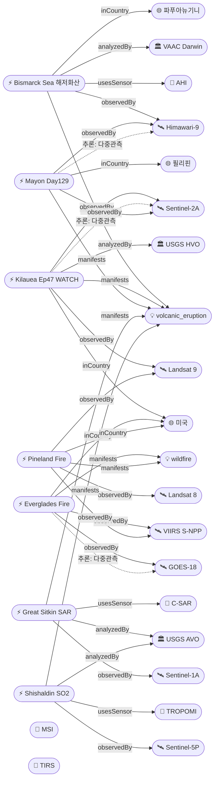

# 2026-05-13 위성영상 관측 이벤트 OSINT 일일 보고서

## 요약
금일은 **전 세계 7개 이상 화산이 동시에 위성 모니터링되는 이례적 화산 활동일**이다. **파푸아뉴기니 Bismarck Sea 해저 화산이 1972년 이후 54년 만에 분출을 재개**하여 Himawari-9가 화산재(FL130)와 해수 변색을 확인했다. **하와이 Kilauea는 ADVISORY→WATCH/ORANGE로 경보가 상향**되어 Episode 47 분수 분출이 수시간 내 개시될 전망이다. Mayon 화산은 129일째 스트롬볼리안 분출을 지속하고 있다. 다중 위성 교차검증 **4건**. 한반도 GeoFocus 금일 신규 없음.

## 오늘의 핵심 (Top 5)

| 순위 | 이벤트 | 도메인 | 위성 | 지역 | 신뢰도 |
|------|--------|--------|------|------|--------|
| 1 | Bismarck Sea 해저 화산 54년만 분출 | Disaster | Himawari-9 | Central Bismarck Sea, PG | 0.88 |
| 2 | Kilauea Ep47 WATCH/ORANGE 상향 | Disaster | Sentinel-2A + Landsat 9 | Hawaii, US | 0.92 |
| 3 | Mayon 화산 Day 129 스트롬볼리안 | Disaster | Himawari-9 + Sentinel-2A | Albay, PH | 0.92 |
| 4 | Florida Everglades 이탄화재 지속 | Disaster | GOES-18 + S-NPP VIIRS | Broward Co., FL, US | 0.90 |
| 5 | Great Sitkin SAR 용암류 WATCH | Disaster | Sentinel-1A (C-SAR) | Great Sitkin, AK, US | 0.85 |

## 다중 위성 교차검증 이벤트

1. **Kilauea 화산 (US)**: Sentinel-2A MSI (ESA) + Landsat 9 TIRS (USGS/NASA) — 분화구 열이상 다기관 관측
2. **Mayon 화산 (PH)**: Himawari-9 (JMA, 정지궤도) + Sentinel-2A (ESA, MSI 10m) — 독립 운영기관 교차
3. **Florida Everglades 산불 (US)**: GOES-18 ABI (NOAA, 정지궤도 열적외) + S-NPP VIIRS (NOAA/NASA, 극궤도 375m) — GEO+LEO 독립 궤도 유형 교차
4. **Georgia Pineland Road 산불 (US)**: S-NPP VIIRS + Landsat 8 + Landsat 9 — 3중 위성 검증

## 한반도 GeoFocus (KOMPSAT 우선 + 동·서·남해)

금일 한반도 관련 신규 이벤트 없음. 기존 추적 항목:
- **동해 NLL 중국 어선 100척** (5/4 최초 보고): 금일 신규 보도 없음
- **CAS500-2 커미셔닝**: 진행 중, 금일 신규 없음
- **영변 UEP / Sohae / Sinpo**: CSIS Beyond Parallel 금일 신규 분석 없음

## 자연재해 (Disaster)

### 1. Bismarck Sea 해저 화산 분출 — 1972년 이후 최초, Himawari-9 확인 (파푸아뉴기니) ★신규
- **출처:** [The Watchers](https://watchers.news/2026/05/13/rare-volcanic-ash-emission-detected-submarine-volcano-central-bismarck-sea-papua-new-guinea-may-2026/), [VolcanoDiscovery](https://www.volcanodiscovery.com/centralbismarcksea/news/302240/Central-Bismarck-Sea-Papua-New-Guinea-Volcano-Papua-New-Guinea-activity-update-May-12-2026-Eruption-.html)
- **위성·센서:** Himawari-9 (AHI, 정지궤도 다분광)
- **관측일:** 2026-05-12 04:30 UTC
- **위치:** Central Bismarck Sea, 파푸아뉴기니 (3.03°S, 147.78°E), 수심 1,300m
- **현상:** volcanic_eruption (submarine)
- **상태:** 신규
- **분석:** 5/8~12 사이 분출 개시, **54년 만의 재활동**. Darwin VAAC Advisory에서 화산재가 약 4km(FL130)까지 상승 보고. **Himawari-9 위성영상에서 화산재 기둥과 해수 변색이 동시 확인**됨. 기상 구름이 부분적으로 화산재를 가리고 있으나 모델 가이던스가 Advisory를 뒷받침. PNG 광물정책·지질재해관리부서 확인. officialBoost +0.15 적용.

### 2. Kilauea Ep47 분출 임박 — WATCH/ORANGE 상향 (미국, 하와이)
- **출처:** [Big Island Now](https://bigislandnow.com/2026/05/13/alert-level-raised-at-kilauea-as-eruptive-episode-is-imminent-hawaiian-volcano-observatory-reports/), [Hawaii News Now](https://www.hawaiinewsnow.com/2026/05/13/episode-47-kilauea-fountaining-expected-begin/), [Spectrum Local News](https://spectrumlocalnews.com/hi/hawaii/news/2026/05/12/kilauea-episode-47-)
- **위성·센서:** Sentinel-2A (MSI), Landsat 9 (TIRS)
- **관측일:** 2026-05-13
- **위치:** Kīlauea, Hawaii (19.41°N, 155.28°W)
- **현상:** volcanic_eruption
- **상태:** 업데이트 ← 2026-05-12 "Kilauea Ep47 5/12~14"
- **분석:** USGS HVO가 5/13 **경보 수준을 ADVISORY→WATCH, 항공색상 YELLOW→ORANGE로 상향**. Episode 47 분수 분출이 **"imminent"**로 판단되어 5/13~14 사이 개시 전망. 남측 분출구에서 **강한 지속적 발광·주기적 화염**, 북측에서 여러 소규모 스패터 분출 관측. 5/12 헬기 관측에서 양 분출구에 **얕은 수위 용암 연못** 확인. 가속된 전조 활동(오버플로우·활발한 스패터)이 분수 분출 직전에 예상됨. multiSatBoost +0.20 · officialBoost +0.15 적용.

### 3. Mayon 화산 Day 129 스트롬볼리안 — Alert Level 3 (필리핀)
- **출처:** [VolcanoDiscovery](https://www.volcanodiscovery.com/mayon/news/302249/Mayon-Philippines-Volcano-Philippines-activity-update-May-12-2026-Continuing-eruptionCite-this-Repor.html), [ReliefWeb](https://reliefweb.int/disaster/vo-2026-000065-phl)
- **위성·센서:** Himawari-9 (AHI, 정지궤도 IR), Sentinel-2A (MSI 10m)
- **관측일:** 2026-05-13
- **위치:** Albay, 필리핀 (13.26°N, 123.69°E)
- **현상:** volcanic_eruption
- **상태:** 업데이트 ← 2026-05-12 "Mayon Day 128+"
- **분석:** 129일째 연속 분출. 용암류 3방향(Basud/Bonga/Mi-isi) 지속. 용암 유출이 정상 분화구에서 계속되며, 지진 탐지된 화쇄류(PDC), 트레머, 화산 지진 활동 기록. 124개 바랑가이 화산재·용암류·PDC 영향. ~1,500가구 대피. Alert Level 3 유지. GLIDE VO-2026-000065-PHL 인도주의 등록 지속. multiSatBoost +0.20 적용.

### 4. Florida Everglades Max Road Fire — 11,339ac 70% 진화, 이탄층 화재 (미국, 플로리다)
- **출처:** [Fox Weather](https://www.foxweather.com/weather-news/everglades-wildfire-miami-metro-broward-county), [CBS Miami](https://www.cbsnews.com/miami/news/large-wildfire-in-western-broward-county-sends-smoke-toward-pembroke-pines-neighborhood/)
- **위성·센서:** GOES-18 (ABI, 정지궤도 열적외), S-NPP VIIRS (375m 극궤도)
- **관측일:** 2026-05-13
- **위치:** Broward County, FL, 미국 (26.0°N, 80.45°W)
- **현상:** wildfire
- **상태:** 업데이트 ← 2026-05-12 "Everglades 11,300ac 70%"
- **분석:** 11,339ac(4,589ha) 소손, 70% 진화. **100% 주 전역 가뭄으로 수위 30~60cm 하강**, 이탄층이 지표 하에서 고온 연소 지속. Pembroke Pines(인구 172,000) 대기질 영향. Miramar, Weston 연기 확산. I-75/US-27 시정 저하. multiSatBoost +0.20 · thermalBoost +0.10 적용.

### 5. Georgia Pineland Road 산불 — 32,575ac 90%, 번밴 해제 (미국, 조지아)
- **출처:** [Georgia Forestry Commission](https://gatrees.org/current-wildfire-information-and-resources/), [WALB](https://www.walb.com/2026/05/13/statewide-burn-ban-lifted-following-massive-wildfires-south-georgia-local-ordinances-still-effect/)
- **위성·센서:** S-NPP VIIRS (375m), Landsat 8/9 OLI+TIRS
- **관측일:** 2026-05-13
- **위치:** Clinch/Echols County, GA (31.5°N, 82.5°W)
- **현상:** wildfire
- **상태:** 업데이트 ← 2026-05-12 "Pineland ~90%"
- **분석:** 4/19 발화 이래 Day 25. 90% 진화. **GFC가 5/12 주 전역 번밴 해제** — 진화 마무리 단계. 158명 인력 + 47개 자원(엔진, 도저, 항공기) 배치. 100피트 깊이 잔불 정리(mop-up) 작업 진행. 용접 불꽃이 원인으로 확인. 이탄층 지하화재 여전히 잔존. multiSatBoost +0.20 · thermalBoost +0.10 적용(3중 위성).

### 6. Great Sitkin SAR 용암류·낙석 — WATCH/ORANGE (미국, 알래스카)
- **출처:** [USGS AVO](https://volcanoes.usgs.gov/hans-public/notice/DOI-USGS-AVO-2026-05-12T20:06:22+00:00)
- **위성·센서:** Sentinel-1A (C-SAR, C-band 합성개구레이다)
- **관측일:** 2026-05-13
- **위치:** Great Sitkin, AK (52.08°N, 176.13°W)
- **현상:** volcanic_eruption
- **상태:** 업데이트 ← 2026-05-12 "Great Sitkin SAR 용암류"
- **분석:** 정상 분화구 내 느린 용암 유출 지속. 지진 데이터에서 소규모 지진 + 성장하는 용암돔 낙석 기록. 구름으로 광학 불가 — **SAR 전천후 능력이 유일한 관측 수단**. 2021년 7월 이래 분화구 대부분 충전. sarBoost +0.10 · officialBoost +0.15 적용.

### 7. Shishaldin SO2·지진·인프라사운드 — ADVISORY/YELLOW (미국, 알래스카)
- **출처:** [USGS AVO](https://volcanoes.usgs.gov/hans-public/notice/DOI-USGS-AVO-2026-05-12T20:06:22+00:00)
- **위성·센서:** Sentinel-5P (TROPOMI, SO2)
- **관측일:** 2026-05-13
- **위치:** Shishaldin, AK (54.76°N, 163.97°W)
- **현상:** volcanic_eruption
- **상태:** 업데이트 ← 2026-05-12 "Shishaldin ADVISORY SO2"
- **분석:** 지진·인프라사운드 활동 상승 지속. SO2 배출이 위성 영상에서 관측. tracegasBoost +0.15 · officialBoost +0.15 적용.

## 인간활동 (Human Activity)

금일 신규 보도 없음. 기존 추적 항목:
- **Pemex Cantarell 원유 유출** (멕시코만, 3개월+ 지속): SAR 영상 슬릭 지속. 금일 신규 없음.
- **Amazon Xingu 금광 496,000ha**: PlanetScope/Sentinel-2 확인. 금일 신규 없음.
- **NISAR+Landsat 삼림벌채 조기탐지**: 금일 신규 없음.
- **GFW 열대우림 손실**: 금일 신규 없음.

## 기후·환경 (Climate & Environment)

금일 신규 이벤트 없음. 기존 추적:
- **북극 해빙 최대면적 역대 최저 타이 14.29M km²** (ICESat-2): 금일 신규 없음
- **Hektoria Glacier 8km 후퇴** (AQ, Sentinel-1/2): 금일 신규 없음
- **MethaneSAT 글로벌 평가**: 금일 신규 없음
- **Sentinel-2A/2C nominal**: 데이터 생산 정상 운영

## 농업·해양 (Agriculture & Maritime)

금일 신규 이벤트 없음. 기존 추적:
- **동해 NLL 중국 어선 100척** (5/4): 금일 신규 없음
- **CAS500-2 커미셔닝**: 진행 중, 금일 신규 없음
- **NASA EO Mid-Atlantic 식물플랑크톤**: 금일 신규 없음

## 국방·안보 (Defense — OSINT 한정)

금일 신규 이벤트 없음. 기존 추적:
- **이라크 Al-Anbar 이스라엘 비밀 군사기지** (PlanetScope+WV-3, 5/12): 금일 신규 없음
- **Antelope Reef 1,490ac** (Sentinel-2A+WV-3): 금일 신규 없음
- **CSIS Beyond Parallel — 영변/소해/신포**: 금일 신규 없음
- **필리핀 스프래틀리 2개 섬 건설**: 금일 신규 없음

## 인도주의 (Humanitarian)

금일 신규 이벤트 없음. 기존 추적:
- **Mayon GLIDE VO-2026-000065-PHL**: 인도주의 대응 지속, ~1,500가구 대피
- **우크라이나 오데사 Grande Pettine 호텔 피격** (Maxar 5/12): 금일 신규 없음

## 센서·플랫폼별 묶음

- **Sentinel-1A (SAR):** Great Sitkin 용암류 — 구름 투과 유일 관측 수단
- **Sentinel-2A (광학):** Kilauea 분화구 열이상, Mayon 용암류 매핑
- **Sentinel-5P (TROPOMI):** Shishaldin SO2 배출, Kupreanof SO2 (기존 추적)
- **Landsat 8/9:** Kilauea TIRS 열이상, Pineland OLI+TIRS 소손 범위
- **GOES-18 (ABI):** Everglades 열점 실시간 모니터링
- **S-NPP VIIRS:** Everglades 열점, Pineland 소손
- **Himawari-9 (AHI):** **Bismarck Sea 해저 화산 화산재+해수 변색 검출**, Mayon 정지궤도 IR
- **KOMPSAT-3A / 5 / CAS500-1:** 금일 관련 이벤트 없음

## 전후 비교(before/after) 영상 보유 이벤트

금일 신규 before/after 영상 보유 항목 없음.

## 미검증 의혹

| 이벤트 | 출처 | 사유 |
|--------|------|------|
| Fuego 화산 분출 지속 (과테말라) | [VolcanoDiscovery](https://www.volcanodiscovery.com/fuego/news/301927/Fuego-Guatemala-Volcano-Guatemala-activity-update-May-8-2026-Continuing-eruptionCite-this-Report.html) | 위성 출처 미확인 — INSIVUMEH 지상 보고만 존재. 후속 위성 검증 대기. 신뢰도 0.72. |

## 지식그래프

### 오늘의 주요 관계
- **신규 노드:** ent-evt-701 (Bismarck Sea 해저 화산), ent-loc-065 (Central Bismarck Sea)
- **핵심 변동:** ent-evt-202 (Kilauea) ADVISORY→WATCH 경보 상향
- **다중 위성 교차검증 4건** 유지 (Kilauea, Mayon, Everglades, Pineland)
- 전 세계 7+ 화산 동시 위성 모니터링 이례적 상황

### 전체 지식그래프 시각화

## 온톨로지 변경

| 변경 유형 | 대상 | 근거 |
|----------|------|------|
| 신규 Location | ent-loc-065 Central Bismarck Sea (PG, -3.03/147.78) | 해저 화산 분출 위치, 수심 1,300m |
| 신규 Event | ent-evt-701 Bismarck Sea 해저 화산 분출 | 1972년 이후 54년 만의 재활동, Himawari-9 확인 |
| 스키마 변경 | 없음 | 기존 volcanic_eruption으로 충분히 분류 |

## 추론 결과

| 추론 | 신뢰도 | 근거 |
|------|--------|------|
| evt-202 multi_satellite_confirmation | 0.92 | Sentinel-2A (ESA) + Landsat 9 (USGS/NASA) |
| evt-082 multi_satellite_confirmation | 0.92 | Himawari-9 (JMA) + Sentinel-2A (ESA) |
| evt-501 multi_satellite_confirmation | 0.90 | GOES-18 (NOAA GEO) + VIIRS (NOAA/NASA LEO) |
| temp-001 multi_satellite_confirmation | 0.85 | VIIRS + Landsat 8 + Landsat 9 (3중) |
| evt-203 sarBoost | 0.85 | Sentinel-1A C-SAR 구름 투과 유일 관측 |
| evt-204 tracegasBoost | 0.78 | TROPOMI SO2 배출 관측 |
| evt-501 thermalBoost | 0.90 | GOES ABI + VIIRS 열적외 산불 검출 |
| evt-701 officialBoost | 0.85 | VAAC Darwin (weather_agency) |

## 분석 및 평가

금일은 **화산 활동이 전 세계적으로 매우 활발한 날**이다. 동시에 위성으로 모니터링되는 화산이 7개 이상(Bismarck Sea, Kilauea, Mayon, Great Sitkin, Shishaldin, Kupreanof, Ibu)에 달하며, 이 중 Bismarck Sea는 54년 만의 해저 화산 재활동이라는 점에서 지질학적으로 주목할 만하다.

**Kilauea Ep47 상황이 핵심 관전 포인트**다. HVO가 "imminent"로 판단하고 WATCH/ORANGE로 상향한 것은 분수 분출이 수시간~1일 이내에 시작될 수 있음을 의미한다. 양 분출구의 얕은 용암 연못과 강한 발광은 마그마 공급이 활발함을 시사한다.

산불 2건(Everglades/Pineland)은 모두 진화 마무리 단계에 접어들었으나, **이탄층 지하화재**가 공통적으로 남아 있어 완전 소화까지 시간이 소요될 전망이다. Georgia GFC의 번밴 해제(5/12)는 지상 진화가 안정화 단계임을 보여준다.

인간활동·기후·농업·국방·인도주의 도메인에서는 금일 신규 이벤트 없이 기존 추적만 유지된다. 한반도 GeoFocus도 금일 해당 없음.

## 추적 항목

| 항목 | 최초 보고 | 상태 | 최신 업데이트 |
|------|----------|------|-------------|
| Kilauea Ep47 | 2026-05-07 | WATCH/ORANGE | 5/13 경보 상향, 분출 임박 |
| Mayon 화산 | 2026-01-05 | Alert Level 3 | 5/13 Day 129 |
| Bismarck Sea 해저 화산 | 2026-05-13 | 분출 중 | 5/13 FL130 화산재 |
| Everglades Max Road Fire | 2026-05-11 | 70% 진화 | 5/13 11,339ac |
| Pineland Road Fire | 2026-05-05 | 90% 진화 | 5/13 번밴 해제 |
| Great Sitkin | 2026-05-07 | WATCH | 5/13 SAR 용암류 |
| Shishaldin | 2026-05-07 | ADVISORY | 5/13 SO2 지속 |
| Kupreanof | 2026-05-12 | ADVISORY | 5/13 지속 |
| Ibu | 2026-05-11 | 분출 중 | 5/13 VAAC 지속 |
| Pemex 원유 유출 | 2026-05-07 | 활성 | 금일 신규 없음 |
| Antelope Reef | 2026-05-06 | 건설 중 | 금일 신규 없음 |
| 이라크 이스라엘 기지 | 2026-05-12 | 공개됨 | 금일 신규 없음 |
| 동해 NLL 어선 | 2026-05-04 | 추적 중 | 금일 신규 없음 |
| 북극 해빙 최저 | 2026-05-11 | 보고됨 | 금일 신규 없음 |

## 출처 목록
1. [Rare volcanic ash emission detected from submarine volcano in Central Bismarck Sea, Papua New Guinea](https://watchers.news/2026/05/13/rare-volcanic-ash-emission-detected-submarine-volcano-central-bismarck-sea-papua-new-guinea-may-2026/) - The Watchers, 2026-05-13
2. [Alert level raised at Kīlauea as eruptive episode is imminent](https://bigislandnow.com/2026/05/13/alert-level-raised-at-kilauea-as-eruptive-episode-is-imminent-hawaiian-volcano-observatory-reports/) - Big Island Now, 2026-05-13
3. [Episode 47 of Kilauea fountaining expected to begin](https://www.hawaiinewsnow.com/2026/05/13/episode-47-kilauea-fountaining-expected-begin/) - Hawaii News Now, 2026-05-13
4. [Kilauea Episode 47 imminent](https://spectrumlocalnews.com/hi/hawaii/news/2026/05/12/kilauea-episode-47-) - Spectrum Local News, 2026-05-12
5. [Mayon Volcano activity update May 12, 2026](https://www.volcanodiscovery.com/mayon/news/302249/Mayon-Philippines-Volcano-Philippines-activity-update-May-12-2026-Continuing-eruptionCite-this-Repor.html) - VolcanoDiscovery, 2026-05-12
6. [Philippines: Mayon Volcano - May 2026](https://reliefweb.int/disaster/vo-2026-000065-phl) - ReliefWeb
7. [Central Bismarck Sea eruption onset](https://www.volcanodiscovery.com/centralbismarcksea/news/302240/Central-Bismarck-Sea-Papua-New-Guinea-Volcano-Papua-New-Guinea-activity-update-May-12-2026-Eruption-.html) - VolcanoDiscovery, 2026-05-12
8. [Everglades wildfire scorches over 11,000 acres](https://www.foxweather.com/weather-news/everglades-wildfire-miami-metro-broward-county) - Fox Weather, 2026-05-13
9. [Broward wildfire rages in Everglades](https://www.cbsnews.com/miami/news/large-wildfire-in-western-broward-county-sends-smoke-toward-pembroke-pines-neighborhood/) - CBS Miami, 2026-05-13
10. [Georgia burn ban lifted](https://www.walb.com/2026/05/13/statewide-burn-ban-lifted-following-massive-wildfires-south-georgia-local-ordinances-still-effect/) - WALB, 2026-05-13
11. [Georgia Forestry Commission](https://gatrees.org/current-wildfire-information-and-resources/) - GFC, 2026-05-13
12. [USGS AVO Volcano Notices May 12](https://volcanoes.usgs.gov/hans-public/notice/DOI-USGS-AVO-2026-05-12T20:06:22+00:00) - USGS AVO, 2026-05-12
13. [South Florida wildfire tops 11,000 acres](https://cbs12.com/news/local/photo-gallery-south-florida-wildfire-tops-11000-acres-crews-battle-blazes-in-broward-miami-dade-counties-blaze-fire-inferno-firefighters-battling-smoke-traffic-delays-poor-visibility-respiratory-traffic-delay-poor-visibility-pembroke-pines-fire-rescue) - CBS 12, 2026-05-13
14. [Pemex-linked Gulf oil spill still spreading](https://www.tpr.org/environment/2026-05-07/pemex-linked-gulf-oil-spill-may-still-be-spreading-three-months-later-satellite-images-suggest) - TPR, 2026-05-07
