# 2026-05-14 위성영상 관측 이벤트 OSINT 일일 보고서

## 요약
**하와이 Kilauea 화산이 Episode 47 전조 오버플로우를 5/14 02:57 HST에 시작**하여 분수 분출이 수시간 내 예상된다. 전 세계 **8개 이상 화산이 동시에 위성 모니터링**되는 이례적 상황이 Bezymianny(캄차카) 추가로 더욱 심화되었다. **Bellingcat이 PlanetScope 위성영상으로 남레바논 IDF 대규모 마을 파괴를 문서화**하여 인도주의 도메인에 중요한 위성 OSINT가 추가되었다. **Harvard 팀이 TROPOMI+GOSAT 융합 데이터로 글로벌 메탄 2019-2024 증가 원인을 최초 분석**했다. 다중 위성 교차검증 **5건**(전일 대비 +1). 한반도 GeoFocus 금일 신규 없음.

## 오늘의 핵심 (Top 5)

| 순위 | 이벤트 | 도메인 | 위성 | 지역 | 신뢰도 |
|------|--------|--------|------|------|--------|
| 1 | Kilauea Ep47 전조 오버플로우 6회 | Disaster | Sentinel-2A + Landsat 9 | Hawaii, US | 0.95 |
| 2 | Bezymianny FL150 VAAC advisory | Disaster | Himawari-9 + VIIRS | Kamchatka, RU | 0.85 |
| 3 | Bellingcat 남레바논 PlanetScope 마을 파괴 | Humanitarian | PlanetScope | Southern Lebanon, LB | 0.88 |
| 4 | Bismarck Sea 해저화산 VAAC #11 지속 | Disaster | Himawari-9 | Central Bismarck Sea, PG | 0.88 |
| 5 | Harvard TROPOMI+GOSAT 글로벌 메탄 분석 | Climate | Sentinel-5P TROPOMI | Global | 0.85 |

## 다중 위성 교차검증 이벤트

1. **Kilauea 화산 (US)**: Sentinel-2A MSI (ESA) + Landsat 9 TIRS (USGS/NASA) — 분화구 열이상 다기관 관측
2. **Mayon 화산 (PH)**: Himawari-9 (JMA, 정지궤도) + Sentinel-2A (ESA, MSI 10m) — 독립 운영기관 교차
3. **Florida Everglades 산불 (US)**: GOES-18 ABI (NOAA, GEO) + S-NPP VIIRS (NOAA/NASA, LEO) — GEO+LEO 교차
4. **Georgia Pineland Road 산불 (US)**: S-NPP VIIRS + Landsat 8 + Landsat 9 — 3중 위성
5. **Bezymianny 화산 (RU)**: Himawari-9 (JMA) + S-NPP VIIRS (NOAA/NASA) — 정지궤도+극궤도 교차 ★신규

## 한반도 GeoFocus (KOMPSAT 우선 + 동·서·남해)

금일 한반도 관련 신규 이벤트 없음. 기존 추적 항목:
- **동해 NLL 중국 어선 100척** (5/4 최초 보고): 금일 신규 보도 없음
- **CAS500-2 커미셔닝**: 진행 중, 금일 신규 없음
- **영변 UEP / Sohae / Sinpo**: CSIS Beyond Parallel 금일 신규 분석 없음

## 자연재해 (Disaster)

### 1. Kilauea Ep47 전조 오버플로우 — WATCH/ORANGE, 분수 분출 수시간 내 (미국, 하와이) ★핵심 업데이트
- **출처:** [Big Island Video News](https://www.bigislandvideonews.com/2026/05/14/kilauea-volcano-eruption-update-for-thursday-may-14/), [USGS HVO](https://www.usgs.gov/volcanoes/kilauea/volcano-updates)
- **위성·센서:** Sentinel-2A (MSI), Landsat 9 (TIRS)
- **관측일:** 2026-05-14
- **위치:** Kīlauea, Hawaii (19.41°N, 155.28°W)
- **현상:** volcanic_eruption
- **상태:** 업데이트 ← 2026-05-13 "Kilauea WATCH/ORANGE"
- **분석:** 5/14 **02:57 AM HST에 Halemaʻumaʻu 남측 분출구에서 전조 오버플로우 시작**. 07:00 HST까지 **6회 연속 오버플로우**, 각 20~30분 지속. 북측 분출구에서는 발광·간헐적 스패터링 관측. Uēkahuna 경사계가 **15.4μrad 인플레이션** 기록 — Episode 46 종료 이래 최대. **분수 분출이 5/14 중 언제든 시작될 수 있으나**, 전조 활동(오버플로우·활발한 스패터)이 수시간 이상 지속될 수도 있음. 무역풍이 테프라를 남남서로 이동시킬 전망. multiSatBoost +0.20 · officialBoost +0.15 적용.

### 2. Bezymianny 화산 VAAC advisory — FL150 (4600m) 화산재, 캄차카 (러시아) ★신규
- **출처:** [VolcanoDiscovery / VAAC Tokyo](https://www.volcanodiscovery.com/bezymianny/news/302303/vaac-advisory-2026-1.html)
- **위성·센서:** Himawari-9 (AHI, 정지궤도), S-NPP VIIRS (극궤도)
- **관측일:** 2026-05-13 20:00Z
- **위치:** Bezymianny, Kamchatka, Russia (55.97°N, 160.59°E)
- **현상:** volcanic_eruption
- **상태:** 신규
- **분석:** VAAC Tokyo가 5/13 Bezymianny 폭발적 분출 advisory 발행. **화산재 FL150(4600m)까지 상승, SW 방향 25kts 이동**. Klyuchevskoy 화산군(Bezymianny/Klyuchevskoy/Krasheninnikov)에서 **동시다발 화산활동** 지속 — Krasheninnikov은 2025.8월 이래 분출 중. 인접하나 **별도 마그마 시스템**으로 판단. KVERT 모니터링 중. multiSatBoost +0.20 · officialBoost +0.15 적용.

### 3. Bismarck Sea 해저화산 VAAC #11 — FL140 지속 (파푸아뉴기니)
- **출처:** [VolcanoDiscovery / VAAC Darwin](https://www.volcanodiscovery.com/centralbismarcksea/news/302361/vaac-advisory-2026-11.html), [GVP Smithsonian](https://volcano.si.edu/showreport.cfm?gvpvar=GVP.DVAR20260512-250030)
- **위성·센서:** Himawari-9 (AHI)
- **관측일:** 2026-05-14 10:20Z
- **위치:** Central Bismarck Sea, 파푸아뉴기니 (3.03°S, 147.78°E), 수심 1,300m
- **현상:** volcanic_eruption (submarine)
- **상태:** 업데이트 ← 2026-05-13 "Bismarck Sea FL130"
- **분석:** 11번째 VAAC advisory 발행. FL140(4300m)으로 소폭 상승(전일 FL130 → FL140). **분출 1주+ 지속(5/8 개시)**. 54년 만의 재활동 확인. GVP Smithsonian이 5/12 정식 Activity Report 발행 — 위성영상에서 수심 1,300m 분출 중심부로부터 **9km×11km 퇴적물 플룸 및 해수 변색** 확인. officialBoost +0.15 적용.

### 4. Mayon 화산 Day 130 — Alert Level 3, VAAC 594 (필리핀)
- **출처:** [VolcanoDiscovery](https://www.volcanodiscovery.com/mayon/news/302104/vaac-advisory-2026-594.html), [ReliefWeb](https://reliefweb.int/disaster/vo-2026-000065-phl)
- **위성·센서:** Himawari-9 (AHI), Sentinel-2A (MSI)
- **관측일:** 2026-05-14
- **위치:** Albay, 필리핀 (13.26°N, 123.69°E)
- **현상:** volcanic_eruption
- **상태:** 업데이트 ← 2026-05-13 "Mayon Day 129"
- **분석:** 130일째 연속 분출. 스트롬볼리안 지속. 용암류 Basud(3.8km)/Bonga(3.2km)/Mi-isi(1.6km) 3방향. Alert Level 3. GLIDE VO-2026-000065-PHL 인도주의 등록 지속. multiSatBoost +0.20 적용.

### 5. Florida Everglades Max Road Fire — 이탄층 지하화재 지속 (미국, 플로리다)
- **출처:** [ABC17 News](https://abc17news.com/weather/insider-blog/2026/05/12/why-the-everglades-is-burning-from-the-inside-out/), [Fox Weather](https://www.foxweather.com/weather-news/everglades-wildfire-miami-metro-broward-county)
- **위성·센서:** GOES-18 (ABI, 열적외), S-NPP VIIRS (375m)
- **관측일:** 2026-05-14
- **위치:** Broward County, FL (26.0°N, 80.45°W)
- **현상:** wildfire
- **상태:** 업데이트 ← 2026-05-13 "Everglades 11,339ac 70%"
- **분석:** 11,339ac(4,589ha) 소손 지속. **100% 주 전역 가뭄으로 수위 30~60cm 하강** — 이탄층(peat)이 지하에서 고온 연소 지속("burning from the inside out"). 이탄은 수천 년에 걸쳐 축적된 유기물로, 한번 점화되면 소화가 극히 어렵. Pembroke Pines(인구 172,000) 대기질 영향 지속. multiSatBoost +0.20 · thermalBoost +0.10 적용.

### 6. Georgia Pineland Road Fire — mop-up 단계 진입 (미국, 조지아)
- **출처:** [WALB](https://www.walb.com/2026/05/14/wildfire-crews-move-into-mop-up-operations-fire-containment-improves/), [GFC](https://gatrees.org/current-wildfire-information-and-resources/)
- **위성·센서:** S-NPP VIIRS, Landsat 8/9 (OLI+TIRS)
- **관측일:** 2026-05-14
- **위치:** Clinch/Echols County, GA (31.5°N, 82.5°W)
- **현상:** wildfire
- **상태:** 업데이트 ← 2026-05-13 "Pineland 90%"
- **분석:** Day 26. **진화율 90%+. GFC가 공식 mop-up(잔불정리) 작전 단계 진입** 선언. 158명 + 47자원 배치. 100피트 깊이 잔불 정리 진행. 27주택 + 2상업시설 + 35소형구조물 피해 확정. multiSatBoost +0.20 적용(3중 위성).

### 7. Great Sitkin — WATCH/ORANGE, SAR 유일 관측 (미국, 알래스카)
- **출처:** [USGS AVO](https://volcanoes.usgs.gov/hans-public/notice/DOI-USGS-AVO-2026-05-14T18:55:17+00:00)
- **위성·센서:** Sentinel-1A (C-SAR)
- **관측일:** 2026-05-14
- **위치:** Great Sitkin, AK (52.08°N, 176.13°W)
- **현상:** volcanic_eruption
- **상태:** 업데이트 ← 2026-05-13 "Great Sitkin SAR"
- **분석:** 정상 분화구 내 느린 용암 유출 지속. **구름으로 광학·웹캠 불가** — Sentinel-1A C-SAR가 유일한 관측 수단. sarBoost +0.10 · officialBoost +0.15 적용.

### 8. Shishaldin — ADVISORY/YELLOW, SO2 지속 (미국, 알래스카)
- **출처:** [USGS AVO](https://volcanoes.usgs.gov/hans-public/notice/DOI-USGS-AVO-2026-05-14T18:55:17+00:00)
- **위성·센서:** Sentinel-5P (TROPOMI, SO2)
- **관측일:** 2026-05-14
- **위치:** Shishaldin, AK (54.76°N, 163.97°W)
- **현상:** volcanic_eruption
- **상태:** 업데이트 ← 2026-05-13 "Shishaldin SO2"
- **분석:** 지진·인프라사운드 상승 지속. **SO2·수증기 배출 위성+웹캠 관측**. tracegasBoost +0.15 · officialBoost +0.15 적용.

## 인간활동 (Human Activity)

### Pemex Cantarell 원유 유출 — 잔류 오염 단계 전이 (멕시코)
- **출처:** [SpillControl](https://spillcontrol.org/2026/05/13/pemex-linked-oil-spill-may-still-be-spreading-according-to-satellite-images/), [TPR](https://www.tpr.org/environment/2026-05-07/pemex-linked-gulf-oil-spill-may-still-be-spreading-three-months-later-satellite-images-suggest)
- **위성·센서:** Sentinel-1A (C-SAR), Sentinel-2A (MSI)
- **위치:** Cantarell, Gulf of Mexico (19.8°N, 92.4°W)
- **상태:** 업데이트 ← 2026-05-13 "Pemex SAR 지속"
- **분석:** SpillControl이 5/13 재보도. 전 Pemex 직원 보고서에 따르면 **"massive surface spill에서 persistent and dispersed residual contamination으로 진화"**. 630km+ 해안선 오염(Veracruz, Tabasco, Tamaulipas). Sentinel-1 SAR + Sentinel-2 광학 교차검증. 2026.2월 발생 이래 3개월+ 지속.

기존 추적 (금일 신규 없음):
- **Amazon Xingu 금광 496,000ha**: PlanetScope/Sentinel-2 확인
- **NISAR+Landsat 삼림벌채 조기탐지**: NASA EO 피처
- **GFW 열대우림 손실**: 글로벌 추적

## 기후·환경 (Climate & Environment)

### Harvard TROPOMI+GOSAT 글로벌 메탄 2019-2024 증가 원인 분석 ★신규
- **출처:** [C&EN](https://cen.acs.org/environment/atmospheric-chemistry/Satellite-data-reveal-rising-methane/104/web/2026/04), [Phys.org](https://phys.org/news/2026-04-blended-satellite-reveal-drove-methane.html)
- **위성·센서:** Sentinel-5P (TROPOMI) + GOSAT (JAXA)
- **관측일:** 2019-2024 시계열
- **위치:** 글로벌
- **현상:** methane_plume
- **상태:** 신규
- **분석:** Harvard 팀이 **TROPOMI(일일 전구 메탄) + GOSAT(정밀 보정)을 머신러닝으로 융합**하여 2019-2024 메탄 증가 원인을 분석. 핵심 결론:
  - **관성(momentum)이 증가의 59%** — 2019년 이미 배출이 대기 분해를 초과, 아무것도 변하지 않아도 농도 상승
  - 축산 +15%, 폐기물 +11% (증가 요인)
  - 석유·가스 -9%, 벼 -17% (감소 요인)
  - 도시 메탄 배출은 공식 추정치 대비 **2.7~5.9배 과소추정**(PNAS April 2026 별도 연구)
- tracegasBoost +0.15 적용.

기존 추적 (금일 신규 없음):
- **북극 해빙 최대면적 역대 최저 타이 14.29M km²** (ICESat-2)
- **Hektoria Glacier 8km 후퇴** (AQ, Sentinel-1/2)
- **MethaneSAT 글로벌 평가**: Permian Basin 등

## 농업·해양 (Agriculture & Maritime)

금일 신규 이벤트 없음. 기존 추적:
- **동해 NLL 중국 어선 100척** (5/4): 금일 신규 없음
- **CAS500-2 커미셔닝**: 진행 중, 금일 신규 없음
- **NASA EO Mid-Atlantic 식물플랑크톤**: 금일 신규 없음

## 국방·안보 (Defense — OSINT 한정)

금일 신규 이벤트 없음. 기존 추적:
- **이라크 Al-Anbar 이스라엘 비밀 군사기지** (PlanetScope+WV-3, 5/12): 금일 신규 없음
- **Antelope Reef 1,490ac** (AMTI/CSIS 분석, Sentinel-2A+WV-3): 금일 신규 없음
- **CSIS Beyond Parallel — 영변/소해/신포**: 금일 신규 분석 없음
- **필리핀 스프래틀리 2개 섬 건설** (Planet Labs 확인): 금일 신규 없음

## 인도주의 (Humanitarian)

### Bellingcat: 남레바논 IDF 대규모 마을 파괴 — PlanetScope before/after ★신규
- **출처:** [Bellingcat](https://www.bellingcat.com/news/2026/05/14/satellite-imagery-shows-ongoing-demolitions-across-southern-lebanon/)
- **위성·센서:** PlanetScope (Doves, 3m)
- **관측일:** 2026-03-02 vs 2026-05-08 비교
- **위치:** Southern Lebanon (33.12°N, 35.43°E 일대, Qantara·Aadshit 등)
- **현상:** infrastructure_damage
- **상태:** 신규
- **분석:** Bellingcat이 5/14 발행한 조사에서 **PlanetScope 위성영상(3/2 및 5/8)을 비교하여 IDF "Yellow Line" 내 수십 개 마을에서 대규모 철거·파괴를 확인**. 2026.3~5월 약 2개월간의 파괴 진행 기록. **before/after 비교 영상 포함** — 남레바논 전역에 대한 가장 포괄적 위성 기반 파괴 문서화. analystBoost +0.10 · baCredibilityBoost +0.10 적용.

기존 추적:
- **Mayon GLIDE VO-2026-000065-PHL**: 인도주의 대응 지속, ~1,500가구 대피
- **우크라이나 오데사 Grande Pettine 호텔 피격** (Maxar 5/12): 금일 신규 없음

## 센서·플랫폼별 묶음

- **Sentinel-1A (SAR):** Great Sitkin 용암류 — 구름 투과 유일 관측 수단, Pemex SAR 슬릭
- **Sentinel-2A (광학):** Kilauea 분화구 열이상, Mayon 용암류 매핑, Pemex 광학
- **Sentinel-5P (TROPOMI):** Shishaldin SO2, Harvard 글로벌 메탄 연구, 도시 메탄 연구
- **Landsat 8/9:** Kilauea TIRS 열이상, Pineland OLI+TIRS 소손
- **GOES-18 (ABI):** Everglades 열점 실시간 모니터링
- **S-NPP VIIRS:** Everglades 열점, Pineland 소손, Bezymianny 감지
- **Himawari-9 (AHI):** Bismarck Sea 해저 화산, Bezymianny FL150, Mayon 정지궤도 IR
- **PlanetScope:** Bellingcat 남레바논 before/after
- **KOMPSAT-3A / 5 / CAS500-1:** 금일 관련 이벤트 없음

## 전후 비교(before/after) 영상 보유 이벤트

| 이벤트 | 위성 | before | after | 출처 |
|--------|------|--------|-------|------|
| 남레바논 IDF 마을 파괴 | PlanetScope | 2026-03-02 | 2026-05-08 | [Bellingcat](https://www.bellingcat.com/news/2026/05/14/satellite-imagery-shows-ongoing-demolitions-across-southern-lebanon/) |

## 미검증 의혹

| 이벤트 | 출처 | 사유 |
|--------|------|------|
| Fuego 화산 분출 지속 (과테말라) | [VolcanoDiscovery](https://www.volcanodiscovery.com/fuego/news/301927/Fuego-Guatemala-Volcano-Guatemala-activity-update-May-8-2026-Continuing-eruptionCite-this-Report.html) | 위성 출처 미확인 — INSIVUMEH 지상 보고만 존재. 신뢰도 0.72. |

## 지식그래프

### 오늘의 주요 관계
- **신규 노드 3건:** ent-evt-801 (Bezymianny), ent-evt-802 (남레바논 PlanetScope), ent-evt-803 (글로벌 메탄 연구)
- **신규 Location:** ent-loc-066 (Bezymianny, Kamchatka)
- **핵심 변동:** ent-evt-202 (Kilauea) 전조 오버플로우 개시 — 분수 분출 임박
- **다중 위성 교차검증 5건** (+1 Bezymianny)
- 전 세계 **8+ 화산 동시 위성 모니터링** 이례적 상황 지속

### 전체 지식그래프 시각화

```mermaid
graph LR
    evt202(["⚡ Kilauea Ep47 오버플로우"])
    evt801(["⚡ Bezymianny FL150"])
    evt802(["⚡ 남레바논 파괴"])
    evt701(["⚡ Bismarck Sea 해저화산"])
    evt803(["⚡ 글로벌 메탄 연구"])
    evt082(["⚡ Mayon Day130"])
    evt501(["⚡ Everglades Fire"])
    evt001(["⚡ Pineland Fire"])
    evt203(["⚡ Great Sitkin SAR"])
    evt204(["⚡ Shishaldin SO2"])

    s2a(["🛰 Sentinel-2A"])
    l9(["🛰 Landsat 9"])
    himawari(["🛰 Himawari-9"])
    goes(["🛰 GOES-18"])
    viirs(["🛰 VIIRS S-NPP"])
    s1a(["🛰 Sentinel-1A"])
    s5p(["🛰 Sentinel-5P"])
    l8(["🛰 Landsat 8"])
    planet(["🛰 PlanetScope"])

    msi(["📡 MSI"])
    tirs(["📡 TIRS"])
    ahi(["📡 AHI"])
    csar(["📡 C-SAR"])
    tropomi(["📡 TROPOMI"])

    hvo(["🏛 USGS HVO"])
    avo(["🏛 USGS AVO"])
    kvert(["🏛 KVERT"])
    bellingcat(["🏛 Bellingcat"])

    cous(["🌐 미국"])
    coru(["🌐 러시아"])
    colb(["🌐 레바논"])
    copg(["🌐 PNG"])
    coph(["🌐 필리핀"])

    volcano(["💡 volcanic_eruption"])
    wildfire(["💡 wildfire"])
    infra(["💡 infrastructure_damage"])
    methane(["💡 methane_plume"])

    evt202 -->|observedBy| s2a
    evt202 -->|observedBy| l9
    evt202 -->|analyzedBy| hvo
    evt202 -->|inCountry| cous
    evt202 -->|manifests| volcano
    evt202 -.->|다중관측| s2a

    evt801 -->|observedBy| himawari
    evt801 -->|observedBy| viirs
    evt801 -->|analyzedBy| kvert
    evt801 -->|inCountry| coru
    evt801 -->|manifests| volcano
    evt801 -.->|다중관측| himawari

    evt802 -->|observedBy| planet
    evt802 -->|analyzedBy| bellingcat
    evt802 -->|inCountry| colb
    evt802 -->|manifests| infra
    evt802 -.->|before/after| planet

    evt701 -->|observedBy| himawari
    evt701 -->|usesSensor| ahi
    evt701 -->|inCountry| copg
    evt701 -->|manifests| volcano

    evt803 -->|observedBy| s5p
    evt803 -->|usesSensor| tropomi
    evt803 -->|manifests| methane

    evt082 -->|observedBy| himawari
    evt082 -->|observedBy| s2a
    evt082 -->|inCountry| coph
    evt082 -->|manifests| volcano
    evt082 -.->|다중관측| himawari

    evt501 -->|observedBy| goes
    evt501 -->|observedBy| viirs
    evt501 -->|inCountry| cous
    evt501 -->|manifests| wildfire
    evt501 -.->|다중관측| goes

    evt001 -->|observedBy| viirs
    evt001 -->|observedBy| l8
    evt001 -->|observedBy| l9
    evt001 -->|inCountry| cous
    evt001 -->|manifests| wildfire

    evt203 -->|observedBy| s1a
    evt203 -->|usesSensor| csar
    evt203 -->|analyzedBy| avo
    evt203 -->|manifests| volcano

    evt204 -->|observedBy| s5p
    evt204 -->|usesSensor| tropomi
    evt204 -->|analyzedBy| avo
    evt204 -->|manifests| volcano
```

## 온톨로지 변경

| 변경 유형 | 대상 | 근거 |
|----------|------|------|
| 신규 Location | ent-loc-066 Bezymianny Kamchatka (RU, 55.97/160.59) | VAAC Tokyo FL150 advisory |
| 신규 Event | ent-evt-801 Bezymianny FL150 | 캄차카 Klyuchevskoy군 폭발적 분출, Himawari-9+VIIRS |
| 신규 Event | ent-evt-802 남레바논 IDF 마을 파괴 | Bellingcat PlanetScope before/after |
| 신규 Event | ent-evt-803 글로벌 메탄 2019-2024 분석 | Harvard TROPOMI+GOSAT 융합 |
| 스키마 변경 | 없음 | 기존 클래스로 충분히 분류 |

## 추론 결과

| 추론 | 신뢰도 | 근거 |
|------|--------|------|
| evt-202 multi_satellite_confirmation | 0.95 | Sentinel-2A (ESA) + Landsat 9 (USGS/NASA) |
| evt-082 multi_satellite_confirmation | 0.92 | Himawari-9 (JMA) + Sentinel-2A (ESA) |
| evt-501 multi_satellite_confirmation | 0.90 | GOES-18 (NOAA GEO) + VIIRS (NOAA/NASA LEO) |
| temp-001 multi_satellite_confirmation | 0.85 | VIIRS + Landsat 8 + Landsat 9 (3중) |
| evt-801 multi_satellite_confirmation | 0.85 | Himawari-9 (JMA) + VIIRS (NOAA/NASA) ★신규 |
| evt-203 sarBoost | 0.85 | Sentinel-1A C-SAR 구름 투과 유일 관측 |
| evt-204 tracegasBoost | 0.78 | TROPOMI SO2 배출 관측 |
| evt-803 tracegasBoost | 0.85 | TROPOMI 글로벌 메탄 연구 |
| evt-802 baCredibilityBoost | 0.88 | PlanetScope before/after (3/2 vs 5/8) |
| evt-202 officialBoost | 0.95 | USGS HVO (space_agency) |
| evt-801 officialBoost | 0.85 | KVERT + VAAC Tokyo |
| evt-701 officialBoost | 0.88 | VAAC Darwin (weather_agency) |

## 분석 및 평가

금일 가장 주목할 점은 **Kilauea Episode 47 전조 오버플로우 시작**이다. 남측 분출구에서 6회 연속 오버플로우가 관측되었으며, 분수 분출이 5/14 중 언제든 개시될 수 있다. Ep46 이래 최대 인플레이션(15.4μrad)은 마그마 공급이 충분함을 시사한다.

**전 세계 동시 화산 위성 모니터링이 8개 이상으로 확대**되었다. Bezymianny가 추가되어 Kilauea, Mayon, Bismarck Sea, Bezymianny, Great Sitkin, Shishaldin, Kupreanof, Ibu가 동시에 감시 중이다. 캄차카 반도에서만 Bezymianny+Krasheninnikov 2기가 동시 분출 중이며, 인접하나 별도 마그마 시스템이므로 직접 cascading은 아니다.

**Bellingcat의 남레바논 PlanetScope 조사**는 위성 OSINT의 인도주의적 활용 면에서 의미가 크다. 상업 위성(PlanetScope 3m)의 before/after 비교가 분쟁 지역 파괴 규모를 공개적으로 문서화하는 데 활용된 사례이다.

**Harvard의 TROPOMI+GOSAT 글로벌 메탄 분석**은 위성 데이터 융합이 기후 정책의 근거가 되는 중요한 이정표이다. "관성이 59%"라는 결론은 현재 배출 수준 유지만으로도 메탄 농도가 계속 상승함을 의미하며, 감축 없이는 2030 목표 달성이 불가능하다는 것을 위성 데이터로 증명했다.

## 추적 항목

| 항목 | 최초 보고 | 상태 | 최신 업데이트 |
|------|----------|------|-------------|
| Kilauea Ep47 | 2026-05-07 | **WATCH — 전조 오버플로우 시작** | 5/14 02:57 HST 6회 |
| Mayon 화산 | 2026-01-05 | Alert Level 3 | 5/14 Day 130 |
| Bismarck Sea 해저 화산 | 2026-05-13 | 분출 중 | 5/14 VAAC #11 FL140 |
| Bezymianny | 2026-05-14 | VAAC advisory | 5/14 FL150 |
| Everglades Max Road Fire | 2026-05-11 | 진화 중 | 5/14 이탄층 지속 |
| Pineland Road Fire | 2026-05-05 | **mop-up 단계** | 5/14 90%+ |
| Great Sitkin | 2026-05-07 | WATCH | 5/14 SAR 용암류 |
| Shishaldin | 2026-05-07 | ADVISORY | 5/14 SO2 지속 |
| Kupreanof | 2026-05-12 | ADVISORY | 5/14 지속 |
| Ibu | 2026-05-11 | 분출 중 | 5/14 VAAC 지속 |
| Pemex 원유 유출 | 2026-05-07 | 잔류 오염 | 5/14 잔류 오염 전이 |
| 남레바논 파괴 | 2026-05-14 | Bellingcat 공개 | 5/14 PlanetScope |
| Antelope Reef | 2026-05-06 | 건설 중 | 금일 신규 없음 |
| 동해 NLL 어선 | 2026-05-04 | 추적 중 | 금일 신규 없음 |
| 북극 해빙 최저 | 2026-05-11 | 보고됨 | 금일 신규 없음 |

## 출처 목록
1. [Kīlauea Volcano Eruption Update for Thursday, May 14](https://www.bigislandvideonews.com/2026/05/14/kilauea-volcano-eruption-update-for-thursday-may-14/) - Big Island Video News, 2026-05-14
2. [USGS HVO Kilauea Volcano Updates](https://www.usgs.gov/volcanoes/kilauea/volcano-updates) - USGS, 2026-05-14
3. [Bezymianny VAAC advisory FL150](https://www.volcanodiscovery.com/bezymianny/news/302303/vaac-advisory-2026-1.html) - VolcanoDiscovery / VAAC Tokyo, 2026-05-13
4. [Satellite Imagery Shows Ongoing Demolitions Across Southern Lebanon](https://www.bellingcat.com/news/2026/05/14/satellite-imagery-shows-ongoing-demolitions-across-southern-lebanon/) - Bellingcat, 2026-05-14
5. [Bismarck Sea VAAC advisory #11 FL140](https://www.volcanodiscovery.com/centralbismarcksea/news/302361/vaac-advisory-2026-11.html) - VolcanoDiscovery / VAAC Darwin, 2026-05-14
6. [GVP Volcanic Activity Report Bismarck Sea](https://volcano.si.edu/showreport.cfm?gvpvar=GVP.DVAR20260512-250030) - Smithsonian GVP, 2026-05-12
7. [Satellite data reveal rising methane levels](https://cen.acs.org/environment/atmospheric-chemistry/Satellite-data-reveal-rising-methane/104/web/2026/04) - C&EN / Harvard, 2026-04
8. [Blended satellite data reveal what drove methane's 2019-2024 rise](https://phys.org/news/2026-04-blended-satellite-reveal-drove-methane.html) - Phys.org, 2026-04
9. [Satellites reveal city methane emissions rising faster](https://phys.org/news/2026-04-satellites-reveal-city-methane-emissions.html) - Phys.org / PNAS, 2026-04
10. [Mayon VAAC advisory 594](https://www.volcanodiscovery.com/mayon/news/302104/vaac-advisory-2026-594.html) - VolcanoDiscovery, 2026-05-14
11. [Philippines: Mayon Volcano - May 2026](https://reliefweb.int/disaster/vo-2026-000065-phl) - ReliefWeb
12. [Everglades: burning from the inside out](https://abc17news.com/weather/insider-blog/2026/05/12/why-the-everglades-is-burning-from-the-inside-out/) - ABC17, 2026-05-12
13. [Everglades wildfire scorches over 11,000 acres](https://www.foxweather.com/weather-news/everglades-wildfire-miami-metro-broward-county) - Fox Weather, 2026-05-13
14. [Wildfire crews move into mop-up operations](https://www.walb.com/2026/05/14/wildfire-crews-move-into-mop-up-operations-fire-containment-improves/) - WALB, 2026-05-14
15. [GFC Current Wildfire Information](https://gatrees.org/current-wildfire-information-and-resources/) - Georgia Forestry Commission, 2026-05-14
16. [USGS AVO Volcano Notice May 14](https://volcanoes.usgs.gov/hans-public/notice/DOI-USGS-AVO-2026-05-14T18:55:17+00:00) - USGS AVO, 2026-05-14
17. [Pemex oil spill still spreading](https://spillcontrol.org/2026/05/13/pemex-linked-oil-spill-may-still-be-spreading-according-to-satellite-images/) - SpillControl, 2026-05-13
18. [Pemex-linked oil spill three months later](https://www.tpr.org/environment/2026-05-07/pemex-linked-gulf-oil-spill-may-still-be-spreading-three-months-later-satellite-images-suggest) - TPR, 2026-05-07
19. [Smithsonian GVP Daily Report May 14](https://volcano.si.edu/reports_daily.cfm?activitydate=2026-05-14) - Smithsonian GVP, 2026-05-14
