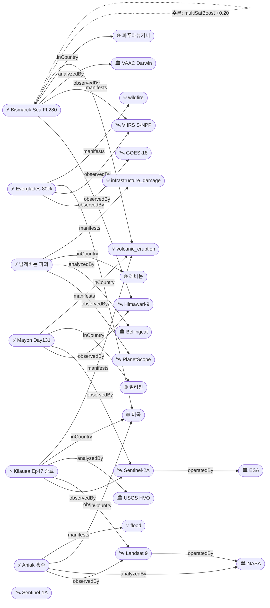

# 2026-05-15 위성영상 관측 이벤트 OSINT 일일 보고서

## 요약
**파푸아뉴기니 Bismarck Sea 해저화산이 FL280(8,500m)으로 급격 상승** — 전일 FL140에서 하루 만에 고도가 2배로 증가하여 VAAC Darwin이 15번째 advisory를 발행했다. **하와이 Kilauea Episode 47은 9시간 연속 분수 분출 후 5/15 00:27 HST에 종료**되어 경계수준이 WATCH→ADVISORY로 2단계 하향 조정되었다. **NASA Earth Observatory가 알래스카 Aniak의 Landsat 9 전후 비교(before/after) 영상**을 Image of the Day로 발행하여 Kuskokwim 강 얼음 해빙·홍수를 기록했다. **Bellingcat이 남레바논 PlanetScope 인터랙티브 맵을 공개**하여 IDF 파괴 규모를 체계적으로 문서화했다. 다중 위성 교차검증 **6건**(전일 대비 +1, Bismarck Sea 추가). 한반도 GeoFocus 금일 신규 없음.

## 오늘의 핵심 (Top 5)

| 순위 | 이벤트 | 도메인 | 위성 | 지역 | 신뢰도 |
|------|--------|--------|------|------|--------|
| 1 | Bismarck Sea 해저화산 FL280 급격 상승 | Disaster | Himawari-9 + VIIRS | Central Bismarck Sea, PG | 0.90 |
| 2 | Kilauea Ep47 분수 분출 9h → 종료 | Disaster | Sentinel-2A + Landsat 9 | Hawaii, US | 0.95 |
| 3 | Bellingcat 남레바논 PlanetScope 인터랙티브 맵 | Humanitarian | PlanetScope | Southern Lebanon, LB | 0.90 |
| 4 | NASA EO Aniak 얼음 해빙·홍수 (before/after) | Disaster | Landsat 9 | Aniak, Alaska, US | 0.90 |
| 5 | Everglades 산불 80% contained 개선 | Disaster | GOES-18 + VIIRS | Broward County, FL, US | 0.90 |

## 다중 위성 교차검증 이벤트

1. **Bismarck Sea 해저화산 (PG)**: Himawari-9 (JMA, 정지궤도) + S-NPP VIIRS (NOAA/NASA, 극궤도) — 독립 기관 교차 ★신규
2. **Kilauea 화산 (US)**: Sentinel-2A MSI (ESA) + Landsat 9 TIRS (USGS/NASA) — 다기관 열이상 관측
3. **Mayon 화산 (PH)**: Himawari-9 (JMA) + Sentinel-2A (ESA) — 정지궤도+극궤도 교차
4. **Florida Everglades 산불 (US)**: GOES-18 ABI (NOAA, GEO) + S-NPP VIIRS (NOAA/NASA, LEO) — GEO+LEO 교차
5. **Georgia Pineland Road 산불 (US)**: S-NPP VIIRS + Landsat 8 + Landsat 9 — 3중 위성
6. **Bezymianny 화산 (RU)**: Himawari-9 (JMA) + S-NPP VIIRS (NOAA/NASA) — 정지궤도+극궤도 교차

## 한반도 GeoFocus (KOMPSAT 우선 + 동·서·남해)

금일 한반도 관련 신규 이벤트 없음. 기존 추적 항목:
- **동해 NLL 중국 어선 100척** (5/4 최초 보고): 금일 신규 보도 없음
- **CAS500-2 커미셔닝**: 진행 중, 금일 신규 없음
- **영변 UEP / Sohae / Sinpo**: CSIS Beyond Parallel 금일 신규 분석 없음

## 자연재해 (Disaster)

### 1. Bismarck Sea 해저화산 FL280 — VAAC #15 연속 VA 방출, 고도 2배 상승 (파푸아뉴기니) ★핵심 업데이트
- **출처:** [VolcanoDiscovery / VAAC Darwin](https://www.volcanodiscovery.com/centralbismarcksea/news/302445/vaac-advisory-2026-15.html), [GVP Smithsonian](https://volcano.si.edu/showreport.cfm?gvpvar=GVP.DVAR20260512-250030)
- **위성·센서:** Himawari-9 (AHI, 정지궤도), S-NPP VIIRS (375m, 극궤도)
- **관측일:** 2026-05-15 09:50Z
- **위치:** Central Bismarck Sea, 파푸아뉴기니 (3.03°S, 147.78°E), 수심 1,300m
- **현상:** volcanic_eruption (submarine)
- **상태:** 업데이트 ← 2026-05-14 "Bismarck Sea FL140 VAAC #11"
- **분석:** 15번째 VAAC advisory 발행. **FL140(4,300m) → FL280(8,500m)으로 하루 만에 고도가 2배 상승** — 분출 강도의 급격한 증가를 시사한다. 화산재 IR 온도 -19°C로 측정. 화산재 구름이 NE 방향 5kts로 이동 중. 5/8 분출 개시 이래 1주+ 지속. 1972년 이후 54년 만의 재활동에서 **해저화산으로서는 이례적인 8,500m 고도 화산재 방출**. multiSatBoost +0.20 · officialBoost +0.15 적용.

### 2. Kilauea Ep47 분수 분출 9시간 → 종료, WATCH→ADVISORY 하향 (미국, 하와이) ★핵심 업데이트
- **출처:** [USGS HVO](https://www.usgs.gov/volcanoes/kilauea/volcano-updates), [Big Island Video News](https://www.bigislandvideonews.com/2026/05/14/kilauea-volcano-eruption-update-for-thursday-may-14/), [Hawaii Volcano Expeditions](https://hawaiivolcanoexpeditions.com/blog/lava-update-the-latest-eruptions-on-the-big-island/)
- **위성·센서:** Sentinel-2A (MSI 10m), Landsat 9 (TIRS 100m)
- **관측일:** 2026-05-15
- **위치:** Kīlauea, Halemaʻumaʻu, Hawaii (19.41°N, 155.28°W)
- **현상:** volcanic_eruption
- **상태:** 업데이트 ← 2026-05-14 "Kilauea Ep47 전조 오버플로우 6회"
- **분석:** Episode 47이 **5/15 00:27 AM HST에 갑작스럽게 종료** — 전일 오버플로우 이후 약 9시간 연속 분수 분출(북측 분출구). **피크 순간 용출률 360-390 yd³/s(275-300 m³/s)**, 약 5 PM HST 기록. 평균 용출률 270 yd³/s(220 m³/s). 미세 화산재(fine ash)와 Pele's hair(펠레의 머리카락)가 HVNP 외부 마을(Mauna Loa Estates, Volcano Village 등)에 낙하. USGS가 **경계수준 WATCH→ADVISORY, 항공 ORANGE→YELLOW로 2단계 하향**. 양쪽 분출구에서 발광·화염 지속, 분화구 바닥 용암류 동쪽으로 서서히 확산. multiSatBoost +0.20 · officialBoost +0.15 · thermalBoost +0.10 적용.

### 3. NASA EO: 'Ice Moves Out of Aniak' — Landsat 9 전후 비교 (미국, 알래스카) ★신규
- **출처:** [NASA Earth Observatory](https://science.nasa.gov/earth/earth-observatory/ice-moves-out-of-aniak/), [SpaceDaily](https://spacedaily.com/sd-a-nasa-imaged-the-kuskokwim-ice-breakup-at-aniak-in-clean-weekly-cadence-in-spring-2026-one-year-earlier-the-epa-had-clawed-back-a-20-million-flood-mitigation-grant-to-kipnuk-downstream-the-asymmet/), [KDLG](https://www.kdlg.org/alaska-state-news/2026-05-09/thermal-breakup-on-the-kuskokwim-may-bode-well-for-many-communities-while-aniak-remains-under-flood-warning)
- **위성·센서:** Landsat 9 (OLI, 30m)
- **관측일:** 2026-04-21 (before) / 2026-05-07 (after)
- **위치:** Aniak, Alaska (61.58°N, 159.53°W)
- **현상:** flood (river ice jam)
- **상태:** 신규
- **전후 비교(before/after):** ✅ Landsat 9 OLI 2장 비교 — 4/21 완전 결빙 vs 5/7 반개방·해빙 잔해
- **분석:** NASA EO Image of the Day(5/15). Kuskokwim 강 Aniak 구간에서 **21마일 아이스잼이 상류에서 형성 후 이동**. 5/7 영상 촬영 수시간 후 하류에서 재정체하여 수위 상승. **5/8 홍수 경보 발령**. 두 영상의 대비가 극적 — 결빙된 하천과 플러드플레인 → 반개방, 잔해 가득한 하천. 봄철 해빙 → 아이스잼 → 홍수의 전형적 메커니즘을 위성으로 선명하게 기록. officialBoost +0.15 · baCredibilityBoost +0.10 적용.

### 4. Mayon 화산 Day 131 — Alert Level 3 지속 (필리핀)
- **출처:** [VolcanoDiscovery](https://www.volcanodiscovery.com/mayon/news.html), [ReliefWeb](https://reliefweb.int/disaster/vo-2026-000065-phl)
- **위성·센서:** Himawari-9 (AHI), Sentinel-2A (MSI)
- **관측일:** 2026-05-15
- **위치:** Albay, 필리핀 (13.26°N, 123.69°E)
- **현상:** volcanic_eruption
- **상태:** 업데이트 ← 2026-05-14 "Mayon Day 130"
- **분석:** 131일째 연속 분출. 스트롬볼리안 지속. 용암류 Basud(3.8km)/Bonga(3.2km)/Mi-isi(1.6km) 3방향 유지. Alert Level 3. 286,939명(70,150가구) 영향. GLIDE VO-2026-000065-PHL 인도주의 등록 지속. multiSatBoost +0.20 적용.

### 5. Florida Everglades Max Road Fire — 80% contained 개선 (미국, 플로리다)
- **출처:** [WSVN](https://wsvn.com/news/local/broward/crews-make-progress-on-massive-everglades-brush-fire-amid-wind-shift-concerns-blaze-80-contained/), [CBS Miami](https://www.cbsnews.com/miami/news/florida-fire-map-miami-broward/)
- **위성·센서:** GOES-18 (ABI, 열적외), S-NPP VIIRS (375m)
- **관측일:** 2026-05-15
- **위치:** Broward County, FL (26.0°N, 80.45°W)
- **현상:** wildfire
- **상태:** 업데이트 ← 2026-05-14 "Everglades 70% → 80%"
- **분석:** 진화율 **70% → 80%로 10% 개선**. 11,090ac(4,490ha) 소손. Florida Forest Service 지상 작전 + BSO 항공 물 투하 + 주 방위군 투입. **풍향 변화 우려** 지속 — 이탄층 지하화재 메커니즘으로 완전 진화까지 장기화 전망. Pembroke Pines 대기질 영향 지속. multiSatBoost +0.20 · thermalBoost +0.10 적용.

### 6. Georgia Pineland Road Fire — 90% contained, 주 전역 번밴 해제 (미국, 조지아)
- **출처:** [GFC](https://gatrees.org/current-wildfire-information-and-resources/), [WALB](https://www.walb.com/2026/05/14/wildfire-crews-move-into-mop-up-operations-fire-containment-improves/)
- **위성·센서:** S-NPP VIIRS, Landsat 8/9 (OLI+TIRS)
- **관측일:** 2026-05-15
- **위치:** Clinch/Echols County, GA (31.5°N, 82.5°W)
- **현상:** wildfire
- **상태:** 업데이트 ← 2026-05-14 "Pineland 90% mop-up"
- **분석:** Day 27. 90% contained 유지. **State Forester 비상 번밴(burn ban) 주 전역 해제**(5/12) — 기상 개선 및 주요 화재 90% 진화 근거. 35주택 이상 파괴 확정. mop-up 작전 지속. multiSatBoost +0.20 적용(3중 위성).

### 7. Bezymianny — VAAC #3 FL150 지속 (러시아, 캄차카)
- **출처:** [VolcanoDiscovery / VAAC Tokyo](https://www.volcanodiscovery.com/bezymianny/news/302342/vaac-advisory-2026-3.html)
- **위성·센서:** Himawari-9 (AHI), S-NPP VIIRS
- **관측일:** 2026-05-14~15
- **위치:** Bezymianny, Kamchatka (55.97°N, 160.59°E)
- **현상:** volcanic_eruption
- **상태:** 업데이트 ← 2026-05-14 "Bezymianny VAAC #1 FL150"
- **분석:** VAAC Tokyo advisory #3 발행. FL150(4,600m) 유지. 화산재 서쪽 20kts 이동. 열이상 및 가스-수증기 플룸 지속. Klyuchevskoy 화산군 동시다발 활동 지속(Krasheninnikov 병행). multiSatBoost +0.20 적용.

### 8. Great Sitkin — WATCH/ORANGE, SAR 유일 관측 (미국, 알래스카)
- **출처:** [USGS AVO](https://volcanoes.usgs.gov/hans-public/notice/DOI-USGS-AVO-2026-05-12T20:06:22+00:00)
- **위성·센서:** Sentinel-1A (C-SAR, 5m)
- **관측일:** 2026-05-15
- **위치:** Great Sitkin, AK (52.08°N, 176.13°W)
- **현상:** volcanic_eruption
- **상태:** 업데이트 ← 2026-05-14 "Great Sitkin SAR"
- **분석:** 정상 분화구 내 느린 용암 유출 지속. 소규모 지진·낙석 감지. **구름으로 광학·웹캠 불가** — Sentinel-1A C-SAR가 유일한 관측 수단. 2021.7월 분출 개시 이래 분화구 대부분 충전. sarBoost +0.10 · officialBoost +0.15 적용.

### 9. Shishaldin — ADVISORY/YELLOW, SO2 지속 (미국, 알래스카)
- **출처:** [USGS AVO](https://volcanoes.usgs.gov/hans-public/notice/DOI-USGS-AVO-2026-05-12T20:06:22+00:00)
- **위성·센서:** Sentinel-5P (TROPOMI, SO2)
- **관측일:** 2026-05-15
- **위치:** Shishaldin, AK (54.76°N, 163.97°W)
- **현상:** volcanic_eruption
- **상태:** 업데이트 ← 2026-05-14 "Shishaldin SO2"
- **분석:** 지진·인프라사운드 상승 지속. SO2·수증기 배출 위성+웹캠 관측. tracegasBoost +0.15 · officialBoost +0.15 적용.

## 인간활동 (Human Activity)

기존 추적 (금일 신규 없음):
- **Pemex Cantarell 원유 유출 3개월+**: 잔류오염 지속. Sentinel-1 SAR + Sentinel-2 MSI 교차검증. 630km+ 해안선 오염.
- **Amazon Xingu 금광 496,000ha**: PlanetScope/Sentinel-2 확인.
- **NISAR+Landsat 삼림벌채 조기탐지**: NASA EO 피처.
- **GFW 열대우림 손실**: 브라질 DETER 역대 최저 추세 지속 (2025.8~2026.4 약 1,700km²).

## 기후·환경 (Climate & Environment)

기존 추적 (금일 신규 없음):
- **Harvard TROPOMI+GOSAT 글로벌 메탄 2019-2024**: 관성 59%, 축산 +15%, 폐기물 +11%.
- **북극 해빙 최대면적 역대 최저 타이 14.29M km²** (ICESat-2).
- **Hektoria Glacier 8km 후퇴** (Sentinel-1/2).
- **MethaneSAT 글로벌 평가**: Permian Basin 등.

## 농업·해양 (Agriculture & Maritime)

금일 신규 이벤트 없음.
- **동해 NLL 중국 어선 100척** (5/4): 금일 신규 보도 없음.
- **CAS500-2 커미셔닝**: 진행 중.

## 국방·안보 (Defense — OSINT 한정)

금일 신규 이벤트 없음.
- **이라크 이스라엘 비밀기지** (PlanetScope+WV-3): 금일 신규 없음.
- **Antelope Reef 1,490ac 매립**: 금일 신규 없음.
- **CSIS Beyond Parallel (영변/소해/신포)**: 금일 신규 분석 없음.

## 인도주의 (Humanitarian)

### Bellingcat 남레바논 PlanetScope 인터랙티브 맵 공개 ★신규
- **출처:** [Bellingcat](https://www.bellingcat.com/news/2026/05/14/satellite-imagery-shows-ongoing-demolitions-across-southern-lebanon/), [인터랙티브 맵](https://bellingcat.github.io/lebanon-may-2026/)
- **위성·센서:** PlanetScope (Doves, 3m)
- **관측일:** 2026-03-02 (before) / 2026-05-08 (after)
- **위치:** Southern Lebanon, Yellow Line 내 (33.12°N, 35.43°E)
- **현상:** infrastructure_damage
- **상태:** 신규
- **전후 비교(before/after):** ✅ PlanetScope 2장 비교 — 3/2 파괴 전 vs 5/8 대규모 파괴 후
- **분석:** Bellingcat이 **남레바논 전역의 PlanetScope 위성영상을 주석 처리하여 공개**. IDF "Yellow Line" 내 **수십 개 마을이 심각한 피해 또는 완파**. 대표 사례: **Qantara — 2개 대형 터널 시스템에 450톤 폭약 폭파**, 마을 대부분 소멸. 제어 폭파(controlled demolition) 또는 건설장비 사용으로 추정되는 파괴 패턴. 인터랙티브 맵(bellingcat.github.io/lebanon-may-2026)에서 시계열 비교 가능. analystBoost +0.10 · baCredibilityBoost +0.10 적용.

기존 추적:
- **Mayon GLIDE 인도주의** (VO-2026-000065-PHL): 286,939명 영향 지속.
- **오데사 Grande Pettine 호텔 피격** (Maxar WV-Legion): 금일 신규 없음.

## 센서·플랫폼별 묶음

- **Sentinel-1A (SAR):** Great Sitkin 용암류 (유일한 관측 수단, 구름 투과)
- **Sentinel-2A (광학 MSI):** Kilauea Ep47 열이상, Mayon 분출 관측. **Extension Campaign 2026말 연장 발표**
- **Sentinel-5P (TROPOMI):** Shishaldin SO2, Kupreanof SO2
- **Landsat 8/9 (OLI/TIRS):** Kilauea TIRS 열이상, Georgia Pineland burn scar, **Aniak 전후 비교(NASA EO IOD)**
- **MODIS / VIIRS:** Bismarck Sea 화산재 IR 온도 측정, Everglades/Pineland 활성 화재, Bezymianny 열이상
- **Himawari-9 (AHI):** Bismarck Sea 연속 모니터링, Mayon 정지궤도 감시, Bezymianny 화산재
- **GOES-18 (ABI):** Everglades 열적외 모니터링
- **PlanetScope (Planet):** Bellingcat 남레바논 인터랙티브 맵 (3m, before/after)
- **KOMPSAT-3A / 5 / CAS500:** CAS500-2 커미셔닝 진행 중

### Sentinel-2A Extension Campaign — 2026년 말 연장 공식 발표
- **출처:** [Copernicus Data Space Ecosystem](https://dataspace.copernicus.eu/news/2026-5-15-sentinel-2a-extension-campaign-prolonged-until-end-2026), [Sentinel Online](https://sentinels.copernicus.eu/-/sentinel-2a-extension-campaign-prolonged-until-the-end-of-2026)
- **발표일:** 2026-05-15
- **분석:** ESA/Copernicus가 2025.3월 시작된 Sentinel-2A 연장 캠페인을 **2026.12.31까지 연장**한다고 공식 발표. Sentinel-2 콘스텔레이션이 3기(A/B/C) 체제를 올해 말까지 유지함으로써, 관측 연속성과 재방문 주기가 보장된다. 야간 영상 실험(2026.1월 시작)도 지속.

## 전후 비교(before/after) 영상 보유 이벤트

1. **Aniak 얼음 해빙·홍수 (Alaska)**: Landsat 9 OLI — 2026-04-21 (완전 결빙) vs 2026-05-07 (반개방·해빙 잔해) ★NASA EO Image of the Day
2. **남레바논 IDF 파괴 (Lebanon)**: PlanetScope — 2026-03-02 (파괴 전) vs 2026-05-08 (대규모 파괴 후) ★Bellingcat 인터랙티브 맵

## 미검증 의혹

| 이벤트 | 위성 미확인 사유 | 신뢰도 |
|--------|-----------------|--------|
| Fuego 화산 (과테말라) | 지상 관측(INSIVUMEH)만 확인. 위성 영상 미확인. | 0.72 |

## 지식그래프

### 오늘의 주요 관계
- **ent-evt-701 (Bismarck Sea)**: multiSatBoost 신규 추가 — Himawari-9(JMA) + VIIRS(NOAA/NASA) 교차검증으로 다중 위성 교차검증 이벤트 6건 달성
- **ent-evt-202 (Kilauea Ep47)**: 분출 사이클 완결 — Ep46→Ep47 partOfSeries 확정. Ep48 잠정 모니터링
- **ent-evt-903 (Aniak)**: NASA EO 공식 발행 + before/after → officialBoost + baCredibilityBoost 동시 적용
- **ent-evt-905 (남레바논)**: Bellingcat analystBoost + PlanetScope before/after baCredibilityBoost

### 전체 지식그래프 시각화

## 온톨로지 변경

| 변경 유형 | 대상 | 근거 |
|----------|------|------|
| 신규 Location | ent-loc-067 (Aniak, Alaska) | NASA EO Image of the Day. Kuskokwim 강 얼음 해빙·홍수 위치. |
| 이벤트 업데이트 | ent-evt-202 (Kilauea Ep47) | 분수 분출 9h → 종료. WATCH→ADVISORY 2단계 하향. |
| 이벤트 업데이트 | ent-evt-701 (Bismarck Sea) | FL140→FL280 급격 상승. multiSatBoost 신규 적용. |
| 위성 운영 | Sentinel-2A | Extension Campaign 2026말 연장 공식 발표. |

## 추론 결과

| 추론 | 신뢰도 | 근거 |
|------|--------|------|
| Bismarck Sea multiSatBoost +0.20 ★신규 | 0.90 | Himawari-9 (JMA) + VIIRS (NOAA/NASA) 독립 교차 |
| Kilauea multiSatBoost +0.20 (유지) | 0.95 | Sentinel-2A (ESA) + Landsat 9 (USGS/NASA) |
| Aniak officialBoost +0.15 | 0.90 | NASA Earth Observatory 공식 발행 |
| Aniak baCredibilityBoost +0.10 | 0.90 | Landsat 9 before/after 제공 |
| 남레바논 baCredibilityBoost +0.10 | 0.90 | PlanetScope before/after 시계열 |
| 남레바논 analystBoost +0.10 | 0.90 | Bellingcat 독립 분석 |
| Kilauea thermalBoost +0.10 (유지) | 0.95 | TIRS 열적외 센서 화산 관측 |
| Great Sitkin sarBoost +0.10 (유지) | 0.85 | C-SAR 유일 관측 (구름 투과) |
| Shishaldin tracegasBoost +0.15 (유지) | 0.78 | TROPOMI SO2 관측 |
| Kilauea Ep46→Ep47 partOfSeries | 0.85 | 동일 위치·동일 현상 시계열 |
| Bismarck Sea temporal FL 상승 추세 | 0.90 | FL130→FL140→FL280 일별 상승 |

## 분석 및 평가

### 화산 동향
전 세계 **8+개 화산 동시 위성 모니터링** 이례적 상황이 지속된다. 가장 우려되는 변화는 **Bismarck Sea 해저화산의 FL280 급격 상승** — 해저에서 8,500m 고도까지 화산재가 올라가는 것은 분출 에너지의 극적 증가를 의미하며, 항공 위험이 확대되고 있다. 반면 **Kilauea Ep47은 9시간의 인상적인 분출 후 종료**되어 단기적 정점을 지났으나, Ep46→Ep47 패턴(1-2주 간격)을 고려하면 Ep48 가능성을 모니터링해야 한다.

### 산불 동향
미국 남부 2대 산불 모두 진화 진전을 보였다. **Everglades 80%**(70%에서 개선), **Pineland 90%** + 주 전역 번밴 해제. 다만 Everglades의 이탄층 지하화재는 완전 진화까지 장기화될 전망.

### OSINT 위성 활용
Bellingcat의 남레바논 인터랙티브 맵은 **PlanetScope 3m 해상도 영상을 체계적으로 주석 처리하여 공개**한 모범적 위성 OSINT 사례다. NASA EO의 Aniak before/after도 **기후변화 신호(봄철 해빙 패턴 변화)를 일반 대중에게 시각적으로 전달**하는 우수 사례.

### Sentinel-2A Extension
ESA의 Sentinel-2A 연장 발표는 Copernicus 프로그램의 관측 연속성 확보 측면에서 중요하다. 2026년 말까지 3기(A/B/C) 체제를 유지함으로써 전 세계 EO 커뮤니티의 데이터 접근이 보장된다.

## 추적 항목

| 항목 | 최초 보고 | 상태 | 최신 업데이트 |
|------|----------|------|-------------|
| Kilauea 화산 분출 | 2026-04-30 | Ep47 종료, ADVISORY | 5/15 Ep47 9h→종료 |
| Mayon 화산 131일 분출 | 2026-04-30 | Alert Level 3 지속 | 5/15 Day 131 |
| Bismarck Sea 해저화산 | 2026-05-13 | FL280 급격 상승 | 5/15 VAAC #15 |
| Bezymianny 화산 | 2026-05-14 | VAAC #3 FL150 | 5/15 지속 |
| Great Sitkin 화산 | 2026-05-01 | WATCH/ORANGE | 5/15 SAR 용암류 |
| Shishaldin 화산 | 2026-05-01 | ADVISORY/YELLOW | 5/15 SO2 지속 |
| Kupreanof 화산 | 2026-05-12 | ADVISORY/YELLOW | 5/15 변동 없음 |
| Ibu 화산 | 2026-05-11 | 분출 지속 | 5/15 수백 회 폭발 |
| Florida Everglades 산불 | 2026-05-11 | 80% contained | 5/15 이탄층 지속 |
| Georgia Pineland 산불 | 2026-05-06 | 90% mop-up | 5/15 번밴 해제 |
| Pemex Cantarell 원유 유출 | 2026-05-07 | 잔류오염 | 5/15 변동 없음 |
| Amazon Xingu 금광 | 2026-05-08 | 496k ha | 5/15 변동 없음 |
| 북극 해빙 역대 최저 | 2026-05-11 | 14.29M km² | 5/15 변동 없음 |
| Hektoria Glacier 8km | 2026-05-07 | 후퇴 지속 | 5/15 변동 없음 |
| 동해 NLL 어선 | 2026-05-04 | 추적 중 | 5/15 변동 없음 |
| CAS500-2 커미셔닝 | 2026-05-03 | 진행 중 | 5/15 변동 없음 |
| DPRK 영변/소해/신포 | 2026-05-01 | OSINT 모니터링 | 5/15 변동 없음 |
| Antelope Reef 매립 | 2026-05-05 | 1,490ac | 5/15 변동 없음 |
| 남레바논 파괴 | 2026-05-14 | 인터랙티브 맵 공개 | 5/15 Bellingcat 맵 |
| 오데사 피격 | 2026-05-12 | Maxar 관측 | 5/15 변동 없음 |
| Mayon 인도주의 | 2026-05-10 | GLIDE 등록 | 5/15 286,939명 |

## 출처 목록

1. [USGS HVO — Kilauea Volcano Updates](https://www.usgs.gov/volcanoes/kilauea/volcano-updates) - USGS, 2026-05-15
2. [VolcanoDiscovery — Bismarck Sea VAAC Advisory 2026/15](https://www.volcanodiscovery.com/centralbismarcksea/news/302445/vaac-advisory-2026-15.html) - VAAC Darwin, 2026-05-15
3. [NASA EO — Ice Moves Out of Aniak](https://science.nasa.gov/earth/earth-observatory/ice-moves-out-of-aniak/) - NASA, 2026-05-15
4. [Copernicus Data Space — Sentinel-2A Extension Campaign](https://dataspace.copernicus.eu/news/2026-5-15-sentinel-2a-extension-campaign-prolonged-until-end-2026) - ESA, 2026-05-15
5. [VolcanoDiscovery — Mayon News](https://www.volcanodiscovery.com/mayon/news.html) - PHIVOLCS, 2026-05-15
6. [VolcanoDiscovery — Bezymianny VAAC #3](https://www.volcanodiscovery.com/bezymianny/news/302342/vaac-advisory-2026-3.html) - VAAC Tokyo, 2026-05-15
7. [WSVN — Everglades Brush Fire 80% Contained](https://wsvn.com/news/local/broward/crews-make-progress-on-massive-everglades-brush-fire-amid-wind-shift-concerns-blaze-80-contained/) - WSVN, 2026-05-15
8. [GFC — Current Wildfire Information](https://gatrees.org/current-wildfire-information-and-resources/) - Georgia Forestry Commission, 2026-05-15
9. [USGS AVO — Great Sitkin/Shishaldin](https://volcanoes.usgs.gov/hans-public/notice/DOI-USGS-AVO-2026-05-12T20:06:22+00:00) - USGS AVO, 2026-05-15
10. [Bellingcat — Satellite Imagery Shows Ongoing Demolitions Across Southern Lebanon](https://www.bellingcat.com/news/2026/05/14/satellite-imagery-shows-ongoing-demolitions-across-southern-lebanon/) - Bellingcat, 2026-05-14
11. [Bellingcat — Lebanon Interactive Map](https://bellingcat.github.io/lebanon-may-2026/) - Bellingcat, 2026-05-15
12. [Hawaii Volcano Expeditions — Ep47 Update](https://hawaiivolcanoexpeditions.com/blog/lava-update-the-latest-eruptions-on-the-big-island/) - Hawaii Volcano Expeditions, 2026-05-15
13. [Big Island Video News — Kilauea May 14](https://www.bigislandvideonews.com/2026/05/14/kilauea-volcano-eruption-update-for-thursday-may-14/) - BIVN, 2026-05-14
14. [GVP Smithsonian — Bismarck Sea Activity Report](https://volcano.si.edu/showreport.cfm?gvpvar=GVP.DVAR20260512-250030) - Smithsonian, 2026-05-12
15. [SpaceDaily — NASA Kuskokwim](https://spacedaily.com/sd-a-nasa-imaged-the-kuskokwim-ice-breakup-at-aniak-in-clean-weekly-cadence-in-spring-2026-one-year-earlier-the-epa-had-clawed-back-a-20-million-flood-mitigation-grant-to-kipnuk-downstream-the-asymmet/) - SpaceDaily, 2026-05-15
16. [KDLG — Kuskokwim Thermal Breakup](https://www.kdlg.org/alaska-state-news/2026-05-09/thermal-breakup-on-the-kuskokwim-may-bode-well-for-many-communities-while-aniak-remains-under-flood-warning) - KDLG, 2026-05-09
17. [Sentinel Online — Sentinel-2A Extension](https://sentinels.copernicus.eu/-/sentinel-2a-extension-campaign-prolonged-until-the-end-of-2026) - ESA, 2026-05-15
18. [ReliefWeb — Mayon GLIDE](https://reliefweb.int/disaster/vo-2026-000065-phl) - ReliefWeb, 2026-05-15
19. [CBS Miami — Florida Fire Map](https://www.cbsnews.com/miami/news/florida-fire-map-miami-broward/) - CBS, 2026-05-15
20. [VolcanoDiscovery — Worldwide Activity May 14](https://www.volcanodiscovery.com/volcano-activity/news/302395/Volcanic-activity-worldwide-14-May-2026-Santiaguito-volcano-Fuego-Semeru-Ibu-Dukono-Reventador.html) - VolcanoDiscovery, 2026-05-14
