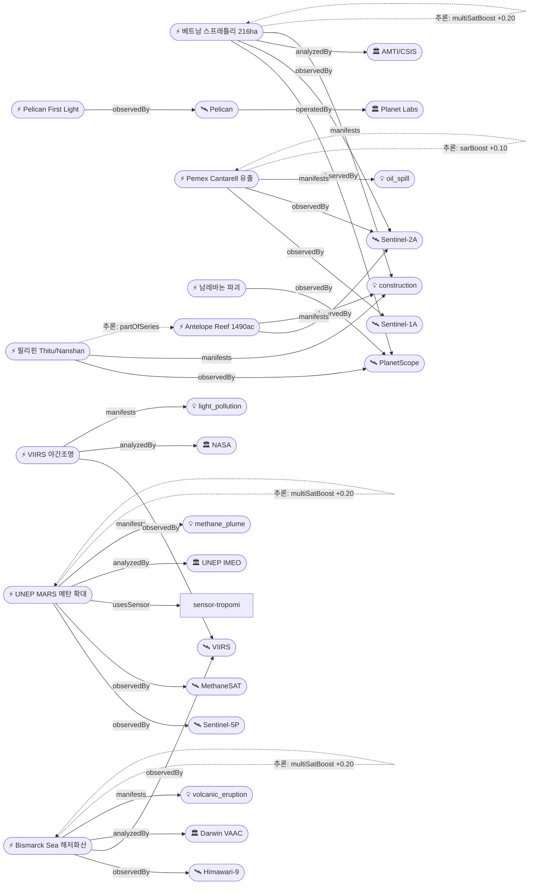

# 2026-05-16 위성영상 관측 이벤트 OSINT 일일 보고서

## 요약

금일 신규 5건·업데이트 8건을 수집하였다. **UNEP IMEO의 메탄 위성경보 시스템(MARS) 석탄·폐기물 부문 확대**(G7 발표)가 기후·환경 도메인 핵심 이벤트이며, **남중국해에서 베트남·필리핀·중국 3자 동시 건설 활동**이 위성영상으로 확인되어 국방·안보 도메인의 가장 주목할 만한 변화이다. 다중 위성 교차검증 이벤트 4건, 한반도 직접 이벤트 0건(간접 1건: CAS500-2 Pelican rideshare). 자연재해 분야에서는 Bismarck Sea 해저화산이 FL280→FL140으로 약화 추세를 보이며, Kilauea는 Ep47 종료 후 휴지기에 진입하였다.

## 오늘의 핵심 (Top 5)

| 순위 | 이벤트 | 도메인 | 위성 | 지역 | 신뢰도 |
|------|--------|--------|------|------|--------|
| 1 | UNEP MARS 메탄 석탄·폐기물 확대 | 기후·환경 | Sentinel-5P + MethaneSAT | 글로벌 | 0.92 + multiSat + tracegas + official |
| 2 | 베트남 스프래틀리 216ha 확장 | 국방·안보 | PlanetScope + Sentinel-2A | 남중국해 | 0.90 + multiSat + before/after |
| 3 | Bismarck Sea 해저화산 VAAC #17 | 자연재해 | Himawari-9 + VIIRS | PNG | 0.92 + multiSat |
| 4 | Pemex Cantarell 원유 유출 3개월+ | 인간활동 | Sentinel-1A (SAR) + Sentinel-2A | 멕시코 | 0.92 + multiSat + SAR |
| 5 | Bellingcat 남레바논 파괴 May 8 업데이트 | 인도주의 | PlanetScope | 레바논 | 0.90 + before/after |

## 다중 위성 교차검증 이벤트

| 이벤트 | 위성 1 | 위성 2 | 운영기관 | 가산 |
|--------|--------|--------|---------|------|
| UNEP MARS 메탄 | Sentinel-5P (TROPOMI) | MethaneSAT | ESA / EDF | +0.20 |
| 베트남 스프래틀리 216ha | PlanetScope | Sentinel-2A | Planet / ESA | +0.20 |
| Bismarck Sea 해저화산 | Himawari-9 | VIIRS (JPSS) | JMA / NOAA | +0.20 |
| Pemex Cantarell 유출 | Sentinel-1A (SAR) | Sentinel-2A (광학) | ESA SAR / ESA 광학 | +0.20 |

## 한반도 GeoFocus

금일 한반도 직접 관측 이벤트는 없다.

- **추적 중**: 동해 NLL 중국 어선 100척 — VIIRS/Sentinel-1 관측 이력 (5/4 보고, 금일 변동 없음)
- **간접 관련**: CAS500-2 (차세대중형위성 2호) 커미셔닝 완료 + Planet Pelican 3기 rideshare 확인 — 한국 발사체로 탑재된 상업 EO 위성의 첫 운용 성과
- **추적 중**: CSIS Beyond Parallel 영변/소해/신포 — 금일 변동 없음

## 자연재해 (Disaster)

### 1. Bismarck Sea 해저화산 — VAAC #17, FL140 지속 방출
- **출처:** [VolcanoDiscovery / Darwin VAAC](https://www.volcanodiscovery.com/centralbismarcksea/news/302505/vaac-advisory-2026-17.html)
- **위성·센서:** Himawari-9 (AHI), VIIRS (Suomi-NPP/JPSS)
- **관측일:** 2026-05-15~16
- **위치:** Papua New Guinea, Bismarck Sea (-3.03, 147.78)
- **현상:** volcanic_eruption (submarine)
- **상태:** 업데이트 ← 2026-05-15 "VAAC #15 FL280"
- **분석:** 전일 FL280(8,500m)에서 FL140(4,300m)으로 분출 고도 하강. 약화 추세로 보이나 1주 이상 지속 중인 해저화산 분출은 이례적. 수중 변색 플룸(9×11km) 유지. 1972년 이후 54년 만의 재활동으로 학술적 관심 집중.

### 2. Kilauea Ep47 종료·휴지 — ADVISORY/YELLOW
- **출처:** [USGS HVO](https://www.usgs.gov/volcanoes/kilauea/volcano-updates)
- **위성·센서:** Sentinel-2A (MSI 10m), Landsat 9 (OLI/TIRS 30m)
- **관측일:** 2026-05-15~16
- **위치:** Hawaii, USA (19.41, -155.28)
- **현상:** volcanic_eruption
- **상태:** 업데이트 ← 2026-05-15 "Ep47 분수분출 9시간"
- **분석:** Episode 47 북측 분출구에서 9시간 연속 용암 분수(피크 360-390 yd³/s) 후 5/15 00:27 HST 종료. WATCH→ADVISORY 하향. 현재 4.7 microradians 팽창 — Ep48 재개 가능성. 분화구 바닥 용암은 여전히 백열 상태로 동쪽 이동 중.

### 3. Great Sitkin 화산 — SAR 관측 용암류 동쪽 성장 지속
- **출처:** [VolcanoDiscovery / USGS AVO](https://www.volcanodiscovery.com/great-sitkin/news/302242/Great-Sitkin-United-States-Volcano-United-States-activity-update-May-12-2026-Continuing-eruptionCite.html)
- **위성·센서:** Sentinel-1A (C-band SAR 5m)
- **관측일:** 2026-05-12 (최신 SAR pass)
- **위치:** Alaska, USA (52.08, -176.13)
- **현상:** volcanic_eruption (lava dome)
- **상태:** 업데이트 ← 2026-05-15 "SAR 관측 용암류 지속"
- **분석:** SAR 레이더 영상으로 확인된 완만한 용암 돔 성장. 동쪽 방향 확장 지속. WATCH/ORANGE 유지. 구름 빈번한 알류샨 열도에서 SAR의 가치를 보여주는 사례.

### 4. Florida Everglades Max Road Fire — 25,000ac+ 확대 후 진압 진행
- **출처:** [CIMSS Satellite Blog](https://cimss.ssec.wisc.edu/satellite-blog/archives/70367)
- **위성·센서:** GOES-18 (ABI), VIIRS (Suomi-NPP/JPSS)
- **관측일:** 2026-05-11~16
- **위치:** Florida, USA (26.0, -80.45)
- **현상:** wildfire
- **상태:** 업데이트 ← 2026-05-15 "80% contained 11,090ac"
- **분석:** 5/11 발화 후 급격 확산, GOES-East가 열점 및 연기 플룸 실시간 추적. 극심한 가뭄(Moderate~Extreme) 하 건조 소택지 연료. 현재 25,000ac 이상 소실, 진압 진행 중.

## 인간활동 (Human Activity)

### 1. Pemex Cantarell 원유 유출 — 3개월+ 지속, SAR 여전히 유막 확인
- **출처:** [TPR (Texas Public Radio)](https://www.tpr.org/environment/2026-05-07/pemex-linked-gulf-oil-spill-may-still-be-spreading-three-months-later-satellite-images-suggest)
- **위성·센서:** Sentinel-1A (C-band SAR 5m), Sentinel-2A (MSI 10m)
- **관측일:** 2026-05-07 (최신 SAR 확인)
- **위치:** Gulf of Mexico, Abkatun-Cantarell complex, Mexico (19.8, -92.4)
- **현상:** oil_spill
- **상태:** 업데이트 ← 2026-05-15 "잔류오염 지속"
- **분석:** 2026-02-06 파이프라인 누출 발견 이후 3개월 이상 지속. 5월 초 SAR 레이더 영상에서 해상 인프라 인근 elongated dark patches(유막 시그니처) 여전히 관측. 초기 플룸 50km+ 확산. Pemex 기계적 결함 인정. 해양 생태계 심각한 영향.

## 기후·환경 (Climate & Environment)

### 1. UNEP MARS 메탄 위성경보 — 석탄·폐기물 부문 확대 (G7 발표)
- **출처:** [UNEP](https://www.unep.org/news-and-stories/press-release/satellite-methane-alerts-expanded-coal-and-waste-sectors-unep)
- **위성·센서:** Sentinel-5P (TROPOMI 3.5km), MethaneSAT (100m)
- **관측일:** 2026-05-04 (G7 발표)
- **위치:** 글로벌
- **현상:** methane_plume
- **상태:** 신규
- **분석:** UNEP 국제메탄배출관측소(IMEO)가 메탄경보대응시스템(MARS)을 석탄 광산·폐기물 시설로 최초 확대. 23,000건 이상 위성 관측 분석, 250개 탄광 데이터베이스 구축(글로벌 야금탄 생산의 50%+ 커버). IEA와 공동으로 MARS 대응 블루프린트 발표. 앙골라·리비아·파키스탄 국영 석유사 OGMP 2.0 신규 참여. **3중 가산 적용**: multiSat(Sentinel-5P+MethaneSAT) + tracegas(TROPOMI) + official(UNEP).

### 2. NASA 'Picturing Earth in a New Light' — VIIRS 야간조명 변화 Nature 표지
- **출처:** [NASA Earth Observatory](https://science.nasa.gov/earth/earth-observatory/picturing-earth-in-a-new-light/)
- **위성·센서:** VIIRS Day/Night Band (Suomi-NPP/JPSS)
- **관측일:** 2026-05 (Nature 발표)
- **위치:** 글로벌
- **현상:** light_pollution
- **상태:** 신규
- **분석:** 인공 야간조명의 전 지구적 증가·감소 패턴을 VIIRS DNB로 분석한 연구가 Nature 표지로 게재. 도시화·경제 활동·분쟁 영향을 야간광으로 추적하는 방법론 제시.

## 농업·해양 (Agriculture & Maritime)

### 1. CAS500-2 커미셔닝 완료 + Planet Pelican 3기 rideshare
- **출처:** [뉴스핌](https://www.newspim.com/news/view/20260503000194)
- **위성·센서:** CAS500-2 (KARI, 0.5m), Pelican (Planet, 50cm 6밴드)
- **관측일:** 2026-05-03 발사, 5/14 first light 확인
- **위치:** 한국 (한반도 관측 우선)
- **현상:** 위성 운용 (관측 인프라)
- **상태:** 업데이트 ← 2026-05-15 "CAS500-2 커미셔닝"
- **분석:** 한국 KARI 차세대중형위성 2호의 커미셔닝 완료와 동시에, 동일 발사에 탑재된 Planet Pelican 3기가 first light 확인. 한반도 해양·농업 관측 역량 간접 강화.

## 국방·안보 (Defense — OSINT 한정)

### 1. 베트남 스프래틀리 전초기지 216ha 확장 + DVOR 비콘 설치
- **출처:** [AMTI/CSIS](https://amti.csis.org/keeping-score-vietnams-spratly-island-overhaul-continues/)
- **위성·센서:** PlanetScope (3m), Sentinel-2A (MSI 10m)
- **관측일:** 2025-03 ~ 2026-05 (시계열)
- **위치:** 남중국해, Spratly Islands (~11.1°N, 114.1°E)
- **현상:** construction (island building)
- **상태:** 신규
- **분석:** AMTI 보고서에 따르면 베트남은 2025년 3월 이후 534 acres(216ha) 매립 추가, 총 2,771 acres(1,121ha) 도달. DVOR 항법비콘 설치(2025/08~2026/04) — 활주로 운용 인프라 정비 신호. 중국 Antelope Reef 5,460 acres 대비 여전히 열세이나 급속 추격 중. **전후 비교 영상 확인.**

### 2. 필리핀 Thitu 활주로 연장 + Nanshan 항만 확장
- **출처:** [Radio Free Asia](https://www.rfa.org/english/southchinasea/2026/05/08/philippines-satellite-spratlys-infrastructure-upgrade/)
- **위성·센서:** PlanetScope (Planet Labs)
- **관측일:** 2025-10 ~ 2026-05 (시계열)
- **위치:** 남중국해, Thitu/Nanshan Islands (~11.1°N, 114.3°E)
- **현상:** construction (military infrastructure)
- **상태:** 신규
- **분석:** Thitu(Pag-asa) 활주로 1.5km 연장 — F-16 변형 착륙 가능. Nanshan(Lawak) 항만 확장(대형 선박 접안용). 총 예산 2.65B 페소(약 $54M). Planet Labs 위성영상으로 건설 진행 확인. **전후 비교 영상 확인.**

### 3. Antelope Reef 중국 1,490ac 매립 지속
- **출처:** [AMTI/CSIS](https://amti.csis.org/antelope-reef-could-now-be-the-largest-island-in-the-south-china-sea/)
- **위성·센서:** Sentinel-2A (MSI), WorldView-3 (Maxar 0.31m)
- **관측일:** 2025-10 ~ 2026-05 (시계열)
- **위치:** 남중국해, Paracel Islands (16.5°N, 112.6°E)
- **현상:** construction (island building)
- **상태:** 업데이트 ← 2026-05-15 "1,490ac 규모"
- **분석:** 2025년 10월 이후 중국 최초 대규모 매립 재개. 1,490 acres — Mischief Reef(1,504ac)에 육박하는 남중국해 최대 인공섬 가능성. 9,000ft 활주로 건설 가능 규모. 해군·해경·해상민병대 운용 기반.

## 인도주의 (Humanitarian)

### 1. Bellingcat 남레바논 PlanetScope — May 8 영상 업데이트
- **출처:** [Bellingcat](https://www.bellingcat.com/news/2026/05/14/satellite-imagery-shows-ongoing-demolitions-across-southern-lebanon/)
- **위성·센서:** PlanetScope (Planet Labs, 3m)
- **관측일:** 2026-03-02 vs 2026-05-08 (전후 비교)
- **위치:** 남레바논, IDF "Yellow Line" 이남 (33.1°N, 35.4°E)
- **현상:** infrastructure_damage (demolition)
- **상태:** 업데이트 ← 2026-05-15 "인터랙티브 맵 공개"
- **분석:** Qantara 450톤 폭파 등 수십 개 마을의 대규모 파괴를 PlanetScope 시계열(3~5월)로 체계적 문서화. 인터랙티브 맵([bellingcat.github.io/lebanon-may-2026](https://bellingcat.github.io/lebanon-may-2026/)) 제공. **전후 비교 영상 확인.**

## 센서·플랫폼별 묶음

- **Sentinel-1 (SAR):** Great Sitkin 용암류, Pemex Cantarell 유막
- **Sentinel-2 (광학):** 베트남 스프래틀리, Antelope Reef, Kilauea
- **Sentinel-5P (TROPOMI):** UNEP MARS 메탄 석탄·폐기물, Shishaldin SO2
- **Landsat 8/9:** Kilauea (TIRS 열적외)
- **MODIS / VIIRS:** Bismarck Sea, Florida Max Road Fire, 야간조명 Nature
- **Himawari-9:** Bismarck Sea VAAC, Mayon, Bezymianny, Ibu
- **GOES-18:** Florida Max Road Fire
- **Planet (PlanetScope/Pelican):** 베트남 스프래틀리, 필리핀 Thitu/Nanshan, Bellingcat 레바논, First Light
- **Maxar (WorldView-3/Legion):** Antelope Reef, CSIS Beyond Parallel NK
- **MethaneSAT:** UNEP MARS 메탄
- **KOMPSAT / CAS500:** CAS500-2 커미셔닝 완료 (직접 관측 보도 없음)

## 전후 비교(before/after) 영상 보유 이벤트

| 이벤트 | 위성 | 전(before) | 후(after) | 출처 |
|--------|------|-----------|----------|------|
| 베트남 스프래틀리 216ha | PlanetScope + Sentinel-2 | 2025-03 | 2026-05 | AMTI/CSIS |
| 필리핀 Thitu/Nanshan | PlanetScope | 2025-10 | 2026-05 | RFA |
| 남레바논 IDF 파괴 | PlanetScope | 2026-03-02 | 2026-05-08 | Bellingcat |

## 미검증 의혹

금일 위성 출처 미확인 이벤트 없음.

## 지식그래프

### 오늘의 주요 관계

- **UNEP MARS 메탄**: Sentinel-5P + MethaneSAT → 다중위성 교차검증 + TROPOMI trace_gas 가산 + UNEP 공식기관 가산 (3중 강화)
- **남중국해 건설 시리즈**: 베트남(PlanetScope+Sentinel-2) / 필리핀(PlanetScope) / 중국(Sentinel-2+WorldView-3) — 3자 경쟁적 partOfSeries
- **Pemex Cantarell**: Sentinel-1 SAR + Sentinel-2 광학 이중 검증 — 3개월+ 장기 유막

### 전체 지식그래프 시각화

## 온톨로지 변경

| 변경 유형 | 대상 | 근거 |
|----------|------|------|
| 새 엔티티 | sat-pelican (Pelican 위성) | Planet Pelican First Light 공식 발표 |
| 새 엔티티 | sat-cas500-2 (CAS500-2) | CAS500-2 rideshare 확인 |
| 새 엔티티 | org-swaf (Swedish Armed Forces) | 스웨덴 최초 주권 EO 위성 |
| 새 엔티티 | org-unep-imeo (UNEP IMEO) | MARS 메탄 경보 시스템 운영 |
| 새 엔티티 | org-amti (AMTI/CSIS) | 남중국해 위성 분석 |
| 새 엔티티 | org-darwin-vaac (Darwin VAAC) | Bismarck Sea 화산재 경보 |
| 새 엔티티 | co-pg, co-se, co-vn, co-ph | 신규 국가 4건 |
| 새 엔티티 | phen-light-pollution | 야간조명/광공해 현상 |

## 추론 결과

| 추론 | 신뢰도 | 근거 |
|------|--------|------|
| UNEP MARS multiSatBoost | 0.90 | Sentinel-5P(ESA) + MethaneSAT(EDF) 독립 관측 |
| UNEP MARS tracegasBoost | 0.92 | TROPOMI trace_gas 센서 → methane_plume 최적 매칭 |
| UNEP MARS officialBoost | 0.95 | UNEP IMEO (un_body) 공식 발표 |
| 베트남 스프래틀리 multiSatBoost | 0.88 | PlanetScope(Planet) + Sentinel-2A(ESA) 독립 확인 |
| Bismarck Sea multiSatBoost | 0.92 | Himawari-9(JMA) + VIIRS(NOAA) 독립 관측 |
| Pemex Cantarell sarBoost | 0.90 | C-band SAR 해면 유막 탐지 최적 |
| Pemex Cantarell multiSatBoost | 0.92 | Sentinel-1(SAR) + Sentinel-2(광학) 이중 검증 |
| SCS 건설 partOfSeries | 0.70 | 동일 지역·동일 현상 시계열 (잠정) |
| NASA 야간조명 officialBoost | 0.95 | NASA (space_agency) 공식 분석 |

## 분석 및 평가

**기후·환경 도메인**에서 UNEP의 MARS 시스템 석탄·폐기물 확대는 위성 기반 온실가스 모니터링의 구조적 전환점이다. 기존 석유·가스 분야에서 석탄(전 세계 인위적 메탄의 ~12%) 및 폐기물(~20%)로의 확장은 위성 관측의 정책적 영향력을 크게 증대시킨다. Sentinel-5P TROPOMI의 일간 글로벌 매핑과 MethaneSAT의 고정밀 100m 관측이 상호 보완적으로 작동한다.

**국방·안보 도메인**에서 남중국해는 3자 동시 건설이라는 전례 없는 상황이다. 중국(Antelope Reef 1,490ac), 베트남(216ha 추가), 필리핀(Thitu 활주로+Nanshan 항만)이 모두 위성영상으로 실시간 감시되면서 전략적 투명성이 높아지고 있다. 'Hybrid constellation' 시대(Planet+Sentinel+Maxar)에 군사 인프라 은폐가 사실상 불가능해지고 있다는 점이 Defense One/Breaking Defense 등에서도 지적됨.

**자연재해 도메인**에서 Bismarck Sea 해저화산은 1972년 이후 54년 만의 재활동에서 FL280까지 분출 후 FL140으로 약화 추세. 향후 추이 주시 필요. Kilauea는 Ep47 종료 후 팽창 지속으로 Ep48 가능성 열려 있음.

**위성 산업 동향**: Planet Pelican 9기 체제로 50cm급 일간 커버리지 획기적 확대. 스웨덴의 첫 주권 군사 EO 위성 확보는 유럽 중소국의 독자 EO 역량 추구 흐름의 신호.

## 추적 항목

| 항목 | 최초 보고 | 상태 | 최신 업데이트 |
|------|----------|------|-------------|
| Bismarck Sea 해저화산 | 2026-05-11 | 활성 (약화 추세) | 5/16 VAAC #17 FL140 |
| Kilauea 분출 (Ep 시리즈) | 2026-05-04 | 휴지기 (팽창 중) | 5/16 ADVISORY |
| Great Sitkin 용암류 | 2026-05-02 | 활성 (완만) | 5/16 SAR 동쪽 이동 |
| Florida Max Road Fire | 2026-05-11 | 진압 중 | 5/16 25,000ac+ |
| Pemex Cantarell 유출 | 2026-02-06 | 지속 (3개월+) | 5/16 SAR 유막 확인 |
| Antelope Reef 매립 | 2025-10-01 | 진행 중 | 5/16 1,490ac |
| 베트남 스프래틀리 확장 | 2025-03-01 | 진행 중 | 5/16 216ha 확인 |
| 필리핀 Thitu/Nanshan | 2025-10-01 | 진행 중 | 5/16 건설 확인 |
| Bellingcat 남레바논 | 2026-05-14 | 업데이트 | 5/16 May 8 영상 |
| 동해 NLL 어선 | 2026-05-04 | 추적 | 변동 없음 |
| CSIS Beyond Parallel NK | 2026-05-01 | 추적 | 변동 없음 |

## 출처 목록

1. [Bismarck Sea VAAC #17](https://www.volcanodiscovery.com/centralbismarcksea/news/302505/vaac-advisory-2026-17.html) - VolcanoDiscovery/Darwin VAAC, 2026-05-15
2. [Kilauea Volcano Updates](https://www.usgs.gov/volcanoes/kilauea/volcano-updates) - USGS HVO, 2026-05-16
3. [Planet Pelican First Light](https://www.businesswire.com/news/home/20260514665846/en/Planet-Releases-First-Light-from-Latest-Pelican-Launch-Including-Imagery-from-Swedens-First-Sovereign-Satellite) - BusinessWire/Planet Labs, 2026-05-14
4. [UNEP MARS Methane Expansion](https://www.unep.org/news-and-stories/press-release/satellite-methane-alerts-expanded-coal-and-waste-sectors-unep) - UNEP, 2026-05-04
5. [Vietnam Spratly Expansion — AMTI](https://amti.csis.org/keeping-score-vietnams-spratly-island-overhaul-continues/) - AMTI/CSIS, 2026-05
6. [Philippines Thitu/Nanshan Construction](https://www.rfa.org/english/southchinasea/2026/05/08/philippines-satellite-spratlys-infrastructure-upgrade/) - Radio Free Asia, 2026-05-08
7. [Max Road Fire CIMSS Blog](https://cimss.ssec.wisc.edu/satellite-blog/archives/70367) - CIMSS/SSEC, 2026-05-11
8. [Pemex Gulf Oil Spill Still Spreading](https://www.tpr.org/environment/2026-05-07/pemex-linked-gulf-oil-spill-may-still-be-spreading-three-months-later-satellite-images-suggest) - TPR, 2026-05-07
9. [Bellingcat Southern Lebanon Demolitions](https://www.bellingcat.com/news/2026/05/14/satellite-imagery-shows-ongoing-demolitions-across-southern-lebanon/) - Bellingcat, 2026-05-14
10. [NASA Picturing Earth in a New Light](https://science.nasa.gov/earth/earth-observatory/picturing-earth-in-a-new-light/) - NASA Earth Observatory, 2026-05
11. [Great Sitkin Continuing Eruption](https://www.volcanodiscovery.com/great-sitkin/news/302242/Great-Sitkin-United-States-Volcano-United-States-activity-update-May-12-2026-Continuing-eruptionCite.html) - VolcanoDiscovery/USGS AVO, 2026-05-12
12. [Antelope Reef Largest Island in SCS](https://amti.csis.org/antelope-reef-could-now-be-the-largest-island-in-the-south-china-sea/) - AMTI/CSIS, 2026-04
13. [Bismarck Sea Eruption Onset](https://watchers.news/2026/05/13/rare-volcanic-ash-emission-detected-submarine-volcano-central-bismarck-sea-papua-new-guinea-may-2026/) - The Watchers, 2026-05-13
14. [Pemex Gulf Spill — Mongabay](https://news.mongabay.com/2026/04/oil-spill-continues-in-gulf-of-mexico-vulnerable-habitats-while-pemex-admits-fault/) - Mongabay, 2026-04
15. [Vietnam Spratly 216ha — Bloomberg](https://www.bloomberg.com/news/articles/2026-05-09/vietnam-expands-south-china-sea-outposts-as-beijing-widens-lead) - Bloomberg, 2026-05-09
16. [Philippines Spratly — Eurasia Review](https://www.eurasiareview.com/11052026-satellite-imagery-shows-philippine-construction-on-two-islands-in-disputed-spratlys-analysis/) - Eurasia Review, 2026-05-11
17. [Planet Pelican — Orbital Today](https://orbitaltoday.com/2026/05/16/planet-labs-releases-first-light-images-from-pelican-satellites/) - Orbital Today, 2026-05-16
18. [Bellingcat Lebanon Interactive Map](https://bellingcat.github.io/lebanon-may-2026/) - Bellingcat GitHub, 2026-05
19. [CAS500-2 Commissioning](https://www.newspim.com/news/view/20260503000194) - 뉴스핌, 2026-05-03
20. [UNEP MARS Coal DB — fundsforNGOs](https://news.fundsforngos.org/2026/05/06/unep-expands-satellite-methane-monitoring-to-coal-and-waste/) - fundsforNGOs, 2026-05-06
