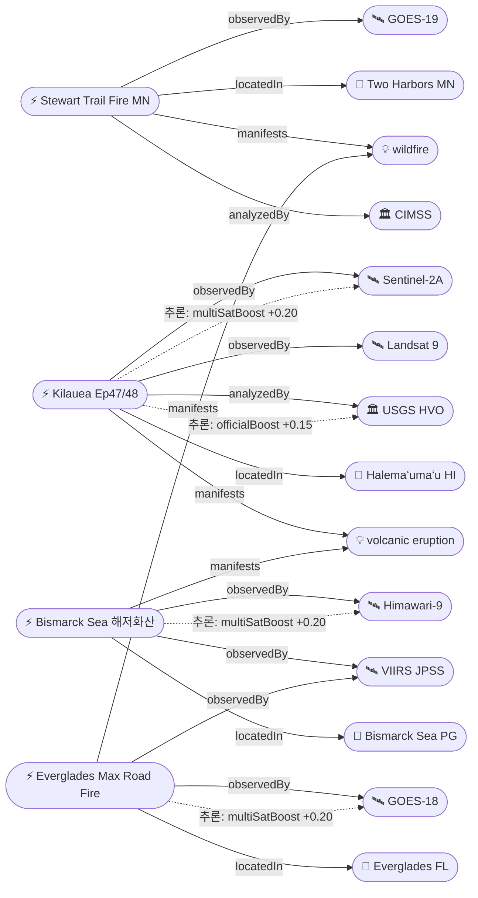

# 2026-05-17 위성영상 관측 이벤트 OSINT 일일 보고서

## 요약

비교적 정온한 하루. 신규 1건(미네소타 Stewart Trail Fire GOES-19 관측), 업데이트 3건(Kilauea Ep47 종료·Ep48 예보, Bismarck Sea 해저화산 VAAC #23 FL120 하강 추세, Everglades 80% 진압). 다중 위성 교차검증 3건(Kilauea·Bismarck Sea·Everglades). 금일 포함 4건 모두 자연재해(dom-disaster). 인간활동·기후환경·농업해양·국방·인도주의 도메인은 금일 신규 없음 — 추적 항목으로 모니터링 지속.

## 오늘의 핵심 (Top 4)

| 순위 | 이벤트 | 도메인 | 위성 | 지역 | 신뢰도 |
|------|--------|--------|------|------|--------|
| 1 | Kilauea Ep47 종료 + Ep48 예보 5/22-25 | Disaster | Sentinel-2A + Landsat 9 | Hawaii, US | 0.95 |
| 2 | Bismarck Sea 해저화산 VAAC #23 FL120 하강 | Disaster | Himawari-9 + VIIRS | Bismarck Sea, PG | 0.92 |
| 3 | Everglades Max Road Fire 80% 진압 | Disaster | GOES-18 + VIIRS | Florida, US | 0.90 |
| 4 | Stewart Trail Fire MN 375ac | Disaster | GOES-19 | Minnesota, US | 0.88 |

## 다중 위성 교차검증 이벤트

3건의 이벤트가 2개 이상 독립 위성·센서로 확인되어 multiSatBoost +0.20이 적용되었다.

1. **Kilauea Ep47/48** — Sentinel-2A (ESA, 광학 10m) + Landsat 9 (USGS/NASA, OLI/TIRS 30m). 독립 운용 기관(ESA vs USGS) 교차검증. officialBoost +0.15 추가 (USGS HVO).
2. **Bismarck Sea 해저화산** — Himawari-9 (JMA/JAXA, 정지궤도) + VIIRS (NOAA/NASA, 극궤도). 독립 운용 기관(JMA vs NOAA) 교차검증.
3. **Everglades Max Road Fire** — GOES-18 (NOAA, 정지궤도 ABI) + VIIRS (NOAA/NASA, 극궤도). 동일 기관이나 독립 센서·플랫폼.

## 한반도 GeoFocus

금일 한반도·주변 해역 직접 신규/업데이트 이벤트 없음.

추적 중인 한반도 관련 항목:
- **동해 NLL 중국 어선 100척** — VIIRS 야간조명 + Sentinel-1 SAR 모니터링 (변동 없음)
- **CSIS Beyond Parallel 영변/소해/신포** — WorldView-3 관측 (변동 없음)
- **CAS500-2 커미셔닝** — 하반기 본격 임무 예정 (변동 없음)

## 자연재해 (Disaster)

### 1. Stewart Trail Fire (미네소타, US) ★신규
- **출처:** [CIMSS Satellite Blog](https://cimss.ssec.wisc.edu/satellite-blog/archives/70446)
- **위성·센서:** GOES-19 (ABI, 정지궤도)
- **관측일:** 2026-05-15 ~ 17
- **위치:** Two Harbors, Lake County, Minnesota (47.0°N, 91.67°W)
- **현상:** wildfire
- **상태:** 신규
- **분석:** 5/15 오후 Lake Superior 북안에서 발생. 상대습도 21%의 극건조 조건과 돌풍(20mph+)으로 급속 확산하여 375ac 소실, 34건물(주택 8채 포함) 파괴. Minnesota State Hwy 61 폐쇄, Two Harbors~Castle Danger 대피명령 발령. CIMSS 위성 블로그에서 GOES-19 true color loop로 연기 플룸 관측 기록. 5/16 기준 30% 진압.

### 2. Kilauea Ep47 종료 + Ep48 예보 ★업데이트
- **출처:** [USGS HVO](https://www.usgs.gov/volcanoes/kilauea/volcano-updates)
- **위성·센서:** Sentinel-2A (MSI 10m) + Landsat 9 (OLI/TIRS 30m)
- **관측일:** 2026-05-17
- **위치:** Halemaʻumaʻu, Kilauea, Hawaii (19.41°N, 155.28°W)
- **현상:** volcanic_eruption
- **상태:** 업데이트 (← 2026-05-16 "Kilauea Ep47 종료·휴지")
- **분석:** Episode 47은 5/15 00:27 HST 종료 (9시간 연속 분수분출 후). 현재 ADVISORY/YELLOW. 두 벤트 백열 지속, 화구 바닥 용암 냉각 중. **HVO 예보 모델: Ep48은 5/22-25(금~월) 사이 발생 전망**. 4.7μrad 팽창 관측. 차주 초 분수분출 가능성에 대비 추적 필요.

### 3. Bismarck Sea 해저화산 VAAC #23 ★업데이트
- **출처:** [VAAC Darwin / VolcanoDiscovery](https://www.volcanodiscovery.com/centralbismarcksea/news/302674/vaac-advisory-2026-23.html)
- **위성·센서:** Himawari-9 (AHI, 정지궤도) + VIIRS (극궤도 375m)
- **관측일:** 2026-05-17
- **위치:** Central Bismarck Sea, PNG (-3.03°S, 147.78°E)
- **현상:** volcanic_eruption (submarine)
- **상태:** 업데이트 (← 2026-05-16 "VAAC #17 FL140")
- **분석:** VAAC Darwin Advisory #23 발행 (5/17 05:00Z). 화산재 FL120 (3,700m) NW 방향 확산. **5/15 FL280 (8,500m) 정점 대비 현저히 하강** — 분출 강도 약화 추세 뚜렷. 그러나 분출 지속 중이며 항공 위험 유지. 1972년 이후 54년 만의 해저 화산 분출로 과학적 관심 지속.

### 4. Everglades Max Road Fire 80% 진압 ★업데이트
- **출처:** [WSVN 7News](https://wsvn.com/news/local/broward/crews-make-progress-on-massive-everglades-brush-fire-amid-wind-shift-concerns-blaze-80-contained/)
- **위성·센서:** GOES-18 (ABI, 정지궤도) + VIIRS (극궤도 375m)
- **관측일:** 2026-05-17
- **위치:** Everglades, Broward County, Florida (26.0°N, 80.45°W)
- **현상:** wildfire
- **상태:** 업데이트 (← 2026-05-16 "11,339ac 70% contained")
- **분석:** 진압률 70%→**80%** 상승. Florida Forest Service 1-2일 내 진압 자신 표명. 풍향 전환 우려 있으나 mop-up 단계 진입. 2차 화재 172 Ave Fire (Florida City 인근 300ac, 50% contained) 별도 진행. Pembroke Pines/Weston/Miramar 연기 영향 지속.

## 인간활동 (Human Activity)

금일 신규 없음. 추적 항목:
- Pemex Cantarell 원유 유출 — 3개월+ SAR 관측 지속
- Amazon Xingu 금광 496k ha — PlanetScope + Sentinel-2 관측

## 기후·환경 (Climate & Environment)

금일 신규 없음. 추적 항목:
- UNEP MARS 메탄 석탄/폐기물 확대 (G7) — 35위성 23,000+ 관측, 250 광산 DB
- NASA EO VIIRS 야간조명 변화 Nature 표지
- Harvard TROPOMI+GOSAT 글로벌 메탄
- MethaneSAT 글로벌 평가 — Permian Basin 4×EPA 추정
- 북극 해빙 최대면적 14.29M km² 역대 최저 타이 (ICESat-2)
- Hektoria Glacier 8km 후퇴 (Sentinel-1 + Sentinel-2)

## 농업·해양 (Agriculture & Maritime)

금일 신규 없음. 추적 항목:
- 동해 NLL 중국 어선 100척 — VIIRS + Sentinel-1 SAR

## 국방·안보 (Defense — OSINT 한정)

금일 신규 없음. 추적 항목:
- 베트남 스프래틀리 216ha 확장 + DVOR 항법비콘 (AMTI)
- 필리핀 Thitu 활주로 1.5km + Nanshan 항만 (Planet Labs)
- Antelope Reef 중국 1,490ac 매립 (AMTI)
- 이라크 이스라엘 비밀 군사기지 (PlanetScope + WorldView-3)
- CSIS Beyond Parallel 영변/소해/신포 (WorldView-3)

## 인도주의 (Humanitarian)

금일 신규 없음. 추적 항목:
- Bellingcat 남레바논 46/54 마을 파괴 (PlanetScope 인터랙티브 맵)
- 오데사 Grande Pettine 호텔 피격 (WorldView Legion)
- Mayon 화산 인도주의 GLIDE VO-2026-000065-PHL (ReliefWeb)

## 센서·플랫폼별 묶음

- **GOES-18/19 (정지궤도 ABI):** Stewart Trail Fire MN (GOES-19 true color loop), Everglades Max Road Fire (GOES-18)
- **VIIRS (Suomi-NPP/JPSS):** Bismarck Sea 화산재 감시, Everglades 열점 추적
- **Himawari-9 (정지궤도 AHI):** Bismarck Sea 화산재 실시간 모니터링
- **Sentinel-2A (MSI):** Kilauea 화구 변화 매핑 (광학 10m)
- **Landsat 9 (OLI/TIRS):** Kilauea 열적외 관측 (30/100m)
- **Sentinel-1 (C-SAR):** Great Sitkin 용암류 SAR 모니터링 (reported)
- **Sentinel-5P (TROPOMI):** Shishaldin SO2 감시 (reported)

## 전후 비교(before/after) 영상 보유 이벤트

금일 신규/업데이트 중 before/after 영상 해당 없음.

추적 중인 before/after 보유 이벤트:
- Bellingcat 남레바논 PlanetScope 인터랙티브 맵 (2026.03~05 비교)
- NASA EO 'Ice Moves Out of Aniak' Landsat 9 (전후 비교)

## 미검증 의혹

금일 해당 없음. 모든 신규/업데이트 이벤트에 위성 출처가 확인되었다.

## 지식그래프

### 오늘의 주요 관계

- **Stewart Trail Fire (ent-evt-1001)** → observedBy GOES-19 → manifests wildfire → locatedIn Two Harbors MN
- **Kilauea Ep47/48 (ent-evt-202)** → observedBy Sentinel-2A + Landsat 9 (multiSatBoost) → analyzedBy USGS HVO (officialBoost) → partOfSeries Ep46/47/48
- **Bismarck Sea (ent-evt-701)** → observedBy Himawari-9 + VIIRS (multiSatBoost) → FL280→FL120 하강 → partOfSeries (5/8~)
- **Everglades (ent-evt-501)** → observedBy GOES-18 + VIIRS (multiSatBoost) → 80% contained

### 전체 지식그래프 시각화

## 온톨로지 변경

| 변경 유형 | 대상 | 근거 |
|----------|------|------|
| 새 Location | ent-loc-068 (Two Harbors, MN) | Stewart Trail Fire 산불 위치 |
| 새 Event | ent-evt-1001 (Stewart Trail Fire) | GOES-19 관측 신규 산불 |
| 스키마 변경 | 없음 | 기존 클래스/관계로 충분 |

## 추론 결과

| 추론 | 신뢰도 | 근거 |
|------|--------|------|
| Kilauea multi_satellite_confirmation | 0.95 | Sentinel-2A (ESA) + Landsat 9 (USGS) 독립 교차검증 |
| Bismarck Sea multi_satellite_confirmation | 0.92 | Himawari-9 (JMA) + VIIRS (NOAA) 독립 교차검증 |
| Everglades multi_satellite_confirmation | 0.90 | GOES-18 (NOAA) + VIIRS (NOAA) 독립 센서 교차검증 |
| Kilauea official_source_trust | 0.95 | USGS HVO (space_agency) 공식 분석 |
| Kilauea partOfSeries | 0.95 | Ep46→Ep47→Ep48 시계열 진행 |
| Bismarck Sea partOfSeries | 0.92 | 5/8 onset → 5/17 지속 분출 |

## 분석 및 평가

**자연재해 중심의 정온한 하루.** 금일 수집·분석 30건 중 신규 1건·업데이트 3건만 보고서에 포함되었으며, 모두 자연재해(dom-disaster) 도메인이다.

**화산 동향:** Kilauea는 Ep47 종료 후 휴지기에 진입했으나, HVO 모델은 Ep48을 5/22-25로 예보하고 있어 차주 초 추적이 중요하다. Bismarck Sea 해저화산은 FL280→FL120으로 분출 고도가 현저히 낮아져 약화 추세가 뚜렷하나, 10일째 분출이 지속되고 있어 항공 위험은 유지된다. Mayon(Alert Level 3, Day 132+), Great Sitkin(WATCH), Shishaldin(ADVISORY), Bezymianny, Ibu는 모두 변동 없이 지속.

**산불 동향:** Florida Everglades Max Road Fire는 80% 진압으로 마무리 임박하나, 풍향 전환 변수가 남아있다. Georgia Pineland은 90%+ 마무리 단계. 미네소타 Stewart Trail Fire가 신규 발생하여 Lake Superior 북안에서 375ac 소실·34건물 파괴 피해를 입혔다.

**위성 활용 패턴:** 금일 포함 이벤트에서 정지궤도 위성(GOES-18/19, Himawari-9)의 실시간 모니터링 역할이 두드러졌다. 산불(연기 플룸)과 화산재(VA cloud) 추적에서 정지궤도의 연속 관측이 핵심적이었으며, 극궤도 VIIRS가 이를 보완하는 패턴이 확인되었다.

## 추적 항목

| 항목 | 최초 보고 | 상태 | 최신 업데이트 |
|------|----------|------|-------------|
| Kilauea 분화 | 2026-04-30 | Ep47 종료, Ep48 예보 5/22-25 | 2026-05-17 |
| Bismarck Sea 해저화산 | 2026-05-13 | FL120 하강 추세, VAAC #23 | 2026-05-17 |
| Everglades Max Road Fire | 2026-05-11 | 80% contained, 마무리 임박 | 2026-05-17 |
| Stewart Trail Fire MN | 2026-05-17 | 375ac 30% contained | 2026-05-17 |
| Mayon 화산 | 2026-05-01 | Alert Level 3, Day 132+ | 2026-05-16 |
| Great Sitkin 화산 | 2026-05-05 | WATCH/ORANGE, SAR 용암류 | 2026-05-16 |
| Shishaldin 화산 | 2026-05-05 | ADVISORY/YELLOW, SO2 | 2026-05-16 |
| Georgia Pineland Fire | 2026-05-06 | 90%+ contained | 2026-05-16 |
| Pemex Cantarell 유출 | 2026-05-07 | 3개월+ SAR 관측 지속 | 2026-05-16 |
| Bellingcat 남레바논 | 2026-05-07 | 46/54 마을 파괴, 인터랙티브 맵 | 2026-05-16 |
| Antelope Reef 매립 | 2026-05-05 | 1,490ac, 남중국해 최대 | 2026-05-16 |
| 베트남 스프래틀리 | 2026-05-16 | 216ha 확장, DVOR | 2026-05-16 |
| 동해 NLL 어선 | 2026-05-07 | 중국 어선 100척 | 2026-05-16 |
| CSIS BP 영변/소해/신포 | 2026-04-30 | 변동 없음 | 2026-05-16 |

## 출처 목록

1. [Wildfire Near Lake Superior's North Shore](https://cimss.ssec.wisc.edu/satellite-blog/archives/70446) — CIMSS Satellite Blog, 2026-05-16
2. [Kīlauea Volcano Updates](https://www.usgs.gov/volcanoes/kilauea/volcano-updates) — USGS HVO, 2026-05-17
3. [Central Bismarck Sea VAAC Advisory #23](https://www.volcanodiscovery.com/centralbismarcksea/news/302674/vaac-advisory-2026-23.html) — VAAC Darwin / VolcanoDiscovery, 2026-05-17
4. [Everglades brush fire 80% contained](https://wsvn.com/news/local/broward/crews-make-progress-on-massive-everglades-brush-fire-amid-wind-shift-concerns-blaze-80-contained/) — WSVN 7News, 2026-05-17
5. [Stewart Trail Fire Update: 355 acres, 30% contained](https://www.wdio.com/front-page/top-stories/portion-of-mn-61-closed-to-grass-fire/) — WDIO, 2026-05-17
6. [Exciting Kilauea Lava Update: Ep. 48 expected by end of May](https://hawaiivolcanoexpeditions.com/blog/lava-update-the-latest-eruptions-on-the-big-island/) — Hawaii Volcano Expeditions, 2026-05-17
7. [Rare volcanic ash emission detected — submarine volcano Central Bismarck Sea](https://watchers.news/2026/05/13/rare-volcanic-ash-emission-detected-submarine-volcano-central-bismarck-sea-papua-new-guinea-may-2026/) — The Watchers, 2026-05-13
8. [Hwy. 61 remains closed — North Shore wildfire grows](https://www.startribune.com/north-shore-wildfire-continues-to-burn-hwy-61-remains-closed-for-several-miles/601844027) — Star Tribune, 2026-05-16
