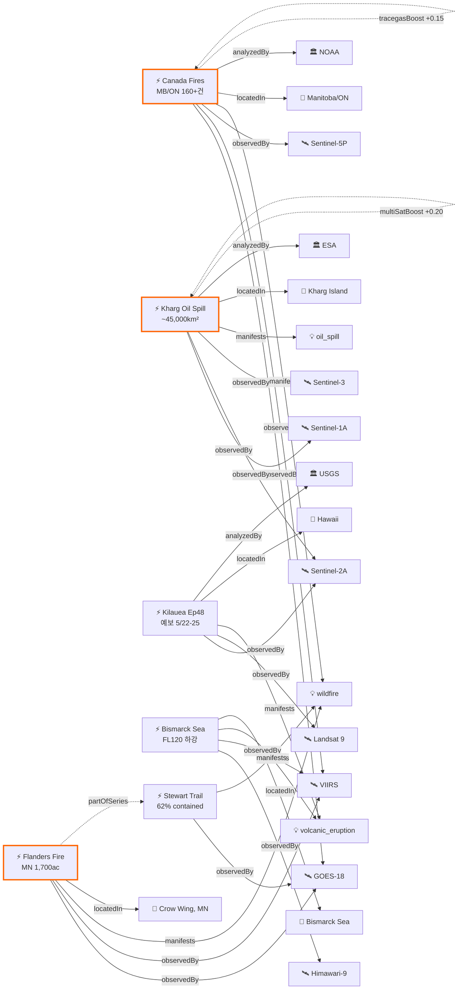

# 2026-05-19 위성영상 관측 이벤트 OSINT 일일 보고서

## 요약

활동 증가일. 신규 3건(캐나다 Manitoba/Ontario 대형 산불 160+건·33,000명 대피, 미네소타 Flanders Fire 1,700ac National Guard 동원, 이란 Kharg Island 원유 유출 Sentinel-1/2/3 탐지 ~45,000km²), 업데이트 5건(Stewart Trail 62% 진압·원인 전력선 확인, Kilauea 재팽창 Ep48 5/22-25 예보 유지, Bismarck Sea FL120 하강 추세, Everglades Max Road contained, 172nd Ave Fire 80%). 다중 위성 교차검증 2건 신규(Canada Fires: NOAA vs ESA, Kharg Oil: SAR+광학+해양색). 한반도 직접 이벤트 없음.

## 오늘의 핵심 (Top 5)

| 순위 | 이벤트 | 도메인 | 위성 | 지역 | 신뢰도 |
|------|--------|--------|------|------|--------|
| 1 | 캐나다 MB/ON 대형 산불 160+건, 연기 유럽 도달 | Disaster | GOES-18 + VIIRS + Sentinel-5P | Manitoba/Ontario, CA | 0.92→1.0 |
| 2 | Kharg Island 원유 유출 ~45,000km² | HumanActivity | Sentinel-1 + Sentinel-2 + Sentinel-3 | Persian Gulf, IR | 0.88→1.0 |
| 3 | Kilauea Ep48 예보 5/22-25 유지 | Disaster | Sentinel-2A + Landsat 9 | Hawaii, US | 0.95 |
| 4 | Flanders Fire MN 1,700ac 20% | Disaster | GOES-18 + VIIRS | Crow Wing County, US | 0.88 |
| 5 | Bismarck Sea 해저화산 FL120 하강 지속 | Disaster | Himawari-9 + VIIRS | Bismarck Sea, PG | 0.90 |

## 다중 위성 교차검증 이벤트

2건의 신규 이벤트가 다중 위성/센서로 확인되어 multiSatBoost +0.20이 적용되었다.

1. **캐나다 MB/ON 산불** — GOES-18 (NOAA, 정지궤도 ABI) + VIIRS (NOAA/NASA, 극궤도) + Sentinel-5P TROPOMI (ESA, 대기화학). 독립 기관(NOAA vs ESA) 교차검증 ✓. TROPOMI가 연기 수송 300hPa에서 확인 → tracegasBoost +0.15 추가.
2. **Kharg Island 원유 유출** — Sentinel-1A (ESA, SAR C-band) + Sentinel-2A (ESA, 광학 MSI) + Sentinel-3 (ESA, 해양색 OLCI). 동일 기관(ESA)이나 3개 독립 센서 모달리티(SAR/광학/해양색) → 조건부 적용. SAR 유막 dampening 탐지 → sarBoost +0.10 추가.

## 한반도 GeoFocus

금일 한반도·주변 해역 직접 신규/업데이트 이벤트 없음.

추적 중인 한반도 관련 항목:
- **동해 NLL 중국 어선 100척** — VIIRS 야간조명 + Sentinel-1 SAR 모니터링 (변동 없음)
- **CSIS Beyond Parallel 영변/소해/신포/판교** — WorldView-3 관측. 영변 UEP 건물 외형 완성, 판교 Saebyeol-4/9 UAV 최초 동시 관측 (변동 없음)
- **KOMPSAT-7 커미셔닝** — 0.3m 해상도 영상 공개(3월). 6월말 교정 완료, 7월 정식운용 예정 (변동 없음)

## 자연재해 (Disaster)

### 1. 캐나다 Manitoba/Ontario 대형 산불 ★신규
- **출처:** [NOAA NESDIS](https://www.nesdis.noaa.gov/news/noaa-satellites-monitor-canadian-wildfires-and-smoke) / [Copernicus CAMS](https://atmosphere.copernicus.eu/cams-tracks-smoke-intense-canadian-wildfires-reaching-europe) / [CBS News](https://www.cbsnews.com/news/canada-wildfires-smoke-deaths-evacuations-manitoba-saskatchewan-alberta/)
- **위성·센서:** GOES-18 (ABI) + VIIRS (Suomi-NPP/JPSS) + Sentinel-5P (TROPOMI)
- **관측일:** 2026-05-14 ~ 18 (지속)
- **위치:** Manitoba/Ontario/Saskatchewan, Canada (52.0°N, 97.0°W 중심)
- **현상:** wildfire (대규모 복합 산불)
- **상태:** 신규 — 진행 중
- **분석:** 5월 중순 이후 160건 이상의 산불이 캐나다 중부(Manitoba, Ontario, Saskatchewan)에서 발생. 33,000명 이상 대피 명령. Manitoba/Saskatchewan 비상사태 선포. GOES-18이 pyrocumulonimbus 구름 형성 포착. **핵심 위성 신호:** TROPOMI/OMPS가 연기를 300hPa(~9,000m) 고도에서 추적 — 5/18 지중해, 5/19 그리스·동부 지중해까지 도달 확인 (Copernicus CAMS). 미국 상부 중서부(Minnesota, Wisconsin, Michigan) 대기질 경보 발령. 기상 조건: 고온·저습·강풍.

### 2. Flanders Fire (미네소타, US) ★신규
- **출처:** [KARE 11](https://www.kare11.com/article/news/local/size-of-flanders-fire-now-estimated-at-nearly-1700-acres-20-contained-mn/89-4b3b1962-0b44-4e7e-8199-e5024a11464f) / [MPR News](https://www.mprnews.org/story/2026/05/18/flanders-fire-near-crosby-and-crosslake-in-crow-wing-county-minnesota)
- **위성·센서:** GOES-18 (ABI) + VIIRS (열점 탐지)
- **관측일:** 2026-05-16 ~ 18 (지속)
- **위치:** Crosslake, Crow Wing County, Minnesota (46.67°N, 94.10°W)
- **현상:** wildfire
- **상태:** 신규 — 20% contained
- **분석:** 5/16 12:40pm 발화 후 강한 서풍에 의해 급속 동쪽 확산. 600ac → 1,666ac → 약 1,700ac (5/18). County Road 11 및 Pine River 횡단. 다년 가뭄으로 나무·쓰러진 통나무가 극건조 상태. 극한 화재기상(강풍+저습). Governor Walz 비상선포, Minnesota National Guard 동원. 대피 명령 유지. Stewart Trail Fire와 동일 기상 패턴 — **partOfSeries** 추론 적용.

### 3. Stewart Trail Fire 62% 진압 ★업데이트
- **출처:** [FOX 9](https://www.fox9.com/news/minnesota-wildfires-stewart-trail-fire-may-18-2026) / [MPR News](https://www.mprnews.org/story/2026/05/18/stewart-trail-fire-near-two-harbors-on-minnesotas-north-shore)
- **위성·센서:** GOES-18/19 (ABI)
- **관측일:** 2026-05-18
- **위치:** Two Harbors, Lake County, Minnesota (47.0°N, 91.67°W)
- **현상:** wildfire
- **상태:** 업데이트 (← 2026-05-17 "375ac 30% contained")
- **분석:** 355ac로 확정 (이전 375ac 추정에서 보정), 62% contained. **원인 확인: 전력선(power line)**. 34건물 파괴(주택 8채, 부속건물 26동). Hwy 61 Silver Cliff Tunnel까지 폐쇄 유지. 5/19 오후 피해 주민 에스코트 접근 허용 시작.

### 4. Kilauea Ep48 예보 유지 ★업데이트
- **출처:** [USGS HVO](https://www.usgs.gov/volcanoes/kilauea/volcano-updates)
- **위성·센서:** Sentinel-2A (MSI 10m) + Landsat 9 (OLI/TIRS 30m)
- **관측일:** 2026-05-19
- **위치:** Halemaʻumaʻu, Kilauea, Hawaii (19.41°N, 155.28°W)
- **현상:** volcanic_eruption
- **상태:** 업데이트 (← 2026-05-17 "Ep47 종료, Ep48 5/22-25 예보")
- **분석:** ADVISORY/YELLOW 유지. 정상부 재팽창(reinflation) 진행 중. 양 분출구 백열 지속, 화구 바닥 냉각 중. **Ep48 예보: 5/22(금)~5/25(월) 사이 분수분출 개시 전망 유지**. 4.7μrad 팽창률 관측. 칼데라 벽 불안정성 + 지반 균열 위험 지속.

### 5. Bismarck Sea 해저화산 — 하강 추세 지속 ★업데이트
- **출처:** [VolcanoDiscovery VAAC #23](https://www.volcanodiscovery.com/centralbismarcksea/news/302674/vaac-advisory-2026-23.html)
- **위성·센서:** Himawari-9 (AHI, 정지궤도) + VIIRS (극궤도)
- **관측일:** 2026-05-17 ~ 19
- **위치:** Central Bismarck Sea, PNG (-3.03°S, 147.78°E)
- **현상:** volcanic_eruption (submarine)
- **상태:** 업데이트 (← 2026-05-17 "VAAC #23 FL120 하강 추세")
- **분석:** 분출 지속 중이나 FL120(3,700m) 수준으로 안정화. 5/15 FL280(8,500m) 정점 대비 현저히 약화. 항공 위험은 유지. 1972년 이후 54년 만의 해저 분출 — 과학적 모니터링 지속.

### 6. Everglades Max Road Fire — 진압 완료 ★업데이트
- **출처:** [CBS Miami](https://www.cbsnews.com/miami/news/florida-fire-map-miami-broward/)
- **위성·센서:** GOES-18 (ABI) + VIIRS
- **관측일:** 2026-05-18
- **위치:** Everglades, Broward County, Florida (26.0°N, 80.45°W)
- **현상:** wildfire
- **상태:** 업데이트 (← 2026-05-17 "80% contained")
- **분석:** Max Road Fire 11,400ac **"contained and controlled"** — 진압 완료 선언. 172nd Avenue Fire(315ac)도 80% contained. 가뭄 지속이나 주요 위협 해소. **추적 종료**.

## 인간활동 (Human Activity)

### 1. Kharg Island 원유 유출 (이란, Persian Gulf) ★신규
- **출처:** [The National](https://www.thenationalnews.com/business/energy/2026/05/13/oil-spill-near-irans-kharg-island-raises-questions-over-its-source/) / [Al Jazeera](https://www.aljazeera.com/video/newsfeed/2026/5/10/satellite-images-show-likely-oil-slick-off-irans-kharg-island) / [Jerusalem Post](https://www.jpost.com/middle-east/iran-news/article-895580)
- **위성·센서:** Sentinel-1A (C-SAR 5m) + Sentinel-2A (MSI 10m) + Sentinel-3 (OLCI)
- **관측일:** 2026-05-06 ~ 08
- **위치:** Kharg Island, Persian Gulf (29.23°N, 50.32°E)
- **현상:** oil_spill
- **상태:** 신규
- **전후 비교:** ✓ (Sentinel-2 5/6 vs 5/8 이미지 비교 가능)
- **분석:** Copernicus Sentinel-1/2/3가 5/6~8일 사이 Kharg Island 서쪽에서 대규모 유막(~45,000km²) 탐지. Sentinel-2 5/6 기준 3척 이상 대형 원유 운반선이 적재 작업 중. **출처 논쟁:** 이란은 외국 선박 밸러스트수 방출 주장, 독립 분석가들은 Abuzar 유전 해저 파이프라인 파열 가능성 지적(수십 년 노후, 2024.10월에도 누출 이력). 후속 위성 패스에서 연속 유출 징후 없음 → 단일 사건(single-event) 판단. SAR가 유막의 해면 dampening(저반사)을 구름/야간 무관하게 탐지 — sarBoost 적용.

추적 중:
- **Pemex Cantarell 원유 유출 (멕시코만)** — 3개월+ 지속, Sentinel-1 SAR 유막 확인 (변동 없음)
- **Amazon Xingu 금광 496k ha 삼림파괴** — PlanetScope + Sentinel-2 모니터링 (변동 없음)

## 기후·환경 (Climate & Environment)

금일 기후·환경 도메인 신규 이벤트 없음.

**주요 추적 사항:**
- **캐나다 산불 연기 대서양 횡단** — Sentinel-5P TROPOMI + CAMS 분석으로 연기가 300hPa에서 유럽 지중해까지 도달 확인 (5/18~19). 재해 도메인과 교차. 대기질·복사강제력 영향 모니터링 지속.
- **북극 해빙 최대면적 역대 최저 타이** — 14.29M km² (변동 없음)
- **Hektoria Glacier 8km 후퇴** — Sentinel-1/2 관측 (변동 없음)
- **UNEP MARS 메탄 경보 23,000+ 관측** — Sentinel-5P/MethaneSAT (변동 없음)
- **Carbon Mapper Tanager-1** — 투르크메니스탄 78t/h 메탄 검출 (변동 없음)
- **Alaska 빙하 후퇴 → 새 섬 형성** — Landsat 9 (변동 없음)
- **NASA EO 야간조명 변화** — VIIRS (변동 없음)

## 농업·해양 (Agriculture & Maritime)

금일 농업·해양 도메인 신규 이벤트 없음.

추적 중:
- **동해 NLL 중국 어선 100척** — VIIRS 야간조명 + Sentinel-1 SAR (변동 없음)

## 국방·안보 (Defense — OSINT 한정)

금일 국방·안보 도메인 신규 이벤트 없음.

추적 중:
- **CSIS Beyond Parallel 영변/소해/신포/판교** — WorldView-3 관측 (변동 없음)
- **남중국해 베트남 스프래틀리 216ha** — PlanetScope + Sentinel-2 (변동 없음)
- **남중국해 중국 Antelope Reef 1,490ac 매립** — Sentinel-2 + WorldView-3 (변동 없음)
- **이라크 내 이스라엘 비밀 기지** — PlanetScope + WorldView-3 (변동 없음)

## 인도주의 (Humanitarian)

금일 인도주의 도메인 신규 이벤트 없음.

추적 중:
- **Bellingcat 남레바논 파괴 지도** — PlanetScope, 46/54 마을 피해 (변동 없음)
- **우크라이나 오데사 인프라 피격** — Maxar WV Legion (변동 없음)

## 센서·플랫폼별 묶음

| 센서/플랫폼 | 금일 관측 이벤트 |
|-------------|-----------------|
| GOES-18/19 (ABI) | Flanders Fire, Stewart Trail, Everglades, Canada Fires (pyrocumulonimbus) |
| VIIRS (Suomi-NPP/JPSS) | Flanders Fire, Canada Fires, Everglades, Bismarck Sea |
| Sentinel-5P (TROPOMI) | Canada Fires smoke transport 300hPa |
| Sentinel-1A (C-SAR) | Kharg Island oil spill (sea surface dampening) |
| Sentinel-2A (MSI) | Kharg Island (optical), Kilauea |
| Sentinel-3 (OLCI) | Kharg Island (ocean color) |
| Landsat 9 (OLI/TIRS) | Kilauea |
| Himawari-9 (AHI) | Bismarck Sea volcano |

## 전후 비교(before/after) 영상 보유 이벤트

| 이벤트 | 위성 | Before | After | 비고 |
|--------|------|--------|-------|------|
| Kharg Island 원유 유출 | Sentinel-2A | 2026-05-06 (유막 미확인) | 2026-05-08 (유막 확인) | 유막 확산 범위 비교 |

## 미검증 의혹 (위성 출처 미확인)

| 항목 | 매체 | 사유 |
|------|------|------|
| MizarVision 중국기업 미군 자산 위성영상 AI 분석 공개 | Defence Industry EU | 구체적 위성 출처 미식별 — GaoFen 추정이나 미확인 |

## 지식그래프 시각화

## 출처 목록

### 신규
1. [NOAA NESDIS — Canadian Wildfires and Smoke](https://www.nesdis.noaa.gov/news/noaa-satellites-monitor-canadian-wildfires-and-smoke)
2. [Copernicus CAMS — Canadian Wildfires Smoke Reaching Europe](https://atmosphere.copernicus.eu/cams-tracks-smoke-intense-canadian-wildfires-reaching-europe)
3. [CBS News — Canada Wildfires 33,000 Evacuate](https://www.cbsnews.com/news/canada-wildfires-smoke-deaths-evacuations-manitoba-saskatchewan-alberta/)
4. [KARE 11 — Flanders Fire 1,700 acres](https://www.kare11.com/article/news/local/size-of-flanders-fire-now-estimated-at-nearly-1700-acres-20-contained-mn/89-4b3b1962-0b44-4e7e-8199-e5024a11464f)
5. [MPR News — Flanders Fire Crow Wing County](https://www.mprnews.org/story/2026/05/18/flanders-fire-near-crosby-and-crosslake-in-crow-wing-county-minnesota)
6. [The National — Kharg Island Oil Spill](https://www.thenationalnews.com/business/energy/2026/05/13/oil-spill-near-irans-kharg-island-raises-questions-over-its-source/)
7. [Al Jazeera — Satellite Images Oil Slick Kharg Island](https://www.aljazeera.com/video/newsfeed/2026/5/10/satellite-images-show-likely-oil-slick-off-irans-kharg-island)

### 업데이트
8. [FOX 9 — Stewart Trail Fire 62% Contained](https://www.fox9.com/news/minnesota-wildfires-stewart-trail-fire-may-18-2026)
9. [USGS HVO — Kilauea Volcano Updates](https://www.usgs.gov/volcanoes/kilauea/volcano-updates)
10. [VolcanoDiscovery — Bismarck Sea VAAC #23](https://www.volcanodiscovery.com/centralbismarcksea/news/302674/vaac-advisory-2026-23.html)
11. [CBS Miami — Florida Fire Map Updates](https://www.cbsnews.com/miami/news/florida-fire-map-miami-broward/)

### 추적 (reported)
12. [USGS AVO — Great Sitkin](https://volcanoes.usgs.gov/hans-public/notice/DOI-USGS-AVO-2026-05-17T19:37:35+00:00)
13. [CSIS Beyond Parallel — North Korean UAVs at Panghyon](https://beyondparallel.csis.org/north-korean-uavs-at-panghyon/)
14. [Bellingcat — Southern Lebanon Demolitions](https://www.bellingcat.com/news/2026/05/14/satellite-imagery-shows-ongoing-demolitions-across-southern-lebanon/)
15. [Planet Pulse — Carbon Mapper Tanager-1 Methane](https://www.planet.com/pulse/carbon-mapper-data-from-the-tanager-1-satellite-reveals-methane-and-carbon-dioxide-super-emitter-activity-around-the-world/)
