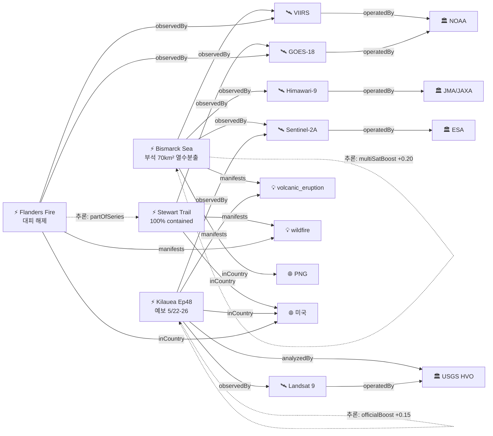

# 2026-05-20 위성영상 관측 이벤트 OSINT 일일 보고서

## 요약

업데이트 중심일. 신규 이벤트 없음, 업데이트 4건. 핵심: Bismarck Sea 해저화산이 열수분출 신국면에 진입하며 부석 뗏목 70km² 이상 확장 — "10년래 최대 심해 해저분출" 평가. Stewart Trail Fire(MN) 100% 진압 완료로 추적 종료. Flanders Fire(MN) 대피 해제·소방인력 철수 시작. Kilauea Ep48 예보 창 5/22-26으로 1일 연장, 재팽창 감속. 다중 위성 교차검증 2건 유지(Bismarck Sea 3위성, Kilauea 2위성). 한반도 직접 이벤트 없음.

## 오늘의 핵심 (Top 4)

| 순위 | 이벤트 | 도메인 | 위성 | 지역 | 신뢰도 |
|------|--------|--------|------|------|--------|
| 1 | Bismarck Sea 부석 뗏목 70km²+ 열수분출 신국면 | Disaster | Himawari-9 + VIIRS + Sentinel-2A | Bismarck Sea, PG | 0.90→1.0 |
| 2 | Stewart Trail Fire 100% 진압 완료 | Disaster | GOES-18 | Two Harbors, MN, US | 0.90 |
| 3 | Kilauea Ep48 예보 5/22-26 확대 | Disaster | Sentinel-2A + Landsat 9 | Hawaii, US | 0.95 |
| 4 | Flanders Fire 대피 해제 | Disaster | GOES-18 + VIIRS | Crow Wing County, MN, US | 0.88 |

## 다중 위성 교차검증 이벤트

2건의 다중 위성/센서 교차검증 이벤트가 확인되었다.

1. **Bismarck Sea 해저화산** — Himawari-9 (JMA/JAXA, 정지궤도 AHI) + VIIRS (NOAA/NASA, 극궤도) + Sentinel-2A (ESA, 광학 MSI). 3개 독립 기관(JMA vs NOAA vs ESA) 교차검증 ✓. 부석 뗏목의 해면 표면 탐지 + 열수 변색 + 화산재 플룸을 각각 독립적으로 확인. multiSatBoost +0.20 적용.
2. **Kilauea Ep48 예보** — Sentinel-2A (ESA, MSI 10m) + Landsat 9 (USGS/NASA, OLI/TIRS 30m). 독립 기관(ESA vs USGS/NASA) 교차검증 ✓. 열적외 센서(TIRS)로 분출구 열이상 모니터링. multiSatBoost +0.20 + thermalBoost +0.10 + officialBoost +0.15 적용.

## 한반도 GeoFocus

금일 한반도·주변 해역 직접 신규/업데이트 이벤트 없음.

추적 중인 한반도 관련 항목:
- **동해 NLL 중국 어선 100척** — VIIRS 야간조명 + Sentinel-1 SAR 모니터링 (변동 없음)
- **CSIS Beyond Parallel 영변/소해/신포/판교** — WorldView-3 관측 (변동 없음)
- **KOMPSAT-7 커미셔닝** — 0.3m 해상도 영상 공개(3월). 6월말 교정 완료, 7월 정식운용 예정 (변동 없음)

## 자연재해 (Disaster)

### 1. Bismarck Sea 해저화산 — 부석 뗏목 70km²+ 열수분출 신국면 ★업데이트
- **출처:** [VolcanoDiscovery](https://www.volcanodiscovery.com/centralbismarcksea/news/302838/Central-Bismarck-Sea-volcano-Admiralty-Islands-Papua-New-Guinea-new-hydrothermal-eruption-steam-lade.html) / [The Watchers](https://watchers.news/2026/05/13/rare-volcanic-ash-emission-detected-submarine-volcano-central-bismarck-sea-papua-new-guinea-may-2026/) / [RNZ](https://www.rnz.co.nz/news/world/595694/undersea-volcano-erupts-in-papua-new-guinea-s-bismarck-sea-prompting-tsunami-concerns)
- **위성·센서:** Himawari-9 (AHI, 정지궤도) + VIIRS (Suomi-NPP/JPSS) + Sentinel-2A (MSI 10m)
- **관측일:** 2026-05-15 ~ 19 (지속)
- **위치:** Central Bismarck Sea, PNG (-3.03°S, 147.78°E)
- **현상:** volcanic_eruption (submarine)
- **상태:** 업데이트 (← 2026-05-19 "FL120 하강 추세")
- **분석:** 기존 화산재 하강 추세(FL280→FL120)에서 **열수분출(hydrothermal) 신국면**으로 전환. **부석 뗏목(pumice raft) 70km² 이상**(5/15 기준), 해면에 도달 — 분출구가 해수면 근접 수심으로 상승했음을 시사. 해수 변색(황록색, SO₂/H₂S) 9×11km 범위. 증기 기둥 3,000m. **"10년래 최대 심해 해저화산 분출"** 평가. 항해 위험 지속. 쓰나미 우려가 일부 보도되었으나, 현재까지 대형 해일 발생 없음. 1972년 이후 54년 만의 분출이 새로운 국면에 진입.

### 2. Stewart Trail Fire — 100% 진압 완료 ★업데이트 (추적 종료)
- **출처:** [MPR News](https://www.mprnews.org/story/2026/05/19/stewart-trail-fire-two-harbors-minnesota-north-shore) / [FOX 21](https://www.fox21online.com/news/local/stewart-trail-fire-evacuation-zone-lifted-us-61-re-opens/article_3c592479-c44e-4954-8da9-ecc96b6a5a22.html)
- **위성·센서:** GOES-18 (ABI)
- **관측일:** 2026-05-19
- **위치:** Two Harbors, Lake County, Minnesota (47.0°N, 91.67°W)
- **현상:** wildfire
- **상태:** 업데이트 (← 2026-05-19 "62% contained") → **100% contained**
- **분석:** 5/19 오전 **100% 진압 완료**. 최종 면적 356ac(기존 355ac 추정에서 확정). 34건물 파괴(주택 8채, 부속건물 26동) 확정. 원인: **전력선(power line)**. 대피구역 해제, US Highway 61 재개통. 냉각·습도 상승 기상 호전이 진압에 기여. **추적 종료**.

### 3. Kilauea Ep48 예보 5/22-26 확대 ★업데이트
- **출처:** [USGS HVO](https://volcanoes.usgs.gov/hans-public/notice/DOI-USGS-HVO-2026-05-19T18:26:29+00:00) / [Hawaii Volcano Expeditions](https://hawaiivolcanoexpeditions.com/blog/lava-update-the-latest-eruptions-on-the-big-island/)
- **위성·센서:** Sentinel-2A (MSI 10m) + Landsat 9 (OLI/TIRS 30m)
- **관측일:** 2026-05-19
- **위치:** Halemaʻumaʻu, Kilauea, Hawaii (19.41°N, 155.28°W)
- **현상:** volcanic_eruption
- **상태:** 업데이트 (← 2026-05-19 "Ep48 5/22-25") → **Ep48 5/22-26**
- **분석:** ADVISORY/YELLOW 유지. Ep48 예보 창 **1일 연장: 5/22(금)~5/26(화)**. Uēkahuna 경사계 **9.5μrad 재팽창** 누적(Ep47 종료 5/15 이후), 그러나 **감속 추세(slowing slightly)**. 양 분출구 야간 백열 지속, 화구 바닥 냉각 중. SO₂ 1,000-5,000 t/day. 모니터링 일부 오프라인(전력 장애). 칼데라 벽 불안정성 + 지반 균열 위험 지속.

### 4. Flanders Fire — 대피 해제, 기상 호전 ★업데이트
- **출처:** [MPR News](https://www.mprnews.org/story/2026/05/19/flanders-fire-crow-wing-county-firefighters-aided-by-cooler-damper-weather) / [Star Tribune](https://www.startribune.com/mn-wildfires-flanders-fire/601844956)
- **위성·센서:** GOES-18 (ABI) + VIIRS (열점 탐지)
- **관측일:** 2026-05-19
- **위치:** Crosslake, Crow Wing County, Minnesota (46.67°N, 94.10°W)
- **현상:** wildfire
- **상태:** 업데이트 (← 2026-05-19 "~1,700ac 20% contained")
- **분석:** **대피 명령 해제**(5/19). 냉각·습도 상승 기상 호전으로 소방인력 **철수(demobilization) 시작**. 면적 ~1,700ac 유지. 추정 원인: **캠프파이어**. $1.4M 피해 추정. 20건 구조물 위협이나 주택 파괴 없음. Stewart Trail과 동일 미네소타 산불 기상 패턴 — **partOfSeries** 추론 적용.

추적 중:
- **캐나다 MB/ON 산불 160+건** — GOES-18 + VIIRS + TROPOMI 모니터링, 33,000명+ 대피, 연기 유럽 도달 지속 (변동 없음)
- **Great Sitkin WATCH/ORANGE** — Sentinel-1 SAR 용암류 동쪽 (변동 없음)
- **Mayon Alert Level 3** — Day 135+ 스트롬볼리안 (변동 없음)
- **Bezymianny/Shishaldin/Ibu** — 화산 활동 지속 (변동 없음)

## 인간활동 (Human Activity)

금일 인간활동 도메인 신규/업데이트 이벤트 없음.

추적 중:
- **Kharg Island 원유 유출** — Sentinel-1/2/3 탐지, ~45,000km² 유막. 후속 패스 지속 유출 징후 없음 (변동 없음)
- **Pemex Cantarell 원유 유출** — 3개월+ 지속, Sentinel-1 SAR 유막 (변동 없음)
- **Amazon Xingu 금광 496k ha 삼림파괴** — PlanetScope + Sentinel-2 모니터링 (변동 없음)

## 기후·환경 (Climate & Environment)

금일 기후·환경 도메인 신규/업데이트 이벤트 없음.

추적 중:
- **북극 해빙 최대면적 역대 최저 타이** — 14.29M km² (변동 없음)
- **Hektoria Glacier 8km 후퇴** — Sentinel-1/2 관측 (변동 없음)
- **UNEP MARS 메탄 경보 23,000+ 관측** — Sentinel-5P/MethaneSAT (변동 없음)
- **Carbon Mapper Tanager-1** — 투르크메니스탄 78t/h 메탄 검출 (변동 없음)

## 농업·해양 (Agriculture & Maritime)

금일 농업·해양 도메인 신규 이벤트 없음.

추적 중:
- **동해 NLL 중국 어선 100척** — VIIRS 야간조명 + Sentinel-1 SAR (변동 없음)

## 국방·안보 (Defense — OSINT 한정)

금일 국방·안보 도메인 신규 이벤트 없음.

추적 중:
- **CSIS Beyond Parallel 영변/소해/신포/판교** — WorldView-3 관측 (변동 없음)
- **남중국해 베트남 스프래틀리 216ha** — PlanetScope + Sentinel-2 (변동 없음)
- **남중국해 중국 Antelope Reef 1,490ac 매립** — Sentinel-2 + WorldView-3 (변동 없음)
- **이라크 내 이스라엘 비밀 기지** — PlanetScope + WorldView-3 (변동 없음)

## 인도주의 (Humanitarian)

금일 인도주의 도메인 신규 이벤트 없음.

추적 중:
- **Bellingcat 남레바논 파괴 지도** — PlanetScope, 46/54 마을 피해 (변동 없음)
- **우크라이나 오데사 인프라 피격** — Maxar WV Legion (변동 없음)

## 센서·플랫폼별 묶음

| 센서/플랫폼 | 금일 관측 이벤트 |
|-------------|-----------------|
| GOES-18 (ABI) | Stewart Trail Fire 100%, Flanders Fire 대피 해제 |
| VIIRS (Suomi-NPP/JPSS) | Flanders Fire, Bismarck Sea 부석 |
| Himawari-9 (AHI) | Bismarck Sea 열수분출 |
| Sentinel-2A (MSI) | Bismarck Sea 해수 변색, Kilauea |
| Landsat 9 (OLI/TIRS) | Kilauea |

## 전후 비교(before/after) 영상 보유 이벤트

금일 신규 전후 비교 영상 보유 이벤트 없음.

추적 중인 before/after 보유 항목:
- Kilauea Ep47→Ep48 (Sentinel-2A 분출 전후)
- Bismarck Sea 해수 변색 확대 (Sentinel-2A 시계열)
- Kharg Island 유막 (Sentinel-2 5/6 vs 5/8)

## 미검증 의혹 (위성 출처 미확인)

| 항목 | 매체 | 사유 |
|------|------|------|
| MizarVision 중국기업 미군 자산 위성영상 AI 분석 공개 | Defence Industry EU | 구체적 위성 출처 미식별 — GaoFen 추정이나 미확인 |

## 지식그래프 시각화

### 오늘의 주요 관계

- Bismarck Sea 해저화산: 3개 독립 위성(Himawari-9/VIIRS/Sentinel-2A)으로 부석 뗏목 + 열수분출 확인 → multiSatBoost +0.20
- Stewart Trail Fire: 100% 진압 → 추적 종료 엣지 추가
- Flanders Fire → Stewart Trail Fire: partOfSeries (동일 MN 산불 기상 패턴)
- Kilauea Ep48: USGS officialBoost +0.15, TIRS thermalBoost +0.10

### 전체 지식그래프 시각화

## 온톨로지 변경

금일 스키마 변경(새 클래스/관계 유형) 없음. 인스턴스 업데이트만 수행.

| 변경 유형 | 대상 | 근거 |
|----------|------|------|
| 이벤트 업데이트 | ent-evt-1001 containment 100% | Stewart Trail 진압 완료 |
| 이벤트 업데이트 | ent-evt-1101 evacuation_lifted | Flanders Fire 대피 해제 |
| 이벤트 업데이트 | ent-evt-202 Ep48 예보 확대 | 5/22-25→5/22-26, 재팽창 감속 |
| 이벤트 업데이트 | ent-evt-701 eruption_phase | 화산재 하강→열수분출+부석 뗏목 |

## 추론 결과

| 추론 | 신뢰도 | 근거 |
|------|--------|------|
| Bismarck Sea multi_satellite_confirmation | 0.90 | Himawari-9 + VIIRS + Sentinel-2A 3개 독립 기관 |
| Kilauea multi_satellite_confirmation | 0.95 | Sentinel-2A + Landsat 9 (기존 유지) |
| Kilauea official_source_trust | 0.99 | USGS HVO (space_agency) |
| Kilauea thermalBoost | 0.95 | TIRS 열적외 + volcanic_eruption |
| Flanders partOfSeries Stewart Trail | 0.80 | 동일 MN 지역, 동일 기상 패턴, 시간차 1일 |

## 분석 및 평가

금일은 신규 이벤트 없이 기존 추적 항목의 진전을 확인하는 업데이트 중심일이다.

**Bismarck Sea 해저화산의 신국면 진입이 가장 주목할 변화.** 화산재 플룸 고도가 FL280→FL120으로 하강하며 약화 추세였으나, 열수분출(hydrothermal) 단계로 전환되면서 **대규모 부석 뗏목(70km²+)**이 형성되었다. 부석이 해면에 도달한다는 것은 분출구가 해수면 근접 수심까지 상승했음을 의미하며, 향후 해면 위 분출로 전환될 가능성을 시사한다. 항해 위험이 지속되며, 쓰나미 우려가 일부 보도되었으나 현재까지 대규모 해일은 발생하지 않았다.

**미네소타 산불 양건 모두 호전.** Stewart Trail Fire는 100% 진압 완료(추적 종료), Flanders Fire는 기상 호전(냉각·습도 상승)으로 대피 해제 및 소방인력 철수가 시작되었다. 캐나다 MB/ON 160+건 산불은 변동 없이 지속 중이며, Alberta에서 1,043ha 신규 화재가 Clearwater County 대피 경보를 발동했다.

**Kilauea Ep48 임박.** 예보 창이 5/22-26으로 1일 연장되었으나, D-2~6 범위. 재팽창 속도 감속은 에피소드 간 간격이 다소 늘어날 수 있음을 시사하지만, 9.5μrad 누적 팽창은 분출 임계값에 접근 중. 차주 초 위성 관측(Sentinel-2A, Landsat 9 패스) 집중 예상.

## 추적 항목

| 항목 | 최초 보고 | 상태 | 최신 업데이트 |
|------|----------|------|-------------|
| Bismarck Sea 해저화산 | 2026-05-13 | 진행 — 열수분출 신국면 | 부석 뗏목 70km²+, 분출구 해면 근접 |
| Kilauea Ep48 | 2026-04-30 | 진행 — Ep48 D-2~6 | 예보 5/22-26, 9.5μrad 감속 |
| Flanders Fire | 2026-05-19 | 호전 — 대피 해제 | ~1,700ac, 소방 철수 시작 |
| 캐나다 MB/ON 산불 | 2026-05-19 | 진행 — 160+건 | 33,000명+ 대피, 연기 유럽 도달 |
| Kharg Island 원유 유출 | 2026-05-19 | 진행 — 단일 사건 판단 | 후속 유출 없음 |
| Mayon 화산 | 2026-05-01 | 진행 — Day 135+ | Alert Level 3 |
| 영변/소해/신포/판교 | 2026-04-30 | 추적 | WV-3 관측 지속 |
| Antelope Reef 매립 | 2026-04-30 | 진행 — 1,490ac | 매립 지속 |
| ~~Stewart Trail Fire~~ | ~~2026-05-17~~ | ~~종료~~ | ~~100% contained, 5/19~~ |
| ~~Everglades Max Road~~ | ~~2026-05-11~~ | ~~종료~~ | ~~contained and controlled, 5/19~~ |

## 출처 목록

1. [Stewart Trail Fire fully contained; Highway 61 reopens](https://www.mprnews.org/story/2026/05/19/stewart-trail-fire-two-harbors-minnesota-north-shore) - MPR News, 2026-05-19
2. [Stewart Trail Fire Evacuation Zone lifted; US 61 re-opens](https://www.fox21online.com/news/local/stewart-trail-fire-evacuation-zone-lifted-us-61-re-opens/article_3c592479-c44e-4954-8da9-ecc96b6a5a22.html) - FOX 21, 2026-05-19
3. [Evacuation order lifted as cool, damp weather aids efforts to contain Flanders Fire](https://www.mprnews.org/story/2026/05/19/flanders-fire-crow-wing-county-firefighters-aided-by-cooler-damper-weather) - MPR News, 2026-05-19
4. [Evacuation orders lifted for wildfires in northern Minnesota](https://www.startribune.com/mn-wildfires-flanders-fire/601844956) - Star Tribune, 2026-05-19
5. [USGS HVO Kilauea Volcano Update 2026-05-19](https://volcanoes.usgs.gov/hans-public/notice/DOI-USGS-HVO-2026-05-19T18:26:29+00:00) - USGS HVO, 2026-05-19
6. [Kilauea Lava Update: Ep. 48 expected by end of May](https://hawaiivolcanoexpeditions.com/blog/lava-update-the-latest-eruptions-on-the-big-island/) - Hawaii Volcano Expeditions, 2026-05
7. [Central Bismarck Sea volcano: new hydrothermal eruption, pumice rafts](https://www.volcanodiscovery.com/centralbismarcksea/news/302838/Central-Bismarck-Sea-volcano-Admiralty-Islands-Papua-New-Guinea-new-hydrothermal-eruption-steam-lade.html) - VolcanoDiscovery, 2026-05
8. [Rare volcanic ash emission from submarine volcano in Central Bismarck Sea](https://watchers.news/2026/05/13/rare-volcanic-ash-emission-detected-submarine-volcano-central-bismarck-sea-papua-new-guinea-may-2026/) - The Watchers, 2026-05-13
9. [Undersea volcano erupts in Papua New Guinea's Bismarck Sea](https://www.rnz.co.nz/news/world/595694/undersea-volcano-erupts-in-papua-new-guinea-s-bismarck-sea-prompting-tsunami-concerns) - RNZ, 2026-05
10. [NOAA Satellites Monitor Canadian Wildfires and Smoke](https://www.nesdis.noaa.gov/news/noaa-satellites-monitor-canadian-wildfires-and-smoke) - NOAA NESDIS, 2026-05
