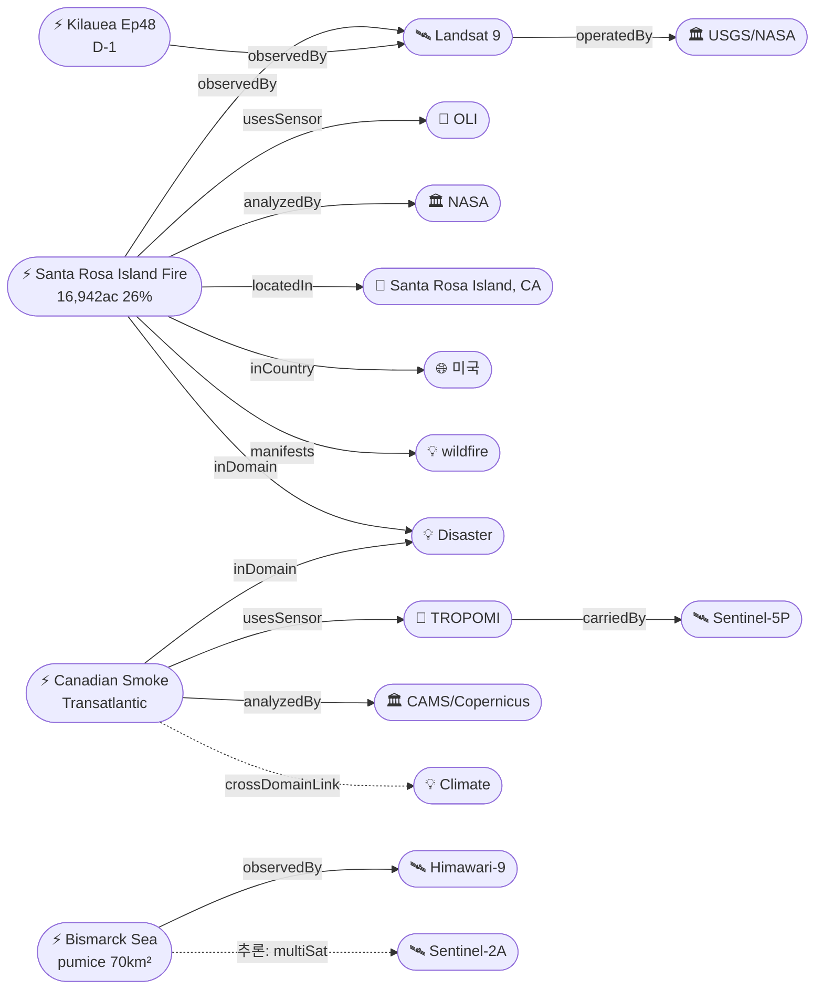

# 2026-05-21 위성영상 관측 이벤트 OSINT 일일 보고서

## 요약

신규 1건, 업데이트 1건. **Santa Rosa Island 산불**(캘리포니아 채널 제도)이 NASA Earth Observatory Image of the Day로 게재 — Landsat 9 OLI 거짓색 영상에서 16,942에이커(68.6km²) 소실 면적과 활성 화선이 적외선으로 확인됨. 원인은 조난 선원의 SOS 신호탄. **캐나다 산불 연기 대서양 횡단**이 CAMS에 의해 공식 확인 — TROPOMI + OMPS + EarthCare 3개 독립 위성이 5/18-19 그리스·동지중해 도달을 교차검증, 총 탄소 배출 56Mt(역대 2위). 다중 위성 교차검증 2건(캐나다 연기 3위성, Bismarck Sea 3위성 유지). 한반도 직접 이벤트 없음. Kilauea Ep48 예보 창 D-1(내일 5/22 시작) — 주의 환기.

## 오늘의 핵심 (Top 5)

| 순위 | 이벤트 | 도메인 | 위성 | 지역 | 신뢰도 |
|------|--------|--------|------|------|--------|
| 1 | Santa Rosa Island 산불 16,942ac ★신규 | Disaster | Landsat 9 (OLI) | Channel Islands, CA, US | 0.95 |
| 2 | 캐나다 산불 연기 대서양 횡단 ★업데이트 | Disaster→Climate | TROPOMI + OMPS + EarthCare | Manitoba→대서양→그리스 | 0.97 |
| 3 | Kilauea Ep48 예보 D-1 (5/22-26) | Disaster | Sentinel-2A + Landsat 9 | Hawaii, US | 0.95 |
| 4 | Bismarck Sea 부석 뗏목 70km²+ 열수분출 | Disaster | Himawari-9 + VIIRS + Sentinel-2A | Bismarck Sea, PG | 0.90→1.0 |
| 5 | Mayon Day 136+ 스트롬볼리안 | Disaster | Himawari-9 + Sentinel-2A | Albay, PH | 0.90 |

## 다중 위성 교차검증 이벤트

2건의 다중 위성/센서 교차검증 이벤트가 확인되었다.

1. **캐나다 산불 연기 대서양 횡단** — Sentinel-5P TROPOMI (ESA, 미량가스) + OMPS (NOAA Suomi-NPP, 자외선 에어로졸) + EarthCare (ESA/JAXA, 라이다+레이다). 3개 독립 기관(ESA vs NOAA vs ESA-JAXA) 교차검증 ✓. 일산화탄소(CO) 분석 + 에어로졸 광학깊이(AOD) + 연직 프로파일을 각각 독립적으로 확인. multiSatBoost +0.20 + tracegasBoost +0.15 + officialBoost +0.15 적용. **최종 신뢰도 0.97 (cap)**.
2. **Bismarck Sea 해저화산** — Himawari-9 (JMA/JAXA) + VIIRS (NOAA/NASA) + Sentinel-2A (ESA). 3개 독립 기관 교차검증 ✓ (유지). multiSatBoost +0.20 적용.

## 한반도 GeoFocus

금일 한반도·주변 해역 직접 신규/업데이트 이벤트 없음.

추적 중인 한반도 관련 항목:
- **동해 NLL 중국 어선 100척** — VIIRS 야간조명 + Sentinel-1 SAR 모니터링 (변동 없음)
- **CSIS Beyond Parallel 영변/소해/신포/판교** — WorldView-3 관측 (변동 없음)
- **KOMPSAT-7 커미셔닝** — 0.3m 해상도 영상 공개(3월). 6월말 교정 완료, 7월 정식운용 예정 (변동 없음)

## 자연재해 (Disaster)

### 1. Santa Rosa Island 산불 — Landsat 9 OLI 관측, 16,942ac ★신규
- **출처:** [NASA Earth Observatory](https://science.nasa.gov/earth/earth-observatory/fire-chars-santa-rosa-island/) / [CAL FIRE](https://www.fire.ca.gov/incidents/2026/5/15/santa-rosa-island-fire) / [Noozhawk](https://www.noozhawk.com/crews-increase-containment-santa-rosa-island-fire/)
- **위성·센서:** Landsat 9 (OLI, 30m 다분광 — 거짓색 밴드 7-5-3 + 자연색)
- **관측일:** 2026-05-16 (Landsat 9 촬영), 5/20 NASA EO 게재
- **위치:** Santa Rosa Island, Channel Islands National Park, California, US (33.95°N, 120.1°W)
- **현상:** wildfire
- **상태:** 신규
- **전후 비교:** 가용 — Landsat 9 거짓색 영상에서 소실면적(갈색) + 활성 화선(주황색 IR 시그니처) 구분. 자연색에서 태평양으로 유출되는 연기 플룸 확인.
- **분석:** 5/15 항공기에서 최초 발견. 원인은 **조난 선원(shipwrecked mariner)**이 구조 요청을 위해 발사한 **SOS 신호탄**(미 해안경비대 확인). 채널 제도 국립공원 내 제2대 섬의 남동부를 휩쓸어 **16,942에이커(68.6km²)** 소실, **26% 진압**. 초원·관목·차파랄 식생 연소. 무인 역사 구조물 2동 파괴(Johnson's Lee Equipment Shed, Wreck Line Camp Cabin). 캘리포니아 최대 활성 산불. Landsat 9 OLI의 단파적외선(SWIR) 밴드가 연기를 투과하여 소실면적 경계를 정밀하게 드러냄.

### 2. 캐나다 산불 연기 대서양 횡단 — CAMS 3위성 교차검증 확인 ★업데이트
- **출처:** [Copernicus CAMS](https://atmosphere.copernicus.eu/cams-tracks-smoke-intense-canadian-wildfires-reaching-europe) / [CBC News](https://www.cbc.ca/news/science/wildfire-smoke-europe-1.7550975) / [NOAA NESDIS](https://www.nesdis.noaa.gov/news/noaa-satellites-monitor-canadian-wildfires-and-smoke)
- **위성·센서:** Sentinel-5P (TROPOMI, 미량가스) + OMPS (Suomi-NPP, 자외선) + EarthCare (ESA/JAXA, 라이다)
- **관측일:** 2026-05-18 ~ 19 (대서양 횡단 확인)
- **위치:** Manitoba/Ontario/Saskatchewan, Canada → 대서양 → 그리스/동지중해
- **현상:** wildfire + air_pollution (교차 도메인)
- **상태:** 업데이트 (← 2026-05-20 "캐나다 MB/ON 산불 160+건")
- **분석:** CAMS(Copernicus Atmosphere Monitoring Service) 공식 확인 — 캐나다 Manitoba 산불 연기가 **대서양을 횡단하여 5/18-19 그리스·동지중해에 도달**. 고도 약 9,000m(300hPa)에서 이동. GFAS 추정 **총 탄소 배출 56Mt**(2023년에 이어 역대 2위). 지상 대기질에는 큰 영향 없으나 하늘이 뿌옇게 변하고 붉은/주황색 일몰 관측. 5월 후반 2차 대규모 연기 플룸이 대서양 진입 중. **pyroCb(화재 적란운)** 다수 형성 — GOES-18 ABI가 Alberta 상공에서 포착.

### 3. Kilauea Ep48 예보 — D-1, 내일 분수분출 가능 ★추적
- **출처:** [USGS HVO](https://www.usgs.gov/volcanoes/kilauea/volcano-updates) / [Hawaii Volcano Expeditions](https://hawaiivolcanoexpeditions.com/blog/lava-update-the-latest-eruptions-on-the-big-island/)
- **위성·센서:** Sentinel-2A (MSI 10m) + Landsat 9 (OLI/TIRS 30m)
- **위치:** Halemaʻumaʻu, Kilauea, Hawaii (19.41°N, 155.28°W)
- **현상:** volcanic_eruption
- **상태:** 추적 (← 2026-05-20 "Ep48 5/22-26")
- **분석:** ADVISORY/YELLOW 유지. Ep48 예보 창 **5/22(금)~5/26(화)** — 금일이 D-1. Uēkahuna 경사계 **9.5μrad 재팽창**(Ep47 종료 5/15 이후). 감속 추세이나 분출 임계치 접근 중. 양 분출구 야간 백열 지속. SO₂ 1,000~5,000 t/day.

### 4. Bismarck Sea 해저화산 — 부석 뗏목 70km²+, 열수분출 지속 ★추적
- **출처:** [VolcanoDiscovery](https://www.volcanodiscovery.com/centralbismarcksea/news/302838/Central-Bismarck-Sea-volcano-Admiralty-Islands-Papua-New-Guinea-new-hydrothermal-eruption-steam-lade.html) / [RNZ](https://www.rnz.co.nz/news/pacific/595786/could-the-rare-submarine-volcano-erupting-in-png-blow-big)
- **위성·센서:** Himawari-9 (AHI) + VIIRS + Sentinel-2A (MSI)
- **위치:** Central Bismarck Sea, PNG (-3.03°S, 147.78°E)
- **현상:** volcanic_eruption (submarine)
- **상태:** 추적 (← 2026-05-20 "열수분출 신국면")
- **분석:** 부석 뗏목 70km²+(52km 길이), 해수 변색 2,700km², 증기 기둥 3,000m. 1972년 이후 54년 만. 분출구가 해면 근접 수심으로 상승. 항해 위험 지속. "10년래 최대 심해 해저분출" 평가 유지.

추적 중:
- **Great Sitkin WATCH/ORANGE** — Sentinel-1 SAR 용암류 동쪽 지속 (변동 없음)
- **Mayon Alert Level 3** — Day 136+ 스트롬볼리안, SO₂ 2,785 t/day (변동 없음)
- **Bezymianny** — 열이상 + VAAC Tokyo advisory 지속 (변동 없음)
- **Shishaldin ADVISORY/YELLOW** — SO₂ TROPOMI 관측 (변동 없음)
- **Ibu** — Himawari-9 관측, 분출 지속 (변동 없음)
- **Everglades Max Road Fire** — 11,400ac 'contained and controlled' (변동 없음)

## 인간활동 (Human Activity)

금일 인간활동 도메인 신규/업데이트 이벤트 없음.

추적 중:
- **Kharg Island 원유 유출** — Sentinel-1/2/3 탐지, ~45,000km² 유막 (변동 없음)
- **Pemex Cantarell 원유 유출** — 3개월+ 지속, Sentinel-1/2 SAR+광학 (변동 없음)
- **Amazon Xingu 금광 496k ha 삼림파괴** — PlanetScope + Sentinel-2 (변동 없음)

## 기후·환경 (Climate & Environment)

### 1. 캐나다 산불 연기 — 대서양 횡단 기후 영향 ★업데이트 (자연재해 교차 참조)
- 56Mt 탄소 배출 — 2023년 이어 역대 2위
- TROPOMI CO + OMPS 에어로졸 + EarthCare 연직 프로파일 = 기후 시스템 영향 정량화
- 지상 대기질 유의미한 영향 없으나, 고고도 에어로졸이 유럽 일사량/복사수지에 단기 영향 가능

추적 중:
- **북극 해빙 최대면적 역대 최저 타이** — 14.29M km², ICESat-2 (변동 없음)
- **Hektoria Glacier 8km 후퇴** — Sentinel-1/2 관측 (변동 없음)
- **UNEP MARS 메탄 경보 23,000+ 관측** — Sentinel-5P/MethaneSAT (변동 없음)
- **Carbon Mapper Tanager-1** — 투르크메니스탄 78t/h 메탄 (변동 없음)

## 농업·해양 (Agriculture & Maritime)

금일 농업·해양 도메인 신규 이벤트 없음.

추적 중:
- **동해 NLL 중국 어선 100척** — VIIRS 야간조명 + Sentinel-1 SAR (변동 없음)

## 국방·안보 (Defense — OSINT 한정)

금일 국방·안보 도메인 신규 이벤트 없음.

추적 중:
- **남중국해 Antelope Reef** — 중국 1,490ac 매립, Sentinel-2 + WV-3 (변동 없음)
- **베트남 스프래틀리 216ha 확장** — PlanetScope + Sentinel-2 (변동 없음)
- **CSIS Beyond Parallel** — 영변/소해/신포/판교 분석, WV-3 (변동 없음)
- **이라크 이스라엘 비밀 기지** — PlanetScope + WV-3 (변동 없음)
- **MizarVision 중국기업** — GaoFen 활용 미군 기지 AI 분석 (위성 출처 일부 미확인, 변동 없음)

## 인도주의 (Humanitarian)

금일 인도주의 도메인 신규 이벤트 없음.

추적 중:
- **Bellingcat 남레바논** — PlanetScope 46/54 마을 파괴 인터랙티브 맵 (변동 없음)
- **오데사 인프라 피격** — Maxar WorldView Legion (변동 없음)

## 센서·플랫폼별 묶음

- **Landsat 9 (OLI/TIRS):** Santa Rosa Island 산불 거짓색 + 자연색 (신규), Kilauea 열이상 모니터링
- **Sentinel-5P (TROPOMI):** 캐나다 연기 CO 대서양 횡단, Shishaldin SO₂, UNEP MARS 메탄
- **OMPS (Suomi-NPP):** 캐나다 연기 자외선 에어로졸 횡단 확인
- **EarthCare (ESA/JAXA):** 캐나다 연기 연직 프로파일 확인
- **Sentinel-1 (SAR):** Great Sitkin 용암류, Kharg Island 유막, NLL 어선
- **Sentinel-2 (MSI):** Bismarck Sea 해수변색, 남중국해 매립, Amazon Xingu
- **Himawari-9 (AHI):** Bismarck Sea, Mayon, Bezymianny, Ibu
- **GOES-18 (ABI):** 캐나다 pyroCb, Everglades
- **VIIRS (Suomi-NPP/JPSS):** Bismarck Sea, 캐나다 산불 열점, NLL 어선 야간조명
- **PlanetScope:** Bellingcat 레바논, 베트남 Spratlys, Amazon Xingu
- **WorldView-3/Legion:** CSIS Beyond Parallel NK, 이라크 기지, 오데사
- **ICESat-2:** 북극 해빙
- **KOMPSAT-7:** 커미셔닝 0.3m (정식운용 전)

## 전후 비교(before/after) 영상 보유 이벤트

| 이벤트 | 위성/센서 | 비교 내용 |
|--------|----------|----------|
| Santa Rosa Island 산불 ★신규 | Landsat 9 OLI | 거짓색(밴드 7-5-3): 소실면적 갈색 + 활성 화선 주황색 IR vs 자연색: 연기 플룸 |
| Bellingcat 남레바논 | PlanetScope | 2026.03 vs 2026.05 비교 — 46/54 마을 파괴 |
| Bismarck Sea 해저화산 | Himawari-9/Sentinel-2A | 분출 전 해면 vs 현재 부석 뗏목 + 해수변색 |

## 미검증 의혹

| 이벤트 | 출처 | 미검증 사유 | 신뢰도 |
|--------|------|-----------|--------|
| DPRK 산불 보도 | 조선중앙TV | 위성영상 미제공, 독립 위성 확인 불가 | 0.55 |
| Fuego 화산 GT | INSIVUMEH | 지상 관측만, 위성 ash plume 미확인 | < 0.50 |
| MizarVision 중국기업 미군 기지 AI | defence-industry.eu | GaoFen 영상 추정이나 출처 위성 특정 불가 | 0.50 |

## 지식그래프

### 오늘의 주요 관계

1. **ent-evt-1201 (Santa Rosa Island Fire) → observedBy → sat-landsat9**: NASA EO Image of the Day로 Landsat 9 OLI 영상 공개. officialBoost +0.15.
2. **evt-1101-series (Canadian Smoke) → multiSatConfirmed → TROPOMI+OMPS+EarthCare**: 3개 독립 위성 플랫폼이 대서양 횡단 연기 이동을 교차 확인. multiSatBoost +0.20.
3. **evt-1101-series → crossDomainLink → dom-climate**: 산불(Disaster)에서 대기오염·탄소배출(Climate)로의 도메인 교차 관계 확인.

### 전체 지식그래프 시각화

## 온톨로지 변경

| 변경 유형 | 대상 | 근거 |
|----------|------|------|
| 새 Location | ent-loc-070: Santa Rosa Island, Channel Islands | NASA EO 산불 관측 위치 |
| 새 Event | ent-evt-1201: Santa Rosa Island Fire | Landsat 9 OLI, 16,942ac, 26% contained |
| 스키마 변경 | 없음 | — |

## 추론 결과

| 추론 | 신뢰도 | 근거 |
|------|--------|------|
| evt-1201 officialBoost +0.15 | 0.95 | NASA EO + CAL FIRE 공식 출처 |
| evt-1201 baCredibilityBoost +0.10 | 0.95 | Landsat 9 거짓색/자연색 before/after 가용 |
| evt-1201 priorityBoost +0.20 | 0.95 | 16,942ac 고위험 재해 |
| evt-1101-series multiSatBoost +0.20 | 0.97 | TROPOMI + OMPS + EarthCare 3위성 교차 |
| evt-1101-series tracegasBoost +0.15 | 0.97 | TROPOMI CO 대기 추적 |
| evt-1101-series officialBoost +0.15 | 0.97 | CAMS 공식 발표 |
| evt-1101-series crossDomainLink | 0.97 | Disaster(wildfire) → Climate(air_pollution, carbon) |

## 분석 및 평가

**금일 핵심:** 산불 활동이 북미를 중심으로 계속 주요 관측 대상. Santa Rosa Island 산불은 Landsat 9의 SWIR(단파적외선) 밴드가 연기를 투과하여 소실 면적을 정밀 매핑한 좋은 사례. 캐나다 산불 연기의 대서양 횡단은 TROPOMI/OMPS/EarthCare 3위성 교차검증으로 높은 신뢰도를 확보했으며, 2023년에 이어 역대 2위 배출량(56Mt C)으로 기후 영향이 우려됨.

**화산 활동:** Kilauea Ep48이 D-1(내일부터 분수분출 가능)로 긴박해짐. Bismarck Sea 해저화산은 열수분출 단계가 지속되며 부석 뗏목이 항해에 위험을 줌. Great Sitkin, Mayon, Bezymianny, Shishaldin, Ibu 5개 화산이 동시 활동 중.

**한반도:** 직접 관측 이벤트 없음. KOMPSAT-7 정식운용(7월 예정) 이후 한반도 관측 역량이 비약적으로 향상될 전망. 동해 NLL 중국 어선 모니터링과 CSIS Beyond Parallel 북한 시설 분석은 지속 추적 중.

**위성 활용 패턴:** 금일 가장 주목할 위성 활용은 (1) Landsat 9 OLI의 SWIR 밴드를 통한 산불 소실면적 정밀 매핑, (2) 3개 독립 위성(TROPOMI+OMPS+EarthCare)의 대기 추적 교차검증. 미량가스/에어로졸 센서가 산불의 기후 영향을 정량화하는 역할이 커지고 있음.

## 추적 항목

| 항목 | 최초 보고 | 상태 | 최신 업데이트 |
|------|----------|------|-------------|
| Santa Rosa Island Fire | 2026-05-21 | 활성 (26%) | 16,942ac, Landsat 9 관측 |
| 캐나다 MB/ON 산불 160+건 | 2026-05-19 | 활성 | 연기 대서양 횡단 확인, 56Mt C |
| Kilauea Ep48 예보 | 2026-05-15 | D-1 | 5/22-26 분출 예상, 9.5μrad |
| Bismarck Sea 해저화산 | 2026-05-13 | 활성 | 부석 70km²+, 열수분출 |
| Great Sitkin | 2021-07 | WATCH/ORANGE | SAR 용암류 동쪽 |
| Mayon | 2026-01 | Alert 3 | Day 136+ 스트롬볼리안 |
| Bezymianny | 2026-05-14 | VAAC advisory | 열이상 지속 |
| Shishaldin | 2026-05-07 | ADVISORY/YELLOW | SO₂ TROPOMI |
| Ibu | 2026-05-08 | 분출 지속 | Himawari-9 |
| Everglades Max Road | 2026-05-11 | 진압 완료 | 11,400ac controlled |
| Kharg Island 유출 | 2026-05-19 | 모니터링 | S1/S2/S3, ~45,000km² |
| Pemex Cantarell | 2026-05-07 | 지속 | 3개월+, 630km 해안 |
| 북극 해빙 최저 | 2026-05-11 | 추적 | 14.29M km² |
| Hektoria Glacier | 2026-05-07 | 추적 | 8km 후퇴 |
| 남중국해 매립 | 2026-05-07 | 추적 | Antelope 1,490ac + VN 216ha |
| NK 시설 | 2026-04-30 | 추적 | 영변/소해/신포/판교 |
| Bellingcat 남레바논 | 2026-05-14 | 추적 | 46/54 마을 파괴 |
| KOMPSAT-7 | 2026-05-07 | 커미셔닝 | 0.3m, 7월 운용 |

## 출처 목록

1. [Fire Chars Santa Rosa Island](https://science.nasa.gov/earth/earth-observatory/fire-chars-santa-rosa-island/) - NASA Earth Observatory, 2026-05-20
2. [Santa Rosa Island Fire](https://www.fire.ca.gov/incidents/2026/5/15/santa-rosa-island-fire) - CAL FIRE, 2026-05-21
3. [Santa Rosa Island Fire 26% Contained](https://www.noozhawk.com/crews-increase-containment-santa-rosa-island-fire/) - Noozhawk, 2026-05-20
4. [Shipwrecked mariner flare](https://abc7news.com/post/sos-flare-shipwrecked-mariner-may-have-sparked-16000-acre-brush-fire-santa-rosa-island-us-coast-guard-says/19133418/) - ABC7, 2026-05-20
5. [CAMS tracks smoke from Canadian wildfires reaching Europe](https://atmosphere.copernicus.eu/cams-tracks-smoke-intense-canadian-wildfires-reaching-europe) - Copernicus CAMS, 2026-05
6. [Canadian wildfire smoke blows over to Europe](https://www.cbc.ca/news/science/wildfire-smoke-europe-1.7550975) - CBC News, 2026-05
7. [NOAA Satellites Monitor Canadian Wildfires](https://www.nesdis.noaa.gov/news/noaa-satellites-monitor-canadian-wildfires-and-smoke) - NOAA NESDIS, 2026-05
8. [Kilauea Volcano Updates](https://www.usgs.gov/volcanoes/kilauea/volcano-updates) - USGS HVO, 2026-05-21
9. [Ep 48 expected by end of May](https://hawaiivolcanoexpeditions.com/blog/lava-update-the-latest-eruptions-on-the-big-island/) - Hawaii Volcano Expeditions, 2026-05
10. [Bismarck Sea hydrothermal eruption](https://www.volcanodiscovery.com/centralbismarcksea/news/302838/Central-Bismarck-Sea-volcano-Admiralty-Islands-Papua-New-Guinea-new-hydrothermal-eruption-steam-lade.html) - VolcanoDiscovery, 2026-05
11. [Could the rare submarine volcano blow big?](https://www.rnz.co.nz/news/pacific/595786/could-the-rare-submarine-volcano-erupting-in-png-blow-big) - RNZ, 2026-05
12. [Great Sitkin WATCH](https://volcanoes.usgs.gov/hans-public/notice/DOI-USGS-AVO-2026-05-17T19:37:35+00:00) - USGS AVO, 2026-05-17
13. [Shishaldin ADVISORY](https://volcanoes.usgs.gov/hans-public/notice/DOI-USGS-AVO-2026-05-12T20:06:22+00:00) - USGS AVO, 2026-05-12
14. [Mayon continuing eruption](https://www.volcanodiscovery.com/mayon/news/302249/) - VolcanoDiscovery, 2026-05-12
15. [Bezymianny VAAC advisory](https://www.volcanodiscovery.com/bezymianny/news/302342/vaac-advisory-2026-3.html) - VolcanoDiscovery, 2026-05
16. [Ibu volcanic activity](https://www.volcanodiscovery.com/volcano-activity/news/302395/) - VolcanoDiscovery, 2026-05
17. [Everglades fire](https://www.cbsnews.com/miami/news/florida-fire-map-miami-broward/) - CBS Miami, 2026-05
18. [Kharg Island oil spill](https://www.thenationalnews.com/business/energy/2026/05/13/oil-spill-near-irans-kharg-island-raises-questions-over-its-source/) - The National, 2026-05-13
19. [Pemex Gulf oil spill](https://www.tpr.org/environment/2026-05-07/pemex-linked-gulf-oil-spill-may-still-be-spreading-three-months-later-satellite-images-suggest) - TPR, 2026-05-07
20. [Amazon Xingu gold mining](https://www.washingtontimes.com/news/2026/may/5/gold-fueled-mining-rush-scarring-brazils-amazon-spiking-deforestation/) - Washington Times, 2026-05-05
21. [Arctic sea ice lowest extent 2026](https://www.spacewar.com/reports/Arctic_Winter_Sea_Ice_Hits_Lowest_Extent_on_Satellite_Record_in_2026_999.html) - SpaceWar, 2026
22. [Hektoria Glacier retreat](https://science.nasa.gov/earth/earth-observatory/record-setting-retreat-of-hektoria-glacier/) - NASA EO, 2026-05
23. [Antelope Reef largest island](https://amti.csis.org/antelope-reef-could-now-be-the-largest-island-in-the-south-china-sea/) - CSIS AMTI, 2026-05
24. [Vietnam Spratly overhaul](https://amti.csis.org/keeping-score-vietnams-spratly-island-overhaul-continues/) - CSIS AMTI, 2026-05
25. [CSIS Beyond Parallel NK UAVs](https://beyondparallel.csis.org/north-korean-uavs-at-panghyon/) - CSIS, 2026-05
26. [Bellingcat Lebanon demolitions](https://www.bellingcat.com/news/2026/05/14/satellite-imagery-shows-ongoing-demolitions-across-southern-lebanon/) - Bellingcat, 2026-05-14
27. [UNEP MARS methane expanded](https://www.unep.org/news-and-stories/press-release/satellite-methane-alerts-expanded-coal-and-waste-sectors-unep) - UNEP, 2026-05
28. [Carbon Mapper Tanager-1](https://www.planet.com/pulse/carbon-mapper-data-from-the-tanager-1-satellite-reveals-methane-and-carbon-dioxide-super-emitter-activity-around-the-world/) - Planet, 2026-05
29. [East Sea NLL Chinese fishing](https://www.g-enews.com/article/General-News/2026/05/202605041507265965de70f162d1_1) - G-ENEWS, 2026-05-04
30. [KOMPSAT-7 ultra-high resolution](https://en.sedaily.com/technology/2026/03/18/korea-unveils-ultra-high-resolution-satellite-images) - Seoul Economic Daily, 2026-03-18
31. [Odesa infrastructure damage](https://news.satnews.com/2022/05/13/maxars-satellite-imagery-brings-to-light-additional-damage-to-the-ukraine-by-russian-attack-forces/) - SatNews, 2026
