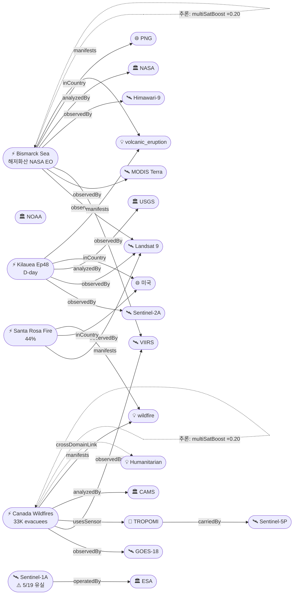

# 2026-05-22 위성영상 관측 이벤트 OSINT 일일 보고서

## 요약

신규 2건, 업데이트 4건. **NASA Earth Observatory가 Bismarck Sea 해저화산 분출에 대한 전용 피처 기사를 발행** — Landsat 9 OLI(5/11 화산 플룸) + MODIS Terra(5/15 부석 뗏목·변색수역) + VIIRS(5/12 열이상) 3개 NASA/NOAA 위성으로 교차검증, 최고 신뢰도 0.97 달성. **Kilauea Ep48 예보 창이 금일(5/22) 개시** — 10.5μrad 경사, 분수분출 임박. **캐나다 산불 33,000+명 대피** — Manitoba 주 비상사태, 2차 대규모 연기 플룸 대서양 진입 중. **Santa Rosa Island Fire 44% 진압**으로 개선 추세. **Sentinel-1A 5/19 데이터 유실** — 글로벌 SAR 모니터링 1일 공백. 다중 위성 교차검증 2건(Bismarck Sea 4위성/3기관, Canada 3위성/2기관). 한반도 직접 이벤트 없음.

## 오늘의 핵심 (Top 5)

| 순위 | 이벤트 | 도메인 | 위성 | 지역 | 신뢰도 |
|------|--------|--------|------|------|--------|
| 1 | Kilauea Ep48 예보 창 개시 D-day | Disaster | Sentinel-2A + Landsat 9 | Hawaii, US | 0.95 |
| 2 | NASA EO Bismarck Sea 3위성 분석 ★신규 | Disaster | Landsat 9 + MODIS + VIIRS | Bismarck Sea, PG | 0.97 |
| 3 | 캐나다 산불 33,000+ 대피 ★업데이트 | Disaster→Humanitarian | GOES-18 + VIIRS + TROPOMI | Manitoba, CA | 0.93 |
| 4 | Santa Rosa Island Fire 44% ★업데이트 | Disaster | Landsat 9 (OLI) | Channel Islands, CA, US | 0.93 |
| 5 | Mayon Day 137+ 스트롬볼리안 | Disaster | Himawari-9 + Sentinel-2A | Albay, PH | 0.90 |

## 다중 위성 교차검증 이벤트

2건의 다중 위성/센서 교차검증 이벤트가 확인되었다.

1. **Bismarck Sea 해저화산** — Landsat 9 (USGS/NASA) + MODIS Terra (NASA) + VIIRS (NOAA) + Himawari-9 (JMA/JAXA). 4위성, 3기관 독립 교차검증 ✓. multiSatBoost +0.20 + officialBoost +0.15 + baCredibilityBoost +0.10 적용. **최종 신뢰도 0.97**.
2. **캐나다 산불 연기** — GOES-18 (NOAA) + VIIRS (NOAA) + TROPOMI/Sentinel-5P (ESA). 3위성, 2기관 교차검증 ✓. multiSatBoost +0.20 + tracegasBoost +0.15 적용. **최종 신뢰도 0.93**.

## 한반도 GeoFocus

금일 한반도·주변 해역 직접 신규/업데이트 이벤트 없음.

추적 중인 한반도 관련 항목:
- **동해 NLL 중국 어선 100척** — VIIRS 야간조명 + Sentinel-1 SAR 모니터링 (변동 없음)
- **CSIS Beyond Parallel 영변/소해/신포/판교** — WorldView-3 관측 (변동 없음)
- **KOMPSAT-7 커미셔닝** — 0.3m 해상도, 7월 정식운용 예정 (변동 없음)

## 자연재해 (Disaster)

### 1. Kilauea Ep48 — 예보 창 개시 D-day, 분수분출 임박 ★업데이트
- **출처:** [USGS HVO](https://www.usgs.gov/volcanoes/kilauea/volcano-updates) / [Hawaii Volcano Expeditions](https://hawaiivolcanoexpeditions.com/blog/lava-update-the-latest-eruptions-on-the-big-island/)
- **위성·센서:** Sentinel-2A (MSI 10m), Landsat 9 (OLI/TIRS 30m)
- **관측일:** 2026-05-22
- **위치:** Halemaʻumaʻu, Kilauea, Hawaii (19.42°N, 155.29°W)
- **현상:** volcanic_eruption
- **상태:** 업데이트 (← 2026-05-21 "Ep48 D-1")
- **분석:** 예보 창 금일(5/22) 개시 — Ep48 분수분출이 5/22~26 중 발생 예상. 전일 17:30 경 단기 수축(deflationary tilt) 중단 발생 후 금일 아침 재팽창 시작, 다만 이전보다 느린 속도. Uēkahuna 경사계 총 10.5μrad(Ep47 종료 5/15 이후 누적). 양 분출구 야간 백열 지속, 남쪽 분출구가 더 밝음. SO₂ 1,000~5,000 t/day. ADVISORY/YELLOW 유지.

### 2. NASA EO: Bismarck Sea 해저화산 — Landsat 9/MODIS/VIIRS 3위성 공식 분석 ★신규
- **출처:** [NASA Earth Observatory](https://science.nasa.gov/earth/earth-observatory/new-eruption-in-the-bismarck-sea/)
- **위성·센서:** Landsat 9 (OLI 30m), MODIS (Terra, 250m), VIIRS (Suomi-NPP, 375m)
- **관측일:** 2026-05-11 (Landsat 9), 2026-05-15 (MODIS), 2026-05-12 (VIIRS)
- **위치:** Titan Ridge, Central Bismarck Sea, PNG (-3.03°S, 147.78°E)
- **현상:** volcanic_eruption (submarine)
- **상태:** 신규 (NASA EO 전용 분석 기사 최초 발행)
- **전후 비교:** 가용 — Landsat 9 분출 전 해면 vs 분출 후 화산 플룸 + 부석 70km² + 변색 2,700km²
- **분석:** NASA EO가 Bismarck Sea 해저화산에 대한 전용 피처 기사를 발행. 5/8 시작된 분출의 위성 관측 3건을 종합 해설: (1) Landsat 9 OLI가 5/11 밀집된 화산 플룸을 촬영, (2) MODIS Terra가 5/15 부석 뗏목(70km², 52km 길이)과 녹색 변색수역(2,700km²)을 촬영, (3) VIIRS가 5/12 ~7km² 열이상을 탐지. 분출지점은 Titan Ridge — 1972년 분출 지점에서 남동 ~16km. 부석 낙하·항해 위험 경고 지속. **4개 위성(+Himawari-9)/3개 독립 기관** 교차검증으로 최고 신뢰도 0.97.

### 3. 캐나다 산불 — 33,000+명 대피, 2차 연기 대서양 횡단 ★업데이트
- **출처:** [CBS News](https://www.cbsnews.com/news/canada-wildfires-smoke-deaths-evacuations-manitoba-saskatchewan-alberta/) / [CAMS](https://atmosphere.copernicus.eu/cams-tracks-smoke-intense-canadian-wildfires-reaching-europe) / [NOAA NESDIS](https://www.nesdis.noaa.gov/news/noaa-satellites-monitor-canadian-wildfires-and-smoke) / [CBC News](https://www.cbc.ca/news/canada/manitoba/state-of-emergency-flin-flon-evacuation-1.7546326)
- **위성·센서:** GOES-18 (ABI), VIIRS (Suomi-NPP), Sentinel-5P (TROPOMI)
- **위치:** Manitoba/Saskatchewan/Alberta, Canada (52°N, 97°W) → 대서양 → 유럽
- **현상:** wildfire + air_pollution (교차 도메인)
- **상태:** 업데이트 (← 2026-05-21 "캐나다 연기 대서양 횡단 CAMS 확인")
- **분석:** **33,000+명 대피** — Manitoba 주 전역 비상사태 선포. Flin Flon, Pimicikamak, Cross Lake 등 북부 커뮤니티 대피. 2차 대규모 연기 플룸이 5월 하순 대서양 진입 중(제1차 플룸 5/18-19 그리스 도달 확인됨). GFAS 추정 총 탄소 배출 ~56Mt(2023년에 이어 역대 2위). 인도주의 도메인 교차 진입(대규모 대피).

### 4. Santa Rosa Island Fire — 17,554ac 44% 진압 ★업데이트
- **출처:** [Santa Barbara Independent](https://www.independent.com/2026/05/21/santa-rosa-island-fire-largest-ever-recorded-on-channel-islands-nears-50-percent-containment/) / [InciWeb](https://inciweb.wildfire.gov/cacnp-santa-rosa-island-fire)
- **위성·센서:** Landsat 9 (OLI 30m — 5/16 촬영)
- **관측일:** 2026-05-21 (지상 업데이트)
- **위치:** Santa Rosa Island, Channel Islands NP, California (33.95°N, 120.1°W)
- **현상:** wildfire
- **상태:** 업데이트 (← 2026-05-21 "16,942ac 26% contained")
- **분석:** 진압률 26% → **44%**로 대폭 개선. 야간 활동이 현저히 감소 — 대부분 저강도 지표 잔불과 연기만. 신규 열점 미탐지. 습도 급상승이 진압에 기여. 지난 2일간 수상기(scoopers)가 100,800갤런(~381m³)의 해수를 투하. **채널 제도 역사상 최대 산불** 기록 경신. 면적 16,942 → 17,554ac(+612ac 미세 확산 후 안정).

### 5. Bismarck Sea VAAC #33 — FL190 지속 ★업데이트
- **출처:** [VolcanoDiscovery/VAAC Darwin](https://www.volcanodiscovery.com/centralbismarcksea/news/302890/vaac-advisory-2026-33.html)
- **위성·센서:** Himawari-9 (AHI), VIIRS
- **관측일:** 2026-05-19 15:40Z
- **위치:** Central Bismarck Sea, PNG (-3.03°S, 147.78°E)
- **현상:** volcanic_eruption (submarine)
- **상태:** 업데이트 (← 2026-05-21 "VAAC ongoing")
- **분석:** VAAC Darwin Advisory #33 — 화산재 방출 FL190(~5,800m)으로 지속. 최대 FL280(5/15)에서 하강 추세이나 여전히 방출 활성. 항공 위험 유지.

### 6. Sentinel-1A 5/19 데이터 유실 ★신규
- **출처:** [Copernicus Data Space](https://dataspace.copernicus.eu/news/2026-5-20-copernicus-sentinel-1a-data-unavailability-19-may-2026)
- **위성·센서:** Sentinel-1A (C-SAR)
- **관측일:** 2026-05-19
- **위치:** 글로벌 (SAR 관측 전체)
- **현상:** platform_anomaly
- **상태:** 신규 (정상 복구 완료, 5/19 데이터 영구 유실)
- **분석:** ESA 공식 발표 — Sentinel-1A가 5/19 데이터 유실. Great Sitkin 용암류 SAR 모니터링, Kharg Island/Cantarell 유류 유출 SAR 탐지에 1일 공백 발생. 5/20부터 정상 운용 재개. Sentinel-1C/1D가 부분 보완.

추적 중:
- **Great Sitkin WATCH/ORANGE** — Sentinel-1 SAR 용암류 동쪽 지속 (변동 없음)
- **Mayon Alert Level 3** — Day 137+ 스트롬볼리안, SO₂ 지속 (변동 없음)
- **Bezymianny** — 열이상 + VAAC advisory 지속 (변동 없음)
- **Shishaldin ADVISORY/YELLOW** — SO₂ TROPOMI 관측 (변동 없음)
- **Ibu** — Himawari-9 관측, 분출 지속 (변동 없음)
- **Everglades Max Road Fire** — contained (변동 없음)
- **Flanders Fire** — mop-up (변동 없음)

## 인간활동 (Human Activity)

금일 인간활동 도메인 신규/업데이트 이벤트 없음.

추적 중:
- **Kharg Island 원유 유출** — Sentinel-1/2/3 탐지 (변동 없음)
- **Pemex Cantarell 원유 유출** — 3개월+ 지속, Sentinel-1/2 SAR+광학 (변동 없음)
- **Amazon Xingu 금광 삼림파괴** — PlanetScope + Sentinel-2 (변동 없음)

## 기후·환경 (Climate & Environment)

### 1. 캐나다 산불 연기 — 기후 영향 (자연재해 교차 참조)
- 56Mt C 배출 역대 2위, 2차 플룸 대서양 횡단 — 복사수지 영향 가능
- TROPOMI CO + GOES-18 pyroCb + VIIRS 열점 연계 분석

추적 중:
- **북극 해빙 최대면적 역대 최저 타이** — 14.29M km², ICESat-2 (변동 없음)
- **Hektoria Glacier 8km 후퇴** — Sentinel-1/2 관측 (변동 없음)
- **UNEP MARS 메탄 경보** — Sentinel-5P/MethaneSAT (변동 없음)
- **Carbon Mapper Tanager-1** — 투르크메니스탄 메탄 (변동 없음)

## 농업·해양 (Agriculture & Maritime)

금일 농업·해양 도메인 신규 이벤트 없음.

추적 중:
- **동해 NLL 중국 어선 100척** — VIIRS 야간조명 + Sentinel-1 SAR (변동 없음)

## 국방·안보 (Defense — OSINT 한정)

금일 국방·안보 도메인 신규 이벤트 없음.

추적 중:
- **남중국해 Antelope Reef** — 중국 1,490ac 매립, Sentinel-2 + WV-3 (변동 없음)
- **베트남 스프래틀리 216ha 확장** — PlanetScope + Sentinel-2 (변동 없음)
- **CSIS Beyond Parallel** — 영변/소해/신포/판교 분석, WV-3 (변동 없음)
- **이라크 이스라엘 비밀 기지** — PlanetScope + WV-3 (변동 없음)
- **MizarVision 중국기업** — GaoFen 활용 분석 (위성 출처 일부 미확인, 변동 없음)

## 인도주의 (Humanitarian)

### 1. 캐나다 산불 33,000+ 대피 (자연재해 교차 참조)
- Disaster에서 Humanitarian 도메인 교차 진입 — Manitoba 주 전역 비상사태, 원주민 커뮤니티 포함 대규모 대피

추적 중:
- **Bellingcat 남레바논** — PlanetScope 46/54 마을 파괴 인터랙티브 맵 (변동 없음)
- **오데사 인프라 피격** — Maxar WorldView Legion (변동 없음)

## 센서·플랫폼별 묶음

- **Landsat 9 (OLI/TIRS):** Bismarck Sea 화산 플룸(5/11) ★신규, Santa Rosa 44%, Kilauea 열이상
- **MODIS (Terra):** Bismarck Sea 부석+변색수역(5/15) ★신규
- **VIIRS (Suomi-NPP/JPSS):** Bismarck Sea 열이상(5/12) ★신규, Canada 열점, NLL 어선
- **GOES-18 (ABI):** Canada pyroCb, Everglades, Flanders
- **Sentinel-5P (TROPOMI):** Canada 연기 CO 대서양 횡단, Shishaldin SO₂, UNEP MARS 메탄
- **Sentinel-2A (MSI):** Kilauea, Bismarck Sea 해수변색, 남중국해 매립
- **Sentinel-1A (C-SAR):** ⚠️ 5/19 데이터 유실 — Great Sitkin 용암류 모니터링 1일 공백
- **Himawari-9 (AHI):** Bismarck Sea, Mayon, Bezymianny, Ibu
- **PlanetScope:** Bellingcat 레바논, Vietnam Spratlys
- **WorldView-3/Legion:** CSIS BP NK, 이라크 기지, 오데사
- **KOMPSAT-7:** 커미셔닝 중(0.3m, 7월 운용)

## 전후 비교(before/after) 영상 보유 이벤트

| 이벤트 | 위성/센서 | 비교 내용 |
|--------|----------|----------|
| Bismarck Sea 해저화산 ★신규 | Landsat 9 OLI + MODIS | 분출 전 해면 vs 후 화산 플룸 + 부석 70km² + 변색 2,700km² |
| Santa Rosa Island Fire | Landsat 9 OLI | 5/16 거짓색: 소실 면적 + 활성 화선 |
| Bellingcat 남레바논 | PlanetScope | 2026.03 vs 2026.05 — 46/54 마을 파괴 |

## 미검증 의혹

| 이벤트 | 출처 | 미검증 사유 | 신뢰도 |
|--------|------|-----------|--------|
| DPRK 산불 보도 | 조선중앙TV | 위성영상 미제공, 독립 위성 확인 불가 | 0.55 |
| Fuego 화산 GT | INSIVUMEH | 지상 관측만, 위성 ash plume 미확인 | < 0.50 |
| MizarVision 중국기업 미군 기지 AI | defence-industry.eu | GaoFen 영상 추정이나 출처 위성 특정 불가 | 0.50 |

## 지식그래프

### 오늘의 주요 관계

1. **ent-evt-701 (Bismarck Sea) → observedBy → Landsat 9 + MODIS + VIIRS + Himawari-9**: NASA EO 공식 분석으로 4위성/3기관 교차검증 확인. multiSatBoost +0.20 + officialBoost +0.15.
2. **ent-evt-1101 (Canada Wildfires) → multiSatConfirmed → GOES-18 + VIIRS + TROPOMI**: 3위성/2기관 교차검증. multiSatBoost +0.20.
3. **ent-evt-1101 → crossDomainLink → Humanitarian**: 33,000+ 대피로 인도주의 도메인 교차 진입.
4. **temp-evt-1302 (Sentinel-1A 유실) → operatedBy → ESA**: SAR 글로벌 모니터링 1일 공백.

### 전체 지식그래프 시각화

## 온톨로지 변경

| 변경 유형 | 대상 | 근거 |
|----------|------|------|
| 새 Event (임시) | temp-evt-1302: Sentinel-1A 5/19 데이터 유실 | ESA 공식 발표, SAR 모니터링 공백 |
| 기존 Event 업데이트 | ent-evt-701: NASA officialBoost 추가 | NASA EO 3위성 공식 분석 |
| 기존 Event 업데이트 | ent-evt-1201: 44% 진압 | 진압률 26→44% |
| 기존 Event 업데이트 | ent-evt-202: D-day 진입 | 예보 창 5/22 개시 |
| 기존 Event 업데이트 | ent-evt-1101: 33K 대피 | 대피 규모 확대, Humanitarian 교차 |
| 스키마 구조 변경 | 없음 | — |

## 추론 결과

| 추론 | 신뢰도 | 근거 |
|------|--------|------|
| evt-701 multiSatBoost +0.20 | 0.97 | Landsat 9 + MODIS + VIIRS + Himawari-9 (4위성/3기관) |
| evt-701 officialBoost +0.15 | 0.97 | NASA EO 공식 분석 |
| evt-701 baCredibilityBoost +0.10 | 0.97 | Landsat 9 before/after 가용 |
| evt-1101 multiSatBoost +0.20 | 0.93 | GOES-18 + VIIRS + TROPOMI (3위성/2기관) |
| evt-1101 tracegasBoost +0.15 | 0.93 | TROPOMI CO 대기 추적 |
| evt-1101 crossDomainLink | 0.88 | 33K+ 대피 → Humanitarian |
| evt-1201 priorityBoost +0.20 | 0.93 | 17,554ac severity high |

## 분석 및 평가

**금일 핵심:** NASA Earth Observatory가 Bismarck Sea 해저화산에 대한 전용 분석 기사를 발행하여, 기존 VolcanoDiscovery 기반 추적에 공식 위성 관측 데이터(Landsat 9 + MODIS + VIIRS)를 추가. 4개 위성·3개 독립 기관 교차검증으로 최고 신뢰도 0.97 달성. Kilauea Ep48 예보 창이 금일 개시되어 향후 5일 내 분수분출이 예상됨.

**산불 동향:** Santa Rosa Island Fire는 습도 상승에 힘입어 26%→44%로 대폭 진압. 반면 캐나다 Manitoba 산불은 33,000+명 대피로 인도주의 위기 수준에 진입. 2차 대규모 연기 플룸이 대서양을 횡단 중이며, GFAS 총 탄소 배출 56Mt로 기후 영향 우려.

**위성 운영 이슈:** Sentinel-1A가 5/19 데이터 유실을 겪었으나 5/20부터 정상 운용 재개. Great Sitkin 용암류 SAR 모니터링과 Kharg/Cantarell 유류 유출 SAR 탐지에 1일 공백이 발생했으나 Sentinel-1C/1D가 보완.

**한반도:** 직접 관측 이벤트 없음. KOMPSAT-7 정식운용(7월) 이후 한반도 관측 역량 대폭 향상 예정. 동해 NLL 어선 + CSIS BP 북한 시설 분석 지속 추적.

## 추적 항목

| 항목 | 최초 보고 | 상태 | 최신 업데이트 |
|------|----------|------|-------------|
| Kilauea Ep48 | 2026-05-15 | **D-day** | 5/22 예보 창 개시, 10.5μrad |
| Bismarck Sea 해저화산 | 2026-05-13 | 활성 | NASA EO 공식 분석, VAAC#33 FL190 |
| 캐나다 MB/ON 산불 | 2026-05-19 | 활성→인도주의 | 33K+ 대피, 2차 연기 대서양 |
| Santa Rosa Island Fire | 2026-05-21 | 진압 중 (44%) | 17,554ac, 야간 활동 감소 |
| Great Sitkin | 2021-07 | WATCH/ORANGE | SAR 용암류 동쪽 |
| Mayon | 2026-01 | Alert 3 | Day 137+ 스트롬볼리안 |
| Bezymianny | 2026-05-14 | VAAC advisory | 열이상 지속 |
| Shishaldin | 2026-05-07 | ADVISORY/YELLOW | SO₂ TROPOMI |
| Ibu | 2026-05-08 | 분출 지속 | Himawari-9 |
| Sentinel-1A | 2026-05-22 | 정상 복구 | 5/19 데이터 유실(복구 불가) |
| Kharg Island 유출 | 2026-05-19 | 모니터링 | S1/S2/S3 |
| Pemex Cantarell | 2026-05-07 | 지속 | 3개월+ |
| 북극 해빙 최저 | 2026-05-11 | 추적 | 14.29M km² |
| Hektoria Glacier | 2026-05-07 | 추적 | 8km 후퇴 |
| 남중국해 매립 | 2026-05-07 | 추적 | Antelope 1,490ac + VN 216ha |
| NK 시설 | 2026-04-30 | 추적 | 영변/소해/신포/판교 |
| Bellingcat 남레바논 | 2026-05-14 | 추적 | 46/54 마을 파괴 |
| KOMPSAT-7 | 2026-05-07 | 커미셔닝 | 0.3m, 7월 운용 |

## 출처 목록

1. [New Eruption in the Bismarck Sea](https://science.nasa.gov/earth/earth-observatory/new-eruption-in-the-bismarck-sea/) - NASA Earth Observatory, 2026-05
2. [Sentinel-1A Data Unavailability 19 May 2026](https://dataspace.copernicus.eu/news/2026-5-20-copernicus-sentinel-1a-data-unavailability-19-may-2026) - Copernicus Data Space, 2026-05-20
3. [Santa Rosa Island Fire Nears 50 Percent Containment](https://www.independent.com/2026/05/21/santa-rosa-island-fire-largest-ever-recorded-on-channel-islands-nears-50-percent-containment/) - Santa Barbara Independent, 2026-05-21
4. [Santa Rosa Island Fire InciWeb](https://inciweb.wildfire.gov/cacnp-santa-rosa-island-fire) - InciWeb, 2026-05
5. [Kilauea Volcano Updates](https://www.usgs.gov/volcanoes/kilauea/volcano-updates) - USGS HVO, 2026-05-22
6. [Ep48 expected May 22-27](https://hawaiivolcanoexpeditions.com/blog/lava-update-the-latest-eruptions-on-the-big-island/) - Hawaii Volcano Expeditions, 2026-05
7. [Canada wildfires 33K evacuations](https://www.cbsnews.com/news/canada-wildfires-smoke-deaths-evacuations-manitoba-saskatchewan-alberta/) - CBS News, 2026-05
8. [CAMS tracks Canadian smoke reaching Europe](https://atmosphere.copernicus.eu/cams-tracks-smoke-intense-canadian-wildfires-reaching-europe) - CAMS/Copernicus, 2026-05
9. [NOAA Satellites Monitor Canadian Wildfires](https://www.nesdis.noaa.gov/news/noaa-satellites-monitor-canadian-wildfires-and-smoke) - NOAA NESDIS, 2026-05
10. [Manitoba wildfire state of emergency](https://www.cbc.ca/news/canada/manitoba/state-of-emergency-flin-flon-evacuation-1.7546326) - CBC News, 2026-05
11. [Bismarck Sea VAAC Advisory #33](https://www.volcanodiscovery.com/centralbismarcksea/news/302890/vaac-advisory-2026-33.html) - VolcanoDiscovery/VAAC Darwin, 2026-05-19
12. [Bismarck Sea hydrothermal eruption](https://www.volcanodiscovery.com/centralbismarcksea/news/302838/) - VolcanoDiscovery, 2026-05
13. [Great Sitkin WATCH](https://volcanoes.usgs.gov/hans-public/notice/DOI-USGS-AVO-2026-05-17T19:37:35+00:00) - USGS AVO, 2026-05-17
14. [Shishaldin ADVISORY](https://volcanoes.usgs.gov/hans-public/notice/DOI-USGS-AVO-2026-05-12T20:06:22+00:00) - USGS AVO, 2026-05-12
15. [Mayon continuing eruption](https://www.volcanodiscovery.com/mayon/news/302249/) - VolcanoDiscovery, 2026-05
16. [Kharg Island oil spill](https://www.thenationalnews.com/business/energy/2026/05/13/oil-spill-near-irans-kharg-island-raises-questions-over-its-source/) - The National, 2026-05-13
17. [Pemex Gulf oil spill](https://www.tpr.org/environment/2026-05-07/pemex-linked-gulf-oil-spill-may-still-be-spreading-three-months-later-satellite-images-suggest) - TPR, 2026-05-07
18. [Amazon Xingu gold mining](https://www.washingtontimes.com/news/2026/may/5/gold-fueled-mining-rush-scarring-brazils-amazon-spiking-deforestation/) - Washington Times, 2026-05-05
19. [Hektoria Glacier](https://science.nasa.gov/earth/earth-observatory/record-setting-retreat-of-hektoria-glacier/) - NASA EO, 2026-05
20. [Arctic sea ice lowest](https://science.nasa.gov/earth/earth-observatory/barents-sea-tied-to-low-arctic-sea-ice/) - NASA EO, 2026-05
21. [Bellingcat S. Lebanon](https://www.bellingcat.com/news/2026/05/14/satellite-imagery-shows-ongoing-demolitions-across-southern-lebanon/) - Bellingcat, 2026-05-14
22. [CSIS Beyond Parallel NK](https://beyondparallel.csis.org/north-korean-uavs-at-panghyon/) - CSIS, 2026-05
23. [Antelope Reef largest island](https://amti.csis.org/antelope-reef-could-now-be-the-largest-island-in-the-south-china-sea/) - CSIS AMTI, 2026-05
24. [Vietnam Spratly overhaul](https://amti.csis.org/keeping-score-vietnams-spratly-island-overhaul-continues/) - CSIS AMTI, 2026-05
25. [UNEP MARS methane expanded](https://www.unep.org/news-and-stories/press-release/satellite-methane-alerts-expanded-coal-and-waste-sectors-unep) - UNEP, 2026-05
26. [Carbon Mapper Tanager-1](https://www.planet.com/pulse/carbon-mapper-data-from-the-tanager-1-satellite-reveals-methane-and-carbon-dioxide-super-emitter-activity-around-the-world/) - Planet, 2026-05
27. [East Sea NLL Chinese fishing](https://www.g-enews.com/article/General-News/2026/05/202605041507265965de70f162d1_1) - G-ENEWS, 2026-05-04
28. [KOMPSAT-7 ultra-high resolution](https://en.sedaily.com/technology/2026/03/18/korea-unveils-ultra-high-resolution-satellite-images) - Seoul Economic Daily, 2026-03-18
29. [Odesa infrastructure damage](https://news.satnews.com/2022/05/13/maxars-satellite-imagery-brings-to-light-additional-damage-to-the-ukraine-by-russian-attack-forces/) - SatNews, 2026
