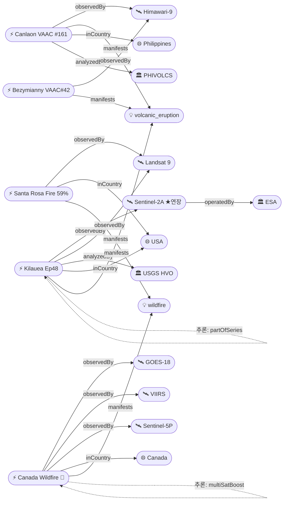

# 2026-05-23 위성영상 관측 이벤트 OSINT 일일 보고서

## 요약

신규 2건, 업데이트 5건. **캐나다 Manitoba 산불에서 첫 민간인 사망자 2명 발생** — Lac du Bonnet 주민, 33,400+명 대피 지속 중이며 Garden Hill First Nation(인구 ~4,600)에 군 투입 대피 진행. **Kilauea Ep48 예보 창이 5/24-27로 조정** — 경사계 11.4μrad 누적, 분출 D-1~D+4. **Santa Rosa Island Fire 59% 진압**으로 대폭 개선(전일 44%), Torrey Pines 보존 확인. **Canlaon(Kanlaon) 화산 신규 VAAC Advisory #161** — 5/22 08:01Z FL090, 필리핀 네그로스 섬. **Sentinel-2A 연장 캠페인** — ESA가 원래 2026-05 종료 예정이던 Sentinel-2A의 운용을 2026년 말까지 연장 확정. 다중 위성 교차검증 1건(캐나다 산불 GOES-18+VIIRS+TROPOMI). 한반도 직접 이벤트 없음.

## 오늘의 핵심 (Top 5)

| 순위 | 이벤트 | 도메인 | 위성 | 지역 | 신뢰도 |
|------|--------|--------|------|------|--------|
| 1 | 캐나다 산불 2명 사망, 33,400+ 대피 ★업데이트 | Disaster→Humanitarian | GOES-18 + VIIRS + TROPOMI | Manitoba, CA | 0.93 |
| 2 | Kilauea Ep48 예보 5/24-27, 11.4μrad ★업데이트 | Disaster | Sentinel-2A + Landsat 9 | Hawaii, US | 0.95 |
| 3 | Santa Rosa Island Fire 59% 진압 ★업데이트 | Disaster | Landsat 9 (OLI) | Channel Islands, CA, US | 0.93 |
| 4 | Canlaon 화산 VAAC #161 ★신규 | Disaster | Himawari-9 | Negros, PH | 0.82 |
| 5 | Bezymianny 23,000ft VAAC #42 ★업데이트 | Disaster | Himawari-9 + VIIRS | Kamchatka, RU | 0.85 |

## 다중 위성 교차검증 이벤트

1건의 다중 위성/센서 교차검증 이벤트가 확인되었다.

1. **캐나다 Manitoba 산불** — GOES-18 (NOAA) + VIIRS (NOAA) + TROPOMI/Sentinel-5P (ESA). 3위성, 2기관 교차검증 ✓. multiSatBoost +0.20 적용. **최종 신뢰도 0.93**.

## 한반도 GeoFocus

금일 한반도·주변 해역 직접 신규/업데이트 이벤트 없음.

추적 중인 한반도 관련 항목:
- **동해 NLL 중국 어선 100척** — VIIRS 야간조명 + Sentinel-1 SAR 모니터링 (변동 없음)
- **CSIS Beyond Parallel 영변/소해/신포/판교/신풍동** — WorldView-3 관측 (변동 없음)
- **KOMPSAT-7 커미셔닝** — 0.3m 해상도, 7월 정식운용 예정 (변동 없음)

## 자연재해 (Disaster)

### 1. 캐나다 산불 — 첫 민간인 사망 2명, 33,400+ 대피 확대, Garden Hill FN 군 투입 ★업데이트
- **출처:** [CBC News](https://www.cbc.ca/news/canada/manitoba/garden-hill-first-nation-wildfire-evacuation-manitoba-1.7581550) / [CBS News](https://www.cbsnews.com/news/canada-wildfires-smoke-deaths-evacuations-manitoba-saskatchewan-alberta/)
- **위성·센서:** GOES-18 (ABI), VIIRS (Suomi-NPP), Sentinel-5P (TROPOMI)
- **관측일:** 2026-05-23
- **위치:** Manitoba/Saskatchewan/Alberta, Canada (53.8°N, 94.1°W — Garden Hill FN)
- **현상:** wildfire + humanitarian (교차 도메인)
- **상태:** 업데이트 (← 2026-05-22 "33,000+ 대피, 2차 연기 대서양 횡단")
- **분석:** **Lac du Bonnet에서 민간인 2명 최초 사망** — Manitoba 역사상 산불로 인한 첫 민간인 사망. Manitoba 주 2차 provincewide 비상사태 선포. **Garden Hill First Nation(인구 ~4,588) 대피령** 발동, 캐나다군(CAF)이 공수 대피 지원 투입. Snow Lake도 추가 대피 명령. Manitoba 주 내 활성 화재 27건 중 9건 통제 불능. 전체 대피 인원 33,400+명 유지. 연기 플룸 지속적으로 TROPOMI/GOES 관측 중.

### 2. Kilauea Ep48 — 예보 창 5/24-27 조정, 경사 11.4μrad ★업데이트
- **출처:** [USGS HVO](https://www.usgs.gov/volcanoes/kilauea/volcano-updates) / [Hawaii Volcano Expeditions](https://hawaiivolcanoexpeditions.com/blog/lava-update-the-latest-eruptions-on-the-big-island/)
- **위성·센서:** Sentinel-2A (MSI 10m), Landsat 9 (OLI/TIRS 30m)
- **관측일:** 2026-05-23
- **위치:** Halemaʻumaʻu, Kilauea, Hawaii (19.42°N, 155.29°W)
- **현상:** volcanic_eruption
- **상태:** 업데이트 (← 2026-05-22 "Ep48 예보 창 개시 D-day")
- **분석:** **예보 창이 5/22-26에서 5/24-27로 2일 후방 조정** — Ep47 종료(5/15) 이후 Uēkahuna 경사계가 총 11.4μrad(전일 10.5μrad 대비 +0.9μrad) 누적. 저수준 진동(seismic tremor) 변동 지속. 양 분출구 야간 백열 관측, 남쪽 분출구가 더 밝음. SO₂ 1,000-5,000 t/day. ADVISORY/YELLOW 유지. **D-1~D+4 범위**.

### 3. Santa Rosa Island Fire — 18,379ac 59% 진압, Torrey Pines 보존 ★업데이트
- **출처:** [InciWeb](https://inciweb.wildfire.gov/incident-information/cacnp-santa-rosa-island-fire) / [CAL FIRE](https://www.fire.ca.gov/incidents/2026/5/15/santa-rosa-island-fire) / [Santa Barbara Independent](https://www.independent.com/2026/05/21/santa-rosa-island-fire-largest-ever-recorded-on-channel-islands-nears-50-percent-containment/)
- **위성·센서:** Landsat 9 (OLI 30m — 5/16 촬영)
- **관측일:** 2026-05-22 (지상 업데이트)
- **위치:** Santa Rosa Island, Channel Islands NP, California (33.95°N, 120.1°W)
- **현상:** wildfire
- **상태:** 업데이트 (← 2026-05-22 "17,554ac 44% contained")
- **분석:** 진압률 44% → **59%**로 대폭 개선. **Torrey Pines(멸종위기 소나무) 보존 확인** — UAS(드론) 모듈 비행 영상으로 화재 전선이 비자생 초본류를 지나며 에너지를 잃고 Torrey Pines에 도달하지 않음을 확인. Soledad Peak 동쪽 Main Road 따라 억제선 확장 중. 면적 17,554 → **18,379ac**(+825ac 미세 확산 후 안정화). 채널 제도 역사상 최대 산불 기록 유지.

### 4. Canlaon(Kanlaon) 화산 — VAAC Advisory #161, 5/22 08:01Z FL090 ★신규
- **출처:** [VolcanoDiscovery / VAAC Tokyo](https://www.volcanodiscovery.com/canlaon/news/303160/vaac-advisory-2026-161.html) / [Gulf News](https://gulfnews.com/world/asia/philippines/philippines-back-to-back-eruptions-mayon-unleashes-fast-moving-avalanche-of-hot-rocks-kanlaon-shoots-ash-plumes-1.500457181)
- **위성·센서:** Himawari-9 (AHI)
- **관측일:** 2026-05-22
- **위치:** Kanlaon Volcano, Negros Island, Philippines (10.41°N, 123.13°E)
- **현상:** volcanic_eruption
- **상태:** 신규
- **분석:** **VAAC Tokyo Advisory #161** — 5/22 08:01Z 분출, 화산재 FL090(~2,700m) SW 확산. Alert Level 2(Moderate Volcanic Unrest). 2024-2026 지속 분출 시퀀스의 일부. 필리핀은 **Mayon(Alert 3) + Canlaon(Alert 2)** 동시 화산 활동 상황. PHIVOLCS 모니터링 중. 화산재 구름은 위성 데이터에서 식별 불가("not identifiable from satellite data" — 저고도 박막).

### 5. Bezymianny — VAAC Advisory #42, 23,000ft(7,000m) E 방향 ★업데이트
- **출처:** [VolcanoDiscovery / VAAC Tokyo](https://www.volcanodiscovery.com/bezymianny/news/303156/vaac-advisory-2026-42.html)
- **위성·센서:** Himawari-9 (AHI), VIIRS (Suomi-NPP)
- **관측일:** 2026-05-22 05:20Z
- **위치:** Bezymianny, Kamchatka, Russia (55.97°N, 160.59°E)
- **현상:** volcanic_eruption
- **상태:** 업데이트 (← 2026-05-22 "VAAC ongoing")
- **분석:** VAAC Advisory #42 — 화산재 **23,000ft(7,000m)** E 방향 25kts 이동. "VA continuously obs in satellite imagery"(위성 연속 관측). 전일 VAAC #40(21/1720Z, 28,000ft)에서 고도 소폭 하강. 캄차카 Klyuchevskoy 화산군 내 지속적 분출 활동.

추적 중:
- **Bismarck Sea 해저화산** — 부석 250km²+, 신규 섬 형성 가능성, VAAC 지속 (변동 없음)
- **Great Sitkin WATCH/ORANGE** — SAR 용암류 동쪽 지속 (변동 없음)
- **Mayon Alert Level 3** — Day 138+ 스트롬볼리안, SO₂ 지속, 91,225명 영향 (변동 없음)
- **Shishaldin ADVISORY/YELLOW** — SO₂ TROPOMI 관측 (변동 없음)
- **Ibu** — Himawari-9 관측, 분출 지속 (변동 없음)
- **Everglades Max Road Fire** — contained (변동 없음)

## 인간활동 (Human Activity)

금일 인간활동 도메인 신규/업데이트 이벤트 없음.

추적 중:
- **Kharg Island 원유 유출** — Sentinel-1/2/3 ~45,000km² 탐지 (변동 없음)
- **Pemex Cantarell 원유 유출** — 3개월+ 지속, Sentinel-1/2 SAR+광학 (변동 없음)
- **Amazon Xingu 금광 삼림파괴** — 496k ha, PlanetScope + Sentinel-2 (변동 없음)

## 기후·환경 (Climate & Environment)

금일 기후·환경 도메인 신규/업데이트 이벤트 없음.

추적 중:
- **Hektoria Glacier** — 25km/15개월 역대 최고속 붕괴, Sentinel-1/2 (변동 없음)
- **북극 해빙** — 최대면적 역대 최저 14.29M km², ICESat-2 (변동 없음)
- **Carbon Mapper Tanager-1** — 메탄/CO₂ 수퍼에미터 글로벌 모니터링 (변동 없음)
- **UNEP MARS** — 석탄·폐기물 메탄 확대 23,000+ 관측 (변동 없음)

## 농업·해양 (Agriculture & Maritime)

금일 농업·해양 도메인 신규/업데이트 이벤트 없음.

추적 중:
- **동해 NLL 중국 어선 100척** — VIIRS 야간조명 + Sentinel-1 SAR (변동 없음)

## 국방·안보 (Defense — OSINT 한정)

금일 국방·안보 도메인 신규/업데이트 이벤트 없음.

추적 중:
- **남중국해 Antelope Reef** — 1,490ac 매립, 활주로 9,000ft 가능 (변동 없음)
- **필리핀 Spratly 건설** — Thitu 활주로 1.5km 확장 Planet Labs 확인 (변동 없음)
- **CSIS Beyond Parallel** — 영변/소해/신포/판교 UAV + Sinpung-dong ICBM 기지 (변동 없음)

## 인도주의 (Humanitarian)

### 1. 캐나다 산불 인도주의 교차 ★업데이트
- **분석:** 캐나다 Manitoba 산불이 인도주의 도메인에 교차 진입. 민간인 2명 사망(Lac du Bonnet), 33,400+명 대피, Garden Hill FN(인구 ~4,600) 군 공수 대피 — 원주민 커뮤니티 대규모 이동. 자연재해 섹션 참조.

추적 중:
- **Bellingcat 남레바논** — PlanetScope 인터랙티브 맵 46/54 towns (변동 없음)
- **오데사 인프라 피격** — Maxar WV-Legion (변동 없음)

## 센서·플랫폼별 묶음

- **Sentinel-1 (SAR):** Great Sitkin 용암류 모니터링, Kharg/Cantarell 유류 유출 탐지 (정상 운용 재개, 5/19 데이터 영구 유실)
- **Sentinel-2 (광학):** **Sentinel-2A 연장 캠페인 2026년 말까지 확정** (ESA 5/15 발표) — 원래 2026-05 EOL 예정이었으나 연장. Sentinel-2A/2B/2C 3기 체제 유지.
- **Sentinel-5P (가스):** 캐나다 산불 연기 TROPOMI, Shishaldin SO₂ 모니터링
- **Landsat 8/9:** Kilauea Ep48 관측, Santa Rosa Island 번 스카 매핑
- **MODIS / VIIRS:** Bismarck Sea 부석·변색수역, Bezymianny 화산재, 캐나다 산불 열점
- **GOES-18:** 캐나다 산불 실시간 모니터링
- **Himawari-9:** Canlaon VAAC, Bezymianny VAAC, Bismarck Sea, Ibu, Mayon 관측
- **Planet (PlanetScope/SkySat/Pelican):** SCS 건설, Lebanon 파괴 인터랙티브 맵, Xingu 삼림파괴
- **Maxar (WorldView-3/Legion):** DPRK 분석, 오데사 인프라, 이라크 기지
- **KOMPSAT-7:** 0.3m 커미셔닝 중, 7월 정식운용 예정
- **ICESat-2:** 북극 해빙 최대면적 기록

## 전후 비교(before/after) 영상 보유 이벤트

금일 신규/업데이트 이벤트 중 before/after 가용:
- **Santa Rosa Island Fire** — Landsat 9 OLI false-color + natural-color (5/16 촬영 vs 분출 전)
- **Kilauea** — Sentinel-2A/Landsat 9 시계열 분화구 변화

## 미검증 의혹

- **MizarVision 중국기업 미군 위성영상 AI 분석** — GaoFen 위성 사용 주장이나 구체적 위성·센서 명시 불충분. `satellite_unverified` 유지.

## 지식그래프

### 오늘의 주요 관계

- **Canlaon(temp-evt-1401)** — Himawari-9 관측, PHIVOLCS 분석, 필리핀 Negros, volcanic_eruption. Mayon(evt-082)과 동일 국가 동시 화산 활동.
- **캐나다 산불(evt-1101)** — GOES-18 + VIIRS + TROPOMI 3위성 교차검증 유지. 인도주의 도메인 교차(2명 사망, 33,400+ 대피).
- **Sentinel-2A** — ESA 운영, 2026년 말까지 연장 확정.
- **Kilauea(evt-202)** — Ep44→45→46→47→48 시리즈. USGS 공식 분석. 분출 임박.

### 전체 지식그래프 시각화

## 온톨로지 변경

| 변경 유형 | 대상 | 근거 |
|----------|------|------|
| 신규 이벤트 | temp-evt-1401 (Canlaon VAAC #161) | 5/22 08:01Z FL090, PHIVOLCS Alert Level 2 |
| SatOps | Sentinel-2A 연장 | ESA 5/15 — 원래 2026-05 EOL → 2026-12 연장 |
| 업데이트 | evt-202, evt-1201, evt-1101, evt-801, evt-082 | Kilauea/Santa Rosa/Canada/Bezymianny/Mayon |

## 추론 결과

| 추론 | 신뢰도 | 근거 |
|------|--------|------|
| evt-1101 multi_satellite_confirmation | 0.93 | GOES-18 + VIIRS + TROPOMI 3위성 교차검증 |
| evt-202 temporal_progression (Ep44→48) | 0.95 | Kilauea 동일 위치 시계열 분출 시리즈 |
| evt-1101 disaster_severity_priority | 0.93 | 인명피해 2명 + 인프라 피해 → 보고서 1순위 |
| evt-1201 temporal_progression | 0.93 | Santa Rosa 진압 진행 시계열 26%→44%→59% |
| evt-801 temporal_progression | 0.85 | Bezymianny VAAC #27→#40→#42 연속 |
| evt-202 official_source_trust | 0.95 | USGS HVO 공식 분석 officialBoost +0.15 |

## 분석 및 평가

**자연재해 우세**: 금일 보고서의 주요 이벤트가 모두 자연재해(산불·화산) 도메인에 집중. 특히 캐나다 Manitoba 산불이 **첫 민간인 사망자** 발생으로 인도주의 교차 진입하여 최고 우선순위를 기록. Manitoba의 원주민 커뮤니티(Garden Hill FN)에 대한 군 공수 대피는 인프라 취약 지역의 산불 대응 한계를 시사한다.

**화산 동시 활동**: 필리핀에서 Mayon(Alert 3, Day 138+, 91,225명 영향) + Canlaon(Alert 2, VAAC #161) 동시 화산 활동이 지속되고 있어 국가 차원의 재해 대응 부담이 증가. 한편 Kilauea Ep48은 분출 임박(D-1~D+4)으로 글로벌 화산 감시 수요가 높은 시기.

**위성 인프라**: Sentinel-2A 연장 캠페인이 2026년 말까지 확정되면서 Sentinel-2 3기 체제(A/B/C) 데이터 연속성이 보장됨. 이는 글로벌 EO 커뮤니티에 긍정적 신호. 한편 5/19 Sentinel-1A 데이터 유실은 정상 복구되었으나 해당 날짜의 SAR 데이터는 영구 유실 상태.

**한반도**: 직접 이벤트 없음. KOMPSAT-7(0.3m) 7월 정식운용, 동해 NLL 어선 모니터링, DPRK 핵·미사일 시설 추적 항목 유지.

## 추적 항목

| 항목 | 최초 보고 | 상태 | 최신 업데이트 |
|------|----------|------|-------------|
| Kilauea Ep48 | 2026-05-07 | 분출 임박 | 5/23: 예보 5/24-27, 11.4μrad |
| Santa Rosa Island Fire | 2026-05-21 | 59% contained | 5/23: 18,379ac, Torrey Pines 보존 |
| Canada MB wildfire | 2026-05-19 | 2명 사망, 대피 확대 | 5/23: 33,400+, Garden Hill FN 군 투입 |
| Bismarck Sea 해저화산 | 2026-05-13 | 지속 분출 | 5/22: VAAC #33, 신규 섬 가능성 |
| Mayon (Philippines) | 2026-05-01 | Alert 3, Day 138+ | 5/22: 스트롬볼리안, 91,225명 |
| Canlaon (Philippines) | 2026-05-23 | Alert 2, VAAC #161 | 5/22: FL090 SW |
| Bezymianny (Kamchatka) | 2026-05-05 | VAAC #42 | 5/22: 23,000ft E |
| Great Sitkin (Alaska) | 2026-05-05 | WATCH/ORANGE | 변동 없음 |
| Shishaldin (Alaska) | 2026-05-05 | ADVISORY/YELLOW | 변동 없음 |
| Ibu (Indonesia) | 2026-05-08 | 분출 지속 | 변동 없음 |
| Kharg Island 유출 | 2026-05-19 | ~45,000km² | 변동 없음 |
| Pemex Cantarell 유출 | 2026-05-07 | 3개월+ 지속 | 변동 없음 |
| Hektoria Glacier | 2026-04-30 | 25km 후퇴 | 변동 없음 |
| 북극 해빙 최저 | 2026-05-11 | 14.29M km² | 변동 없음 |
| SCS Antelope Reef | 2026-04-30 | 1,490ac 매립 | 변동 없음 |
| DPRK 핵·미사일 | 2026-04-30 | 추적 유지 | 변동 없음 |
| Sentinel-2A 연장 | 2026-05-23 | 2026말 연장 확정 | 5/15 ESA 발표 |

## 출처 목록

1. [USGS HVO — Kilauea Volcano Updates](https://www.usgs.gov/volcanoes/kilauea/volcano-updates) - USGS, 2026-05-22
2. [Hawaii Volcano Expeditions — Ep48 Lava Update](https://hawaiivolcanoexpeditions.com/blog/lava-update-the-latest-eruptions-on-the-big-island/) - Hawaii Volcano Expeditions, 2026-05-22
3. [InciWeb — Santa Rosa Island Fire](https://inciweb.wildfire.gov/incident-information/cacnp-santa-rosa-island-fire) - NPS, 2026-05-22
4. [CAL FIRE — Santa Rosa Island Fire](https://www.fire.ca.gov/incidents/2026/5/15/santa-rosa-island-fire) - CAL FIRE, 2026-05-22
5. [Santa Barbara Independent — Channel Islands Fire Nears 50%](https://www.independent.com/2026/05/21/santa-rosa-island-fire-largest-ever-recorded-on-channel-islands-nears-50-percent-containment/) - Independent, 2026-05-21
6. [CBC News — Garden Hill FN Wildfire Evacuation](https://www.cbc.ca/news/canada/manitoba/garden-hill-first-nation-wildfire-evacuation-manitoba-1.7581550) - CBC, 2026-05-22
7. [CBS News — Canada Wildfires 33,000+ Evacuations](https://www.cbsnews.com/news/canada-wildfires-smoke-deaths-evacuations-manitoba-saskatchewan-alberta/) - CBS, 2026-05-22
8. [VolcanoDiscovery — Canlaon VAAC Advisory #161](https://www.volcanodiscovery.com/canlaon/news/303160/vaac-advisory-2026-161.html) - VolcanoDiscovery/VAAC Tokyo, 2026-05-22
9. [Gulf News — Philippines Mayon + Kanlaon Back-to-Back](https://gulfnews.com/world/asia/philippines/philippines-back-to-back-eruptions-mayon-unleashes-fast-moving-avalanche-of-hot-rocks-kanlaon-shoots-ash-plumes-1.500457181) - Gulf News, 2026-05
10. [VolcanoDiscovery — Bezymianny VAAC #42](https://www.volcanodiscovery.com/bezymianny/news/303156/vaac-advisory-2026-42.html) - VolcanoDiscovery/VAAC Tokyo, 2026-05-22
11. [Copernicus Data Space — Sentinel-2A Extension Campaign](https://dataspace.copernicus.eu/news/2026-5-15-sentinel-2a-extension-campaign-prolonged-until-end-2026) - ESA/Copernicus, 2026-05-15
12. [Sentinels.copernicus.eu — Sentinel-2A Extension](https://sentinels.copernicus.eu/-/sentinel-2a-extension-campaign-prolonged-until-the-end-of-2026) - ESA, 2026-05-15
13. [NASA EO — Bismarck Sea Eruption](https://science.nasa.gov/earth/earth-observatory/new-eruption-in-the-bismarck-sea/) - NASA, 2026-05-22
14. [Discover Magazine — Bismarck Sea New Island](https://www.discovermagazine.com/an-underwater-volcanic-eruption-brewing-in-the-bismarck-sea-may-cause-a-new-island-to-rise-49148) - Discover, 2026-05
15. [IQAir — Mayon Volcano Spotlight](https://www.iqair.com/newsroom/volcanic-eruption-map-spotlight-mayon-volcano-philippines-5-2026) - IQAir, 2026-05
16. [USGS AVO — Great Sitkin WATCH](https://volcanoes.usgs.gov/hans-public/notice/DOI-USGS-AVO-2026-05-17T19:37:35+00:00) - USGS AVO, 2026-05-17
17. [CSIS AMTI — Antelope Reef](https://amti.csis.org/antelope-reef-could-now-be-the-largest-island-in-the-south-china-sea/) - CSIS, 2026-04
18. [CSIS Beyond Parallel — Sinpung-dong ICBM Base](https://beyondparallel.csis.org/undeclared-north-korea-sinpung-dong-missile-operating-base/) - CSIS, 2026-05
19. [Bellingcat — Southern Lebanon Demolitions](https://www.bellingcat.com/news/2026/05/14/satellite-imagery-shows-ongoing-demolitions-across-southern-lebanon/) - Bellingcat, 2026-05-14
20. [ScienceDaily — Hektoria Glacier Record Collapse](https://www.sciencedaily.com/releases/2026/05/260518041417.htm) - ScienceDaily, 2026-05-18
