# 2026-05-24 위성영상 관측 이벤트 OSINT 일일 보고서

## 요약

신규 0건, 업데이트 10건. **Kilauea Ep48 분출 예보 창이 5/25-26으로 축소** — USGS HVO 공식 예보, 경사계 누적 지속, 양 분출구 야간 백열, 24-48시간 내 분수분출 예상(D-1). **캐나다 Manitoba/SK/AB 산불 연기가 대서양 횡단하여 유럽에 도달** — CAMS(Copernicus Atmosphere Monitoring Service) 공식 확인, TROPOMI+OMPS+EarthCare 5위성 3기관 교차검증, 33,000+명 대피·2명 사망 지속. **Bismarck Sea 해저 화산에 NASA EO 공식 기사 발행** — 부석 뗏목 200km+ 확산, VIIRS 열이상 7km², 잠재적 신규 섬 형성 가능. **Santa Rosa Island Fire 87% 진압**(전일 72%). 다중 위성 교차검증 2건(캐나다 산불 5위성, Bismarck Sea 5위성). 한반도 직접 이벤트 없음.

## 오늘의 핵심 (Top 5)

| 순위 | 이벤트 | 도메인 | 위성 | 지역 | 신뢰도 |
|------|--------|--------|------|------|--------|
| 1 | Kilauea Ep48 D-1, 분출 5/25-26 ★업데이트 | Disaster | Sentinel-2A + Landsat 9 | Hawaii, US | 0.95 |
| 2 | 캐나다 산불 연기 유럽 도달, 5위성 ★업데이트 | Disaster→Humanitarian | GOES-18 + VIIRS + TROPOMI + OMPS + EarthCare | Manitoba, CA | 0.95 |
| 3 | Bismarck Sea NASA EO 공식, 부석 200km+ ★업데이트 | Disaster | VIIRS + MODIS + Landsat 9 + Himawari-9 + PACE | PNG | 0.97 |
| 4 | Santa Rosa Island 87% 진압 ★업데이트 | Disaster | Landsat 9 + VIIRS | Channel Islands, US | 0.93 |
| 5 | Mayon AL3 Day139+ PDC ★업데이트 | Disaster | Himawari-9 + Sentinel-2A | Albay, PH | 0.90 |

## 다중 위성 교차검증 이벤트

2건의 다중 위성/센서 교차검증 이벤트가 확인되었다.

1. **캐나다 Manitoba 산불 연기** — GOES-18 (NOAA) + VIIRS (NOAA/NASA) + Sentinel-5P TROPOMI (ESA) + OMPS (NASA Suomi-NPP) + EarthCare (ESA/JAXA). **5위성, 3기관** 독립 교차검증 ✓. 교차 모달: 정지궤도 광학 + 저궤도 다분광 + 미량가스 + 라이다. multiSatBoost +0.20. **최종 신뢰도 0.95**.
2. **Bismarck Sea 해저 화산** — VIIRS (NOAA) + MODIS Terra (NASA) + Landsat 9 (USGS/NASA) + Himawari-9 (JMA/JAXA) + PACE (NASA). **5위성, 3기관** 교차검증 ✓. NASA EO 공식 기사로 officialBoost +0.15 추가. multiSatBoost +0.20. **최종 신뢰도 0.97**.

## 한반도 GeoFocus

금일 한반도·주변 해역 직접 신규/업데이트 이벤트 없음.

추적 중인 한반도 관련 항목:
- **동해 NLL 중국 어선 100척** — VIIRS 야간조명 + Sentinel-1 SAR 모니터링 (변동 없음)
- **CSIS Beyond Parallel 영변/소해/신포/판교/신풍동** — WorldView-3 관측 (변동 없음)
- **KOMPSAT-7 커미셔닝** — 0.3m 해상도, 7월 정식운용 예정 (변동 없음)

## 자연재해 (Disaster)

### 1. Kilauea Ep48 — 분출 예보 5/25-26, D-1 ★업데이트
- **출처:** [USGS HVO](https://volcanoes.usgs.gov/hans-public/notice/DOI-USGS-HVO-2026-05-24T18:47:16+00:00) / [Big Island Video News](https://www.bigislandvideonews.com/2026/05/24/kilauea-volcano-eruption-window-opens-2/)
- **위성·센서:** Sentinel-2A (MSI 10m), Landsat 9 (OLI/TIRS 30m)
- **관측일:** 2026-05-24
- **위치:** Halemaʻumaʻu, Kilauea, Hawaii, US (19.42°N, 155.29°W)
- **현상:** volcanic_eruption
- **상태:** 업데이트 (← 2026-05-23 "Ep48 예보 5/24-27, 11.4μrad")
- **분석:** **예보 창이 5/24-27에서 5/25-26으로 2일 축소** — 분출 임박(D-1). Ep47 종료(5/15) 이후 정상부 재팽창 지속. 양 분출구(남·북) 야간 백열 관측, 저수준 지진 진동(seismic tremor) 변동. SO₂ 1,000-5,000 t/d. ADVISORY/YELLOW 유지. Ep44→45→46→47→48 시리즈의 다음 에피소드로, 각 에피소드 간격이 1-2주로 규칙적. TIRS 열적외 관측으로 전조 열 시그니처 모니터링 중.

### 2. 캐나다 산불 — CAMS 연기 유럽 도달, 5위성 3기관, 33,000+ 대피 ★업데이트
- **출처:** [CAMS/Copernicus](https://atmosphere.copernicus.eu/cams-tracks-smoke-intense-canadian-wildfires-reaching-europe) / [CBS News](https://www.cbsnews.com/news/canada-wildfires-smoke-deaths-evacuations-manitoba-saskatchewan-alberta/) / [NOAA NESDIS](https://www.nesdis.noaa.gov/news/noaa-satellites-monitor-canadian-wildfires-and-smoke)
- **위성·센서:** GOES-18 (ABI), VIIRS (Suomi-NPP/JPSS), Sentinel-5P (TROPOMI), OMPS (Suomi-NPP), EarthCare (ESA/JAXA)
- **관측일:** 2026-05-24
- **위치:** Manitoba/Saskatchewan/Alberta, Canada (53.8°N, 94.1°W)
- **현상:** wildfire + humanitarian (교차 도메인)
- **상태:** 업데이트 (← 2026-05-23 "2명 사망, Garden Hill FN 군 투입")
- **분석:** **CAMS(Copernicus Atmosphere Monitoring Service)가 캐나다 산불 연기의 대서양 횡단 및 유럽 도달을 공식 확인** — CAMS 전체 에어로졸 광학 두께(AOD) 분석에서 장거리 수송 플룸이 유럽 북서부에 5월 말~6월 초 도달. TROPOMI + OMPS + EarthCare의 다중 위성 관측으로 일산화탄소 분석 확인. 2차 대규모 연기 플룸이 5월 넷째 주 북미 횡단 관측. Manitoba 27건 활성 화재 중 9건 통제 불능 지속. 33,000+명 대피, 2명 사망(Lac du Bonnet), Garden Hill FN 군 지원 대피 지속. Manitoba 주 2차 비상사태 유지. 인명피해·인프라 파괴 동반 — 재해 우선순위 규칙 적용.

### 3. Bismarck Sea 해저 화산 — NASA EO 공식, 부석 200km+, 신규 섬 가능 ★업데이트
- **출처:** [NASA Earth Observatory](https://science.nasa.gov/earth/earth-observatory/new-eruption-in-the-bismarck-sea/) / [Discover Magazine](https://www.discovermagazine.com/an-underwater-volcanic-eruption-brewing-in-the-bismarck-sea-may-cause-a-new-island-to-rise-49148)
- **위성·센서:** VIIRS (Suomi-NPP), MODIS (Terra), Landsat 9 (OLI), Himawari-9 (AHI), PACE (NASA)
- **관측일:** 2026-05-24
- **위치:** Titan Ridge, Bismarck Sea, PNG (3.03°S, 147.78°E)
- **현상:** volcanic_eruption (submarine)
- **상태:** 업데이트 (← 2026-05-23 "부석 250km²+, VAAC 지속")
- **분석:** **NASA Earth Observatory가 공식 기사 발행** — 1972년 이후 54년 만의 재활동. 5/8 지진 군발 탐지 이후 5/9부터 Aqua/Terra에서 백색 증기성 화산 플룸 관측. **PACE 해양색 센서로 분출 지점 주변 해수 변색 확인**. VIIRS 열이상 ~7km² — 기존 수심보다 훨씬 얕은 분출구 시사. **부석 뗏목 70km², 200km+ WSW 확산**. Copernicus 영상에서도 소규모 부석 뗏목 확인. **잠재적 신규 섬 형성** — 2022 Hunga Tonga-Hunga Ha'apai급 실시간 화산섬 탄생 가능성. NASA officialBoost +0.15 적용.

### 4. Santa Rosa Island Fire — 18,379ac 87% 진압, mop-up 지속 ★업데이트
- **출처:** [InciWeb](https://inciweb.wildfire.gov/incident-information/cacnp-santa-rosa-island-fire) / [Noozhawk](https://www.noozhawk.com/59-containment-reported-for-santa-rosa-island-fire-park-closure-extended/)
- **위성·센서:** Landsat 9 (OLI 30m), VIIRS (NOAA-21)
- **관측일:** 2026-05-24
- **위치:** Santa Rosa Island, Channel Islands NP, California, US (33.95°N, 120.1°W)
- **현상:** wildfire
- **상태:** 업데이트 (← 2026-05-23 "72% contained, mop-up 진입")
- **분석:** 진압률 72% → **87%** 로 대폭 개선. 날씨 호전(5/21-24)으로 화재 행동 최소화. **mop-up 단계 심화** — 소방대원들이 진화선(containment line) 내부 잔불 제거 중. 면적 18,379ac 유지(안정화). 채널 제도 역사상 최대 산불 기록. Torrey Pines(멸종위기 소나무) 보존 확인 유지. Landsat 9 OLI false-color 영상으로 번 스카(burn scar) before/after 매핑 가용.

### 5. Mayon — Alert Level 3, Day 139+ 스트롬볼리안, PDC ★업데이트
- **출처:** [Gulf News](https://gulfnews.com/world/asia/philippines/philippines-back-to-back-eruptions-mayon-unleashes-fast-moving-avalanche-of-hot-rocks-kanlaon-shoots-ash-plumes-1.500457181)
- **위성·센서:** Himawari-9 (AHI), Sentinel-2A (MSI)
- **관측일:** 2026-05-24
- **위치:** Mayon, Albay, Philippines (13.26°N, 123.69°E)
- **현상:** volcanic_eruption (Strombolian)
- **상태:** 업데이트 (← 2026-05-23 "Day 138+, 91,225명 영향")
- **분석:** **PHIVOLCS Alert Level 3** 유지. 131일+ 연속 스트롬볼리안 분출. **PDC(pyroclastic density current, 화쇄류)** 이벤트 보고 — "fast-moving avalanche of hot rocks". 필리핀은 Mayon(AL3) + Kanlaon(AL2)으로 동시 2개 화산 경보 상태. PHIVOLCS officialBoost +0.15 적용.

### 6. Dukono — VAAC Darwin #284, FL070, 190회/일 폭발 ★업데이트
- **출처:** [VolcanoDiscovery / VAAC Darwin](https://www.volcanodiscovery.com/dukono/news/303300/vaac-advisory-2026-284.html)
- **위성·센서:** Himawari-9 (AHI)
- **관측일:** 2026-05-24 08:43Z
- **위치:** Dukono, Halmahera, Indonesia (1.69°N, 127.88°E)
- **현상:** volcanic_eruption
- **상태:** 업데이트 (← 2026-05-23 "지속 분출")
- **분석:** VAAC Darwin Advisory #284 — 화산재 FL070(~2,100m) E 방향 이동. 5/19 기준 190회/일 폭발(역대 고빈도). 화산재 "not identifiable from satellite data"(구름 차폐) — 저고도 분출. 5/8 분출 격화 이후 사망 3명, 수색 완료.

### 7. Bezymianny — KVERT Orange, 폭발적 분출, 열이상 ★업데이트
- **출처:** [VolcanoDiscovery](https://www.volcanodiscovery.com/bezymianny/news.html)
- **위성·센서:** Himawari-9 (AHI), VIIRS (Suomi-NPP)
- **관측일:** 2026-05-24
- **위치:** Bezymianny, Kamchatka, Russia (55.97°N, 160.59°E)
- **현상:** volcanic_eruption
- **상태:** 업데이트 (← 2026-05-23 "VAAC #42, FL23,000ft")
- **분석:** KVERT(캄차카 화산 대응팀) **Orange 코드** 유지. 5/13-20 폭발적 분출, 측면 열사태(hot avalanche), 위성 열이상 강화. FL23,000ft(7,000m) 화산재 E 방향 확산. Klyuchevskoy 화산군 지속적 불안.

### 8. Kanlaon — Alert Level 2, SO₂ 410-4,081 t/d ★업데이트
- **출처:** [Gulf News](https://gulfnews.com/world/asia/philippines/philippines-back-to-back-eruptions-mayon-unleashes-fast-moving-avalanche-of-hot-rocks-kanlaon-shoots-ash-plumes-1.500457181)
- **위성·센서:** Himawari-9 (AHI)
- **관측일:** 2026-05-24
- **위치:** Kanlaon, Negros Island, Philippines (10.41°N, 123.13°E)
- **현상:** volcanic_eruption
- **상태:** 업데이트 (← 2026-05-23 "VAAC #161, FL090")
- **분석:** PHIVOLCS Alert Level 2 유지. 2-18회/일 화산 지진, SO₂ **410-4,081 t/d**(범위 넓음, 불안정). 화산 배출 200-700m 정상 상공. 4km PDZ(영구위험구역) 진입 금지. 2024-2026 분출 시퀀스 지속.

### 9. Great Sitkin — WATCH/ORANGE, 용암 돔 성장 ★업데이트
- **출처:** [USGS AVO](https://www.usgs.gov/programs/VHP/volcano-updates)
- **위성·센서:** Sentinel-1A (C-band SAR 5m)
- **관측일:** 2026-05-24
- **위치:** Great Sitkin, Aleutians, Alaska, US (52.08°N, 176.13°W)
- **현상:** volcanic_eruption (lava dome)
- **상태:** 업데이트 (← 2026-05-23 "WATCH/ORANGE 지속")
- **분석:** **WATCH/ORANGE** 유지. 2021년 7월 이후 느린 용암 분출 지속. 용암류가 정상 분화구 대부분 충전 후 계곡으로 전진. 소규모 지진 + 낙석 지속. 구름으로 광학 관측 차폐 — **Sentinel-1 SAR**로 구름 투과 모니터링(sarBoost +0.10 적용).

### 10. Shishaldin — ADVISORY/YELLOW, SO₂ 배출 ★업데이트
- **출처:** [USGS AVO](https://www.usgs.gov/programs/VHP/volcano-updates)
- **위성·센서:** Sentinel-5P (TROPOMI)
- **관측일:** 2026-05-24
- **위치:** Shishaldin, Aleutians, Alaska, US (54.76°N, 163.97°W)
- **현상:** volcanic_eruption (unrest)
- **상태:** 업데이트 (← 2026-05-23 "ADVISORY/YELLOW 지속")
- **분석:** ADVISORY/YELLOW 유지. 지진 + 초저주파(infrasound) 이벤트, SO₂ 가스 방출 지속. TROPOMI로 SO₂ 배출 모니터링.

## 인간활동 (Human Activity)

금일 신규/업데이트 없음. 추적 중: Pemex Cantarell 유출(3개월+), Kharg Island 유출(~45,000km²), Amazon Xingu 금채굴(496k ha).

## 기후·환경 (Climate & Environment)

금일 신규/업데이트 없음. 추적 중: Hektoria Glacier 역대 최고속도 후퇴, 북극 해빙 역대 최저(14.29M km²), Carbon Mapper Tanager-1 메탄, UNEP MARS 23,000+ 관측, MethaneSAT 유전지역.

## 농업·해양 (Agriculture & Maritime)

금일 신규/업데이트 없음. 추적 중: 동해 NLL 중국 어선 100척(VIIRS 야간조명).

## 국방·안보 (Defense — OSINT 한정)

금일 신규/업데이트 없음. 추적 중: Antelope Reef 1,490ac 중국 매립, Philippines Spratly Thitu 활주로, CSIS Beyond Parallel 북한 시설(영변/소해/신포/판교/신풍동), 이라크 이스라엘 기지, MizarVision 중국 AI.

## 인도주의 (Humanitarian)

캐나다 산불이 Disaster→Humanitarian 교차 도메인으로 분류(상기 자연재해 섹션 참조). 추적 중: Bellingcat 남레바논 46/54마을 파괴, 오데사 인프라 피격.

## 센서·플랫폼별 묶음

- **Sentinel-1A (SAR):** Great Sitkin 용암 돔 구름 투과 관측
- **Sentinel-2A (광학):** Kilauea 지면 변형, Mayon 분출 관측
- **Sentinel-5P (TROPOMI):** 캐나다 연기 CO 추적, Shishaldin SO₂
- **Landsat 9 (OLI/TIRS):** Kilauea 열적외, Santa Rosa burn scar, Bismarck Sea 해수 변색
- **MODIS (Terra):** Bismarck Sea 화산 플룸
- **VIIRS (Suomi-NPP/JPSS):** 캐나다 열점, Bismarck Sea 열이상 7km², Bezymianny 열감지, Santa Rosa false-color
- **GOES-18 (ABI):** 캐나다 산불 연기 추적
- **Himawari-9 (AHI):** Mayon, Kanlaon, Dukono, Bezymianny, Bismarck Sea 화산재/열
- **PACE (NASA):** Bismarck Sea 해양색 변화
- **OMPS (Suomi-NPP):** 캐나다 연기 에어로졸
- **EarthCare (ESA/JAXA):** 캐나다 연기 에어로졸 라이다
- **KOMPSAT-3A / 5 / 7 / CAS500:** 금일 직접 관측 이벤트 없음

## 전후 비교(before/after) 영상 보유 이벤트

- **Santa Rosa Island Fire** — Landsat 9 OLI false-color burn scar 매핑, 화재 전(5/14)·후(5/20) 비교 가용
- **Bismarck Sea** — PACE/MODIS 해수 변색 before/after, 부석 뗏목 시계열 추적 가능

## 미검증 의혹

금일 업데이트 10건 모두 위성 출처 검증 완료. 미검증 의혹 항목 없음.

## 지식그래프

### 오늘의 주요 관계

금일 10건 업데이트는 모두 기존 추적 이벤트의 후속 정보. 주요 관계 변화:

1. **Bismarck Sea → NASA officialBoost +0.15** — NASA EO 공식 기사 발행으로 공식 우주기관 신뢰도 가산 적용. 기존 multiSatBoost +0.20과 합산하여 최종 신뢰도 0.97.
2. **캐나다 산불 multiSatBoost +0.20** — 5위성 3기관(NOAA, ESA, JAXA) 교차검증 유지. CAMS 공식 확인으로 연기 대서양 횡단 추적 체계 강화.
3. **Kilauea Ep48 → Ep47 partOfSeries** — Ep44-45-46-47-48 시리즈 시계열 연속. 분출 임박(D-1).
4. **Great Sitkin sarBoost +0.10** — 알류샨 구름 조건에서 Sentinel-1 SAR 구름 투과 관측으로 용암 돔 모니터링 가치 입증.

### 전체 지식그래프 시각화

```mermaid
graph LR
    evt-202(["⚡ Kilauea Ep48 D-1"])
    evt-1101(["⚡ 캐나다 산불 연기"])
    evt-701(["⚡ Bismarck Sea 해저화산"])
    evt-1201(["⚡ Santa Rosa 87%"])
    evt-082(["⚡ Mayon AL3"])
    evt-128(["⚡ Dukono VAAC#284"])
    evt-801(["⚡ Bezymianny Orange"])
    evt-1401(["⚡ Kanlaon AL2"])
    evt-203(["⚡ Great Sitkin WATCH"])
    evt-204(["⚡ Shishaldin ADVISORY"])

    sat-landsat9(["🛰 Landsat 9"])
    sat-sentinel2a(["🛰 Sentinel-2A"])
    sat-goes18(["🛰 GOES-18"])
    sat-viirs(["🛰 VIIRS"])
    sat-tropomi(["🛰 Sentinel-5P"])
    sat-himawari9(["🛰 Himawari-9"])
    sat-modis(["🛰 MODIS Terra"])
    sat-pace(["🛰 PACE"])
    sat-sentinel1a(["🛰 Sentinel-1A"])

    org-usgs(["🏛 USGS HVO/AVO"])
    org-nasa(["🏛 NASA EO"])
    org-noaa(["🏛 NOAA"])
    org-esa(["🏛 ESA/CAMS"])
    org-phivolcs(["🏛 PHIVOLCS"])
    org-kvert(["🏛 KVERT"])
    org-vaac(["🏛 VAAC Darwin"])

    co-us(["🌐 미국"])
    co-ca(["🌐 캐나다"])
    co-pg(["🌐 PNG"])
    co-ph(["🌐 필리핀"])
    co-id(["🌐 인도네시아"])
    co-ru(["🌐 러시아"])

    phen-volcano(["💡 volcanic_eruption"])
    phen-wildfire(["💡 wildfire"])

    evt-202 -->|observedBy| sat-landsat9
    evt-202 -->|observedBy| sat-sentinel2a
    evt-202 -->|analyzedBy| org-usgs
    evt-202 -->|inCountry| co-us
    evt-202 -->|manifests| phen-volcano
    evt-202 -.->|"추론: partOfSeries Ep47"| evt-202

    evt-1101 -->|observedBy| sat-goes18
    evt-1101 -->|observedBy| sat-viirs
    evt-1101 -->|observedBy| sat-tropomi
    evt-1101 -->|analyzedBy| org-esa
    evt-1101 -->|inCountry| co-ca
    evt-1101 -->|manifests| phen-wildfire
    evt-1101 -.->|"추론: multiSatBoost +0.20"| evt-1101

    evt-701 -->|observedBy| sat-viirs
    evt-701 -->|observedBy| sat-modis
    evt-701 -->|observedBy| sat-landsat9
    evt-701 -->|observedBy| sat-himawari9
    evt-701 -->|observedBy| sat-pace
    evt-701 -->|analyzedBy| org-nasa
    evt-701 -->|inCountry| co-pg
    evt-701 -->|manifests| phen-volcano
    evt-701 -.->|"추론: multiSatBoost +0.20"| evt-701
    evt-701 -.->|"추론: officialBoost +0.15"| evt-701

    evt-1201 -->|observedBy| sat-landsat9
    evt-1201 -->|inCountry| co-us
    evt-1201 -->|manifests| phen-wildfire

    evt-082 -->|observedBy| sat-himawari9
    evt-082 -->|observedBy| sat-sentinel2a
    evt-082 -->|analyzedBy| org-phivolcs
    evt-082 -->|inCountry| co-ph
    evt-082 -->|manifests| phen-volcano

    evt-128 -->|observedBy| sat-himawari9
    evt-128 -->|analyzedBy| org-vaac
    evt-128 -->|inCountry| co-id
    evt-128 -->|manifests| phen-volcano

    evt-801 -->|observedBy| sat-himawari9
    evt-801 -->|analyzedBy| org-kvert
    evt-801 -->|inCountry| co-ru
    evt-801 -->|manifests| phen-volcano

    evt-1401 -->|observedBy| sat-himawari9
    evt-1401 -->|analyzedBy| org-phivolcs
    evt-1401 -->|inCountry| co-ph
    evt-1401 -->|manifests| phen-volcano

    evt-203 -->|observedBy| sat-sentinel1a
    evt-203 -->|analyzedBy| org-usgs
    evt-203 -->|inCountry| co-us
    evt-203 -->|manifests| phen-volcano
    evt-203 -.->|"추론: sarBoost +0.10"| evt-203

    evt-204 -->|observedBy| sat-tropomi
    evt-204 -->|analyzedBy| org-usgs
    evt-204 -->|inCountry| co-us
    evt-204 -->|manifests| phen-volcano
```

## 온톨로지 변경

금일 스키마 구조적 변경 없음. 새 클래스/관계 유형 추가 없음. 모든 이벤트가 기존 온톨로지 내에서 분류됨.

## 추론 결과

| 추론 | 규칙 | 신뢰도 | 근거 |
|------|------|--------|------|
| 캐나다 산불 multiSatBoost +0.20 | multi_satellite_confirmation | 0.95 | GOES-18 + VIIRS + TROPOMI + OMPS + EarthCare (5위성, 3기관) |
| Bismarck Sea multiSatBoost +0.20 | multi_satellite_confirmation | 0.95 | VIIRS + MODIS + Landsat 9 + Himawari-9 + PACE (5위성, 3기관) |
| Kilauea Ep48 partOfSeries | temporal_progression | 0.95 | Ep44→45→46→47→48 시리즈, 동일 위치·현상 |
| Santa Rosa partOfSeries | temporal_progression | 0.93 | 진압률 26→44→59→72→87% 시계열 |
| 캐나다 산불 partOfSeries | temporal_progression | 0.93 | 연기 대서양 횡단 진행 |
| Bismarck Sea officialBoost +0.15 | official_source_trust | 0.97 | NASA EO 공식 기사 |
| Kilauea officialBoost +0.15 | official_source_trust | 0.95 | USGS HVO 공식 예보 |
| Great Sitkin officialBoost +0.15 | official_source_trust | 0.90 | USGS AVO WATCH |
| Shishaldin officialBoost +0.15 | official_source_trust | 0.85 | USGS AVO ADVISORY |
| Dukono officialBoost +0.15 | official_source_trust | 0.85 | PVMBG + VAAC Darwin |
| Mayon officialBoost +0.15 | official_source_trust | 0.90 | PHIVOLCS AL3 |
| Kanlaon officialBoost +0.15 | official_source_trust | 0.82 | PHIVOLCS AL2 |
| Kilauea thermalBoost +0.10 | sensor_capability_match_tirs | 0.93 | Landsat TIRS 열적외 전조 모니터링 |
| Bismarck Sea thermalBoost +0.10 | sensor_capability_match_tirs | 0.95 | VIIRS 열이상 7km² |
| Great Sitkin sarBoost +0.10 | sensor_capability_match_sar | 0.90 | Sentinel-1 SAR 구름 투과 |
| 캐나다 산불 priorityBoost +0.20 | disaster_severity_priority | 0.95 | 2명 사망 + 33,000+ 대피 |
| Kilauea priorityBoost +0.20 | disaster_severity_priority | 0.93 | D-1 분출 임박 |
| Santa Rosa baCredibilityBoost +0.10 | before_after_credibility | 0.90 | Landsat 9 burn scar before/after |

## 분석 및 평가

금일은 **신규 이벤트 없이 기존 추적 이벤트 10건의 후속 정보만 업데이트**된 날이다. 이는 이례적으로 조용한 일일 사이클이나, 핵심 추적 이벤트들의 진행 상황에서 중요한 변화가 확인되었다.

**핵심 관측:**
1. **Kilauea Ep48 분출 임박(D-1)** — 예보 창이 5/25-26으로 좁혀졌으며, 양 분출구 백열 + 경사 지속 가속으로 24-48시간 내 분수분출 가능성 높음. 내일(5/25) 분출 여부가 가장 중요한 관심사.
2. **캐나다 산불의 글로벌 영향** — 연기의 대서양 횡단은 2023년 이래 가장 대규모 장거리 연기 수송 이벤트. 5위성 3기관 교차검증은 이 사이클 최대 교차검증 규모. Disaster + Humanitarian + Climate 3개 도메인 교차.
3. **Bismarck Sea의 과학적 중요성** — NASA EO 공식 기사 발행은 이 해저 분출의 과학적 의미를 공인한 것. 잠재적 신규 섬 형성은 수십 년 단위의 희소 지질 이벤트.
4. **동시 7개 화산 경보** — Kilauea(ADVISORY), Bismarck Sea(VAAC), Mayon(AL3), Kanlaon(AL2), Dukono(VAAC), Bezymianny(Orange), Great Sitkin(WATCH) — 전 지구적으로 동시 7개 화산이 경보/주의보 상태.

**도메인별 흐름:**
- **자연재해:** 화산 6건 + 산불 2건 = 8건 업데이트. 화산 활동이 압도적.
- **인간활동:** 변동 없음. Pemex/Kharg 유출은 만성화 단계.
- **기후·환경:** 캐나다 산불 연기 교차. 빙하/해빙 모니터링 변동 없음.
- **농업·해양:** 변동 없음.
- **국방·안보:** 변동 없음. SCS 상황 교착.
- **인도주의:** 캐나다 산불 교차(33,000+ 대피).

## 추적 항목

| 항목 | 최초 보고 | 상태 | 최신 업데이트 |
|------|----------|------|-------------|
| Kilauea Ep48 | 2026-05-17 | 🔴 D-1 분출 임박 | 5/24: 예보 5/25-26, 양 분출구 백열 |
| 캐나다 산불 | 2026-05-19 | 🔴 진행중 | 5/24: CAMS 연기 유럽 도달, 33K+ 대피 |
| Bismarck Sea | 2026-05-13 | 🟠 진행중 | 5/24: NASA EO 기사, 부석 200km+ |
| Santa Rosa Fire | 2026-05-21 | 🟡 87% 진압 | 5/24: mop-up 지속 |
| Mayon | 2026-05-01 | 🟠 AL3 지속 | 5/24: Day139+ PDC |
| Dukono | 2026-05-08 | 🟠 분출 지속 | 5/24: VAAC#284 FL070 |
| Bezymianny | 2026-05-14 | 🟠 Orange 지속 | 5/24: FL23000+ 열이상 |
| Kanlaon | 2026-05-23 | 🟡 AL2 모니터링 | 5/24: SO₂ 4081t/d |
| Great Sitkin | 2026-05-07 | 🟡 WATCH 지속 | 5/24: 용암 돔 성장 |
| Shishaldin | 2026-05-07 | 🟢 ADVISORY 지속 | 5/24: SO₂ 배출 |
| Pemex 유출 | 2026-05-07 | 🟡 만성화 | 변동 없음 |
| Kharg Island 유출 | 2026-05-19 | 🟡 추적 | 변동 없음 |
| Antelope Reef | 2026-05-06 | 🟡 추적 | 변동 없음 |
| Bellingcat Lebanon | 2026-05-15 | 🟡 추적 | 변동 없음 |
| Hektoria Glacier | 2026-05-07 | 🟡 추적 | 변동 없음 |
| 동해 NLL 어선 | 2026-05-07 | 🟢 추적 | 변동 없음 |
| KOMPSAT-7 | 2026-05-07 | 🟢 커미셔닝 | 7월 정식운용 |

## 내일 주시 항목

1. **Kilauea Ep48 분출 여부** — D-day(5/25). 분수분출 시작 시 WATCH/ORANGE 상향 예상.
2. **캐나다 연기 유럽 대기질 영향** — CAMS AOD 추적, 유럽 북서부 PM2.5 변화.
3. **Kanlaon 경보 상향 여부** — SO₂ 4,081 t/d는 AL2 상한, AL3 상향 가능성.
4. **Bismarck Sea 부석 이동** — 해류 따라 PNG/Solomon Islands 연안 접근 여부.
5. **Santa Rosa 진압 완료 여부** — 87→100% 가능.

## 출처 목록

1. [USGS HVO — Kilauea Volcano Updates (May 24)](https://volcanoes.usgs.gov/hans-public/notice/DOI-USGS-HVO-2026-05-24T18:47:16+00:00) - USGS, 2026-05-24
2. [InciWeb — Santa Rosa Island Fire](https://inciweb.wildfire.gov/incident-information/cacnp-santa-rosa-island-fire) - InciWeb, 2026-05-24
3. [CAMS — Smoke from Canadian wildfires reaching Europe](https://atmosphere.copernicus.eu/cams-tracks-smoke-intense-canadian-wildfires-reaching-europe) - Copernicus/ECMWF, 2026-05-24
4. [CBS News — Canada wildfires spread](https://www.cbsnews.com/news/canada-wildfires-smoke-deaths-evacuations-manitoba-saskatchewan-alberta/) - CBS News, 2026-05-24
5. [NOAA NESDIS — Canadian Wildfires and Smoke](https://www.nesdis.noaa.gov/news/noaa-satellites-monitor-canadian-wildfires-and-smoke) - NOAA, 2026-05-24
6. [VolcanoDiscovery — Dukono VAAC #284](https://www.volcanodiscovery.com/dukono/news/303300/vaac-advisory-2026-284.html) - VAAC Darwin, 2026-05-24
7. [NASA Earth Observatory — New Eruption in the Bismarck Sea](https://science.nasa.gov/earth/earth-observatory/new-eruption-in-the-bismarck-sea/) - NASA, 2026-05-24
8. [Discover Magazine — Bismarck Sea new island](https://www.discovermagazine.com/an-underwater-volcanic-eruption-brewing-in-the-bismarck-sea-may-cause-a-new-island-to-rise-49148) - Discover, 2026-05-24
9. [USGS VHP — Volcano Updates (Great Sitkin, Shishaldin)](https://www.usgs.gov/programs/VHP/volcano-updates) - USGS AVO, 2026-05-24
10. [Gulf News — Philippines Mayon+Kanlaon back-to-back eruptions](https://gulfnews.com/world/asia/philippines/philippines-back-to-back-eruptions-mayon-unleashes-fast-moving-avalanche-of-hot-rocks-kanlaon-shoots-ash-plumes-1.500457181) - Gulf News, 2026-05-24
11. [VolcanoDiscovery — Bezymianny news](https://www.volcanodiscovery.com/bezymianny/news.html) - KVERT, 2026-05-24
12. [Big Island Video News — Kilauea eruption window](https://www.bigislandvideonews.com/2026/05/24/kilauea-volcano-eruption-window-opens-2/) - BIVN, 2026-05-24
13. [Noozhawk — Santa Rosa Island 72% containment](https://www.noozhawk.com/59-containment-reported-for-santa-rosa-island-fire-park-closure-extended/) - Noozhawk, 2026-05-24
