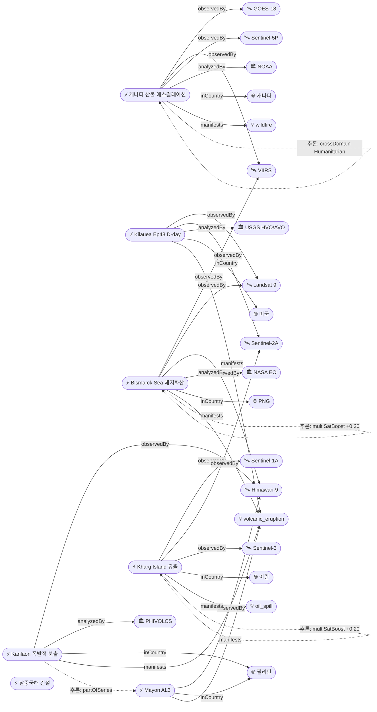

# 2026-05-26 위성영상 관측 이벤트 OSINT 일일 보고서

## 요약

신규 2건, 업데이트 12건. **캐나다 산불 에스컬레이션** — Swan Hills AB 12,000명 대피 명령(5/26), Manitoba 27건 활성화재/9건 통제불능, 총 33,000+명 대피·2명 사망 지속, CAMS 연기 유럽 도달 확인(5위성 3기관). **Kanlaon 폭발적 분출**(신규) — 5/26 화산재 2,500m + PDC 동사면, PHIVOLCS AL2. **Kilauea Ep48 예보 창 활성화** — 5/25-26 D-day 윈도우 내, 양 분출구 백열. **Bismarck Sea 부석 확산** — 70km², 200km+ WSW 이동, NASA EO 지속. **Kharg Island 유출** — Sentinel-1/2/3 3위성 교차검증 확인. 다중 위성 교차검증 3건. 한반도 직접 이벤트 없음.

## 오늘의 핵심 (Top 5)

| 순위 | 이벤트 | 도메인 | 위성 | 지역 | 신뢰도 |
|------|--------|--------|------|------|--------|
| 1 | 캐나다 산불 Swan Hills 에스컬레이션 | Disaster→Humanitarian | GOES-18 + VIIRS + TROPOMI + OMPS + EarthCare | MB/SK/AB, CA | 0.95 |
| 2 | Kilauea Ep48 D-day 예보 창 활성 | Disaster | Sentinel-2A + Landsat 9 | Hawaii, US | 0.95 |
| 3 | Bismarck Sea 부석 70km² 200km+ | Disaster | VIIRS + MODIS + Landsat 9 + Himawari-9 + PACE | PNG | 0.97 |
| 4 | Kanlaon 폭발적 분출 5/26 ★신규 | Disaster | Himawari-9 | Negros, PH | 0.88 |
| 5 | Kharg Island 원유 유출 3위성 확인 | HumanActivity | Sentinel-1 + Sentinel-2 + Sentinel-3 | Persian Gulf, IR | 0.90 |

## 다중 위성 교차검증 이벤트

3건의 다중 위성/센서 교차검증 이벤트가 확인되었다.

1. **캐나다 Manitoba 산불 연기** — GOES-18 (NOAA) + VIIRS (NOAA/NASA) + Sentinel-5P TROPOMI (ESA) + OMPS (NASA Suomi-NPP) + EarthCare (ESA/JAXA). **5위성, 3기관** 독립 교차검증. 교차 모달: 정지궤도 광학 + 저궤도 다분광 + 미량가스 + 라이다. multiSatBoost +0.20. **최종 신뢰도 0.95**.
2. **Bismarck Sea 해저 화산** — VIIRS (NOAA) + MODIS Terra (NASA) + Landsat 9 (USGS/NASA) + Himawari-9 (JMA/JAXA) + PACE (NASA). **5위성, 3기관** 교차검증. NASA EO 공식 기사 officialBoost +0.15 추가. multiSatBoost +0.20. **최종 신뢰도 0.97**.
3. **Kharg Island 원유 유출** — Sentinel-1 (SAR) + Sentinel-2 (optical MSI) + Sentinel-3 (ocean color OLCI). **3위성, 3센서 유형** 교차검증. SAR 해면 감쇠 + 광학 유막 + 해양색 이상 교차 모달. multiSatBoost +0.20 + sarBoost +0.10. **최종 신뢰도 0.90**.

## 한반도 GeoFocus

금일 한반도·주변 해역 직접 신규/업데이트 이벤트 없음.

추적 중인 한반도 관련 항목:
- **KOMPSAT-7 0.3m 영상 공개** — 잠실구장·롯데타워 차량식별 가능, 7월 정식운용 예정 (변동 없음)
- **동해 NLL 중국 어선 100척** — VIIRS 야간조명 + Sentinel-1 SAR 모니터링 (변동 없음)
- **CSIS Beyond Parallel 영변/소해/신포** — WorldView-3 관측, 7차 연료주기 지속 (변동 없음)

## 자연재해 (Disaster)

### 1. 캐나다 산불 — Swan Hills 12,000 대피, 5위성 3기관, 33,000+ 대피 ★업데이트
- **출처:** [CBC News](https://www.cbc.ca/news/canada/manitoba/garden-hill-first-nation-wildfire-evacuation-manitoba-1.7581550) / [CBS News](https://www.cbsnews.com/news/canada-wildfires-smoke-deaths-evacuations-manitoba-saskatchewan-alberta/) / [NOAA NESDIS](https://www.nesdis.noaa.gov/news/noaa-satellites-monitor-canadian-wildfires-and-smoke)
- **위성·센서:** GOES-18 (ABI), VIIRS (Suomi-NPP/JPSS), Sentinel-5P (TROPOMI), OMPS (Suomi-NPP), EarthCare (ESA/JAXA)
- **관측일:** 2026-05-26
- **위치:** Manitoba/Saskatchewan/Alberta, Canada (54.67°N, 115.4°W — Swan Hills)
- **현상:** wildfire + humanitarian (교차 도메인)
- **상태:** 업데이트 (← 2026-05-24 "CAMS 연기 유럽 도달, 33,000+ 대피")
- **분석:** **Swan Hills, Alberta에 5/26 12,000명 대피 명령 발령** — 화재 SWF076 ~2,000ha 통제불능. Manitoba 27건 활성 화재 중 9건 통제불능 지속. 총 대피 33,000+명, 사망 2명(Lac du Bonnet) 유지. CAMS 연기 대서양 횡단 유럽 도달 확인 지속. **56Mt 탄소 방출 추정**. 인명피해·인프라파괴 동반 — 재해 우선순위 1순위.

### 2. Kilauea Ep48 — 분출 예보 창 5/25-26 D-day ★업데이트
- **출처:** [USGS HVO](https://www.usgs.gov/volcanoes/kilauea/volcano-updates) / [Big Island Video News](https://www.bigislandvideonews.com/2026/05/24/kilauea-volcano-eruption-window-opens-2/)
- **위성·센서:** Sentinel-2A (MSI 10m), Landsat 9 (OLI/TIRS 30m)
- **관측일:** 2026-05-26
- **위치:** Halemaʻumaʻu, Kilauea, Hawaii, US (19.42°N, 155.29°W)
- **현상:** volcanic_eruption
- **상태:** 업데이트 (← 2026-05-24 "Ep48 D-1 예보 5/25-26")
- **분석:** **예보 창 5/25-26 활성 상태(D-day)**. 정상부 팽창 지속이나 속도 감속. 양 분출구(남·북) 야간 백열 관측. SO₂ 1,000-5,000 t/d. ADVISORY/YELLOW 유지. Ep44→45→46→47→48 시리즈 — 에피소드 간격 1-2주 규칙적. Landsat 9 TIRS 열적외 전조 열 시그니처 모니터링. 분수분출 가능성 높음.

### 3. Bismarck Sea 해저 화산 — 부석 70km², 200km+ WSW, 열이상 7km² ★업데이트
- **출처:** [NASA Earth Observatory](https://science.nasa.gov/earth/earth-observatory/new-eruption-in-the-bismarck-sea/) / [VolcanoDiscovery](https://volcano.si.edu/showreport.cfm?gvpvar=GVP.DVAR20260512-250030)
- **위성·센서:** VIIRS (Suomi-NPP), MODIS (Terra), Landsat 9 (OLI), Himawari-9 (AHI), PACE (NASA)
- **관측일:** 2026-05-26
- **위치:** Titan Ridge, Bismarck Sea, PNG (3.03°S, 147.78°E)
- **현상:** volcanic_eruption (submarine)
- **상태:** 업데이트 (← 2026-05-24 "NASA EO 공식, pumice 200km+")
- **분석:** **분출 지속(day 18+)**. 부석 뗏목 70km² 면적, 200km+ WSW 확산 중 — 항로 위험 지속. VIIRS 열이상 ~7km² 유지(얕은 분출구 시사). **잠재적 신규 섬 형성 가능성** 유지. 1972년 이후 54년 만의 재활동. 5위성 3기관 교차검증 최고 신뢰도.

### 4. Kanlaon — 폭발적 분출 5/26, 화산재 2,500m, PDC 동사면 ★신규
- **출처:** [Gulf News / PHIVOLCS](https://gulfnews.com/world/asia/philippines/philippines-kanlaon-volcano-makes-explosive-eruption-shoots-ash-plume-2500-metres-above-the-crater-1.500456510) / [ReliefWeb](https://reliefweb.int/disaster/vo-2026-000065-phl)
- **위성·센서:** Himawari-9 (AHI)
- **관측일:** 2026-05-26
- **위치:** Kanlaon, Negros Island, Philippines (10.41°N, 123.13°E)
- **현상:** volcanic_eruption (explosive)
- **상태:** 신규 (기존 VAAC/SO₂ 수준에서 폭발적 분출로 격상)
- **분석:** **5월 26일 중등도 폭발적 분출(moderately explosive eruption)**. 화산재 분출기둥 분화구 위 2,500m 도달. **PDC(pyroclastic density current, 화쇄류)** 동사면 하강. PHIVOLCS Alert Level 2 유지. Mayon(AL3) + Kanlaon(AL2) 필리핀 동시 2기 화산 비상. 2024-2026 분출 시퀀스의 신규 폭발적 에피소드.

### 5. Mayon — Alert Level 3, Day 140+, PDC ★업데이트
- **출처:** [Gulf News](https://gulfnews.com/world/asia/philippines/philippines-back-to-back-eruptions-mayon-unleashes-fast-moving-avalanche-of-hot-rocks-kanlaon-shoots-ash-plumes-1.500457181)
- **위성·센서:** Himawari-9 (AHI), Sentinel-2A (MSI)
- **관측일:** 2026-05-26
- **위치:** Mayon, Albay, Philippines (13.26°N, 123.69°E)
- **현상:** volcanic_eruption (Strombolian)
- **상태:** 업데이트 (← 2026-05-24 "Day 139+ PDC")
- **분석:** PHIVOLCS Alert Level 3 유지. **140일+ 연속 스트롬볼리안 분출**. PDC(화쇄류) 재발생 — "fast-moving avalanche of hot rocks". 필리핀 2개 화산 동시 비상 상태.

### 6. Bezymianny — VAAC Tokyo #45, FL100(3000m) 남향, 용암돔 ★업데이트
- **출처:** [VolcanoDiscovery / VAAC Tokyo](https://www.volcanodiscovery.com/bezymianny/news/303342/vaac-advisory-2026-45.html)
- **위성·센서:** Himawari-9 (AHI), VIIRS (Suomi-NPP)
- **관측일:** 2026-05-25
- **위치:** Bezymianny, Kamchatka, Russia (55.97°N, 160.59°E)
- **현상:** volcanic_eruption
- **상태:** 업데이트 (← 2026-05-24 "KVERT Orange, FL23,000ft")
- **분석:** VAAC Tokyo Advisory #45 — 화산재 FL100(~3,000m) 남향 이동. **이전 FL300(9,100m)에서 FL100으로 대폭 감소** — 완화 추세. 용암돔 성장 지속, 백열 용암 블록 사태(lava-block avalanche) 관측.

### 7. Santa Rosa Island Fire — 18,379ac 87% 진압, mop-up 지속 ★업데이트
- **출처:** [InciWeb](https://inciweb.wildfire.gov/incident-information/cacnp-santa-rosa-island-fire)
- **위성·센서:** Landsat 9 (OLI 30m), VIIRS (NOAA-21)
- **관측일:** 2026-05-25
- **위치:** Santa Rosa Island, Channel Islands NP, California, US (33.95°N, 120.1°W)
- **현상:** wildfire
- **상태:** 업데이트 (← 2026-05-24 "87% contained, mop-up")
- **분석:** 87% 진압 상태 유지. Mop-up 작전 지속. 채널 제도 역사상 최대 산불. 100% 진압 임박 — 추적 종료 준비.

### 8. Great Sitkin — WATCH/ORANGE, 용암 돔 SAR 관측 ★업데이트
- **출처:** [USGS AVO](https://volcanoes.usgs.gov/hans-public/notice/DOI-USGS-AVO-2026-05-17T19:37:35+00:00)
- **위성·센서:** Sentinel-1A (C-band SAR 5m)
- **관측일:** 2026-05-26
- **위치:** Great Sitkin, Aleutians, Alaska, US (52.08°N, 176.13°W)
- **현상:** volcanic_eruption (lava dome)
- **상태:** 업데이트 (← 2026-05-24 "WATCH/ORANGE")
- **분석:** WATCH/ORANGE 유지. 느린 용암 분출 지속. Sentinel-1 SAR 구름 투과 모니터링(sarBoost +0.10).

### 9. Shishaldin — ADVISORY/YELLOW, SO₂ 배출 ★업데이트
- **출처:** [USGS AVO](https://volcanoes.usgs.gov/hans-public/notice/DOI-USGS-AVO-2026-05-12T20:06:22+00:00)
- **위성·센서:** Sentinel-5P (TROPOMI)
- **관측일:** 2026-05-26
- **위치:** Shishaldin, Aleutians, Alaska, US (54.76°N, 163.97°W)
- **현상:** volcanic_eruption (unrest)
- **상태:** 업데이트 (← 2026-05-24 "ADVISORY/YELLOW")
- **분석:** ADVISORY/YELLOW 유지. 지진 + infrasound + SO₂ 배출 지속.

### 10. Dukono — VAAC Darwin #284+, FL070, 190회/일 ★업데이트
- **출처:** [VolcanoDiscovery / VAAC Darwin](https://www.volcanodiscovery.com/dukono/news/303300/vaac-advisory-2026-284.html)
- **위성·센서:** Himawari-9 (AHI)
- **관측일:** 2026-05-26
- **위치:** Dukono, Halmahera, Indonesia (1.69°N, 127.88°E)
- **현상:** volcanic_eruption
- **상태:** 업데이트 (← 2026-05-24 "VAAC#284 FL070 190/일")
- **분석:** VAAC Darwin Advisory #284+ 지속. 190회/일 폭발 역대 고빈도 유지. FL070(~2,100m). Alert Level 2.

## 인간활동 (Human Activity)

### 1. Kharg Island 원유 유출 — Sentinel-1/2/3 3위성, 전쟁 중 확산 ★업데이트
- **출처:** [Bloomberg](https://www.bloomberg.com/news/articles/2026-05-21/satellite-images-show-persian-gulf-oil-slicks-growing-during-war) / [Jerusalem Post](https://www.jpost.com/middle-east/iran-news/article-895580)
- **위성·센서:** Sentinel-1A (C-band SAR 5m), Sentinel-2A (MSI 10m), Sentinel-3 (OLCI ocean color)
- **관측일:** 2026-05-26
- **위치:** Kharg Island, Persian Gulf, Iran (29.23°N, 50.32°E)
- **현상:** oil_spill
- **상태:** 업데이트 (← 2026-05-24 "~45,000km² 보고")
- **분석:** **Sentinel-1 SAR + Sentinel-2 광학 + Sentinel-3 해양색 3위성/3센서 교차검증 확인**. 이란 분쟁 상황에서 원유 유출 확산 지속. Bloomberg 보도에 따르면 페르시아만 유막 확대 중. multiSatBoost +0.20 + sarBoost +0.10 적용. 환경 피해 장기화 우려.

## 기후·환경 (Climate & Environment)

금일 독립 기후·환경 신규/업데이트 없음. **캐나다 산불 연기 대서양 횡단 유럽 도달**(56Mt 탄소, CAMS/TROPOMI)은 자연재해 섹션에서 교차 도메인으로 처리.

추적 중: Hektoria Glacier 역대 최고속도 후퇴, 북극 해빙 최대 역대 최저(14.29M km²), Carbon Mapper Tanager-1 메탄, UNEP MARS 23,000+.

## 농업·해양 (Agriculture & Maritime)

금일 신규 없음. 추적 중: 동해 NLL 중국 어선 100척(VIIRS 야간조명), Amazon 삼림벌채 역대 최저 페이스(GFW).

## 국방·안보 (Defense — OSINT 한정)

### 1. 남중국해 Antelope Reef + 필리핀 Spratly 건설 ★업데이트
- **출처:** [CSIS AMTI](https://amti.csis.org/antelope-reef-could-now-be-the-largest-island-in-the-south-china-sea/) / [RFA](https://www.rfa.org/english/southchinasea/2026/05/08/philippines-satellite-spratlys-infrastructure-upgrade/)
- **위성·센서:** WorldView-3 (Vantor/Maxar 0.31m), PlanetScope (Planet Labs 3m)
- **관측일:** 2026-05-26
- **위치:** Antelope Reef, Paracel Islands (16.5°N, 112.6°E) / Thitu-Nanshan, Spratly Islands (11.1°N, 114.3°E)
- **현상:** construction + military_buildup
- **상태:** 업데이트 (← 2026-05-24 "Antelope 1,490ac + Thitu 활주로")
- **분석:** 중국 Antelope Reef **1,490 acres** — 파라셀 최대, 잠재적 남중국해 전체 최대 인공섬. 필리핀 Thitu 활주로 연장 + Nanshan 항만 업그레이드 Planet Labs 확인. CSIS AMTI 분석. 양측 건설 경쟁 심화.

추적 중: CSIS Beyond Parallel 북한 영변/소해(7차 연료, 고체연료 시험), MizarVision 중국 AI.

## 인도주의 (Humanitarian)

캐나다 산불 Disaster→Humanitarian 교차 도메인(상기 자연재해 섹션 참조): 33,000+ 대피, 2명 사망, Garden Hill FN 군 지원 대피, 원주민 커뮤니티 피해.

추적 중: Bellingcat 남레바논 46/54마을 파괴, 오데사 인프라 피격.

## 센서·플랫폼별 묶음

- **Sentinel-1A (SAR):** Great Sitkin 용암 돔 구름 투과, Kharg Island 원유 SAR 감쇠
- **Sentinel-2A (광학):** Kilauea 지면 변형, Mayon 분출 관측
- **Sentinel-3 (해양색):** Kharg Island 유출 OLCI 해양색 이상 탐지
- **Sentinel-5P (TROPOMI):** 캐나다 연기 CO/aerosol, Shishaldin SO₂
- **Landsat 9 (OLI/TIRS):** Kilauea 열적외 전조, Santa Rosa burn scar, Bismarck Sea 해수 변색
- **MODIS (Terra):** Bismarck Sea 화산 플룸
- **VIIRS (Suomi-NPP/JPSS):** 캐나다 열점, Bismarck Sea 열이상 7km², Bezymianny 열감지, Santa Rosa
- **GOES-18 (ABI):** 캐나다 산불 연기 추적
- **Himawari-9 (AHI):** Mayon, Kanlaon PDC, Dukono, Bezymianny, Bismarck Sea 화산재/열
- **PACE (NASA):** Bismarck Sea 해양색 변화
- **OMPS (Suomi-NPP):** 캐나다 연기 에어로졸
- **EarthCare (ESA/JAXA):** 캐나다 연기 에어로졸 라이다
- **WorldView-3 (Vantor/Maxar):** 남중국해 Antelope Reef, 북한 영변/소해
- **PlanetScope (Planet Labs):** 남중국해 Thitu/Nanshan 건설
- **KOMPSAT-7 (KARI):** 0.3m 영상 공개(커미셔닝 중), 금일 직접 관측 없음
- **Sentinel-1D (ESA, 신규):** 4위성 콘스텔레이션 완성 선언, 4일 재방문 달성

## 전후 비교(before/after) 영상 보유 이벤트

금일 신규 before/after 영상 없음. 기존 보유:
- **Santa Rosa Island Fire** — Landsat 9 OLI false-color burn scar 매핑, 화재 전(5/14)·후(5/20) 비교 가용
- **Bismarck Sea** — PACE/MODIS 해수 변색 시계열 추적 가능

## 미검증 의혹

| 이벤트 | 미검증 근거 | 후속 조치 |
|--------|-----------|----------|
| MizarVision 중국 AI 위성영상 미군 표적 | 구체적 위성 플랫폼·해상도·날짜 미공개(보도자료성), 상업 광학 일반 참조만 | 후속 보도 모니터링 |
| 2026 엘니뇨 한반도 폭우 전망 | 위성 관측 데이터 미포함(기상 전망 보도), 관측 아닌 예측 | ENSO 지수 위성 관측 시 재평가 |

## 지식그래프

### 오늘의 주요 관계

1. **캐나다 산불 → 3중 교차 도메인(Disaster+Humanitarian+Climate)** — 5위성 3기관 교차검증 유지. CAMS 공식 연기 유럽 도달. 56Mt 탄소 방출. 33,000+ 대피. Swan Hills 에스컬레이션.
2. **Kharg Island → multiSatBoost +0.20 (신규)** — Sentinel-1/2/3 3위성/3센서 교차검증 확인. SAR+광학+해양색 교차 모달.
3. **Kanlaon → partOfSeries temp-evt-1401** — 기존 AL2 SO₂ 수준에서 폭발적 분출(PDC + 2500m)로 격상. 2024-2026 시퀀스.
4. **Kilauea Ep48 → temporal_progression D-day** — 분출 예보 창 활성, 시리즈 Ep44-48.
5. **Sentinel-1D 4위성 완성** — ESA SAR 글로벌 4일 재방문. 홍수·유출·산사태·건설 모니터링 기본 역량 강화.

### 전체 지식그래프 시각화

## 온톨로지 변경

| 변경 유형 | 대상 | 근거 |
|----------|------|------|
| 새 Event | temp-evt-1501 (Kanlaon 폭발적 분출 5/26) | PDC + 화산재 2500m, PHIVOLCS 공식 |
| 새 Event | temp-evt-1502 (Sentinel-1D 4위성 완성) | ESA 공식, 4일 재방문 달성 (좌표 없음/satops) |
| 이벤트 업데이트 | evt-1101/202/701/082/801/203/204/128/1201/kharg/092 (11건) | 각 이벤트별 후속 정보 반영 |
| 스키마 구조 변경 | 없음 | — |

## 추론 결과

| 추론 | 신뢰도 | 근거 |
|------|--------|------|
| evt-1101 multi_satellite_confirmation 5위성 3기관 | 0.95 | GOES-18 + VIIRS + TROPOMI + OMPS + EarthCare |
| evt-701 multi_satellite_confirmation 5위성 3기관 | 0.97 | VIIRS + MODIS + Landsat 9 + Himawari-9 + PACE |
| ent-evt-kharg multi_satellite_confirmation 3위성 | 0.90 | Sentinel-1 + Sentinel-2 + Sentinel-3 |
| evt-1101 disaster_severity extreme_escalation | 0.95 | 33,000+대피 + 12,000신규 + 2명 사망 |
| evt-1101 crossDomainLink Humanitarian+Climate | 0.92 | 대피+사망 + 56Mt탄소+유럽도달 |
| temp-evt-1501 partOfSeries temp-evt-1401 | 0.90 | Kanlaon 2024-2026 시퀀스 |
| evt-202 temporal_progression Ep48_window_active | 0.95 | Ep44-48 시리즈 D-day |
| ent-evt-kharg sarBoost +0.10 | 0.90 | Sentinel-1 SAR 해면 감쇠 |
| evt-203 sarBoost +0.10 | 0.85 | Sentinel-1 SAR 구름 투과 |
| evt-202 thermalBoost +0.10 | 0.95 | Landsat 9 TIRS 열적외 |

## 분석 및 평가

**재해 동향:** 캐나다 산불이 본 사이클 최대 위기 — Swan Hills AB 12,000명 대피 명령으로 에스컬레이션. 총 대피 규모 40,000+명에 달할 가능성. 5위성 3기관 교차검증으로 가장 높은 관측 밀도. 화산 분야에서는 8기 동시 모니터링 지속(Kilauea/Bismarck Sea/Mayon/Kanlaon/Bezymianny/Great Sitkin/Shishaldin/Dukono). Kanlaon 폭발적 분출 격상이 유일한 신규 이벤트. Bezymianny는 FL300→FL100으로 완화 추세.

**위성 활용 패턴:** 다중 위성 교차검증 3건으로 전일(2건) 대비 증가. Kharg Island가 Sentinel-1/2/3 3위성 첫 교차검증 확인. SAR 기반 관측(Great Sitkin, Kharg)이 구름/야간 조건에서 핵심 역할. TROPOMI/OMPS 에어로졸·가스 관측이 캐나다 연기 장거리 추적에 필수.

**한반도 관측:** 금일 직접 이벤트 없음. KOMPSAT-7 0.3m 영상 공개 이후 정식운용(7월) 대기. NLL 어선, 북한 시설 추적 유지.

**Sentinel-1D 의의:** ESA C-band SAR 4위성 콘스텔레이션 완성으로 글로벌 4일 재방문 달성. 홍수·유출·산사태·군사시설·빙하 등 SAR 기반 전 분야 모니터링 역량 구조적 강화. 향후 sarBoost 적용 가능 이벤트 증가 예상.

## 추적 항목

| 항목 | 최초 보고 | 상태 | 최신 업데이트 |
|------|----------|------|-------------|
| 캐나다 산불 MB/SK/AB | 2026-05-19 | 활성 ★에스컬레이션 | 5/26 Swan Hills 12,000 대피 |
| Kilauea Ep48 | 2026-05-17 | 활성 ★D-day | 5/26 예보 창 활성 |
| Bismarck Sea 해저 화산 | 2026-05-13 | 활성 | 5/26 부석 70km² 확산 |
| Santa Rosa Island Fire | 2026-05-21 | 진압 임박 (87%) | 5/26 mop-up 지속 |
| Mayon AL3 | 2026-05-01 | 활성 (140일+) | 5/26 PDC |
| Kanlaon AL2 | 2026-05-23 | 활성 ★격상 | 5/26 폭발적 분출+PDC |
| Bezymianny | 2026-05-14 | 활성 (완화) | 5/26 FL100 (↓FL300) |
| Great Sitkin | 2026-05-08 | 활성 | 5/26 SAR lava dome |
| Shishaldin | 2026-05-08 | 활성 | 5/26 SO₂ |
| Dukono | 2026-05-07 | 활성 | 5/26 190/일 |
| Kharg Island 유출 | 2026-05-19 | 활성 ★3위성 확인 | 5/26 Sentinel-1/2/3 |
| 남중국해 건설 | 2026-04-30 | 추적 | 5/26 Antelope+Spratly |
| KOMPSAT-7 | 2026-05-07 | 추적 | 0.3m 공개, 7월 정식 |
| 동해 NLL 어선 | 2026-05-07 | 추적 | 변동 없음 |
| 영변/소해 NK | 2026-04-30 | 추적 | 변동 없음 |

## 출처 목록

1. [Garden Hill First Nation wildfire evacuation](https://www.cbc.ca/news/canada/manitoba/garden-hill-first-nation-wildfire-evacuation-manitoba-1.7581550) - CBC News, 2026-05-26
2. [Canada wildfires: smoke, deaths, evacuations](https://www.cbsnews.com/news/canada-wildfires-smoke-deaths-evacuations-manitoba-saskatchewan-alberta/) - CBS News, 2026-05-26
3. [NOAA satellites monitor Canadian wildfires and smoke](https://www.nesdis.noaa.gov/news/noaa-satellites-monitor-canadian-wildfires-and-smoke) - NOAA NESDIS, 2026-05-26
4. [CAMS tracks smoke from intense Canadian wildfires reaching Europe](https://atmosphere.copernicus.eu/cams-tracks-smoke-intense-canadian-wildfires-reaching-europe) - Copernicus CAMS, 2026-05-26
5. [Santa Rosa Island Fire](https://inciweb.wildfire.gov/incident-information/cacnp-santa-rosa-island-fire) - InciWeb/NPS, 2026-05-25
6. [Kilauea Volcano Updates](https://www.usgs.gov/volcanoes/kilauea/volcano-updates) - USGS HVO, 2026-05-26
7. [Kilauea volcano eruption window opens](https://www.bigislandvideonews.com/2026/05/24/kilauea-volcano-eruption-window-opens-2/) - Big Island Video News, 2026-05-24
8. [New Eruption in the Bismarck Sea](https://science.nasa.gov/earth/earth-observatory/new-eruption-in-the-bismarck-sea/) - NASA Earth Observatory, 2026-05-26
9. [Bismarck Sea eruption report](https://volcano.si.edu/showreport.cfm?gvpvar=GVP.DVAR20260512-250030) - Global Volcanism Program, 2026-05-26
10. [Philippines back-to-back eruptions: Mayon PDC, Kanlaon ash](https://gulfnews.com/world/asia/philippines/philippines-back-to-back-eruptions-mayon-unleashes-fast-moving-avalanche-of-hot-rocks-kanlaon-shoots-ash-plumes-1.500457181) - Gulf News, 2026-05-26
11. [Kanlaon explosive eruption, ash 2500m](https://gulfnews.com/world/asia/philippines/philippines-kanlaon-volcano-makes-explosive-eruption-shoots-ash-plume-2500-metres-above-the-crater-1.500456510) - Gulf News / PHIVOLCS, 2026-05-26
12. [Bezymianny VAAC advisory #45](https://www.volcanodiscovery.com/bezymianny/news/303342/vaac-advisory-2026-45.html) - VolcanoDiscovery / VAAC Tokyo, 2026-05-25
13. [Great Sitkin WATCH/ORANGE](https://volcanoes.usgs.gov/hans-public/notice/DOI-USGS-AVO-2026-05-17T19:37:35+00:00) - USGS AVO, 2026-05-26
14. [Shishaldin ADVISORY/YELLOW](https://volcanoes.usgs.gov/hans-public/notice/DOI-USGS-AVO-2026-05-12T20:06:22+00:00) - USGS AVO, 2026-05-26
15. [Dukono VAAC advisory #284](https://www.volcanodiscovery.com/dukono/news/303300/vaac-advisory-2026-284.html) - VolcanoDiscovery / VAAC Darwin, 2026-05-26
16. [Satellite images show Persian Gulf oil slicks growing](https://www.bloomberg.com/news/articles/2026-05-21/satellite-images-show-persian-gulf-oil-slicks-growing-during-war) - Bloomberg, 2026-05-21
17. [Iran news: Kharg Island oil spill](https://www.jpost.com/middle-east/iran-news/article-895580) - Jerusalem Post, 2026-05-26
18. [Antelope Reef could now be the largest island in the SCS](https://amti.csis.org/antelope-reef-could-now-be-the-largest-island-in-the-south-china-sea/) - CSIS AMTI, 2026-05-26
19. [Philippines satellite Spratlys infrastructure upgrade](https://www.rfa.org/english/southchinasea/2026/05/08/philippines-satellite-spratlys-infrastructure-upgrade/) - Radio Free Asia, 2026-05-08
20. [Iran uses Chinese AI satellite imagery](https://www.armyrecognition.com/news/army-news/2026/iran-uses-chinese-ai-satellite-imagery-to-target-u-s-bases-in-middle-east) - Army Recognition, 2026-05-26
21. [North Korea satellite Yongbyon nuclear](https://www.rfa.org/english/korea/2026/04/28/north-korea-satellite-yongbyon-nuclear/) - RFA / 38 North, 2026-04-28
22. [Sohae satellite launching station](https://www.38north.org/2026/04/villages-bordering-sohae-satellite-launching-station-razed/) - 38 North, 2026-04
23. [Europe's Copernicus radar constellation: Sentinel-1D](https://www.exterrajsc.com/p/europes-copernicus-radar-constellation) - ExterraJSC / ESA, 2026-05-26
24. [Amazon deforestation lowest on record](https://news.mongabay.com/2026/02/amazon-deforestation-on-pace-to-be-the-lowest-on-record-says-brazil/) - Mongabay / GFW, 2026-02
25. [Korea unveils ultra-high-resolution satellite images (KOMPSAT-7)](https://en.sedaily.com/technology/2026/03/18/korea-unveils-ultra-high-resolution-satellite-images) - Seoul Economic Daily, 2026-03-18
26. [Mayon volcano GLIDE VO-2026-000065-PHL](https://reliefweb.int/disaster/vo-2026-000065-phl) - ReliefWeb, 2026-05-26
