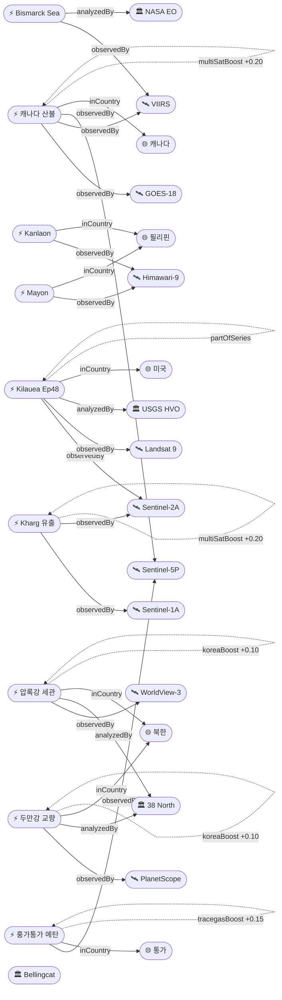
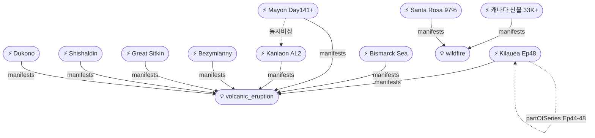

# 2026-05-27 위성영상 관측 이벤트 OSINT 일일 보고서

## 요약

신규 3건, 업데이트 13건. **한반도 GeoFocus 복귀** — 38 North 위성영상 분석으로 (1) 신의주 압록강 신교량 세관시설 대규모 건설과 (2) 두만강 북·러 교량 완공 임박(6/19 개통 목표)이 확인되었다. **Kilauea Ep48 분출 예보 창이 5/27-29로 확대** — 정상부 수축 전환, 13.3μrad 팽창 누적, 분수분출 임박. **Santa Rosa Island Fire 97% 진압**(87→97%). **Nature Communications 2026** 논문에서 Sentinel-5P TROPOMI가 훙가통가 화산 플룸의 메탄 파괴를 최초 검출했다. 캐나다 산불·Bismarck Sea 해저 화산·Mayon/Kanlaon 이중 화산 비상은 지속. 다중 위성 교차검증 2건. 한반도 신규 2건.

## 오늘의 핵심 (Top 5)

| 순위 | 이벤트 | 도메인 | 위성 | 지역 | 신뢰도 |
|------|--------|--------|------|------|--------|
| 1 | 캐나다 산불 Swan Hills 대피 지속 | Disaster→Humanitarian | GOES-18 + VIIRS + TROPOMI | MB/SK/AB, CA | 0.95 |
| 2 | Kilauea Ep48 분출 예보 5/27-29 | Disaster | Sentinel-2A + Landsat 9 | Hawaii, US | 0.95 |
| 3 | Bismarck Sea 해저 화산 day 19+ | Disaster | VIIRS + MODIS + Landsat 9 + Himawari-9 | PNG | 0.97 |
| 4 | 압록강 신교량 세관시설 건설 ★신규 | HumanActivity | WorldView-3 | 신의주, KP | 0.85 |
| 5 | TROPOMI 훙가통가 메탄 파괴 검출 ★신규 | Climate | Sentinel-5P (TROPOMI) | 통가/글로벌 | 0.92 |

## 다중 위성 교차검증 이벤트

2건의 다중 위성/센서 교차검증 이벤트가 유지된다.

1. **캐나다 Manitoba/Alberta 산불 연기** — GOES-18 (NOAA) + VIIRS (NOAA/NASA) + Sentinel-5P TROPOMI (ESA) + OMPS (NASA) + EarthCare (ESA/JAXA). **5위성 3기관** 독립 교차검증 유지. multiSatBoost +0.20. **최종 신뢰도 0.95**.
2. **Kharg Island 원유 유출** — Sentinel-1 (SAR) + Sentinel-2 (optical MSI) + Sentinel-3 (ocean color OLCI). **3위성 3센서 유형** 교차검증 유지. multiSatBoost +0.20 + sarBoost +0.10. **최종 신뢰도 0.90**.

## 한반도 GeoFocus

전일 0건에서 **2건 신규로 복귀**. 38 North 위성영상 분석 기반 북한 인프라 이벤트.

### 1. 압록강 신교량 세관시설 건설 (Sinuiju) ★신규
- **출처:** [38 North](https://www.38north.org/2026/05/quick-take-progress-continues-at-new-yalu-river-bridge-crossing/)
- **위성·센서:** WorldView-3 (0.31m 광학)
- **관측일:** 2026-05
- **위치:** 신의주, 북한 (40.1°N, 124.4°E)
- **현상:** construction (세관·출입국 시설)
- **상태:** 신규
- **분석:** 12년간 방치된 압록강 신교량(중국-북한)의 **북측 세관·출입국 시설** 건설이 본격화되었다. 위성영상 확인 결과 — 서쪽에 4개 대형 창고(최대 50×320m), 동쪽에 20여 동 신축 건물과 차량 수송 시설이 건설 중이다. 2025년 2월 착공, 1년간 급속 진행. **중·북 교역 재개를 위한 인프라 정비** 신호. hiResBoost +0.15 (0.31m 건물 구조 식별), koreaBoost +0.10.

### 2. 북한-러시아 두만강 교량 완공 임박 ★신규
- **출처:** [RFA](https://www.rfa.org/english/korea/2026/05/21/tumen-river-bridge-russia-north-korea-putin/) / [38 North](https://www.38north.org/2026/03/russian-bridge-construction-work-meets-in-the-middle/)
- **위성·센서:** PlanetScope (3m 광학)
- **관측일:** 2026-05
- **위치:** 두만강 국경, 북한-러시아 (42.4°N, 130.6°E)
- **현상:** construction (국경 교량)
- **상태:** 신규
- **분석:** 위성영상에서 **양안 교량 구조물이 중앙부에서 만난 것**이 확인되었다. 러시아 대사관은 **6월 19일 개통**을 발표 — 당초 일정보다 6개월 앞당겨졌다. 일 300대 차량, 2,850명 통과 가능. 북한 측 세관 건물·접근도로 최종 단계. **북·러 육로 물류 확대**의 전략적 전환점. koreaBoost +0.10, before/after +0.10.

추적 지속 항목:
- **KOMPSAT-7 0.3m 영상** — 7월 정식운용 예정 (변동 없음)
- **동해 NLL 중국 어선 100척** — VIIRS+SAR 모니터링 (변동 없음)
- **CSIS Beyond Parallel 영변/소해** — WorldView-3 관측 (변동 없음)

## 자연재해 (Disaster)

### 1. 캐나다 산불 — Swan Hills 대피 지속, 33,000+ 대피, 5위성 3기관 ★업데이트
- **출처:** [CTV News](https://www.ctvnews.ca/edmonton/article/wildfire-evacuation-order-issued-for-county-northwest-of-edmonton/) / [ReliefWeb](https://reliefweb.int/report/canada/canada-wildfire-alberta-gov-alberta-wildfire-local-gov-media-jrc-gwis-echo-daily-flash-15-may-2026) / [NOAA NESDIS](https://www.nesdis.noaa.gov/news/noaa-satellites-monitor-canadian-wildfires-and-smoke)
- **위성·센서:** GOES-18 (ABI), VIIRS (Suomi-NPP/JPSS), Sentinel-5P (TROPOMI), OMPS, EarthCare
- **관측일:** 2026-05-27
- **위치:** Manitoba/Saskatchewan/Alberta, Canada (54.67°N, 115.4°W — Swan Hills)
- **현상:** wildfire + humanitarian (교차 도메인)
- **상태:** 업데이트 (← 2026-05-26 "Swan Hills 12,000 대피, 33,000+ 총 대피")
- **분석:** Swan Hills SWF076 (~2,000ha) 통제불능 지속. Manitoba 27건 활성/9건 통제불능. **총 33,000+명 대피, 2명 사망** 유지. CAMS 연기 대서양 횡단 유럽 도달 확인 지속. 56Mt 탄소 방출 추정. 재해·인도주의 교차 도메인 1순위.

### 2. Kilauea Ep48 — 분출 예보 창 5/27-29로 확대, 수축 전환 ★업데이트
- **출처:** [USGS HVO](https://www.usgs.gov/volcanoes/kilauea/volcano-updates) / [Hawaii Volcano Expeditions](https://hawaiivolcanoexpeditions.com/blog/lava-update-the-latest-eruptions-on-the-big-island/)
- **위성·센서:** Sentinel-2A (MSI 10m), Landsat 9 (OLI/TIRS 30m)
- **관측일:** 2026-05-27
- **위치:** Halemaʻumaʻu, Kilauea, Hawaii, US (19.42°N, 155.29°W)
- **현상:** volcanic_eruption
- **상태:** 업데이트 (← 2026-05-26 "Ep48 D-day 5/25-26")
- **분석:** **예보 창 5/27-29로 확대(5/25-26에서 이동)**. 정상부가 **수축(deflation)으로 전환** — Ep47 이후 13.3μrad 팽창 누적. 양 분출구(남·북) 야간 백열 지속. SO₂ ~2,000 t/d (5/22 실측). ADVISORY/YELLOW. Ep44→45→46→47→48 시리즈 — 에피소드 간격 1-2주 규칙적. **분수분출 개시 가능성 높은 기간**.

### 3. Bismarck Sea 해저 화산 — day 19+, 부석 70km², 200km+ WSW ★업데이트
- **출처:** [NASA Earth Observatory](https://science.nasa.gov/earth/earth-observatory/new-eruption-in-the-bismarck-sea/) / [Space.com](https://www.space.com/astronomy/earth/satellites-imaged-an-underwater-volcano-erupting-but-scientists-have-no-idea-whats-actually-happening-on-the-seafloor)
- **위성·센서:** VIIRS, MODIS (Terra), Landsat 9 (OLI), Himawari-9 (AHI)
- **관측일:** 2026-05-27
- **위치:** Titan Ridge, Bismarck Sea, PNG (3.03°S, 147.78°E)
- **현상:** volcanic_eruption (submarine)
- **상태:** 업데이트 (← 2026-05-26 "부석 70km², 200km+ WSW")
- **분석:** 분출 day 19+ 지속. 부석 뗏목 70km² 면적, 200km+ WSW 확산 — 항로 위험 유지. VIIRS 열이상 ~7km². 신규 섬 형성 가능성. 1972년 이후 54년 만 재활동. 해저 지형 고해상도 매핑 부재로 과학적 불확실성 높음.

### 4. Mayon — AL3, Day 141+, PDC + 스트롬볼리안 지속 ★업데이트
- **출처:** [PNA / PHIVOLCS](https://www.pna.gov.ph/articles/1274187) / [VolcanoDB](https://volcanodb.com/mayon-volcano)
- **위성·센서:** Himawari-9 (AHI), Sentinel-2A (MSI)
- **관측일:** 2026-05-27
- **위치:** Mayon, Albay, Philippines (13.26°N, 123.69°E)
- **현상:** volcanic_eruption (Strombolian)
- **상태:** 업데이트 (← 2026-05-26 "Day 140+ PDC")
- **분석:** PHIVOLCS AL3 유지. 141일+ 연속 스트롬볼리안 분출. PDC 반복. 용암류 동사면 3.8km 도달. 102,000+ 명 영향. 필리핀 Mayon+Kanlaon 이중 화산 비상 지속.

### 5. Kanlaon — AL2, 5/26 폭발적 분출 후 모니터링 ★업데이트
- **출처:** [Gulf News / PHIVOLCS](https://gulfnews.com/world/asia/philippines/philippines-kanlaon-volcano-makes-explosive-eruption-shoots-ash-plume-2500-metres-above-the-crater-1.500456510)
- **위성·센서:** Himawari-9 (AHI)
- **관측일:** 2026-05-27
- **위치:** Kanlaon, Negros Island, Philippines (10.41°N, 123.13°E)
- **현상:** volcanic_eruption (explosive)
- **상태:** 업데이트 (← 2026-05-26 "5/26 폭발적 분출, 화산재 2500m, PDC")
- **분석:** 5/26 폭발적 분출 이후 모니터링 지속. PHIVOLCS AL2 유지. SO₂ 410-4,081 t/d 범위. 2024-2026 분출 시퀀스 내 신규 폭발 에피소드. Mayon(AL3) + Kanlaon(AL2) 필리핀 동시 비상.

### 6. Bezymianny — VAAC #45, FL100 남향, 감소 추세 ★업데이트
- **출처:** [VolcanoDiscovery / VAAC Tokyo](https://www.volcanodiscovery.com/bezymianny/news/303342/vaac-advisory-2026-45.html)
- **위성·센서:** Himawari-9 (AHI), VIIRS
- **관측일:** 2026-05-25
- **위치:** Bezymianny, Kamchatka, Russia (55.97°N, 160.59°E)
- **현상:** volcanic_eruption
- **상태:** 업데이트 (← 2026-05-26 "VAAC #45, FL100")
- **분석:** VAAC Tokyo Advisory #45 — FL100 (3,000m) 남향 15kts. **5/20 FL300(9,100m)에서 급격히 감소**. KVERT Orange 유지. 용암돔 성장 지속이나 폭발 강도 완화 추세.

### 7. Great Sitkin — WATCH/ORANGE, 용암 돔 지속 ★업데이트
- **출처:** [USGS AVO](https://volcanoes.usgs.gov/hans-public/notice/DOI-USGS-AVO-2026-05-17T19:37:35+00:00)
- **위성·센서:** Sentinel-1A (C-SAR 5m)
- **관측일:** 2026-05-27
- **위치:** Great Sitkin, Aleutians, Alaska, US (52.08°N, 176.13°W)
- **현상:** volcanic_eruption (lava dome)
- **상태:** 업데이트 — WATCH/ORANGE 유지. SAR 모니터링으로 구름 투과 관측. 2021년 이후 지속 분출. sarBoost +0.10.

### 8. Shishaldin — ADVISORY/YELLOW, 지진+가스 지속 ★업데이트
- **출처:** [USGS AVO](https://volcanoes.usgs.gov/hans-public/notice/DOI-USGS-AVO-2026-05-12T20:06:22+00:00)
- **위성·센서:** Sentinel-5P (TROPOMI)
- **관측일:** 2026-05-27
- **위치:** Shishaldin, Aleutians, Alaska, US (54.76°N, 163.97°W)
- **현상:** volcanic_eruption (unrest)
- **상태:** 업데이트 — ADVISORY/YELLOW 유지. SO₂ + 증기 + 지진 활동 지속.

### 9. Dukono — VAAC Darwin, FL070, 190회/일 폭발 ★업데이트
- **출처:** [VolcanoDiscovery / VAAC Darwin](https://www.volcanodiscovery.com/dukono/news/303300/vaac-advisory-2026-284.html)
- **위성·센서:** Himawari-9 (AHI)
- **관측일:** 2026-05-27
- **위치:** Dukono, Halmahera, Indonesia (1.69°N, 127.88°E)
- **현상:** volcanic_eruption
- **상태:** 업데이트 — VAAC Darwin Advisory, FL070, 190+회/일 폭발 지속.

### 10. Santa Rosa Island Fire — 97% 진압 (87→97%), 추적 종료 임박 ★업데이트
- **출처:** [InciWeb](https://inciweb.wildfire.gov/incident-information/cacnp-santa-rosa-island-fire) / [CAL FIRE](https://www.fire.ca.gov/incidents/2026/5/15/santa-rosa-island-fire/) / [KCBX](https://www.kcbx.org/environment-and-energy/2026-05-24/the-santa-rosa-island-wildfire-is-now-almost-entirely-contained)
- **위성·센서:** Landsat 9 (OLI), VIIRS
- **관측일:** 2026-05-27
- **위치:** Santa Rosa Island, Channel Islands NP, California (33.95°N, 120.10°W)
- **현상:** wildfire
- **상태:** 업데이트 (← 2026-05-26 "87%")
- **분석:** **97% 진압 달성** (87→97%). 18,379ac, 채널제도 역대 최대 화재. 잔불정리(mop-up) 지속. 섬 폐쇄 6/6까지. **추적 종료 임박**.

## 인간활동 (Human Activity)

### 1. 압록강 신교량 세관시설 건설 ★신규
- 한반도 GeoFocus 섹션 참조

### 2. 두만강 교량 완공 임박 ★신규
- 한반도 GeoFocus 섹션 참조

### 3. Kharg Island 원유 유출 — Sentinel-1/2/3 3위성 관측 지속 ★업데이트
- **출처:** [Bloomberg](https://www.bloomberg.com/news/articles/2026-05-21/satellite-images-show-persian-gulf-oil-slicks-growing-during-war) / [JPost](https://www.jpost.com/middle-east/iran-news/article-895580)
- **위성·센서:** Sentinel-1 (C-SAR), Sentinel-2 (MSI), Sentinel-3 (OLCI)
- **관측일:** 2026-05-27
- **위치:** Kharg Island, Persian Gulf, Iran (29.23°N, 50.32°E)
- **현상:** oil_spill
- **상태:** 업데이트 — 3위성 교차검증 유지. 유출 확산 지속 중. multiSatBoost +0.20.

## 기후·환경 (Climate & Environment)

### 1. TROPOMI, 훙가통가 화산 플룸의 메탄 파괴 최초 검출 ★신규
- **출처:** [ScienceDaily](https://www.sciencedaily.com/releases/2026/05/260509210640.htm) / [Discover Magazine](https://www.discovermagazine.com/after-a-massive-eruption-this-underwater-volcano-removed-methane-from-the-atmosphere-49078) / Nature Communications 2026
- **위성·센서:** Sentinel-5P (TROPOMI)
- **관측일:** 2022-01 (관측) → 2026-05-09 (논문 발표)
- **위치:** Hunga Tonga-Hunga Haʻapai, Tonga (20.5°S, 175.4°W) / 글로벌 대기
- **현상:** methane_plume (destruction mechanism)
- **상태:** 신규
- **분석:** 2022년 1월 훙가통가 화산 분출 시 성층권으로 주입된 화산 플룸이 **메탄을 적극적으로 파괴**했음을 Sentinel-5P TROPOMI 데이터로 최초 입증. 플룸 내 **기록적 고농도 포름알데히드(formaldehyde)** 검출 — 메탄 분해 부산물. 10일+ 지속적 메탄 파괴 확인. 포름알데히드는 대기 중 수시간만 존재하므로, 플룸 내 연속 생성이 확인된 것은 메탄 산화 반응이 활발했음을 의미. **화산 분출이 온실가스를 제거하는 역설적 메커니즘**의 첫 위성 관측 증거. tracegasBoost +0.15, officialBoost +0.15.

## 농업·해양 (Agriculture & Maritime)

금일 농업·해양 도메인 신규 위성영상 관측 이벤트 없음.

추적 지속: Amazon 삼림벌채 역대 최저 페이스 (GFW Landsat+Sentinel-2, 변동 없음).

## 국방·안보 (Defense — OSINT 한정)

### 1. 남중국해 Antelope Reef + 필리핀 Spratly 건설 ★업데이트
- **출처:** [CSIS AMTI](https://amti.csis.org/antelope-reef-could-now-be-the-largest-island-in-the-south-china-sea/) / [RFA](https://www.rfa.org/english/southchinasea/2026/05/08/philippines-satellite-spratlys-infrastructure-upgrade/)
- **위성·센서:** WorldView-3, PlanetScope, Sentinel-2A
- **관측일:** 2026-05
- **위치:** Antelope Reef, Paracel Islands (16.5°N, 112.6°E) / Thitu Island, Spratly Islands (11.1°N, 114.3°E)
- **현상:** military_buildup / construction
- **상태:** 업데이트 — 중국 Antelope Reef 1,490ac 매립 지속, 9,000ft 활주로 가능 규모. 필리핀 Thitu 활주로 200×100m 확장 + Nanshan 항만 건설 Planet Labs 확인.

## 인도주의 (Humanitarian)

### 1. Bellingcat 남레바논 파괴 — 46+ 마을 철거, PlanetScope before/after ★업데이트
- **출처:** [Bellingcat](https://www.bellingcat.com/news/2026/05/14/satellite-imagery-shows-ongoing-demolitions-across-southern-lebanon/)
- **위성·센서:** PlanetScope (Planet Labs)
- **관측일:** 2026-05-08 (영상 기준) → 인터랙티브 맵 지속 업데이트
- **위치:** 남레바논, Yellow Line 이남 (33.12°N, 35.43°E)
- **현상:** infrastructure_damage (demolition)
- **상태:** 업데이트 — Naqoura, Kfar Kila 등 해안 국경 마을 대부분 철거 완료. 리타니/자흐라니 강 이남 전역 IDF 대피 명령. 통제 폭파 또는 건설 장비 사용 확인. before/after 비교 가능.

## 센서·플랫폼별 묶음

- **Sentinel-1 (SAR):** Great Sitkin 용암돔 SAR 모니터링, Kharg Island 유막 SAR 감쇠 패턴
- **Sentinel-2 (광학):** Kilauea Ep48 전조 관측, Kharg Island 광학 교차검증
- **Sentinel-3 (해양색):** Kharg Island OLCI 해양색 이상
- **Sentinel-5P (TROPOMI):** 훙가통가 메탄 파괴 검출(Nature Comms), Shishaldin SO₂, 캐나다 산불 연기
- **Landsat 9 (OLI/TIRS):** Kilauea 열적외, Santa Rosa burn scar
- **MODIS / VIIRS:** Bismarck Sea 열이상, 캐나다 산불 열점, 부석 추적
- **GOES-18 (ABI):** 캐나다 산불 정지궤도 모니터링
- **Himawari-9 (AHI):** Mayon/Kanlaon/Bezymianny/Dukono 화산재, Bismarck Sea
- **Planet (PlanetScope):** 두만강 교량, Bellingcat 레바논, Spratly 건설
- **WorldView-3 (Maxar):** 압록강 세관시설, Antelope Reef
- **KOMPSAT-3A / 5 / 7 / CAS500:** 금일 직접 관측 이벤트 없음 (KOMPSAT-7 7월 정식운용 대기)

## 전후 비교(before/after) 영상 보유 이벤트

- **압록강 신교량 세관시설** — WorldView-3 시계열 건설 진행 비교 (2025.02~2026.05)
- **두만강 교량** — PlanetScope 시계열 교량 건설 양안 접합 비교
- **Bellingcat 남레바논** — PlanetScope 2026.03~05 인터랙티브 맵 before/after
- **Santa Rosa Island** — NASA Earthdata VIIRS false-color 화재 전후

## 미검증 의혹

금일 위성 출처 미확인 이벤트 해당 없음. 모든 신규/업데이트 이벤트에 최소 1개 위성·센서 출처가 확인되었다.

## 지식그래프

### 오늘의 주요 관계

- **temp-evt-1601 (압록강 세관) → observedBy → WorldView-3**: 38 North 고해상도 분석. koreaBoost +0.10, hiResBoost +0.15.
- **temp-evt-1602 (두만강 교량) → observedBy → PlanetScope**: 38 North + RFA 교차 보도. koreaBoost +0.10.
- **temp-evt-1603 (훙가통가 메탄) → usesSensor → TROPOMI**: Nature Communications 2026 동료심사. tracegasBoost +0.15, officialBoost +0.15.
- **evt-202 (Kilauea) → partOfSeries → ent-evt-021**: Ep44→45→46→47→48 시리즈. 예보 창 5/27-29로 확대.
- **evt-1101 (Canada) → multiSatBoost → +0.20**: 5위성 3기관 교차검증 유지.

### 전체 지식그래프 시각화

### 도메인별 세부 그래프 — 자연재해

## 온톨로지 변경

| 변경 유형 | 대상 | 근거 |
|----------|------|------|
| 새 Location | ent-loc-069 (압록강 신교량 세관, 신의주) | 38 North 위성영상 분석 건설 진행 확인 |
| 새 Location | ent-loc-071 (두만강 교량 접경) | 38 North + RFA 위성영상, 6/19 개통 목표 |
| 새 Event | temp-evt-1601 (압록강 세관 건설) | 38 North WorldView-3, KP koreaBoost |
| 새 Event | temp-evt-1602 (두만강 교량 완공 임박) | 38 North + RFA PlanetScope, KP koreaBoost |
| 새 Event | temp-evt-1603 (훙가통가 메탄 파괴) | Nature Comms 2026, Sentinel-5P TROPOMI |

## 추론 결과

| 추론 | 신뢰도 | 근거 |
|------|--------|------|
| temp-evt-1601 koreaBoost +0.10 | 0.99 | KP country → korea_geo_focus |
| temp-evt-1602 koreaBoost +0.10 | 0.99 | KP country → korea_geo_focus |
| temp-evt-1601 hiResBoost +0.15 | 0.92 | WorldView-3 0.31m + construction |
| temp-evt-1603 tracegasBoost +0.15 | 0.95 | TROPOMI trace_gas + methane_plume |
| temp-evt-1603 officialBoost +0.15 | 0.93 | Nature Communications + ESA S5P |
| evt-1101 multiSatBoost +0.20 | 0.95 | 5위성 3기관 교차검증 유지 |
| ent-evt-kharg multiSatBoost +0.20 | 0.90 | Sentinel-1/2/3 3위성 교차검증 유지 |
| evt-202 partOfSeries ent-evt-021 | 0.97 | Kilauea Ep44→48 동일 위치·현상 시리즈 |
| evt-203 sarBoost +0.10 | 0.85 | Sentinel-1 SAR 구름 투과 용암돔 관측 |
| temp-evt-1601 baCredibilityBoost +0.10 | 0.90 | WorldView-3 before/after 건설 비교 |
| temp-evt-1602 baCredibilityBoost +0.10 | 0.88 | PlanetScope before/after 교량 비교 |

## 분석 및 평가

**자연재해 도메인(11건)** — 화산 동시 비상 8기 유지(Kilauea, Bismarck Sea, Mayon, Kanlaon, Bezymianny, Great Sitkin, Shishaldin, Dukono). 캐나다 산불은 인명피해·대규모 대피로 재해-인도주의 교차 도메인. Kilauea Ep48은 5/27-29 창 내 분수분출 가능성이 높아 다음 사이클에서 핵심 추적 대상. Santa Rosa 97%로 추적 종료 임박.

**인간활동 도메인(3건)** — 한반도 GeoFocus 복귀가 주요 변화. 압록강·두만강 양대 북한 국경 인프라가 동시 건설 중이며, 이는 중·북·러 3자 물류 연결망 확충 신호. Kharg Island 유출은 전쟁 지속에 따른 환경 피해 확대.

**기후·환경(1건)** — TROPOMI 훙가통가 메탄 파괴 연구는 화산-대기 상호작용의 새로운 메커니즘을 위성 데이터로 입증한 중요한 발견. 캐나다 산불 56Mt 탄소 방출도 기후 도메인 교차 참조.

**농업·해양(0건)** — 금일 신규 없음.

**국방·안보(1건)** — 남중국해 인공섬 건설 지속. 압록강/두만강 건설은 인간활동 1차 분류이나 국방 함의 교차 참조.

**인도주의(1건)** — Bellingcat 남레바논 파괴 지속. 캐나다 산불 33,000+ 대피도 인도주의 교차 참조.

## 추적 항목

| 항목 | 최초 보고 | 상태 | 최신 업데이트 |
|------|----------|------|-------------|
| 캐나다 산불 | 2026-05-19 | 🔴 에스컬레이션 | 5/27 Swan Hills 지속, 33K+ 대피 |
| Kilauea Ep48 | 2026-05-15 | 🟠 예보 | 5/27 창 5/27-29, 수축 전환, 13.3μrad |
| Bismarck Sea 해저화산 | 2026-05-13 | 🔴 지속 | 5/27 day 19+, 부석 70km² |
| Mayon | 2026-05-01 | 🔴 지속 | 5/27 Day141+ AL3 PDC |
| Kanlaon | 2026-05-23 | 🟠 모니터링 | 5/27 5/26 폭발 후 AL2 |
| Bezymianny | 2026-05-05 | 🟡 감소 | 5/27 FL100 (FL300에서 감소) |
| Great Sitkin | 2026-05-07 | 🟠 지속 | 5/27 WATCH/ORANGE |
| Shishaldin | 2026-05-07 | 🟡 불안 | 5/27 ADVISORY/YELLOW |
| Dukono | 2026-05-08 | 🟠 지속 | 5/27 190/일 |
| Santa Rosa Island | 2026-05-21 | 🟢 종료 임박 | 5/27 97% 진압 |
| Kharg Island 유출 | 2026-05-19 | 🔴 확산 | 5/27 S1/S2/S3 지속 |
| Antelope Reef | 2026-04-30 | 🟠 지속 | 5/27 1,490ac |
| 남레바논 파괴 | 2026-05-14 | 🔴 지속 | 5/27 46+ 마을 |
| 압록강 세관시설 | 2026-05-27 | 🆕 신규 | 5/27 건설 진행 |
| 두만강 교량 | 2026-05-27 | 🆕 신규 | 5/27 6/19 개통 목표 |

## 출처 목록

1. [Progress Continues at New Yalu River Bridge Crossing](https://www.38north.org/2026/05/quick-take-progress-continues-at-new-yalu-river-bridge-crossing/) - 38 North, 2026-05
2. [Satellite imagery shows new North Korea-Russia bridge nearing completion](https://www.rfa.org/english/korea/2026/05/21/tumen-river-bridge-russia-north-korea-putin/) - RFA, 2026-05-21
3. [Scientists stunned as volcano cloud destroys methane in the atmosphere](https://www.sciencedaily.com/releases/2026/05/260509210640.htm) - ScienceDaily / Nature Communications, 2026-05-09
4. [Kilauea Volcano Updates](https://www.usgs.gov/volcanoes/kilauea/volcano-updates) - USGS HVO, 2026-05-27
5. [Kilauea LAVA UPDATE: Episode #48 expected May 22-27](https://hawaiivolcanoexpeditions.com/blog/lava-update-the-latest-eruptions-on-the-big-island/) - Hawaii Volcano Expeditions, 2026-05
6. [Santa Rosa Island Fire](https://inciweb.wildfire.gov/incident-information/cacnp-santa-rosa-island-fire) - InciWeb, 2026-05-27
7. [The Santa Rosa Island wildfire is now almost entirely contained](https://www.kcbx.org/environment-and-energy/2026-05-24/the-santa-rosa-island-wildfire-is-now-almost-entirely-contained) - KCBX, 2026-05-24
8. [Wildfire evacuation order issued for county northwest of Edmonton](https://www.ctvnews.ca/edmonton/article/wildfire-evacuation-order-issued-for-county-northwest-of-edmonton/) - CTV News, 2026-05
9. [Canada Wildfire ECHO Daily Flash](https://reliefweb.int/report/canada/canada-wildfire-alberta-gov-alberta-wildfire-local-gov-media-jrc-gwis-echo-daily-flash-15-may-2026) - ReliefWeb, 2026-05-15
10. [NOAA Satellites Monitor Canadian Wildfires and Smoke](https://www.nesdis.noaa.gov/news/noaa-satellites-monitor-canadian-wildfires-and-smoke) - NOAA NESDIS, 2026-05
11. [New Eruption in the Bismarck Sea](https://science.nasa.gov/earth/earth-observatory/new-eruption-in-the-bismarck-sea/) - NASA Earth Observatory, 2026-05
12. [Satellites imaged an underwater volcano erupting](https://www.space.com/astronomy/earth/satellites-imaged-an-underwater-volcano-erupting-but-scientists-have-no-idea-whats-actually-happening-on-the-seafloor) - Space.com, 2026-05
13. [Phivolcs: Restive Mayon remains at Alert Level 3](https://www.pna.gov.ph/articles/1274187) - PNA, 2026-05
14. [Philippines: Kanlaon volcano makes explosive eruption](https://gulfnews.com/world/asia/philippines/philippines-kanlaon-volcano-makes-explosive-eruption-shoots-ash-plume-2500-metres-above-the-crater-1.500456510) - Gulf News, 2026-05
15. [Bezymianny VAAC Advisory #45](https://www.volcanodiscovery.com/bezymianny/news/303342/vaac-advisory-2026-45.html) - VolcanoDiscovery, 2026-05-25
16. [Great Sitkin USGS AVO Notice](https://volcanoes.usgs.gov/hans-public/notice/DOI-USGS-AVO-2026-05-17T19:37:35+00:00) - USGS AVO, 2026-05-17
17. [Shishaldin USGS AVO Notice](https://volcanoes.usgs.gov/hans-public/notice/DOI-USGS-AVO-2026-05-12T20:06:22+00:00) - USGS AVO, 2026-05-12
18. [Dukono VAAC Advisory](https://www.volcanodiscovery.com/dukono/news/303300/vaac-advisory-2026-284.html) - VolcanoDiscovery / VAAC Darwin, 2026-05
19. [Satellite Images Show Persian Gulf Oil Slicks Growing During War](https://www.bloomberg.com/news/articles/2026-05-21/satellite-images-show-persian-gulf-oil-slicks-growing-during-war) - Bloomberg, 2026-05-21
20. [Antelope Reef Could Now Be the Largest Island in the South China Sea](https://amti.csis.org/antelope-reef-could-now-be-the-largest-island-in-the-south-china-sea/) - CSIS AMTI, 2026
21. [Philippines satellite Spratlys infrastructure upgrade](https://www.rfa.org/english/southchinasea/2026/05/08/philippines-satellite-spratlys-infrastructure-upgrade/) - RFA, 2026-05-08
22. [Satellite Imagery Shows Ongoing Demolitions Across Southern Lebanon](https://www.bellingcat.com/news/2026/05/14/satellite-imagery-shows-ongoing-demolitions-across-southern-lebanon/) - Bellingcat, 2026-05-14
23. [Fire Chars Santa Rosa Island](https://www.earthdata.nasa.gov/news/worldview-image-archive/fire-chars-santa-rosa-island) - NASA Earthdata, 2026-05
24. [All Four Sentinel-1 Satellites Are Now Live](https://orbitaltoday.com/2026/05/03/all-four-sentinel-1-satellites-are-now-live-and-europes-earth-watch-just-got-stronger/) - Orbital Today, 2026-05-03
25. [After a Massive Eruption, This Underwater Volcano Removed Methane](https://www.discovermagazine.com/after-a-massive-eruption-this-underwater-volcano-removed-methane-from-the-atmosphere-49078) - Discover Magazine, 2026-05
26. [Russian Bridge Construction Work Meets in the Middle](https://www.38north.org/2026/03/russian-bridge-construction-work-meets-in-the-middle/) - 38 North, 2026-03
