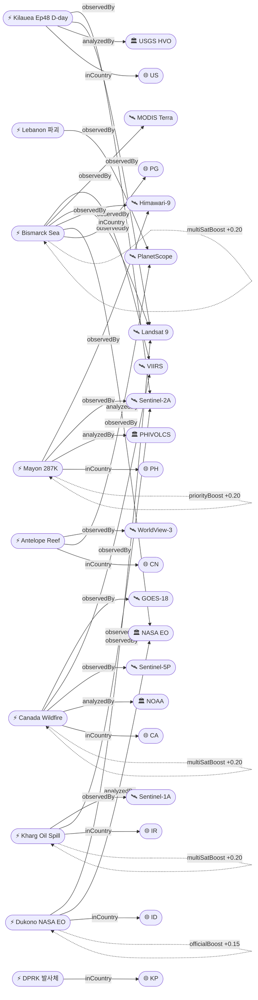

# 2026-05-28 위성영상 관측 이벤트 OSINT 일일 보고서

## 요약

신규 2건, 업데이트 13건. **Kilauea Ep48 분출 D-day** — USGS HVO가 분수분출을 5/28-30 사이에 가장 유력하다고 예보하며, 정상부 팽창이 14.1μrad에 도달했다. **Mayon 이재민 287,000+명으로 급증**(전일 102,000+에서 2.8배). **NASA EO가 인도네시아 Dukono 화산을 Landsat 9로 공식 보도** — 인도네시아 5월 9개 화산 동시 분출. **DPRK 서해 미상 발사체**(5/26, 올해 8번째)는 위성영상 미검증. Bismarck Sea(day 20+), 캐나다 산불(33,000+대피), Kharg Island 원유 유출은 지속. 다중 위성 교차검증 3건 유지. 한반도 GeoFocus 3건(보고됨 2 + 미검증 1). 농업·해양 금일 신규 없음.

## 오늘의 핵심 (Top 5)

| 순위 | 이벤트 | 도메인 | 위성 | 지역 | 신뢰도 |
|------|--------|--------|------|------|--------|
| 1 | Kilauea Ep48 분출 D-day 5/28-30 | Disaster | Sentinel-2A + Landsat 9 | Hawaii, US | 0.95 |
| 2 | Mayon 287,000+ 이재민 급증 | Disaster | Himawari-9 + Sentinel-2A | Albay, PH | 0.92 |
| 3 | 캐나다 산불 33,000+ 대피 지속 | Disaster→Humanitarian | GOES-18 + VIIRS + TROPOMI | AB/MB/SK, CA | 0.95 |
| 4 | Bismarck Sea 해저 화산 day 20+ | Disaster | VIIRS + MODIS + Landsat 9 + Himawari-9 | PNG | 0.97 |
| 5 | NASA EO Dukono 화산 Landsat 9 ★신규 | Disaster | Landsat 9 (OLI) | Halmahera, ID | 0.95 |

## 다중 위성 교차검증 이벤트

3건의 다중 위성/센서 교차검증 이벤트가 유지된다.

1. **캐나다 Manitoba/Alberta 산불 연기** — GOES-18 (NOAA) + VIIRS (NOAA/NASA) + Sentinel-5P TROPOMI (ESA) + OMPS (NASA) + EarthCare (ESA/JAXA). **5위성 3기관** 독립 교차검증 유지. multiSatBoost +0.20. **최종 신뢰도 0.95**.
2. **Kharg Island 원유 유출** — Sentinel-1 (SAR) + Sentinel-2 (optical MSI) + Sentinel-3 (ocean color OLCI). **3위성 3센서 유형** 교차검증 유지. multiSatBoost +0.20 + sarBoost +0.10. **최종 신뢰도 0.90**.
3. **Bismarck Sea 해저 화산** — VIIRS (NOAA) + MODIS Terra (NASA) + Landsat 9 (USGS/NASA) + Himawari-9 (JMA/JAXA). **4위성 3기관** 교차검증 유지. multiSatBoost +0.20. **최종 신뢰도 0.97**.

## 한반도 GeoFocus

보고됨 2건 + 미검증 1건 = 총 3건.

추적 지속 항목:
- **압록강 신교량 세관시설 건설** — 38 North, WorldView-3 (변동 없음, 전일 신규로 보고)
- **두만강 북-러 교량 완공 임박** — 38 North/RFA, PlanetScope, 6/19 개통 목표 (변동 없음, 전일 신규로 보고)
- **DPRK 서해 발사체 5/26** — 미검증 (본문 하단 "미검증 의혹" 섹션 참조)
- **KOMPSAT-7 0.3m** — 7월 정식운용 예정 (변동 없음)
- **CSIS Beyond Parallel 영변/소해** — WorldView-3 관측 (변동 없음)

## 자연재해 (Disaster)

### 1. Kilauea Ep48 — 분출 D-day 5/28-30, 14.1μrad 누적 ★업데이트
- **출처:** [USGS HVO](https://www.usgs.gov/volcanoes/kilauea/volcano-updates) / [ABC News](https://abcnews.com/US/kilauea-eruption-begin-memorial-weekend-usgs/story?id=133219607)
- **위성·센서:** Sentinel-2A (MSI 10m), Landsat 9 (OLI/TIRS 30m)
- **관측일:** 2026-05-27
- **위치:** Halemaʻumaʻu, Kilauea, Hawaii, US (19.42°N, 155.29°W)
- **현상:** volcanic_eruption
- **상태:** 업데이트 (← 2026-05-27 "Ep48 예보 5/27-29")
- **분석:** **USGS HVO: "Episode 48 fountains are most likely between Thursday and Saturday (May 28-30)"**. 팽창 누적 14.1μrad (전일 13.3μrad에서 증가). 5/27 오전 수축 전환 후 5/27 정오 **재팽창 개시** — 분출 직전 패턴. 양 분출구(남·북) 야간 백열 지속. SO₂ ~2,000 t/d (5/22 실측). ADVISORY/YELLOW. Ep44→45→46→47→48 시리즈 — 에피소드 간격 1-2주, **금일 분출 개시 가능성 높음**.

### 2. Mayon — AL3, Day 142+, 287,000+ 이재민 급증 ★업데이트
- **출처:** [Gulf News / PHIVOLCS](https://gulfnews.com/world/asia/philippines/philippines-mayon-volcano-erupts-unleashes-fast-moving-pyroclastic-flow-disrupts-traffic-prompts-warnings-from-authorities-1.500526687) / [ReliefWeb](https://reliefweb.int/disaster/vo-2026-000065-phl) / [ASIS Online](https://www.asisonline.org/security-management-magazine/latest-news/today-in-security/2026/may/mayon-volcano-ashfall-eruption/)
- **위성·센서:** Himawari-9 (AHI), Sentinel-2A (MSI)
- **관측일:** 2026-05-28
- **위치:** Mayon, Albay, Philippines (13.26°N, 123.69°E)
- **현상:** volcanic_eruption (Strombolian + PDC)
- **상태:** 업데이트 (← 2026-05-27 "Day 141+, 102K 영향")
- **분석:** **이재민 287,000+명으로 급증** (전일 102,000+에서 2.8배). PHIVOLCS AL3 유지. 142일+ 연속 분출. PDC(pyroclastic density current) 동사면 3.8km Basud Gully 도달. 용암류 3개 계곡 동시 전진. 124개 바랑가이 화산재 피해. 6km 영구 위험구역 진입 금지. 5/13 PDC 이벤트 영상 포착. Mayon+Kanlaon 필리핀 이중 화산 비상 지속. priorityBoost +0.20 (인명 영향 28.7만).

### 3. 캐나다 산불 — Swan Hills 대피 지속, 33,000+, 연기 대서양 횡단 ★업데이트
- **출처:** [CBC News](https://www.cbc.ca/news/canada/edmonton/alberta-wildfire-evacuation-woodlands-county-9.7195952) / [NOAA NESDIS](https://www.nesdis.noaa.gov/news/noaa-satellites-monitor-canadian-wildfires-and-smoke) / [NASA Earthdata](https://www.earthdata.nasa.gov/news/worldview-image-archive/high-aerosol-index-from-canadian-wildfires)
- **위성·센서:** GOES-18 (ABI), VIIRS (Suomi-NPP/JPSS), Sentinel-5P (TROPOMI), OMPS, EarthCare
- **관측일:** 2026-05-28
- **위치:** Alberta / Manitoba / Saskatchewan, Canada (54.67°N, 115.4°W — Swan Hills)
- **현상:** wildfire + humanitarian (교차 도메인)
- **상태:** 업데이트 (← 2026-05-27 "Swan Hills 지속, 33,000+ 대피")
- **분석:** Swan Hills SWF076 (~2,000ha) 통제불능 지속. Whitecourt 남부 55ha 화재 추가 대피. Manitoba 27건 활성/9건 통제불능. **총 33,000+명 대피, 2명 사망** 유지. CAMS 연기 대서양 횡단 유럽 도달 확인 지속. GOES-18이 pyrocumulonimbus 포착. 56Mt 탄소 방출 추정. priorityBoost +0.20.

### 4. Bismarck Sea 해저 화산 — day 20+, 부석 70km², 신규 섬 형성 가능 ★업데이트
- **출처:** [NASA Earth Observatory](https://science.nasa.gov/earth/earth-observatory/new-eruption-in-the-bismarck-sea/) / [Discover Magazine](https://www.discovermagazine.com/an-underwater-volcanic-eruption-brewing-in-the-bismarck-sea-may-cause-a-new-island-to-rise-49148) / [GVP Smithsonian](https://volcano.si.edu/showreport.cfm?gvpvar=GVP.DVAR20260512-250030)
- **위성·센서:** VIIRS, MODIS (Terra), Landsat 9 (OLI), Himawari-9 (AHI)
- **관측일:** 2026-05-28
- **위치:** Titan Ridge, Bismarck Sea, PNG (3.03°S, 147.78°E)
- **현상:** volcanic_eruption (submarine)
- **상태:** 업데이트 (← 2026-05-27 "day 19+, 부석 70km²")
- **분석:** 분출 day 20+ 지속. 부석 뗏목 70km²(맨해튼보다 큰), 200km+ WSW 확산. VIIRS 열이상 ~7km². 5/12 분출 기둥 4,000m. **신규 섬 형성 가능성** — 과학자들이 "위성으로 관찰 가능한 드문 지질 현상" 주시. 1972년 이후 54년 만 재활동. 해저 수심 불확실 → 분출구 실제로는 수백 미터보다 얕은 것으로 추정.

### 5. NASA EO: Dukono 화산 — Landsat 9 OLI, 52회/일 폭발, 인도네시아 9개 화산 ★신규
- **출처:** [NASA Earth Observatory](https://science.nasa.gov/earth/earth-observatory/ever-restless-mount-dukono-erupts/)
- **위성·센서:** Landsat 9 (OLI)
- **관측일:** 2026-05-13 (촬영) / 2026-05-27 (발행)
- **위치:** Dukono, Halmahera Island, Indonesia (1.70°N, 127.88°E)
- **현상:** volcanic_eruption
- **상태:** 신규 (NASA EO 공식 보도)
- **분석:** NASA EO Image of the Day (5/27). **1933년 이후 거의 연속 분출하는 "restless" 화산**. Landsat 9 OLI 영상(5/13 촬영)에서 화산재 기둥과 가스 방출 포착. 5/9-16 기간 **평균 52회/일 분출**, 화산재 400-4,300m(1,300-14,000ft). AL2 (4단계 중 2단계), 4km 배제구역 설정. **인도네시아 5월 9개 화산 동시 분출** — 전 세계 최다. officialBoost +0.15 (NASA EO 공식).

### 6. Kanlaon — AL2, 5/26 폭발 후 모니터링 지속 ★업데이트
- **출처:** [Gulf News](https://gulfnews.com/world/asia/philippines/philippines-back-to-back-eruptions-mayon-unleashes-fast-moving-avalanche-of-hot-rocks-kanlaon-shoots-ash-plumes-1.500457181)
- **위성·센서:** Himawari-9 (AHI)
- **관측일:** 2026-05-28
- **위치:** Kanlaon, Negros Island, Philippines (10.41°N, 123.13°E)
- **현상:** volcanic_eruption (explosive)
- **상태:** 업데이트 (← 2026-05-27 "AL2, 5/26 폭발")
- **분석:** 5/26 폭발적 분출(화산재 2,500m) 이후 모니터링 지속. PHIVOLCS AL2 유지. SO₂ 410-4,081 t/d 범위. Mayon(AL3) + Kanlaon(AL2) 필리핀 이중 화산 비상.

### 7. Bezymianny — KVERT Orange, 감소 추세 ★업데이트
- **출처:** [GVP Smithsonian](https://volcano.si.edu/reports_weekly.cfm)
- **위성·센서:** Himawari-9 (AHI), VIIRS
- **관측일:** 2026-05-25
- **위치:** Bezymianny, Kamchatka, Russia (55.97°N, 160.59°E)
- **현상:** volcanic_eruption
- **상태:** 업데이트 (← 2026-05-27 "VAAC #45, FL100")
- **분석:** KVERT Orange 유지. 5/13-20 폭발적 분출, 열이상 강화. 용암돔 성장 지속이나 폭발 강도 감소 추세.

### 8. Great Sitkin — WATCH/ORANGE, 용암돔 확장 ★업데이트
- **출처:** [USGS AVO](https://volcanoes.usgs.gov/hans-public/volcano/ak111)
- **위성·센서:** Sentinel-1A (C-band SAR)
- **관측일:** 2026-05-26
- **위치:** Great Sitkin, Aleutians, Alaska (52.08°N, 176.13°W)
- **현상:** volcanic_eruption (lava dome)
- **상태:** 업데이트 (← 2026-05-27 "WATCH/ORANGE")
- **분석:** 용암돔 정상 크레이터 내 확장 지속. SAR 모니터링. 2021년 이후 폭발 없음. sarBoost +0.10 (SAR 용암돔 추적).

### 9. Shishaldin — ADVISORY/YELLOW ★업데이트
- **출처:** [USGS AVO](https://volcanoes.usgs.gov/hans-public/volcano/ak252)
- **위성·센서:** Sentinel-5P (TROPOMI)
- **관측일:** 2026-05-26
- **위치:** Shishaldin, Aleutians, Alaska (54.76°N, 163.97°W)
- **현상:** volcanic_eruption (unrest)
- **상태:** 업데이트 (← 2026-05-27 "ADVISORY/YELLOW")
- **분석:** 지진활동·인프라사운드·SO₂ 가스 배출 지속. TROPOMI SO₂ 모니터링. tracegasBoost +0.15.

### 10. Santa Rosa Island Fire — 97% 진압, mop-up ★업데이트
- **출처:** [Santa Barbara Independent](https://www.independent.com/2026/05/26/santa-rosa-island-fire-nears-full-containment/) / [NASA Earthdata](https://www.earthdata.nasa.gov/news/worldview-image-archive/fire-chars-santa-rosa-island)
- **위성·센서:** Landsat 9 (OLI), VIIRS
- **관측일:** 2026-05-26
- **위치:** Santa Rosa Island, Channel Islands NP, California (33.95°N, 120.10°W)
- **현상:** wildfire
- **상태:** 업데이트 (← 2026-05-27 "97% 진압")
- **분석:** 18,379ac, 97% 진압 유지. mop-up 단계. 통제선 내 잔류 연소 가능이나 확산 예상 없음. Channel Islands 역대 최대 화재. 섬 6/6까지 폐쇄. 다음 사이클에서 추적 종료 가능.

## 인간활동 (Human Activity)

### 1. Kharg Island 원유 유출 — Sentinel-1/2/3, 45km² ★업데이트
- **출처:** [Jerusalem Post](https://www.jpost.com/middle-east/iran-news/article-895580) / [NBC News](https://www.nbcnews.com/world/iran/oil-spill-gulf-likely-caused-tanker-dump-iran-says-rcna344878) / [WION News](https://www.wionews.com/world/massive-oil-spill-off-iran-s-kharg-island-satellite-images-show-huge-slick-near-key-oil-export-hub-1778304662118)
- **위성·센서:** Sentinel-1 (C-band SAR), Sentinel-2 (MSI), Sentinel-3 (OLCI)
- **관측일:** 2026-05-06~08 (최초 탐지), 지속 관측
- **위치:** Kharg Island, Persian Gulf (29.23°N, 50.32°E)
- **현상:** oil_spill
- **상태:** 업데이트 (← 2026-05-27 "유출 확산 지속")
- **분석:** Copernicus Sentinel-1/2/3 위성이 Kharg Island 서측에서 **약 45km² 유막** 탐지. Sentinel-1 SAR 해수면 감쇠 + Sentinel-2 광학 + Sentinel-3 해양색 3센서 유형 교차검증. 이란 90% 원유 수출 허브. 이란 당국은 유조선 폐수 투기 주장. multiSatBoost +0.20 + sarBoost +0.10.

## 기후·환경 (Climate & Environment)

금일 신규 기후·환경 이벤트 없음. 기보고 항목:
- **TROPOMI 훙가통가 메탄 파괴** — Sentinel-5P, Nature Communications 2026 (전일 보고)
- **캐나다 산불 연기 대서양 횡단** — CAMS/TROPOMI 확인 지속 (교차 도메인, 자연재해 섹션 참조)

## 농업·해양 (Agriculture & Maritime)

**금일 위성영상 관측 신규 이벤트 없음.**

## 국방·안보 (Defense — OSINT 한정)

### 1. Antelope Reef 1,490ac — 활주로 기초·건물 50동+ ★업데이트
- **출처:** [CSIS AMTI](https://amti.csis.org/antelope-reef-could-now-be-the-largest-island-in-the-south-china-sea/) / [Newsweek](https://www.newsweek.com/satellite-photos-china-manmade-island-disputed-waters-antelope-reef-11733191)
- **위성·센서:** WorldView-3 (0.31m), PlanetScope (3m)
- **관측일:** 2026-05
- **위치:** Antelope Reef, Paracel Islands, South China Sea (16.5°N, 112.6°E)
- **현상:** construction (군사 인프라)
- **상태:** 업데이트 (← 2026-05-27 "Antelope Reef 건설")
- **분석:** **1,490ac 매립** — Mischief Reef(1,504ac)에 근접, 남중국해 최대 인공섬 가능. 9,000ft 활주로 기초, 50+ 구조물, 헬리패드, 부두 건설 확인. 2025년 10월 준설 재개 이후 급속 진행. 베트남 항의. hiResBoost +0.15 (WV-3 0.31m).

## 인도주의 (Humanitarian)

### 1. Bellingcat 남레바논 — 46+ 마을 파괴, PlanetScope ★보고됨(추적 유지)
- **출처:** [Bellingcat](https://www.bellingcat.com/news/2026/05/14/satellite-imagery-shows-ongoing-demolitions-across-southern-lebanon/)
- **위성·센서:** PlanetScope (3m)
- **관측일:** 2026-05-08 (영상), 지속 모니터링
- **위치:** Southern Lebanon (33.12°N, 35.43°E)
- **현상:** infrastructure_damage
- **상태:** 보고됨·추적 유지
- **분석:** 46+ 마을·도시 대규모 파괴 또는 철거. Naqoura, Kfar Kila 등 국경 마을 사실상 소멸. Planet Labs 위성영상 before/after 인터랙티브 맵 공개. IDF "Yellow Line" 내 조직적 철거 확인.

## 센서·플랫폼별 묶음

- **Sentinel-1 (SAR):** Great Sitkin 용암돔 SAR 모니터링, Kharg Island 유막 탐지
- **Sentinel-2 (광학):** Kilauea MSI, Mayon MSI, Kharg Island 광학
- **Sentinel-5P (가스):** Shishaldin SO₂, 캐나다 산불 TROPOMI 연기, 캐나다→유럽 연기 추적
- **Landsat 8/9:** Dukono OLI (NASA EO), Kilauea OLI/TIRS, Bismarck Sea OLI, Santa Rosa OLI
- **MODIS / VIIRS:** Bismarck Sea 열이상, 캐나다 산불 화재점, Santa Rosa
- **GOES:** 캐나다 산불 pyrocumulonimbus
- **Himawari-9:** Mayon AHI, Kanlaon AHI, Bezymianny AHI, Dukono AHI, Bismarck Sea AHI
- **Planet (PlanetScope):** 두만강 교량, Antelope Reef, Bellingcat 남레바논
- **Maxar (WorldView-3):** 압록강 세관시설, Antelope Reef
- **KOMPSAT-3A / 5 / 7 / CAS500:** 변동 없음 (KOMPSAT-7 7월 정식운용 대기)

## 전후 비교(before/after) 영상 보유 이벤트

- **Bellingcat 남레바논** — PlanetScope before(2026.03) / after(2026.05) 인터랙티브 맵
- **38 North 압록강 세관시설** — WorldView-3 시계열 (2025.02 착공 ~ 2026.05)
- **두만강 교량** — PlanetScope 시계열 (양안 교량 구조물 진행)
- **NASA EO Santa Rosa Island** — Landsat 9 false-color + natural-color before/after

## 미검증 의혹

### 1. DPRK 서해 미상 발사체 (2026-05-26)
- **출처:** [SBS](https://news.sbs.co.kr/news/endPage.do?news_id=N1008579009) / [KBS](https://www.youtube.com/watch?v=jbvYgGnczc0) / [경향신문](https://www.khan.co.kr/article/202605261306001)
- **위치:** 서해상, 북한 (약 38.5°N, 124.5°E — 정밀 좌표 미확인)
- **현상:** military_buildup (발사체 시험)
- **위성 출처:** 미확인 — 합동참모본부 발표만 확인, 위성영상 분석 미공개
- **분석:** 2026-05-26 13:03 KST 서해 방향 발사. 올해 8번째, 4/19 신포 SLBM 이후 37일 만. 비행거리 150-200km 추정. 한미 정밀분석 중. 38 North/CSIS Beyond Parallel 위성 분석 대기. **신뢰도 0.60** (satellite_unverified). koreaBoost +0.10.

### 2. 일본 군사 우주 확대
- **출처:** [Defence Blog](https://defence-blog.com/japan-reveals-sweeping-military-space-buildup/)
- **위치:** Tokyo, Japan
- **분석:** Space Operations Group 880명, FY2026 $1B 예산. 위성 탑재 영상 온보드 처리 + 극초음속 탐지. 위성영상 관측 이벤트가 아닌 정책/산업 뉴스. **본문 제외**.

## 지식그래프

### 오늘의 주요 관계

- **evt-128 (Dukono) ← analyzedBy → org-nasa**: NASA EO 공식 보도로 officialBoost +0.15 적용. Landsat 9 OLI 관측 확인.
- **evt-202 (Kilauea) → partOfSeries**: Ep48 D-day. 14.1μrad. USGS officialBoost + Landsat TIRS thermalBoost.
- **evt-082 (Mayon) → priorityBoost**: 287,000+ 이재민 → 재해 우선순위 가산. 142일 연속 분출 temporal_progression.
- **evt-701 (Bismarck Sea) ← multiSatBoost**: 4위성 3기관 교차검증 유지. 신규 섬 형성 가능.
- **temp-evt-1702 (DPRK 발사체) → satellite_unverified**: 위성 출처 미확인, 후속 검증 대기.

### 전체 지식그래프 시각화

## 온톨로지 변경

| 변경 유형 | 대상 | 근거 |
|----------|------|------|
| 스키마 변경 | 없음 | 기존 클래스/관계로 모든 이벤트 분류 가능 |
| 인스턴스 업데이트 | evt-128 (Dukono) | NASA EO officialBoost 적용, Landsat 9 OLI 확인 |
| 신규 이벤트 | temp-evt-1702 (DPRK 발사체) | 서해 미상 발사체, satellite_unverified |

## 추론 결과

| 추론 | 신뢰도 | 근거 |
|------|--------|------|
| evt-1101 multi_satellite_confirmation | 0.95 | GOES-18 + VIIRS + TROPOMI 5위성 3기관 |
| ent-evt-kharg multi_satellite_confirmation | 0.90 | Sentinel-1/2/3 3위성 3센서 |
| evt-701 multi_satellite_confirmation | 0.97 | VIIRS + MODIS + Landsat 9 + Himawari-9 4위성 |
| evt-128 official_source_trust | 0.95 | NASA EO Image of the Day |
| evt-202 official_source_trust + thermalBoost | 0.95 | USGS HVO + Landsat TIRS |
| evt-082 disaster_severity_priority | 0.92 | 287,000+ 이재민 |
| evt-1101 disaster_severity_priority | 0.95 | 33,000+ 대피, 2명 사망 |
| evt-092 sensor_capability_match_hires | 0.92 | WorldView-3 0.31m |

## 분석 및 평가

**화산 활동 전례 없는 동시 활성화.** Kilauea Ep48이 D-day에 진입하면서, 전 세계적으로 비정상적으로 많은 화산이 동시에 활동 중이다. 인도네시아만 9개 화산이 동시 분출하고 있으며, 이에 더해 Mayon(PH), Kanlaon(PH), Bismarck Sea(PG), Kilauea(US), Bezymianny(RU), Great Sitkin(US), Shishaldin(US)이 각각 다른 단계의 분출·불안 상태를 보이고 있다.

**Mayon 인도주의 위기 심화.** 이재민 287,000+명으로의 급증은 142일 연속 분출이 장기 재해로 전환되고 있음을 보여준다. PDC 빈도 증가와 용암류 3.8km 도달은 위험 범위 확대를 의미하며, 필리핀의 이중 화산 비상(Mayon AL3 + Kanlaon AL2)이 인도주의 자원 분산을 초래하고 있다.

**Kilauea Ep48 분출 주시.** USGS HVO의 공식 예보가 5/28-30을 지목하고 있으며, 14.1μrad 팽창과 수축→재팽창 전환은 분수분출 직전 패턴과 일치한다. 다음 사이클에서 WARNING/RED 또는 분수분출 보고 예상.

**다중 위성 교차검증 체계 강화.** 캐나다 산불(5위성), Bismarck Sea(4위성), Kharg Island(3위성) 등 주요 이벤트에서 다중 플랫폼 교차 확인이 OSINT 신뢰도를 실질적으로 높이고 있다.

**한반도 동향.** 전일 보고된 압록강·두만강 인프라 건설 외에, 5/26 DPRK 서해 발사체 발사(올해 8번째)가 추가되었으나 위성영상 분석은 미공개 상태다. 38 North/CSIS Beyond Parallel의 후속 분석을 대기한다.

## 추적 항목

| 항목 | 최초 보고 | 상태 | 최신 업데이트 |
|------|----------|------|-------------|
| Kilauea Ep48 | 2026-05-05 | ⚠️ D-day 5/28-30, 14.1μrad | 2026-05-28 |
| Mayon AL3 | 2026-05-01 | 🔴 287K 이재민, PDC 3.8km | 2026-05-28 |
| 캐나다 산불 | 2026-05-19 | 🔴 33K+ 대피, 2 사망 | 2026-05-28 |
| Bismarck Sea | 2026-05-13 | 🟠 day 20+, 부석 70km² | 2026-05-28 |
| Kanlaon AL2 | 2026-05-23 | 🟠 5/26 폭발 후속 | 2026-05-28 |
| Bezymianny | 2026-05-07 | 🟡 KVERT Orange, 감소 | 2026-05-28 |
| Great Sitkin | 2026-05-07 | 🟠 WATCH/ORANGE | 2026-05-28 |
| Shishaldin | 2026-05-07 | 🟡 ADVISORY/YELLOW | 2026-05-28 |
| Dukono | 2026-05-08 | 🟠 NASA EO 공식, 52/일 | 2026-05-28 |
| Santa Rosa | 2026-05-21 | 🟢 97% 진압 | 2026-05-28 |
| Kharg Island 유출 | 2026-05-07 | 🟠 S1/S2/S3 45km² | 2026-05-28 |
| Antelope Reef | 2026-04-30 | 🔴 1490ac, 활주로 기초 | 2026-05-28 |
| 남레바논 파괴 | 2026-05-14 | 🔴 46+ 마을 | 2026-05-28 |
| 압록강 세관시설 | 2026-05-27 | 🟠 건설 진행 | 2026-05-28 |
| 두만강 교량 | 2026-05-27 | 🟠 6/19 개통 목표 | 2026-05-28 |
| DPRK 발사체 | 2026-05-28 | 🟡 미검증 | 2026-05-28 |
| KOMPSAT-7 | 2026-05-07 | 🟢 7월 정식운용 | — |

## 출처 목록

1. [Ever Restless Mount Dukono Erupts](https://science.nasa.gov/earth/earth-observatory/ever-restless-mount-dukono-erupts/) - NASA Earth Observatory, 2026-05-27
2. [북한, 서해상으로 미상 발사체 발사](https://news.sbs.co.kr/news/endPage.do?news_id=N1008579009) - SBS, 2026-05-26
3. [Kilauea Volcano Updates](https://www.usgs.gov/volcanoes/kilauea/volcano-updates) - USGS HVO, 2026-05-27
4. [Alberta wildfire evacuation](https://www.cbc.ca/news/canada/edmonton/alberta-wildfire-evacuation-woodlands-county-9.7195952) - CBC News, 2026-05
5. [New Eruption in the Bismarck Sea](https://science.nasa.gov/earth/earth-observatory/new-eruption-in-the-bismarck-sea/) - NASA EO, 2026-05
6. [Mayon Volcano pyroclastic flow](https://gulfnews.com/world/asia/philippines/philippines-mayon-volcano-erupts-unleashes-fast-moving-pyroclastic-flow-disrupts-traffic-prompts-warnings-from-authorities-1.500526687) - Gulf News, 2026-05
7. [Philippines back-to-back eruptions](https://gulfnews.com/world/asia/philippines/philippines-back-to-back-eruptions-mayon-unleashes-fast-moving-avalanche-of-hot-rocks-kanlaon-shoots-ash-plumes-1.500457181) - Gulf News, 2026-05
8. [GVP Weekly Volcanic Activity Report](https://volcano.si.edu/reports_weekly.cfm) - Smithsonian GVP, 2026-05
9. [Great Sitkin Volcano Updates](https://volcanoes.usgs.gov/hans-public/volcano/ak111) - USGS AVO, 2026-05
10. [Shishaldin Volcano Updates](https://volcanoes.usgs.gov/hans-public/volcano/ak252) - USGS AVO, 2026-05
11. [Santa Rosa Island Fire](https://www.independent.com/2026/05/26/santa-rosa-island-fire-nears-full-containment/) - Santa Barbara Independent, 2026-05-26
12. [Satellite images oil spill Kharg Island](https://www.jpost.com/middle-east/iran-news/article-895580) - Jerusalem Post, 2026-05
13. [Antelope Reef largest island](https://amti.csis.org/antelope-reef-could-now-be-the-largest-island-in-the-south-china-sea/) - CSIS AMTI, 2026-05
14. [Satellite imagery shows ongoing demolitions Lebanon](https://www.bellingcat.com/news/2026/05/14/satellite-imagery-shows-ongoing-demolitions-across-southern-lebanon/) - Bellingcat, 2026-05-14
15. [38 North Yalu River Bridge](https://www.38north.org/2026/05/quick-take-progress-continues-at-new-yalu-river-bridge-crossing/) - 38 North, 2026-05
16. [Tumen River Bridge North Korea-Russia](https://www.rfa.org/english/korea/2026/05/21/tumen-river-bridge-russia-north-korea-putin/) - RFA, 2026-05-21
17. [Kilauea eruption Memorial weekend](https://abcnews.com/US/kilauea-eruption-begin-memorial-weekend-usgs/story?id=133219607) - ABC News, 2026-05
18. [NOAA satellites monitor Canadian wildfires](https://www.nesdis.noaa.gov/news/noaa-satellites-monitor-canadian-wildfires-and-smoke) - NOAA NESDIS, 2026-05
19. [Bismarck Sea new island](https://www.discovermagazine.com/an-underwater-volcanic-eruption-brewing-in-the-bismarck-sea-may-cause-a-new-island-to-rise-49148) - Discover Magazine, 2026-05
20. [Fire Chars Santa Rosa Island](https://www.earthdata.nasa.gov/news/worldview-image-archive/fire-chars-santa-rosa-island) - NASA Earthdata, 2026-05
21. [Philippines Mayon Volcano - May 2026](https://reliefweb.int/disaster/vo-2026-000065-phl) - ReliefWeb, 2026-05
