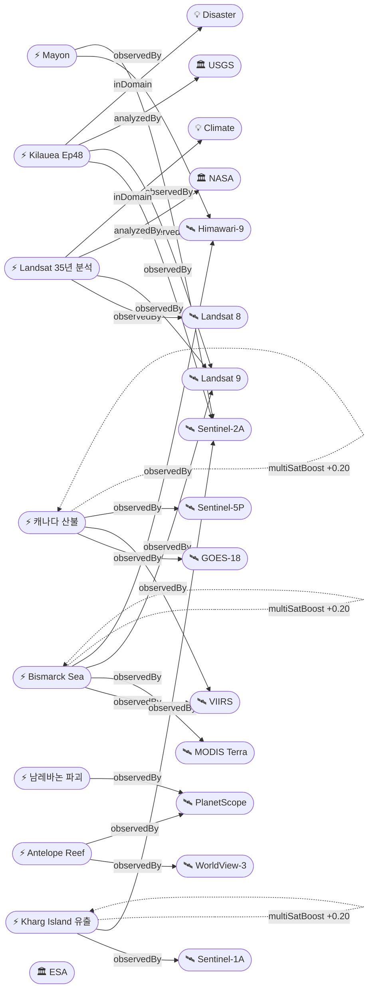

# 2026-05-29 위성영상 관측 이벤트 OSINT 일일 보고서

## 요약

신규 2건, 업데이트 13건. **NASA Earth Observatory가 Landsat 35년 시계열 분석 결과를 발표** — Nature Geoscience에 게재된 연구에서 미국 내 야생 교란(산불·허리케인)이 증가하는 반면 인간 교란(벌목·농업확장)이 감소하는 추세를 확인했다. **Kilauea Ep48 분출 예보 창(5/28-30) 유지** — 단, 편향(deflation) 이벤트로 지연 가능성 존재. **캐나다 Manitoba 주총리가 "역대 최대 규모 대피"** 선언(Flin Flon 17,000+명, 총 33,000+ 대피). **Bismarck Sea 해저 화산 day 21+** — 신규 섬 형성 가능성에 과학계 주시. **Mayon 287,000+ 이재민** 지속(Day 143+). Sentinel-2 CDSE 카탈로그 5시간 장애 발생 후 복구. 다중 위성 교차검증 3건 유지. 한반도 GeoFocus 4건(보고됨 3 + 미검증 1). 농업·해양 금일 신규 없음.

## 오늘의 핵심 (Top 5)

| 순위 | 이벤트 | 도메인 | 위성 | 지역 | 신뢰도 |
|------|--------|--------|------|------|--------|
| 1 | Kilauea Ep48 분출 예보 5/28-30 | Disaster | Sentinel-2A + Landsat 9 | Hawaii, US | 0.95 |
| 2 | Mayon 287,000+ 이재민 Day 143+ | Disaster | Himawari-9 + Sentinel-2A | Albay, PH | 0.92 |
| 3 | 캐나다 산불 33,000+ 대피 Manitoba 역대급 | Disaster→Humanitarian | GOES-18 + VIIRS + TROPOMI | MB/AB/SK, CA | 0.95 |
| 4 | Bismarck Sea 해저 화산 day 21+ | Disaster | VIIRS + MODIS + Landsat 9 + Himawari-9 | PNG | 0.97 |
| 5 | NASA EO Landsat 35년 토지교란 분석 ★신규 | Climate | Landsat 8 + Landsat 9 | US | 0.92 |

## 다중 위성 교차검증 이벤트

3건의 다중 위성/센서 교차검증 이벤트가 유지된다.

1. **캐나다 Manitoba/Alberta 산불 연기** — GOES-18 (NOAA) + VIIRS (NOAA/NASA) + Sentinel-5P TROPOMI (ESA) + OMPS (NASA) + EarthCare (ESA/JAXA). **5위성 3기관** 독립 교차검증 유지. multiSatBoost +0.20. **최종 신뢰도 0.95**.
2. **Kharg Island 원유 유출** — Sentinel-1 (SAR) + Sentinel-2 (optical MSI) + Sentinel-3 (ocean color OLCI). **3위성 3센서 유형** 교차검증 유지. multiSatBoost +0.20 + sarBoost +0.10. **최종 신뢰도 0.90**.
3. **Bismarck Sea 해저 화산** — VIIRS (NOAA) + MODIS Terra (NASA) + Landsat 9 (USGS/NASA) + Himawari-9 (JMA/JAXA). **4위성 3기관** 교차검증 유지. multiSatBoost +0.20. **최종 신뢰도 0.97**.

## 한반도 GeoFocus

보고됨 3건 + 미검증 1건 = 총 4건.

추적 지속 항목:
- **압록강 신교량 세관시설 건설** — 38 North, WorldView-3 (변동 없음)
- **두만강 북-러 교량 완공 임박** — 38 North/RFA, PlanetScope, 6/19 개통 목표 (변동 없음)
- **KOMPSAT-7 0.3m** — 7월 정식운용 예정 (변동 없음)
- **DPRK 서해 발사체 5/26** — 미검증 (본문 하단 "미검증 의혹" 섹션 참조)
- **CSIS Beyond Parallel 영변/소해** — WorldView-3 관측 (변동 없음)

## 자연재해 (Disaster)

### 1. Kilauea Ep48 — 분출 예보 5/28-30, 편향 지연 가능 ★업데이트
- **출처:** [USGS HVO](https://www.usgs.gov/volcanoes/kilauea/volcano-updates) / [Big Island Video News](https://www.bigislandvideonews.com/2026/05/26/kilauea-volcano-update-sharp-deflation-delays-episode-48/)
- **위성·센서:** Sentinel-2A (MSI 10m), Landsat 9 (OLI/TIRS 30m)
- **관측일:** 2026-05-28
- **위치:** Halemaʻumaʻu, Kilauea, Hawaii, US (19.42°N, 155.29°W)
- **현상:** volcanic_eruption
- **상태:** 업데이트 (← 2026-05-28 "Ep48 D-day 5/28-30")
- **분석:** USGS HVO 예보 창 5/28-30 유지. 팽창 누적 14.1μrad. **5/26 sharp deflation 이벤트**가 발생하여 예보 창 지연 가능성 — "deflation may push that window out further depending on how long deflation persists." 이후 재팽창 개시 여부가 핵심 판단 지표. 양 분출구(남·북) 야간 백열 지속. ADVISORY/YELLOW 유지. Ep44→45→46→47→48 시리즈.

### 2. Mayon — AL3, Day 143+, 287,000+ 이재민 ★업데이트
- **출처:** [IQAir](https://www.iqair.com/newsroom/volcanic-eruption-map-spotlight-mayon-volcano-philippines-5-2026) / [ReliefWeb GLIDE](https://reliefweb.int/disaster/vo-2026-000065-phl) / [WCK](https://wck.org/news/mt-mayon/)
- **위성·센서:** Himawari-9 (AHI), Sentinel-2A (MSI)
- **관측일:** 2026-05-29
- **위치:** Mayon, Albay, Philippines (13.26°N, 123.69°E)
- **현상:** volcanic_eruption (Strombolian + PDC)
- **상태:** 업데이트 (← 2026-05-28 "Day 142+, 287K+")
- **분석:** 287,000+명 이재민 지속. PHIVOLCS AL3 유지. 143일+ 연속 분출. PDC 동사면 3.8km Basud Gully 도달. 용암류 3개 계곡 동시. 124개 바랑가이 화산재. **우기 접근으로 라하르 위험 증가.** WCK 구호 활동 진행. Mayon+Kanlaon 이중 화산 비상 지속. SO₂ 평균 2,466 t/d(3월 최대 7,633 t). priorityBoost +0.20.

### 3. 캐나다 산불 — Manitoba "역대 최대 대피", 33,000+, 2명 사망 ★업데이트
- **출처:** [CBS News](https://www.cbsnews.com/news/canada-wildfires-smoke-deaths-evacuations-manitoba-saskatchewan-alberta/) / [CBC](https://www.cbc.ca/news/canada/edmonton/alberta-wildfire-evacuation-woodlands-county-9.7195952)
- **위성·센서:** GOES-18 (ABI), VIIRS (Suomi-NPP/JPSS), Sentinel-5P (TROPOMI), OMPS, EarthCare
- **관측일:** 2026-05-29
- **위치:** Manitoba / Alberta / Saskatchewan, Canada (54.77°N, 101.88°W — Flin Flon)
- **현상:** wildfire + humanitarian (교차 도메인)
- **상태:** 업데이트 (← 2026-05-28 "33,000+ 대피")
- **분석:** **Manitoba 주총리 Wab Kinew: "the largest evacuation Manitoba will have seen in most people's living memory."** Flin Flon 17,000+명 추가 대피 명령. Swan Hills (AB) 12,000명 대피 지속. **총 33,000+ 대피, 2명 사망**(Lac du Bonnet). Manitoba 27건 활성/9건 통제불능. Alberta ~50건 활성/16건 통제불능. GOES-18 pyrocumulonimbus 포착. CAMS 연기 대서양 횡단 유럽 도달 지속. priorityBoost +0.20.

### 4. Bismarck Sea 해저 화산 — day 21+, 신규 섬 형성 가능 ★업데이트
- **출처:** [The Watchers](https://watchers.news/2026/05/28/submarine-eruption-near-titan-ridge-opens-new-island-possibility-in-the-bismarck-sea-papua-new-guinea/) / [NASA EO](https://science.nasa.gov/earth/earth-observatory/new-eruption-in-the-bismarck-sea/) / [Discover Magazine](https://www.discovermagazine.com/an-underwater-volcanic-eruption-brewing-in-the-bismarck-sea-may-cause-a-new-island-to-rise-49148)
- **위성·센서:** VIIRS, MODIS (Terra), Landsat 9 (OLI), Himawari-9 (AHI)
- **관측일:** 2026-05-29
- **위치:** Titan Ridge, Bismarck Sea, PNG (3.03°S, 147.78°E)
- **현상:** volcanic_eruption (submarine)
- **상태:** 업데이트 (← 2026-05-28 "day 20+")
- **분석:** 분출 day 21+ 지속. 부석 뗏목 70km²(맨해튼 면적 초과), 200km+ WSW 확산. VIIRS 열이상 ~7km². **Jim Garvin (NASA Goddard): "eagerly waiting to see if a new island is about to be born—something that we've only rarely been able to observe with satellites as it happens."** Simon Carn (Michigan Tech): "a fairly shallow eruption vent—much shallower than what's implied by the existing bathymetry." 1972년 이후 54년 만 재활동.

### 5. Kanlaon — AL2, 화산재 800m, SO₂ 상승 ★업데이트
- **출처:** [Anadolu Agency](https://www.aa.com.tr/en/asia-pacific/philippines-kanlaon-volcano-erupts-spews-ash-800-meters/3927296) / [GVP](https://volcano.si.edu/volcano.cfm?vn=272020)
- **위성·센서:** Himawari-9 (AHI)
- **관측일:** 2026-05-29
- **위치:** Kanlaon, Negros Island, Philippines (10.41°N, 123.13°E)
- **현상:** volcanic_eruption
- **상태:** 업데이트 (← 2026-05-28 "AL2 모니터링")
- **분석:** AL2 유지. 화산재 800m 분출. SO₂ 142-1,464 t/d. 일 6-31회 화산 지진. 4km 영구 위험구역 진입 금지. 5/26 폭발 후 지속적 분출 활동.

### 6. Bezymianny — KVERT Orange, pyroclastic flow ★업데이트
- **출처:** [GVP Smithsonian Weekly Report](https://volcano.si.edu/reports_weekly.cfm)
- **위성·센서:** Himawari-9 (AHI), VIIRS
- **관측일:** 2026-05-29
- **위치:** Bezymianny, Kamchatka, Russia (55.97°N, 160.59°E)
- **현상:** volcanic_eruption (explosive)
- **상태:** 업데이트 (← 2026-05-28 "감소 추세")
- **분석:** **에스컬레이션** — 5/13 Orange 상향, 5/18 화산재 6km(hot avalanches), **5/19 paroxysm + pyroclastic flow.** Klyuchevskoy 화산군. KVERT Aviation Color Code Orange 유지.

### 7. Great Sitkin — WATCH/ORANGE, 용암돔 확장 ★업데이트
- **출처:** [USGS AVO](https://volcanoes.usgs.gov/hans-public/volcano/ak111)
- **위성·센서:** Sentinel-1A (C-band SAR 5m)
- **관측일:** 2026-05-27
- **위치:** Great Sitkin, Aleutians, Alaska, US (52.08°N, 176.13°W)
- **현상:** volcanic_eruption (slow lava dome)
- **상태:** 업데이트 (← 2026-05-28 "WATCH 지속")
- **분석:** 용암돔 성장 지속. 2021년 7월 이후 분출 계속. SAR 관측으로 용암류 동측 계곡 확장 확인. 구름으로 광학 관측 제한.

### 8. Shishaldin — ADVISORY/YELLOW, SO₂ ★업데이트
- **출처:** [USGS AVO](https://volcanoes.usgs.gov/hans-public/volcano/ak252)
- **위성·센서:** Sentinel-5P (TROPOMI)
- **관측일:** 2026-05-27
- **위치:** Shishaldin, Aleutians, Alaska, US (54.76°N, 163.97°W)
- **현상:** volcanic_eruption (unrest)
- **상태:** 업데이트 (← 2026-05-28 "ADVISORY 지속")
- **분석:** ADVISORY/YELLOW 유지. 지진 + infrasound + SO₂ 지속. TROPOMI 가스 모니터링.

### 9. Santa Rosa Island — 97% 진압, mop-up ★업데이트
- **출처:** [InciWeb](https://inciweb.wildfire.gov/incident-information/cacnp-santa-rosa-island-fire) / [Santa Barbara Independent](https://www.independent.com/2026/05/26/santa-rosa-island-fire-nears-full-containment/)
- **위성·센서:** Landsat 9 (OLI), VIIRS
- **관측일:** 2026-05-29
- **위치:** Santa Rosa Island, Channel Islands NP, California, US (33.95°N, 120.10°W)
- **현상:** wildfire
- **상태:** 업데이트 (← 2026-05-28 "97% 진압")
- **분석:** 18,379ac, 97% 진압 유지. Mop-up 복구·suppression repair 진행. 6/6까지 섬 폐쇄. 2026 캘리포니아 최대 화재 + Channel Islands 역대 최대. 다음 사이클에서 100% 진압·추적 종료 가능.

## 인간활동 (Human Activity)

### 1. Kharg Island 원유 유출 — 45km², Sentinel-1/2/3 모니터링 ★업데이트
- **출처:** [Jerusalem Post](https://www.jpost.com/middle-east/iran-news/article-895580) / [Al Jazeera](https://www.aljazeera.com/video/newsfeed/2026/5/10/satellite-images-show-likely-oil-slick-off-irans-kharg-island)
- **위성·센서:** Sentinel-1A (SAR C-band), Sentinel-2A (MSI), Sentinel-3 (OLCI)
- **관측일:** 2026-05-29
- **위치:** Kharg Island, Persian Gulf, Iran (29.23°N, 50.32°E)
- **현상:** oil_spill
- **상태:** 업데이트 (← 2026-05-28 "45km² 지속")
- **분석:** 45km² 유출 지속. 이란 당국은 "psychological warfare"로 부정. 독립 분석가: 유조선 폐기물 또는 해저 파이프라인 파열 가능. **Sentinel-1 SAR 해면 감쇠(low backscatter) + Sentinel-2 광학 + Sentinel-3 해색** 3센서 유형 교차검증. sarBoost +0.10.

### 2. 압록강 신교량 세관시설 건설 ★보고됨(추적 지속)
- **출처:** [38 North](https://www.38north.org/2026/05/quick-take-progress-continues-at-new-yalu-river-bridge-crossing/)
- **위성·센서:** WorldView-3 (0.31m)
- **위치:** Sinuiju, North Korea (40.1°N, 124.4°E)
- **현상:** construction
- **상태:** 보고됨 — 변동 없음

### 3. 두만강 북-러 교량 완공 임박 ★보고됨(추적 지속)
- **출처:** [RFA](https://www.rfa.org/english/korea/2026/05/21/tumen-river-bridge-russia-north-korea-putin/)
- **위성·센서:** PlanetScope (3m)
- **위치:** Tumen River, DPRK-Russia border (42.4°N, 130.6°E)
- **현상:** construction
- **상태:** 보고됨 — 6/19 개통 목표

## 기후·환경 (Climate & Environment)

### 1. NASA EO: 미국 토지교란 유형 변화 — Landsat 35년 분석 ★신규
- **출처:** [NASA Earth Observatory](https://science.nasa.gov/earth/earth-observatory/a-shift-in-whats-shaping-u-s-landscapes/) / [Mirage News](https://www.miragenews.com/shift-in-whats-shaping-us-landscapes-1681798/)
- **위성·센서:** Landsat 8 (OLI), Landsat 9 (OLI) + Landsat 5/7 (역사적 데이터)
- **관측일:** 2026-05-28 (발행)
- **위치:** Continental United States (39.0°N, 98.0°W — 중심점)
- **현상:** ndvi_change (토지 교란 유형 변화)
- **상태:** 신규
- **분석:** NASA EO Image of the Day 5/28. **Nature Geoscience에 게재된 NASA-funded 연구.** Zhe Zhu(전 Landsat 과학팀원) 주도, 35년간 Landsat 위성 데이터 분석. 새 ML 알고리즘으로 40년 토지변화 데이터를 50,000개 지점에서 훈련, **75%+ 정확도.** 핵심 발견: **"human-directed disturbances" (벌목·농업확장·건설) 감소, "wild disturbances" (산불·허리케인) 증가.** 35년 시계열 before/after 가용. officialBoost +0.15 (NASA/USGS).

## 농업·해양 (Agriculture & Maritime)

금일 위성영상 관측 신규 이벤트 없음.

## 국방·안보 (Defense — OSINT 한정)

### 1. Antelope Reef — 1490ac, 남중국해 최대 인공섬 가능 ★업데이트
- **출처:** [CSIS AMTI](https://amti.csis.org/antelope-reef-could-now-be-the-largest-island-in-the-south-china-sea/) / [Lowy Institute](https://www.lowyinstitute.org/the-interpreter/china-remaking-south-china-sea-return-island-building)
- **위성·센서:** WorldView-3 (0.31m), PlanetScope (3m)
- **관측일:** 2026-05-29
- **위치:** Antelope Reef, Paracel Islands (16.5°N, 112.6°E — 정밀도 소수점 1자리)
- **현상:** military_buildup
- **상태:** 업데이트 (← 2026-05-28 "1490ac 지속")
- **분석:** 매립 면적 1,490ac — Mischief Reef(1,504ac)에 근접, **남중국해 최대 인공섬 가능.** 건물 50+동, 헬리패드, 제방 구축. 북서측 11,000ft 이상 직선 외곽 → **9,000ft급 활주로 건설 기초** 추정. 2017년 이후 첫 대규모 인공섬 건설 재개. hiResBoost +0.15 (WorldView-3 0.31m). analystBoost +0.10 (CSIS AMTI).

## 인도주의 (Humanitarian)

### 1. Bellingcat 남레바논 46+ 마을 파괴 ★보고됨(추적 지속)
- **출처:** [Bellingcat](https://www.bellingcat.com/news/2026/05/14/satellite-imagery-shows-ongoing-demolitions-across-southern-lebanon/)
- **위성·센서:** PlanetScope (Planet Labs, 3m)
- **관측일:** 2026-03-02 ~ 2026-05-08 (before/after)
- **위치:** Southern Lebanon (33.1°N, 35.4°E — 정밀도 소수점 1자리)
- **현상:** infrastructure_damage
- **상태:** 보고됨 — PlanetScope before/after 인터랙티브 맵 공개 지속
- **분석:** IDF "Yellow Line" 내 54개 마을 중 46+개 중대 피해 또는 완전 파괴. 최근 수주 간 통제 폭파 또는 중장비 철거 집중. 2024년 침공 시 기존 피해에 추가. **before/after 가용** (2026-03-02 vs 2026-05-08).

## 센서·플랫폼별 묶음

- **Sentinel-1 (SAR):** Kharg Island 유출 매핑 (해면 감쇠), Great Sitkin 용암돔 (SAR 변화탐지)
- **Sentinel-2 (광학 MSI):** Kilauea 정상 관측, Mayon 화산재 매핑, Kharg Island 광학 교차, Sentinel-2 CDSE 5시간 장애 (5/28)
- **Sentinel-5P (TROPOMI):** Canada 산불 연기 대서양 추적, Shishaldin SO₂, 캐나다 산불 에어로졸
- **Landsat 8/9:** NASA EO Landsat 35년 분석(OLI), Kilauea InSAR/열적외, Bismarck Sea 열이상, Santa Rosa burn scar
- **MODIS / VIIRS:** Bismarck Sea 열·부석, Canada 산불 열점·연기, Bezymianny 화산재
- **GOES-18:** Canada 산불 pyrocumulonimbus 실시간
- **Himawari-9:** Mayon 연속 관측, Kanlaon 화산재, Bezymianny 화산재, Bismarck Sea 화산 구름
- **Planet (PlanetScope):** Bellingcat 남레바논 before/after, 두만강 교량, Antelope Reef 변화탐지
- **Maxar (WorldView-3):** 38 North 압록강 교량 (0.31m), Antelope Reef 고해상도
- **KOMPSAT-7:** 한반도 0.3m 관측 — 7월 정식운용 대기

## 전후 비교(before/after) 영상 보유 이벤트

| 이벤트 | 위성 | 시점 |
|--------|------|------|
| NASA EO Landsat 35년 분석 | Landsat 시리즈 | 1985-2020 (35년 시계열) |
| Bellingcat 남레바논 46+ 마을 | PlanetScope | 2026-03-02 vs 2026-05-08 |
| Bismarck Sea 해저 화산 | Landsat 9 / MODIS / VIIRS | 분출 전후 열·색 변화 |

## 미검증 의혹

위성영상 출처가 미확인된 이벤트 — 후속 위성분석 대기.

### 1. DPRK 서해 발사체 (5/26) ★보고됨
- **출처:** [SBS 뉴스](https://news.sbs.co.kr/news/endPage.do?news_id=N1008579009)
- **위치:** 서해상, North Korea (38.5°N, 124.5°E — 추정)
- **현상:** 미상 발사체 발사
- **상태:** 위성영상 미검증 — 올해 8번째, 37일 만 재개
- **신뢰도:** 0.60 (위성 출처 없음)
- **비고:** 합참 발표 기반. 150-200km 비행 추정. 38 North/CSIS Beyond Parallel 위성영상 분석 대기.

### 2. AEI 한반도 종합 업데이트 (5/27) ★보고됨
- **출처:** [AEI](https://www.aei.org/articles/korean-peninsula-update-may-27-2026/)
- **위치:** North Korea
- **상태:** 위성영상 미검증 — 정책 분석 종합
- **신뢰도:** 0.70

## 위성 운영 (SatOps)

### 1. Sentinel-2 CDSE 카탈로그 발행 장애 (5/28) ★신규
- **출처:** [Copernicus Data Space](https://dataspace.copernicus.eu/news/2026-5-28-sentinel-2-product-publication-issue-2805)
- **영향 위성:** Sentinel-2A, 2B, 2C + CLMS 제품
- **기간:** 2026-05-28 05:45 ~ 10:45 CEST (약 5시간)
- **상태:** 복구 완료
- **분석:** CDSE 카탈로그 발행 중단. 이전 5/8 NorthC datacenter fire(evt-201)와 별개 인시던트. 비교적 신속 복구.

### 추적 지속:
- **Sentinel-1D 4위성 콘스텔레이션 운영** — 재방문 4일 달성 (보고됨)
- **KOMPSAT-7 0.3m 운용** — 7월 정식 (보고됨)

## 지식그래프

### 오늘의 주요 관계

- **신규 이벤트 2건** 추가 — NASA EO Landsat 35년 분석(dom-climate), Sentinel-2 CDSE 장애(satops)
- **다중 위성 교차검증 3건** 유지 — 캐나다 산불(5위성 3기관), Kharg Island(3위성 3센서), Bismarck Sea(4위성 3기관)
- **시계열 추적 3건** — Kilauea Ep48→Ep47 시리즈, Mayon Day 143+, Bismarck Sea day 21+
- **재해 심각도 2건** — 캐나다 산불(33K+ 대피), Mayon(287K+ 이재민)

### 전체 지식그래프 시각화

## 온톨로지 변경

| 변경 유형 | 대상 | 근거 |
|----------|------|------|
| 새 이벤트 | temp-evt-1801 (Landsat 35년 분석) | NASA EO 5/28 발행, Nature Geoscience |
| 새 이벤트 | temp-evt-1802 (Sentinel-2 CDSE 장애) | ESA 공식 공지 5/28 |
| 스키마 변경 | 없음 | 기존 클래스·관계로 충분 |

## 추론 결과

| 추론 | 신뢰도 | 근거 |
|------|--------|------|
| evt-1101 multi_satellite_confirmation | 0.95 | GOES-18 + VIIRS + S5P + OMPS + EarthCare (5위성 3기관) |
| ent-evt-kharg multi_satellite_confirmation | 0.90 | Sentinel-1 + 2 + 3 (3위성 3센서 유형) |
| evt-701 multi_satellite_confirmation | 0.97 | VIIRS + MODIS + Landsat 9 + Himawari-9 (4위성 3기관) |
| evt-202 official_source_trust | 0.95 | USGS HVO space_agency |
| temp-evt-1801 official_source_trust | 0.92 | NASA EO space_agency |
| evt-1101 disaster_severity_priority | 0.95 | 33,000+ 대피 + 2 사망 |
| evt-082 disaster_severity_priority | 0.92 | 287,000+ 이재민 |
| ent-evt-kharg sensor_SAR | 0.90 | Sentinel-1 SAR 해면 감쇠 |
| evt-202 temporal_progression | 0.95 | Ep48 → partOfSeries Ep47→46→45→44 |
| evt-082 temporal_progression | 0.92 | Day 143+ → partOfSeries Day 142+ |
| evt-701 temporal_progression | 0.97 | day 21+ → partOfSeries day 20+ |
| evt-092 sensor_hires | 0.92 | WorldView-3 0.31m 건설 식별 |

## 분석 및 평가

### 도메인별 동향

**자연재해:** 전 세계적으로 화산 활동이 비정상적으로 활발하다. 필리핀(Mayon AL3 + Kanlaon AL2), 러시아(Bezymianny paroxysm), 미국(Kilauea Ep48 임박 + Great Sitkin + Shishaldin), PNG(Bismarck Sea 해저 분출), 인도네시아(Dukono 포함 9개 화산 동시) — 5개 국가에서 8개 이상의 화산이 동시 활동 중이다. 캐나다 산불은 Manitoba 역대급 대피로 심각도가 에스컬레이션되었다.

**기후·환경:** NASA EO의 Landsat 35년 분석은 기후 변화가 미국 토지 변화의 주요 동인으로 부상하고 있음을 보여주는 장기 추세 데이터이다. 산불과 허리케인이 벌목·농업확장보다 더 큰 토지 교란 요인이 되고 있다.

**인간활동:** Antelope Reef 인공섬 건설(1490ac)이 남중국해 최대 규모로 성장 중이며, Kharg Island 원유 유출(45km²)은 Sentinel-1/2/3 3센서 교차검증으로 추적 지속. 북한 국경 인프라(압록강·두만강 교량)도 지속 추적.

**위성 운영:** Sentinel-2 CDSE 5시간 장애가 발생했으나 빠르게 복구. 이전 5/8 datacenter fire, 5/19 Sentinel-1A 데이터 유실에 이은 세 번째 Copernicus 인프라 인시던트.

### 한반도 관측

한반도 직접 위성 관측 신규 이벤트 없음. 38 North 압록강/두만강 교량 건설 추적 지속. DPRK 서해 발사체(5/26)는 위성영상 미검증 상태. KOMPSAT-7 0.3m 정식운용(7월)이 한반도 자체 관측 역량의 전환점이 될 것.

## 추적 항목

| 항목 | 최초 보고 | 상태 | 최신 업데이트 |
|------|----------|------|-------------|
| Kilauea 반복 분수분출 | 2026-04-30 | Ep48 예보 5/28-30 | 편향 지연 가능 |
| Mayon 연속 분출 | 2026-05-01 | AL3, Day 143+ | 287K+ 이재민 |
| 캐나다 산불 | 2026-05-19 | 33K+ 대피, 2 사망 | Manitoba 역대급 |
| Bismarck Sea 해저 화산 | 2026-05-13 | day 21+, pumice 70km² | 신규 섬 가능 |
| Kanlaon 화산 | 2026-05-23 | AL2, 화산재 | SO₂ 상승 |
| Bezymianny 화산 | 2026-05-05 | KVERT Orange | pyroclastic flow |
| Great Sitkin 용암돔 | 2026-05-08 | WATCH/ORANGE | 확장 지속 |
| Shishaldin 불안 | 2026-05-08 | ADVISORY/YELLOW | SO₂ 지속 |
| Santa Rosa Island 산불 | 2026-05-21 | 97% 진압 | mop-up |
| Kharg Island 유출 | 2026-05-19 | 45km², 3센서 교차 | 지속 |
| Antelope Reef | 2026-04-30 | 1490ac, 건설 | 활주로 기초 |
| 남레바논 파괴 | 2026-05-14 | 46+ 마을 | before/after |
| 압록강 교량 | 2026-05-27 | 건설 중 | 변동 없음 |
| 두만강 교량 | 2026-05-27 | 완공 임박 | 6/19 개통 |
| DPRK 발사체 5/26 | 2026-05-28 | 미검증 | 위성 분석 대기 |

## 출처 목록

1. [A Shift in What's Shaping U.S. Landscapes](https://science.nasa.gov/earth/earth-observatory/a-shift-in-whats-shaping-u-s-landscapes/) - NASA Earth Observatory, 2026-05-28
2. [Sentinel-2 product publication issue](https://dataspace.copernicus.eu/news/2026-5-28-sentinel-2-product-publication-issue-2805) - Copernicus Data Space, 2026-05-28
3. [Kīlauea Volcano Updates](https://www.usgs.gov/volcanoes/kilauea/volcano-updates) - USGS HVO
4. [Canada wildfires spread, forcing more than 33,000 to evacuate](https://www.cbsnews.com/news/canada-wildfires-smoke-deaths-evacuations-manitoba-saskatchewan-alberta/) - CBS News
5. [Submarine eruption near Titan Ridge](https://watchers.news/2026/05/28/submarine-eruption-near-titan-ridge-opens-new-island-possibility-in-the-bismarck-sea-papua-new-guinea/) - The Watchers, 2026-05-28
6. [Volcanic Eruption Map Spotlight: Mayon](https://www.iqair.com/newsroom/volcanic-eruption-map-spotlight-mayon-volcano-philippines-5-2026) - IQAir
7. [Kanlaon Volcano erupts, spews ash 800 meters](https://www.aa.com.tr/en/asia-pacific/philippines-kanlaon-volcano-erupts-spews-ash-800-meters/3927296) - Anadolu Agency
8. [GVP Weekly Volcanic Activity Report](https://volcano.si.edu/reports_weekly.cfm) - Smithsonian GVP
9. [Great Sitkin volcano updates](https://volcanoes.usgs.gov/hans-public/volcano/ak111) - USGS AVO
10. [Shishaldin volcano updates](https://volcanoes.usgs.gov/hans-public/volcano/ak252) - USGS AVO
11. [Santa Rosa Island Fire](https://inciweb.wildfire.gov/incident-information/cacnp-santa-rosa-island-fire) - InciWeb
12. [Suspected oil spill near Kharg Island](https://www.jpost.com/middle-east/iran-news/article-895580) - Jerusalem Post
13. [Antelope Reef largest island in South China Sea](https://amti.csis.org/antelope-reef-could-now-be-the-largest-island-in-the-south-china-sea/) - CSIS AMTI
14. [Satellite imagery shows ongoing demolitions in Lebanon](https://www.bellingcat.com/news/2026/05/14/satellite-imagery-shows-ongoing-demolitions-across-southern-lebanon/) - Bellingcat
15. [38 North Yalu River Bridge](https://www.38north.org/2026/05/quick-take-progress-continues-at-new-yalu-river-bridge-crossing/) - 38 North
16. [Tumen River bridge North Korea Russia](https://www.rfa.org/english/korea/2026/05/21/tumen-river-bridge-russia-north-korea-putin/) - RFA
17. [New Eruption in the Bismarck Sea](https://science.nasa.gov/earth/earth-observatory/new-eruption-in-the-bismarck-sea/) - NASA EO
18. [Kilauea sharp deflation delays Episode 48](https://www.bigislandvideonews.com/2026/05/26/kilauea-volcano-update-sharp-deflation-delays-episode-48/) - Big Island Video News
19. [Philippines Mayon volcano](https://reliefweb.int/disaster/vo-2026-000065-phl) - ReliefWeb GLIDE
20. [Santa Rosa Island Fire nears full containment](https://www.independent.com/2026/05/26/santa-rosa-island-fire-nears-full-containment/) - Santa Barbara Independent
21. [Korean Peninsula Update May 27](https://www.aei.org/articles/korean-peninsula-update-may-27-2026/) - AEI
