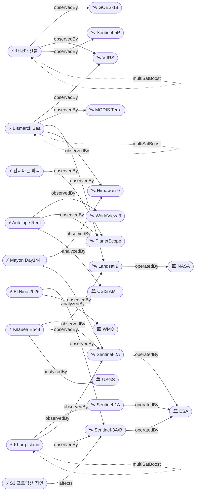

# 2026-05-30 위성영상 관측 이벤트 OSINT 일일 보고서

## 요약

신규 3건, 업데이트 13건. **Kilauea Ep48 분출 예보 창이 5/29-31로 갱신** — 15.8μrad 팽창 누적, 양 분출구 백열 및 spatter 관측. **WMO가 2026년 엘니뇨 발생 확률 60%를 발표**하며 Super El Niño 가능성까지 언급, 아시아 작물 피해 우려. **캐나다 Manitoba 33,000+명 대피·2명 사망** 지속(5위성 3기관 교차검증). Bismarck Sea 해저 화산 day 22+(부석 70km², 4위성). Mayon 287,000+ 이재민 Day 144+. **Sentinel-3 L1/L2 프로덕션 지연** 및 **Sentinel-1A 5/24 데이터 유실** 등 Copernicus 위성 운영 이슈 2건 신규. 다중 위성 교차검증 3건 유지. 한반도 GeoFocus 4건(추적 지속). 자연재해 10건, 인간활동 1건, 기후·환경 0건(전일 신규 보고), 농업·해양 1건(엘니뇨 신규), 국방 1건, 인도주의 1건.

## 오늘의 핵심 (Top 5)

| 순위 | 이벤트 | 도메인 | 위성 | 지역 | 신뢰도 |
|------|--------|--------|------|------|--------|
| 1 | Kilauea Ep48 분출 예보 5/29-31 | Disaster | Sentinel-2A + Landsat 9 | Hawaii, US | 0.95 |
| 2 | 캐나다 산불 33,000+ 대피 2명 사망 | Disaster→Humanitarian | GOES-18 + VIIRS + TROPOMI + OMPS + EarthCare | MB/AB/SK, CA | 0.95 |
| 3 | Bismarck Sea 해저 화산 day 22+ | Disaster | VIIRS + MODIS + Landsat 9 + Himawari-9 | PNG | 0.97 |
| 4 | Mayon 287,000+ 이재민 Day 144+ | Disaster | Himawari-9 + Sentinel-2A | Albay, PH | 0.92 |
| 5 | El Niño 2026 WMO 60% — 아시아 작물 위기 ★신규 | AgriMarine | ECMWF SST 위성관측 | Equatorial Pacific | 0.80 |

## 다중 위성 교차검증 이벤트

3건의 다중 위성/센서 교차검증 이벤트가 유지된다.

1. **캐나다 Manitoba/Alberta 산불 연기** — GOES-18 (NOAA) + VIIRS (NOAA/NASA) + Sentinel-5P TROPOMI (ESA) + OMPS (NASA) + EarthCare (ESA/JAXA). **5위성 3기관** 독립 교차검증 유지. multiSatBoost +0.20. **최종 신뢰도 0.95**.
2. **Kharg Island 원유 유출** — Sentinel-1 (SAR) + Sentinel-2 (optical MSI) + Sentinel-3 (ocean color OLCI). **3위성 3센서 유형** 교차검증 유지. multiSatBoost +0.20 + sarBoost +0.10. **최종 신뢰도 0.90**.
3. **Bismarck Sea 해저 화산** — VIIRS (NOAA) + MODIS Terra (NASA) + Landsat 9 (USGS/NASA) + Himawari-9 (JMA/JAXA). **4위성 3기관** 교차검증 유지. multiSatBoost +0.20. **최종 신뢰도 0.97**.

## 한반도 GeoFocus

보고됨 3건 + 미검증 1건 = 총 4건. 금일 신규 한반도 위성영상 이벤트 없음.

추적 지속 항목:
- **압록강 신교량 세관시설 건설** — 38 North, WorldView-3 (변동 없음)
- **두만강 북-러 교량 완공 임박** — 38 North/RFA, PlanetScope, 6/19 개통 목표 (변동 없음)
- **KOMPSAT-7 0.3m** — 7월 정식운용 예정 (변동 없음)
- **DPRK 서해 발사체 5/26** — 미검증 (본문 하단 "미검증 의혹" 섹션 참조)

## 자연재해 (Disaster)

### 1. Kilauea Ep48 — 분출 예보 5/29-31, 15.8μrad ★업데이트
- **출처:** [USGS HVO](https://www.usgs.gov/volcanoes/kilauea/volcano-updates) / [ABC News](https://abcnews.com/US/kilauea-eruption-begin-memorial-weekend-usgs/story?id=133219607)
- **위성·센서:** Sentinel-2A (MSI 10m), Landsat 9 (OLI/TIRS 30m)
- **관측일:** 2026-05-30
- **위치:** Halemaʻumaʻu, Kilauea, Hawaii, US (19.42°N, 155.29°W)
- **현상:** volcanic_eruption
- **상태:** 업데이트 (← 2026-05-29 "Ep48 5/28-30")
- **분석:** 예보 창 5/29-31로 갱신. UWD 팽창 누적 **15.8μrad** (Ep47 종료 이후). 양 분출구(남·북) 야간 백열 지속, **북측 분출구에서 spatter 빈번 관측.** "glow was strong from both vents overnight." ADVISORY/YELLOW 유지. Ep44→45→46→47→48 시리즈. officialBoost +0.15 (USGS).

### 2. Mayon — AL3, Day 144+, 287,000+ 이재민 ★업데이트
- **출처:** [ReliefWeb GLIDE](https://reliefweb.int/disaster/vo-2026-000065-phl) / [IQAir](https://www.iqair.com/newsroom/volcanic-eruption-map-spotlight-mayon-volcano-philippines-5-2026)
- **위성·센서:** Himawari-9 (AHI), Sentinel-2A (MSI)
- **관측일:** 2026-05-30
- **위치:** Mayon, Albay, Philippines (13.26°N, 123.69°E)
- **현상:** volcanic_eruption (Strombolian + PDC)
- **상태:** 업데이트 (← 2026-05-29 "Day 143+, 287K+")
- **분석:** **287,000+명 이재민** 지속. PHIVOLCS AL3 유지. 144일+ 연속 분출. PDC 동사면 3.8km Basud Gully. 용암류 3개 계곡 동시. 124개 바랑가이 화산재. **우기 접근으로 라하르 위험 증가.** 5/30 화산재 2.7km ASL. priorityBoost +0.20.

### 3. 캐나다 산불 — 33,000+ 대피, 2명 사망, Manitoba 역대급 ★업데이트
- **출처:** [CBS News](https://www.cbsnews.com/news/canada-wildfires-smoke-deaths-evacuations-manitoba-saskatchewan-alberta/) / [Calgary Journal](https://calgaryjournal.ca/2026/05/28/wildfire-forecast-anticipates-high-risk-for-new-wildfires-in-b-c-prairies-n-w-t/)
- **위성·센서:** GOES-18 (ABI), VIIRS (Suomi-NPP/JPSS), Sentinel-5P (TROPOMI), OMPS, EarthCare
- **관측일:** 2026-05-30
- **위치:** Manitoba / Alberta / Saskatchewan, Canada (54.77°N, 101.88°W — Flin Flon)
- **현상:** wildfire + humanitarian (교차 도메인)
- **상태:** 업데이트 (← 2026-05-29 "33,000+ 대피")
- **분석:** 대피 규모 유지. Flin Flon 17,000+명 대피 지속. Swan Hills (AB) 12,000명. **총 33,000+ 대피, 2명 사망.** 산불 예보: B.C., Prairies, N.W.T. 고위험 지속. GOES-18 pyrocumulonimbus 포착. CAMS 연기 대서양 유럽 도달. priorityBoost +0.20. **5위성 3기관 multiSatBoost +0.20.**

### 4. Bismarck Sea 해저 화산 — day 22+, pumice 70km², 신규 섬 감시 ★업데이트
- **출처:** [NASA Earth Observatory](https://science.nasa.gov/earth/earth-observatory/new-eruption-in-the-bismarck-sea/) / [The Watchers](https://watchers.news/2026/05/28/submarine-eruption-near-titan-ridge-opens-new-island-possibility-in-the-bismarck-sea-papua-new-guinea/) / [Discover Magazine](https://www.discovermagazine.com/an-underwater-volcanic-eruption-brewing-in-the-bismarck-sea-may-cause-a-new-island-to-rise-49148)
- **위성·센서:** VIIRS, MODIS (Terra), Landsat 9 (OLI), Himawari-9 (AHI)
- **관측일:** 2026-05-30
- **위치:** Titan Ridge, Bismarck Sea, PNG (3.03°S, 147.78°E)
- **현상:** volcanic_eruption (submarine)
- **상태:** 업데이트 (← 2026-05-29 "day 21+")
- **분석:** 분출 day 22+ 지속. 부석 뗏목 70km²(맨해튼 초과), 200km+ WSW 확산. VIIRS 열이상 ~7km². Simon Carn (Michigan Tech): "a fairly shallow eruption vent." Jim Garvin (NASA Goddard): "eagerly waiting to see if a new island is about to be born." Titan Ridge 잠정명. 1972년 이후 54년 만 재활동. **4위성 3기관 multiSatBoost +0.20.** officialBoost +0.15 (NASA EO).

### 5. Kanlaon — AL2, 화산재 800m, SO₂ 상승 ★업데이트
- **출처:** [GVP Smithsonian](https://volcano.si.edu/volcano.cfm?vn=272020) / [VolcanoDiscovery](https://www.volcanodiscovery.com/canlaon/news/301797/Kanlaon-Philippines-Volcano-Philippines-activity-update-May-7-2026-Continuing-eruptionCite-this-Repo.html)
- **위성·센서:** Himawari-9 (AHI)
- **관측일:** 2026-05-30
- **위치:** Kanlaon, Negros Island, Philippines (10.41°N, 123.13°E)
- **현상:** volcanic_eruption
- **상태:** 업데이트 (← 2026-05-29 "AL2 지속")
- **분석:** AL2 유지. 화산재 800m. SO₂ 142-1,464 t/d. 일 6-31회 화산 지진. 4km PDZ 진입 금지. 5/26 폭발 후 분출 지속. 5/10 야간 백열 최초 육안 관측.

### 6. Bezymianny — KVERT Orange, 폭발적 분출 ★업데이트
- **출처:** [GVP Smithsonian Weekly Report](https://volcano.si.edu/reports_weekly.cfm) / [KVERT](http://www.kscnet.ru/ivs/kvert/)
- **위성·센서:** Himawari-9 (AHI), VIIRS
- **관측일:** 2026-05-30
- **위치:** Bezymianny, Kamchatka, Russia (55.97°N, 160.59°E)
- **현상:** volcanic_eruption (explosive)
- **상태:** 업데이트 (← 2026-05-29 "Orange 지속")
- **분석:** KVERT Orange. 5/13-20 폭발적 분출, hot avalanches. 5/13 Aviation Color Code Orange 상향. 열이상 일별 위성 관측(5/7-12). thermalBoost +0.10.

### 7. Great Sitkin — WATCH/ORANGE, SAR 용암돔 동측 확장 ★업데이트
- **출처:** [USGS AVO](https://volcanoes.usgs.gov/hans-public/volcano/ak111)
- **위성·센서:** Sentinel-1A (C-band SAR 5m)
- **관측일:** 2026-05-29
- **위치:** Great Sitkin, Aleutians, Alaska, US (52.08°N, 176.13°W)
- **현상:** volcanic_eruption (slow lava dome)
- **상태:** 업데이트 (← 2026-05-29 "WATCH 지속")
- **분석:** **SAR 5/29 영상으로 용암 동측 확장 확인.** 구름으로 광학 제한, SAR만 관측 가능. 2021년 7월 이후 분출 지속. sarBoost +0.10. officialBoost +0.15 (USGS AVO).

### 8. Shishaldin — ADVISORY/YELLOW, SO₂·지진 ★업데이트
- **출처:** [USGS AVO](https://volcanoes.usgs.gov/hans-public/volcano/ak252)
- **위성·센서:** Sentinel-5P (TROPOMI)
- **관측일:** 2026-05-30
- **위치:** Shishaldin, Aleutians, Alaska, US (54.76°N, 163.97°W)
- **현상:** volcanic_eruption (unrest)
- **상태:** 업데이트 (← 2026-05-29 "ADVISORY 지속")
- **분석:** ADVISORY/YELLOW 유지. 지진·tremor·infrasound·SO₂ elevated. TROPOMI 가스 모니터링. tracegasBoost +0.15 (SO₂ 탐지).

### 9. Dukono — 52회/일, NASA EO Landsat 9 ★업데이트
- **출처:** [NASA Earth Observatory](https://science.nasa.gov/earth/earth-observatory/ever-restless-mount-dukono-erupts/) / [GVP](https://volcano.si.edu/volcano.cfm?vn=268010)
- **위성·센서:** Landsat 9 (OLI 30m)
- **관측일:** 2026-05-13 (촬영), 2026-05-27 (발행)
- **위치:** Dukono, Halmahera Island, Indonesia (1.70°N, 127.88°E)
- **현상:** volcanic_eruption
- **상태:** 업데이트 (← 2026-05-29 "보고됨")
- **분석:** AL2. 5/9-16 평균 52회/일 분출. 화산재 400-4,300m. 인도네시아 9개 화산 동시 분출. 5/8 폭발로 3명 사망·5명 부상. NASA EO Landsat 9 OLI 5/13 영상으로 화산재 플룸 포착. officialBoost +0.15 (NASA EO).

### 10. Santa Rosa Island — 97% 진압, 섬 폐쇄 6/6까지 ★업데이트
- **출처:** [InciWeb](https://inciweb.wildfire.gov/incident-information/cacnp-santa-rosa-island-fire) / [Santa Barbara Independent](https://www.independent.com/2026/05/26/santa-rosa-island-fire-nears-full-containment/) / [NASA Earthdata](https://www.earthdata.nasa.gov/news/worldview-image-archive/fire-chars-santa-rosa-island)
- **위성·센서:** Landsat 9 (OLI), VIIRS
- **관측일:** 2026-05-30
- **위치:** Santa Rosa Island, Channel Islands NP, California, US (33.95°N, 120.10°W)
- **현상:** wildfire
- **상태:** 업데이트 (← 2026-05-29 "97% 진압")
- **분석:** **18,379ac, 97% 진압 유지.** Channel Islands 역대 최대. 2026 캘리포니아 최대 화재. 원인: 67세 선원 조난 신호탄. 6/6까지 섬 폐쇄. Torrey pine 대부분 무사, South Point Light Station 보존 확인. NASA Earthdata Worldview 영상 공개.

## 인간활동 (Human Activity)

### 1. Kharg Island 원유 유출 — 45km², Sentinel-1/2/3 ★업데이트
- **출처:** [Bloomberg](https://www.bloomberg.com/news/articles/2026-05-21/satellite-images-show-persian-gulf-oil-slicks-growing-during-war) / [NBC News](https://www.nbcnews.com/world/iran/oil-spill-gulf-likely-caused-tanker-dump-iran-says-rcna344878)
- **위성·센서:** Sentinel-1A (SAR C-band), Sentinel-2A (MSI), Sentinel-3 (OLCI)
- **관측일:** 2026-05-30
- **위치:** Kharg Island, Persian Gulf, Iran (29.23°N, 50.32°E)
- **현상:** oil_spill
- **상태:** 업데이트 (← 2026-05-29 "45km² 지속")
- **분석:** 45km² 유출 지속. Bloomberg: "oil slicks growing during war." 이란 부통령 Ansari: 비이란 유조선 밸러스트 수 방류 주장. Sentinel-1 SAR 해면 감쇠 + Sentinel-2 광학 + Sentinel-3 해색 3센서 교차검증. sarBoost +0.10. **multiSatBoost +0.20.**

### 2. 압록강 신교량 세관시설 건설 ★추적 지속
- **출처:** [38 North](https://www.38north.org/2026/05/quick-take-progress-continues-at-new-yalu-river-bridge-crossing/)
- **위성·센서:** WorldView-3 (0.31m)
- **위치:** Sinuiju, North Korea (40.1°N, 124.4°E)
- **현상:** construction
- **상태:** 보고됨 — 변동 없음

### 3. 두만강 북-러 교량 완공 임박 ★추적 지속
- **출처:** [RFA](https://www.rfa.org/english/korea/2026/05/21/tumen-river-bridge-russia-north-korea-putin/)
- **위성·센서:** PlanetScope (3m)
- **위치:** Tumen River, DPRK-Russia border (42.4°N, 130.6°E)
- **현상:** construction
- **상태:** 보고됨 — 6/19 개통 목표

## 기후·환경 (Climate & Environment)

전일 보고된 NASA EO "A Shift in What's Shaping U.S. Landscapes" (Landsat 35년 분석) 외 금일 신규 없음.

추적 지속: Hunga Tonga-Hunga Ha'apai 화산 플룸 메탄 파괴(Nature Communications, TROPOMI Sentinel-5P) — 보고됨.

## 농업·해양 (Agriculture & Maritime)

### 1. El Niño 2026 WMO 60% — Super El Niño 가능, 아시아 작황 위기 ★신규
- **출처:** [Rappler](https://www.rappler.com/environment/explainer-el-nino-potential-impact-world-weather-2026-2027/) / [Manitoba Cooperator](https://www.manitobacooperator.ca/weather/super-el-nino-forecast-crop-impact-2026/)
- **위성·센서:** ECMWF SST 위성관측 (Sentinel-3/6, Jason-3 altimetry), NOAA Coral Reef Watch SST
- **관측일:** 2026-05-30
- **위치:** Equatorial Pacific (0.0°N, 170.0°W — Niño 3.4 region)
- **현상:** sea_level_change + crop_yield (교차 도메인: AgriMarine + Climate)
- **상태:** 신규
- **분석:** **WMO 5/24 발표: 적도 태평양 SST 급상승, 2026년 5-7월 엘니뇨 발생 확률 60%.** ECMWF 모델은 1982·1997년 수준 Super El Niño 가능성 시사. **아시아 작물 피해 전망:** 인도 몬순 92% 평균(IMD), 동남아 쌀·설탕·팜유 감산, 중국 화북평원·만주평원 가뭄. 호주·인도네시아 가뭄 위험. 위성 SST·altimetry 데이터 기반 예보로 EO 도메인 직결.

## 국방·안보 (Defense — OSINT 한정)

### 1. Antelope Reef — 1,490ac, 남중국해 최대 인공섬 임박 ★업데이트
- **출처:** [CSIS AMTI](https://amti.csis.org/antelope-reef-could-now-be-the-largest-island-in-the-south-china-sea/) / [Newsweek](https://www.newsweek.com/satellite-photos-china-manmade-island-disputed-waters-antelope-reef-11733191) / [Defense News](https://www.defensenews.com/global/asia-pacific/2026/01/27/china-appears-set-on-militarizing-another-reef-in-the-south-china-sea/)
- **위성·센서:** WorldView-3 (0.31m), PlanetScope (3m)
- **관측일:** 2026-05-30
- **위치:** Antelope Reef, Paracel Islands (16.5°N, 112.6°E — 정밀도 소수점 1자리)
- **현상:** military_buildup
- **상태:** 업데이트 (← 2026-05-29 "1490ac 지속")
- **분석:** 매립 1,490ac — Mischief Reef(1,504ac) 근접, **남중국해 최대 인공섬 가능.** 건물 50+동. 2,700m 활주로 설계 추정(중폭격기·수송기 운용 가능). 2025년 11월 건설 개시, 2026년 5월까지 가속. 베트남 공식 항의. hiResBoost +0.15. analystBoost +0.10 (CSIS AMTI).

## 인도주의 (Humanitarian)

### 1. Bellingcat 남레바논 46+ 마을 파괴 ★추적 지속
- **출처:** [Bellingcat](https://www.bellingcat.com/news/2026/05/14/satellite-imagery-shows-ongoing-demolitions-across-southern-lebanon/) / [Interactive Map](https://bellingcat.github.io/lebanon-may-2026/)
- **위성·센서:** PlanetScope (Planet Labs, 3m)
- **관측일:** 2026-03-02 ~ 2026-05-08 (before/after)
- **위치:** Southern Lebanon (33.1°N, 35.4°E — 정밀도 소수점 1자리)
- **현상:** infrastructure_damage
- **상태:** 보고됨 — PlanetScope before/after 인터랙티브 맵 공개 지속
- **분석:** IDF "Yellow Line" 내 46+개 마을 중대 피해/완전 파괴. Qantara 마을 — Hezbollah 터널 450톤 폭약 통제 폭파로 대부분 붕괴. **before/after 가용** (2026-03-02 vs 2026-05-08). analystBoost +0.10 (Bellingcat).

## 센서·플랫폼별 묶음

- **Sentinel-1 (SAR):** Kharg Island 유출 해면 감쇠, Great Sitkin 용암돔 SAR 변화탐지 (5/29 영상)
- **Sentinel-2 (광학 MSI):** Kilauea 정상, Mayon 화산재, Kharg Island 광학 교차 — **Sentinel-2 CDSE 5/28 장애 복구 완료**
- **Sentinel-3 (해색/열적외):** Kharg Island OLCI 해색 — **L1/L2 프로덕션 지연 발생 중** (Ground Segment issue)
- **Sentinel-5P (TROPOMI):** 캐나다 산불 연기 추적, Shishaldin SO₂
- **Landsat 8/9:** Dukono 화산재 (5/13 OLI), Kilauea 열적외, Bismarck Sea 열이상, Santa Rosa burn scar
- **MODIS / VIIRS:** Bismarck Sea 열·부석, 캐나다 산불 열점·연기, Bezymianny 화산재
- **GOES-18:** 캐나다 산불 pyrocumulonimbus 실시간
- **Himawari-9:** Mayon 연속, Kanlaon 화산재, Bezymianny, Bismarck Sea 화산 구름
- **Planet (PlanetScope):** Bellingcat 남레바논 before/after, 두만강 교량, Antelope Reef
- **Maxar (WorldView-3):** 38 North 압록강 교량 (0.31m), Antelope Reef 고해상도
- **KOMPSAT-7:** 한반도 0.3m — 7월 정식운용 대기
- **ECMWF SST 위성 (Sentinel-3/6, Jason-3):** El Niño SST 모니터링

## 전후 비교(before/after) 영상 보유 이벤트

| 이벤트 | 위성 | 시점 |
|--------|------|------|
| Bellingcat 남레바논 46+ 마을 | PlanetScope | 2026-03-02 vs 2026-05-08 |
| Bismarck Sea 해저 화산 | Landsat 9 / MODIS / VIIRS | 분출 전후 열·색 변화 |
| Santa Rosa Island | Landsat 9 / NASA Earthdata | 화재 전후 burn scar |

## 미검증 의혹

위성영상 출처가 미확인된 이벤트 — 후속 위성분석 대기.

### 1. DPRK 서해 발사체 (5/26) ★추적 지속
- **출처:** [SBS 뉴스](https://news.sbs.co.kr/news/endPage.do?news_id=N1008579009)
- **위치:** 서해상, North Korea (38.5°N, 124.5°E — 추정)
- **현상:** 미상 발사체 발사
- **상태:** 위성영상 미검증 — 올해 8번째
- **신뢰도:** 0.60 (위성 출처 없음)
- **비고:** 합참 발표 기반. 38 North/CSIS Beyond Parallel 위성영상 분석 대기.

## 위성 운영 (SatOps)

### 1. Sentinel-3 L1/L2 프로덕션 지연 ★신규
- **출처:** [Copernicus Data Space](https://dataspace.copernicus.eu/news/2026-5-26-sentinel-3-l1l2-production-delay)
- **영향 위성:** Sentinel-3A, Sentinel-3B
- **기간:** S3A 2026-05-21 06:01~20:59, S3B 2026-05-21 00:04~ (ongoing as of 5/26 공지)
- **영향 제품:** NRT/STC Level-1, Level-2 (SRAL, SLSTR 지연, OLCI 복구)
- **상태:** Ground Segment issue — 부분 복구 중
- **분석:** Sentinel-3A/3B NRT/STC 제품 정시성 초과. OLCI 프로덕션은 복구, SRAL·SLSTR 일부 지연 지속. 해양·기후 모니터링(SST, 해색, altimetry)에 영향 가능.

### 2. Sentinel-1A 데이터 유실 (5/24) ★신규
- **출처:** [Copernicus Data Space](https://dataspace.copernicus.eu/news/2026-5-26-copernicus-sentinel-1a-data-unavailability-24-may-2026)
- **영향 위성:** Sentinel-1A
- **기간:** 2026-05-24
- **상태:** 비복구성 데이터 유실 (unrecoverable)
- **분석:** 5/19 데이터 유실에 이어 5일 만 재발. Sentinel-1 4위성(A/C/D + B 퇴역) 체제에서 A호기 반복 장애. SAR 모니터링 연속성 영향. 1C/1D가 일부 보완.

### 추적 지속:
- **Sentinel-1D 4위성 콘스텔레이션** — 재방문 4일 (보고됨)
- **Sentinel-2A 연장** — 2026년 말까지 (보고됨)
- **Sentinel-2 CDSE 5/28 장애** — 복구 완료 (보고됨)
- **KOMPSAT-7 0.3m** — 7월 정식운용 (보고됨)
- **Sentinel-3A 5/31 Lunar Observation** — 예정된 제품 품질 저하

## 지식그래프

### 오늘의 주요 관계

- **신규 이벤트 3건** 추가 — El Niño 2026 WMO(dom-agri-marine), Sentinel-3 프로덕션 지연(satops), Sentinel-1A 데이터 유실(satops)
- **다중 위성 교차검증 3건** 유지 — 캐나다 산불(5위성), Kharg Island(3위성), Bismarck Sea(4위성)
- **시계열 추적 3건** — Kilauea Ep48 시리즈, Mayon Day 144+, Bismarck Sea day 22+
- **교차 도메인 2건** — 캐나다 산불(Disaster→Humanitarian), El Niño(AgriMarine+Climate)
- **재해 심각도 2건** — 캐나다 산불(33K+), Mayon(287K+)

### 전체 지식그래프 시각화

## 온톨로지 변경

| 변경 유형 | 대상 | 근거 |
|----------|------|------|
| 스키마 변경 | 없음 | 기존 클래스·관계 유형으로 충분 |
| 새 엔티티 | El Niño 2026 이벤트 | WMO 공식 발표, SST 위성관측 기반 |

## 추론 결과

| 추론 | 신뢰도 | 근거 |
|------|--------|------|
| 캐나다 산불 multi_satellite_confirmation | 0.95 | GOES-18 + VIIRS + TROPOMI + OMPS + EarthCare (5위성 3기관) |
| Kharg Island multi_satellite_confirmation | 0.90 | Sentinel-1 + Sentinel-2 + Sentinel-3 (3위성 3센서유형) |
| Bismarck Sea multi_satellite_confirmation | 0.97 | VIIRS + MODIS + Landsat 9 + Himawari-9 (4위성 3기관) |
| Kilauea temporal_progression | 0.95 | Ep44→45→46→47→48 시리즈 |
| Mayon temporal_progression | 0.92 | Day 144+ 연속 분출 |
| Great Sitkin sensor_capability_match_sar | 0.85 | SAR 용암돔 변화탐지 (구름 투과) |
| 캐나다 산불 cascading_disaster→humanitarian | 0.95 | 33,000+ 대피, 2명 사망 → dom-humanitarian 교차 |

## 분석 및 평가

**화산 활동 글로벌 동시다발.** Kilauea(Ep48 임박), Mayon(Day 144+), Bismarck Sea(day 22+ 신규 섬 가능), Kanlaon, Bezymianny, Great Sitkin, Shishaldin, Dukono — 8개 화산이 동시 활동 중이며, 이 중 3개(Kilauea·Mayon·Bismarck Sea)가 고위험 단계. Bismarck Sea는 1972년 이후 첫 분출로 과학적 가치가 높으며, 4위성 3기관 교차검증으로 최고 신뢰도(0.97) 유지.

**위성 인프라 안정성 우려.** Sentinel-1A가 5/19, 5/24 연속 데이터 유실. Sentinel-3 L1/L2 프로덕션 지연. Sentinel-2 CDSE 5/28 장애(복구 완료). 한 달간 Copernicus 위성 3종에서 운영 이슈 발생. Sentinel-1D 4위성 체제 완성이 일부 보완하나, 1A 반복 장애는 SAR 모니터링 연속성에 영향.

**엘니뇨 경보.** WMO의 2026년 엘니뇨 60% 전망은 위성 SST 관측 데이터에 기반하며, Super El Niño 가능성까지 제기. 인도·동남아·호주 작황에 직접 영향 → 향후 위성 기반 작황 모니터링(NDVI, soil moisture) 수요 급증 예상.

## 추적 항목

| 항목 | 최초 보고 | 상태 | 최신 업데이트 |
|------|----------|------|-------------|
| Kilauea Ep48 | 2026-05-22 | 분출 예보 5/29-31 | 15.8μrad, spatter 관측 |
| Mayon Day 144+ | 2026-05-01 | AL3, 287K+ 이재민 | PDC 3.8km, 라하르 우려 |
| 캐나다 산불 | 2026-05-19 | 33K+ 대피, 2사망 | Manitoba 역대 최대 대피 |
| Bismarck Sea | 2026-05-13 | day 22+, pumice 70km² | 신규 섬 형성 감시 |
| Kanlaon | 2026-05-07 | AL2, 화산재 지속 | SO₂ 1,464 t/d |
| Bezymianny | 2026-05-05 | KVERT Orange | 폭발적 분출 |
| Great Sitkin | 2026-05-08 | WATCH, 용암돔 | SAR 동측 확장 확인 |
| Shishaldin | 2026-05-08 | ADVISORY, SO₂ | TROPOMI 모니터링 |
| Dukono | 2026-05-08 | AL2, 52회/일 | NASA EO Landsat 9 |
| Santa Rosa Island | 2026-05-21 | 97%, 6/6 폐쇄 | 100% 진압 근접 |
| Kharg Island | 2026-05-19 | 45km², 3위성 | 유출 지속 |
| Antelope Reef | 2026-04-30 | 1,490ac | 최대 인공섬 임박 |
| Bellingcat Lebanon | 2026-05-14 | 46+ 마을 파괴 | PlanetScope b/a |
| 압록강 교량 | 2026-05-27 | 건설 중 | WV-3 관측 |
| 두만강 교량 | 2026-05-27 | 완공 임박 | 6/19 개통 목표 |
| DPRK 발사체 | 2026-05-28 | 미검증 | 합참 발표 |
| El Niño 2026 | 2026-05-30 | WMO 60% | Super El Niño 가능 |
| Sentinel-1A 장애 | 2026-05-22 | 반복 유실 | 5/19, 5/24 |
| Sentinel-3 지연 | 2026-05-30 | L1/L2 지연 | Ground Segment issue |

## 출처 목록

1. [Kīlauea - Volcano Updates](https://www.usgs.gov/volcanoes/kilauea/volcano-updates) - USGS HVO
2. [Next Kilauea eruption could begin over Memorial weekend](https://abcnews.com/US/kilauea-eruption-begin-memorial-weekend-usgs/story?id=133219607) - ABC News
3. [Philippines: Mayon Volcano - May 2026](https://reliefweb.int/disaster/vo-2026-000065-phl) - ReliefWeb
4. [Eruption at Mayon](https://science.nasa.gov/earth/earth-observatory/eruption-at-mayon/) - NASA Earth Observatory
5. [Canada wildfires spread, forcing more than 33,000 to evacuate](https://www.cbsnews.com/news/canada-wildfires-smoke-deaths-evacuations-manitoba-saskatchewan-alberta/) - CBS News
6. [Wildfire forecast anticipates high risk](https://calgaryjournal.ca/2026/05/28/wildfire-forecast-anticipates-high-risk-for-new-wildfires-in-b-c-prairies-n-w-t/) - Calgary Journal
7. [New Eruption in the Bismarck Sea](https://science.nasa.gov/earth/earth-observatory/new-eruption-in-the-bismarck-sea/) - NASA Earth Observatory
8. [Submarine eruption near Titan Ridge](https://watchers.news/2026/05/28/submarine-eruption-near-titan-ridge-opens-new-island-possibility-in-the-bismarck-sea-papua-new-guinea/) - The Watchers
9. [An Underwater Volcanic Eruption in the Bismarck Sea](https://www.discovermagazine.com/an-underwater-volcanic-eruption-brewing-in-the-bismarck-sea-may-cause-a-new-island-to-rise-49148) - Discover Magazine
10. [Kanlaon volcano](https://volcano.si.edu/volcano.cfm?vn=272020) - GVP Smithsonian
11. [Smithsonian Weekly Volcanic Activity Report](https://volcano.si.edu/reports_weekly.cfm) - GVP
12. [Great Sitkin](https://volcanoes.usgs.gov/hans-public/volcano/ak111) - USGS AVO
13. [Shishaldin](https://volcanoes.usgs.gov/hans-public/volcano/ak252) - USGS AVO
14. [Ever Restless Mount Dukono Erupts](https://science.nasa.gov/earth/earth-observatory/ever-restless-mount-dukono-erupts/) - NASA Earth Observatory
15. [Santa Rosa Island Fire](https://inciweb.wildfire.gov/incident-information/cacnp-santa-rosa-island-fire) - InciWeb
16. [Fire Chars Santa Rosa Island](https://www.earthdata.nasa.gov/news/worldview-image-archive/fire-chars-santa-rosa-island) - NASA Earthdata
17. [Santa Rosa Island Fire Nears Full Containment](https://www.independent.com/2026/05/26/santa-rosa-island-fire-nears-full-containment/) - Santa Barbara Independent
18. [Satellite Images Show Persian Gulf Oil Slicks Growing](https://www.bloomberg.com/news/articles/2026-05-21/satellite-images-show-persian-gulf-oil-slicks-growing-during-war) - Bloomberg
19. [Oil spill in Gulf likely caused by tanker dump](https://www.nbcnews.com/world/iran/oil-spill-gulf-likely-caused-tanker-dump-iran-says-rcna344878) - NBC News
20. [Antelope Reef Could Now Be the Largest Island](https://amti.csis.org/antelope-reef-could-now-be-the-largest-island-in-the-south-china-sea/) - CSIS AMTI
21. [Satellite Photos Show China's Massive Manmade Island](https://www.newsweek.com/satellite-photos-china-manmade-island-disputed-waters-antelope-reef-11733191) - Newsweek
22. [Satellite Imagery Shows Ongoing Demolitions Across Southern Lebanon](https://www.bellingcat.com/news/2026/05/14/satellite-imagery-shows-ongoing-demolitions-across-southern-lebanon/) - Bellingcat
23. [38 North - Progress at New Yalu River Bridge](https://www.38north.org/2026/05/quick-take-progress-continues-at-new-yalu-river-bridge-crossing/) - 38 North
24. [Tumen River Bridge Russia North Korea](https://www.rfa.org/english/korea/2026/05/21/tumen-river-bridge-russia-north-korea-putin/) - RFA
25. [DPRK 서해 발사체](https://news.sbs.co.kr/news/endPage.do?news_id=N1008579009) - SBS 뉴스
26. [El Niño impact 2026-2027](https://www.rappler.com/environment/explainer-el-nino-potential-impact-world-weather-2026-2027/) - Rappler
27. [Super El Niño forecast crop impact](https://www.manitobacooperator.ca/weather/super-el-nino-forecast-crop-impact-2026/) - Manitoba Cooperator
28. [Sentinel-3 L1/L2 Production Delay](https://dataspace.copernicus.eu/news/2026-5-26-sentinel-3-l1l2-production-delay) - Copernicus CDSE
29. [Sentinel-1A Data Unavailability 24 May](https://dataspace.copernicus.eu/news/2026-5-26-copernicus-sentinel-1a-data-unavailability-24-may-2026) - Copernicus CDSE
30. [Sentinel-2 product publication issue 28 May](https://dataspace.copernicus.eu/news/2026-5-28-sentinel-2-product-publication-issue-2805) - Copernicus CDSE
31. [Sentinel-3A Lunar Observation 31 May](https://dataspace.copernicus.eu/news/2026-5-28-copernicus-sentinel-3a-unavailability-notice-lunar-observation-planned-31-may-2026) - Copernicus CDSE
