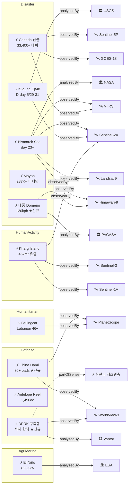

# 2026-05-31 위성영상 관측 이벤트 OSINT 일일 보고서

## 요약

신규 4건, 업데이트 13건. **태풍 Domeng(장미) 태풍으로 격상**(120 kph, 필리핀 PAR 내 통과 중, 6/1 이탈 예보). **중국 Hami ICBM 사일로 방어 네트워크에 80+ 발사 패드 건설** — Reuters/NBC 위성영상 분석, WorldView-3·PlanetScope 다중 위성 교차검증. **DPRK 최현급 구축함 서해 항해 위성 포착** + 남포 조선소 3번째 건조 중(NK Pro/Vantor). Kilauea Ep48 예보 창 D-day(5/29-31), spatter 관측. 캐나다 산불 33,400+ 대피·Norway House Cree Nation 비상사태 선포·군 투입. Bismarck Sea 해저 화산 day 23+, Sentinel-2 5/22 영상으로 해저 플랫폼 성장 확인. Mayon 287,000+ 이재민 Day 145+, 우기 접근으로 라하르 위험 증가. **El Niño 확률 82-98%로 급상승** — WMO/IRI/ECMWF 거의 만장일치. 다중 위성 교차검증 4건(신규 1건). 한반도 GeoFocus 5건(신규 1건). 자연재해 11건, 인간활동 1건, 기후·환경 0건(전일 보고 유지), 농업·해양 1건, 국방 3건, 인도주의 1건.

## 오늘의 핵심 (Top 5)

| 순위 | 이벤트 | 도메인 | 위성 | 지역 | 신뢰도 |
|------|--------|--------|------|------|--------|
| 1 | Bismarck Sea 해저 화산 day 23+ — S2 플랫폼 성장 | Disaster | VIIRS + MODIS + Landsat 9 + Himawari-9 + Sentinel-2A | PNG | 0.97 |
| 2 | 캐나다 산불 33,400+ 대피 — Norway House SOE | Disaster→Humanitarian | GOES-18 + VIIRS + TROPOMI + OMPS + EarthCare | CA | 0.95 |
| 3 | Kilauea Ep48 D-day 5/29-31 — spatter 관측 | Disaster | Sentinel-2A + Landsat 9 | Hawaii, US | 0.95 |
| 4 | 중국 Hami ICBM 80+ 패드 ★신규 | Defense | WorldView-3 + PlanetScope | Xinjiang, CN | 0.90 |
| 5 | Mayon 287,000+ 이재민 Day 145+ | Disaster | Himawari-9 + Sentinel-2A | Albay, PH | 0.92 |

## 다중 위성 교차검증 이벤트

4건의 다중 위성/센서 교차검증 이벤트가 확인된다 (전일 대비 +1건).

1. **Bismarck Sea 해저 화산** — VIIRS (NOAA) + MODIS Terra (NASA) + Landsat 9 (USGS/NASA) + Himawari-9 (JMA/JAXA) + **Sentinel-2A (ESA, 5/22 추가)**. **5위성 3기관** 교차검증으로 확장. multiSatBoost +0.20. **최종 신뢰도 0.97**.
2. **캐나다 Manitoba/Alberta 산불 연기** — GOES-18 (NOAA) + VIIRS (NOAA/NASA) + Sentinel-5P TROPOMI (ESA) + OMPS (NASA) + EarthCare (ESA/JAXA). **5위성 3기관** 유지. multiSatBoost +0.20. **최종 신뢰도 0.95**.
3. **Kharg Island 원유 유출** — Sentinel-1 (SAR) + Sentinel-2 (optical MSI) + Sentinel-3 (ocean color OLCI). **3위성 3센서 유형** 유지. multiSatBoost +0.20 + sarBoost +0.10. **최종 신뢰도 0.90**.
4. **★신규 중국 Hami ICBM 방어 네트워크** — WorldView-3 (Maxar/Vantor) + PlanetScope (Planet). **2위성 2기관** 독립 확인. multiSatBoost +0.20 + hiResBoost +0.15. **최종 신뢰도 0.90**.

## 한반도 GeoFocus

보고됨 4건 + 미검증 1건 = 총 5건. **금일 신규 1건: DPRK 구축함 서해 항해 위성 포착.**

### 1. DPRK 최현급 구축함 서해 항해 + 남포 3번째 건조 ★신규
- **출처:** [NK Pro](https://www.nknews.org/pro/satellite-images-capture-north-korean-destroyer-sailing-on-west-coast-tuesday/) / [Korea Times](https://www.koreatimes.co.kr/foreignaffairs/northkorea/20260402/satellite-images-show-nk-building-third-destroyer-at-nampo-shipyard)
- **위성·센서:** WorldView-3 (Vantor, 0.31m)
- **관측일:** 2026-05-31
- **위치:** West Coast, DPRK (38.7°N, 125.0°E — 정밀도 소수점 1자리)
- **현상:** naval_movement
- **분석:** NK Pro 위성영상으로 DPRK 최대 현대 구축함 서해 항해 포착. 남포 조선소에서 3번째 최현급 선체 건조 진행 중 — Vantor 영상에 대형 크레인·호이스팅 장비 확인. 미사일 발사 시험 연관 가능성. hiResBoost +0.15. koreaBoost +0.10.

추적 지속 항목:
- **압록강 신교량 세관시설 건설** — 38 North, WorldView-3 (변동 없음)
- **두만강 북-러 교량 완공 임박** — 38 North/RFA, PlanetScope, 6/19 개통 목표 (변동 없음)
- **KOMPSAT-7 0.3m** — 7월 정식운용 예정 (변동 없음)
- **DPRK 서해 발사체 5/26** — 미검증 (본문 하단 "미검증 의혹" 섹션 참조)

## 자연재해 (Disaster)

### 1. Bismarck Sea 해저 화산 — day 23+, Sentinel-2 해저 플랫폼 성장, 부석 70km² ★업데이트
- **출처:** [NASA Earth Observatory](https://science.nasa.gov/earth/earth-observatory/new-eruption-in-the-bismarck-sea/) / [EarthSky](https://earthsky.org/earth/undersea-volcano-erupting-papua-new-guinea-may-2026/) / [VolcanoDiscovery](https://www.volcanodiscovery.com/centralbismarcksea/news/302838/Central-Bismarck-Sea-volcano-Admiralty-Islands-Papua-New-Guinea-new-hydrothermal-eruption-steam-lade.html)
- **위성·센서:** VIIRS, MODIS (Terra), Landsat 9 (OLI), Himawari-9 (AHI), **Sentinel-2A (MSI)**
- **관측일:** 2026-05-31 (Sentinel-2 5/22 신규 확인)
- **위치:** Titan Ridge, Bismarck Sea, PNG (3.03°S, 147.78°E)
- **현상:** volcanic_eruption (submarine)
- **상태:** 업데이트 (← 2026-05-30 "day 22+")
- **분석:** 분출 day 23+ 지속. **ESA Sentinel-2 5/22 영상에서 해저 화산 플랫폼 성장 확인** — 열 영상(B12/B11/B4)에서 해수면 극 근접 용암 존재 시사. 5/22 활동은 5/15 대비 감소 추세이나 **"growing underwater volcanic platform with large greenish areas and brown pumice rafts"** 확인. 부석 뗏목 70km²(맨해튼 초과), 200km+ WSW 확산. Jim Garvin (NASA): "eagerly waiting to see if a new island is about to be born." **5위성 3기관 multiSatBoost +0.20.** officialBoost +0.15 (NASA EO).

### 2. 캐나다 산불 — 33,400+ 대피, Norway House SOE, 군 투입 ★업데이트
- **출처:** [CBC News](https://www.cbc.ca/news/canada/manitoba/norway-house-wildfire-state-of-emergency-9.7217779) / [CBS News](https://www.cbsnews.com/news/canada-wildfires-smoke-deaths-evacuations-manitoba-saskatchewan-alberta/) / [CTV News](https://www.ctvnews.ca/canada/wildfires/article/medical-evacuations-ongoing-in-northern-manitoba-wildfire-smoke-having-an-impact-on-many/)
- **위성·센서:** GOES-18 (ABI), VIIRS (Suomi-NPP/JPSS), Sentinel-5P (TROPOMI), OMPS, EarthCare
- **관측일:** 2026-05-31
- **위치:** Manitoba / Alberta / Saskatchewan, Canada (53.97°N, 97.84°W — Norway House)
- **현상:** wildfire + humanitarian (교차 도메인)
- **상태:** 업데이트 (← 2026-05-30 "33,000+")
- **분석:** **Norway House Cree Nation 비상사태 선포** — Fort Island 381명 대피, 30°C 열파 악화 요인. Pimicikamak (Cross Lake) 대피 지속. 군 항공편 투입. 총 33,400+ 대피, 2명 사망. MB 27개 활성 화재(9개 통제 불능). 연기 미국 중서부(MI/WI/MN) + 서유럽 도달. Premier Kinew: "the largest evacuation Manitoba will have seen in most people's living memory." priorityBoost +0.20. **5위성 3기관 multiSatBoost +0.20.**

### 3. Kilauea Ep48 — 예보 D-day 5/29-31, spatter 빈번 ★업데이트
- **출처:** [USGS HVO](https://www.usgs.gov/volcanoes/kilauea/volcano-updates) / [Hawaii Volcano Expeditions](https://hawaiivolcanoexpeditions.com/blog/lava-update-the-latest-eruptions-on-the-big-island/)
- **위성·센서:** Sentinel-2A (MSI 10m), Landsat 9 (OLI/TIRS 30m)
- **관측일:** 2026-05-31
- **위치:** Halemaʻumaʻu, Kilauea, Hawaii, US (19.42°N, 155.29°W)
- **현상:** volcanic_eruption
- **상태:** 업데이트 (← 2026-05-30 "5/29-31")
- **분석:** 예보 창 D-day(5/29-31). **북측 분출구에서 spatter 빈번, 남측 단발 spatter burst.** "Glow is strong from both vents overnight." 저수준 지진 tremor 지속. 팽창 감속이나 지속 중. ADVISORY/YELLOW. 불규칙 편향 이벤트(deflation events) 재개 시 예보 창 변동 가능. officialBoost +0.15 (USGS).

### 4. Mayon — AL3, Day 145+, 287,000+ 이재민, 우기 라하르 ★업데이트
- **출처:** [ReliefWeb GLIDE](https://reliefweb.int/disaster/vo-2026-000065-phl) / [IQAir](https://www.iqair.com/newsroom/volcanic-eruption-map-spotlight-mayon-volcano-philippines-5-2026) / [Bloomberg](https://www.bloomberg.com/news/articles/2026-05-03/philippines-says-thousands-evacuated-as-mayon-volcano-erupts)
- **위성·센서:** Himawari-9 (AHI), Sentinel-2A (MSI)
- **관측일:** 2026-05-31
- **위치:** Mayon, Albay, Philippines (13.26°N, 123.69°E)
- **현상:** volcanic_eruption (Strombolian + PDC)
- **상태:** 업데이트 (← 2026-05-30 "Day 144+")
- **분석:** **287,000+명 이재민** 지속(OCHA GLIDE 등록). PHIVOLCS AL3. 145일+ 연속 분출. PDC 동사면 Basud Gully. **우기 접근으로 라하르 위험 증가** — NDRRMC 사전 대비 경보. 124개 바랑가이 화산재. priorityBoost +0.20.

### 5. 태풍 Domeng(장미) — 120 kph 태풍 격상, PAR 통과 중 ★신규
- **출처:** [Philstar](https://www.philstar.com/headlines/weather/2026/05/30/2531652/domeng-now-typhoon) / [Rappler](https://www.rappler.com/philippines/weather/severe-tropical-storm-domeng-southwest-monsoon-update-pagasa-forecast-may-30-2026-11am/) / [GMA News](https://www.gmanetwork.com/news/weather/content/989394/tropical-storm-jangmi-par-domeng-pagasa/story/)
- **위성·센서:** Himawari-9 (AHI)
- **관측일:** 2026-05-30
- **위치:** Philippine Sea (16.5°N, 130.0°E)
- **현상:** typhoon
- **상태:** 신규
- **분석:** Jangmi 5/27 열대폭풍→5/29 강한 열대폭풍→**5/30 태풍 격상(120 kph, 돌풍 150 kph).** PAGASA 현지명 Domeng. PAR 6/1 이탈 예보. Northern Luzon 풍속 신호 가능성 낮으나 배제하지 않음. 서비사야·민다나오 산발 강우. 2026년 서태평양 4번째 열대저기압, 5월 2번째. Himawari-9 정지궤도 연속 추적. officialBoost +0.15 (PAGASA/JMA).

### 6. Kanlaon — AL2, 6-31 VQ/일, SO₂ 상승 ★업데이트
- **출처:** [GVP Smithsonian](https://volcano.si.edu/volcano.cfm?vn=272020) / [VolcanoDiscovery](https://www.volcanodiscovery.com/canlaon/news/301797/Kanlaon-Philippines-Volcano-Philippines-activity-update-May-7-2026-Continuing-eruptionCite-this-Repo.html)
- **위성·센서:** Himawari-9 (AHI)
- **관측일:** 2026-05-31
- **위치:** Kanlaon, Negros Island, Philippines (10.41°N, 123.13°E)
- **현상:** volcanic_eruption
- **상태:** 업데이트 (← 2026-05-30 "AL2")
- **분석:** AL2 유지. 일 6-31회 화산 지진. SO₂ 410-4,081 t/d. tremor 4-61분. 4km PDZ. 5/26 폭발 후 분출 지속.

### 7. Bezymianny — KVERT Orange, 폭발적 분출 ★업데이트
- **출처:** [GVP Weekly Report](https://volcano.si.edu/reports_weekly.cfm) / [KVERT](http://www.kscnet.ru/ivs/kvert/)
- **위성·센서:** Himawari-9 (AHI), VIIRS
- **관측일:** 2026-05-31
- **위치:** Bezymianny, Kamchatka, Russia (55.97°N, 160.59°E)
- **현상:** volcanic_eruption (explosive)
- **상태:** 업데이트 (← 2026-05-30 "Orange")
- **분석:** KVERT Orange 유지. 5/13-20 폭발적 분출, hot avalanches. thermalBoost +0.10.

### 8. Great Sitkin — WATCH/ORANGE, SAR 용암돔 ★업데이트
- **출처:** [USGS AVO](https://volcanoes.usgs.gov/hans-public/notice/DOI-USGS-AVO-2026-05-30T18:41:36+00:00)
- **위성·센서:** Sentinel-1A (C-band SAR 5m)
- **관측일:** 2026-05-30
- **위치:** Great Sitkin, Aleutians, Alaska, US (52.08°N, 176.13°W)
- **현상:** volcanic_eruption (slow lava dome)
- **상태:** 업데이트 (← 2026-05-30 "WATCH")
- **분석:** SAR 관측 지속 — 구름 차폐로 광학 제한. 용암돔 동측 확장. sarBoost +0.10. officialBoost +0.15 (USGS AVO).

### 9. Shishaldin — ADVISORY/YELLOW, SO₂ ★업데이트
- **출처:** [USGS AVO](https://volcanoes.usgs.gov/hans-public/notice/DOI-USGS-AVO-2026-05-28T19:49:52+00:00)
- **위성·센서:** Sentinel-5P (TROPOMI)
- **관측일:** 2026-05-31
- **위치:** Shishaldin, Aleutians, Alaska, US (54.76°N, 163.97°W)
- **현상:** volcanic_eruption (unrest)
- **상태:** 업데이트 (← 2026-05-30 "ADVISORY")
- **분석:** ADVISORY/YELLOW 유지. SO₂·지진·infrasound elevated. tracegasBoost +0.15.

### 10. Dukono — AL2, NASA EO Landsat 9 ★보고됨
- **출처:** [NASA Earth Observatory](https://science.nasa.gov/earth/earth-observatory/ever-restless-mount-dukono-erupts/) / [GVP](https://volcano.si.edu/volcano.cfm?vn=268010)
- **위성·센서:** Landsat 9 (OLI 30m)
- **관측일:** 2026-05-13 (촬영)
- **위치:** Dukono, Halmahera, Indonesia (1.70°N, 127.88°E)
- **상태:** 보고됨 — 변동 없음

### 11. Santa Rosa Island — 97% 진압 ★보고됨
- **출처:** [NASA Earthdata](https://www.earthdata.nasa.gov/news/worldview-image-archive/fire-chars-santa-rosa-island)
- **위성·센서:** Landsat 9 (OLI), VIIRS
- **관측일:** 2026-05-31
- **위치:** Santa Rosa Island, CA, US (33.95°N, 120.10°W)
- **상태:** 보고됨 — 97% 유지, 6/6 폐쇄

## 인간활동 (Human Activity)

### 1. Kharg Island 원유 유출 — 45km², Sentinel-1/2/3 ★업데이트
- **출처:** [NBC News](https://www.nbcnews.com/world/iran/oil-spill-gulf-likely-caused-tanker-dump-iran-says-rcna344878) / [The Defense News](https://www.thedefensenews.com/news-details/Satellites-Detect-Large-Oil-Spill-in-Persian-Gulf-Near-Irans-Kharg-Island-Export-Terminal/)
- **위성·센서:** Sentinel-1A (SAR C-band), Sentinel-2A (MSI), Sentinel-3 (OLCI)
- **관측일:** 2026-05-31
- **위치:** Kharg Island, Persian Gulf, Iran (29.23°N, 50.32°E)
- **현상:** oil_spill
- **상태:** 업데이트 (← 2026-05-30 "45km²")
- **분석:** 45km² 유출 지속. Sentinel-2 5/6 영상에 VLCC 3척 동시 적재 확인. 이란 부통령: 비이란 유조선 밸러스트 수 방류 주장. 원인 미확정. **3위성 3센서 유형 multiSatBoost +0.20.** sarBoost +0.10.

### 2. 압록강 / 두만강 교량 건설 ★추적 지속
- 38 North, WorldView-3 / PlanetScope — 변동 없음

## 기후·환경 (Climate & Environment)

전일 보고 항목 외 금일 신규 없음.

추적 지속: Hunga Tonga TROPOMI 메탄 파괴(Nature Communications), NASA EO Landsat 35년 토지교란 분석.

## 농업·해양 (Agriculture & Maritime)

### 1. El Niño 2026 — 82-98% 확률 급상승, Super El Niño 경로 ★업데이트
- **출처:** [WMO](https://wmo.int/media/news/wmo-likelihood-increases-of-el-nino) / [IRI Columbia](https://iri.columbia.edu/our-expertise/climate/forecasts/enso/current/) / [ECMWF](https://www.ecmwf.int/en/about/media-centre/science-blog/2026/el-nino-2026)
- **위성·센서:** Sentinel-3/6 SST, Jason-3 altimetry, NOAA Coral Reef Watch SST
- **관측일:** 2026-05-31
- **위치:** Equatorial Pacific Niño 3.4 region (0.0°N, 170.0°W)
- **현상:** sea_level_change + crop_yield (교차 도메인: AgriMarine + Climate)
- **상태:** 업데이트 (← 2026-05-30 "60%")
- **분석:** **확률 급상승: WMO → 82% (MJJ 2026), IRI → 98% (MJJ 2026).** Niño 3.4 주간 SST **+0.9°C** 돌파, 3주 연속 엘니뇨 기준 초과. ECMWF MME 평균 MJJ **1.5°C** 접근 — 1982·1997년 Super El Niño 경로와 유사. WMO Moufouma Okia: "climate models are now strongly aligned." **아시아 작물 위기 가속:** 인도 몬순 92% 평균, 동남아 쌀·설탕 감산, 호주·인도네시아 가뭄. Mayon 화산 이재민 287K+에 더해 필리핀 농업 이중 충격.

## 국방·안보 (Defense — OSINT 한정)

### 1. 중국 Hami ICBM 사일로 방어 네트워크 — 80+ 발사 패드, 장갑 벙커 ★신규
- **출처:** [NBC News / Reuters](https://www.nbcnews.com/world/asia/china-building-launch-pads-nuclear-missile-silos-satellite-images-show-rcna347503) / [TechTimes](https://www.techtimes.com/articles/317398/20260529/china-builds-80-pad-nuclear-defense-network-satellite-images-reveal-second-strike-hardening.htm) / [Outlook India](https://www.outlookindia.com/international/satellite-imagery-reveals-new-chinese-military-build-up)
- **위성·센서:** WorldView-3 (0.31m), PlanetScope (3m)
- **관측일:** 2026-05-29 (Reuters 분석 발행)
- **위치:** Hami, Xinjiang, China (42.8°N, 93.5°E — 정밀도 소수점 1자리)
- **현상:** military_buildup
- **상태:** 신규
- **분석:** Reuters 위성영상 분석: **80+ 발사 패드, 장갑 벙커, 통신 노드**가 수천 km² 사막에 건설. Hami ICBM 사일로 필드 SW 방향 2개 팔각형 설치물(140km, 230km 거리). 이동식 미사일 발사대·방공·전자전 체계 지원. 비행장·철도 연결. 4-5월 군사 훈련 확인. "unprecedented among nuclear-armed states." 2차 핵 타격(second-strike) 능력 확보 목적 분석. **multiSatBoost +0.20** (WorldView-3 + PlanetScope 2기관). **hiResBoost +0.15** (WorldView-3 0.31m). **before/after 가용.**

### 2. Antelope Reef — 1,490ac, 남중국해 최대 인공섬 임박 ★업데이트
- **출처:** [CSIS AMTI](https://amti.csis.org/antelope-reef-could-now-be-the-largest-island-in-the-south-china-sea/) / [Newsweek](https://www.newsweek.com/satellite-photos-china-manmade-island-disputed-waters-antelope-reef-11733191)
- **위성·센서:** WorldView-3 (0.31m), PlanetScope (3m)
- **관측일:** 2026-05-31
- **위치:** Antelope Reef, Paracel Islands (16.5°N, 112.6°E — 정밀도 소수점 1자리)
- **현상:** military_buildup
- **상태:** 업데이트 (← 2026-05-30 "1490ac")
- **분석:** 매립 1,490ac 유지. 2,700m 활주로 설계 추정. 건물 50+동. hiResBoost +0.15. analystBoost +0.10.

### 3. DPRK 최현급 구축함 서해 항해 ★신규
- 한반도 GeoFocus 섹션 참조.

## 인도주의 (Humanitarian)

### 1. Bellingcat 남레바논 46+ 마을 파괴 ★보고됨
- **출처:** [Bellingcat](https://www.bellingcat.com/news/2026/05/14/satellite-imagery-shows-ongoing-demolitions-across-southern-lebanon/) / [Interactive Map](https://bellingcat.github.io/lebanon-may-2026/)
- **위성·센서:** PlanetScope (Planet Labs, 3m)
- **관측일:** 2026-03-02 ~ 2026-05-08 (before/after)
- **위치:** Southern Lebanon (33.1°N, 35.4°E — 정밀도 소수점 1자리)
- **현상:** infrastructure_damage
- **상태:** 보고됨 — 변동 없음
- **분석:** 46+ 마을 심각한 피해 또는 완전 파괴. IDF "Yellow Line" 내 통제 철거(폭파+건설장비). Naqoura, Kfar Kila 거의 전멸. Bellingcat 인터랙티브 맵 + PlanetScope 전역 before/after 공개. analystBoost +0.10.

## 전후 비교(before/after) 영상 보유 이벤트

| 이벤트 | 위성 | 비교 기간 |
|--------|------|-----------|
| 중국 Hami ICBM 80+ 패드 | WorldView-3 + PlanetScope | 2020~ vs 2026-05 |
| Bellingcat 남레바논 | PlanetScope | 2026-03 vs 2026-05-08 |
| Bismarck Sea 해저 화산 | Sentinel-2A | 2026-05-10 vs 2026-05-22 |

## 미검증 의혹 (위성 출처 미확인)

1. **일본 군사 우주 확장 (880인 SOG, $1B 예산)** — [Defence Blog](https://defence-blog.com/japan-reveals-sweeping-military-space-buildup/). 정책 브리핑으로 위성영상 직접 사용 없음. Synspective SAR 콘스텔레이션 FY2026 계약. 신뢰도 0.50.
2. **DPRK 서해 미상 발사체 5/26** — 올해 8번째. 위성영상 미확인. 신뢰도 0.40. (전일 지속)

## 지식그래프 시각화

## 출처 목록

1. [USGS HVO — Kilauea Volcano Updates](https://www.usgs.gov/volcanoes/kilauea/volcano-updates)
2. [CBC News — Norway House wildfire state of emergency](https://www.cbc.ca/news/canada/manitoba/norway-house-wildfire-state-of-emergency-9.7217779)
3. [CBS News — Canada wildfires 33,400+ evacuated](https://www.cbsnews.com/news/canada-wildfires-smoke-deaths-evacuations-manitoba-saskatchewan-alberta/)
4. [NASA Earth Observatory — Bismarck Sea eruption](https://science.nasa.gov/earth/earth-observatory/new-eruption-in-the-bismarck-sea/)
5. [EarthSky — Undersea volcano erupting PNG](https://earthsky.org/earth/undersea-volcano-erupting-papua-new-guinea-may-2026/)
6. [VolcanoDiscovery — Bismarck Sea hydrothermal](https://www.volcanodiscovery.com/centralbismarcksea/news/302838/Central-Bismarck-Sea-volcano-Admiralty-Islands-Papua-New-Guinea-new-hydrothermal-eruption-steam-lade.html)
7. [ReliefWeb — Mayon GLIDE VO-2026-000065-PHL](https://reliefweb.int/disaster/vo-2026-000065-phl)
8. [IQAir — Mayon eruption map](https://www.iqair.com/newsroom/volcanic-eruption-map-spotlight-mayon-volcano-philippines-5-2026)
9. [Philstar — Domeng now a typhoon](https://www.philstar.com/headlines/weather/2026/05/30/2531652/domeng-now-typhoon)
10. [Rappler — Severe Tropical Storm Domeng](https://www.rappler.com/philippines/weather/severe-tropical-storm-domeng-southwest-monsoon-update-pagasa-forecast-may-30-2026-11am/)
11. [NBC News / Reuters — China Hami ICBM launch pads](https://www.nbcnews.com/world/asia/china-building-launch-pads-nuclear-missile-silos-satellite-images-show-rcna347503)
12. [TechTimes — China 80-pad nuclear defense](https://www.techtimes.com/articles/317398/20260529/china-builds-80-pad-nuclear-defense-network-satellite-images-reveal-second-strike-hardening.htm)
13. [GVP Smithsonian — Kanlaon](https://volcano.si.edu/volcano.cfm?vn=272020)
14. [USGS AVO — Great Sitkin](https://volcanoes.usgs.gov/hans-public/notice/DOI-USGS-AVO-2026-05-30T18:41:36+00:00)
15. [USGS AVO — Shishaldin](https://volcanoes.usgs.gov/hans-public/notice/DOI-USGS-AVO-2026-05-28T19:49:52+00:00)
16. [NASA Earth Observatory — Dukono](https://science.nasa.gov/earth/earth-observatory/ever-restless-mount-dukono-erupts/)
17. [NASA Earthdata — Santa Rosa Island fire](https://www.earthdata.nasa.gov/news/worldview-image-archive/fire-chars-santa-rosa-island)
18. [NBC News — Kharg Island oil spill](https://www.nbcnews.com/world/iran/oil-spill-gulf-likely-caused-tanker-dump-iran-says-rcna344878)
19. [CSIS AMTI — Antelope Reef largest island](https://amti.csis.org/antelope-reef-could-now-be-the-largest-island-in-the-south-china-sea/)
20. [Bellingcat — Lebanon demolitions](https://www.bellingcat.com/news/2026/05/14/satellite-imagery-shows-ongoing-demolitions-across-southern-lebanon/)
21. [WMO — El Niño likelihood increases](https://wmo.int/media/news/wmo-likelihood-increases-of-el-nino)
22. [IRI Columbia — ENSO forecast](https://iri.columbia.edu/our-expertise/climate/forecasts/enso/current/)
23. [NK Pro — DPRK destroyer west coast](https://www.nknews.org/pro/satellite-images-capture-north-korean-destroyer-sailing-on-west-coast-tuesday/)
24. [Korea Times — NK 3rd destroyer Nampo](https://www.koreatimes.co.kr/foreignaffairs/northkorea/20260402/satellite-images-show-nk-building-third-destroyer-at-nampo-shipyard)
25. [Defence Blog — Japan military space buildup](https://defence-blog.com/japan-reveals-sweeping-military-space-buildup/)
26. [NESDIS — NOAA satellites Canadian wildfires](https://www.nesdis.noaa.gov/news/noaa-satellites-monitor-canadian-wildfires-and-smoke)
27. [Copernicus CDSE — Sentinel-2 publication issue](https://dataspace.copernicus.eu/news/2026-5-28-sentinel-2-product-publication-issue-2805)
28. [Copernicus CDSE — Sentinel-3A manoeuvre](https://dataspace.copernicus.eu/news/2026-5-28-copernicus-sentinel-3a-unavailability-notice-ip-manoeuvre-156-planned-28-may-2026)
