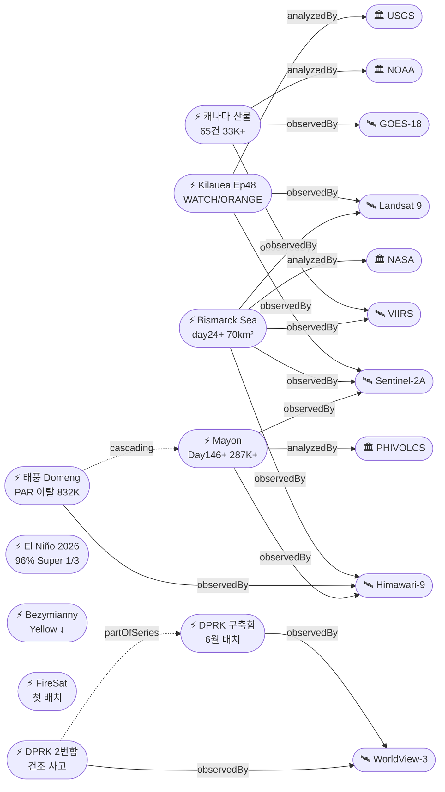

# 2026-06-01 위성영상 관측 이벤트 OSINT 일일 보고서

## 요약

신규 2건, 업데이트 11건. **Kilauea Ep48 전조 오버플로우 시작** — 5/30 17:41 HST 남측 분출구에서 오버플로우 개시, ADVISORY→WATCH/ORANGE 격상, 기록적 48번째 분수분출 에피소드 임박. **캐나다 산불 65건 활성** — 18,935 ha 소실, 33,400+ 대피 지속, 연기 미국 중서부 AQI "unhealthy" 수준(6/1 ND·MT·MN·SD). **태풍 Domeng(장미) PAR 이탈** — 6/1 필리핀 책임 해역 이탈하나 habagat 증강으로 루손·비사야 4일간 강우, Mayon ashfall 지역 포함 832,986명 피해. Bismarck Sea 해저 화산 day 24+, Mayon Day 146+ AL3 287,000+ 이재민, **El Niño 96% — Super El Niño 확률 1/3로 상향**. Bezymianny Aviation Color Code Yellow로 하향(활동 감소). **DPRK 구축함 6월 중순 공식 배치 확인** + 2번함 건조 사고 종합 분석. 다중 위성 교차검증 4건 유지. 한반도 GeoFocus 5건 유지. 자연재해 10건, 인간활동 0건(추적 지속), 기후·환경 0건(전일 유지), 농업·해양 1건, 국방 2건.

## 오늘의 핵심 (Top 5)

| 순위 | 이벤트 | 도메인 | 위성 | 지역 | 신뢰도 |
|------|--------|--------|------|------|--------|
| 1 | Kilauea Ep48 전조 오버플로우 — WATCH/ORANGE | Disaster | Sentinel-2A + Landsat 9 | Hawaii, US | 0.95 |
| 2 | 캐나다 산불 65건 — 33,400+ 대피, AQI 미국 악화 | Disaster→Humanitarian | GOES-18 + VIIRS + TROPOMI + OMPS + EarthCare | MB/AB/SK, CA | 0.95 |
| 3 | Bismarck Sea 해저 화산 day 24+ — 부석 70km², 신규 섬 가능 | Disaster | VIIRS + MODIS + Landsat 9 + Himawari-9 + Sentinel-2A | PNG | 0.97 |
| 4 | 태풍 Domeng PAR 이탈 — 832,986명 피해, habagat 증강 | Disaster | Himawari-9 | PH | 0.88 |
| 5 | Mayon Day 146+ AL3 — 287,000+ 이재민, 우기 라하르 | Disaster | Himawari-9 + Sentinel-2A | Albay, PH | 0.92 |

## 다중 위성 교차검증 이벤트

4건의 다중 위성/센서 교차검증 이벤트가 확인된다 (전일 대비 변동 없음).

1. **Bismarck Sea 해저 화산** — VIIRS (NOAA) + MODIS Terra (NASA) + Landsat 9 (USGS/NASA) + Himawari-9 (JMA/JAXA) + Sentinel-2A (ESA). **5위성 3기관** 유지. multiSatBoost +0.20. **최종 신뢰도 0.97**.
2. **캐나다 Manitoba/Alberta 산불 연기** — GOES-18 (NOAA) + VIIRS (NOAA/NASA) + Sentinel-5P TROPOMI (ESA) + OMPS (NASA) + EarthCare (ESA/JAXA). **5위성 3기관** 유지. multiSatBoost +0.20. **최종 신뢰도 0.95**.
3. **Kharg Island 원유 유출** — Sentinel-1 (SAR) + Sentinel-2 (optical MSI) + Sentinel-3 (ocean color OLCI). **3위성 3센서 유형** 유지. multiSatBoost +0.20 + sarBoost +0.10. **최종 신뢰도 0.90**.
4. **중국 Hami ICBM 방어 네트워크** — WorldView-3 (Maxar/Vantor) + PlanetScope (Planet). **2위성 2기관** 유지. multiSatBoost +0.20 + hiResBoost +0.15. **최종 신뢰도 0.90**.

## 한반도 GeoFocus

보고됨 4건 + 미검증 1건 = 총 5건. **금일 업데이트: DPRK 구축함 6월 중순 공식 배치 확인 + 2번함 건조 사고.**

### 1. DPRK 최현급 구축함 6월 중순 공식 배치 확인 ★업데이트
- **출처:** [뉴시스](https://www.newsis.com/view/NISX20260529_0003648376) / [NK Pro](https://www.nknews.org/pro/satellite-images-capture-north-korean-destroyer-sailing-on-west-coast-tuesday/)
- **위성·센서:** WorldView-3 (Vantor, 0.31m)
- **관측일:** 2026-05-28 (서해 항해 위성 포착)
- **위치:** West Coast, DPRK (38.7°N, 125.0°E — 정밀도 소수점 1자리)
- **현상:** naval_movement
- **상태:** 업데이트 (← 2026-05-31 "서해 항해 포착")
- **분석:** 김정은이 6월 중순 공식 배치 발표. 28일 서해 남포만 시험 항해 포착. 동해 함대 배속 발표 → 한반도 남쪽 경유 이동 가능성. hiResBoost +0.15, koreaBoost +0.10.

### 2. DPRK 구축함 프로그램 종합 — 2번함 건조 사고 ★신규
- **출처:** [Daily NK](https://www.dailynk.com/english/satellite-analysis-north-koreas-5000-ton-destroyer-fleet-in-construction-but-short-on-combat-readiness/)
- **위성·센서:** WorldView-3 (Vantor, 0.31m)
- **관측일:** 2026-06-01
- **위치:** Chongjin Shipyard, DPRK (41.8°N, 129.8°E — 정밀도 소수점 1자리)
- **현상:** naval_movement
- **상태:** 신규
- **분석:** Daily NK 종합 분석 — 2번함이 Chongjin 진수 시 사고 발생, 부분 침수/전복. 센서·무기 통합 미완성, 전투준비태세 의문. 3번함 남포 건조 중. 김정은 "연간 2척 이상" 선언. before/after 위성영상 가용. koreaBoost +0.10, hiResBoost +0.15.

추적 지속 항목:
- **압록강 신교량 세관시설 건설** — 38 North, WorldView-3 (변동 없음)
- **두만강 북-러 교량 완공 임박** — 38 North/RFA, PlanetScope, 6/19 개통 목표 (변동 없음)
- **KOMPSAT-7 0.3m** — 7월 정식운용 예정 (변동 없음)
- **DPRK 서해 발사체 5/26** — 미검증 (본문 하단 "미검증 의혹" 섹션 참조)

## 자연재해 (Disaster)

### 1. Kilauea Ep48 — 전조 오버플로우 시작, WATCH/ORANGE ★업데이트
- **출처:** [USGS HVO](https://www.usgs.gov/volcanoes/kilauea/volcano-updates) / [Big Island Now](https://bigislandnow.com/2026/05/30/glow-spatter-and-short-overflows-kilauea-begins-to-gear-up-for-historic-episode-48-fountaining/) / [Hawaii Volcano Expeditions](https://hawaiivolcanoexpeditions.com/blog/lava-update-the-latest-eruptions-on-the-big-island/)
- **위성·센서:** Sentinel-2A (MSI 10m), Landsat 9 (OLI/TIRS 30m)
- **관측일:** 2026-06-01
- **위치:** Halemaʻumaʻu, Kilauea, Hawaii, US (19.42°N, 155.29°W)
- **현상:** volcanic_eruption
- **상태:** 업데이트 (← 2026-05-31 "D-day 5/29-31 spatter")
- **분석:** **Ep48 전조 오버플로우 5/30 17:41 HST 남측 분출구에서 시작.** 북측 분출구 24시간 연속 spattering 선행. **ADVISORY→WATCH/ORANGE 격상.** Episode 48은 Kilauea 역대 분수분출 에피소드 수 신기록. 예보 창 5/30–6/1. 모든 분출구·용암류 Halemaʻumaʻu 내 한정. officialBoost +0.15 (USGS).

### 2. 캐나다 산불 — 65건 활성, AQI 미국 악화 ★업데이트
- **출처:** [NOAA NESDIS](https://www.nesdis.noaa.gov/news/noaa-satellites-monitor-canadian-wildfires-and-smoke) / [CBS News](https://www.cbsnews.com/news/canada-wildfires-smoke-deaths-evacuations-manitoba-saskatchewan-alberta/) / [Government of Canada](https://www.canada.ca/en/public-safety-canada/news/2026/05/the-government-of-canada-updates-on-the-2026-wildfire-season-preparedness-and-outlook.html)
- **위성·센서:** GOES-18 (ABI), VIIRS (Suomi-NPP/JPSS), Sentinel-5P (TROPOMI), OMPS, EarthCare
- **관측일:** 2026-06-01
- **위치:** Manitoba / Alberta / Saskatchewan, Canada (53.97°N, 97.84°W)
- **현상:** wildfire + humanitarian (교차 도메인)
- **상태:** 업데이트 (← 2026-05-31 "33,400+")
- **분석:** **65건 활성 화재, 6건 통제 불능, 18,935 ha 소실.** 33,400+ 대피·2명 사망 지속. **6/1 미국 중서부 AQI "unhealthy" — ND, MT, MN, SD 직접 영향.** 6/3-4 MI "unhealthy", MN "very unhealthy" 예상. Norway House Cree Nation SOE·군 대피 지속. BC 7-8월 최고 화재 위험 예보. **5위성 3기관 multiSatBoost +0.20.** priorityBoost +0.20.

### 3. Bismarck Sea 해저 화산 — day 24+, 부석 70km², 신규 섬 형성 가능 ★업데이트
- **출처:** [NASA Earth Observatory](https://science.nasa.gov/earth/earth-observatory/new-eruption-in-the-bismarck-sea/) / [VolcanoDiscovery](https://www.volcanodiscovery.com/centralbismarcksea/news/302838/Central-Bismarck-Sea-volcano-Admiralty-Islands-Papua-New-Guinea-new-hydrothermal-eruption-steam-lade.html) / [Smithsonian GVP](https://volcano.si.edu/showreport.cfm?gvpvar=GVP.DVAR20260512-250030)
- **위성·센서:** VIIRS, MODIS (Terra), Landsat 9 (OLI), Himawari-9 (AHI), Sentinel-2A (MSI)
- **관측일:** 2026-06-01
- **위치:** Titan Ridge, Bismarck Sea, PNG (3.03°S, 147.78°E)
- **현상:** volcanic_eruption (submarine)
- **상태:** 업데이트 (← 2026-05-31 "day 23+, S2 플랫폼 성장")
- **분석:** 분출 day 24+ 지속. **부석 뗏목 70km²(맨해튼 초과), 200km+ WSW 확산.** 해수 변색 2,700km². Jim Garvin(NASA): "waiting to see if a new island is about to be born." VAAC Darwin 항공경보 지속. **5위성 3기관 multiSatBoost +0.20.** officialBoost +0.15 (NASA EO). **최종 신뢰도 0.97**.

### 4. 태풍 Domeng(장미) — PAR 이탈, 832,986명 피해, habagat 증강 ★업데이트
- **출처:** [Rappler](https://www.rappler.com/philippines/weather/typhoon-domeng-southwest-monsoon-update-pagasa-forecast-june-1-2026-5am/) / [Manila Bulletin](https://mb.com.ph/2026/05/31/domeng-on-its-way-out-but-enhanced-habagat-rains-persist) / [GMA News](https://www.gmanetwork.com/news/weather/content/989626/typhoon-domeng-maintains-strength-while-heading-east-of-batanes/story/)
- **위성·센서:** Himawari-9 (AHI)
- **관측일:** 2026-06-01
- **위치:** 670km E of Basco, Batanes → PAR 이탈 (16.5°N, 130.0°E)
- **현상:** typhoon
- **상태:** 업데이트 (← 2026-05-31 "120 kph, PAR 통과 중")
- **분석:** **6/1 PAR 이탈 예정.** 120 kph 유지, 150 kph 돌풍, NNW 20 kph 이동. **habagat(남서 계절풍) 증강 — 루손·비사야 향후 4일 중등도~강한 강우.** Catanduanes·Albay·Camarines Sur(Mayon ashfall 지역) 포함 **832,986명 피해.** 교차 도메인: Mayon ashfall 지역에 강우 → 산사태/홍수 잠정(cascading_disaster). priorityBoost +0.20.

### 5. Mayon — Day 146+, AL3, 287,000+ 이재민, 우기 라하르 ★업데이트
- **출처:** [Smithsonian GVP](https://volcano.si.edu/volcano.cfm?vn=273030) / [ReliefWeb GLIDE](https://reliefweb.int/disaster/vo-2026-000065-phl)
- **위성·센서:** Himawari-9 (AHI), Sentinel-2A (MSI)
- **관측일:** 2026-06-01
- **위치:** Mayon, Albay, Philippines (13.26°N, 123.69°E)
- **현상:** volcanic_eruption (Strombolian + PDC)
- **상태:** 업데이트 (← 2026-05-31 "Day 145+, 287K+")
- **분석:** **146일+ 연속 분출.** PHIVOLCS AL3. 286-351 rockfalls/day, 0-8 PDCs/day, 27-57 VQs. 용암 3.8km Basud Gully. **287,000+명 이재민**(OCHA GLIDE). **우기 접근 → 라하르 위험 증가** — NDRRMC 사전 경보. Domeng habagat 강우와 교차 영향. priorityBoost +0.20. officialBoost +0.15.

### 6. Bezymianny — Yellow 하향, 활동 감소 ★업데이트
- **출처:** [Smithsonian GVP](https://volcano.si.edu/volcano.cfm?vn=300250)
- **위성·센서:** Himawari-9 (AHI), VIIRS
- **관측일:** 2026-06-01
- **위치:** Bezymianny, Kamchatka, Russia (55.97°N, 160.59°E)
- **현상:** volcanic_eruption
- **상태:** 업데이트 (← 2026-05-31 "Orange explosive")
- **분석:** **KVERT Aviation Color Code Orange→Yellow 하향(5/21).** 용암 유출 지속, gas-steam 방출, 소규모 열 사태. 폭발적 활동 감소. officialBoost +0.15 (KVERT).

### 7. Kanlaon — AL2, SO2 410-4,081 t/d ★업데이트
- **출처:** [Smithsonian GVP](https://volcano.si.edu/volcano.cfm?vn=272020)
- **위성·센서:** Himawari-9 (AHI)
- **관측일:** 2026-06-01
- **위치:** Kanlaon, Negros Island, PH (10.41°N, 123.13°E)
- **현상:** volcanic_eruption
- **상태:** 업데이트 (← 2026-05-31 "AL2")
- **분석:** PHIVOLCS AL2. 6-31 daily VQs. **SO2 410-4,081 t/d**(변동 폭). 화산재 200-700m. 4km PDZ.

### 8. Great Sitkin — WATCH/ORANGE, 용암 돔 ★업데이트
- **출처:** [AVO](https://avo.alaska.edu/volcano/great-sitkin)
- **위성·센서:** SAR (Sentinel-1), 열적외 (VIIRS)
- **관측일:** 2026-06-01
- **위치:** Great Sitkin, Alaska, US (52.08°N, 176.13°W)
- **현상:** volcanic_eruption (lava dome)
- **상태:** 업데이트 (← 2026-05-31 "WATCH SAR lava east")
- **분석:** 용암 돔 summit crater 내 지속 성장. WATCH/ORANGE. 소규모 지진, 표면 온도 소폭 상승.

### 9. Shishaldin — ADVISORY/YELLOW, SO2 ★업데이트
- **출처:** [AVO](https://avo.alaska.edu/volcano/shishaldin)
- **위성·센서:** TROPOMI (Sentinel-5P)
- **관측일:** 2026-06-01
- **위치:** Shishaldin, Alaska, US (54.76°N, 163.97°W)
- **현상:** volcanic_eruption (unrest)
- **상태:** 업데이트 (← 2026-05-31 "ADVISORY SO2")
- **분석:** 지진·인프라사운드·SO2 방출 지속. ADVISORY/YELLOW. SO2 NW 방향 확산 위성 확인.

## 인간활동 (Human Activity)

금일 신규 없음. 추적 지속 항목:
- **Antelope Reef 1,490ac** — CSIS AMTI, 2700m 활주로 설계, Mischief Reef 규모 근접 (변동 없음)
- **Kharg Island 원유 유출 45km²** — Sentinel-1/2/3 (변동 없음)

## 기후·환경 (Climate & Environment)

금일 신규 없음. El Niño는 농업·해양 + 기후·환경 교차 도메인으로 아래 섹션에서 커버.

## 농업·해양 (Agriculture & Maritime)

### 1. El Niño 2026 — 96% 확률, Super El Niño 1/3 ★업데이트
- **출처:** [WMO](https://wmo.int/media/news/wmo-likelihood-increases-of-el-nino) / [Severe Weather Europe](https://www.severe-weather.eu/long-range-2/super-el-nino-2026-record-breaking-intensity-forecast-weather-impacts-united-states-canada-europe-fa/)
- **위성·센서:** SST 관측 (Sentinel-3 altimetry, NOAA buoys)
- **관측일:** 2026-06-01
- **위치:** 적도 태평양 Niño 3.4 (0.0°, 170.0°W)
- **현상:** current_anomaly (ENSO)
- **상태:** 업데이트 (← 2026-05-31 "82-98%")
- **분석:** **NOAA CPC: 96% through Dec-Feb 2026-27.** IRI/CCSR: 98% May-Jul. SST +0.9°C Niño 3.4. **CPC 2-in-3 strong/very strong, 1-in-3 Super El Niño.** WMO/IRI/ECMWF 거의 만장일치. 글로벌 식량·어업·기후 패턴에 중대 영향 예상.

## 국방·안보 (Defense — OSINT 한정)

### 1. DPRK 최현급 구축함 6월 중순 공식 배치 확인 ★업데이트
→ 한반도 GeoFocus 섹션 참조

### 2. DPRK 구축함 프로그램 종합 — 2번함 건조 사고 ★신규
→ 한반도 GeoFocus 섹션 참조

추적 지속 항목:
- **Hami ICBM 80+ 패드** — WorldView-3 + PlanetScope (변동 없음)

## 인도주의 (Humanitarian)

교차 도메인으로 커버:
- **캐나다 산불 33,400+ 대피** → 자연재해 섹션 참조 (Disaster→Humanitarian)
- **Mayon 287,000+ 이재민** → 자연재해 섹션 참조
- **Bellingcat 남레바논 46+ 마을** — PlanetScope 인터랙티브 맵 (변동 없음)

## 센서·플랫폼별 묶음

- **Sentinel-1 (SAR):** Kharg Island 유출 탐지(추적), Great Sitkin 용암 돔 모니터링(추적)
- **Sentinel-2 (광학):** Bismarck Sea 해저 플랫폼 성장 확인, Kilauea 열 매핑, Mayon 용암류
- **Sentinel-5P (TROPOMI):** 캐나다 산불 연기 추적, Shishaldin SO2
- **Landsat 9:** Kilauea, Bismarck Sea
- **MODIS / VIIRS:** Bismarck Sea 해수면 열이상, 캐나다 화재 활성, 야간 관측
- **Himawari-9:** 태풍 Domeng 추적, Mayon·Kanlaon·Bezymianny 화산재
- **GOES-18:** 캐나다 산불 연기
- **WorldView-3 (Vantor 0.31m):** DPRK 구축함 서해 항해, Hami ICBM 사일로

## 전후 비교(before/after) 영상 보유 이벤트

- **DPRK 구축함 2번함 건조 사고** — Chongjin 조선소 진수 전후 (Daily NK/Vantor WorldView-3)
- **Bellingcat 남레바논 46+ 마을** — PlanetScope 2026.03~05 인터랙티브 맵 (추적)
- **Antelope Reef 1490ac** — 2025.10 vs 2026.01 건설 전후 (CSIS AMTI, 추적)

## 위성운영 (SatOps) ★신규

### FireSat 첫 운용 위성 배치 — Earth Fire Alliance / Muon Space
- **출처:** [Earth Fire Alliance](https://www.earthfirealliance.org/press-release/firesat-first-wildfire-images)
- **위성:** FireSat (Muon Space, SSO, 열적외)
- **배치:** mid-2026, 첫 3기
- **역량:** 하루 2회 전 지구 산불 관측 — 기존 MODIS/VIIRS 보완
- **분석:** 첫 산불 위성영상 공개. 산불 조기 탐지 역량 대폭 확대. NOAA 상업 산불 영상 조달과 연계 가능.

## 미검증 의혹

1. **DPRK 서해 미상 발사체 5/26** — 올해 8번째, 위성영상 미확인 (satellite_unverified, 추적 중)
2. **일본 군사 우주 확장 880인 $1B** — 공개 보도 기반, 위성영상 증거 없음 (satellite_unverified, 추적 중)

## 지식그래프

### 오늘의 주요 관계

1. **evt-202 (Kilauea)** — WATCH/ORANGE 격상으로 officialBoost +0.15 재확인. Ep47→Ep48 temporal_progression.
2. **evt-1101 (Canada wildfire)** — 5위성 multiSatBoost 유지. AQI 미국 영향 → Disaster→Humanitarian 교차 도메인 강화.
3. **temp-evt-2001 (Domeng) → evt-082 (Mayon)** — cascading_disaster 잠정: habagat 증강 강우가 Mayon ashfall 지역 832,986명에 교차 영향.
4. **temp-evt-2102 (DPRK 2번함 사고) → temp-evt-2003 (DPRK 최현함)** — partOfSeries (같은 구축함 프로그램).

### 전체 지식그래프 시각화

## 온톨로지 변경

| 변경 유형 | 대상 | 근거 |
|----------|------|------|
| 신규 이벤트 | temp-evt-2101 (FireSat 배치) | Earth Fire Alliance/Muon Space, mid-2026 |
| 신규 이벤트 | temp-evt-2102 (DPRK 2번함 사고) | Daily NK 종합 분석, Chongjin 조선소 |
| 스키마 변경 | 없음 | 기존 클래스·관계·Phenomenon으로 충분 |

## 추론 결과

| 추론 | 신뢰도 | 근거 |
|------|--------|------|
| evt-701 multi_satellite_confirmation | 0.97 | 5위성 3기관 (VIIRS+MODIS+Landsat9+Himawari-9+S2A) |
| evt-1101 multi_satellite_confirmation | 0.95 | 5위성 3기관 (GOES+VIIRS+TROPOMI+OMPS+EarthCare) |
| evt-202 official_source_trust | 0.95 | USGS HVO WATCH/ORANGE |
| evt-1101 disaster_severity_priority | 0.95 | 2 deaths, 33,400+ evacuated |
| evt-082 disaster_severity_priority | 0.92 | 287,000+ displaced |
| temp-evt-2001 disaster_severity_priority | 0.88 | 832,986 affected |
| temp-evt-2001 → evt-082 cascading_disaster | 0.65 | habagat→Mayon ashfall 지역 강우 (잠정) |
| temp-evt-2102 → temp-evt-2003 temporal_progression | 0.75 | 같은 DPRK 구축함 프로그램 (잠정) |

## 분석 및 평가

**자연재해 주도 사이클.** 6월 첫날 10건의 자연재해 이벤트가 동시 진행 — Kilauea·Bismarck Sea·Mayon·Kanlaon·Bezymianny·Great Sitkin·Shishaldin·Dukono까지 **전 세계 8개 화산 동시 모니터링** 상황. Kilauea Ep48 전조 오버플로우는 "분수분출 에피소드 역대 최다 기록" 달성 여부의 D-day. 캐나다 산불 연기의 미국 AQI 직접 영향은 6/3-4 더 악화 예상.

**교차 도메인 주목.** 태풍 Domeng의 habagat 증강 강우가 Mayon ashfall 지역(Albay, Catanduanes, Camarines Sur)과 겹치면서 832,986명 복합 피해. 화산재+우기+태풍 3중 위험. Domeng 이탈 후에도 habagat 4일 지속 예보.

**El Niño 사실상 확정.** WMO/CPC/IRI/ECMWF 거의 만장일치(82-98%). Super El Niño 확률 1/3. 2026 하반기 전 지구 기상패턴·식량·해양에 구조적 영향. 캐나다 산불 시즌 악화 요인.

**한반도.** DPRK 구축함 프로그램이 6월 중순 실전 배치 단계 진입. 2번함 건조 사고는 전투준비태세에 의문 부호. 3번함 남포 건조 중 — 연간 2척 이상 양산 선언.

## 추적 항목

| 항목 | 최초 보고 | 상태 | 최신 업데이트 |
|------|----------|------|-------------|
| Kilauea Ep48 | 2026-05-15 | WATCH/ORANGE | 전조 오버플로우 시작, 6/1 |
| 캐나다 산불 | 2026-05-19 | 활성 | 65건, AQI 미국, 6/1 |
| Bismarck Sea 해저 화산 | 2026-05-13 | 활성 day24+ | 부석 70km², 6/1 |
| Mayon | 2026-05-01 | AL3 Day146+ | 287K+, 라하르, 6/1 |
| 태풍 Domeng | 2026-05-31 | PAR 이탈 | 832K 피해, 6/1 |
| El Niño 2026 | 2026-05-30 | 96% | Super 1/3, 6/1 |
| Bezymianny | 2026-05-07 | Yellow ↓ | 활동 감소, 6/1 |
| Kanlaon | 2026-05-23 | AL2 | SO2 변동, 6/1 |
| Great Sitkin | 2026-05-07 | WATCH | 용암 돔, 6/1 |
| Shishaldin | 2026-05-07 | ADVISORY | SO2, 6/1 |
| DPRK 구축함 | 2026-05-31 | 6월 배치 | 2번함 사고, 6/1 |
| Antelope Reef | 2026-04-30 | 1490ac | 변동 없음 |
| Hami ICBM | 2026-05-31 | 80+ 패드 | 변동 없음 |
| Kharg Island | 2026-05-19 | 45km² | 변동 없음 |
| Bellingcat Lebanon | 2026-05-14 | 46+ 마을 | 변동 없음 |
| 압록강 교량 | 2026-05-27 | 건설 중 | 변동 없음 |
| 두만강 교량 | 2026-05-27 | 6/19 목표 | 변동 없음 |

## 출처 목록

1. [Kilauea Volcano Updates](https://www.usgs.gov/volcanoes/kilauea/volcano-updates) - USGS HVO
2. [NOAA Satellites Monitor Canadian Wildfires and Smoke](https://www.nesdis.noaa.gov/news/noaa-satellites-monitor-canadian-wildfires-and-smoke) - NOAA NESDIS
3. [New Eruption in the Bismarck Sea](https://science.nasa.gov/earth/earth-observatory/new-eruption-in-the-bismarck-sea/) - NASA Earth Observatory
4. [Typhoon Domeng on its way out of PAR](https://www.rappler.com/philippines/weather/typhoon-domeng-southwest-monsoon-update-pagasa-forecast-june-1-2026-5am/) - Rappler
5. [Mayon GVP Weekly Report](https://volcano.si.edu/volcano.cfm?vn=273030) - Smithsonian GVP
6. [WMO: Likelihood increases of El Niño](https://wmo.int/media/news/wmo-likelihood-increases-of-el-nino) - WMO
7. [Bezymianny GVP](https://volcano.si.edu/volcano.cfm?vn=300250) - Smithsonian GVP
8. [Kanlaon GVP](https://volcano.si.edu/volcano.cfm?vn=272020) - Smithsonian GVP
9. [Great Sitkin AVO](https://avo.alaska.edu/volcano/great-sitkin) - USGS AVO
10. [Shishaldin AVO](https://avo.alaska.edu/volcano/shishaldin) - USGS AVO
11. [FireSat First Wildfire Images](https://www.earthfirealliance.org/press-release/firesat-first-wildfire-images) - Earth Fire Alliance
12. [북한 최현함 서해 기동](https://www.newsis.com/view/NISX20260529_0003648376) - 뉴시스
13. [Antelope Reef AMTI](https://amti.csis.org/antelope-reef-could-now-be-the-largest-island-in-the-south-china-sea/) - CSIS AMTI
14. [Kharg Island Oil Spill](https://www.thenationalnews.com/business/energy/2026/05/13/oil-spill-near-irans-kharg-island-raises-questions-over-its-source/) - The National
15. [Bellingcat Lebanon Demolitions](https://www.bellingcat.com/news/2026/05/14/satellite-imagery-shows-ongoing-demolitions-across-southern-lebanon/) - Bellingcat
16. [Hami ICBM Silo Field](https://www.techtimes.com/articles/317398/20260529/china-builds-80-pad-nuclear-defense-network-satellite-images-reveal-second-strike-hardening.htm) - TechTimes
17. [DPRK Destroyer Fleet Analysis](https://www.dailynk.com/english/satellite-analysis-north-koreas-5000-ton-destroyer-fleet-in-construction-but-short-on-combat-readiness/) - Daily NK
18. [Canada Wildfires CBS](https://www.cbsnews.com/news/canada-wildfires-smoke-deaths-evacuations-manitoba-saskatchewan-alberta/) - CBS News
19. [Canada Wildfire Season Outlook](https://www.canada.ca/en/public-safety-canada/news/2026/05/the-government-of-canada-updates-on-the-2026-wildfire-season-preparedness-and-outlook.html) - Government of Canada
20. [Super El Niño 2026 Forecast](https://www.severe-weather.eu/long-range-2/super-el-nino-2026-record-breaking-intensity-forecast-weather-impacts-united-states-canada-europe-fa/) - Severe Weather Europe
