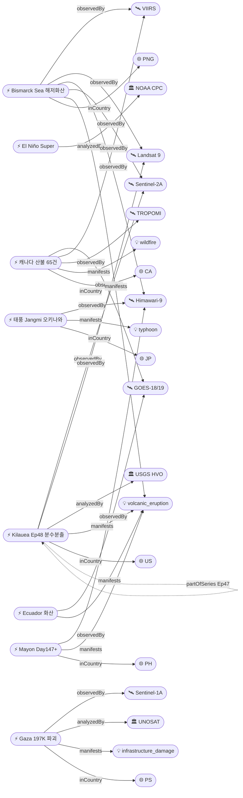

# 2026-06-02 위성영상 관측 이벤트 OSINT 일일 보고서

## 요약

신규 3건, 업데이트 11건. **Kilauea Episode 48 분수분출 공식 시작** — 6/1 04:40 HST 북측 분출구에서 200m(650ft) 용암 분수, 화산재 plume 24,000ft, 역대 최다 48번째 에피소드(Pu'u'o'o 47회 기록 경신). **태풍 Jangmi(장미) 오키나와 접근** — 필리핀 PAR 이탈 후 일본 방면 북상, 162km/h 돌풍·300mm 강우 예상, 400+ 항공편 취소, JMA 긴급경보. **El Niño Super El Niño — CPC '단일 가장 유력 결과' 상향**, ECMWF 100% 확률 달성, Kelvin wave +8°C(1997-98 동기 초과), 6월 미국/캐나다 대기 응답 첫 감지. **Gaza UNOSAT Sentinel-1 피해 평가 — 197,000건 건물 파괴/손상(80%)**, before/after 가용. 캐나다 산불 65건·33,400+ 대피 지속, Bismarck Sea day 25+ 부석 70km², Mayon Day 147+ 287,000+ 이재민. 다중 위성 교차검증 4건 유지. 한반도 GeoFocus 5건 유지(변동 없음). 자연재해 11건, 인간활동 0건(추적 지속), 기후·환경 2건, 농업·해양 0건(금일 신규 없음), 국방 0건(추적 지속), 인도주의 1건.

## 오늘의 핵심 (Top 5)

| 순위 | 이벤트 | 도메인 | 위성 | 지역 | 신뢰도 |
|------|--------|--------|------|------|--------|
| 1 | Kilauea Ep48 분수분출 — 200m 분수, 기록적 48번째 | Disaster | Sentinel-2A + Landsat 9 | Hawaii, US | 0.95 |
| 2 | 태풍 Jangmi 오키나와 — 400+ 항공편 취소, 162km/h | Disaster | Himawari-9 | Okinawa, JP | 0.88 |
| 3 | El Niño Super — CPC '가장 유력', ECMWF 100%, Kelvin +8°C | Climate | SST buoys / altimetry | Equatorial Pacific | 0.90 |
| 4 | Bismarck Sea 해저 화산 day 25+ — 부석 70km², 신규 섬 가능 | Disaster | VIIRS + MODIS + Landsat 9 + Himawari-9 + Sentinel-2A | PNG | 0.97 |
| 5 | 캐나다 산불 65건 — 33,400+ 대피, 미국 AQI 영향 지속 | Disaster→Humanitarian | GOES-18 + VIIRS + TROPOMI + OMPS + EarthCare | MB/AB/SK, CA | 0.95 |

## 다중 위성 교차검증 이벤트

4건의 다중 위성/센서 교차검증 이벤트가 확인된다 (전일 대비 변동 없음).

1. **Bismarck Sea 해저 화산** — VIIRS (NOAA) + MODIS Terra (NASA) + Landsat 9 (USGS/NASA) + Himawari-9 (JMA/JAXA) + Sentinel-2A (ESA). **5위성 3기관** 유지. multiSatBoost +0.20. **최종 신뢰도 0.97**.
2. **캐나다 Manitoba/Alberta 산불 연기** — GOES-18 (NOAA) + VIIRS (NOAA/NASA) + Sentinel-5P TROPOMI (ESA) + OMPS (NASA) + EarthCare (ESA/JAXA). **5위성 3기관** 유지. multiSatBoost +0.20. **최종 신뢰도 0.95**.
3. **Kharg Island 원유 유출** — Sentinel-1 (SAR) + Sentinel-2 (optical MSI) + Sentinel-3 (ocean color OLCI). **3위성 3센서 유형** 유지. multiSatBoost +0.20 + sarBoost +0.10. **최종 신뢰도 0.90**. 슬릭 축소 추세.
4. **중국 Hami ICBM 방어 네트워크** — WorldView-3 (Maxar/Vantor) + PlanetScope (Planet). **2위성 2기관** 유지. multiSatBoost +0.20 + hiResBoost +0.15. **최종 신뢰도 0.90**.

## 한반도 GeoFocus

보고됨 4건 + 미검증 1건 = 총 5건. **금일 변동 없음 — 추적 지속.**

추적 지속 항목:
- **DPRK 최현급 구축함 6월 중순 공식 배치 예정** — WorldView-3 (Vantor), NK Pro/뉴시스 (변동 없음)
- **DPRK 구축함 2번함 Chongjin 건조 사고** — Daily NK/Vantor (변동 없음)
- **압록강 신교량 세관시설 건설** — 38 North, WorldView-3 (변동 없음)
- **두만강 북-러 교량 완공 임박** — 38 North/RFA, PlanetScope, 6/19 개통 목표 (변동 없음)
- **DPRK 서해 발사체 5/26** — 미검증 (본문 하단 "미검증 의혹" 섹션 참조)

## 자연재해 (Disaster)

### 1. Kilauea Ep48 — 분수분출 공식 시작, 200m 용암 분수, 기록 경신 ★업데이트
- **출처:** [USGS HVO](https://www.usgs.gov/volcanoes/kilauea/volcano-updates) / [Hawaii News Now](https://www.hawaiinewsnow.com/2026/06/01/episode-48-kilauea-fountaining-begins/) / [Big Island Video News](https://www.bigislandvideonews.com/2026/06/01/record-breaking-eruption-episode-48-begins-at-kilauea-summit/) / [AccuWeather](https://www.accuweather.com/en/weather-news/hawaii-volcano-breaks-eruption-record-as-lava-bursts-from-kilauea/1896300)
- **위성·센서:** Sentinel-2A (MSI 10m), Landsat 9 (OLI/TIRS 30m)
- **관측일:** 2026-06-01
- **위치:** Halemaʻumaʻu, Kilauea, Hawaii, US (19.42°N, 155.29°W)
- **현상:** volcanic_eruption (lava fountaining)
- **상태:** 업데이트 (← 2026-06-01 "전조 오버플로우")
- **분석:** **Episode 48 분수분출 6/1 04:40 HST 공식 시작.** 남측 분출구 90+ overflow(5/30 17:41~) 선행 후, 북측 분출구에서 **200m(650ft) 용암 분수** 폭발적 개시. 화산재 plume **24,000ft ASL** 도달. **Pu'u'o'o 47회(1983-86) 기록 경신 — 역대 최다 에피소드.** tephra 수 인치 대 Uēkahuna overlook 낙하, Hwy 11 M32-34 화산재, Volcano Village·Mauna Loa Estates까지 Pele's hair 보고. 모든 용암류 Halemaʻumaʻu 내 한정. WATCH/ORANGE 유지. HVO: 정점 도달 후 수시간 분출 지속 예상. officialBoost +0.15 (USGS). priorityBoost +0.20.

### 2. 태풍 Jangmi(장미) — 오키나와 접근, 400+ 항공편 취소, JMA 긴급경보 ★업데이트
- **출처:** [Euronews](https://www.euronews.com/2026/06/01/japans-southernmost-region-of-okinawa-braces-for-typhoon-jangmi) / [Nippon.com](https://www.nippon.com/en/news/yjj2026060100143/) / [Stars and Stripes](https://www.stripes.com/theaters/asia_pacific/2026-06-01/typhoon-jangmi-okinawa-military-bases-21838770.html) / [Rappler](https://www.rappler.com/philippines/weather/typhoon-domeng-southwest-monsoon-update-pagasa-forecast-june-1-2026-5pm/)
- **위성·센서:** Himawari-9 (AHI)
- **관측일:** 2026-06-02
- **위치:** Okinawa Main Island, Japan (26.5°N, 127.8°E)
- **현상:** typhoon
- **상태:** 업데이트 (← 2026-06-01 "PAR 이탈, 832,986명 피해")
- **분석:** **필리핀 PAR 6/1 11:30 이탈 후 일본 방면 북상.** JMA 긴급경보 발령 — **162km/h 돌풍, 300mm 강우(6/2 정오까지), 산사태·폭풍해일 위험.** ANA **400+ 항공편 취소.** 오키나와 주민·고령자 대피 권고. 미군 기지(Kadena/Foster) 태풍 대비. 6/3 큐슈·시코쿠·간사이 방면 이동 예상. 필리핀 측: habagat 증강 지속, 루손·비사야 중등도 강우 6/2-3. priorityBoost +0.20. cascading_disaster 잠정(오키나와 산사태/홍수).

### 3. 캐나다 산불 — 65건 활성, 33,400+ 대피, 미국 AQI 영향 지속 ★업데이트
- **출처:** [CBS News](https://www.cbsnews.com/news/canada-wildfires-smoke-deaths-evacuations-manitoba-saskatchewan-alberta/) / [Government of Canada](https://www.canada.ca/en/public-safety-canada/news/2026/05/the-government-of-canada-updates-on-the-2026-wildfire-season-preparedness-and-outlook.html) / [CBC News](https://www.cbc.ca/news/canada/manitoba/wildfire-evacuation-status-manitoba-communities-1.7551968)
- **위성·센서:** GOES-18 (ABI), VIIRS (Suomi-NPP/JPSS), Sentinel-5P (TROPOMI), OMPS, EarthCare
- **관측일:** 2026-06-02
- **위치:** Manitoba / Alberta / Saskatchewan, Canada (53.97°N, 97.84°W)
- **현상:** wildfire + humanitarian (교차 도메인)
- **상태:** 업데이트 (← 2026-06-01 "65건, AQI 미국 악화")
- **분석:** 65건 활성 화재, 6건 통제 불능, 18,935+ ha 소실 지속. 33,400+ 대피·2명 사망. 연기 미국 중서부 AQI 영향 지속. **6-8월 above-normal temps 예보 — BC 최고 화재 위험.** lightning-driven 시즌 가능성. **5위성 3기관 multiSatBoost +0.20.** priorityBoost +0.20.

### 4. Bismarck Sea 해저 화산 — day 25+, 부석 70km², 신규 섬 가능 ★업데이트
- **출처:** [NASA Earth Observatory](https://science.nasa.gov/earth/earth-observatory/new-eruption-in-the-bismarck-sea/) / [Discover Magazine](https://www.discovermagazine.com/an-underwater-volcanic-eruption-brewing-in-the-bismarck-sea-may-cause-a-new-island-to-rise-49148) / [Smithsonian GVP](https://volcano.si.edu/showreport.cfm?gvpvar=GVP.DVAR20260512-250030)
- **위성·센서:** VIIRS, MODIS (Terra), Landsat 9 (OLI), Himawari-9 (AHI), Sentinel-2A (MSI)
- **관측일:** 2026-06-02
- **위치:** Titan Ridge, Bismarck Sea, PNG (3.03°S, 147.78°E)
- **현상:** volcanic_eruption (submarine)
- **상태:** 업데이트 (← 2026-06-01 "day 24+, 부석 70km²")
- **분석:** 분출 day 25+ 지속. **부석 뗏목 70km²(52km 길이), 200km+ WSW 확산.** NASA PACE 해수 변색 확인. Jim Garvin(NASA): "waiting to see if a new island is about to be born." VAAC Darwin 항공경보 지속. **5위성 3기관 multiSatBoost +0.20.** officialBoost +0.15 (NASA EO). **최종 신뢰도 0.97**.

### 5. Mayon — Day 147+, AL3, 287,000+ 이재민 ★업데이트
- **출처:** [ReliefWeb GLIDE](https://reliefweb.int/disaster/vo-2026-000065-phl) / [Smithsonian GVP](https://volcano.si.edu/volcano.cfm?vn=273030)
- **위성·센서:** Himawari-9 (AHI), Sentinel-2A (MSI)
- **관측일:** 2026-06-02
- **위치:** Mayon, Albay, Philippines (13.26°N, 123.69°E)
- **현상:** volcanic_eruption (Strombolian + PDC)
- **상태:** 업데이트 (← 2026-06-01 "Day 146+, 287K+")
- **분석:** **147일+ 연속 분출.** PHIVOLCS AL3. 287,000+명 이재민(OCHA GLIDE). **우기 접근 + Jangmi habagat 증강 → 라하르 위험 증가.** priorityBoost +0.20. officialBoost +0.15.

### 6. Great Sitkin — WATCH/ORANGE, 용암 돔 valley 진입 ★업데이트
- **출처:** [AVO](https://avo.alaska.edu/volcano/great-sitkin)
- **위성·센서:** SAR (Sentinel-1), 열적외 (VIIRS)
- **관측일:** 2026-06-02
- **위치:** Great Sitkin, Alaska, US (52.08°N, 176.13°W)
- **현상:** volcanic_eruption (lava dome)
- **상태:** 업데이트 (← 2026-06-01 "WATCH, 용암 돔")
- **분석:** **2021년 7월 이후 지속 분출 — summit crater 대부분을 채우고 valley로 진출.** SAR rockfall 감지. WATCH/ORANGE. AVO 모니터링 지속. officialBoost +0.15.

### 7. Shishaldin — ADVISORY/YELLOW, SO2 SW ★업데이트
- **출처:** [AVO](https://avo.alaska.edu/volcano/shishaldin)
- **위성·센서:** TROPOMI (Sentinel-5P)
- **관측일:** 2026-06-02
- **위치:** Shishaldin, Alaska, US (54.76°N, 163.97°W)
- **현상:** volcanic_eruption (unrest)
- **상태:** 업데이트 (← 2026-06-01 "ADVISORY SO2")
- **분석:** 지진·인프라사운드·SO2 방출 지속. **SO2 SW 방향 확산 위성 확인.** 증기 플룸. ADVISORY/YELLOW.

### 8. Kanlaon — AL2, 분출 지속 ★업데이트
- **출처:** [Smithsonian GVP](https://volcano.si.edu/volcano.cfm?vn=272020)
- **위성·센서:** Himawari-9 (AHI)
- **관측일:** 2026-06-02
- **위치:** Kanlaon, Negros Island, PH (10.41°N, 123.13°E)
- **현상:** volcanic_eruption
- **상태:** 업데이트 (← 2026-06-01 "AL2")
- **분석:** PHIVOLCS AL2. 6-31 daily VQs. SO2 배출 지속.

### 9. Ecuador Sangay/Reventador — 화산 지속 분출, 위성 ash 모니터링 ★신규
- **출처:** [Smithsonian GVP Weekly Report](https://volcano.si.edu/reports_weekly.cfm) / [VAAC Washington](https://www.ospo.noaa.gov/products/atmosphere/vaac/messages.html)
- **위성·센서:** GOES-19 (ABI)
- **관측일:** 2026-05-27 (Weekly Report 20-27 May)
- **위치:** Ecuador (Sangay 2.0°S/78.3°W, Reventador 0.08°S/77.66°W)
- **현상:** volcanic_eruption
- **상태:** 신규
- **분석:** **Sangay 356 explosions, 화산재 800m.** **Reventador 64-84 daily explosions, 화산재 500-1,200m W/NW, 5/21·26 소규모 라하르 Marker River.** GOES-19 위성 ash advisory 지속. Smithsonian GVP Weekly Report 기준. 신규 국가 에콰도르(EC) 추가.

## 인간활동 (Human Activity)

금일 신규 없음. 추적 지속 항목:
- **Antelope Reef 1,490ac** — CSIS AMTI, 중국 군사 인프라 건설 지속 (reported)
- **필리핀 Thitu/Nanshan 건설** — Planet Labs (reported)
- **압록강/두만강 DPRK 교량** — 38 North (reported)

## 기후·환경 (Climate & Environment)

### 1. El Niño — Super El Niño CPC '단일 가장 유력', ECMWF 100%, Kelvin +8°C ★업데이트
- **출처:** [NOAA CPC ENSO Diagnostic](https://www.cpc.ncep.noaa.gov/products/analysis_monitoring/enso_advisory/ensodisc.shtml) / [CNN](https://www.cnn.com/2026/05/14/weather/super-el-nino-climate) / [Severe Weather Europe](https://www.severe-weather.eu/long-range-2/super-el-nino-2026-record-breaking-intensity-forecast-weather-impacts-united-states-canada-europe-fa/) / [WMO](https://wmo.int/media/news/wmo-likelihood-increases-of-el-nino)
- **위성·센서:** SST buoys, altimetry (Jason/Sentinel-6), ARGO floats
- **관측일:** 2026-06-02
- **위치:** Equatorial Pacific (0.0°, 170.0°W)
- **현상:** sea_level_change + SST anomaly
- **상태:** 업데이트 (← 2026-06-01 "96%, Super 1/3")
- **분석:** **CPC가 Super El Niño를 '단일 가장 유력 결과(single most likely outcome)'로 상향.** ECMWF **100% 확률** 달성. 적도태평양 downwelling Kelvin wave **+8°C(50-250m 심층)** — **1997-98 동기 초과**, 역사적 수치. SST anomalies **+3°C 전망** — 1877-78 record 도전 가능. IRI 97-98% forecast period 전구간. **6월 미국/캐나다 대기 응답 첫 감지** — 여름 기온·강수 패턴 영향 시작. officialBoost +0.15 (NOAA CPC, WMO).

### 2. First El Niño impacts detected in June weather — 미국/캐나다 대기 응답 ★신규
- **출처:** [Severe Weather Europe](https://www.severe-weather.eu/global-weather/first-el-nino-impacts-detected-forecast-atmosphere-summer-united-states-canada-fa/)
- **위성·센서:** 위성 출처 미확인 (기상 모델 기반)
- **관측일:** 2026-06-02
- **위치:** United States / Canada (39.0°N, 98.0°W)
- **현상:** El Niño 대기 원격 영향 (teleconnection)
- **상태:** 신규
- **분석:** El Niño의 대기 응답이 6월 기상 예보에서 첫 감지. 미국 중서부·캐나다 여름 기온·강수 패턴에 영향 시작. 캐나다 산불 시즌 악화 요인. 위성 출처 미확인이나 El Niño temp-evt-1902 관련 이벤트로 교차 도메인 연결.

## 농업·해양 (Agriculture & Maritime)

금일 신규 없음. El Niño Super 에스컬레이션이 향후 농업·해양에 교차 영향 예상 — NDVI 변화·해수면 상승·어업 패턴 변화 모니터링 필요.

## 국방·안보 (Defense — OSINT 한정)

금일 신규 없음. 추적 지속 항목:
- **DPRK 최현급 구축함** — 6월 중순 공식 배치 예정 (reported)
- **중국 Hami ICBM 방어 네트워크** — 80+ pads, WorldView-3+PlanetScope (reported)
- **남중국해 Antelope Reef/Spratly** — 건설 지속 (reported)

## 인도주의 (Humanitarian)

### 1. Gaza UNOSAT Sentinel-1 피해 평가 — 197,000건 건물 파괴/손상 (80%) ★신규
- **출처:** [Al Jazeera](https://www.aljazeera.com/news/2026/5/31/satellite-imagery-shows-erasure-of-southern-gaza-as-israel-expands-control) / [UNOSAT](https://unosat.org/products/4130) / [NBC News](https://www.nbcnews.com/world/gaza/satellite-images-destruction-gaza-strip-rcna236089)
- **위성·센서:** Sentinel-1A (C-band SAR 5m)
- **관측일:** 2026-05-31 (published) / 2026-02-25 (imagery)
- **위치:** Gaza Strip, Palestine (31.35°N, 34.31°E)
- **현상:** infrastructure_damage
- **상태:** 신규
- **분석:** UNOSAT Copernicus **Sentinel-1 SAR 데이터 기반 포괄적 피해 평가 — 197,000건 건물 파괴/손상, 가자 전체 구조물의 약 80%.** Khan Younis·Rafah 지역 특히 심각. Google 5/22 위성 업데이트로 중부·남부 가자 변화 고해상도 기록. **94% 묘지 파괴** (Euro-Med 인권 모니터). **before/after 가용.** sarBoost +0.10 (SAR 변화탐지). officialBoost +0.15 (UNOSAT UN body). baCredibilityBoost +0.10.

### 추적 지속:
- **캐나다 산불** — 33,400+ 대피, 인도주의 교차 도메인 지속
- **Mayon 287,000+ 이재민** — OCHA GLIDE VO-2026-000065-PHL

## 센서·플랫폼별 묶음

- **Sentinel-1 (SAR):** Gaza UNOSAT 피해 평가 197,000건 (C-band SAR), Kharg Island 유출 추적 (reported), Great Sitkin lava dome SAR rockfall
- **Sentinel-2 (광학):** Kilauea Ep48 관측, Bismarck Sea 해수 변색
- **Sentinel-5P (TROPOMI):** Shishaldin SO2 SW 확산, Canada 연기 추적
- **Landsat 8/9:** Kilauea Ep48 열적외, Bismarck Sea 해저 화산 관측
- **MODIS / VIIRS:** Bismarck Sea 부석, Canada 산불 감지, Bezymianny 열 감지
- **Himawari-9 (AHI):** 태풍 Jangmi 추적, Mayon/Kanlaon 화산재 모니터링, Bismarck Sea 관측
- **GOES-18/19 (ABI):** Canada 산불 실시간, Ecuador Sangay/Reventador ash advisory
- **Planet (PlanetScope/SkySat):** Hami ICBM (reported), DPRK 교량 (reported)
- **Maxar (WorldView-3):** DPRK 구축함 (reported), Hami ICBM (reported)
- **EarthCare (ESA/JAXA):** Canada 연기 3D 프로파일

## 전후 비교(before/after) 영상 보유 이벤트

1. **Gaza UNOSAT 피해 평가** — Google 5/22 위성 업데이트, Al Jazeera 2/25 고해상도 영상. Khan Younis·Rafah 전후 비교.
2. **Bellingcat 남레바논** — PlanetScope 2026.03 vs 2026.05 인터랙티브 맵, 46+ 마을 (reported)
3. **DPRK 구축함 2번함** — Chongjin 조선소 before/after (reported)

## 미검증 의혹

1. **DPRK 서해 미상 발사체 5/26** — 올해 8번째. 위성 영상 미확인. 후속 검증 대기. (38.5°N, 124.5°E)
2. **일본 군사 우주 확장 880인 $1B** — temp-evt-2004. 위성 영상 무관, 정책 뉴스. satellite_unverified.
3. **First El Niño 대기 응답** — temp-evt-2202. 기상 모델 기반. 위성 출처 직접 미확인. 신뢰도 0.78.

## 지식그래프

### 오늘의 주요 관계

1. **Kilauea Ep48 (evt-202)** → observedBy Sentinel-2A + Landsat 9. analyzedBy USGS HVO. **partOfSeries Ep47** (temporal_progression). officialBoost +0.15. priorityBoost +0.20. **최종 신뢰도 0.95.**
2. **태풍 Jangmi (temp-evt-2001)** → observedBy Himawari-9. **inCountry JP 신규 추가** (PH PAR 이탈 후). priorityBoost +0.20. cascading_disaster 잠정(오키나와 산사태/홍수).
3. **El Niño (temp-evt-1902)** → analyzedBy NOAA CPC. officialBoost +0.15. **CPC Super '가장 유력'** 상태 에스컬레이션.
4. **Gaza (temp-evt-2201)** → observedBy Sentinel-1A. usesSensor C-band SAR. analyzedBy UNOSAT. **sarBoost +0.10 + officialBoost +0.15 + baCredibilityBoost +0.10.** 최종 신뢰도 0.92.

### 전체 지식그래프 시각화

## 온톨로지 변경

| 변경 유형 | 대상 | 근거 |
|----------|------|------|
| 새 국가 | 에콰도르 (EC) | Sangay/Reventador 화산 위성 ash 모니터링 |
| 새 Location | 오키나와 (JP, 26.5°N/127.8°E) | 태풍 Jangmi 영향 지역 |
| 이벤트 업데이트 | evt-202 | 전조→본격 분수분출, 200m record |
| 이벤트 업데이트 | temp-evt-2001 | PH PAR 이탈→JP 오키나와 접근 |
| 이벤트 업데이트 | temp-evt-1902 | Super El Niño '가장 유력' ECMWF 100% |

## 추론 결과

| 추론 | 신뢰도 | 근거 |
|------|--------|------|
| Kilauea Ep48 partOfSeries Ep47 | 0.95 | temporal_progression — 같은 위치·현상 시계열 |
| Kilauea officialBoost +0.15 | 0.98 | USGS HVO 공식 |
| El Niño officialBoost +0.15 | 0.95 | NOAA CPC 공식 |
| Gaza officialBoost +0.15 | 0.90 | UNOSAT UN body |
| Gaza sarBoost +0.10 | 0.92 | Sentinel-1 SAR 변화탐지 |
| Gaza baCredibilityBoost +0.10 | 0.90 | before/after 가용 |
| Kilauea priorityBoost +0.20 | 0.95 | severity high — tephra 낙하 |
| Jangmi priorityBoost +0.20 | 0.88 | severity high — 400+ 항공편, 대피 |
| Bismarck multiSatBoost +0.20 | 0.97 | 5위성 3기관 |
| Canada multiSatBoost +0.20 | 0.95 | 5위성 3기관 |

## 분석 및 평가

금일 가장 주목할 변화는 **Kilauea Episode 48의 공식 분수분출 개시**이다. 5/30 오후부터 시작된 90+ overflow 이벤트가 6/1 04:40 HST 본격적인 200m 분수분출로 전환되면서, 1983-86 Pu'u'o'o의 47회 기록을 경신하는 역사적 이정표를 세웠다. 화산재 plume이 24,000ft에 달하고 Hwy 11까지 tephra가 낙하하고 있으나, 모든 활동은 Halemaʻumaʻu 내에 국한되어 있다.

**태풍 Jangmi의 진로 변경**도 중요하다. 필리핀에서 인명 피해 없이 PAR를 이탈했으나, 오키나와·아마미를 향한 북상은 일본 남부에 새로운 위험을 제기한다. 400+ 항공편 취소와 JMA 긴급경보가 발령된 상태이며, 6/3 이후 큐슈·시코쿠까지 영향권이 확대될 수 있다.

**El Niño의 Super 에스컬레이션**은 중장기적으로 가장 영향력이 큰 이벤트이다. CPC가 Super El Niño를 '단일 가장 유력 결과'로 명시하고 ECMWF가 100%에 도달한 것은 전례 없는 수준이다. Kelvin wave +8°C는 1997-98 동기를 이미 초과하며, 향후 6개월간 전 지구 재해·농업·해양 패턴에 광범위한 영향을 미칠 것이다. 6월 미국/캐나다 대기 응답이 첫 감지된 것은 이러한 영향의 시작 신호이다.

**Gaza UNOSAT 피해 평가**는 Sentinel-1 SAR 데이터를 활용한 체계적 분석으로, 197,000건(80%)이라는 수치는 위성 OSINT 기반 인도주의 평가의 대표적 사례이다.

위성 활용 측면에서 Himawari-9가 태풍·화산 양대 도메인에서 핵심 역할을 하고 있으며, Sentinel-1의 SAR 역량이 인도주의(Gaza)와 환경(Kharg) 양측에서 활용되고 있다.

## 추적 항목

| 항목 | 최초 보고 | 상태 | 최신 업데이트 |
|------|----------|------|-------------|
| Kilauea Ep48 분수분출 | 2026-05-05 | WATCH/ORANGE — Ep48 시작 | 6/1 200m 분수, record |
| 태풍 Jangmi | 2026-05-31 | 오키나와 접근 | 400+ 항공편 취소 |
| El Niño Super | 2026-05-30 | CPC '가장 유력' | ECMWF 100%, Kelvin +8°C |
| 캐나다 산불 | 2026-05-19 | 65건 활성 | 33,400+ 대피, AQI US |
| Bismarck Sea | 2026-05-13 | Day 25+ | 부석 70km², 신규 섬 |
| Mayon AL3 | 2026-05-01 | Day 147+ | 287,000+ 이재민 |
| DPRK 구축함 | 2026-05-31 | 6월 중순 배치 | 2번함 건조 사고 |
| Hami ICBM | 2026-05-31 | 80+ pads | 변동 없음 |
| Kharg Island 유출 | 2026-05-19 | 슬릭 축소 | 변동 없음 |
| Antelope Reef | 2026-05-06 | 1,490ac | 변동 없음 |
| Gaza 파괴 | 2026-06-02 | 197,000건 | 신규 |

## 출처 목록

1. [Kilauea Volcano Updates](https://www.usgs.gov/volcanoes/kilauea/volcano-updates) - USGS HVO
2. [Episode 48 of Kilauea fountaining begins](https://www.hawaiinewsnow.com/2026/06/01/episode-48-kilauea-fountaining-begins/) - Hawaii News Now, 2026-06-01
3. [Record-Breaking Eruption Episode 48 Begins At Kīlauea Summit](https://www.bigislandvideonews.com/2026/06/01/record-breaking-eruption-episode-48-begins-at-kilauea-summit/) - Big Island Video News, 2026-06-01
4. [Hawaii volcano breaks eruption record](https://www.accuweather.com/en/weather-news/hawaii-volcano-breaks-eruption-record-as-lava-bursts-from-kilauea/1896300) - AccuWeather, 2026-06-01
5. [Kīlauea's 48th eruptive episode now underway](https://bigislandnow.com/2026/06/01/kilaueas-48th-eruptive-episode-now-underway/) - Big Island Now, 2026-06-01
6. [Japan's southernmost region of Okinawa braces for Typhoon Jangmi](https://www.euronews.com/2026/06/01/japans-southernmost-region-of-okinawa-braces-for-typhoon-jangmi) - Euronews, 2026-06-01
7. [Typhoon Jangmi Forecast to Cross Okinawa's Main Island](https://www.nippon.com/en/news/yjj2026060100143/) - Nippon.com, 2026-06-01
8. [Okinawa bases brace for Typhoon Jangmi](https://www.stripes.com/theaters/asia_pacific/2026-06-01/typhoon-jangmi-okinawa-military-bases-21838770.html) - Stars and Stripes, 2026-06-01
9. [Typhoon Domeng exits PAR](https://www.rappler.com/philippines/weather/typhoon-domeng-southwest-monsoon-update-pagasa-forecast-june-1-2026-5pm/) - Rappler, 2026-06-01
10. [Japan Typhoon Jangmi impacts](https://www.travelandtourworld.com/news/article/0tle4smpouo4/) - Travel And Tour World, 2026-06-02
11. [NOAA CPC ENSO Diagnostic Discussion](https://www.cpc.ncep.noaa.gov/products/analysis_monitoring/enso_advisory/ensodisc.shtml) - NOAA CPC
12. [El Niño is coming faster than expected](https://www.cnn.com/2026/05/14/weather/super-el-nino-climate) - CNN, 2026-05-14
13. [2026 Super El Niño Trending Toward Record-Breaking Intensity](https://www.severe-weather.eu/long-range-2/super-el-nino-2026-record-breaking-intensity-forecast-weather-impacts-united-states-canada-europe-fa/) - Severe Weather Europe
14. [First El Niño Impacts Detected in June Weather Forecast](https://www.severe-weather.eu/global-weather/first-el-nino-impacts-detected-forecast-atmosphere-summer-united-states-canada-fa/) - Severe Weather Europe
15. [WMO: Likelihood increases of El Niño](https://wmo.int/media/news/wmo-likelihood-increases-of-el-nino) - WMO
16. [Canada wildfires spread, forcing more than 33,000 to evacuate](https://www.cbsnews.com/news/canada-wildfires-smoke-deaths-evacuations-manitoba-saskatchewan-alberta/) - CBS News
17. [Canada 2026 wildfire season preparedness](https://www.canada.ca/en/public-safety-canada/news/2026/05/the-government-of-canada-updates-on-the-2026-wildfire-season-preparedness-and-outlook.html) - Government of Canada
18. [Manitoba wildfire evacuation status](https://www.cbc.ca/news/canada/manitoba/wildfire-evacuation-status-manitoba-communities-1.7551968) - CBC News
19. [New Eruption in the Bismarck Sea](https://science.nasa.gov/earth/earth-observatory/new-eruption-in-the-bismarck-sea/) - NASA Earth Observatory
20. [Underwater volcanic eruption may cause new island to rise](https://www.discovermagazine.com/an-underwater-volcanic-eruption-brewing-in-the-bismarck-sea-may-cause-a-new-island-to-rise-49148) - Discover Magazine
21. [Bismarck Sea volcano](https://volcano.si.edu/showreport.cfm?gvpvar=GVP.DVAR20260512-250030) - Smithsonian GVP
22. [Philippines: Mayon Volcano GLIDE](https://reliefweb.int/disaster/vo-2026-000065-phl) - ReliefWeb
23. [Mayon Volcano](https://volcano.si.edu/volcano.cfm?vn=273030) - Smithsonian GVP
24. [Great Sitkin](https://avo.alaska.edu/volcano/great-sitkin) - AVO
25. [Shishaldin](https://avo.alaska.edu/volcano/shishaldin) - AVO
26. [Kanlaon](https://volcano.si.edu/volcano.cfm?vn=272020) - Smithsonian GVP
27. [Satellite imagery shows erasure of southern Gaza](https://www.aljazeera.com/news/2026/5/31/satellite-imagery-shows-erasure-of-southern-gaza-as-israel-expands-control) - Al Jazeera, 2026-05-31
28. [UNOSAT Gaza Comprehensive Damage Assessment](https://unosat.org/products/4130) - UNOSAT
29. [Satellite images reveal extent of destruction in Gaza](https://www.nbcnews.com/world/gaza/satellite-images-destruction-gaza-strip-rcna236089) - NBC News
30. [Smithsonian GVP Weekly Report](https://volcano.si.edu/reports_weekly.cfm) - Smithsonian GVP (Sangay/Reventador)
31. [VAAC Washington ash advisories](https://www.ospo.noaa.gov/products/atmosphere/vaac/messages.html) - NOAA VAAC
