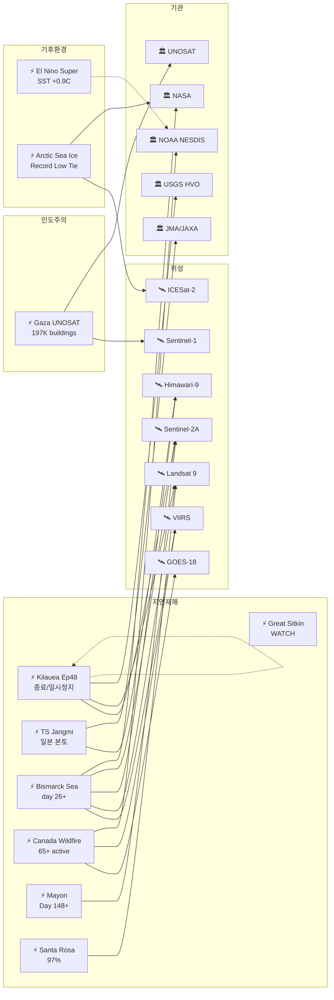

# 2026-06-03 위성영상 관측 이벤트 OSINT 일일 보고서

## 요약

신규 1건, 업데이트 16건. **Kilauea Episode 48 종료** -- 6/1 04:40~13:37 HST(9시간) 분출 후 갑작 중단, 기록적 48번째 에피소드 종결, Ep49 1-3주 내 예보. WATCH/ORANGE 유지. **열대폭풍 Jangmi(장미) 일본 본토 상륙** -- 6/2 오키나와·가고시마 16+ 부상, 48,000가구 정전, 6/3 큐슈-시코쿠-간사이-간토(도쿄) 접근, ANA/JAL 300+ 항공편 취소, 200-300mm 강우로 홍수·산사태 위험. **Bismarck Sea 해저 화산 day 26+** -- 부석 뗏목 70km², NASA PACE 해수변색 공식 확인, Jim Garvin(NASA) "신규 섬 탄생 가능" 언급. **캐나다 산불 65+ 활성** -- NOAA NESDIS 공식 위성 모니터링 보고, 33,400+ 대피·2 사망·연기 미국 중서부·유럽 확산. **El Nino Super** -- SST NINO3.4 +0.9도C, ECMWF 100%, 모델 +3도C 전망. **북극 해빙 최대면적 역대 최저 타이**(신규) -- 5.52M sq miles(2026/3/15), NASA 공식. 다중 위성 교차검증 4건 유지. 한반도 GeoFocus 5건 유지(변동 없음). 농업·해양 카테고리 금일 신규 없음.

## 오늘의 핵심 (Top 5)

| 순위 | 이벤트 | 도메인 | 위성 | 지역 | 신뢰도 |
|------|--------|--------|------|------|--------|
| 1 | Bismarck Sea 해저 화산 day 26+ -- 부석 70km2, 신규 섬 가능 | Disaster | VIIRS + MODIS + Landsat 9 + Himawari-9 + Sentinel-2A | PNG | 0.97 |
| 2 | 캐나다 산불 65+ -- 33,400+ 대피, NOAA NESDIS 공식 보고 | Disaster | GOES-18 + VIIRS + TROPOMI + OMPS + EarthCare | MB/AB/SK, CA | 0.95 |
| 3 | Kilauea Ep48 종료 -- 9시간 분출 후 일시정지, Ep49 예보 | Disaster | Sentinel-2A + Landsat 9 | Hawaii, US | 0.95 |
| 4 | El Nino Super -- SST +0.9도C, ECMWF 100%, +3도C 전망 | Climate | SST buoys / altimetry | Equatorial Pacific | 0.90 |
| 5 | TS Jangmi 일본 본토 -- 16+ 부상, 48K 정전, 300+ 항공편 | Disaster | Himawari-9 | Japan | 0.88 |

## 다중 위성 교차검증 이벤트

4건의 다중 위성/센서 교차검증 이벤트가 확인된다 (전일 대비 변동 없음).

1. **Bismarck Sea 해저 화산** -- VIIRS (NOAA) + MODIS Terra (NASA) + Landsat 9 (USGS/NASA) + Himawari-9 (JMA/JAXA) + Sentinel-2A (ESA). **5위성 3기관** 유지. multiSatBoost +0.20. **최종 신뢰도 0.97**.
2. **캐나다 Manitoba/Alberta 산불 연기** -- GOES-18 (NOAA) + VIIRS (NOAA/NASA) + Sentinel-5P TROPOMI (ESA) + OMPS (NASA) + EarthCare (ESA/JAXA). **5위성 3기관** 유지. multiSatBoost +0.20. **최종 신뢰도 0.95**.
3. **Kharg Island 원유 유출** -- Sentinel-1 (SAR) + Sentinel-2 (optical MSI) + Sentinel-3 (ocean color OLCI). **3위성 3센서 유형** 유지. multiSatBoost +0.20 + sarBoost +0.10. **최종 신뢰도 0.90**. 슬릭 축소 추세.
4. **중국 Hami ICBM 방어 네트워크** -- WorldView-3 (Maxar/Vantor) + PlanetScope (Planet). **2위성 2기관** 유지. multiSatBoost +0.20 + hiResBoost +0.15. **최종 신뢰도 0.90**.

## 한반도 GeoFocus

보고됨 4건 + 미검증 1건 = 총 5건. **금일 변동 없음 -- 추적 지속.**

추적 지속 항목:
- **DPRK 최현급 구축함 6월 중순 공식 배치 예정** -- WorldView-3 (Vantor), NK Pro/뉴시스 (변동 없음)
- **DPRK 구축함 2번함 Chongjin 건조 사고** -- Daily NK/Vantor (변동 없음)
- **압록강 신교량 세관시설 건설** -- 38 North, WorldView-3 (변동 없음)
- **두만강 북-러 교량 완공 임박** -- 38 North/RFA, PlanetScope, 6/19 개통 목표 (변동 없음)
- **DPRK 서해 발사체 5/26** -- 미검증 (본문 하단 "미검증 의혹" 섹션 참조)

## 자연재해 (Disaster)

### 1. Kilauea Ep48 종료 -- 9시간 분출 후 일시정지, Ep49 1-3주 예보

- **출처:** [USGS HVO](https://www.usgs.gov/volcanoes/kilauea/volcano-updates)
- **위성/센서:** Sentinel-2A (MSI 10m), Landsat 9 (OLI/TIRS 30m)
- **관측일:** 2026-06-01 ~ 06-03
- **위치:** Halema'uma'u, Kilauea, Hawaii, US (19.42N, 155.29W)
- **현상:** volcanic_eruption (lava fountaining)
- **상태:** 업데이트 -- Ep48 종료/일시정지
- **분석:** **Episode 48 6/1 04:40 HST 시작, 13:37 HST 갑작 종료 -- 9시간 분출.** 북측 분출구 최대 200m(650ft) 용암 분수. 화산재 plume 24,000ft ASL. tephra Uekahuna overlook, Hwy 11 M32-34, Volcano Village, Mauna Loa Estates (Pele's hair). 남측 분출구는 spatter만. **Pu'u'o'o 47회(1983-86) 기록 경신 -- 역대 최다 에피소드.** 분출 일시정지(paused). HVO: **Ep49 1-3주 내 예상.** WATCH/ORANGE 유지. officialBoost +0.15 (USGS HVO). thermalBoost +0.10 (TIRS).

### 2. 열대폭풍 Jangmi(장미) -- 일본 본토 상륙, 16+ 부상, 48K 정전

- **출처:** [Japan Times](https://www.japantimes.co.jp/news/2026/06/02/japan/storm-typhoon-jangmi/) / [Travel and Tour World](https://www.travelandtourworld.com/news/article/0tle4smpouo4/)
- **위성/센서:** Himawari-9 (AHI)
- **관측일:** 2026-06-02 ~ 06-03
- **위치:** Japan Pacific Coast -- Okinawa -> Kyushu -> Shikoku -> Kansai -> Kanto (26.5~35.0N, 127~140E)
- **현상:** typhoon (TS 약화)
- **상태:** 업데이트 -- 본토 접근
- **분석:** **태풍에서 열대폭풍으로 약화(downgrade).** 6/2 오키나와·가고시마 **16+ 부상, 48,000가구 정전.** Kadena AB 74mph(119km/h) 돌풍. **6/3 큐슈-시코쿠-간사이-간토(도쿄 포함) 접근.** ANA/JAL **300+ 항공편 취소.** 200-300mm 강우 -- 홍수·산사태 위험. **1951년 이후 3번째로 이른 시기의 일본 영향 태풍** (한국 기상청 발표). cascading_disaster 잠정(본토 홍수/산사태). priorityBoost +0.20 (인명피해).

### 3. Bismarck Sea 해저 화산 -- day 26+, 부석 70km2, 신규 섬 가능

- **출처:** [NASA EO](https://science.nasa.gov/earth/earth-observatory/new-eruption-in-the-bismarck-sea/) / [Discover Magazine](https://www.discovermagazine.com/an-underwater-volcanic-eruption-brewing-in-the-bismarck-sea-may-cause-a-new-island-to-rise-49148) / [EarthSky](https://earthsky.org/earth/undersea-volcano-erupting-papua-new-guinea-may-2026/)
- **위성/센서:** VIIRS (Suomi-NPP/JPSS) + MODIS (Terra) + Landsat 9 (OLI) + Himawari-9 (AHI) + Sentinel-2A (MSI)
- **관측일:** 2026-06-03 (분출 day 26+)
- **위치:** Central Bismarck Sea, Papua New Guinea (3.03S, 147.78E)
- **현상:** volcanic_eruption (submarine)
- **상태:** 업데이트 -- NASA PACE 확인
- **분석:** **분출 day 26+ 지속.** 부석 뗏목 **70km2(52km 길이), 200km+ WSW 확산.** NASA PACE 해수변색 공식 확인. **Jim Garvin(NASA Goddard): "신규 섬 탄생 관찰 대기 중."** VAAC Darwin 항공경보 지속. **5위성 3기관 multiSatBoost +0.20 유지** -- 최고 신뢰도 0.97. officialBoost +0.15 (NASA). thermalBoost +0.10.

### 4. 캐나다 산불 -- 65+ 활성, NOAA NESDIS 공식 위성 보고

- **출처:** [NOAA NESDIS](https://www.nesdis.noaa.gov/news/noaa-satellites-monitor-canadian-wildfires-and-smoke) / [CBS News](https://www.cbsnews.com/news/canada-wildfires-smoke-deaths-evacuations-manitoba-saskatchewan-alberta/)
- **위성/센서:** GOES-18 (ABI) + VIIRS (Suomi-NPP/JPSS) + Sentinel-5P (TROPOMI) + OMPS (Suomi-NPP) + EarthCare (ATLID)
- **관측일:** 2026-06-03
- **위치:** Manitoba / Alberta / Saskatchewan, Canada (53.97N, 97.84W)
- **현상:** wildfire + humanitarian (교차 도메인)
- **상태:** 업데이트 -- NOAA 공식 보고
- **분석:** **65+ 활성 화재 지속, 6건 통제 불능.** 33,400+ 대피, 2 사망, 18,935+ ha 소실. **NOAA NESDIS 공식 위성 모니터링 보고서** 발행 -- 열 시그니처·연기 추적 상세. 연기 미국 중서부·유럽 확산. **6-8월 above-normal temps 예보 -- BC 최고 화재 위험.** **5위성 3기관 multiSatBoost +0.20 유지.** officialBoost +0.15 (NOAA). priorityBoost +0.20 (인명피해).

### 5. Mayon 화산 -- Day 148+, AL3, 287,000+ 이재민, 라하르 위험

- **출처:** [ReliefWeb GLIDE](https://reliefweb.int/disaster/vo-2026-000065-phl)
- **위성/센서:** Sentinel-2A (MSI), Himawari-9 (AHI)
- **관측일:** 2026-06-03
- **위치:** Mayon Volcano, Albay Province, Philippines (13.26N, 123.69E)
- **현상:** volcanic_eruption (Strombolian + PDC)
- **상태:** 업데이트
- **분석:** **Day 148+ 지속.** PHIVOLCS AL3. **287,000+ 이재민.** 우기 접근 + Jangmi habagat 증강 -> **라하르 위험 증가** 강조. continuous Strombolian + PDC. officialBoost +0.15 (PHIVOLCS/ReliefWeb).

### 6. Great Sitkin -- WATCH/ORANGE, 용암 돔 valley 진입 지속

- **출처:** [USGS AVO](https://avo.alaska.edu/volcano/great-sitkin)
- **위성/센서:** Sentinel-1 (C-SAR)
- **관측일:** 2026-06-03
- **위치:** Great Sitkin, Aleutian Islands, US (52.08N, 176.13W)
- **현상:** volcanic_eruption (lava dome)
- **상태:** 업데이트 -- 변동 없음
- **분석:** 2021년 7월 이후 지속. 용암 돔 summit crater 대부분 충전, valley 진출 중. SAR 관측 지속. WATCH/ORANGE. officialBoost +0.15 (USGS AVO).

### 7. Shishaldin -- ADVISORY/YELLOW, SO2 SW 확산

- **출처:** [USGS AVO](https://avo.alaska.edu/volcano/shishaldin)
- **위성/센서:** Sentinel-5P (TROPOMI SO2)
- **관측일:** 2026-06-03
- **위치:** Shishaldin, Aleutian Islands, US (54.76N, 163.97W)
- **현상:** volcanic_eruption (unrest)
- **상태:** 업데이트 -- 변동 없음
- **분석:** 지진·인프라사운드 지속. SO2 SW 방향 확산 TROPOMI 확인. 증기 플룸. ADVISORY/YELLOW. officialBoost +0.15 (USGS AVO).

### 8. Kanlaon -- AL2, 분출 지속

- **출처:** [Smithsonian GVP](https://volcano.si.edu/volcano.cfm?vn=272020)
- **위성/센서:** Himawari-9 (AHI)
- **관측일:** 2026-06-03
- **위치:** Kanlaon, Negros Island, Philippines (10.41N, 123.13E)
- **현상:** volcanic_eruption
- **상태:** 업데이트 -- 변동 없음
- **분석:** PHIVOLCS AL2. 6-31 daily VQs. SO2 배출 지속. 5/26 폭발적 분출(화산재 2500m + PDC) 이후 모니터링.

### 9. Ecuador Sangay/Reventador -- 분출 지속

- **출처:** [Smithsonian GVP](https://volcano.si.edu/reports_weekly.cfm)
- **위성/센서:** GOES-19 (ABI)
- **관측일:** 2026-06-03
- **위치:** Sangay (-2.00, -78.34) / Reventador (-0.08, -77.66), Ecuador
- **현상:** volcanic_eruption
- **상태:** 업데이트 -- 변동 없음
- **분석:** Sangay 356 explosions/day, Reventador 64-84/day 지속. GOES-19 ABI ash 모니터링.

### 10. Bezymianny (Russia) -- 용암 유출 지속, Yellow

- **출처:** Smithsonian GVP
- **위성/센서:** Himawari-9 (AHI), VIIRS
- **관측일:** 2026-06-03
- **위치:** Bezymianny, Kamchatka, Russia (55.97N, 160.59E)
- **현상:** volcanic_eruption (lava effusion)
- **상태:** 추적 지속 -- Aviation Color Code Yellow (5/21 하향)

### 11. Dukono (Indonesia) -- 분출 지속

- **출처:** Smithsonian GVP
- **위성/센서:** Himawari-9 (AHI)
- **관측일:** 2026-06-03
- **위치:** Dukono, Halmahera, Indonesia (1.68N, 127.87E)
- **현상:** volcanic_eruption (ash plumes)
- **상태:** 추적 지속 -- 화산재 300-1600m

### 12. Santa Rosa Island fire -- 97% 진압, 6/6 종결 예정

- **출처:** [InciWeb](https://inciweb.wildfire.gov/incident-information/cacnp-santa-rosa-island-fire)
- **위성/센서:** Landsat 9 (OLI false-color)
- **관측일:** 2026-06-03
- **위치:** Santa Rosa Island, Channel Islands NP, California, US (33.97N, 120.10W)
- **현상:** wildfire (contained)
- **상태:** 업데이트 -- 97% contained
- **분석:** 97% 진압. 18,379ac(7,438ha). Channel Islands 역대 최대 산불. 6/6 종결 예정. Landsat 9 OLI false-color burn scar 영상 NASA EO 6/2 발행.

## 인간활동 (Human Activity)

추적 지속 2건 (reported).

- **남중국해 Antelope Reef 15km2 매립** -- CSIS AMTI, 2025/11 이후 가속 ([CSIS AMTI](https://amti.csis.org/antelope-reef-could-now-be-the-largest-island-in-the-south-china-sea/))
- **필리핀 Thitu 활주로 1.5km + Nanshan 항만** -- Planet Labs ([RFA](https://www.rfa.org/english/southchinasea/2026/05/08/philippines-satellite-spratlys-infrastructure-upgrade/))

## 기후/환경 (Climate & Environment)

### 1. El Nino Super -- SST NINO3.4 +0.9도C, ECMWF 100%, +3도C 전망

- **출처:** [CPC/NOAA](https://www.cpc.ncep.noaa.gov/products/analysis_monitoring/enso_advisory/ensodisc.shtml) / [Severe Weather Europe](https://www.severe-weather.eu/long-range-2/super-el-nino-2026-record-breaking-intensity-forecast-weather-impacts-united-states-canada-europe-fa/)
- **위성/센서:** SST buoys, altimetry (Jason-3/Sentinel-6), TROPOMI
- **관측일:** 2026-06-03
- **위치:** Equatorial Pacific (0.0, -170.0)
- **현상:** sea_level_change (ENSO)
- **상태:** 업데이트 -- 정량적 SST 확인
- **분석:** ECMWF 100% 확률. CPC: **"Super El Nino single most likely outcome."** SST 이상 NINO3.4 **+0.9도C(5/13 주)** 도달. 모델 **+3도C 2026 하반기** 전망. **6월 미국/캐나다 대기 영향 첫 감지** 확인. 차기 CPC ENSO Discussion **6/11.** officialBoost +0.15 (CPC/NOAA).

### 2. 북극 해빙 최대면적 역대 최저 타이 -- 5.52M sq miles [신규]

- **출처:** [NASA](https://science.nasa.gov/earth/arctic-winter-sea-ice-2026/)
- **위성/센서:** ICESat-2 (ATLAS lidar), AMSR-2
- **관측일:** 2026-03-15 (겨울 최대)
- **위치:** Arctic Ocean (76.0N, 40.0E)
- **현상:** sea_level_change (ice extent)
- **상태:** 신규
- **분석:** 2026년 3월 15일 겨울 최대면적 **5.52M sq miles -- 1979년 위성 관측 이래 역대 최저 타이.** 바렌츠해 해빙 감소가 주요 원인. 기후변화 장기 추세의 핵심 지표. **NASA 공식 발표.** officialBoost +0.15.

### 3. ESA Sentinel 트리오 메탄 슈퍼에미터 -- 2974 플룸 (reported)

- **출처:** [ESA](https://www.esa.int/Applications/Observing_the_Earth/Copernicus/Trio_of_Sentinel_satellites_map_methane_super-emitters)
- **위성/센서:** Sentinel-5P (TROPOMI) + Sentinel-2 (MSI) + Sentinel-3 (OLCI)
- **현상:** methane_plume
- **상태:** reported -- 전일 보고 유지
- **분석:** ML 알고리즘 2974 플룸 글로벌 매핑 -- 석유/가스(45%), 도시/매립지(35%), 석탄(20%). 3위성 조합 일일 글로벌 메탄 맵 구축.

## 농업/해양 (Agriculture & Maritime)

**금일 위성영상 관측 신규 이벤트 없음.** Sentinel-1 Maize Triangle 레이더 데이터(NASA EO 5/29) 등 기존 작물 모니터링 활동은 상시 운영 중. 다음 사이클 시 NDVI/작황 이벤트 수집 시도.

## 국방/안보 (Defense -- OSINT 한정)

추적 지속 2건 (reported).

- **DPRK 5,000t 구축함 3번함 건조** -- 10월 목표, 김정은 연 2척 이상 지시. WorldView-3/Vantor ([Daily NK](https://www.dailynk.com/english/satellite-analysis-north-koreas-5000-ton-destroyer-fleet-in-construction-but-short-on-combat-readiness/))
- **영변 핵단지 활동 증가** -- 5MW 원자로 냉각수 방류 관측 ([RFA](https://www.rfa.org/english/korea/2026/04/28/north-korea-satellite-yongbyon-nuclear/))

## 인도주의 (Humanitarian)

추적 지속 2건 (reported).

- **Gaza UNOSAT 피해 평가** -- 197,000+ 건물 파괴/손상(80%), Sentinel-1 SAR, InSAR 모니터링 지속 ([UNOSAT](https://unosat.org/products/4130))
- **Bellingcat 남레바논 46+ 마을** -- PlanetScope 인터랙티브 맵, IDF "Yellow Line" 구역 파괴 ([Bellingcat](https://www.bellingcat.com/news/2026/05/14/satellite-imagery-shows-ongoing-demolitions-across-southern-lebanon/))

## 센서/플랫폼별 묶음

| 센서/플랫폼 | 관측 이벤트 |
|-------------|------------|
| Sentinel-2A (MSI) | Kilauea Ep48, Bismarck Sea, ESA 메탄 트리오 |
| Landsat 9 (OLI/TIRS) | Kilauea Ep48, Bismarck Sea, Santa Rosa burn scar |
| Himawari-9 (AHI) | TS Jangmi, Bismarck Sea, Kanlaon, Sangay, Bezymianny, Dukono |
| VIIRS (Suomi-NPP/JPSS) | Bismarck Sea, Canada wildfire |
| GOES-18 (ABI) | Canada wildfire |
| Sentinel-5P (TROPOMI) | Canada wildfire 연기, Shishaldin SO2, El Nino 대기, ESA 메탄 |
| Sentinel-1 (C-SAR) | Great Sitkin lava dome, Gaza InSAR |
| ICESat-2 (ATLAS) | Arctic sea ice |
| MODIS (Terra) | Bismarck Sea |
| WorldView-3 (Vantor) | DPRK 구축함, Hami ICBM |
| PlanetScope (Planet) | Bellingcat Lebanon, Thitu/Nanshan |

## 전후 비교(before/after) 영상 보유 이벤트

| 이벤트 | 위성 | 전후 비교 |
|--------|------|----------|
| Kilauea Ep48 | Sentinel-2A + Landsat 9 | 분출 전(5/31) vs 분출 후(6/1) 열이상 |
| Santa Rosa Island fire | Landsat 9 OLI false-color | NASA EO 6/2 "Fire's Footprint" burn scar |
| Gaza 피해 평가 | Sentinel-1 SAR | UNOSAT 전쟁 전 vs 현재 InSAR 변화탐지 |
| Bellingcat 남레바논 | PlanetScope | 2026.03~05 interactive before/after map |

## 미검증 의혹 (위성 출처 미확인)

- **DPRK 서해 미상 발사체 5/26** -- 합참 발표, 올해 8번째. 위성영상 미확인. 좌표: 38.5N/124.5E (추정). 신뢰도 0.45. 위성 확인 시 국방 섹션으로 승격 예정.

## 지식그래프 시각화

## NASA EO Image of the Day

- **6/2:** "Fire's Footprint on Santa Rosa Island" -- Landsat 9 OLI false-color, 18,379ac burn scar
- **6/1:** "Gravity Waves From Super Typhoon Sinlaku" -- VIIRS/NOAA-20 nighttime airglow

## Sentinel-1D 4위성 콘스텔레이션

ESA Sentinel-1D commissioning 완료 (5/26 공식). Sentinel-1A/C/D 4위성 체제, **재방문 주기 4일** 달성. 글로벌 SAR 모니터링 역량 대폭 향상.

## 출처 목록

1. USGS HVO -- Kilauea Volcano Updates: https://www.usgs.gov/volcanoes/kilauea/volcano-updates
2. Japan Times -- Storm Typhoon Jangmi: https://www.japantimes.co.jp/news/2026/06/02/japan/storm-typhoon-jangmi/
3. Travel and Tour World -- Typhoon Jangmi Flights: https://www.travelandtourworld.com/news/article/0tle4smpouo4/
4. CPC/NOAA -- ENSO Discussion: https://www.cpc.ncep.noaa.gov/products/analysis_monitoring/enso_advisory/ensodisc.shtml
5. Severe Weather Europe -- Super El Nino: https://www.severe-weather.eu/long-range-2/super-el-nino-2026-record-breaking-intensity-forecast-weather-impacts-united-states-canada-europe-fa/
6. NASA EO -- Bismarck Sea Eruption: https://science.nasa.gov/earth/earth-observatory/new-eruption-in-the-bismarck-sea/
7. Discover Magazine -- Bismarck Sea New Island: https://www.discovermagazine.com/an-underwater-volcanic-eruption-brewing-in-the-bismarck-sea-may-cause-a-new-island-to-rise-49148
8. EarthSky -- Bismarck Sea Volcano: https://earthsky.org/earth/undersea-volcano-erupting-papua-new-guinea-may-2026/
9. NOAA NESDIS -- Canadian Wildfires: https://www.nesdis.noaa.gov/news/noaa-satellites-monitor-canadian-wildfires-and-smoke
10. CBS News -- Canada Wildfires: https://www.cbsnews.com/news/canada-wildfires-smoke-deaths-evacuations-manitoba-saskatchewan-alberta/
11. ReliefWeb -- Mayon GLIDE: https://reliefweb.int/disaster/vo-2026-000065-phl
12. USGS AVO -- Great Sitkin: https://avo.alaska.edu/volcano/great-sitkin
13. USGS AVO -- Shishaldin: https://avo.alaska.edu/volcano/shishaldin
14. Smithsonian GVP -- Kanlaon: https://volcano.si.edu/volcano.cfm?vn=272020
15. Smithsonian GVP -- Weekly Reports: https://volcano.si.edu/reports_weekly.cfm
16. InciWeb -- Santa Rosa Island Fire: https://inciweb.wildfire.gov/incident-information/cacnp-santa-rosa-island-fire
17. NASA -- Arctic Sea Ice 2026: https://science.nasa.gov/earth/arctic-winter-sea-ice-2026/
18. ESA -- Sentinel Methane Super-emitters: https://www.esa.int/Applications/Observing_the_Earth/Copernicus/Trio_of_Sentinel_satellites_map_methane_super-emitters
19. RFA -- Philippines Spratlys: https://www.rfa.org/english/southchinasea/2026/05/08/philippines-satellite-spratlys-infrastructure-upgrade/
20. CSIS AMTI -- Antelope Reef: https://amti.csis.org/antelope-reef-could-now-be-the-largest-island-in-the-south-china-sea/
21. UNOSAT -- Gaza: https://unosat.org/products/4130
22. Bellingcat -- Lebanon: https://www.bellingcat.com/news/2026/05/14/satellite-imagery-shows-ongoing-demolitions-across-southern-lebanon/
23. Daily NK -- DPRK Destroyer: https://www.dailynk.com/english/satellite-analysis-north-koreas-5000-ton-destroyer-fleet-in-construction-but-short-on-combat-readiness/
24. RFA -- Yongbyon: https://www.rfa.org/english/korea/2026/04/28/north-korea-satellite-yongbyon-nuclear/
