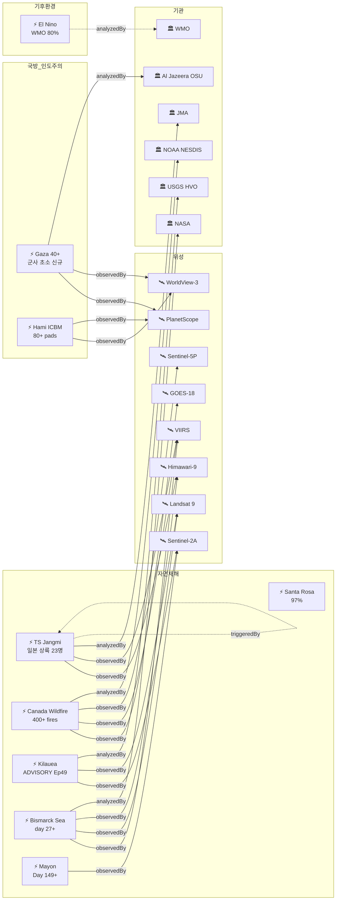

# 2026-06-04 위성영상 관측 이벤트 OSINT 일일 보고서

## 요약

신규 1건, 업데이트 18건. **이스라엘 가자지구 40+ 군사 초소 건설**(신규) -- Al Jazeera Open Source Unit이 PlanetScope+WorldView 위성영상을 분석, 2025년 10월 휴전 이후 8개 기지를 새로 건설한 사실을 확인. **열대폭풍 Jangmi 일본 본토 상륙** -- 6/3 와카야마현 상륙, 23명 부상, 57가옥 파손, 900편 항공 취소, 도쿄 사상 최초 Level 4 위험 경보. cascading_disaster(홍수/산사태) 확정. **캐나다 산불 400+ 화재** -- 27,000+ 대피, 미국 미네소타 AQ "very unhealthy" 도달, 5위성 3기관 모니터링. **Kilauea ADVISORY/YELLOW 하향** -- Ep48 종료, Ep49 10-15일 내 예보. **Bismarck Sea day 27+** -- 분출 감소 추세이나 수중음향으로 지속 확인. **El Nino WMO 공식 80%** -- Jun-Aug El Nino 80%, 2026 허리케인 시즌 개막일(6/1) 제로 활동으로 억제 신호. 다중 위성 교차검증 **5건**(신규 1건: Gaza). 한반도 GeoFocus 5건 유지(변동 없음). 농업·해양 카테고리 금일 신규 없음.

## 오늘의 핵심 (Top 5)

| 순위 | 이벤트 | 도메인 | 위성 | 지역 | 신뢰도 |
|------|--------|--------|------|------|--------|
| 1 | TS Jangmi 일본 본토 상륙 -- 23명 부상, Level 4 최초 | Disaster | Himawari-9 | Japan | 0.90 |
| 2 | 캐나다 산불 400+ -- 27K+ 대피, AQ very unhealthy | Disaster | GOES-18 + VIIRS + TROPOMI + OMPS + EarthCare | MB/AB/SK, CA | 0.95 |
| 3 | 이스라엘 가자 40+ 군사 초소 [신규] | Defense + Humanitarian | PlanetScope + WorldView-3 | Gaza, PS | 0.95 |
| 4 | Bismarck Sea 해저 화산 day 27+ -- 분출 감소 | Disaster | VIIRS + MODIS + Landsat 9 + Himawari-9 + S-2A | PNG | 0.95 |
| 5 | El Nino WMO 80% -- 허리케인 억제 신호 | Climate | SST buoys / altimetry | Equatorial Pacific | 0.90 |

## 다중 위성 교차검증 이벤트

**5건**(전일 대비 **+1건**: Gaza 40+ 군사 초소 신규).

1. **Bismarck Sea 해저 화산** -- VIIRS + MODIS Terra + Landsat 9 + Himawari-9 + Sentinel-2A. **5위성 3기관** 유지. multiSatBoost +0.20. **최종 신뢰도 0.95**.
2. **캐나다 Manitoba/Alberta 산불 연기** -- GOES-18 + VIIRS + Sentinel-5P TROPOMI + OMPS + EarthCare. **5위성 3기관** 유지. multiSatBoost +0.20. **최종 신뢰도 0.95**.
3. **Kharg Island 원유 유출** -- Sentinel-1 (SAR) + Sentinel-2 (MSI) + Sentinel-3 (OLCI). **3위성 3센서** 유지. multiSatBoost +0.20 + sarBoost +0.10. **최종 신뢰도 0.90**.
4. **중국 Hami ICBM 방어 네트워크** -- WorldView-3 + PlanetScope. **2위성 2기관** 유지. multiSatBoost +0.20 + hiResBoost +0.15. **최종 신뢰도 0.95**.
5. **이스라엘 가자 40+ 군사 초소** [신규] -- PlanetScope (Planet Labs) + WorldView-3 (Maxar/Vantor). **2위성 2기관**. multiSatBoost +0.20 + hiResBoost +0.15 + baCredibilityBoost +0.10. **최종 신뢰도 0.95** (cap).

## 한반도 GeoFocus

보고됨 4건 + 미검증 1건 = 총 5건. **금일 변동 없음 -- 추적 지속.**

추적 지속 항목:
- **DPRK 최현급 구축함 서해 항해 + 남포 3번째 건조** -- WorldView-3 (Vantor), NK Pro/뉴시스
- **DPRK 구축함 2번함 Chongjin 건조 사고** -- Daily NK/Vantor
- **압록강 신교량 세관시설 건설** -- 38 North, WorldView-3
- **두만강 북-러 교량 완공 임박** -- 38 North/RFA, PlanetScope, 6/19 개통 목표
- **DPRK 서해 발사체 5/26** -- 미검증 (하단 "미검증 의혹" 섹션 참조)

## 자연재해 (Disaster)

### 1. 열대폭풍 Jangmi(장미) -- 일본 본토 상륙 완료, 23명 부상, 도쿄 Level 4 최초

- **출처:** [Japan Times](https://www.japantimes.co.jp/news/2026/06/03/japan/tropical-storm-jangmi-landfall/) / [IBTimes](https://www.ibtimes.sg/typhoon-jangmi-injures-23-after-making-landfall-japan-triggering-flood-landslide-warnings-87368) / [News On Japan](https://newsonjapan.com/article/149481.php) / [NASA EO](https://science.nasa.gov/earth/earth-observatory/typhoon-jangmi/)
- **위성·센서:** Himawari-9 (AHI), VIIRS (Suomi-NPP/NOAA-20 야간 영상)
- **관측일:** 2026-06-03 ~ 06-04
- **위치:** Japan Pacific Coast -- Wakayama -> Mie -> Kanto (33~36N, 130~140E)
- **현상:** typhoon -> cascading_disaster (flood + landslide)
- **상태:** 업데이트 -- 본토 상륙 완료, 6/4 태평양 이동
- **분석:** **6/3 04:30 와카야마현 상륙.** 태평양 연안을 따라 북동 이동. **23명 부상, 57가옥 파손, 900편 항공 취소.** 미에현 -- **한달치 강우량이 하루만에** 기록. 가와사키 사이와이구 도로 30cm 침수. **도쿄 사상 최초 Level 4 위험 경보 발령.** NASA EO Image of the Day(6/3)에 VIIRS 야간 태풍 위성영상 게재. 6/4 태평양으로 이동, 교통 복구 중. **cascading_disaster 확정** -- 홍수·산사태 경보. priorityBoost +0.20 (인명피해). officialBoost +0.15 (JMA).

### 2. 캐나다 산불 -- 400+ 화재, 27,000+ 대피, AQ "very unhealthy"

- **출처:** [PBS](https://www.pbs.org/newshour/health/canadian-wildfire-smoke-causes-very-unhealthy-conditions-in-u-s-midwest-even-reaches-europe) / [NOAA NESDIS](https://www.nesdis.noaa.gov/news/noaa-satellites-monitor-canadian-wildfires-and-smoke) / [NOAA Smoke](https://www.nesdis.noaa.gov/news/smoke-canadian-wildfires-blankets-us)
- **위성·센서:** GOES-18 (ABI) + VIIRS (Suomi-NPP/JPSS) + Sentinel-5P (TROPOMI) + OMPS (Suomi-NPP) + EarthCare (ATLID)
- **관측일:** 2026-06-04
- **위치:** Manitoba / Alberta / Saskatchewan, Canada (53.97N, 97.84W)
- **현상:** wildfire + humanitarian (교차 도메인)
- **상태:** 업데이트 -- AQ 확산
- **분석:** **400+ 화재 활성** (전일 65+ → 추정 상향). **27,000+ 대피**: Manitoba 17,000+(Flin Flon 5,000), Saskatchewan(La Ronge 2,500+), Alberta. **미국 미네소타 AQ "very unhealthy", 미시간 "unhealthy"** (6/3-4). 연기 유럽까지 확산. NOAA NESDIS 공식 위성 모니터링 **열 시그니처 + 연기 추적** 상세 보고 지속. **6-8월 above-normal temps 예보 -- BC 최고 화재 위험.** **5위성 3기관 multiSatBoost +0.20 유지.** officialBoost +0.15 (NOAA). priorityBoost +0.20.

### 3. Kilauea -- ADVISORY/YELLOW 하향, Ep49 10-15일 예보

- **출처:** [USGS HVO](https://www.usgs.gov/volcanoes/kilauea/volcano-updates)
- **위성·센서:** Sentinel-2A (MSI), Landsat 9 (OLI/TIRS)
- **관측일:** 2026-06-04
- **위치:** Halema'uma'u, Kilauea, Hawaii, US (19.42N, 155.29W)
- **현상:** volcanic_eruption (paused)
- **상태:** 업데이트 -- WATCH/ORANGE → **ADVISORY/YELLOW 하향**
- **분석:** **Ep48 6/1 종료 후 ADVISORY/YELLOW로 하향.** 재팽창(reinflation) 진행 중이나 더 많은 틸트미터 데이터 필요. **Ep49 예보: 10-15일 후 (≈6/13-18).** 역대 최다 에피소드 기록(48회) 유지. officialBoost +0.15 (USGS HVO).

### 4. Bismarck Sea 해저 화산 -- day 27+, 분출 감소

- **출처:** [GEOMAR](https://www.geomar.de/en/news/article/possible-eruption-of-an-underwater-volcano-in-the-bismarck-sea) / [NASA EO](https://science.nasa.gov/earth/earth-observatory/new-eruption-in-the-bismarck-sea/)
- **위성·센서:** VIIRS + MODIS Terra + Landsat 9 (OLI) + Himawari-9 (AHI) + Sentinel-2A (MSI)
- **관측일:** 2026-06-04 (분출 day 27+)
- **위치:** Central Bismarck Sea, Papua New Guinea (3.03S, 147.78E)
- **현상:** volcanic_eruption (submarine)
- **상태:** 업데이트 -- 분출 감소
- **분석:** **Rabaul Volcano Observatory: 5/21-28 분출 감소.** 그러나 수중음향(hydroacoustic) 데이터로 분출 지속 확인. 부석 뗏목 70km2 유지. **GEOMAR(독일 해양연구센터) 분석 참가.** "Titan Ridge" 명명. **5위성 3기관 multiSatBoost +0.20 유지** -- 최고 신뢰도 0.95. 신규 섬 형성 가능성 모니터링 지속.

### 5. Mayon -- Day 149+, AL3, 287,000+ 이재민

- **출처:** [ReliefWeb GLIDE](https://reliefweb.int/disaster/vo-2026-000065-phl)
- **위성·센서:** Sentinel-2A (MSI), Himawari-9 (AHI)
- **관측일:** 2026-06-04
- **위치:** Mayon Volcano, Albay Province, Philippines (13.26N, 123.69E)
- **현상:** volcanic_eruption (Strombolian + PDC)
- **상태:** 업데이트 -- 변동 미미
- **분석:** **Day 149+ 지속.** PHIVOLCS AL3. **287,000+ 이재민.** SO2 평균 2,466 t/d. 우기 + Jangmi habagat → **라하르 위험** 지속. officialBoost +0.15.

### 6. Great Sitkin -- WATCH/ORANGE, 용암 돔 지속

- **출처:** [USGS AVO](https://avo.alaska.edu/volcano/great-sitkin)
- **위성·센서:** Sentinel-1 (C-SAR)
- **관측일:** 2026-06-04
- **위치:** Great Sitkin, Aleutian Islands, US (52.08N, 176.13W)
- **현상:** volcanic_eruption (lava dome)
- **상태:** 추적 지속

### 7. Shishaldin -- ADVISORY/YELLOW, SO2 지속

- **출처:** [USGS AVO](https://avo.alaska.edu/volcano/shishaldin)
- **위성·센서:** Sentinel-5P (TROPOMI SO2)
- **관측일:** 2026-06-04
- **위치:** Shishaldin, Aleutian Islands, US (54.76N, 163.97W)
- **현상:** volcanic_eruption (unrest)
- **상태:** 추적 지속

### 8. Kanlaon -- AL2, SO2 491-1788 t/d

- **출처:** [Smithsonian GVP](https://volcano.si.edu/volcano.cfm?vn=272020)
- **위성·센서:** Himawari-9 (AHI)
- **관측일:** 2026-06-04
- **위치:** Kanlaon, Negros Island, Philippines (10.41N, 123.13E)
- **현상:** volcanic_eruption
- **상태:** 추적 지속 -- SO2 변동 (491-1,788 t/d), 6-33 daily VQs

### 9. Sangay/Reventador -- 분출 지속

- **출처:** [Smithsonian GVP](https://volcano.si.edu/reports_weekly.cfm)
- **위성·센서:** GOES-19 (ABI)
- **관측일:** 2026-06-04
- **위치:** Sangay (-2.00, -78.34) / Reventador (-0.08, -77.66), Ecuador
- **현상:** volcanic_eruption
- **상태:** 추적 지속

### 10. Santa Rosa Island fire -- 97% 진압, 6/6 종결

- **출처:** [InciWeb](https://inciweb.wildfire.gov/incident-information/cacnp-santa-rosa-island-fire)
- **위성·센서:** Landsat 9 (OLI false-color)
- **관측일:** 2026-06-04
- **위치:** Santa Rosa Island, Channel Islands NP, California, US (33.97N, 120.10W)
- **현상:** wildfire (contained)
- **상태:** 업데이트 -- 97%, 6/6 종결 예정

## 인간활동 (Human Activity)

### 1. 이스라엘 가자지구 40+ 군사 초소 건설 [신규]

- **출처:** [Al Jazeera](https://www.aljazeera.com/news/2026/6/3/israel-is-building-more-military-posts-in-gaza-satellite-imagery-shows)
- **위성·센서:** PlanetScope (Planet Labs, 3m), WorldView-3 (Maxar/Vantor, 0.31m)
- **관측일:** 2026-05 (분석 발표 2026-06-03)
- **위치:** Gaza Strip, Palestine (31.4N, 34.4E)
- **현상:** military_buildup + infrastructure_damage (cross-domain: Defense + Humanitarian)
- **상태:** 신규
- **분석:** Al Jazeera Open Source Unit이 2026년 5월까지의 위성영상을 분석. **40개 군사 초소** 식별. 핵심: **8개 기지를 2025년 10월 휴전 이후 새로 건설.** 1개는 현재도 건설 중. 북부 2건, 중부 2건, Netzarim Corridor 동측 1건, 남부 Khan Younis 3건. **Khan Younis 동부 묘지** 위에 차량 배치 및 병사 숙소 건설. 가자시 동측 초소 **면적 70% 확장** (2025.10 → 2026.05). 장갑차 배치, 요새화 강화. **before/after 영상 가용.** multiSatBoost +0.20 (PlanetScope + WorldView-3). hiResBoost +0.15 (WorldView-3 ≤0.31m). baCredibilityBoost +0.10. analystBoost +0.10 (Al Jazeera OSINT). **최종 신뢰도 0.95** (cap).

추적 지속:
- **남중국해 Antelope Reef 15km2 매립** -- CSIS AMTI ([CSIS AMTI](https://amti.csis.org/antelope-reef-could-now-be-the-largest-island-in-the-south-china-sea/))
- **필리핀 Thitu 활주로 + Nanshan 항만** -- Planet Labs ([RFA](https://www.rfa.org/english/southchinasea/2026/05/08/philippines-satellite-spratlys-infrastructure-upgrade/))

## 기후·환경 (Climate & Environment)

### 1. El Nino -- WMO 공식 80% Jun-Aug, 허리케인 억제

- **출처:** [WMO](https://wmo.int/news/media-centre/wmo-prepare-el-nino)
- **위성·센서:** SST buoys, altimetry (Jason-3/Sentinel-6), TROPOMI
- **관측일:** 2026-06-04
- **위치:** Equatorial Pacific (0.0, -170.0)
- **현상:** sea_level_change (ENSO)
- **상태:** 업데이트 -- WMO 공식 발표
- **분석:** WMO 공식 업데이트: **80% Jun-Aug El Nino, 90%+ through Nov.** 2026 대서양 허리케인 시즌 6/1 개막 -- **제로 활동.** 위성영상에서 건조 공기 + 적대적 상층 풍 확인 -- 교과서적 El Nino 억제 패턴. CPC "Super El Nino single most likely outcome" 유지. ECMWF 100%. **SST NINO3.4 +0.9도C → +3도C 전망.** officialBoost +0.15 (WMO).

### 2. 북극 해빙 -- 추적 지속

- **출처:** [NASA](https://science.nasa.gov/earth/arctic-winter-sea-ice-2026/)
- **상태:** 추적 지속 (5.52M sq miles 역대 최저 타이, 전일 신규)

## 농업·해양 (Agriculture & Maritime)

**금일 위성영상 관측 신규 이벤트 없음.** El Nino 발달에 따른 전 지구 농업·해양 영향은 향후 모니터링 강화 예정. CAS500-4(광대역 120km, 농업·산림 전용) 운영 중으로 한반도 작황 모니터링 데이터 축적 중.

## 국방·안보 (Defense -- OSINT 한정)

### 1. 중국 Hami ICBM 방어 네트워크 -- Reuters/NBC 상세 보도

- **출처:** [NBC News](https://www.nbcnews.com/world/asia/china-building-launch-pads-nuclear-missile-silos-satellite-images-show-rcna347503) / [The Defense Post](https://thedefensepost.com/2026/06/01/china-nuclear-desert-network/amp/)
- **위성·센서:** WorldView-3 (Maxar/Vantor, 0.31m) + PlanetScope (Planet Labs, 3m)
- **관측일:** 2026-06-01 (분석 발표)
- **위치:** Hami, Xinjiang, China (42.8N, 93.5E)
- **현상:** military_buildup
- **상태:** 업데이트 -- Reuters/NBC 추가 상세
- **분석:** Reuters 위성영상 + 3명 독립 보안 분석가 평가. **80+ 콘크리트 발사 패드, 최소 2개 대형 옥타곤 설비, 장갑 벙커, 광섬유 연결 C3 노드.** 수천 km2 사막 지대. 옥타곤 설비: 인력 숙소 + 대형 군용차량. Hami ICBM 사일로 필드에서 140km / 230km 남서. Carnegie Endowment Tong Zhao: "C3 + 핵 작전 유지보수 + 저장 시설 가능성." **핵 보유국 중 전례 없는 규모.** multiSatBoost +0.20 + hiResBoost +0.15. **최종 신뢰도 0.95.**

### 2. 이스라엘 가자 40+ 군사 초소 (상기 인간활동 섹션 참조)

추적 지속:
- **DPRK 구축함 건조** -- WorldView-3/Vantor ([Daily NK](https://www.dailynk.com/english/satellite-analysis-north-koreas-5000-ton-destroyer-fleet-in-construction-but-short-on-combat-readiness/))
- **영변 핵단지 활동** -- ([RFA](https://www.rfa.org/english/korea/2026/04/28/north-korea-satellite-yongbyon-nuclear/))

## 인도주의 (Humanitarian)

### 1. 이스라엘 가자 군사 초소 (상기 인간활동 섹션 -- cross-domain)

Al Jazeera 분석에 따르면 이스라엘군은 2025년 10월 휴전 이후 철수 대신 **영구적 요새화 군사 초소를 건설** 중. Khan Younis 동부 묘지 위 기지 건설은 인도주의적 함의 내포.

추적 지속:
- **Gaza UNOSAT 피해 평가** -- 197,000+ 건물, Sentinel-1 SAR ([UNOSAT](https://unosat.org/products/4130))
- **Bellingcat 남레바논 46+ 마을** -- PlanetScope ([Bellingcat](https://www.bellingcat.com/news/2026/05/14/satellite-imagery-shows-ongoing-demolitions-across-southern-lebanon/))

## 센서·플랫폼별 묶음

| 센서/플랫폼 | 관측 이벤트 |
|-------------|------------|
| Himawari-9 (AHI) | TS Jangmi, Bismarck Sea, Mayon, Kanlaon, Sangay, Bezymianny, Dukono |
| VIIRS (Suomi-NPP/JPSS) | TS Jangmi 야간, Bismarck Sea, Canada wildfire |
| GOES-18/19 (ABI) | Canada wildfire, Sangay/Reventador |
| Sentinel-5P (TROPOMI) | Canada wildfire 연기, Shishaldin SO2, El Nino 대기 |
| Sentinel-2A (MSI) | Bismarck Sea, Kilauea, Mayon |
| Sentinel-1 (C-SAR) | Great Sitkin lava dome, Gaza InSAR |
| Landsat 9 (OLI/TIRS) | Bismarck Sea, Kilauea, Santa Rosa burn scar |
| MODIS (Terra) | Bismarck Sea |
| ICESat-2 (ATLAS) | Arctic sea ice |
| WorldView-3 (Vantor) | Gaza 40+ 초소, Hami ICBM, DPRK 구축함 |
| PlanetScope (Planet) | Gaza 40+ 초소, Hami ICBM, Bellingcat Lebanon, Thitu/Nanshan |

## 전후 비교(before/after) 영상 보유 이벤트

| 이벤트 | 위성 | 전후 비교 |
|--------|------|----------|
| 이스라엘 가자 40+ 군사 초소 [신규] | PlanetScope + WorldView-3 | 2025.10 휴전 전 vs 2026.05 현재 (8개 신규 기지) |
| Gaza 피해 평가 | Sentinel-1 SAR | UNOSAT 전쟁 전 vs 현재 InSAR 변화탐지 |
| Bellingcat 남레바논 | PlanetScope | 2026.03~05 interactive before/after map |
| Santa Rosa Island fire | Landsat 9 OLI false-color | NASA EO burn scar |

## 미검증 의혹 (위성 출처 미확인)

- **DPRK 서해 미상 발사체 5/26** -- 합참 발표, 올해 8번째. 위성영상 미확인. 좌표: 38.5N/124.5E (추정). 신뢰도 0.45. 위성 확인 시 국방 섹션으로 승격 예정.

## 지식그래프 시각화

### 오늘의 주요 관계

- **신규**: temp-evt-2401(Gaza 군사 초소) -- observedBy --> PlanetScope + WorldView-3, manifests --> military_buildup, inDomain --> dom-defense + dom-humanitarian
- **cascading_disaster 확정**: temp-evt-2001(Jangmi) -- triggeredBy --> flood/landslide (일본 본토, 23명 부상)
- **partOfSeries 지속**: evt-202 Kilauea Ep48→Ep49, evt-701 Bismarck Sea day 27+, evt-1101 Canada wildfire
- **multi_satellite_confirmation 5건**: Bismarck Sea(5), Canada(5), Kharg(3), Hami(2), Gaza(2, 신규)

### 전체 지식그래프 시각화

## 온톨로지 변경

| 변경 유형 | 대상 | 근거 |
|----------|------|------|
| 신규 엔티티 없음 | -- | 기존 클래스·관계·인스턴스로 충분 |
| 스키마 변경 없음 | -- | 모든 이벤트가 기존 분류 체계에 매핑 |

## 추론 결과

| 추론 | 신뢰도 | 근거 |
|------|--------|------|
| cascading_disaster: Jangmi → flood/landslide JP | 0.85 | 와카야마 상륙 → 미에 한달치 강우, 가와사키 30cm 침수, 도쿄 Level 4 |
| multi_satellite_confirmation: Gaza 40+ 초소 | 0.95 | PlanetScope (Planet) + WorldView-3 (Vantor), 2위성 2기관 |
| temporal_progression: Kilauea Ep48→Ep49 | 0.90 | 동일 위치, 동일 현상, 10-15일 후 예보 |
| temporal_progression: Bismarck Sea day 27+ | 0.90 | 분출 감소이나 수중음향 지속 |
| temporal_progression: Canada wildfire | 0.95 | 400+ fires, AQ "very unhealthy" 미국 확산 |
| sensor_capability: Himawari-9 AHI + Jangmi | 0.90 | GEO 위성 연속 관측으로 상륙 전 과정 추적 |
| sensor_capability: TROPOMI + Canada 연기 | 0.90 | 미량가스 센서로 연기 성분(SO2/NO2/aerosol) 정밀 추적 |
| hiRes_capability: WV-3 + Gaza 초소 | 0.95 | 0.31m 해상도로 차량·구조물 개별 식별 |
| official_source_trust: WMO El Nino | 0.90 | 국제기구 공식 예보 +0.15 |

## 분석 및 평가

**자연재해 집중 사이클.** TS Jangmi의 일본 본토 상륙으로 cascading_disaster가 확정되었다. 도쿄 사상 최초 Level 4 위험 경보는 기후 변화에 따른 태풍 강도·경로 변화의 신호로 주목. 캐나다 산불은 400+ 화재로 확대되며 미국 중서부 AQ에 직접적 영향을 미치고 있고, 유럽까지 연기가 확산 중이다.

**화산 동시 모니터링.** Kilauea의 ADVISORY 하향은 일시적이며, Ep49가 10-15일 내 예상된다. Bismarck Sea는 분출 감소 추세이나 수중음향으로 활동 지속이 확인되어 신규 섬 형성 가능성은 여전히 열려 있다. 전 세계 동시 활성 화산 10+ 건은 2026년 상반기 특징적 패턴이다.

**국방·인도주의 교차 도메인.** 이스라엘의 가자 40+ 군사 초소 건설은 2025년 10월 휴전 합의와 정면 배치되는 위성 증거다. PlanetScope+WorldView-3 다중 위성 교차검증으로 신뢰도가 높다. 중국 Hami ICBM 방어 네트워크의 Reuters 상세 보도는 핵 억지력 전략 변화를 시사한다.

**El Nino 억제 신호.** 2026 허리케인 시즌 개막일에 제로 활동은 강력한 El Nino 억제 패턴을 보여주며, 하반기 Super El Nino(+3도C)로의 발전이 농업·해양·재해 모든 도메인에 교차 영향을 줄 전망이다.

## 추적 항목

| 항목 | 최초 보고 | 상태 | 최신 업데이트 |
|------|----------|------|-------------|
| Kilauea 분출 시리즈 | 2026-04-30 | Ep49 예보 10-15일 | ADVISORY/YELLOW 하향 |
| Bismarck Sea 해저 화산 | 2026-05-13 | day 27+ 분출 감소 | 수중음향 지속, 신규 섬 가능 |
| Canada wildfire | 2026-05-19 | 400+ fires, 27K+ 대피 | AQ very unhealthy 미국 |
| Mayon 화산 | 2026-05-01 | Day 149+, AL3 | 287K+ 이재민 |
| El Nino 2026 | 2026-05-30 | WMO 80% Jun-Aug | 허리케인 억제 확인 |
| TS Jangmi | 2026-05-31 | 일본 본토 상륙 완료 | 6/4 태평양 이동, 추적 종결 임박 |
| Hami ICBM | 2026-05-31 | Reuters 상세 보도 | 80+ pads, C3 인프라 |
| Gaza 40+ 초소 [신규] | 2026-06-04 | 신규 | 8개 기지 휴전 후 건설 |
| DPRK 구축함 | 2026-05-31 | 3번함 10월 목표 | 변동 없음 |
| 압록강/두만강 교량 | 2026-05-27 | 건설 진행 | 6/19 개통 목표 |
| Santa Rosa fire | 2026-05-21 | 97% contained | 6/6 종결 예정 |
| Gaza UNOSAT | 2026-06-02 | 197K 건물 | 추적 지속 |
| Bellingcat Lebanon | 2026-05-14 | 46+ towns | 추적 지속 |

## NASA EO Image of the Day

- **6/3:** "Typhoon Jangmi" -- VIIRS (NOAA-20) 야간 태풍 위성영상, 일본 접근
- **6/2:** "Fire's Footprint on Santa Rosa Island" -- Landsat 9 OLI false-color burn scar

## 출처 목록

1. [Al Jazeera -- Israel building military posts in Gaza](https://www.aljazeera.com/news/2026/6/3/israel-is-building-more-military-posts-in-gaza-satellite-imagery-shows)
2. [NASA EO -- Typhoon Jangmi](https://science.nasa.gov/earth/earth-observatory/typhoon-jangmi/)
3. [Japan Times -- TS Jangmi landfall](https://www.japantimes.co.jp/news/2026/06/03/japan/tropical-storm-jangmi-landfall/)
4. [IBTimes -- Jangmi 23 injured](https://www.ibtimes.sg/typhoon-jangmi-injures-23-after-making-landfall-japan-triggering-flood-landslide-warnings-87368)
5. [News On Japan -- Jangmi destruction](https://newsonjapan.com/article/149481.php)
6. [PBS -- Canada wildfire smoke very unhealthy](https://www.pbs.org/newshour/health/canadian-wildfire-smoke-causes-very-unhealthy-conditions-in-u-s-midwest-even-reaches-europe)
7. [NOAA NESDIS -- Canadian wildfires monitoring](https://www.nesdis.noaa.gov/news/noaa-satellites-monitor-canadian-wildfires-and-smoke)
8. [NOAA NESDIS -- Smoke blankets US](https://www.nesdis.noaa.gov/news/smoke-canadian-wildfires-blankets-us)
9. [USGS HVO -- Kilauea updates](https://www.usgs.gov/volcanoes/kilauea/volcano-updates)
10. [GEOMAR -- Bismarck Sea](https://www.geomar.de/en/news/article/possible-eruption-of-an-underwater-volcano-in-the-bismarck-sea)
11. [WMO -- El Nino](https://wmo.int/news/media-centre/wmo-prepare-el-nino)
12. [NBC News -- Hami ICBM](https://www.nbcnews.com/world/asia/china-building-launch-pads-nuclear-missile-silos-satellite-images-show-rcna347503)
13. [The Defense Post -- China nuclear network](https://thedefensepost.com/2026/06/01/china-nuclear-desert-network/amp/)
14. [ReliefWeb -- Mayon](https://reliefweb.int/disaster/vo-2026-000065-phl)
15. [USGS AVO -- Great Sitkin](https://avo.alaska.edu/volcano/great-sitkin)
16. [USGS AVO -- Shishaldin](https://avo.alaska.edu/volcano/shishaldin)
17. [Smithsonian GVP -- Kanlaon](https://volcano.si.edu/volcano.cfm?vn=272020)
18. [Smithsonian GVP -- Weekly Reports](https://volcano.si.edu/reports_weekly.cfm)
19. [InciWeb -- Santa Rosa](https://inciweb.wildfire.gov/incident-information/cacnp-santa-rosa-island-fire)
20. [CSIS AMTI -- Antelope Reef](https://amti.csis.org/antelope-reef-could-now-be-the-largest-island-in-the-south-china-sea/)
21. [RFA -- Philippines Spratlys](https://www.rfa.org/english/southchinasea/2026/05/08/philippines-satellite-spratlys-infrastructure-upgrade/)
22. [Daily NK -- DPRK Destroyer](https://www.dailynk.com/english/satellite-analysis-north-koreas-5000-ton-destroyer-fleet-in-construction-but-short-on-combat-readiness/)
23. [RFA -- Yongbyon](https://www.rfa.org/english/korea/2026/04/28/north-korea-satellite-yongbyon-nuclear/)
24. [UNOSAT -- Gaza](https://unosat.org/products/4130)
25. [Bellingcat -- Lebanon](https://www.bellingcat.com/news/2026/05/14/satellite-imagery-shows-ongoing-demolitions-across-southern-lebanon/)
26. [ESA -- Sentinel methane](https://www.esa.int/Applications/Observing_the_Earth/Copernicus/Trio_of_Sentinel_satellites_map_methane_super-emitters)
