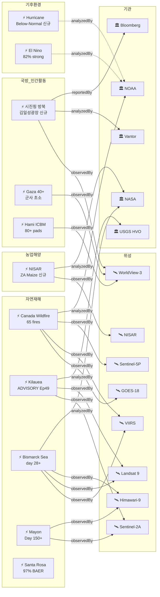

# 2026-06-05 위성영상 관측 이벤트 OSINT 일일 보고서

## 요약

신규 5건, 업데이트 14건. **시진핑 방북 준비 위성 포착**(신규) -- Vantor(구 Maxar Intelligence) WorldView-3 영상(5/30)에서 평양 김일성광장 리뷰스탠드 건설 + 순안국제공항 고려항공 8대 재배치 확인, 서울 당국 6/11 방문 유력 판단(조중우호조약 65주년). **NASA EO NISAR 남아프리카 옥수수 삼각지대**(신규) -- NISAR L-band SAR로 Vet River 일대 2025-26 작기 식생 변화 시각화, 농업·해양 카테고리 첫 위성 직접 관측 이벤트. **Sentinel-1D SAR 데이터 품질 저하**(신규) -- 5/29-6/1 내부 시계 손상으로 SAR 데이터 품질 저하, 복구 완료. **Sentinel-1 콘스텔레이션 재구성**(신규) -- 6월 말 S-1C 2주 기동(비취득), S-1A 퇴역, 7월부터 S-1C+S-1D 신규 체제. **NOAA 2026 대서양 허리케인 시즌 below-normal**(신규) -- 8-14 명명 폭풍, El Nino 억제 55% 확률. 다중 위성 교차검증 **5건** 유지. 한반도 GeoFocus **6건**(신규 1건: 시진핑 방북 준비).

## 오늘의 핵심 (Top 5)

| 순위 | 이벤트 | 도메인 | 위성 | 지역 | 신뢰도 |
|------|--------|--------|------|------|--------|
| 1 | 시진핑 방북 준비 -- 김일성광장 건설+순안공항 정비 [신규] | Defense | WorldView-3 (Vantor) | Pyongyang, KP | 0.90 |
| 2 | 캐나다 산불 -- 65건 활성, 18,935ha, AQ 지속 | Disaster | GOES-18 + VIIRS + TROPOMI + OMPS + EarthCare | MB/AB/SK, CA | 0.95 |
| 3 | NASA EO NISAR 남아프리카 옥수수 삼각지대 [신규] | Agriculture | NISAR (L-band SAR) | Free State, ZA | 0.90 |
| 4 | Bismarck Sea 해저 화산 day 28+ -- 분출 감소 | Disaster | VIIRS + MODIS + Landsat 9 + Himawari-9 + S-2A | PNG | 0.95 |
| 5 | Sentinel-1 콘스텔레이션 재구성 [신규] | SatOps | Sentinel-1A/C/D | Global | 0.95 |

## 다중 위성 교차검증 이벤트

**5건** 유지(전일 대비 변동 없음).

1. **Bismarck Sea 해저 화산** -- VIIRS + MODIS Terra + Landsat 9 + Himawari-9 + Sentinel-2A. **5위성 3기관** 유지. multiSatBoost +0.20. **최종 신뢰도 0.95**.
2. **캐나다 Manitoba/Alberta 산불 연기** -- GOES-18 + VIIRS + Sentinel-5P TROPOMI + OMPS + EarthCare. **5위성 3기관** 유지. multiSatBoost +0.20. **최종 신뢰도 0.95**.
3. **Kharg Island 원유 유출** -- Sentinel-1 (SAR) + Sentinel-2 (MSI) + Sentinel-3 (OLCI). **3위성 3센서** 유지. multiSatBoost +0.20 + sarBoost +0.10. **최종 신뢰도 0.90**.
4. **중국 Hami ICBM 방어 네트워크** -- WorldView-3 + PlanetScope. **2위성 2기관** 유지. multiSatBoost +0.20 + hiResBoost +0.15. **최종 신뢰도 0.95**.
5. **이스라엘 가자 40+ 군사 초소** -- PlanetScope + WorldView-3. **2위성 2기관** 유지. multiSatBoost +0.20 + hiResBoost +0.15 + baCredibilityBoost +0.10. **최종 신뢰도 0.95** (cap).

## 한반도 GeoFocus

보고됨 5건 + 신규 1건 = 총 **6건**(전일 대비 **+1건**).

**신규:**
- **시진핑 방북 준비** -- WorldView-3 (Vantor) 5/30 영상에서 김일성광장 리뷰스탠드 건설 + 순안공항 항공기 재배치 확인. 6/11 방문 유력. hiResBoost +0.15, koreaBoost +0.10.

**추적 지속:**
- **DPRK 최현급 구축함 서해 항해 + 남포 3번째 건조** -- WorldView-3 (Vantor), NK Pro/뉴시스
- **DPRK 구축함 2번함 Chongjin 건조 사고** -- Daily NK/Vantor
- **압록강 신교량 세관시설 건설** -- 38 North, WorldView-3
- **두만강 북-러 교량 완공 임박** -- 38 North/RFA, PlanetScope, 6/19 개통 목표
- **DPRK 서해 발사체 5/26** -- 미검증 (하단 "미검증 의혹" 섹션 참조)

## 자연재해 (Disaster)

### 1. 캐나다 산불 -- 65건 활성, 18,935ha 소실, 6건 통제불능

- **출처:** [CWFIS](https://cwfis.cfs.nrcan.gc.ca/report) / [NOAA NESDIS](https://www.nesdis.noaa.gov/news/noaa-satellites-monitor-canadian-wildfires-and-smoke) / [NASA EO](https://science.nasa.gov/earth/earth-observatory/widespread-smoke-from-canadian-fires-154641/)
- **위성·센서:** GOES-18 (ABI) + VIIRS (Suomi-NPP/JPSS) + Sentinel-5P (TROPOMI) + OMPS (Suomi-NPP) + EarthCare (ATLID)
- **관측일:** 2026-06-05
- **위치:** Manitoba / Alberta / Saskatchewan, Canada (53.97N, 97.84W)
- **현상:** wildfire + air_pollution (교차 도메인)
- **상태:** 업데이트 -- CWFIS 최신 데이터 반영
- **분석:** CWFIS 기준 **65건 활성 화재, 6건 통제불능, 18,935 ha 소실.** 전일 보도의 "400+" 추정치에서 공식 집계 반영으로 수정. 그러나 **6-8월 above-normal 기온 예보 + 서부 가뭄 지속**으로 BC 최고 화재 위험. 3년 연속 심각한 시즌 우려. NOAA NESDIS 위성 열 시그니처 + 연기 추적 지속. **5위성 3기관 multiSatBoost +0.20 유지.** officialBoost +0.15 (NOAA).

### 2. Kilauea -- ADVISORY/YELLOW, Ep49 10-15일 예보

- **출처:** [USGS HVO](https://www.usgs.gov/volcanoes/kilauea/volcano-updates)
- **위성·센서:** Sentinel-2A (MSI), Landsat 9 (OLI/TIRS)
- **관측일:** 2026-06-05
- **위치:** Halema'uma'u, Kilauea, Hawaii, US (19.42N, 155.29W)
- **현상:** volcanic_eruption (paused)
- **상태:** 업데이트 -- 변동 미미
- **분석:** **Ep48 6/1 종료 후 ADVISORY/YELLOW 유지.** 재팽창(reinflation) 진행, deflation-inflation 전환 지속. **Ep49 예보: 10-15일 후 (≈6/13-18).** 역대 최다 분수분출 에피소드(48회) 기록 유지. officialBoost +0.15 (USGS HVO).

### 3. Bismarck Sea 해저 화산 -- day 28+, 분출 감소 지속

- **출처:** [Smithsonian GVP](https://volcano.si.edu/volcano.cfm?vn=250030) / [NASA EO](https://science.nasa.gov/earth/earth-observatory/new-eruption-in-the-bismarck-sea/)
- **위성·센서:** VIIRS + MODIS Terra + Landsat 9 (OLI) + Himawari-9 (AHI) + Sentinel-2A (MSI)
- **관측일:** 2026-06-05 (분출 day 28+)
- **위치:** Central Bismarck Sea / Titan Ridge, Papua New Guinea (3.03S, 147.78E)
- **현상:** volcanic_eruption (submarine)
- **상태:** 업데이트 -- 분출 감소 지속
- **분석:** **Rabaul Volcano Observatory: 5/21-28 분출 감소** 확인. 수중음향(hydroacoustic)으로 활동 지속. **부석 뗏목 70km² 유지.** GEOMAR 참여 분석 지속. **"Titan Ridge" 명명.** 1972년 이후 54년 만의 재활동 -- 심해 해저분출. **5위성 3기관 multiSatBoost +0.20 유지.** 신규 섬 형성 가능성 모니터링 지속.

### 4. Mayon -- Day 150+, AL3, 287,000+ 이재민

- **출처:** [ReliefWeb GLIDE](https://reliefweb.int/disaster/vo-2026-000065-phl) / [IQAir](https://www.iqair.com/newsroom/volcanic-eruption-map-spotlight-mayon-volcano-philippines)
- **위성·센서:** Sentinel-2A (MSI), Himawari-9 (AHI)
- **관측일:** 2026-06-05
- **위치:** Mayon Volcano, Albay Province, Philippines (13.26N, 123.69E)
- **현상:** volcanic_eruption (Strombolian + PDC)
- **상태:** 업데이트 -- Day 150+ 진입
- **분석:** **Day 150+ 지속 (1월 분출 시작).** PHIVOLCS AL3. **287,000+ 이재민.** SO2 평균 2,466 t/d (최고 7,633 t/d 3/6). 용암류: Basud 3.8km, Bonga 3.2km, Mi-isi 1.6km. 우기 + El Nino SST 상승 → **라하르 위험** 증가. officialBoost +0.15.

### 5. Great Sitkin -- WATCH/ORANGE, 용암 돔 지속

- **출처:** [USGS AVO](https://avo.alaska.edu/volcano/great-sitkin)
- **위성·센서:** Sentinel-1 (C-SAR)
- **관측일:** 2026-06-05
- **위치:** Great Sitkin, Aleutian Islands, US (52.08N, 176.13W)
- **현상:** volcanic_eruption (lava dome)
- **상태:** 추적 지속 -- 2021년 7월 이래 느린 분출, 용암류가 분화구 대부분을 채움

### 6. Shishaldin -- ADVISORY/YELLOW, SO2 지속

- **출처:** [USGS AVO](https://avo.alaska.edu/volcano/shishaldin)
- **위성·센서:** Sentinel-5P (TROPOMI SO2)
- **관측일:** 2026-06-05
- **위치:** Shishaldin, Aleutian Islands, US (54.76N, 163.97W)
- **현상:** volcanic_eruption (unrest)
- **상태:** 추적 지속 -- 지진 활동 + 적외 신호 + 정상부 증기

### 7. Kanlaon -- AL2, SO2 2,382 t/d

- **출처:** [Smithsonian GVP](https://volcano.si.edu/volcano.cfm?vn=272020)
- **위성·센서:** Himawari-9 (AHI)
- **관측일:** 2026-06-05
- **위치:** Kanlaon, Negros Island, Philippines (10.41N, 123.13E)
- **현상:** volcanic_eruption
- **상태:** 업데이트 -- 2026년 7회 분출, SO2 2,382 t/d 급증, 6-31 일일 화산지진

### 8. Dukono -- AL2, 300-1600m 화산재

- **출처:** [Smithsonian GVP](https://volcano.si.edu/volcano.cfm?vn=268010)
- **위성·센서:** Himawari-9 (AHI), Landsat 9 (OLI)
- **관측일:** 2026-06-05
- **위치:** Dukono, Halmahera, Indonesia (1.7N, 127.9E)
- **현상:** volcanic_eruption
- **상태:** 추적 지속 -- 3명 사망(5/8), AL2 유지

### 9. Sangay/Reventador -- 분출 지속

- **출처:** [Smithsonian GVP Weekly](https://volcano.si.edu/reports_weekly.cfm)
- **위성·센서:** GOES-19 (ABI)
- **관측일:** 2026-06-05
- **위치:** Sangay (-2.00, -78.34) / Reventador (-0.08, -77.66), Ecuador
- **현상:** volcanic_eruption
- **상태:** 추적 지속

### 10. Santa Rosa Island fire -- 97% 진압, BAER 평가 6/5 시작

- **출처:** [InciWeb](https://inciweb.wildfire.gov/incident-information/cacnp-santa-rosa-island-fire) / [NASA EO](https://science.nasa.gov/earth/earth-observatory/fires-footprint-on-santa-rosa-island/)
- **위성·센서:** Landsat 9 (OLI false-color)
- **관측일:** 2026-06-05
- **위치:** Santa Rosa Island, Channel Islands NP, California, US (33.97N, 120.10W)
- **현상:** wildfire (contained)
- **상태:** 업데이트 -- 97% 진압, **BAER(Burned Area Emergency Response) 팀 6/5 현장 도착** 피해 평가 개시. 18,379ac. 채널 제도 역대 최대 화재. 6/30까지 섬 폐쇄.

### 11. TS Jangmi -- 태평양 이동, 추적 종결

- **출처:** [News On Japan](https://newsonjapan.com/article/149481.php)
- **위성·센서:** Himawari-9 (AHI)
- **관측일:** 2026-06-05
- **위치:** Pacific Ocean (이동 중)
- **현상:** typhoon (dissipating)
- **상태:** 업데이트 -- 6/4 태평양 이동 완료, 일본 교통 복구 중. **추적 종결.**

## 인간활동 (Human Activity)

### 1. 시진핑 방북 준비 -- 김일성광장 건설 + 순안공항 정비 [신규]

- **출처:** [Bloomberg](https://www.bloomberg.com/news/articles/2026-06-04/satellite-images-fuel-speculation-of-xi-visit-to-north-korea) / [Seoul Economic Daily](https://en.sedaily.com/politics/2026/06/03/seoul-eyes-june-11-as-likely-date-for-xi-jinpings-north) / [Japan Times](https://www.japantimes.co.jp/news/2026/06/04/asia-pacific/nk-xi-visit-speculation/) / [NK Pro](https://www.nknews.org/pro/north-korea-appears-to-be-prepping-for-leader-summit-amid-reports-of-xi-visit/)
- **위성·센서:** WorldView-3 (Vantor, 0.31m)
- **관측일:** 2026-05-30 (Vantor 영상), 2026-05-28~29 (순안공항 영상)
- **위치:** Pyongyang, DPRK -- Kim Il Sung Square (39.0N, 125.8E) + Sunan International Airport (39.2N, 125.7E)
- **현상:** construction + military_buildup (cross-domain: Defense + HumanActivity)
- **상태:** 신규
- **분석:** Vantor WorldView-3 영상(5/30)에서 **김일성광장 북측에 리뷰스탠드 구조물 건설 + 울타리 설치** 확인. 싱가포르 외교장관 Vivian Balakrishnan의 5/26 평양 촬영 영상에서 동일 위치에 대형 구조물 + 이동식 크레인 확인. **2024년 Putin 방북 시와 동일한 임시 석재 리뷰스탠드 위치.** 순안국제공항에서는 **고려항공 8대가 5/28-29 사이 터미널 북측 에이프런에서 활주로 건너편으로 이동** -- 대형 외국 항공기 수용 공간 마련. 서울 외교 당국: **6/11 방문 유력**(조중우호조약 65주년). 시진핑 6년 만의 방북. **before/after 가용.** hiResBoost +0.15 (WorldView-3 ≤0.31m). koreaBoost +0.10. baCredibilityBoost +0.10. **최종 신뢰도 0.90.**

추적 지속:
- **남중국해 Antelope Reef 15km² 매립** -- CSIS AMTI ([CSIS AMTI](https://amti.csis.org/antelope-reef-could-now-be-the-largest-island-in-the-south-china-sea/))
- **필리핀 Thitu 활주로 + Nanshan 항만** -- Planet Labs ([RFA](https://www.rfa.org/english/southchinasea/2026/05/08/philippines-satellite-spratlys-infrastructure-upgrade/))

## 기후·환경 (Climate & Environment)

### 1. NOAA 2026 대서양 허리케인 시즌 below-normal [신규]

- **출처:** [NOAA](https://www.noaa.gov/news-release/noaa-predicts-below-normal-2026-atlantic-hurricane-season) / [CNN](https://www.cnn.com/2026/05/21/weather/hurricane-season-forecast-noaa-el-nino-climate)
- **위성·센서:** SST buoys, altimetry (Jason-3/Sentinel-6), TROPOMI
- **관측일:** 2026-05-21 (공식 발표, 현재 유효)
- **위치:** Atlantic Basin (0.0N, 60.0W)
- **현상:** sea_level_change (ENSO 응답)
- **상태:** 신규 (첫 보고서 포함)
- **분석:** NOAA 공식 예보: **8-14 명명 폭풍**(평균 14), **3-6 허리케인**(평균 7), **1-3 메이저**(평균 3). **55% below-normal 확률.** El Nino가 수직 윈드시어를 증가시켜 열대 저기압 형성/조직화를 억제. 대서양 SST 평년보다 약간 높으나, El Nino 영향이 우세. **시즌 피크(8-9월)에 El Nino 강도 최대 전망** → 활동 억제 심화. officialBoost +0.15 (NOAA).

### 2. El Nino -- 82% May-Jul, CPC "strong/very strong" 2/3 확률

- **출처:** [CPC ENSO](https://www.cpc.ncep.noaa.gov/products/analysis_monitoring/enso_advisory/ensodisc.shtml) / [WMO](https://wmo.int/news/media-centre/wmo-prepare-el-nino)
- **위성·센서:** SST buoys, Sentinel-6 altimetry
- **관측일:** 2026-06-05
- **위치:** Equatorial Pacific (0.0, -170.0)
- **현상:** sea_level_change (ENSO)
- **상태:** 업데이트 -- CPC 최신 진단
- **분석:** CPC: **82% May-Jul El Nino, 96% Dec-Feb.** 주간 NINO3.4 SST **+0.9°C** 이상으로 El Nino 기준 초과. **강도 2/3 확률 strong 이상.** 모델 대부분 moderate ~ strong. "Super El Nino single most likely outcome" 유지. 허리케인 억제 확인(상기). officialBoost +0.15.

### 3. 북극 해빙 -- 추적 지속

- **출처:** [NASA](https://science.nasa.gov/earth/arctic-winter-sea-ice-2026/)
- **상태:** 추적 지속 (5.52M sq miles 역대 최저 타이)

## 농업·해양 (Agriculture & Maritime)

### 1. NASA EO NISAR 남아프리카 옥수수 삼각지대 식생 변화 분석 [신규]

- **출처:** [NASA EO](https://science.nasa.gov/earth/earth-observatory/painting-the-growing-season-in-the-maize-triangle/) / [Space.com](https://www.space.com/astronomy/earth/a-rainbow-patchwork-quilt-shows-agriculture-from-space-space-photo-of-the-day-for-june-4-2026)
- **위성·센서:** NISAR (NASA-ISRO, L-band SAR, 10m)
- **관측일:** 2025-11 ~ 2026-03 (10회 패스 합성)
- **위치:** Maize Triangle, Free State Province, South Africa -- Vet River/Bloemfontein 일대 (-28.5, 26.5)
- **현상:** ndvi_change (SAR 식생 구조 분석)
- **상태:** 신규
- **분석:** NASA EO Image of the Day. **NISAR L-band SAR 10회 패스(2025.11-2026.03)** 데이터로 남아프리카 옥수수 삼각지대의 작기 식생 변화를 시각화. False-color 합성: **초록=식생, 빨강=비식생, 파랑=급변 지역.** L-band 레이더는 식생의 색이 아닌 **구조(structure)**를 관측 -- 광학 NDVI의 한계를 보완. **남아프리카 주요 곡물 산지(옥수수·밀·해바라기)의 계절 변동을 위성으로 정밀 추적.** NISAR는 2025년 7월 발사, 2026년 1월 과학 운영 개시. officialBoost +0.15 (NASA). **농업·해양 카테고리 첫 직접 위성 관측 이벤트.**

## 국방·안보 (Defense -- OSINT 한정)

### 1. 시진핑 방북 준비 위성 관측 [신규] (상기 인간활동 섹션 참조)

Vantor WorldView-3 영상에서 김일성광장 + 순안공항 준비 활동 확인. 6/11 방문 유력. 2024년 Putin 방북 패턴과 동일한 리뷰스탠드 건설. **한반도 안보에 직접적 영향** -- 조중우호조약 갱신/강화 가능성.

### 2. 중국 Hami ICBM 방어 네트워크 -- 추적 지속

- **출처:** [NBC News](https://www.nbcnews.com/world/asia/china-building-launch-pads-nuclear-missile-silos-satellite-images-show-rcna347503)
- **상태:** 추적 지속 -- 80+ pads, C3 인프라, multiSatBoost 유지

### 3. 이스라엘 가자 40+ 군사 초소 -- 추적 지속

- **출처:** [Al Jazeera](https://www.aljazeera.com/news/2026/6/3/israel-is-building-more-military-posts-in-gaza-satellite-imagery-shows)
- **상태:** 추적 지속 -- 전일 신규, multiSatBoost 유지

추적 지속:
- **DPRK 구축함 건조** -- WorldView-3/Vantor ([Daily NK](https://www.dailynk.com/english/satellite-analysis-north-koreas-5000-ton-destroyer-fleet-in-construction-but-short-on-combat-readiness/))
- **영변 핵단지 활동** -- ([RFA](https://www.rfa.org/english/korea/2026/04/28/north-korea-satellite-yongbyon-nuclear/))

## 인도주의 (Humanitarian)

### 1. 이스라엘 가자 군사 초소 (상기 국방 섹션 -- cross-domain)

추적 지속:
- **Gaza UNOSAT 피해 평가** -- 197,000+ 건물, Sentinel-1 SAR ([UNOSAT](https://unosat.org/products/4130)). 새 CDA 제품 4205 발행 확인.
- **Bellingcat 남레바논 46+ 마을** -- PlanetScope ([Bellingcat](https://www.bellingcat.com/news/2026/05/14/satellite-imagery-shows-ongoing-demolitions-across-southern-lebanon/))

## 위성 운영 (SatOps)

### 1. Sentinel-1D SAR 데이터 품질 저하 [신규]

- **출처:** [ESA Copernicus Data Space](https://dataspace.copernicus.eu/news/2026-6-4-sentinel-1d-sar-data-quality-degradation)
- **위성·센서:** Sentinel-1D (C-band SAR)
- **관측일:** 2026-05-29 16:03 UTC ~ 2026-06-01 18:00 UTC
- **상태:** 신규 -- **복구 완료**
- **분석:** 5/29 위성 이상으로 SAR 계기 내부 시계가 일시적으로 손상. **5/29 16:03 ~ 6/1 18:00 UTC 취득 SAR 데이터 품질 저하.** 이후 정상 복귀. **5/24 S-1A 데이터 유실(temp-evt-1903)에 이어 월 2건째 Sentinel-1 이상** -- 콘스텔레이션 재구성 배경.

### 2. Sentinel-1 콘스텔레이션 재구성 -- S-1C 기동, S-1A 퇴역 [신규]

- **출처:** [ESA Copernicus Data Space](https://dataspace.copernicus.eu/news/2026-4-2-sentinel-1d-user-data-opening-and-future-plans)
- **위성·센서:** Sentinel-1A, Sentinel-1C, Sentinel-1D
- **관측일:** 2026-06 하반기 예정
- **상태:** 신규
- **분석:** **6월 하반기 Sentinel-1C 궤도 기동(약 2주) -- 이 기간 S-1C 미취득.** S-1A + S-1D로 운영. **7월 초 완료 시 S-1C+S-1D가 신규 Sentinel-1 콘스텔레이션 구성.** S-1A 운영 종료(phaseout). **6일 재방문 주기(S-1C/S-1D 탠덤) 장기 안정화.** SAR 기반 모니터링(홍수·유출·변화탐지·해빙)에 2주간 영향 -- 해당 기간 ICEYE/Capella/KOMPSAT-5 등 대체 SAR 활용 필요.

## 센서·플랫폼별 묶음

| 센서/플랫폼 | 관측 이벤트 |
|-------------|------------|
| Himawari-9 (AHI) | Bismarck Sea, Mayon, Kanlaon, Dukono, Sangay |
| VIIRS (Suomi-NPP/JPSS) | Bismarck Sea, Canada wildfire |
| GOES-18/19 (ABI) | Canada wildfire, Sangay/Reventador |
| Sentinel-5P (TROPOMI) | Canada wildfire 연기, Shishaldin SO2, El Nino 대기 |
| Sentinel-2A (MSI) | Bismarck Sea, Kilauea, Mayon |
| Sentinel-1 (C-SAR) | Great Sitkin lava dome |
| Landsat 9 (OLI/TIRS) | Bismarck Sea, Kilauea, Santa Rosa burn scar, Dukono |
| MODIS (Terra) | Bismarck Sea |
| NISAR (L-band SAR) | 남아프리카 Maize Triangle 식생 [신규] |
| ICESat-2 (ATLAS) | Arctic sea ice |
| WorldView-3 (Vantor) | 시진핑 방북 준비 [신규], Hami ICBM, DPRK 구축함, Gaza 초소 |
| PlanetScope (Planet) | Gaza 초소, Hami ICBM, Bellingcat Lebanon |

## 전후 비교(before/after) 영상 보유 이벤트

| 이벤트 | 위성 | 전후 비교 |
|--------|------|----------|
| 시진핑 방북 준비 [신규] | WorldView-3 (Vantor) | ~4/30 리뷰스탠드 미건설 vs 5/30 건설 진행 |
| 이스라엘 가자 40+ 군사 초소 | PlanetScope + WorldView-3 | 2025.10 휴전 전 vs 2026.05 현재 |
| Gaza 피해 평가 | Sentinel-1 SAR | UNOSAT 전쟁 전 vs 현재 InSAR 변화탐지 |
| Bellingcat 남레바논 | PlanetScope | 2026.03~05 interactive before/after map |
| NISAR 남아프리카 식생 [신규] | NISAR L-band SAR | 2025.11 작기 시작 vs 2026.03 수확기 |

## 미검증 의혹 (위성 출처 미확인)

- **DPRK 서해 미상 발사체 5/26** -- 합참 발표, 올해 8번째. 위성영상 미확인. 좌표: 38.5N/124.5E (추정). 신뢰도 0.45.

## 지식그래프 시각화

### 오늘의 주요 관계

- **신규**: temp-evt-2501(시진핑 방북 준비) -- observedBy --> WorldView-3, manifests --> construction, inDomain --> dom-defense, locatedIn --> Pyongyang, inCountry --> KP
- **신규**: temp-evt-2502(NISAR 남아프리카) -- observedBy --> NISAR, manifests --> ndvi_change, inDomain --> dom-agri-marine, inCountry --> ZA(신규국)
- **신규**: temp-evt-2503/2504(Sentinel-1 SatOps) -- 콘스텔레이션 운영 이벤트
- **신규**: temp-evt-2505(허리케인 시즌) -- analyzedBy --> NOAA, inDomain --> dom-climate
- **temporal_progression 지속**: evt-202 Kilauea, evt-701 Bismarck Sea, evt-1101 Canada, evt-082 Mayon
- **multi_satellite_confirmation 5건 유지**

### 전체 지식그래프 시각화

## 온톨로지 변경

| 변경 유형 | 대상 | 근거 |
|----------|------|------|
| 신규 국가 | co-za (남아프리카공화국) | NISAR Maize Triangle 첫 관측 |
| 신규 Location | ent-loc-073 (김일성광장), ent-loc-074 (순안공항), ent-loc-075 (Maize Triangle) | 시진핑 방북 + NISAR 농업 |
| 스키마 변경 없음 | -- | 기존 클래스·관계로 충분 |

## 추론 결과

| 추론 | 신뢰도 | 근거 |
|------|--------|------|
| korea_geo_focus: 시진핑 방북 준비 | 0.90 | KP 국가 코드 + koreaBoost +0.10 |
| hiRes_capability: WV-3 + 김일성광장 | 0.90 | 0.31m 해상도로 리뷰스탠드·크레인·울타리 개별 식별 |
| before_after_credibility: 시진핑 방북 | 0.90 | ~4/30 vs 5/30 변화 확인 |
| official_source_trust: NISAR NASA EO | 0.90 | NASA 공식 EO Image of the Day +0.15 |
| official_source_trust: NOAA 허리케인 | 0.90 | NOAA 공식 시즌 예보 +0.15 |
| temporal_progression: Kilauea Ep48→Ep49 | 0.90 | 동일 위치, 동일 현상, 10-15일 후 예보 |
| temporal_progression: Bismarck Sea day 28+ | 0.90 | 분출 감소이나 수중음향 지속 |
| temporal_progression: Canada wildfire 시즌 | 0.90 | 65건 활성, 6-8월 악화 예보 |
| temporal_progression: Mayon Day 150+ | 0.85 | 1월 분출 시작 이래 지속 |
| multi_satellite_confirmation 5건 유지 | 0.95 | 변동 없음 |
| El Nino → 허리케인 억제 (cascading) | 0.85 | ENSO → 대서양 윈드시어 증가 → 열대 저기압 억제 |

## 분석 및 평가

**한반도 GeoFocus 강화.** 시진핑 방북 준비 위성 포착은 2024년 Putin 방북 이후 최대의 한반도 외교 이벤트 전조 신호다. Vantor WorldView-3의 0.31m 영상이 김일성광장 리뷰스탠드 건설과 순안공항 정비를 명확히 포착했으며, 싱가포르 외교장관의 현장 영상이 교차 확인을 제공한다. 6/11 조중우호조약 65주년에 맞춘 방문이 유력하며, DPRK 구축함 배치(6월 중순)·압록강/두만강 교량 개통(6/19)과 시기적으로 겹쳐 북중 관계 전면 강화 국면을 시사한다.

**농업·해양 카테고리 첫 직접 관측.** NISAR L-band SAR의 남아프리카 Maize Triangle 식생 분석은 본 파이프라인에서 처음으로 농업·해양 카테고리에 위성 직접 관측 이벤트를 제공한다. L-band 레이더의 식생 구조 관측 능력은 광학 NDVI의 구름·야간 한계를 보완하며, 향후 한반도 작황 모니터링(CAS500-4 광대역 + NISAR SAR 융합)의 참조 사례가 된다.

**Sentinel-1 콘스텔레이션 전환.** S-1D 데이터 품질 저하(5/29-6/1)와 S-1A 데이터 유실(5/24)이 연속 발생한 가운데, 6월 하반기 S-1C 궤도 기동으로 2주간 SAR 취득이 감소한다. S-1A 퇴역 후 S-1C+S-1D 탠덤 체제는 6일 재방문 주기를 안정화하지만, 전환 기간 중 SAR 의존 모니터링(홍수·유출·해빙·변화탐지)에 일시적 공백이 발생한다.

**El Nino 도메인 교차 영향 확대.** NOAA의 below-normal 허리케인 시즌 공식 예보는 El Nino의 대기 원격 상관(teleconnection)이 이미 대서양 열대 활동을 억제하고 있음을 보여준다. 그러나 태평양 측에서는 2026 하반기 Super El Nino(+3°C)가 농업(작황 변동)·해양(어장 이동)·재해(동태평양 홍수) 전 도메인에 교차 영향을 줄 전망이다.

## 추적 항목

| 항목 | 최초 보고 | 상태 | 최신 업데이트 |
|------|----------|------|-------------|
| Kilauea 분출 시리즈 | 2026-04-30 | Ep49 예보 10-15일 | ADVISORY/YELLOW 유지 |
| Bismarck Sea 해저 화산 | 2026-05-13 | day 28+ 분출 감소 | 수중음향 지속 |
| Canada wildfire | 2026-05-19 | 65건 활성, 18935 ha | CWFIS 공식 집계 반영 |
| Mayon 화산 | 2026-05-01 | Day 150+, AL3 | 287K+ 이재민, SO2 2466 |
| El Nino 2026 | 2026-05-30 | 82% May-Jul, strong 2/3 | 허리케인 시즌 below-normal |
| 시진핑 방북 준비 [신규] | 2026-06-05 | 6/11 방문 유력 | 김일성광장+순안공항 |
| Hami ICBM | 2026-05-31 | 80+ pads | 변동 없음 |
| Gaza 40+ 초소 | 2026-06-04 | multiSat 유지 | 추적 지속 |
| DPRK 구축함 | 2026-05-31 | 3번함 10월 목표 | 변동 없음 |
| 압록강/두만강 교량 | 2026-05-27 | 건설 진행 | 6/19 개통 목표 |
| Santa Rosa fire | 2026-05-21 | 97%, BAER 6/5 | 6/30까지 폐쇄 |
| Sentinel-1 재구성 [신규] | 2026-06-05 | 6월 말 S-1C 기동 | S-1A 퇴역, 7월 신체제 |
| Gaza UNOSAT | 2026-06-02 | 197K 건물 | CDA 4205 |
| Bellingcat Lebanon | 2026-05-14 | 46+ towns | 추적 지속 |
| NISAR 농업 [신규] | 2026-06-05 | 남아프리카 Maize Triangle | NASA EO 첫 발행 |
| Jangmi | 2026-05-31 | 태평양 이동 | **추적 종결** |

## NASA EO Image of the Day

- **6/4-5:** "Painting the Growing Season in the Maize Triangle" -- NISAR L-band SAR 남아프리카 식생 변화 (10회 패스 합성)
- **6/4:** "A Moonlit Earth as Seen From Artemis II" -- Artemis II 달 비행 중 지구 사진 (EO 이벤트 아님)
- **6/3:** "Typhoon Jangmi" -- VIIRS 야간 태풍 위성영상

## 출처 목록

1. [Bloomberg -- Satellite Imagery Fuels Xi-DPRK Visit Speculation](https://www.bloomberg.com/news/articles/2026-06-04/satellite-images-fuel-speculation-of-xi-visit-to-north-korea)
2. [Seoul Economic Daily -- Seoul Eyes June 11 for Xi Visit](https://en.sedaily.com/politics/2026/06/03/seoul-eyes-june-11-as-likely-date-for-xi-jinpings-north)
3. [Japan Times -- Satellite images fuel speculation of Xi visit](https://www.japantimes.co.jp/news/2026/06/04/asia-pacific/nk-xi-visit-speculation/)
4. [NK Pro -- North Korea prepping for leader summit](https://www.nknews.org/pro/north-korea-appears-to-be-prepping-for-leader-summit-amid-reports-of-xi-visit/)
5. [NASA EO -- Painting the Growing Season in the Maize Triangle](https://science.nasa.gov/earth/earth-observatory/painting-the-growing-season-in-the-maize-triangle/)
6. [Space.com -- NISAR South Africa Agriculture](https://www.space.com/astronomy/earth/a-rainbow-patchwork-quilt-shows-agriculture-from-space-space-photo-of-the-day-for-june-4-2026)
7. [ESA CDSE -- Sentinel-1D SAR Data Quality Degradation](https://dataspace.copernicus.eu/news/2026-6-4-sentinel-1d-sar-data-quality-degradation)
8. [ESA CDSE -- Sentinel-1D User Data Opening and Future Plans](https://dataspace.copernicus.eu/news/2026-4-2-sentinel-1d-user-data-opening-and-future-plans)
9. [NOAA -- Below-Normal 2026 Atlantic Hurricane Season](https://www.noaa.gov/news-release/noaa-predicts-below-normal-2026-atlantic-hurricane-season)
10. [CNN -- El Nino Hurricane Season Forecast](https://www.cnn.com/2026/05/21/weather/hurricane-season-forecast-noaa-el-nino-climate)
11. [USGS HVO -- Kilauea Updates](https://www.usgs.gov/volcanoes/kilauea/volcano-updates)
12. [CWFIS -- Canada Wildfire Report](https://cwfis.cfs.nrcan.gc.ca/report)
13. [NOAA NESDIS -- Canadian Wildfires Monitoring](https://www.nesdis.noaa.gov/news/noaa-satellites-monitor-canadian-wildfires-and-smoke)
14. [NASA EO -- Widespread Smoke from Canadian Fires](https://science.nasa.gov/earth/earth-observatory/widespread-smoke-from-canadian-fires-154641/)
15. [Smithsonian GVP -- Bismarck Sea](https://volcano.si.edu/volcano.cfm?vn=250030)
16. [ReliefWeb -- Mayon GLIDE](https://reliefweb.int/disaster/vo-2026-000065-phl)
17. [CPC ENSO -- Diagnostic Discussion](https://www.cpc.ncep.noaa.gov/products/analysis_monitoring/enso_advisory/ensodisc.shtml)
18. [WMO -- Prepare for El Nino](https://wmo.int/news/media-centre/wmo-prepare-el-nino)
19. [USGS AVO -- Great Sitkin](https://avo.alaska.edu/volcano/great-sitkin)
20. [USGS AVO -- Shishaldin](https://avo.alaska.edu/volcano/shishaldin)
21. [Smithsonian GVP -- Kanlaon](https://volcano.si.edu/volcano.cfm?vn=272020)
22. [Smithsonian GVP -- Dukono](https://volcano.si.edu/volcano.cfm?vn=268010)
23. [Smithsonian GVP -- Weekly Reports](https://volcano.si.edu/reports_weekly.cfm)
24. [InciWeb -- Santa Rosa Island Fire](https://inciweb.wildfire.gov/incident-information/cacnp-santa-rosa-island-fire)
25. [News On Japan -- Jangmi Recovery](https://newsonjapan.com/article/149481.php)
26. [CSIS AMTI -- Antelope Reef](https://amti.csis.org/antelope-reef-could-now-be-the-largest-island-in-the-south-china-sea/)
27. [Al Jazeera -- Gaza Military Posts](https://www.aljazeera.com/news/2026/6/3/israel-is-building-more-military-posts-in-gaza-satellite-imagery-shows)
28. [Daily NK -- DPRK Destroyer](https://www.dailynk.com/english/satellite-analysis-north-koreas-5000-ton-destroyer-fleet-in-construction-but-short-on-combat-readiness/)
29. [UNOSAT -- Gaza CDA](https://unosat.org/products/4205)
30. [Bellingcat -- Lebanon](https://www.bellingcat.com/news/2026/05/14/satellite-imagery-shows-ongoing-demolitions-across-southern-lebanon/)
