# 2026-06-06 위성영상 관측 이벤트 OSINT 일일 보고서

## 요약

금일 신규 3건, 업데이트 16건을 수집·분석했다. **캐나다 산불이 134건·113,300 ha로 급격히 에스컬레이션**(전일 65건 대비 2배 이상)되어 최우선 재해로 부상했으며, **시진핑 방북이 6월 8-9일로 신화통신을 통해 공식 확인**되어 위성영상 기반 추측이 검증되었다. NASA EO는 호주 NT 처방 화입(MODIS Aqua)을, DailyNK는 북한 모내기 68.2% 진행(Landsat-8/9)을 보도했다. 다중 위성 교차검증 5건 유지, 한반도 GeoFocus 7건(신규 1건: 북한 모내기). 4개 필수 카테고리(자연재해·인간활동·기후환경·농업해양) 모두 커버.

## 오늘의 핵심 (Top 5)

| 순위 | 이벤트 | 도메인 | 위성 | 지역 | 신뢰도 |
|------|--------|--------|------|------|--------|
| 1 | 캐나다 산불 134건 113,300 ha 에스컬레이션 | Disaster | VIIRS + MODIS + GOES-18 + Sentinel-2 + TROPOMI | 캐나다 전역 | 0.95 |
| 2 | 시진핑 방북 6/8-9 공식 확인 (Xinhua) | HumanActivity | WorldView-3 / Vantor | 평양, 조선 | 0.95 |
| 3 | 마욘 화산 AL3 Day 152+ SO₂ 2,747 t/d | Disaster | Sentinel-5P + Sentinel-2 + Himawari-9 | 알바이, 필리핀 | 0.90 |
| 4 | 엘니뇨 Super "가장 유력" ECMWF 100% | Climate | Jason-3 + Sentinel-6 + GOES | 적도 태평양 | 0.90 |
| 5 | 킬라우에아 Ep48 기록 + Ep49 10-15일 예보 | Disaster | Landsat-9 + Sentinel-2 | 하와이, 미국 | 0.90 |

## 다중 위성 교차검증 이벤트

| 이벤트 | 교차검증 위성 수 | 독립 기관 | 신뢰도 |
|--------|----------------|----------|--------|
| 캐나다 산불 (evt-1101) | 5 (VIIRS, MODIS, GOES-18, Sentinel-2, TROPOMI) | NOAA, NASA, ESA | 0.95 |
| 비스마르크해 해저 화산 (evt-701) | 5 (Landsat 9, MODIS, VIIRS, Sentinel-2, Himawari-9) | USGS/NASA, NOAA, JMA/JAXA, ESA | 0.90 |
| 카르그섬 유출 (ent-evt-kharg) | 3 (Sentinel-1, Sentinel-2, Sentinel-3) | ESA | 0.85 |
| 하미 ICBM 사일로 (temp-evt-2002) | 2 (WorldView-3, PlanetScope) | Reuters/NBC, Vantor | 0.80 |
| 가자 군사 초소 (temp-evt-2401) | 2 (PlanetScope, WorldView-3) | Al Jazeera, UNOSAT | 0.80 |

## 한반도 GeoFocus

### 1. 시진핑 방북 6/8-9 공식 확인 ⚡ 업데이트
- **출처:** [China's Xi to visit North Korea next week](https://www.bangkokpost.com/world/3266369/chinas-xi-to-visit-north-korea-next-week-for-1st-time-in-7-years) — Bangkok Post / Xinhua, 2026-06-05
- **위성·센서:** WorldView-3 (Vantor, 0.31m 광학)
- **관측일:** 2026-05-30 (Vantor 영상), 6/5 신화통신 확인
- **위치:** 평양 김일성광장 (39.0°N, 125.8°E) + 순안국제공항
- **현상:** construction + military_buildup (외교·정상회담 준비)
- **상태:** 업데이트 ← 2026-06-05 "위성영상 기반 방북 추측" → **공식 확인**
- **분석:** 전일까지 Bloomberg·서울경제·NK Pro의 위성영상 기반 추측이 6/5 신화통신 공식 발표로 검증됨. 김일성광장 관람대 건설 + 순안공항 고려항공 8기 재배치가 실제 정상회담 준비였음이 확정. 2019년 이래 7년 만의 방북, 조중우호조약 65주년(6/11) 계기.

### 2. 북한 모내기 68.2% 진행 — Landsat-8/9 위성 분석 🆕
- **출처:** [[위성+] 2026년 북한 모내기, 예년보다 소폭 빠르게 진행](https://www.dailynk.com/20260605-3/) — DailyNK, 2026-06-05
- **위성·센서:** Landsat 8 (OLI 30m) + Landsat 9 (OLI-2 30m)
- **관측일:** 2026-05-15 / 2026-05-22 (시계열 비교)
- **위치:** 조선 전역 8개 표본지 (39.0°N, 126.0°E 대표)
- **현상:** ndvi_change / crop_yield (농경지 변화)
- **상태:** 신규
- **분석:** NASA/USGS Landsat-8·9 영상 기반 8개 표본지 분석. 총 152,244 ha 모내기 완료(논 면적의 68.2%), 예년 대비 +2.7%p 빠른 진행. 황남 재령군 87%, 황북 황주군 90%로 서해안 곡창지대 마무리 단계. 다만 일부 지역 봄 가뭄·저온으로 모 생육 지연 및 연료 부족에 따른 농기계 운행 차질 보고. 전후 비교(5/15 vs 5/22) 가용.

### 3. 기존 추적 항목
| 항목 | 최초 보고 | 상태 | 비고 |
|------|----------|------|------|
| 영변 핵단지 UEP (ent-evt-001) | 2026-04-30 | 추적 중 | WorldView-3 |
| 소해 발사장 확장 (ent-evt-002) | 2026-04-30 | 추적 중 | WorldView-3 |
| DPRK 구축함 함대 (temp-evt-2003) | 2026-05-31 | 추적 중 | 6월 중순 배치 전망 |
| 압록강 신교량 세관 (temp-evt-1601) | 2026-05-27 | 추적 중 | WorldView-3 / 38 North |
| 두만강 교량 완공 (temp-evt-1602) | 2026-05-27 | 추적 중 | PlanetScope |

## 자연재해 (Disaster)

### 1. 캐나다 산불 — 134건 활성, 113,300 ha 소실 ⚡ 업데이트 (에스컬레이션)
- **출처:** [NOAA Satellites Monitor Canadian Wildfires and Smoke](https://www.nesdis.noaa.gov/news/noaa-satellites-monitor-canadian-wildfires-and-smoke) — NOAA NESDIS, 2026-06-05
- **추가 출처:** [Canada updates 2026 wildfire season](https://spaceq.ca/canada-updates-2026-wildfire-season-wildfiresat-constellation-to-help-when-online/) — SpaceQ, 2026-06-05
- **위성·센서:** VIIRS (375m) + MODIS (250m) + GOES-18 (500m) + Sentinel-2 (MSI 10m) + Sentinel-5P (TROPOMI)
- **관측일:** 2026-06-05 (연속 모니터링)
- **위치:** 캐나다 전역 (55.0°N, 105.0°W)
- **현상:** wildfire (산불)
- **상태:** 업데이트 ← "65건 활성, 18,935 ha" → **134건 활성, 113,300 ha** (면적 6배 증가)
- **분석:** 전일 대비 활성 화재 건수 2배 이상, 소실 면적 6배 급증. 서부 캐나다 강수 부족으로 Natural Resources Canada가 심각·지속적 화재 위험 전망. 브리티시컬럼비아 최고 위험. NOAA·NASA·ESA 5개 독립 위성 교차검증(multiSatBoost +0.20). 연기가 미국 중서부까지 확산, 대기질 'very unhealthy' 수준.

### 2. 킬라우에아 — ADVISORY/YELLOW, Episode 49 예보 10-15일 ⚡ 업데이트
- **출처:** [Kilauea Volcano Updates](https://www.usgs.gov/volcanoes/kilauea/volcano-updates) — USGS HVO, 2026-06-05
- **위성·센서:** Landsat 9 (OLI/TIRS 30m) + Sentinel-2 (MSI 10m)
- **관측일:** 2026-06-05 (연속 모니터링)
- **위치:** Kīlauea, Halemaʻumaʻu, 하와이 (19.42°N, 155.29°W)
- **현상:** volcanic_eruption (화산 분출)
- **상태:** 업데이트 ← "Ep48 9시간 분수분출 6/1 종료"
- **분석:** Episode 48(6/1)이 역대 최다 분수분출 에피소드 기록(48회, Pu'u'ō'ō의 47회 경신). 분출 후 정상부 재팽창 진행 중. 남측 분출구 야간 지속 백열, 양 분출구 탈기 플룸 가시. Ep49는 10-15일 내(~6/16-21) 전망.

### 3. 마욘 화산 — AL3 Day 152+, SO₂ 2,747 t/d ⚡ 업데이트
- **출처:** [Mayon — GVP](https://volcano.si.edu/volcano.cfm?vn=273030) — Smithsonian GVP / PHIVOLCS, 2026-06-04
- **위성·센서:** Sentinel-5P (TROPOMI) + Sentinel-2 (MSI) + Himawari-9 (AHI)
- **관측일:** 2026-06-03 (연속 모니터링)
- **위치:** Mayon, Albay, Bicol Region, 필리핀 (13.26°N, 123.69°E)
- **현상:** volcanic_eruption (화산 분출)
- **상태:** 업데이트 ← "Day 150+ AL3 287K+ 이재민"
- **분석:** 152일차+ 지속 분출. 용암 유출, PDC, 백열 낙석, 분연주(최대 1.5km). 일별 SO₂ 1,083-2,747 t/d. 일별 낙석 223-364건, PDC 0-3건, 화산 지진 7-35건. 대피소 12곳에 3,975명(1,088가족) 수용. 용암류 Mi-isi 1.8km, Basud 3.8km, Bonga 3.2km 유지.

### 4. 비스마르크해 해저 화산 — Day 29+, 감소 추세 ⚡ 업데이트
- **출처:** [New Eruption in the Bismarck Sea](https://science.nasa.gov/earth/earth-observatory/new-eruption-in-the-bismarck-sea/) — NASA EO / Smithsonian GVP, 2026-06-04
- **위성·센서:** Sentinel-2 (MSI) + Landsat 9 (OLI) + MODIS (Terra) + VIIRS + Himawari-9
- **관측일:** 2026-06-04 (위성 취득)
- **위치:** Titan Ridge, Bismarck Sea, 파푸아뉴기니 (-3.75°S, 148.90°E)
- **현상:** volcanic_eruption (해저 화산 분출)
- **상태:** 업데이트 ← "Day 28+ 감소 추세"
- **분석:** 분출 29일차+, 수중음향 데이터에서 분출 지속 확인되나 이벤트 감소. 5위성 교차검증 유지. 부석 뗏목 70km²+ 형성, 신규 섬 형성 가능성 모니터링 중. 1972년 이래 54년 만의 재활동.

### 5. NASA EO "Fighting Fire With Fire" — 호주 NT 처방 화입 🆕
- **출처:** [Fighting Fire With Fire](https://science.nasa.gov/earth/earth-observatory/fighting-fire-with-fire/) — NASA Earth Observatory Image of the Day, 2026-06-05
- **위성·센서:** MODIS (Aqua, 250m)
- **관측일:** 2026-05-28
- **위치:** 호주 Northern Territory, Top End / Arnhem Land (-13.0°S, 132.0°E)
- **현상:** wildfire (처방 화입 — prescribed burn)
- **상태:** 신규
- **분석:** NASA EO Image of the Day(6/5). 호주 NT에서 건기 초기(5-6월)에 의도적으로 저강도 화재를 놓아 후기 고강도 산불의 연료를 미리 제거하는 처방 화입. MODIS Aqua 5/28 영상에서 다수의 화재 및 연기 확인. 위성 관측 분석 결과 처방 화입이 화재 활동을 건기 후기에서 초기로 전환시켜 고강도 화재와 배출을 감소시키는 효과가 확인됨.

### 6. 기타 화산 활동 업데이트

| 화산 | 상태 | 위성 | 변동 |
|------|------|------|------|
| Great Sitkin (미국 알류샨) | WATCH/ORANGE | Sentinel-2, Landsat 9 | 용암돔 성장 지속, 변동 없음 |
| Shishaldin (미국 알류샨) | ADVISORY/YELLOW | Sentinel-5P (TROPOMI) | SO₂ 배출 지속, 변동 없음 |
| Kanlaon (필리핀 네그로스) | AL2 | Sentinel-5P, Himawari-9 | 2026년 7회 분출, SO₂ 2,382 t/d 급증 |
| Dukono (인도네시아 할마헤라) | AL2 | Sentinel-2, Himawari-9 | 3명 사망 확인, 분출 지속 |
| Sangay / Reventador (에콰도르) | 분출 지속 | Sentinel-2, GOES-16 | Sangay 356회 폭발, Reventador 70회 |
| 산타로사 산불 (미국 CA) | 97% 진화 | Landsat 9, Sentinel-2 | BAER 팀 6/5 도착, 6/30까지 폐쇄 |

### 7. 태풍 장미 (Jangmi) — 소멸, 일본 복구 ⚡ 업데이트
- **출처:** [JMA](https://www.jma.go.jp/bosai/map.html) — JMA / NOAA, 2026-06-04
- **위성·센서:** Himawari-9 (AHI) + GOES-18
- **위치:** 서태평양 → 일본 (33.0°N, 140.0°E)
- **상태:** 업데이트 ← "일본 상륙 23명 부상" → **소멸, 복구 진행**

## 인간활동 (Human Activity)

### 1. 시진핑 방북 6/8-9 — 신화통신 공식 확인 ⚡ 업데이트
- 상세 내용은 **한반도 GeoFocus** 섹션 참조.
- **핵심:** 위성영상(Vantor/WorldView-3) 기반 추측 → 공식 확인. 2019년 이래 7년 만.

### 2. 기존 추적: 인간활동 관련
| 항목 | 상태 | 출처 |
|------|------|------|
| 안텔로프 리프 15km² 매립 (evt-092) | 추적 중 | CSIS AMTI |
| 하미 ICBM 사일로 80+ (temp-evt-2002) | 추적 중 | Reuters/NBC |
| 가자 40+ 군사 초소 (temp-evt-2401) | 추적 중 | Al Jazeera |
| 남레바논 46+ 마을 파괴 (evt-802) | 추적 중 | Bellingcat |

## 기후·환경 (Climate & Environment)

### 1. 엘니뇨 — Super El Niño "단일 최유력 시나리오" ⚡ 업데이트
- **출처:** [NOAA CPC ENSO Diagnostic Discussion](https://www.cpc.ncep.noaa.gov/products/analysis_monitoring/enso_advisory/ensodisc.shtml) — NOAA CPC, 2026-06-04
- **추가 출처:** [Super El Niño 2026–27](https://stormbag.co/blogs/stormbag-flood-protection-blog/super-el-nino-2026-27-what-noaas-off-the-charts-forecast-means-for-the-year-ahead) — StormBag / NOAA
- **위성·센서:** Jason-3 (고도계) + Sentinel-6 (고도계) + GOES-16
- **위치:** 적도 태평양 Niño 3.4 (0.0°, 170.0°W)
- **현상:** sea_level_change + climate anomaly
- **상태:** 업데이트 ← "82% May-Jul, Strong 2/3"
- **분석:** NOAA CPC: 5-7월 엘니뇨 확률 82%, 12-2월 96%. Niño 3.4 +0.9°C(5월 중순 기준). CPC는 Super El Niño를 "단일 최유력 시나리오"로 격상. ECMWF 5월 업데이트 100% 확률—1997-98, 2015-16 선행 사례보다 빠른 가속. 차기 ENSO 진단 6/11 예정.

### 2. NOAA 2026 대서양 허리케인 시즌 — 평년 이하 전망 ⚡ 업데이트
- **출처:** [NOAA 2026 Atlantic Hurricane Season Outlook](https://www.noaa.gov/news-release/2026/05/21/noaa-predicts-below-normal-2026-atlantic-hurricane-season) — NOAA, 2026-05-21
- **위성·센서:** GOES-16, GOES-18, Meteosat
- **위치:** 대서양 해분 (25.0°N, 60.0°W)
- **분석:** 8-14개 명명 폭풍, 3-6개 허리케인, 1-3개 주요 허리케인. 55% 평년 이하 확률. 엘니뇨 억제 효과. 추론: `enso_hurricane_suppression` 인과 관계 확정.

## 농업·해양 (Agriculture & Maritime)

### 1. 북한 모내기 68.2% 진행 — Landsat-8/9 분석 🆕
- 상세 내용은 **한반도 GeoFocus** 섹션 참조.
- **핵심:** Landsat-8/9 시계열 비교(5/15→5/22), 예년 대비 +2.7%p 빠른 진행, 서해안 곡창지대 마무리 단계.

## 국방·안보 (Defense — OSINT 한정)

금일 신규 국방 이벤트 없음. 기존 추적 항목:

| 항목 | 상태 | 최근 업데이트 | 비고 |
|------|------|-------------|------|
| 시진핑 방북 준비 (temp-evt-2501) | 공식 확인 | 6/5 Xinhua | 6/8-9 방문 |
| DPRK 구축함 함대 (temp-evt-2003) | 추적 중 | 6/3 | 6월 중순 배치 |
| 하미 ICBM 사일로 (temp-evt-2002) | 추적 중 | 6/4 | 80+ 패드 |
| 가자 군사 초소 (temp-evt-2401) | 추적 중 | 6/4 | 40+ 초소 |
| 안텔로프 리프 (evt-092) | 추적 중 | 6/4 | 15km² |

## 인도주의 (Humanitarian)

금일 신규 인도주의 이벤트 없음. 기존 추적:
- 가자 UNOSAT 피해 평가: 197,000동 손상/파괴 (temp-evt-2201, Sentinel-1 SAR)
- 남레바논 46+ 마을 파괴 (evt-802, Bellingcat PlanetScope)
- 마욘 화산 이재민 3,975명 대피소 (evt-082, 관련 인도주의 교차 도메인)

## 센서·플랫폼별 묶음

- **Sentinel-1 (SAR):** S-1 재구성 예정 — S-1C 6/9-23 운용 중단, S-1A 6/29 퇴역, 7월 S-1C+S-1D 신체제
- **Sentinel-2 (광학):** 캐나다 산불, Great Sitkin, Kanlaon, Dukono, 비스마르크해 등 다수 이벤트 관측
- **Sentinel-5P (TROPOMI):** 마욘 SO₂, 시샬딘 SO₂, 캐나다 산불 연기 추적
- **Landsat 8/9:** 북한 모내기 NDVI 분석, 킬라우에아 열적외, 비스마르크해 해수변색
- **MODIS / VIIRS:** 캐나다 산불 FIRMS, 호주 NT 처방 화입, 비스마르크해 부석
- **GOES-16/18:** 캐나다 산불 연기 추적, 엘니뇨 SST, 대서양 허리케인 전망
- **Himawari-9 (AHI):** 태풍 장미, 칸라온 화산재, 두코노 화산재
- **WorldView-3 / Vantor (0.31m):** 시진핑 방북 평양 인프라, 하미 ICBM, 가자 군사 초소
- **PlanetScope / SkySat:** 안텔로프 리프 매립, 가자 군사 초소
- **NISAR (L-band SAR):** 남아프리카 옥수수 삼각지대 생육기 식생 변화 (전일 보고)
- **Jason-3 / Sentinel-6:** 엘니뇨 해수면 고도 모니터링
- **ICESat-2:** 북극 해빙 최대면적 역대 최저 기록 (전일 보고)

## 전후 비교(before/after) 영상 보유 이벤트

| 이벤트 | 전(before) | 후(after) | 비교 내용 |
|--------|-----------|----------|----------|
| 북한 모내기 (temp-evt-2602) | Landsat 5/15 | Landsat 5/22 | 논 면적 변화 68.2% |
| 시진핑 방북 준비 (temp-evt-2501) | Vantor ~4/30 | Vantor 5/30 | 김일성광장 관람대 건설 |
| 호주 NT 처방 화입 (temp-evt-2601) | MODIS 이전 | MODIS 5/28 | 화재·연기 발생 |

## 미검증 의혹

금일 신규 미검증 이벤트 없음. 기존 미검증 추적:

| 이벤트 | 최초 보고 | 상태 | 비고 |
|--------|----------|------|------|
| Fuego 화산 GT | 2026-05-09 | satellite_unverified | 지상 관측만, 위성 확인 미완 |

## 위성 운용 (SatOps)

### Sentinel-1 콘스텔레이션 재구성 일정 확정 ⚡ 업데이트
- **출처:** [Sentinel-1 orbital reconfiguration dates](https://dataspace.copernicus.eu/news/2026-5-28-sentinel-1-orbital-reconfiguration-dates) — ESA CDSE, 2026-05-28
- **일정:**
  - 6/9-23: Sentinel-1C 궤도 기동 (운용 중단) → S-1A + S-1D로 커버
  - 6/24: S-1C 정상 운용 재개
  - 6/29: **Sentinel-1A 운용 종료** (퇴역)
  - 7월~: S-1C + S-1D 신규 콘스텔레이션 체제
- **영향:** 재구성 기간 중 재방문 주기 일시적 변동. 6/9-23 기간 SAR 커버리지 감소 가능. 사용자 데이터 파이프라인 조정 필요.

### FireSat 첫 운용 위성 3기 mid-2026 배치 예정
- **출처:** [FireSat First Wildfire Images](https://www.earthfirealliance.org/press-release/firesat-first-wildfire-images) — Earth Fire Alliance
- **분석:** Earth Fire Alliance / Muon Space, 5×5m 화재 탐지 가능. 1,500km 관측폭으로 하루 2회 전구 관측. 기존 위성 대비 소규모·훈소 화재 탐지 역량 대폭 향상.

## 지식그래프

### 오늘의 주요 관계
- **temp-evt-2601 (호주 처방 화입)** → observedBy → MODIS (Aqua) → analyzedBy → NASA (officialBoost +0.15)
- **temp-evt-2602 (북한 모내기)** → observedBy → Landsat 8/9 → inCountry → KP (koreaBoost +0.10) → manifests → ndvi_change
- **evt-1101 (캐나다 산불)** → 5위성 교차검증 유지, 면적 6배 에스컬레이션
- **temp-evt-2501 (시진핑 방북)** → 위성 추측 → 공식 확인 (satellite_prediction_validation)
- **temp-evt-1902 (엘니뇨)** -.-> 추론: enso_hurricane_suppression → NOAA 허리케인 전망 평년 이하

### 전체 지식그래프 시각화

```mermaid
graph LR
    evt-1101(["⚡ 캐나다 산불 134건"])
    evt-202(["⚡ Kilauea Ep48/49"])
    evt-082(["⚡ Mayon AL3"])
    evt-701(["⚡ Bismarck Sea 해저화산"])
    evt-2601(["⚡ 호주 NT 처방화입"])
    evt-2602(["⚡ 북한 모내기 68%"])
    evt-2501(["⚡ 시진핑 방북 확정"])
    evt-1902(["⚡ Super El Niño"])
    evt-2505(["⚡ 허리케인 시즌 전망"])
    evt-2504(["⚡ S-1 재구성"])

    sat-viirs(["🛰 VIIRS"])
    sat-modis(["🛰 MODIS"])
    sat-goes18(["🛰 GOES-18"])
    sat-s2(["🛰 Sentinel-2"])
    sat-s5p(["🛰 Sentinel-5P"])
    sat-l89(["🛰 Landsat 8/9"])
    sat-wv3(["🛰 WorldView-3"])
    sat-him9(["🛰 Himawari-9"])
    sat-s1cd(["🛰 Sentinel-1C/D"])

    org-nasa(["🏛 NASA"])
    org-noaa(["🏛 NOAA"])
    org-usgs(["🏛 USGS"])
    org-esa(["🏛 ESA"])
    org-dailynk(["🏛 DailyNK"])
    org-xinhua(["🏛 Xinhua"])

    co-ca(["🌐 캐나다"])
    co-us(["🌐 미국"])
    co-ph(["🌐 필리핀"])
    co-kp(["🌐 조선"])
    co-au(["🌐 호주"])

    phen-fire(["💡 wildfire"])
    phen-volcano(["💡 volcanic_eruption"])
    phen-ndvi(["💡 ndvi_change"])
    phen-enso(["💡 sea_level_change"])

    evt-1101 -->|observedBy| sat-viirs
    evt-1101 -->|observedBy| sat-modis
    evt-1101 -->|observedBy| sat-goes18
    evt-1101 -->|observedBy| sat-s2
    evt-1101 -->|usesSensor| sat-s5p
    evt-1101 -->|inCountry| co-ca
    evt-1101 -->|manifests| phen-fire
    evt-1101 -->|analyzedBy| org-noaa

    evt-2601 -->|observedBy| sat-modis
    evt-2601 -->|inCountry| co-au
    evt-2601 -->|manifests| phen-fire
    evt-2601 -->|analyzedBy| org-nasa

    evt-202 -->|observedBy| sat-l89
    evt-202 -->|inCountry| co-us
    evt-202 -->|manifests| phen-volcano
    evt-202 -->|analyzedBy| org-usgs

    evt-082 -->|observedBy| sat-s5p
    evt-082 -->|observedBy| sat-him9
    evt-082 -->|inCountry| co-ph
    evt-082 -->|manifests| phen-volcano

    evt-701 -->|observedBy| sat-l89
    evt-701 -->|observedBy| sat-modis
    evt-701 -->|manifests| phen-volcano

    evt-2602 -->|observedBy| sat-l89
    evt-2602 -->|inCountry| co-kp
    evt-2602 -->|manifests| phen-ndvi
    evt-2602 -->|analyzedBy| org-dailynk

    evt-2501 -->|observedBy| sat-wv3
    evt-2501 -->|inCountry| co-kp
    evt-2501 -->|reportedBy| org-xinhua

    evt-1902 -->|manifests| phen-enso
    evt-1902 -->|analyzedBy| org-noaa
    evt-1902 -.->|추론: 억제| evt-2505

    evt-2504 -->|involves| sat-s1cd
    evt-2504 -->|analyzedBy| org-esa
```

## 온톨로지 변경

| 변경 유형 | 대상 | 근거 |
|----------|------|------|
| 스키마 변경 | 없음 | 기존 클래스·관계로 충분 |
| 신규 이벤트 | temp-evt-2601, temp-evt-2602 | 호주 처방 화입 (NASA EO), 북한 모내기 (DailyNK/Landsat) |
| 업데이트 이벤트 | 14건 | evt-1101, evt-202, evt-701, evt-082 등 |
| 신규 Location | 2건 | 호주 NT (-13.0, 132.0), 조선 전역 (39.0, 126.0) |

## 추론 결과

| 추론 | 규칙 | 신뢰도 | 근거 |
|------|------|--------|------|
| evt-1101 multiSatBoost +0.20 | multi_satellite_confirmation | 0.95 | 5개 독립 위성 교차검증 |
| temp-evt-2601 officialBoost +0.15 | official_source_trust | 0.90 | NASA EO Image of the Day |
| temp-evt-2602 koreaBoost +0.10 | korea_geo_focus | 0.85 | KP 국가 코드 매칭 |
| temp-evt-2602 baCredibilityBoost +0.10 | before_after_credibility | 0.85 | 5/15 vs 5/22 시계열 |
| evt-1101 severity high | temporal_progression | 0.95 | 65건→134건, 면적 6배 |
| temp-evt-2501 confidence 0.95 | satellite_prediction_validation | 0.95 | 위성→공식 확인 |
| evt-082 priorityBoost +0.20 | disaster_severity_priority | 0.90 | 인명 피해, 152일+ |
| temp-evt-2504 SAR coverage impact | sensor_capability_match_sar | 0.95 | S-1C 6/9-23 중단 |

## 분석 및 평가

**재해 동향:** 캐나다 산불의 급격한 에스컬레이션(134건, 113,300 ha)이 금일 최대 신호. 서부 캐나다 강수 부족과 고온이 겹쳐 6월 내내 악화 전망. 킬라우에아는 Ep49 예보 기간(10-15일) 진입, 마욘은 152일차 장기 분출 지속.

**한반도:** 시진핑 방북 6/8-9 공식 확인은 위성영상 OSINT의 예측 검증 사례(satellite-to-confirmation pipeline). 북한 모내기 Landsat 분석은 농업 도메인에서 한반도 위성 활용의 대표적 사례.

**기후:** Super El Niño가 "단일 최유력 시나리오"로 격상되면서 2026-27 글로벌 기상 이상 대비 필요. 대서양 허리케인 억제 효과는 확정적이나, 태평양 태풍·남미 홍수·호주 산불 등 역방향 영향 주의.

**위성 운용:** Sentinel-1 콘스텔레이션 재구성이 3일 후(6/9) 시작. 2주간 SAR 커버리지 감소에 대비하여 대체 SAR 소스(ICEYE, Capella, NISAR) 활용 계획 수립 필요. FireSat 운용 위성 배치(mid-2026)로 산불 조기 탐지 역량 강화 임박.

## 추적 항목

| 항목 | 최초 보고 | 상태 | 최신 업데이트 |
|------|----------|------|-------------|
| 캐나다 산불 (evt-1101) | 2026-05-19 | 에스컬레이션 | 134건 113,300 ha |
| 킬라우에아 Ep48/49 (evt-202) | 2026-05-07 | ADVISORY | Ep49 10-15일 예보 |
| 마욘 화산 (evt-082) | 2026-05-07 | AL3 지속 | Day 152+ SO₂ 2,747 |
| 비스마르크해 화산 (evt-701) | 2026-05-13 | 감소 추세 | Day 29+ |
| 시진핑 방북 (temp-evt-2501) | 2026-06-05 | 공식 확인 | 6/8-9 방문 |
| 엘니뇨 (temp-evt-1902) | 2026-05-30 | Super 유력 | ECMWF 100% |
| Sentinel-1 재구성 (temp-evt-2504) | 2026-06-05 | 예정 | S-1C 6/9 중단 |
| DPRK 구축함 (temp-evt-2003) | 2026-05-31 | 추적 중 | 6월 중순 배치 |
| 가자 피해 (temp-evt-2201) | 2026-06-02 | 추적 중 | 197,000동 |
| 안텔로프 리프 (evt-092) | 2026-04-30 | 추적 중 | 15km² |

## 출처 목록

1. [NOAA Satellites Monitor Canadian Wildfires and Smoke](https://www.nesdis.noaa.gov/news/noaa-satellites-monitor-canadian-wildfires-and-smoke) — NOAA NESDIS, 2026-06-05
2. [Canada updates 2026 wildfire season](https://spaceq.ca/canada-updates-2026-wildfire-season-wildfiresat-constellation-to-help-when-online/) — SpaceQ, 2026-06-05
3. [Fighting Fire With Fire](https://science.nasa.gov/earth/earth-observatory/fighting-fire-with-fire/) — NASA Earth Observatory, 2026-06-05
4. [Prescribed burns are lit in Australia's Northern Territory](https://phys.org/news/2026-06-lit-australia-northern-territory-minimize.html) — Phys.org, 2026-06-06
5. [[위성+] 2026년 북한 모내기, 예년보다 소폭 빠르게 진행](https://www.dailynk.com/20260605-3/) — DailyNK, 2026-06-05
6. [Kilauea Volcano Updates](https://www.usgs.gov/volcanoes/kilauea/volcano-updates) — USGS HVO, 2026-06-05
7. [Exciting Kilauea Lava Update: Will there be an Episode 49?](https://hawaiivolcanoexpeditions.com/blog/lava-update-the-latest-eruptions-on-the-big-island/) — Hawaii Volcano Expeditions, 2026-06-05
8. [Photo & Video Chronology — Episode 48](https://www.usgs.gov/observatories/hvo/news/photo-video-chronology-episode-48-kilauea-summit-a-new-record) — USGS HVO, 2026-06-01
9. [Mayon — GVP](https://volcano.si.edu/volcano.cfm?vn=273030) — Smithsonian GVP, 2026-06-04
10. [Mayon Volcano, Philippines — IQAir](https://www.iqair.com/newsroom/volcanic-eruption-map-spotlight-mayon-volcano-philippines-5-2026) — IQAir, 2026-05
11. [New Eruption in the Bismarck Sea](https://science.nasa.gov/earth/earth-observatory/new-eruption-in-the-bismarck-sea/) — NASA Earth Observatory
12. [Bismarck Sea — Discover Magazine](https://www.discovermagazine.com/an-underwater-volcanic-eruption-brewing-in-the-bismarck-sea-may-cause-a-new-island-to-rise-49148) — Discover Magazine, 2026-05
13. [China's Xi to visit North Korea next week](https://www.bangkokpost.com/world/3266369/chinas-xi-to-visit-north-korea-next-week-for-1st-time-in-7-years) — Bangkok Post / Xinhua, 2026-06-05
14. [China's Xi to visit North Korea — Japan Times](https://www.japantimes.co.jp/news/2026/06/05/asia-pacific/china-north-korea-xi-visit/) — Japan Times, 2026-06-05
15. [China's Xi Jinping to make rare trip to North Korea](https://edition.cnn.com/2026/06/04/china/china-north-korea-xi-kim-intl-hnk) — CNN, 2026-06-04
16. [NOAA CPC ENSO Diagnostic Discussion](https://www.cpc.ncep.noaa.gov/products/analysis_monitoring/enso_advisory/ensodisc.shtml) — NOAA CPC, 2026-06-04
17. [Super El Niño 2026–27](https://stormbag.co/blogs/stormbag-flood-protection-blog/super-el-nino-2026-27-what-noaas-off-the-charts-forecast-means-for-the-year-ahead) — StormBag, 2026-06
18. [Super El Niño Record-Breaking Intensity Forecast](https://www.severe-weather.eu/long-range-2/super-el-nino-2026-record-breaking-intensity-forecast-weather-impacts-united-states-canada-europe-fa/) — Severe Weather Europe, 2026-06
19. [NOAA 2026 Atlantic Hurricane Season Outlook](https://www.noaa.gov/news-release/2026/05/21/noaa-predicts-below-normal-2026-atlantic-hurricane-season) — NOAA, 2026-05-21
20. [Sentinel-1 orbital reconfiguration dates](https://dataspace.copernicus.eu/news/2026-5-28-sentinel-1-orbital-reconfiguration-dates) — ESA CDSE, 2026-05-28
21. [FireSat First Wildfire Images](https://www.earthfirealliance.org/press-release/firesat-first-wildfire-images) — Earth Fire Alliance, 2025-07-23
22. [Great Sitkin — AVO](https://avo.alaska.edu/volcanoes/activity.php?volcname=Great+Sitkin) — USGS AVO, 2026-06-05
23. [Shishaldin — AVO](https://avo.alaska.edu/volcanoes/activity.php?volcname=Shishaldin) — USGS AVO, 2026-06-05
24. [Kanlaon — GVP](https://volcano.si.edu/volcano.cfm?vn=272020) — Smithsonian GVP, 2026-06-04
25. [Dukono — GVP](https://volcano.si.edu/volcano.cfm?vn=268010) — Smithsonian GVP, 2026-06-04
26. [Santa Rosa Fire — InciWeb](https://inciweb.wildfire.gov/incident-information/casrf-santa-rosa-fire) — InciWeb / USFS, 2026-06-05
