# 2026-06-07 위성영상 관측 이벤트 OSINT 일일 보고서

## 요약

금일 신규 2건, 업데이트 14건을 수집·분석했다. **Santa Rosa Island 산불이 100% 진화 달성**(18,379 acres, Channel Islands 역대 최대)되어 evt-1201 추적이 종결됐고, **Super El Niño가 1877-78 역대 기록 경신 가능성**이 제기되며 기후 위험이 격상됐다. **시진핑 방북 D-1**로 내일(6/8) 도착이 확정되어 한반도 긴장 최고조이며, **Kilauea Ep49 예보가 9-14일로 단축**돼 분출 임박 신호가 강화됐다. 캐나다 산불은 134건·113,300 ha로 고위험 지속. **Sentinel-1 재구성 D-2**로 6/9 SAR 데이터 공급 감소 임박. 다중 위성 교차검증 5건 유지, 한반도 GeoFocus 7건 유지. 4개 필수 카테고리(자연재해·인간활동·기후환경·농업해양) 모두 커버.

## 오늘의 핵심 (Top 5)

| 순위 | 이벤트 | 도메인 | 위성 | 지역 | 신뢰도 |
|------|--------|--------|------|------|--------|
| 1 | 캐나다 산불 134건 113,300 ha 지속 | Disaster | VIIRS + MODIS + GOES-18 + Sentinel-2 + TROPOMI | 캐나다 전역 | 0.95 |
| 2 | 시진핑 방북 D-1 내일 도착 | HumanActivity | WorldView-3 / Vantor | 평양, 조선 | 0.95 |
| 3 | Super El Niño 역대 최강 가능성 🆕 | Climate | Jason-3 + Sentinel-6 + GOES-16 | 적도 태평양 | 0.85 |
| 4 | 킬라우에아 Ep49 예보 9-14일 단축 | Disaster | Landsat-9 + Sentinel-2 | 하와이, 미국 | 0.90 |
| 5 | Sentinel-1 재구성 D-2 SAR 공백 임박 | SatOps | Sentinel-1C / 1A / 1D | 전 지구 | 0.95 |

## 다중 위성 교차검증 이벤트

| 이벤트 | 교차검증 위성 수 | 독립 기관 | 신뢰도 |
|--------|----------------|----------|--------|
| 캐나다 산불 (evt-1101) | 5 (VIIRS, MODIS, GOES-18, Sentinel-2, TROPOMI) | NOAA, NASA, ESA | 0.95 |
| 비스마르크해 해저 화산 (evt-701) | 5 (Landsat 9, MODIS, VIIRS, Sentinel-2, Himawari-9) | USGS/NASA, NOAA, JMA/JAXA, ESA | 0.90 |
| 카르그섬 유출 (ent-evt-kharg) | 3 (Sentinel-1, Sentinel-2, Sentinel-3) | ESA | 0.85 |
| 하미 ICBM 사일로 (temp-evt-2002) | 2 (WorldView-3, PlanetScope) | Reuters/NBC, Vantor | 0.80 |
| 가자 군사 초소 (temp-evt-2401) | 2 (PlanetScope, WorldView-3) | Al Jazeera, UNOSAT | 0.80 |

## 한반도 GeoFocus

### 1. 시진핑 방북 D-1 — 내일(6/8) 도착 확정 ⚡ 업데이트
- **출처:** [Xi Jinping will travel to North Korea next week](https://www.npr.org/2026/06/05/g-s1-126481/xi-jinping-will-travel-to-north-korea-next-week-in-first-visit-since-2019) — NPR, 2026-06-05
- **위성·센서:** WorldView-3 (Vantor, 0.31m 광학)
- **관측일:** 2026-05-30 (Vantor 영상), 6/5 신화통신 확인
- **위치:** 평양 김일성광장 (39.0°N, 125.8°E) + 순안국제공항
- **현상:** construction + military_buildup (외교·정상회담 준비)
- **상태:** 업데이트 — D-1 내일 도착
- **분석:** 6/8 도착, 6/9 이탈 일정 확정. 2019년 이래 7년 만의 방북. Vantor/WorldView-3 위성영상 기반 추측(김일성광장 관람대 건설 + 순안공항 고려항공 재배치)이 신화통신 공식 발표로 100% 검증됨. 조중우호조약 65주년 계기.

### 2. 북한 모내기 68.2% — Landsat 분석 추적 ⚡ 업데이트
- **출처:** [[위성+] 2026년 북한 모내기](https://www.dailynk.com/20260605-3/) — DailyNK, 2026-06-05
- **위성·센서:** Landsat 8 (OLI 30m) + Landsat 9 (OLI-2 30m)
- **관측일:** 2026-05-15 / 2026-05-22 (시계열 비교)
- **위치:** 조선 전역 8개 표본지 (39.0°N, 126.0°E 대표)
- **현상:** ndvi_change / crop_yield (농경지 변화)
- **상태:** 업데이트 — 지속 추적
- **분석:** 총 152,244 ha 모내기 완료(논 면적의 68.2%), 예년 대비 +2.7%p. 황남 재령군 87%, 황북 황주군 90%. 전후 비교(5/15 vs 5/22) 가용.

### 3. 기존 추적 항목
| 항목 | 최초 보고 | 상태 | 비고 |
|------|----------|------|------|
| 영변 핵단지 UEP (ent-evt-001) | 2026-04-30 | 추적 중 | WorldView-3 |
| 소해 발사장 확장 (ent-evt-002) | 2026-04-30 | 추적 중 | WorldView-3 |
| DPRK 구축함 함대 (temp-evt-2003) | 2026-05-31 | 추적 중 | 6월 중순 배치 전망 |
| 압록강 신교량 세관 (temp-evt-1601) | 2026-05-27 | 추적 중 | WorldView-3 / 38 North |
| 두만강 교량 완공 (temp-evt-1602) | 2026-05-27 | 추적 중 | PlanetScope |

## 자연재해 (Disaster)

### 1. 캐나다 산불 — 134건 활성, 113,300 ha 지속 ⚡ 업데이트
- **출처:** [Canada updates 2026 wildfire season](https://spaceq.ca/canada-updates-2026-wildfire-season-wildfiresat-constellation-to-help-when-online/) — SpaceQ / CWFIS, 2026-06-07
- **위성·센서:** VIIRS (375m) + MODIS (250m) + GOES-18 (500m) + Sentinel-2 (MSI 10m) + Sentinel-5P (TROPOMI)
- **관측일:** 2026-06-07 (연속 모니터링)
- **위치:** 캐나다 전역 (55.0°N, 105.0°W)
- **현상:** wildfire (산불)
- **상태:** 업데이트 — 고위험 지속
- **분석:** 134건 활성 화재, 113,300 ha 지속. 브리티시컬럼비아 최고·지속적 화재 위험. 연기 미국 중서부 확산, 대기질 'very unhealthy'. 5개 독립 위성 교차검증 유지(multiSatBoost +0.20). WildFireSat 콘스텔레이션 온라인 시 화재 탐지 능력 강화 예정.

### 2. 킬라우에아 — ADVISORY/YELLOW, Ep49 예보 9-14일 ⚡ 업데이트
- **출처:** [Kilauea Volcano Updates](https://www.usgs.gov/volcanoes/kilauea/volcano-updates) — USGS HVO, 2026-06-07
- **위성·센서:** Landsat 9 (OLI/TIRS 30m) + Sentinel-2 (MSI 10m)
- **관측일:** 2026-06-07 (연속 모니터링)
- **위치:** Kīlauea, Halemaʻumaʻu, 하와이 (19.42°N, 155.29°W)
- **현상:** volcanic_eruption (화산 분출)
- **상태:** 업데이트 ← "Ep49 10-15일" → **9-14일 단축**
- **분석:** Ep48이 역대 최다 분수분출 기록(48회, Pu'u'ō'ō 47회 경신). 정상부 재팽창 지속 중. Ep49는 9-14일 내(~6/10-21) 전망으로 단축, 분출 임박 신호 강화.

### 3. Santa Rosa Island 산불 — 100% 진화 완료 🆕
- **출처:** [Santa Rosa Island Fire Reaches Full Containment](https://www.independent.com/2026/06/04/santa-rosa-island-fire-reaches-full-containment/) — Santa Barbara Independent, 2026-06-04
- **위성·센서:** Landsat-9 (OLI 30m) + Sentinel-2 (MSI 10m)
- **관측일:** 2026-06-04 (BAER 평가 6/5)
- **위치:** Santa Rosa Island, Channel Islands NP, California (33.95°N, 120.10°W)
- **현상:** wildfire (산불 진화 완료)
- **상태:** 신규 — evt-1201 시리즈 종결
- **분석:** 6/4 100% 진화 달성. 총 18,379 에이커(7,437 ha) 소실, Channel Islands National Park 역대 최대 산불. BAER(Burned Area Emergency Response) 팀 6/5 현장 도착, 토양·수계·식생 피해 평가 착수. 섬 전체 6/30까지 일반인 출입 폐쇄 유지. **전후 비교**: 97% 진압(6/3) → 100% 진화(6/4).

### 4. 마욘 화산 — AL3 Day 153+, SO₂ 2,747 t/d ⚡ 업데이트
- **출처:** [Mayon — GVP](https://volcano.si.edu/volcano.cfm?vn=273030) — Smithsonian GVP / PHIVOLCS, 2026-06-07
- **위성·센서:** Sentinel-5P (TROPOMI) + Sentinel-2 (MSI) + Himawari-9 (AHI)
- **관측일:** 2026-06-07 (연속 모니터링)
- **위치:** Mayon, Albay, Bicol Region, 필리핀 (13.26°N, 123.69°E)
- **현상:** volcanic_eruption (화산 분출)
- **상태:** 업데이트 — Day 153+ 지속
- **분석:** 153일차+ 지속 분출. SO₂ 1,083-2,747 t/d. 대피소 12곳 3,975명(1,088가족). 용암류 Mi-isi 1.8km, Basud 3.8km, Bonga 3.2km 유지.

### 5. 비스마르크해 해저 화산 — Day 30+, 감소 추세 ⚡ 업데이트
- **출처:** [Titan Ridge — Smithsonian GVP](https://volcano.si.edu/showreport.cfm?gvpvar=GVP.DVAR20260512-250030) — Smithsonian GVP, 2026-06-07
- **위성·센서:** Sentinel-2 (MSI) + Landsat 9 (OLI) + MODIS + VIIRS + Himawari-9 (5위성)
- **관측일:** 2026-06-07 (연속 모니터링)
- **위치:** Titan Ridge, Bismarck Sea, 파푸아뉴기니 (3.75°S, 148.90°E)
- **현상:** volcanic_eruption (해저 화산)
- **상태:** 업데이트 — Day 30+ 분출 감소
- **분석:** 분출 활동 감소 지속. 부석 뗏목 해상 표류 확인. VAAC Darwin 지속 모니터링. 5위성 교차검증 유지(multiSatBoost +0.20).

### 6. 기타 화산 모니터링
| 화산 | 경보 | 현황 | 위성 | 비고 |
|------|------|------|------|------|
| Great Sitkin (Alaska) | WATCH/ORANGE | 용암돔 분출 2021~ | Sentinel-2, Landsat-9 | 소규모 지진, 열이상 |
| Shishaldin (Alaska) | ADVISORY/YELLOW | SO₂ 배출 지속 | Sentinel-5P (TROPOMI) | 트레머, 인프라사운드 |
| Kanlaon (Philippines) | AL2 | 2026년 7회 분출, SO₂ 2,382 t/d | Sentinel-5P, Himawari-9 | 지속 모니터링 |
| Dukono (Indonesia) | AL2 | 분연 200-1,300m | Sentinel-2, Himawari-9 | 5/8 사고 3명 사망 |
| Sangay/Reventador (Ecuador) | — | 분출 지속 | Sentinel-2, GOES-16 | GVP 주간 보고 |

### 7. 호주 NT 처방 화입 — NASA EO 추적 ⚡ 업데이트
- **출처:** [Fighting Fire With Fire](https://science.nasa.gov/earth/earth-observatory/fighting-fire-with-fire/) — NASA EO, 2026-06-05
- **위성·센서:** MODIS (Aqua) + VIIRS
- **위치:** Northern Territory, 호주 (-13.0°S, 132.0°E)
- **분석:** 호주 원주민 전통 화입 관리. NASA EO MODIS Aqua 추적 지속.

## 인간활동 (Human Activity)

### 1. 시진핑 방북 D-1 — 한반도 GeoFocus §1 참조

### 2. 기보고 항목
| 이벤트 | 도메인 | 위성 | 최초 보고 | 비고 |
|--------|--------|------|----------|------|
| Antelope Reef 15km² 인공섬 (evt-092) | Defense | WorldView-3 | 2026-04-30 | SCS 매립 |
| Gaza 40+ 군사 초소 (temp-evt-2401) | Defense | PlanetScope, WorldView-3 | 2026-06-04 | OSINT only |
| Hami ICBM 80+ 발사대 (temp-evt-2002) | Defense | WorldView-3, PlanetScope | 2026-06-03 | 신장 |
| DPRK 구축함 함대 (temp-evt-2003) | Defense | WorldView-3 | 2026-05-31 | 건조 중 |

## 기후·환경 (Climate & Environment)

### 1. Super El Niño — 역대 최강 가능성 🆕
- **출처:** [Atmospheric Code Red: 2026 Super El Niño Now Trending Toward Record-Breaking Intensity](https://www.severe-weather.eu/long-range-2/super-el-nino-2026-record-breaking-intensity-forecast-weather-impacts-united-states-canada-europe-fa/) — Severe Weather Europe, 2026-06-06
- **위성·센서:** Jason-3 (해수면 고도) + Sentinel-6 (해수면 고도) + GOES-16 (ABI)
- **관측일:** 2026-06-06 (최신 분석)
- **위치:** Equatorial Pacific, Nino 3.4 region (0°, 170°W)
- **현상:** sea_level_change / SST anomaly (엘니뇨 강도 격상)
- **상태:** 신규 — temp-evt-1902 강도 격상
- **분석:** Severe Weather Europe 독립 분석에 따르면 2026 Super El Niño가 1877-1878 역대 기록을 경신할 가능성이 제기됨. ECMWF 100% 엘니뇨 예측, NOAA CPC 82% May-Jul. 글로벌 가뭄·폭염·허리케인 억제 영향 전망. cascading_disaster 규칙 적용: 식량 위기, 물 부족, 산불 증가, 산호 백화 등 다중 파급 효과 예상.

### 2. El Niño — WMO 공식 80% Jun-Aug ⚡ 업데이트
- **출처:** [WMO: Prepare for El Niño](https://wmo.int/news/media-centre/wmo-prepare-el-nino) — WMO, 2026-06-06
- **위성·센서:** Jason-3, Sentinel-6, GOES-16
- **위치:** Equatorial Pacific
- **상태:** 업데이트 — 공식 확인
- **분석:** WMO 공식 발표 80% Jun-Aug, 90%+ 11월까지 지속. "possibly strongest in modern history." 글로벌 식량·에너지·보건 영향 경고.

### 3. 기보고: 북극 해빙 역대 최저 (temp-evt-2301) — NASA, ICESat-2/AMSR-2

## 농업·해양 (Agriculture & Maritime)

### 1. 북한 모내기 68.2% — 한반도 GeoFocus §2 참조

## 위성 운용 (SatOps)

### 1. Sentinel-1 재구성 D-2 — 6/9 SAR 공백 시작 ⚡ 업데이트
- **출처:** [Sentinel-1 orbital reconfiguration dates](https://dataspace.copernicus.eu/news/2026-5-28-sentinel-1-orbital-reconfiguration-dates) — ESA / Copernicus, 2026-06-07
- **위성:** Sentinel-1C, Sentinel-1A, Sentinel-1D
- **현상:** satellite_operations (궤도 재구성)
- **상태:** 업데이트 — D-2 임박
- **분석:**
  - **6/9**: S-1C 데이터 취득 중단 시작 (궤도 기동)
  - **6/23**: S-1C 기동 완료
  - **6/24**: S-1C 데이터 재개 + S-1D 운용 전환
  - **6/29**: S-1A 임무 종료 (퇴역)
  - **영향**: 6/9-23 기간 전역 SAR 커버리지 일시적 감소. 홍수 모니터링, InSAR 변형 분석, 빙하 관측 등 SAR 의존 모니터링에 대안 필요. ICEYE/Capella/KOMPSAT-5 상업 SAR 보완 검토 권장.

## 미검증 의혹

금일 미검증 의혹 해당 건 없음.

## 지식그래프 시각화

```mermaid
graph TB
    subgraph "🔴 자연재해"
        EVT1101["⚡ 캐나다 산불<br/>134건 113,300ha"]
        EVT202["⚡ Kilauea Ep49<br/>9-14일"]
        EVT2701["⚡ Santa Rosa 100%<br/>🆕 종결"]
        EVT082["⚡ Mayon AL3<br/>Day 153+"]
        EVT701["⚡ Bismarck Sea<br/>Day 30+"]
        EVT203["⚡ Great Sitkin<br/>WATCH"]
        EVT204["⚡ Shishaldin<br/>ADVISORY"]
        EVT1401["⚡ Kanlaon AL2"]
        EVT128["⚡ Dukono AL2"]
        EVT2203["⚡ Sangay<br/>Reventador"]
        EVT2601["⚡ 호주 NT<br/>처방화입"]
    end

    subgraph "🟡 인간활동"
        EVT2501["⚡ 시진핑 방북<br/>D-1 🇰🇷"]
    end

    subgraph "🔵 기후·환경"
        EVT2702["⚡ Super El Niño<br/>🆕 역대최강"]
        EVT1902["⚡ El Niño WMO<br/>80% Jun-Aug"]
    end

    subgraph "🟢 농업"
        EVT2602["⚡ DPRK 모내기<br/>68.2% 🇰🇷"]
    end

    subgraph "⚙️ 위성운용"
        EVT2504["⚡ Sentinel-1<br/>재구성 D-2"]
    end

    subgraph "🛰️ 위성"
        SAT_VIIRS["🛰 VIIRS"]
        SAT_MODIS["🛰 MODIS"]
        SAT_GOES18["🛰 GOES-18"]
        SAT_S2["🛰 Sentinel-2"]
        SAT_S5P["🛰 Sentinel-5P"]
        SAT_L9["🛰 Landsat-9"]
        SAT_HIM9["🛰 Himawari-9"]
        SAT_WV3["🛰 WorldView-3"]
        SAT_J3["🛰 Jason-3"]
        SAT_S6["🛰 Sentinel-6"]
        SAT_S1C["🛰 Sentinel-1C"]
    end

    EVT1101 -->|observedBy| SAT_VIIRS
    EVT1101 -->|observedBy| SAT_MODIS
    EVT1101 -->|observedBy| SAT_GOES18
    EVT1101 -->|observedBy| SAT_S2
    EVT1101 -->|observedBy| SAT_S5P

    EVT202 -->|observedBy| SAT_L9
    EVT202 -->|observedBy| SAT_S2

    EVT2701 -->|observedBy| SAT_L9
    EVT2701 -->|observedBy| SAT_S2

    EVT082 -->|observedBy| SAT_S5P
    EVT082 -->|observedBy| SAT_S2
    EVT082 -->|observedBy| SAT_HIM9

    EVT701 -->|observedBy| SAT_S2
    EVT701 -->|observedBy| SAT_L9
    EVT701 -->|observedBy| SAT_MODIS
    EVT701 -->|observedBy| SAT_VIIRS
    EVT701 -->|observedBy| SAT_HIM9

    EVT2501 -->|observedBy| SAT_WV3

    EVT2702 -->|observedBy| SAT_J3
    EVT2702 -->|observedBy| SAT_S6
    EVT2702 -->|partOfSeries| EVT1902

    EVT2602 -->|observedBy| SAT_L9

    EVT2504 -->|involves| SAT_S1C

    EVT2601 -->|observedBy| SAT_MODIS
    EVT2601 -->|observedBy| SAT_VIIRS
```

## 카테고리 커버리지

| 카테고리 | 건수 | 상태 |
|----------|------|------|
| 자연재해 (Disaster) | 11건 (산불 3, 화산 8) | ✅ |
| 인간활동 (Human Activity) | 5건 (방북 1 + 기보고 4) | ✅ |
| 기후·환경 (Climate & Env) | 3건 (El Niño 2 + 기보고 1) | ✅ |
| 농업·해양 (Agri & Maritime) | 1건 (북한 모내기) | ✅ |

## 내일(6/8) 주시 항목

1. **시진핑 방북 D-Day** — 6/8 도착. 위성영상 실시간 관측 예상(WorldView-3, PlanetScope).
2. **Sentinel-1C 기동 D-1** — 6/9 SAR 취득 중단 시작. 기동 일정 변경 여부 확인.
3. **Kilauea Ep49** — 예보 범위 ~6/10-21. 재팽창 가속 시 즉시 격상.
4. **캐나다 산불** — BC 고위험 지속. 면적 증감 추이 확인.
5. **Super El Niño** — NOAA CPC 주간 업데이트 확인.

## 출처 목록

| # | 출처 | 유형 | URL |
|---|------|------|-----|
| 1 | Santa Barbara Independent | 언론 | https://www.independent.com/2026/06/04/santa-rosa-island-fire-reaches-full-containment/ |
| 2 | Severe Weather Europe | 분석기관 | https://www.severe-weather.eu/long-range-2/super-el-nino-2026-record-breaking-intensity-forecast-weather-impacts-united-states-canada-europe-fa/ |
| 3 | USGS HVO | 공식기관 | https://www.usgs.gov/volcanoes/kilauea/volcano-updates |
| 4 | SpaceQ / CWFIS | 공식기관 | https://spaceq.ca/canada-updates-2026-wildfire-season-wildfiresat-constellation-to-help-when-online/ |
| 5 | NPR | 언론 | https://www.npr.org/2026/06/05/g-s1-126481/xi-jinping-will-travel-to-north-korea-next-week-in-first-visit-since-2019 |
| 6 | Smithsonian GVP / PHIVOLCS | 공식기관 | https://volcano.si.edu/volcano.cfm?vn=273030 |
| 7 | WMO | 공식기관 | https://wmo.int/news/media-centre/wmo-prepare-el-nino |
| 8 | Smithsonian GVP | 공식기관 | https://volcano.si.edu/showreport.cfm?gvpvar=GVP.DVAR20260512-250030 |
| 9 | ESA / Copernicus | 공식기관 | https://dataspace.copernicus.eu/news/2026-5-28-sentinel-1-orbital-reconfiguration-dates |
| 10 | USGS AVO | 공식기관 | https://volcanoes.usgs.gov/hans-public/notice/DOI-USGS-AVO-2026-06-06T18:45:42+00:00 |
| 11 | VolcanoDB / PHIVOLCS | 공식기관 | https://volcanodb.com/kanlaon-volcano |
| 12 | Smithsonian GVP (Dukono) | 공식기관 | https://volcano.si.edu/volcano.cfm?vn=268010 |
| 13 | Smithsonian GVP (Weekly) | 공식기관 | https://volcano.si.edu/reports_weekly.cfm |
| 14 | NASA Earth Observatory | 공식기관 | https://science.nasa.gov/earth/earth-observatory/fighting-fire-with-fire/ |
| 15 | DailyNK | 분석기관 | https://www.dailynk.com/20260605-3/ |
