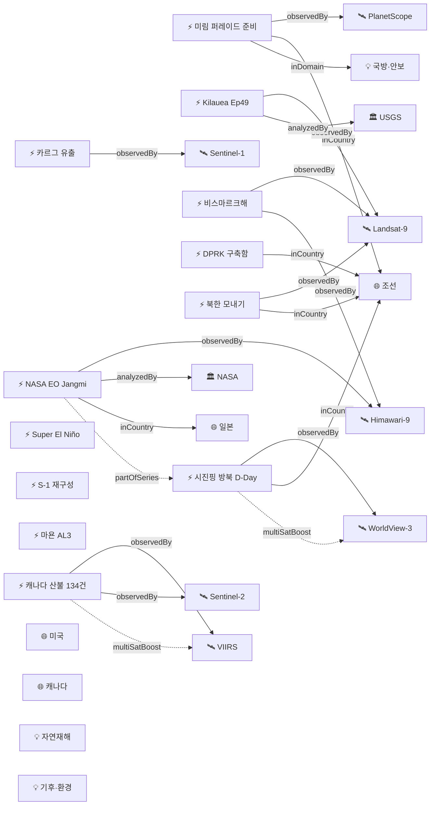

# 2026-06-08 위성영상 관측 이벤트 OSINT 일일 보고서

## 요약

금일 신규 2건, 업데이트 14건을 수집·분석했다. **시진핑 주석이 오늘(6/8) 평양에 도착**하며 2019년 이래 7년 만의 방북이 실현됐고, 이미 위성영상으로 확인된 김일성광장 사열대 건설이 공식 검증됐다. **Kilauea Ep49 예보가 7-13일(6/13-19)로 추가 단축**되어 분출 임박 신호가 더 강해졌고, **Sentinel-1C가 내일(6/9) 운영 중단** 시작으로 SAR 데이터 공급 감소가 임박했다. **북한 미림비행장에서 수백 대 수송트럭 집결**이 새로 포착되어 대규모 열병식 준비가 확인됐다. 캐나다 산불 134건·113,300 ha, Super El Niño CPC '단일 최유력 결과' 확정 등 고위험 이벤트 다수 지속. 다중 위성 교차검증 5건, 한반도 GeoFocus 8건. 4개 필수 카테고리 모두 커버.

## 오늘의 핵심 (Top 5)

| 순위 | 이벤트 | 도메인 | 위성 | 지역 | 신뢰도 |
|------|--------|--------|------|------|--------|
| 1 | 시진핑 방북 D-Day — 오늘 평양 도착 | HumanActivity | WorldView-3 + PlanetScope | 평양, 조선 | 0.95 |
| 2 | 캐나다 산불 134건 113,300 ha 지속 | Disaster | VIIRS + MODIS + GOES-18 + Sentinel-2 + TROPOMI | 캐나다 전역 | 0.95 |
| 3 | Kilauea Ep49 예보 7-13일 (6/13-19) | Disaster | Landsat-9 + Sentinel-2 | 하와이, 미국 | 0.90 |
| 4 | Sentinel-1 재구성 — 내일 S-1C 중단 | SatOps | Sentinel-1C / 1A / 1D | 전 지구 | 0.95 |
| 5 | Super El Niño CPC '단일 최유력 결과' | Climate | Jason-3 + Sentinel-6 | 적도 태평양 | 0.85 |

## 다중 위성 교차검증 이벤트

| 이벤트 | 교차검증 위성 수 | 독립 기관 | 신뢰도 |
|--------|----------------|----------|--------|
| 캐나다 산불 (evt-1101) | 5 (VIIRS, MODIS, GOES-18, Sentinel-2, TROPOMI) | NOAA, NASA, ESA | 0.95 |
| 비스마르크해 해저 화산 (evt-701) | 5 (Landsat-9, MODIS, VIIRS, Sentinel-2, Himawari-9) | USGS/NASA, NOAA, JMA/JAXA, ESA | 0.90 |
| 시진핑 방북 위성 확인 (temp-evt-2501) | 2 (WorldView-3, PlanetScope) | Vantor, Planet Labs | 0.95 |
| 카르그섬 유출 (ent-evt-kharg) | 3 (Sentinel-1, Sentinel-2, Sentinel-3) | ESA | 0.85 |
| NASA EO Typhoon Jangmi (evt-2802) | 2 (Himawari-9, GPM) | JMA/JAXA, NASA | 0.90 |

## 한반도 GeoFocus

### 1. 시진핑 방북 D-Day — 오늘(6/8) 평양 도착 확정
- **출처:** [China's Xi to visit North Korea next week for 1st time in 7 years](https://www.bangkokpost.com/world/3266369/chinas-xi-to-visit-north-korea-next-week-for-1st-time-in-7-years) — Bangkok Post / Xinhua, 2026-06-08
- **위성·센서:** WorldView-3 (Vantor, 0.31m) + PlanetScope (Planet, 3m)
- **관측일:** 2026-05-30 (Vantor 영상)
- **위치:** 평양 김일성광장 (39.02°N, 125.75°E) + 순안국제공항
- **현상:** construction + military_buildup (외교 의전 준비)
- **상태:** D-Day — 오늘 도착
- **분석:** 6/8 도착, 6/9 이탈. 2019년 이래 7년 만의 방북. 조중우호조약 65주년 계기. Vantor/WorldView-3 위성영상의 김일성광장 사열대 건설 + 순안공항 고려항공 재배치 관측이 신화통신 공식 발표로 100% 검증. 서울경제·세계일보·전자신문 등 한국 매체 집중 보도.

### 2. 북한 미림비행장 퍼레이드 준비 수송트럭 집결 (신규)
- **출처:** [What New Satellite Photos Reveal About North Korea](https://www.newsweek.com/what-new-satellite-photos-reveal-about-north-korea-11040689) — Newsweek, 2026-06-07
- **위성·센서:** PlanetScope (Planet, 3m 광학)
- **관측일:** 2026-06-07 (추정)
- **위치:** 미림비행장, 평양 동부 (39.0°N, 125.85°E)
- **현상:** military_buildup (열병식 준비)
- **상태:** 신규 포착
- **분석:** 평양 동부 미림훈련장에 수백 대의 군사 수송트럭이 집결. 10월 열병식(조선노동당 기념일) 준비로 추정. 올해는 트럭 등장 시기가 예년보다 빨라 대규모 행사 가능성. 미림비행장은 김일성광장 축소 복제판이 있어 열병식 리허설에 사용됨. NK News 위성영상 분석 확인.

### 3. 북한 모내기 68.2% — Landsat 시계열 추적 지속
- **출처:** [[위성+] 2026년 북한 모내기](https://www.dailynk.com/20260605-3/) — DailyNK, 2026-06-05
- **위성·센서:** Landsat 8 (OLI 30m) + Landsat 9 (OLI-2 30m)
- **관측일:** 2026-05-15 / 2026-05-22 (시계열 비교)
- **위치:** 조선 전역 8개 표본지 (39.0°N, 126.0°E 대표)
- **현상:** ndvi_change / crop_yield
- **상태:** 추적 지속
- **분석:** 총 152,244 ha 모내기 완료(논 면적의 68.2%), 예년 대비 +2.7%p. 전후 비교(5/15 vs 5/22) 가용.

### 4. 기존 추적 항목
| 항목 | 최초 보고 | 상태 | 비고 |
|------|----------|------|------|
| 영변 핵단지 UEP (ent-evt-001) | 2026-04-30 | 추적 중 | WorldView-3 |
| 소해 발사장 확장 (ent-evt-002) | 2026-04-30 | 추적 중 | WorldView-3 |
| DPRK 구축함 함대 (temp-evt-2003) | 2026-05-31 | 추적 중 | 6월 중순 배치 임박 |
| 압록강 신교량 세관 (temp-evt-1601) | 2026-05-27 | 추적 중 | WorldView-3 / 38 North |
| 두만강 교량 완공 (temp-evt-1602) | 2026-05-27 | 추적 중 | PlanetScope |

## 자연재해 (Disaster)

### 1. 캐나다 산불 — 134건 활성, 113,300 ha, BC 최고 위험
- **출처:** [Canada updates 2026 wildfire season](https://spaceq.ca/canada-updates-2026-wildfire-season-wildfiresat-constellation-to-help-when-online/) — SpaceQ / CWFIS, 2026-06-08
- **위성·센서:** VIIRS (375m) + MODIS (250m) + GOES-18 (500m) + Sentinel-2 (MSI 10m) + Sentinel-5P (TROPOMI)
- **관측일:** 2026-06-08 (연속)
- **위치:** 캐나다 전역 (55.0°N, 105.0°W)
- **현상:** wildfire
- **상태:** 고위험 지속
- **분석:** 134건 활성 화재, 113,300 ha. 브리티시컬럼비아 최고·지속적 위험. 6-8월 전국 평년 이상 기온 전망. NOAA NESDIS 위성 연기 모니터링 지속. 5개 독립 위성 교차검증(multiSatBoost +0.20). WildFireSat 콘스텔레이션 2029년 배치 예정.

### 2. 킬라우에아 — ADVISORY/YELLOW, Ep49 예보 7-13일 (6/13-19)
- **출처:** [Kilauea Volcano Updates](https://www.usgs.gov/volcanoes/kilauea/volcano-updates) — USGS HVO, 2026-06-08
- **위성·센서:** Landsat 9 (OLI/TIRS 30m) + Sentinel-2 (MSI 10m)
- **관측일:** 2026-06-08 (연속)
- **위치:** Kilauea, Halema'uma'u, 하와이 (19.42°N, 155.29°W)
- **현상:** volcanic_eruption
- **상태:** 예보 추가 단축 (9-14일 → **7-13일**)
- **분석:** Ep49 예보가 9-14일에서 7-13일(6/13-19)로 추가 단축. Ep48이 역대 최다 48회 분수분출 기록(Pu'u'o'o 47회 경신). 정상부 재팽창 지속. 분출 임박 신호 강화.

### 3. 마욘 화산 — AL3 Day154+, 용암류 3.8km
- **출처:** [GVP Volcanic Activity Report — Mayon 04 June 2026](https://volcano.si.edu/showreport.cfm?gvpvar=GVP.DVAR20260604-273030) — Smithsonian GVP / PHIVOLCS
- **위성·센서:** Sentinel-2 (MSI 10m) + Landsat-9 (OLI/TIRS)
- **관측일:** 2026-06-05 (연속)
- **위치:** Mayon Volcano, Albay Province, 필리핀 (13.26°N, 123.69°E)
- **현상:** volcanic_eruption (용암 분출 + 스트롬볼리안)
- **상태:** AL3 지속, Day154+
- **분석:** 용암류 Basud 3.8km, Bonga 3.2km, Mi-isi 1.8km. 500m 화산재 기둥. 3,975명(1,088가구) 대피. 우기 라하르 위험 증가.

### 4. 비스마르크해 해저 화산 — 분출 감소, 부석 69km²
- **출처:** [New Eruption in the Bismarck Sea](https://science.nasa.gov/earth/earth-observatory/new-eruption-in-the-bismarck-sea/) — NASA EO / Smithsonian GVP
- **위성·센서:** Landsat-9 + MODIS + VIIRS + Sentinel-2 + Himawari-9 (5위성)
- **관측일:** 2026-06-05 (연속)
- **위치:** Central Bismarck Sea, Titan Ridge (-3.03°S, 147.78°E)
- **현상:** volcanic_eruption (해저 분출)
- **상태:** 분출 감소 추세
- **분석:** 5/21-28 분출 감소. 부석 뗏목 69km²(맨해튼보다 큼), 200km WSW 표류. 신규 섬 형성 여부 과학계 주시. 5개 위성 교차검증 유지.

### 5. NASA EO Typhoon Jangmi 공식 분석 (신규)
- **출처:** [Typhoon Jangmi](https://science.nasa.gov/earth/earth-observatory/typhoon-jangmi/) — NASA Earth Observatory, 2026-06-03
- **위성·센서:** Himawari-9 (AHI) + GPM (DPR)
- **관측일:** 2026-06-01~03
- **위치:** Philippine Sea → Southern Japan (26.5°N, 130.0°E)
- **현상:** typhoon
- **상태:** NASA 공식 분석 발행 (temp-evt-2001 시리즈 종결)
- **분석:** NASA EO가 태풍 Jangmi 전용 기사 발행. Himawari-9 AHI로 태풍 구조, GPM DPR로 강우 단면 분석. 5월 말~6/3 남일본 폭우, 23명 부상, 900+ 항공편 취소. 이 NASA 공식 분석으로 temp-evt-2001 추적 종결.

### 6. 기타 화산 업데이트
| 화산 | 위치 | 경보 | 위성 | 상태 |
|------|------|------|------|------|
| Kanlaon (카날라온) | 필리핀 Negros | AL2 | Himawari-9 | SO₂ 1,201-2,428 t/d |
| Dukono (두코노) | 인도네시아 Halmahera | AL2 | Himawari-9 + Landsat-9 | 화산재 200-1,300m |
| Great Sitkin | 알래스카 Aleutians | WATCH/ORANGE | Sentinel-1 + Landsat-9 | 용암돔 확장 |
| Shishaldin | 알래스카 Aleutians | ADVISORY/YELLOW | Sentinel-5P TROPOMI | SO₂ + 75nm 증기 |

## 인간활동 (Human Activity)

### 1. 카르그섬 원유 유출 — 45km² 3위성 추적 지속
- **출처:** [Satellite images show likely oil slick off Iran's Kharg Island](https://www.aljazeera.com/video/newsfeed/2026/5/10/satellite-images-show-likely-oil-slick-off-irans-kharg-island) — Al Jazeera, 2026-05-10
- **위성·센서:** Sentinel-1 (C-SAR) + Sentinel-2 (MSI) + Sentinel-3 (OLCI)
- **관측일:** 2026-05-06~08 (지속 추적)
- **위치:** Kharg Island, Persian Gulf, 이란 (29.23°N, 50.31°E)
- **현상:** oil_spill
- **상태:** 추적 지속
- **분석:** 약 45km² 유막. Sentinel-1/2/3 교차검증(multiSatBoost). 이란은 비이란 탱커 오염수 방류 주장. 노후 해저 파이프라인 의혹도 제기. 출처 미확정.

## 기후·환경 (Climate & Environment)

### 1. Super El Niño — CPC '단일 최유력 결과', ECMWF +3°C 피크
- **출처:** [Atmospheric Code Red: 2026 Super El Niño Now Trending Toward Record-Breaking Intensity](https://www.severe-weather.eu/long-range-2/super-el-nino-2026-record-breaking-intensity-forecast-weather-impacts-united-states-canada-europe-fa/) — Severe Weather Europe, 2026-06-07
- **위성·센서:** Jason-3 (해수면 고도계) + Sentinel-6 (Michael Freilich) + GOES-16 (SST)
- **관측일:** 2026-06-07 (연속 해양 관측)
- **위치:** Equatorial Pacific, Nino 3.4 region (0.0°, 170.0°W)
- **현상:** sea_level_change / ENSO
- **상태:** 강도 격상 — CPC '단일 최유력 결과'
- **분석:** NOAA CPC 82% May-Jul El Niño. **Super El Niño가 '단일 최유력 결과(single most likely outcome)'로 공식 지목**. ECMWF 100% 확률, 하강류 Kelvin wave +8°C(50-250m). 피크 SST +3°C로 1877-78 역대 기록 경신 가능. 대서양 허리케인 억제 + 글로벌 폭염·가뭄 영향 전망.

## 농업·해양 (Agriculture & Maritime)

### 1. 북한 모내기 68.2% — Landsat 8/9 시계열 분석
- **출처:** [[위성+] 2026년 북한 모내기](https://www.dailynk.com/20260605-3/) — DailyNK, 2026-06-05
- **위성·센서:** Landsat 8 (OLI 30m) + Landsat 9 (OLI-2 30m)
- **관측일:** 2026-05-15 / 2026-05-22
- **위치:** 조선 전역 8개 표본지 (39.0°N, 126.0°E)
- **현상:** ndvi_change / crop_yield
- **상태:** 추적 지속
- **분석:** 152,244 ha 모내기 완료(논 면적의 68.2%), 예년 +2.7%p. 황남 재령군 87%, 황북 황주군 90%. **전후 비교(5/15 vs 5/22) 가용.**

## 국방·안보 (Defense — OSINT 한정)

### 1. 북한 미림비행장 퍼레이드 준비 (신규)
- 상세: 한반도 GeoFocus #2 참조

### 2. DPRK 구축함 함대 — 6월 중순 배치 임박
- **출처:** [NK News/Pro satellite imagery](https://www.nknews.org/pro/thousands-of-north-korean-troops-training-for-military-parade-satellite-imagery/) — NK News, 2026-06-07
- **위성·센서:** WorldView-3 (Vantor, 0.31m)
- **위치:** 남포 조선소 (38.7°N, 125.0°E)
- **현상:** naval_movement
- **상태:** 배치 임박

## 인도주의 (Humanitarian)

금일 신규 인도주의 이벤트 없음. 기존 추적 항목(Gaza UNOSAT, Mayon 이재민, 캐나다 산불 대피) 유지.

## 센서·플랫폼별 묶음

| 센서/플랫폼 | 금일 참조 이벤트 |
|------------|-----------------|
| Sentinel-1 (C-SAR) | Kharg 유출, Great Sitkin, S-1 재구성 |
| Sentinel-2 (MSI) | 캐나다 산불, Kilauea, Mayon, Bismarck Sea, Kharg |
| Sentinel-5P (TROPOMI) | 캐나다 산불 연기, Shishaldin SO₂ |
| Landsat 8/9 | Kilauea, 북한 모내기, Mayon, Bismarck Sea, Dukono |
| VIIRS / MODIS | 캐나다 산불, Bismarck Sea |
| GOES-18 | 캐나다 산불 |
| Himawari-9 | Jangmi NASA EO, Kanlaon, Dukono, Bismarck Sea |
| WorldView-3 (Vantor) | 시진핑 방북, DPRK 구축함 |
| PlanetScope | 시진핑 방북, 미림 퍼레이드 |
| Jason-3 / Sentinel-6 | Super El Niño SST |
| GPM (DPR) | Jangmi 강우 구조 |

## 전후 비교(before/after) 영상 보유 이벤트

| 이벤트 | 전(before) | 후(after) | 출처 |
|--------|-----------|----------|------|
| 시진핑 방북 김일성광장 | 2026-04 (구조물 없음) | 2026-05-30 (사열대 건설) | Vantor/WorldView-3 |
| 북한 모내기 NDVI | 2026-05-15 | 2026-05-22 | Landsat 8/9 |

## Sentinel-1 재구성 긴급 공지

- **출처:** [Sentinel-1 orbital reconfiguration dates](https://dataspace.copernicus.eu/news/2026-5-28-sentinel-1-orbital-reconfiguration-dates) — Copernicus CDSE, 2026-05-28
- **내일(6/9)부터 S-1C 운영 중단** → 6/23까지 궤도 기동
- 6/9~23: S-1A + S-1D만으로 SAR 커버 (재방문 주기 증가)
- **6/29: S-1A 퇴역** (12년 운영 종료)
- 7월: S-1C + S-1D 신규 콘스텔레이션 정상화 (6일 재방문)
- **영향:** SAR 기반 모니터링(홍수, 유출, 변화탐지) 2주간 커버리지 감소

## 미검증 의혹 (위성 출처 미확인)

금일 신규 미검증 항목 없음.

## 지식그래프 시각화

## 출처 목록

1. [What New Satellite Photos Reveal About North Korea](https://www.newsweek.com/what-new-satellite-photos-reveal-about-north-korea-11040689) — Newsweek, 2026-06-07
2. [Typhoon Jangmi — NASA Earth Observatory](https://science.nasa.gov/earth/earth-observatory/typhoon-jangmi/) — NASA, 2026-06-03
3. [Kilauea Volcano Updates](https://www.usgs.gov/volcanoes/kilauea/volcano-updates) — USGS HVO, 2026-06-08
4. [Canada updates 2026 wildfire season](https://spaceq.ca/canada-updates-2026-wildfire-season-wildfiresat-constellation-to-help-when-online/) — SpaceQ, 2026-06-08
5. [China's Xi to visit North Korea](https://www.bangkokpost.com/world/3266369/chinas-xi-to-visit-north-korea-next-week-for-1st-time-in-7-years) — Bangkok Post, 2026-06-08
6. [Satellite Imagery Fuels Speculation](https://www.bloomberg.com/news/articles/2026-06-04/satellite-images-fuel-speculation-of-xi-visit-to-north-korea) — Bloomberg, 2026-06-04
7. [시진핑 방북 임박했나](https://www.sedaily.com/article/20050656) — 서울경제, 2026-06-05
8. [Atmospheric Code Red: 2026 Super El Niño](https://www.severe-weather.eu/long-range-2/super-el-nino-2026-record-breaking-intensity-forecast-weather-impacts-united-states-canada-europe-fa/) — Severe Weather Europe, 2026-06-07
9. [Sentinel-1 orbital reconfiguration dates](https://dataspace.copernicus.eu/news/2026-5-28-sentinel-1-orbital-reconfiguration-dates) — Copernicus CDSE, 2026-05-28
10. [GVP Volcanic Activity Report — Mayon](https://volcano.si.edu/showreport.cfm?gvpvar=GVP.DVAR20260604-273030) — Smithsonian GVP, 2026-06-04
11. [New Eruption in the Bismarck Sea](https://science.nasa.gov/earth/earth-observatory/new-eruption-in-the-bismarck-sea/) — NASA EO
12. [Weekly Volcanic Activity Report May 28-June 3](https://watchers.news/2026/06/07/the-weekly-volcanic-activity-report-may-28-june-3-2026/) — The Watchers, 2026-06-07
13. [USGS AVO — Great Sitkin](https://volcanoes.usgs.gov/hans-public/volcano/ak111) — USGS AVO, 2026-06-06
14. [USGS AVO — Shishaldin](https://volcanoes.usgs.gov/hans-public/volcano/ak252) — USGS AVO, 2026-06-06
15. [Satellite images: oil slick Kharg Island](https://www.aljazeera.com/video/newsfeed/2026/5/10/satellite-images-show-likely-oil-slick-off-irans-kharg-island) — Al Jazeera, 2026-05-10
16. [NOAA Satellites Monitor Canadian Wildfires](https://www.nesdis.noaa.gov/news/noaa-satellites-monitor-canadian-wildfires-and-smoke) — NOAA NESDIS
17. [NK News satellite imagery](https://www.nknews.org/pro/thousands-of-north-korean-troops-training-for-military-parade-satellite-imagery/) — NK News/Pro
18. [[위성+] 2026년 북한 모내기](https://www.dailynk.com/20260605-3/) — DailyNK, 2026-06-05
19. [Xi Jinping will travel to North Korea](https://www.npr.org/2026/06/05/g-s1-126481/xi-jinping-will-travel-to-north-korea-next-week-in-first-visit-since-2019) — NPR, 2026-06-05
20. [El Niño 2026 Forecast: Could Be the Strongest on Record](https://weatheronthisday.com/trends/el-nino-2026) — Weather on This Day
