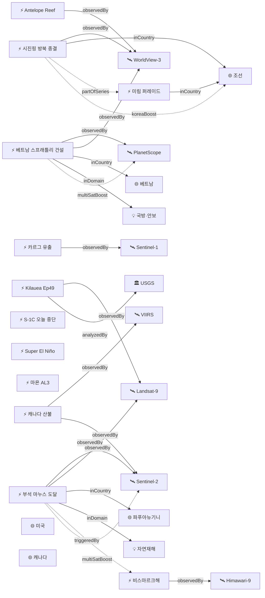

# 2026-06-09 위성영상 관측 이벤트 OSINT 일일 보고서

## 요약

금일 신규 3건, 업데이트 14건을 수집·분석했다. **시진핑 주석이 오늘(6/9) 평양을 떠나며** 2019년 이래 7년 만의 방북이 종결됐고, 전략적 협력 심화·경제·농업·과학기술 확대 합의가 확인됐다. **Kilauea Ep49 예보가 6/12-15로 추가 단축**되어 72시간 이내 분출 가능성이 높아졌고, **Sentinel-1C가 오늘(6/9) 운영을 중단**하여 2주간 SAR 커버리지가 감소한다. **베트남이 스프래틀리 군도 18개 암초 27사이트에서 대규모 군사 건설**을 진행 중인 사실이 위성영상으로 확인됐고, **비스마르크해 해저 화산 부석 뗏목이 마누스섬 해안에 도달**하여 '재난 수준' 피해가 발생했다. Super El Niño Nino 3.4 +0.9°C 임계치 초과 확인. 다중 위성 교차검증 5건, 한반도 GeoFocus 4건. 4개 필수 카테고리 모두 커버.

## 오늘의 핵심 (Top 5)

| 순위 | 이벤트 | 도메인 | 위성 | 지역 | 신뢰도 |
|------|--------|--------|------|------|--------|
| 1 | 시진핑 방북 종결 — 오늘(6/9) 이탈 | HumanActivity | WorldView-3 + PlanetScope | 평양, 조선 | 0.95 |
| 2 | Kilauea Ep49 예보 6/12-15 — 72시간 내 분출 | Disaster | Landsat-9 + Sentinel-2 | 하와이, 미국 | 0.90 |
| 3 | Sentinel-1C 오늘(6/9) 운영 중단 시작 | SatOps | Sentinel-1C / 1A / 1D | 전 지구 | 0.95 |
| 4 | 비스마르크해 부석 마누스섬 도달 — 재난 수준 (신규) | Disaster | Sentinel-2 + Landsat-9 + MODIS + VIIRS + Himawari-9 | 마누스섬, PNG | 0.90 |
| 5 | 베트남 스프래틀리 27사이트 대규모 건설 (신규) | Defense | PlanetScope + WorldView-3 | 남중국해, VN | 0.85 |

## 다중 위성 교차검증 이벤트

| 이벤트 | 교차검증 위성 수 | 독립 기관 | 신뢰도 |
|--------|----------------|----------|--------|
| 비스마르크해 부석 마누스 도달 (evt-2903) | 5 (Sentinel-2, Landsat-9, MODIS, VIIRS, Himawari-9) | ESA, USGS/NASA, NOAA, JMA/JAXA | 0.90 |
| 캐나다 산불 (evt-1101) | 5 (VIIRS, MODIS, GOES-18, Sentinel-2, TROPOMI) | NOAA, NASA, ESA | 0.95 |
| 카르그섬 유출 (ent-evt-kharg) | 3 (Sentinel-1, Sentinel-2, Sentinel-3) | ESA | 0.85 |
| 베트남 스프래틀리 (evt-2901) | 2 (PlanetScope, WorldView-3) | Planet Labs, Vantor | 0.85 |
| 시진핑 방북 위성 확인 (evt-2902/temp-evt-2501) | 2 (WorldView-3, PlanetScope) | Vantor, Planet Labs | 0.95 |

## 한반도 GeoFocus

### 1. 시진핑 방북 종결 — 오늘(6/9) 이탈, 전략적 협력 심화 합의
- **출처:** [Xi and Kim express hopes for greater ties](https://www.npr.org/2026/06/08/g-s1-126863/xi-and-kim-express-hopes-for-greater-ties-between-china-and-north-korea) — NPR, 2026-06-08; [CNN Asia](https://www.cnn.com/2026/06/07/asia/china-xi-jinping-north-korea-kim-jong-un-intl-hnk) — CNN, 2026-06-08
- **위성·센서:** WorldView-3 (Vantor, 0.31m) + PlanetScope (Planet, 3m)
- **관측일:** 2026-05-30 (Vantor 영상) → 6/8-9 공식 행사
- **위치:** 평양 김일성광장 (39.0°N, 125.8°E)
- **현상:** diplomatic_event / construction
- **상태:** 방북 종결
- **분석:** 시진핑 주석 6/8 도착·6/9 이탈. 2019년 이래 7년 만의 방북. 21발 예포·의장대 사열 후 목란관 회담·만찬. '전략적 협력과 조율 심화' 촉구, 경제·무역·농업·건설·과학기술 분야 협력 확대 합의. 조중우호조약 65주년 계기. **위성영상으로 사전 확인된 김일성광장 사열대가 공식 환영행사에 사용됨으로** 위성 OSINT → 현실 검증의 교과서적 사례 완성.

### 2. 북한 미림비행장 퍼레이드 준비 지속
- **출처:** [What New Satellite Photos Reveal About North Korea](https://www.newsweek.com/what-new-satellite-photos-reveal-about-north-korea-11040689) — Newsweek, 2026-06-07
- **위성·센서:** PlanetScope (Planet, 3m 광학)
- **위치:** 미림비행장, 평양 동부 (39.0°N, 125.85°E)
- **현상:** military_buildup (열병식 준비)
- **상태:** 추적 지속
- **분석:** 수백 대 수송트럭 집결 지속. 시진핑 방북 환영행사 + 10월 열병식 준비 병행 가능성.

### 3. 기존 추적 항목
| 항목 | 최초 보고 | 상태 | 비고 |
|------|----------|------|------|
| 영변 핵단지 UEP (ent-evt-001) | 2026-04-30 | 추적 중 | WorldView-3 |
| 소해 발사장 확장 (ent-evt-002) | 2026-04-30 | 추적 중 | WorldView-3 |
| DPRK 구축함 함대 (temp-evt-2003) | 2026-05-31 | 기보도 | 6월 중순 배치 임박 |
| 북한 모내기 68.2% (temp-evt-nkrice) | 2026-06-05 | 기보도 | Landsat 시계열 |

## 자연재해 (Disaster)

### 1. 비스마르크해 부석 뗏목 마누스섬 도달 — '재난 수준' 피해 (신규)
- **출처:** ['This is a disaster' — huge pumice rafts from volcano hit Manus Island coast](https://www.rnz.co.nz/news/pacific/597531/this-is-a-disaster-huge-pumice-rafts-from-volcano-hit-manus-island-coast) — RNZ, 2026-06-08
- **위성·센서:** Sentinel-2 (MSI 10m) + Landsat-9 (OLI/TIRS 30m) + MODIS + VIIRS + Himawari-9 (5위성)
- **관측일:** 2026-06-08 (연속)
- **위치:** Manus Island, Papua New Guinea (-2.09°S, 147.0°E)
- **현상:** volcanic_eruption (해저 분출 → 부석 뗏목)
- **상태:** 신규 — 부석 해안 도달
- **분석:** Titan Ridge 해저 화산(evt-701)에서 생성된 거대 부석 뗏목이 125km NW 마누스섬 남부 해안에 도달. 조류와 해류에 의해 밀려온 부석이 해안선을 뒤덮어 선박 접근 곤란·어업 피해 발생. 주민들 '재난 수준(This is a disaster)' 호소. 인도주의 전환 가능성 모니터링. **cascading_disaster 추론 적용:** evt-701(해저 분출) → evt-2903(부석 해안 피해). 5개 위성 교차검증(multiSatBoost +0.20).

### 2. 킬라우에아 — ADVISORY/YELLOW, Ep49 예보 6/12-15로 추가 단축
- **출처:** [Kilauea Volcano Updates](https://www.usgs.gov/volcanoes/kilauea/volcano-updates) — USGS HVO, 2026-06-09
- **위성·센서:** Landsat 9 (OLI/TIRS 30m) + Sentinel-2 (MSI 10m)
- **관측일:** 2026-06-09 (연속)
- **위치:** Kilauea, Halema'uma'u, 하와이 (19.42°N, 155.29°W)
- **현상:** volcanic_eruption
- **상태:** 예보 추가 단축 — 6/12-15 (전일 6/13-19)
- **분석:** Ep49 예보가 전일 7-13일(6/13-19)에서 **6/12-15(3-6일)로 추가 단축.** 정상부 팽창률 가속. Ep48(6/1) 9시간·200m 분수·40% 화구 용암 이후 재팽창 지속. 역대 최다 48회 분수분출 기록 경신 상태. **72시간 이내 분출 가능성.**

### 3. 캐나다 산불 — BC 최고 위험 지속
- **출처:** [NASA FIRMS](https://firms.modaps.eosdis.nasa.gov/usfs/map/) — NASA FIRMS / CWFIS, 2026-06-09
- **위성·센서:** VIIRS (375m) + MODIS (250m) + GOES-18 (500m) + Sentinel-2 (MSI 10m) + Sentinel-5P (TROPOMI)
- **관측일:** 2026-06-09 (연속)
- **위치:** 캐나다 전역 (55.0°N, 105.0°W)
- **현상:** wildfire
- **상태:** 고위험 지속
- **분석:** BC주 최고·지속적 위험 유지. 6-8월 전국 평년 이상 기온 전망으로 악화 우려. 5개 독립 위성 교차검증(multiSatBoost +0.20).

### 4. 마욘 화산 — AL3 Day155+, 우기 라하르 위험 증가
- **출처:** [GVP Volcanic Activity Report — Mayon](https://volcano.si.edu/showreport.cfm?gvpvar=GVP.DVAR20260604-273030) — Smithsonian GVP / PHIVOLCS
- **위성·센서:** Sentinel-2 (MSI 10m) + Landsat-9 (OLI/TIRS)
- **관측일:** 2026-06-06 (연속)
- **위치:** Mayon Volcano, Albay Province, 필리핀 (13.26°N, 123.69°E)
- **현상:** volcanic_eruption (용암 분출 + 스트롬볼리안)
- **상태:** AL3 지속, Day155+
- **분석:** 용암류 Basud 3.8km, Bonga 3.2km, Mi-isi 1.8km. 일 223-364건 낙석. 500m 화산재 기둥. 3,975명 대피. **우기 진입으로 라하르 위험 증가** — 강우 시 화산재·용암 파편 혼합 토석류 발생 우려.

### 5. 비스마르크해 해저 화산 — 분출 감소, 부석 69km² 표류
- **출처:** [New Eruption in the Bismarck Sea](https://science.nasa.gov/earth/earth-observatory/new-eruption-in-the-bismarck-sea/) — NASA EO / Smithsonian GVP
- **위성·센서:** Landsat-9 + MODIS + VIIRS + Sentinel-2 + Himawari-9 (5위성)
- **관측일:** 2026-06-08 (연속)
- **위치:** Central Bismarck Sea, Titan Ridge (-3.03°S, 147.78°E)
- **현상:** volcanic_eruption (해저 분출)
- **상태:** 분출 감소, 부석 표류 → 마누스섬 도달(evt-2903)
- **분석:** 5/21-28 분출 감소 추세이나 수중음향으로 분출 지속 확인. 부석 뗏목 69km² 200km WSW 표류. 마누스섬 남부 해안 도달로 cascading_disaster 전환(evt-2903).

### 6. 기타 화산 업데이트
| 화산 | 위치 | 경보 | 위성 | 상태 |
|------|------|------|------|------|
| Kanlaon (카날라온) | 필리핀 Negros | AL2 | Himawari-9 | SO₂ 2,382 t/d, 2026년 7회 분출(역사적 가속) |
| Dukono (두코노) | 인도네시아 Halmahera | AL2 | Himawari-9 + Landsat-9 | 화산재 200-1,300m 지속 |
| Great Sitkin | 알래스카 Aleutians | WATCH/ORANGE | Sentinel-1 + Landsat-9 | 용암돔 확장 지속 |
| Shishaldin | 알래스카 Aleutians | ADVISORY/YELLOW | Sentinel-5P TROPOMI | SO₂ 위성 검출 + 증기 기둥 |

## 인간활동 (Human Activity)

### 1. 시진핑 방북 종결 (신규)
- 상세: 한반도 GeoFocus #1 참조

### 2. 카르그섬 원유 유출 — 45km² 3위성 추적 지속
- **출처:** [Oil spill near Iran's Kharg Island](https://www.thenationalnews.com/business/energy/2026/05/13/oil-spill-near-irans-kharg-island-raises-questions-over-its-source/) — The National, 2026-05-13
- **위성·센서:** Sentinel-1 (C-SAR) + Sentinel-2 (MSI) + Sentinel-3 (OLCI)
- **관측일:** 2026-05-06~08 (지속 추적)
- **위치:** Kharg Island, Persian Gulf, 이란 (29.23°N, 50.31°E)
- **현상:** oil_spill
- **상태:** 추적 지속
- **분석:** 약 45km² 유막. 3위성 교차검증(multiSatBoost). 출처 미확정.

## 기후·환경 (Climate & Environment)

### 1. Super El Niño — Nino 3.4 +0.9°C 임계치 초과, ECMWF 100%
- **출처:** [Atmospheric Code Red: 2026 Super El Niño](https://www.severe-weather.eu/long-range-2/super-el-nino-2026-record-breaking-intensity-forecast-weather-impacts-united-states-canada-europe-fa/) — Severe Weather Europe, 2026-06-08
- **위성·센서:** Jason-3 (해수면 고도계) + Sentinel-6 (Michael Freilich) + GOES-16 (SST)
- **관측일:** 2026-06-08 (연속 해양 관측)
- **위치:** Equatorial Pacific, Nino 3.4 region (0.0°, 170.0°W)
- **현상:** sea_level_change / ENSO
- **상태:** Nino 3.4 +0.9°C — 임계치(+0.5°C) 초과
- **분석:** NOAA CPC 82% May-Jul El Niño. **Nino 3.4 지수가 +0.9°C로 임계치 초과 확인.** ECMWF 100% Super El Niño. 피크 SST +3°C 전망, 1877-78 역대 기록 경신 가능. 대서양 허리케인 억제 전망.

## 농업·해양 (Agriculture & Maritime)

금일 신규 농업·해양 이벤트 없음. 기존 추적 항목(북한 모내기 68.2%) 유지 — 기보도.

## 국방·안보 (Defense — OSINT 한정)

### 1. 베트남 스프래틀리 27사이트 18암초 대규모 건설 (신규)
- **출처:** [Vietnam South China Sea Spratly Island Construction](https://www.rfa.org/english/southchinasea/2026/06/08/vietnam-south-china-sea-spratly-island-construction/) — Radio Free Asia, 2026-06-08
- **위성·센서:** PlanetScope (Planet, 3m) + WorldView-3 (Vantor, 0.31m)
- **관측일:** 2026-06-08
- **위치:** Spratly Islands, 남중국해 (10.0°N, 114.0°E)
- **현상:** construction / military_buildup (인공섬 건설)
- **상태:** 신규 확인
- **분석:** 베트남이 스프래틀리 군도 내 18개 암초 27개 사이트에서 군사·해양 인프라 건설 중. 항구, 활주로, 통신시설 포함. **Barque Canada Reef에 4,000m 활주로 건설 중.** 지난 1년간 534에이커(216ha) 추가 매립, 누적 2,771에이커. DVOR 항법 비컨 설치 확인. 중국 Antelope Reef(evt-092) 1,490에이커 매립과 함께 남중국해 군비 경쟁 가속 시사. 2위성 교차검증(multiSatBoost +0.20).

### 2. Antelope Reef — 남중국해 최대 인공섬 가능성 (CSIS AMTI)
- **출처:** [Antelope Reef could now be the largest island in the South China Sea](https://amti.csis.org/antelope-reef-could-now-be-the-largest-island-in-the-south-china-sea/) — CSIS AMTI, 2026-06-05
- **위성·센서:** PlanetScope + WorldView-3
- **위치:** Antelope Reef, Paracel Islands (16.4°N, 111.6°E)
- **현상:** construction / military_buildup
- **상태:** 추적 지속
- **분석:** 1,490에이커 매립, Mischief Reef(1,504에이커)에 근접. 9,000ft 활주로 적합 규모.

### 3. 북한 미림비행장 퍼레이드 준비
- 상세: 한반도 GeoFocus #2 참조

## 인도주의 (Humanitarian)

비스마르크해 부석 마누스섬 도달(evt-2903)로 인도주의 전환 가능성 모니터링. 주민 '재난 수준' 호소, 어업·선박 접근 피해. 기존 추적 항목(Gaza UNOSAT, Mayon 이재민, 캐나다 산불 대피) 유지.

## 센서·플랫폼별 묶음

| 센서/플랫폼 | 금일 참조 이벤트 |
|------------|-----------------|
| Sentinel-1 (C-SAR) | Kharg 유출, Great Sitkin, **S-1C 오늘 중단** |
| Sentinel-2 (MSI) | Kilauea, Mayon, Bismarck Sea, Kharg, 캐나다 산불, 스프래틀리 |
| Sentinel-5P (TROPOMI) | Shishaldin SO₂, 캐나다 산불 연기 |
| Landsat 8/9 | Kilauea, Mayon, Bismarck Sea, Dukono |
| VIIRS / MODIS | 캐나다 산불, Bismarck Sea |
| GOES-18 | 캐나다 산불 |
| Himawari-9 | Bismarck Sea, Kanlaon, Dukono |
| WorldView-3 (Vantor) | 시진핑 방북, 스프래틀리, Antelope Reef |
| PlanetScope (Planet) | 시진핑 방북, 스프래틀리, 미림 퍼레이드 |
| Jason-3 / Sentinel-6 | Super El Niño SST |

## Sentinel-1 재구성 — D-Day

- **출처:** [Sentinel-1 orbital reconfiguration dates](https://dataspace.copernicus.eu/news/2026-5-28-sentinel-1-orbital-reconfiguration-dates) — Copernicus CDSE, 2026-05-28
- **오늘(6/9) S-1C 운영 중단 시작** → 6/23까지 궤도 기동
- 6/9~23: S-1A + S-1D만으로 SAR 커버 (재방문 주기 증가)
- **6/29: S-1A 퇴역** (12년 운영 종료)
- 7월: S-1C + S-1D 신규 콘스텔레이션 정상화 (6일 재방문)
- **영향:** SAR 기반 모니터링(홍수, 유출, 변화탐지) 2주간 커버리지 감소. 오늘부터 실제 영향 시작.

## 전후 비교(before/after) 영상 보유 이벤트

| 이벤트 | 전(before) | 후(after) | 출처 |
|--------|-----------|----------|------|
| 시진핑 방북 김일성광장 | 2026-04 (구조물 없음) | 2026-05-30 (사열대 건설) → 6/8 공식 사용 | Vantor/WorldView-3 |
| 베트남 스프래틀리 매립 | 2025년 (기존 규모) | 2026-06 (534에이커 추가) | PlanetScope + WV-3 |

## 미검증 의혹 (위성 출처 미확인)

금일 신규 미검증 항목 없음.

## 지식그래프 시각화

## 출처 목록

1. [Vietnam South China Sea Spratly Island Construction](https://www.rfa.org/english/southchinasea/2026/06/08/vietnam-south-china-sea-spratly-island-construction/) — Radio Free Asia, 2026-06-08
2. [Xi and Kim express hopes for greater ties between China and North Korea](https://www.npr.org/2026/06/08/g-s1-126863/xi-and-kim-express-hopes-for-greater-ties-between-china-and-north-korea) — NPR, 2026-06-08
3. ['This is a disaster' — huge pumice rafts from volcano hit Manus Island coast](https://www.rnz.co.nz/news/pacific/597531/this-is-a-disaster-huge-pumice-rafts-from-volcano-hit-manus-island-coast) — RNZ, 2026-06-08
4. [Kilauea Volcano Updates](https://www.usgs.gov/volcanoes/kilauea/volcano-updates) — USGS HVO, 2026-06-09
5. [Sentinel-1 orbital reconfiguration dates](https://dataspace.copernicus.eu/news/2026-5-28-sentinel-1-orbital-reconfiguration-dates) — Copernicus CDSE, 2026-05-28
6. [NASA FIRMS Active Fire Map](https://firms.modaps.eosdis.nasa.gov/usfs/map/) — NASA FIRMS / CWFIS, 2026-06-09
7. [GVP Volcanic Activity Report — Mayon](https://volcano.si.edu/showreport.cfm?gvpvar=GVP.DVAR20260604-273030) — Smithsonian GVP / PHIVOLCS
8. [New Eruption in the Bismarck Sea](https://science.nasa.gov/earth/earth-observatory/new-eruption-in-the-bismarck-sea/) — NASA EO / Smithsonian GVP
9. [Atmospheric Code Red: 2026 Super El Niño](https://www.severe-weather.eu/long-range-2/super-el-nino-2026-record-breaking-intensity-forecast-weather-impacts-united-states-canada-europe-fa/) — Severe Weather Europe, 2026-06-08
10. [Xi Jinping North Korea visit — CNN](https://www.cnn.com/2026/06/07/asia/china-xi-jinping-north-korea-kim-jong-un-intl-hnk) — CNN, 2026-06-08
11. [USGS AVO — Great Sitkin](https://volcanoes.usgs.gov/hans-public/volcano/ak111) — USGS AVO, 2026-06-07
12. [USGS AVO — Shishaldin](https://volcanoes.usgs.gov/hans-public/volcano/ak252) — USGS AVO, 2026-06-07
13. [Oil spill near Iran's Kharg Island](https://www.thenationalnews.com/business/energy/2026/05/13/oil-spill-near-irans-kharg-island-raises-questions-over-its-source/) — The National, 2026-05-13
14. [Antelope Reef could now be the largest island in the South China Sea](https://amti.csis.org/antelope-reef-could-now-be-the-largest-island-in-the-south-china-sea/) — CSIS AMTI, 2026-06-05
15. [What New Satellite Photos Reveal About North Korea](https://www.newsweek.com/what-new-satellite-photos-reveal-about-north-korea-11040689) — Newsweek, 2026-06-07
16. [Kanlaon Volcano](https://volcanodb.com/kanlaon-volcano) — VolcanoDB / PHIVOLCS, 2026-06-08
17. [Dukono Volcano](https://volcano.si.edu/volcano.cfm?vn=268010) — Smithsonian GVP / CVGHM, 2026-06-06
18. [NK News satellite imagery](https://www.nknews.org/pro/thousands-of-north-korean-troops-training-for-military-parade-satellite-imagery/) — NK News/Pro
19. [[위성+] 2026년 북한 모내기](https://www.dailynk.com/20260605-3/) — DailyNK, 2026-06-05
20. [NASA EO Digging Back in Time in the UAE](https://science.nasa.gov/earth/earth-observatory/digging-back-in-time-in-the-uae/) — NASA EO, 2026-06-08
