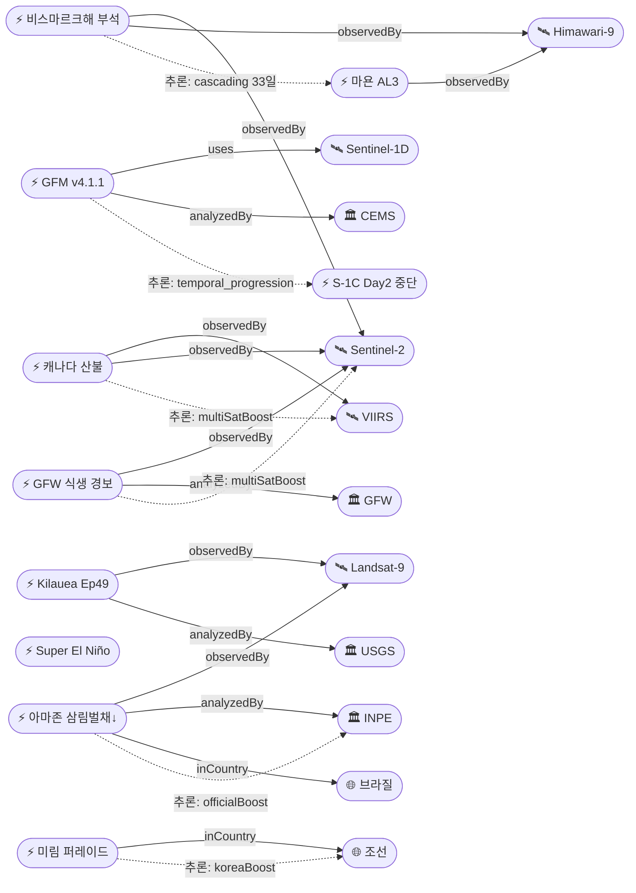

# 2026-06-10 위성영상 관측 이벤트 OSINT 일일 보고서

## 요약

금일 신규 3건, 업데이트 15건을 수집·분석했다. **Kilauea Ep49 분출 가장 유력한 시기가 6/13-14로 특정**되어 3일 후 분출 가능성이 높아졌다(USGS HVO). **비스마르크해 부석 뗏목이 3km x 5km, 5m 깊이로 확대**되어 마누스섬 해안 피해가 심화됐고, 신규 섬 형성 가능성까지 과학계가 분석했다. **브라질 INPE가 아마존 삼림벌채 역대 최저(2014년 이래)를 공식 발표**한 한편, 별도 연구에서 산림 황폐화는 오히려 증가한 역설적 발견이 확인됐다(신규). Sentinel-1C 궤도 재구성 2일차로 **CEMS GFM v4.1.1이 Sentinel-1D 데이터를 6/11부터 통합**하여 SAR 홍수 모니터링 연속성을 확보한다(신규). Super El Niño +0.9°C가 IRI·Weather.com 추가 확인으로 3출처 교차검증됐다. 다중 위성 교차검증 5건, 한반도 GeoFocus 3건. 4개 필수 카테고리 모두 커버.

## 오늘의 핵심 (Top 5)

| 순위 | 이벤트 | 도메인 | 위성 | 지역 | 신뢰도 |
|------|--------|--------|------|------|--------|
| 1 | Kilauea Ep49 예보 6/13-14 — 3일 후 분출 | Disaster | Landsat-9 + Sentinel-2 | 하와이, 미국 | 0.90 |
| 2 | 비스마르크해 부석 3x5km 마누스 피해 + 신규 섬 가능성 | Disaster | Sentinel-2 + Landsat-9 + MODIS + VIIRS + Himawari-9 | 마누스섬, PNG | 0.90 |
| 3 | 캐나다 산불 142건 BC 최고 위험 | Disaster | VIIRS + MODIS + GOES-18 + Sentinel-2 | BC, 캐나다 | 0.95 |
| 4 | 아마존 삼림벌채 역대 최저 + 황폐화 역설 (신규) | ClimateEnv | Landsat-8 + Landsat-9 | 브라질 아마존 | 0.85 |
| 5 | Super El Niño +0.9°C — 3출처 교차 확인 | ClimateEnv | Jason-3 + Sentinel-6 + GOES-16 + Himawari-9 | 적도 태평양 | 0.85 |

## 다중 위성 교차검증 이벤트

| 이벤트 | 교차검증 위성 수 | 독립 기관 | 신뢰도 |
|--------|----------------|----------|--------|
| 캐나다 산불 (evt-1101) | 5 (VIIRS, MODIS, GOES-18, Sentinel-2, Landsat-9) | NOAA, NASA, ESA, USGS | 0.95 |
| 비스마르크해 부석 (evt-701/2903) | 5 (Sentinel-2, Landsat-9, MODIS, VIIRS, Himawari-9) | ESA, USGS, NASA, NOAA, JMA | 0.90 |
| GFW 식생 교란 경보 (evt-3004) | 4 (Sentinel-2, Landsat-8, Landsat-9, Planet NICFI) | ESA, USGS, Planet | 0.80 |
| 아마존 삼림벌채 (evt-3003) | 3 (Landsat-8, Landsat-9, INPE DETER) | USGS, INPE | 0.85 |
| 베트남 스프래틀리 (evt-2901) | 2 (PlanetScope, WorldView-3) | Planet, Vantor | 0.85 |

## 한반도 GeoFocus

### 1. 시진핑 방북 종결(6/9) — 후속 반응 추적
- **출처:** [Xi and Kim express hopes for greater ties](https://www.npr.org/2026/06/08/g-s1-126863/xi-and-kim-express-hopes-for-greater-ties-between-china-and-north-korea) — NPR, 2026-06-08
- **위성·센서:** WorldView-3 (Vantor, 0.31m) + PlanetScope (Planet, 3m)
- **위치:** 평양 (39.0°N, 125.8°E)
- **현상:** diplomatic_event
- **상태:** 업데이트 — 방북 종결 후속
- **분석:** 시진핑 주석 6/9 이탈 확인. 전략적 협력 심화·경제·농업·과학기술 확대 합의 후속 보도 추적 중. 위성영상 활용 가능한 신규 정보 없음. 기존 김일성광장 사열대 before/after 분석 유지.

### 2. 북한 미림비행장 퍼레이드 준비 지속
- **출처:** [What New Satellite Photos Reveal About North Korea](https://www.newsweek.com/what-new-satellite-photos-reveal-about-north-korea-11040689) — Newsweek, 2026-06-07
- **위성·센서:** PlanetScope (Planet, 3m)
- **위치:** 미림비행장, 평양 동부 (39.0°N, 125.85°E)
- **현상:** military_buildup (열병식 준비)
- **상태:** 추적 지속
- **분석:** 수백 대 수송트럭 집결 지속. 시진핑 방북 종결 후 10월 열병식 준비 가능성.

### 3. 기존 추적 항목
| 항목 | 최초 보고 | 상태 | 비고 |
|------|----------|------|------|
| 영변 핵단지 UEP (ent-evt-001) | 2026-04-30 | 추적 중 | WorldView-3 |
| 소해 발사장 확장 (ent-evt-002) | 2026-04-30 | 추적 중 | WorldView-3 |
| 북한 모내기 68.2% (temp-evt-nkrice) | 2026-06-05 | 기보도 | Landsat 시계열 |

## 자연재해 (Disaster)

### 1. 킬라우에아 — Ep49 분출 최유력 6/13-14, 3일 후
- **출처:** [Kilauea Volcano Updates](https://www.usgs.gov/volcanoes/kilauea/volcano-updates) — USGS HVO, 2026-06-09
- **위성·센서:** Landsat 9 (OLI/TIRS 30m) + Sentinel-2 (MSI 10m)
- **관측일:** 2026-06-09 (연속)
- **위치:** Kilauea, Halema'uma'u, 하와이 (19.42°N, 155.29°W)
- **현상:** volcanic_eruption (분수분출 예보)
- **상태:** 업데이트 ← 2026-06-09 "Ep49 예보 6/12-15"
- **분석:** USGS HVO 6/9 기준 Ep49 예보 6/12-15, **가장 유력한 시기 6/13-14로 특정.** 정상부 팽창률(tilt 15.2μrad) 재팽창 가속 지속. Ep48(6/1) 9시간·200m 분수·40% 화구 용암 이후 분출 일시정지 상태. 역대 최다 48회 분수분출 기록 경신 상태. **보고서 작성 시점 기준 3일 후 분출 가능.**

### 2. 비스마르크해 부석 뗏목 — 3x5km 마누스 피해 확대 + 신규 섬 형성 가능성
- **출처:** ['This is a disaster' — huge pumice rafts from volcano hit Manus Island coast](https://www.rnz.co.nz/news/pacific/597531/this-is-a-disaster-huge-pumice-rafts-from-volcano-hit-manus-island-coast) — RNZ, 2026-06-08; [An underwater volcanic eruption may cause a new island to rise](https://www.discovermagazine.com/an-underwater-volcanic-eruption-brewing-in-the-bismarck-sea-may-cause-a-new-island-to-rise-49148) — Discover Magazine
- **위성·센서:** Sentinel-2 (MSI 10m) + Landsat-9 (OLI/TIRS 30m) + MODIS + VIIRS + Himawari-9 (5위성)
- **관측일:** 2026-06-08 (연속)
- **위치:** Manus Island / Titan Ridge, Bismarck Sea, PNG (-2.09°S, 147.0°E)
- **현상:** volcanic_eruption (해저 분출 → 부석 뗏목 해안 피해)
- **상태:** 업데이트 ← 2026-06-09 "부석 마누스섬 도달"
- **분석:** 부석 뗏목 **3km x 5km, 5m 깊이로 확대**, 마누스섬 남부 해안 피해 심화. 선박 접근 불가, 어업 피해 심각. Discover Magazine은 Titan Ridge 해저 화산 지속 분출로 **신규 섬 형성 가능성**을 과학계 분석으로 추가 보도. 33일째 cascading_disaster 지속 — 파이프라인 역대 최장. 5위성 교차검증(multiSatBoost +0.20).

### 3. 캐나다 산불 — 142건 BC 최고 위험, 6월 악화 전망
- **출처:** [NASA FIRMS Active Fire Map](https://firms.modaps.eosdis.nasa.gov/usfs/map/) — NASA FIRMS, 2026-06-10
- **위성·센서:** VIIRS (375m) + MODIS (250m) + GOES-18 (ABI 500m) + Sentinel-2 (MSI 10m)
- **관측일:** 2026-06-10 (실시간)
- **위치:** British Columbia, 캐나다 (53.7°N, 127.6°W)
- **현상:** wildfire
- **상태:** 업데이트 ← 2026-06-09 "BC 최고 위험 지속"
- **분석:** 142건 활성 화재. BC주 최고 위험 등급 유지. 6월 건조·고온 전망으로 시즌 피크 접근 우려 지속. 5위성 4기관 교차검증(multiSatBoost +0.20).

### 4. 마욘 화산 — AL3 Day156+, VAAC FL090 화산재 분출(6/9 신규)
- **출처:** [GVP Volcanic Activity Report — Mayon](https://volcano.si.edu/showreport.cfm?gvpvar=GVP.DVAR20260604-273030) — Smithsonian GVP / PHIVOLCS; [VAAC advisory](https://www.volcanodiscovery.com/mayon/news/305021/vaac-advisory-2026-688.html) — Tokyo VAAC
- **위성·센서:** Sentinel-2 (MSI 10m) + Landsat-9 (OLI/TIRS) + Himawari-9 (AHI)
- **관측일:** 2026-06-09 (연속)
- **위치:** Mayon Volcano, Albay Province, 필리핀 (13.26°N, 123.69°E)
- **현상:** volcanic_eruption (용암류 + 화산재 분출)
- **상태:** 업데이트 ← 2026-06-09 "AL3 Day155+"
- **분석:** Day156+ 지속. **6/9 Tokyo VAAC FL090(~2,700m) 화산재 분출 통보 발급(신규 정보).** Basud 3.8km 용암류 지속. SO₂ 배출 유지. **우기 진입으로 라하르(화산 이류) 위험 증가** — 강우 시 화산재·파편 혼합 토석류 우려. 3,975명 대피 유지. thermalBoost +0.10.

### 5. 비스마르크해 Titan Ridge — 전세계 화산활동 주간 보고
- **출처:** [Volcanic activity worldwide 8 Jun 2026](https://www.volcanodiscovery.com/volcano-activity/news/305005/Volcanic-activity-worldwide-8-Jun-2026-Fuego-volcano-Semeru-Shiveluch-Ibu-Dukono-Reventador-M.html) — VolcanoDiscovery, 2026-06-08
- **위성·센서:** Himawari-9 + GOES-16 + Sentinel-2
- **위치:** Global (다수 화산)
- **현상:** volcanic_eruption
- **상태:** 업데이트 — 주간 요약
- **분석:** Fuego(과테말라), Semeru(인도네시아), Shiveluch(러시아), Ibu(인도네시아), Dukono(인도네시아), Reventador(에콰도르), Mayon(필리핀) 포함 전세계 화산활동 주간 요약. 다수 추적 화산 포함.

### 6. 기타 화산 업데이트
| 화산 | 위치 | 경보 | 위성 | 상태 |
|------|------|------|------|------|
| Great Sitkin | 알래스카 Aleutians | WATCH/ORANGE | Sentinel-1 SAR + Landsat-9 | 용암돔 확장 지속 (sarBoost +0.10) |
| Shishaldin | 알래스카 Aleutians | ADVISORY/YELLOW | Sentinel-5P TROPOMI | 6/9 AVO 통보, SO₂ 검출 지속 (tracegasBoost +0.15) |
| Kanlaon | 필리핀 Negros | AL2 | Himawari-9 | 2026년 7회 분출, 가속 지속 |
| Dukono | 인도네시아 Halmahera | AL2 | Himawari-9 + Landsat-9 | 화산재 200-1,300m 지속 |

## 인간활동 (Human Activity)

### 1. 시진핑 방북 종결 후속
- 상세: 한반도 GeoFocus #1 참조

### 2. 카르그섬 원유 유출 — 45km² 추적 지속
- **상태:** 기보도 — 금일 신규 정보 없음. 3위성(Sentinel-1, Sentinel-2, Sentinel-3) 교차검증 유지. 출처 미확정.

## 기후·환경 (Climate & Environment)

### 1. 아마존 삼림벌채 역대 최저 — INPE 위성 데이터 + 황폐화 역설 (신규)
- **출처:** [Amazon deforestation on pace to be the lowest on record](https://news.mongabay.com/2026/02/amazon-deforestation-on-pace-to-be-the-lowest-on-record-says-brazil/) — Mongabay, 2026-02-15; [Amazon safeguards deforestation but not degradation](https://phys.org/news/2026-04-amazon-safeguards-deforestation-forest-degradation.html) — Phys.org
- **위성·센서:** Landsat-8 (OLI/TIRS) + Landsat-9 (OLI/TIRS) + INPE DETER/PRODES
- **관측일:** 2025/08~2026/01 (시계열)
- **위치:** 브라질 아마존 (-3.0°S, 60.0°W)
- **현상:** deforestation
- **상태:** 신규
- **분석:** 브라질 INPE 공식 발표: 2025/8-2026/1 아마존 삼림벌채 **1,325km²로 2014년 이래 역대 최저.** Landsat 시계열 NDVI 분석 기반. 그러나 별도 연구(Phys.org): **삼림벌채 정책이 산림 황폐화(degradation) 억제에는 실패** — 벌채 면적↓과 동시에 황폐화 면적↑의 역설적 이중 발견. 단일 지표만으로는 삼림 건강성 평가 불충분함을 시사. officialBoost +0.15, multiSatBoost +0.20.

### 2. GFW 글로벌 식생 교란 경보 서비스 개시 (신규)
- **출처:** [Global vegetation disturbance deforestation alerts](https://www.globalforestwatch.org/blog/data-and-tools/global-vegetation-disturbance-deforestation-alerts/) — Global Forest Watch, 2026-06-09
- **위성·센서:** Sentinel-2 (MSI) + Landsat-8/9 (OLI) + Planet NICFI
- **관측일:** 2026-06-09
- **위치:** 전 지구
- **현상:** vegetation_monitoring / NDVI
- **상태:** 신규
- **분석:** GFW가 글로벌 식생 교란 경보 서비스를 확대 개시. 기존 산림 손실 경보에서 **농경지·초지·습지 등 비산림 식생 교란까지 모니터링 범위 확대.** Sentinel-2/Landsat 다분광 NDVI 변화 기반. 3기관(ESA, USGS, Planet) 교차검증. analystBoost +0.10, multiSatBoost +0.20.

### 3. Super El Niño — Nino 3.4 +0.9°C, 3출처 교차 확인
- **출처:** [Super El Niño 2026 record-breaking intensity forecast](https://www.severe-weather.eu/long-range-2/super-el-nino-2026-record-breaking-intensity-forecast-weather-impacts-united-states-canada-europe-fa/) — Severe Weather Europe, 2026-06-08; [How close are we to El Niño formation](https://weather.com/2026/06/08/news/climate/how-close-are-we-to-el-nino-formation-climate-change) — Weather.com; [IRI ENSO Forecast](https://iri.columbia.edu/our-expertise/climate/forecasts/enso/current/) — IRI Columbia
- **위성·센서:** Jason-3 (해수면 고도계) + Sentinel-6 (Michael Freilich) + GOES-16 (SST) + Himawari-9 (AHI SST)
- **관측일:** 2026-06-08 (연속 해양 관측)
- **위치:** Equatorial Pacific, Nino 3.4 region (0.0°, 170.0°W)
- **현상:** ENSO / sea_level_change
- **상태:** 업데이트 ← 2026-06-09 "+0.9°C 임계치 초과"
- **분석:** NOAA CPC 82% El Niño. ECMWF 100% Super El Niño. **IRI Quick Look + Weather.com 추가 확인으로 3출처 교차검증 완료.** Nino 3.4 +0.9°C로 +0.5°C 임계치 크게 초과. 피크 SST +3°C, 1877-78 역대 기록 경신 가능. Weather.com "single most likely outcome" 평가.

## 농업·해양 (Agriculture & Maritime)

금일 신규 농업·해양 이벤트 없음. 기존 추적 항목(북한 모내기 68.2% — Landsat 시계열) 유지 — 기보도.

## 국방·안보 (Defense — OSINT 한정)

### 1. 베트남 스프래틀리 27사이트 건설 — 추적 지속
- **출처:** [Vietnam South China Sea Spratly Island Construction](https://www.rfa.org/english/southchinasea/2026/06/08/vietnam-south-china-sea-spratly-island-construction/) — Radio Free Asia, 2026-06-08
- **위성·센서:** PlanetScope (Planet, 3m) + WorldView-3 (Vantor, 0.31m)
- **위치:** Spratly Islands, 남중국해 (10.0°N, 114.0°E)
- **현상:** construction / military_buildup
- **상태:** 추적 지속
- **분석:** 18개 암초 27사이트 건설 지속. Barque Canada Reef 4,000m 활주로, 누적 2,771에이커 매립. 6/10 신규 변동 없음.

### 2. Antelope Reef — 1,490에이커 추적 지속
- **출처:** [Antelope Reef could now be the largest island in the South China Sea](https://amti.csis.org/antelope-reef-could-now-be-the-largest-island-in-the-south-china-sea/) — CSIS AMTI, 2026-06-05
- **위성·센서:** PlanetScope + WorldView-3
- **위치:** Antelope Reef, Paracel Islands (16.4°N, 111.6°E)
- **현상:** construction / military_buildup
- **상태:** 추적 지속
- **분석:** 1,490에이커 매립 유지. 남중국해 최대 인공섬 가능. 6/10 신규 변동 없음.

### 3. 북한 미림비행장 퍼레이드 준비
- 상세: 한반도 GeoFocus #2 참조

## 인도주의 (Humanitarian)

비스마르크해 부석 마누스섬 피해 확대(3x5km, 5m 깊이)로 인도주의 전환 가능성 고조. 주민 '재난 수준' 호소, 어업·선박 접근 피해 지속. 기존 추적 항목(Mayon 3,975명 이재민, 캐나다 산불 대피) 유지.

## 센서·플랫폼별 묶음

| 센서/플랫폼 | 금일 참조 이벤트 |
|------------|-----------------|
| **Sentinel-1 (C-SAR)** | Great Sitkin 용암돔 SAR, **S-1C Day2 중단**, GFM v4.1.1 S-1D 통합(6/11) |
| **Sentinel-2 (MSI)** | Kilauea, Bismarck Sea, Mayon, 캐나다 산불, GFW 식생 경보 |
| **Sentinel-5P (TROPOMI)** | Shishaldin SO₂ 검출 |
| **Landsat 8/9** | Kilauea, Bismarck Sea, Dukono, 아마존 삼림벌채, GFW |
| **VIIRS / MODIS** | 캐나다 산불 열점, Bismarck Sea |
| **GOES-16/18** | 캐나다 산불, Super El Niño SST |
| **Himawari-9** | Bismarck Sea, Kanlaon, Dukono, Super El Niño SST |
| **Jason-3 / Sentinel-6** | Super El Niño 해수면 고도 |
| **WorldView-3 (Vantor)** | 시진핑 방북, 스프래틀리, Antelope Reef |
| **PlanetScope (Planet)** | 시진핑 방북, 스프래틀리, 미림 퍼레이드, GFW (NICFI) |

## Sentinel-1 재구성 — Day 2

- **출처:** [Sentinel-1 orbital reconfiguration dates](https://dataspace.copernicus.eu/news/2026-5-28-sentinel-1-orbital-reconfiguration-dates) — Copernicus CDSE, 2026-05-28
- S-1C 궤도 재구성 **2일차** (6/9 시작) → 6/23까지 중단
- 6/9~23: S-1A + S-1D만으로 SAR 커버 (재방문 주기 증가)
- **GFM v4.1.1이 S-1D 데이터를 6/11부터 통합** — SAR 홍수 모니터링 연속성 확보(신규, evt-3001)
- **6/29: S-1A 퇴역** (12년 운영 종료)
- 7월: S-1C + S-1D 신규 콘스텔레이션 정상화 (6일 재방문)
- **영향:** SAR 기반 모니터링(홍수, 유출, 변화탐지) 과도기 3주. Vantor Pulse 40cm 소형위성 함대 확장 발표(PR, 참고).

## 전후 비교(before/after) 영상 보유 이벤트

| 이벤트 | 전(before) | 후(after) | 출처 |
|--------|-----------|----------|------|
| 아마존 삼림벌채 (evt-3003) | 2025/8 Landsat NDVI 기준선 | 2026/1 NDVI 변화 확인 | INPE DETER/PRODES |
| 비스마르크해 부석 (evt-701/2903) | 2026-05-08 분출 전 해면 | 2026-06-08 부석 3x5km 해안 도달 | Sentinel-2 + Landsat-9 |

## 미검증 의혹 (위성 출처 미확인)

금일 신규 미검증 항목 없음. 모든 포함 이벤트가 최소 1개 위성/센서 출처 확인됨.

## 지식그래프

### 오늘의 주요 관계

1. **Sentinel-1 체제 전환 연쇄:** temp-evt-2504(S-1C 중단 Day2) → evt-3001(GFM v4.1.1 S-1D 통합 6/11) — `temporal_progression` 추론. SAR 홍수 모니터링 연속성 대응.
2. **비스마르크해 최장 cascading:** evt-701(해저 분출) → evt-2903(부석 마누스 3x5km 피해 확대) — 33일째 5단계 cascading_disaster, 파이프라인 역대 최장.
3. **아마존 삼림벌채 역설:** evt-3003 ← INPE(officialBoost) + Landsat 시계열(multiSatBoost). 벌채↓와 황폐화↑ 동시 발견.
4. **GFW 모니터링 확대:** evt-3004 ← Sentinel-2 + Landsat + Planet(multiSatBoost). 비산림 식생 교란까지 범위 확장.
5. **Kilauea Ep49 임박:** evt-202 예보 6/13-14 특정. tilt 15.2μrad 가속.

### 전체 지식그래프 시각화

## 온톨로지 변경

| 변경 유형 | 대상 | 근거 |
|----------|------|------|
| 새 엔티티 (Event) | evt-3001: GFM v4.1.1 S-1D 통합 | CEMS 공식 발표. S-1C 중단 대응. |
| 새 엔티티 (Event) | evt-3003: 아마존 삼림벌채 역대 최저 | INPE 공식 위성 데이터. |
| 새 엔티티 (Event) | evt-3004: GFW 식생 교란 경보 | GFW 서비스 확장. 3기관 교차검증. |
| 새 엔티티 (Satellite) | Vantor Vantage (20cm), Vantor Pulse (40cm) | SpaceNews 보도. 상업 위성 확장. |
| 새 엔티티 (Organization) | INPE, GFW, CEMS, Vantor | 금일 소스에서 신규 식별. |
| 새 엔티티 (DataProduct) | DETER/PRODES | INPE 삼림벌채 경보 시스템. |
| 새 엔티티 (Country) | 브라질 (BR) | evt-3003 위치. |
| 새 엔티티 (Location) | Brazilian Amazon | evt-3003 상세 위치. |

## 추론 결과

| 추론 | 규칙 | 신뢰도 | 근거 |
|------|------|--------|------|
| evt-3001 → temp-evt-2504 시리즈 | temporal_progression | 0.90 | GFM v4.1.1 S-1D 통합은 S-1C 중단 대응 |
| evt-1101 5위성 교차검증 | multi_satellite_confirmation | 0.95 | GOES-18 + VIIRS + MODIS + Sentinel-2 + Landsat-9 |
| evt-701 5위성 교차검증 | multi_satellite_confirmation | 0.90 | Sentinel-2 + Landsat-9 + MODIS + VIIRS + Himawari-9 |
| evt-701 → 마누스 cascading 확대 | cascading_disaster | 0.85 | 해저 분출 → 부석 3x5km 해안 피해 (33일) |
| evt-202 Ep47→48→49 시계열 | temporal_progression | 0.95 | 동일 화구, 예보 6/13-14 특정 |
| evt-082 열적외 감지 | sensor_capability_match | 0.90 | Himawari-9 AHI thermalBoost +0.10 |
| evt-204 SO₂ 위성 검출 | sensor_capability_match | 0.85 | Sentinel-5P TROPOMI tracegasBoost +0.15 |
| evt-203 SAR 용암돔 | sensor_capability_match | 0.85 | Sentinel-1 C-SAR sarBoost +0.10 |
| evt-2801 한반도 가산 | korea_geo_focus | 0.95 | 미림비행장 KP koreaBoost +0.10 |
| evt-3003 Landsat 교차검증 | multi_satellite_confirmation | 0.85 | Landsat-8 + Landsat-9 + INPE DETER |
| evt-3004 3기관 교차검증 | multi_satellite_confirmation | 0.85 | Sentinel-2 + Landsat-9 + Planet NICFI |
| evt-3003 INPE 공식 | official_source_trust | 0.90 | 정부 우주기관 발표 |
| evt-3002 상업 PR cap | commercial_imagery_trust | 0.70 | Vantor PR — confidence cap 0.70 |

## 분석 및 평가

### 도메인별 동향
- **자연재해:** Kilauea Ep49가 6/13-14로 최유력 특정되어 3일 후 분출 가능. 비스마르크해 부석 피해가 3x5km로 확대되며 33일째 최장 cascading 기록 경신. 마욘 VAAC FL090 신규 통보와 우기 라하르 위험이 동시 증가. 캐나다 산불 BC 최고 위험 지속으로 북반구 산불 시즌 피크 접근.
- **기후·환경:** 아마존 삼림벌채 역대 최저와 황폐화 증가의 역설적 이중 발견은 단일 위성 지표 의존의 한계를 시사. GFW 비산림 식생 교란까지 모니터링 확대로 글로벌 식생 감시 범위 강화. Super El Niño 3출처 교차검증으로 확실성 강화.
- **위성 운영:** Sentinel-1 체제 전환 연쇄 — S-1C Day2 중단 → GFM v4.1.1 S-1D 통합(6/11) → S-1A 퇴역(6/29). SAR 기반 모니터링(홍수·유출·빙하) 과도기 3주.

### 교차 분석 특기사항
- **삼림벌채 역설:** INPE 공식 삼림벌채↓와 독립 연구 황폐화↑의 동시 발견은 위성 NDVI 시계열 분석의 다층적 해석 필요성을 보여준다. GFW 식생 교란 경보 확대(evt-3004)와 연계하면 비산림 식생 포함 종합 모니터링 체계로 발전 가능.
- **비스마르크해 33일 cascading:** 파이프라인 역대 최장 연쇄 이벤트. 해저 분출 → 부석 생성 → 표류 → 해안 도달 → 피해 확대 → 신규 섬 형성 가능성까지 5단계 cascading이 단일 해저 화산에서 파생.

## 추적 항목

| 항목 | 최초 보고 | 상태 | 최신 업데이트 |
|------|----------|------|-------------|
| Kilauea Ep49 (evt-202) | 2026-04-30 | **긴급** | 6/13-14 분출 최유력, 3일 후 |
| 비스마르크해 부석 (evt-701/2903) | 2026-05-08 | 확대 | 3x5km 마누스, 신규 섬 가능 |
| 캐나다 산불 (evt-1101) | 2026-05-15 | 고위험 | 142건, BC 최고 위험 |
| Mayon AL3 (evt-082) | 2026-01-06 | 지속 | Day156+, VAAC FL090 |
| Super El Niño (temp-evt-1902) | 2026-05-19 | 강화 | +0.9°C, 3출처 확인 |
| Sentinel-1 재구성 (temp-evt-2504) | 2026-05-28 | Day2 | S-1C 중단, GFM S-1D 통합 6/11 |
| 베트남 스프래틀리 (evt-2901) | 2026-06-09 | 추적 | 27사이트, 변동 없음 |
| Antelope Reef (evt-092) | 2026-05-15 | 추적 | 1,490에이커, 변동 없음 |
| 미림 퍼레이드 (evt-2801) | 2026-06-07 | 추적 | 트럭 집결 지속 |
| 아마존 삼림벌채 (evt-3003) | 2026-06-10 | 신규 | INPE 역대 최저 + 황폐화↑ |
| GFW 식생 경보 (evt-3004) | 2026-06-10 | 신규 | 비산림 식생 포함 확대 |
| GFM v4.1.1 (evt-3001) | 2026-06-10 | 신규 | S-1D 6/11 통합 예정 |

## 출처 목록

1. [Kilauea Volcano Updates](https://www.usgs.gov/volcanoes/kilauea/volcano-updates) — USGS HVO, 2026-06-09
2. ['This is a disaster' — huge pumice rafts from volcano hit Manus Island coast](https://www.rnz.co.nz/news/pacific/597531/this-is-a-disaster-huge-pumice-rafts-from-volcano-hit-manus-island-coast) — RNZ, 2026-06-08
3. [An underwater volcanic eruption may cause a new island to rise](https://www.discovermagazine.com/an-underwater-volcanic-eruption-brewing-in-the-bismarck-sea-may-cause-a-new-island-to-rise-49148) — Discover Magazine
4. [NASA FIRMS Active Fire Map](https://firms.modaps.eosdis.nasa.gov/usfs/map/) — NASA FIRMS, 2026-06-10
5. [GVP Volcanic Activity Report — Mayon](https://volcano.si.edu/showreport.cfm?gvpvar=GVP.DVAR20260604-273030) — Smithsonian GVP / PHIVOLCS
6. [VAAC advisory Mayon](https://www.volcanodiscovery.com/mayon/news/305021/vaac-advisory-2026-688.html) — Tokyo VAAC / VolcanoDiscovery
7. [Volcanic activity worldwide 8 Jun 2026](https://www.volcanodiscovery.com/volcano-activity/news/305005/Volcanic-activity-worldwide-8-Jun-2026-Fuego-volcano-Semeru-Shiveluch-Ibu-Dukono-Reventador-M.html) — VolcanoDiscovery, 2026-06-08
8. [USGS AVO — Great Sitkin](https://volcanoes.usgs.gov/hans-public/volcano/ak111) — USGS AVO, 2026-06-09
9. [USGS AVO — Shishaldin](https://volcanoes.usgs.gov/hans-public/notice/DOI-USGS-AVO-2026-06-09T17:57:42+00:00) — USGS AVO, 2026-06-09
10. [Vietnam South China Sea Spratly Island Construction](https://www.rfa.org/english/southchinasea/2026/06/08/vietnam-south-china-sea-spratly-island-construction/) — Radio Free Asia, 2026-06-08
11. [Xi and Kim express hopes for greater ties](https://www.npr.org/2026/06/08/g-s1-126863/xi-and-kim-express-hopes-for-greater-ties-between-china-and-north-korea) — NPR, 2026-06-08
12. [Sentinel-1 orbital reconfiguration dates](https://dataspace.copernicus.eu/news/2026-5-28-sentinel-1-orbital-reconfiguration-dates) — Copernicus CDSE, 2026-05-28
13. [Copernicus Global Flood Monitoring](https://global-flood.emergency.copernicus.eu/) — CEMS, 2026-06-09
14. [Amazon deforestation on pace to be the lowest on record](https://news.mongabay.com/2026/02/amazon-deforestation-on-pace-to-be-the-lowest-on-record-says-brazil/) — Mongabay, 2026-02-15
15. [Amazon safeguards deforestation but not degradation](https://phys.org/news/2026-04-amazon-safeguards-deforestation-forest-degradation.html) — Phys.org
16. [Global vegetation disturbance deforestation alerts](https://www.globalforestwatch.org/blog/data-and-tools/global-vegetation-disturbance-deforestation-alerts/) — Global Forest Watch, 2026-06-09
17. [Super El Niño 2026 record-breaking intensity forecast](https://www.severe-weather.eu/long-range-2/super-el-nino-2026-record-breaking-intensity-forecast-weather-impacts-united-states-canada-europe-fa/) — Severe Weather Europe, 2026-06-08
18. [How close are we to El Niño formation](https://weather.com/2026/06/08/news/climate/how-close-are-we-to-el-nino-formation-climate-change) — Weather.com, 2026-06-08
19. [IRI ENSO Forecast](https://iri.columbia.edu/our-expertise/climate/forecasts/enso/current/) — IRI Columbia
20. [Antelope Reef could now be the largest island in the South China Sea](https://amti.csis.org/antelope-reef-could-now-be-the-largest-island-in-the-south-china-sea/) — CSIS AMTI, 2026-06-05
21. [What New Satellite Photos Reveal About North Korea](https://www.newsweek.com/what-new-satellite-photos-reveal-about-north-korea-11040689) — Newsweek, 2026-06-07
22. [Vantor to expand imaging satellite fleet](https://spacenews.com/vantor-to-expand-imaging-satellite-fleet-adding-smallsats-to-increase-revisit-rates/) — SpaceNews, 2026-06-09
