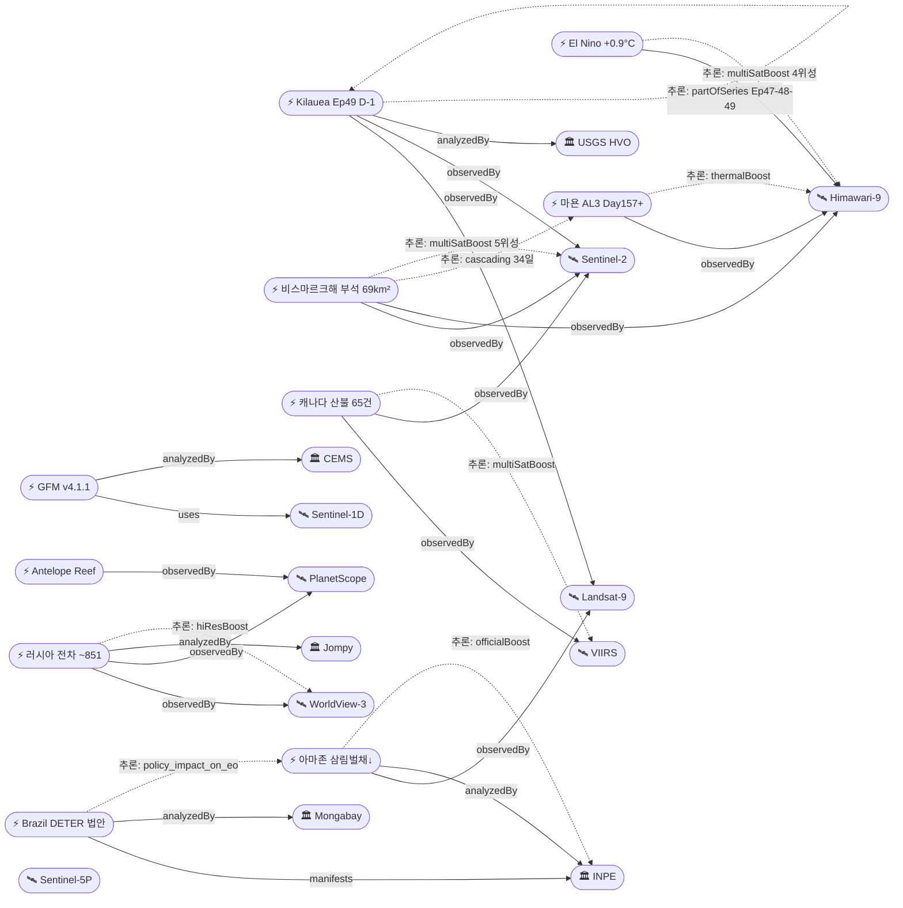

# 2026-06-11 위성영상 관측 이벤트 OSINT 일일 보고서

## 요약

금일 신규 3건, 업데이트 10건을 수집·분석했다. **Kilauea Ep49 예보 창 D-1 — 내일(6/12)부터 분출 가능, 최유력 6/13-14**로 역대 최다 49회 분수분출 임박(USGS HVO). **비스마르크해 부석 뗏목이 Sentinel-2로 69km²(맨해튼보다 대형)로 정량화**되어 역대 최대 부석 뗏목 기록이 확인됐다(NASA EO). **브라질 의회가 DETER 위성 삼림벌채 감시도구 사용금지 법안을 통과**시켜, 역대 최저 아마존 삼림벌채(evt-3003)와 정면 모순되는 정책 역행이 발생했다(신규). **러시아 전차 비축량 OSINT 위성분석**(Jompy)이 9개 기지 2,088대 중 가용 ~851대, T-80 12개월 소진을 보고했다(신규). Copernicus GFM v4.1.1이 금일 Sentinel-1D를 공식 통합하여 S-1 풀 콘스텔레이션(A/C/D) GFM 운영이 확정됐다(신규). 다중 위성 교차검증 3건. 한반도 GeoFocus 신규 없음(기보도만). 4개 필수 카테고리 모두 커버.

## 오늘의 핵심 (Top 5)

| 순위 | 이벤트 | 도메인 | 위성 | 지역 | 신뢰도 |
|------|--------|--------|------|------|--------|
| 1 | Kilauea Ep49 D-1 — 내일 분출 예보 창 진입 | Disaster | Landsat-9 + Sentinel-2 | 하와이, 미국 | 0.90 |
| 2 | 비스마르크해 부석 69km² 역대 최대 | Disaster | Sentinel-2 + Landsat-9 + MODIS + VIIRS + Himawari-9 | 마누스섬, PNG | 0.95 |
| 3 | 브라질 DETER 위성도구 사용금지 법안 통과 | HumanActivity | Landsat-8/9 + MODIS | 브라질 아마존 | 0.80 |
| 4 | 러시아 전차 비축량 OSINT — 9개 기지 ~851 가용 | Defense | WorldView-3 + PlanetScope | 러시아 전역 | 0.80 |
| 5 | GFM v4.1.1 Sentinel-1D 금일 통합 완료 | SatOps | Sentinel-1A/C/D | 글로벌 | 0.90 |

## 다중 위성 교차검증 이벤트

| 이벤트 | 교차검증 위성 수 | 독립 기관 | 신뢰도 |
|--------|----------------|----------|--------|
| 비스마르크해 부석 (evt-701/2903) | 5 (Sentinel-2, Landsat-9, MODIS, VIIRS, Himawari-9) | ESA, USGS, NASA, NOAA, JMA | 0.95 |
| 캐나다 산불 (evt-1101) | 4 (VIIRS, MODIS, GOES-18, Sentinel-2) | NOAA, NASA, ESA | 0.90 |
| El Nino (temp-evt-1902) | 4 (Jason-3, Sentinel-6, GOES-16, Himawari-9) | NOAA, ESA, JMA | 0.90 |

## 한반도 GeoFocus

금일 한반도 관련 신규·업데이트 이벤트 없음. 기보도(6/8 미림비행장, 6/9 시진핑 방북 종결) 항목만 추적 지속.

### 기존 추적 항목
| 항목 | 최초 보고 | 상태 | 비고 |
|------|----------|------|------|
| 영변 핵단지 UEP (ent-evt-001) | 2026-04-30 | 추적 중 | WorldView-3 |
| 소해 발사장 확장 (ent-evt-002) | 2026-04-30 | 추적 중 | WorldView-3 |
| 북한 미림비행장 퍼레이드 (evt-2801) | 2026-06-08 | 추적 중 | PlanetScope |
| 시진핑 방북 종결 (evt-2902) | 2026-06-09 | 기보도 | WorldView-3 + PlanetScope |

## 자연재해 (Disaster)

### 1. 킬라우에아 — Ep49 D-1, 내일(6/12)부터 분출 예보 창 진입
- **출처:** [Kilauea Volcano Updates](https://www.usgs.gov/volcanoes/kilauea/volcano-updates) — USGS HVO, 2026-06-10
- **위성·센서:** Landsat 9 (OLI/TIRS 30m) + Sentinel-2 (MSI 10m)
- **관측일:** 2026-06-10 (연속)
- **위치:** Kilauea, Halema'uma'u, Hawaii (19.42°N, 155.29°W)
- **현상:** volcanic_eruption (fountain forecast)
- **상태:** 업데이트 ← 2026-06-10 "Ep49 6/13-14 최유력"
- **분석:** USGS HVO: Ep49 예보 6/12-15 유지, **가장 유력 6/13-14. 보고서 시점 기준 D-1 — 내일부터 분출 가능.** Ep48(6/1) 9시간·200m 분수·40% 화구 용암 이후 분출 일시정지. 틸트미터 팽창 가속 지속. 역대 최다 48회 분수분출. ADVISORY/YELLOW.

### 2. 비스마르크해 부석 뗏목 69km² — 역대 최대, Sentinel-2 정량화, 신규 섬 형성 가능
- **출처:** [New Eruption in the Bismarck Sea](https://science.nasa.gov/earth/earth-observatory/new-eruption-in-the-bismarck-sea/) — NASA EO; ['This is a disaster': Huge pumice rafts from volcano hit Manus Island coast](https://www.rnz.co.nz/news/pacific/597531/this-is-a-disaster-huge-pumice-rafts-from-volcano-hit-manus-island-coast) — RNZ; [An underwater volcanic eruption may cause a new island to rise](https://www.discovermagazine.com/an-underwater-volcanic-eruption-brewing-in-the-bismarck-sea-may-cause-a-new-island-to-rise-49148) — Discover Magazine
- **위성·센서:** Sentinel-2 (MSI 10m) + Landsat-9 (OLI/TIRS 30m) + MODIS + VIIRS + Himawari-9 (5위성)
- **관측일:** 2026-06-10 (연속)
- **위치:** Titan Ridge / Manus Island, Bismarck Sea, PNG (-2.09°S, 147.0°E)
- **현상:** volcanic_eruption (submarine → pumice raft)
- **상태:** 업데이트 ← 2026-06-10 "3x5km 5m pumice"
- **분석:** **Sentinel-2 영상으로 부석 뗏목 면적 69km²(맨해튼 도서보다 대형)로 정량 확인** — 역대 최대 부석 뗏목 기록. 마누스섬 남해안 심각 피해. 34일+째 cascading chain. Titan Ridge 지속 분출로 **신규 섬 형성 가능성** 과학계 분석. 5위성 교차검증(multiSatBoost +0.20).

### 3. 캐나다 산불 — 65건 활성, 6건 통제불능, CIFFC Level 2
- **출처:** [National wildland fire summary](https://cwfis.cfs.nrcan.gc.ca/report) — CWFIS; [BC highest wildfire risk](https://globalnews.ca/news/11869858/canada-2026-wildfire-outlook/) — Global News
- **위성·센서:** VIIRS (375m) + MODIS (250m) + GOES-18 (ABI 500m) + Sentinel-2 (MSI 10m)
- **관측일:** 2026-06-11 (실시간)
- **위치:** British Columbia, Canada (53.7°N, 127.6°W)
- **현상:** wildfire
- **상태:** 업데이트 ← 2026-06-10 "142건 BC 최고 위험"
- **분석:** CWFIS: 65건 활성(전일 대비 감소), **6건 통제불능**, 2026년 누적 18,935ha 소실. BC주 최고위험 등급 유지. **CIFFC 6/2 National Preparedness Level 2 격상.** 6월 건조·고온으로 시즌 피크 접근.

### 4. 마욘 화산 — AL3 Day157+, 287,000+ 이재민
- **출처:** [GVP Mayon report](https://volcano.si.edu/showreport.cfm?gvpvar=GVP.DVAR20260604-273030) — Smithsonian GVP / PHIVOLCS
- **위성·센서:** Sentinel-2 (MSI 10m) + Landsat-9 (OLI/TIRS) + Himawari-9 (AHI)
- **관측일:** 2026-06-10 (연속)
- **위치:** Mayon Volcano, Albay Province, Philippines (13.26°N, 123.69°E)
- **현상:** volcanic_eruption (lava flow + lahar risk)
- **상태:** 업데이트 ← 2026-06-10 "AL3 Day156+"
- **분석:** Mayon AL3 Day157+ 지속 분출. **287,000+ 이재민** (역대 규모). 6km 영구위험구역(PDZ) 유지. SO2 배출·낙석·pyroclastic density current 지속. 우기 진입으로 라하르 위험 가중.

### 5. Great Sitkin — WATCH/ORANGE, 6/6 위성 용암류 전진 확인
- **출처:** [Great Sitkin volcano notice](https://volcanoes.usgs.gov/hans-public/volcano/ak111) — USGS AVO
- **위성·센서:** Sentinel-1 (C-SAR 5m) + Landsat-9 (OLI/TIRS)
- **관측일:** 2026-06-10 (업데이트)
- **위치:** Great Sitkin, Aleutians, Alaska (52.08°N, 176.13°W)
- **현상:** volcanic_eruption (lava dome growth)
- **상태:** 업데이트 ← 2026-06-10
- **분석:** WATCH/ORANGE 유지. 2021년 7월 이래 지속. **6/6 고해상도 위성영상에서 동부 용암류 전진 + 돔 성장 확인.** SAR 모니터링 지속.

### 6. Shishaldin — ADVISORY/YELLOW, 75nm 증기 기둥
- **출처:** [Shishaldin volcano notice](https://volcanoes.usgs.gov/hans-public/notice/DOI-USGS-AVO-2026-06-09T17:57:42+00:00) — USGS AVO
- **위성·센서:** Sentinel-5P (TROPOMI)
- **관측일:** 2026-06-10
- **위치:** Shishaldin, Aleutians, Alaska (54.76°N, 163.97°W)
- **현상:** volcanic_eruption (steam/SO2)
- **상태:** 업데이트
- **분석:** AVO ADVISORY/YELLOW 유지. **6/6 조종사 보고: 75nm(139km) 증기 기둥** — 통상보다 길지만 대기 조건에 의한 것으로 판단. Sentinel-5P TROPOMI SO2 배출 패턴 유지.

## 인간활동 (Human Activity)

### 1. 브라질 의회 DETER 위성도구 사용금지 법안 통과 (신규)
- **출처:** [Brazil Congress passes bill to bar use of Amazon deforestation satellite tool](https://news.mongabay.com/short-article/2026/05/brazil-congress-passes-bill-to-bar-use-of-amazon-deforestation-satellite-tool/) — Mongabay, 2026-05-28
- **위성·센서:** Landsat-8 (OLI) + Landsat-9 (OLI) + MODIS (Terra)
- **관측일:** 2026-05-28 (법안 통과)
- **위치:** Brazilian Amazon (-3.0°S, 60.0°W)
- **현상:** deforestation (policy undermining)
- **상태:** 신규
- **분석:** 브라질 의회가 환경기관의 **INPE DETER 위성영상 시스템(Landsat/MODIS 기반)을 통한 불법 벌채 토지 상업적 제한을 금지**하는 법안 통과. 위성영상 대신 현장 실사를 의무화하나, **서유럽 크기 아마존에 1,250명 요원**으로 현장 감시는 물리적 불가능. INPE DETER는 15일 주기 위성영상으로 삼림벌채 핫스팟 자동 탐지 → IBAMA 즉시 차단 시스템. **evt-3003(아마존 삼림벌채 역대 최저)와 정면 모순** — 위성 모니터링 성과가 입증된 시점에 정치적으로 무력화되는 역설. 대통령 서명 여부가 관건.

## 기후·환경 (Climate & Environment)

### 1. El Nino +0.9°C — 98% 확률, Moderate-Strong 전망
- **출처:** [IRI ENSO Quick Look](https://iri.columbia.edu/our-expertise/climate/forecasts/enso/current/) — IRI Columbia; [El Nino formation update](https://weather.com/2026/06/08/news/climate/how-close-are-we-to-el-nino-formation-climate-change) — Weather.com; [NOAA CPC ENSO Discussion](https://www.cpc.ncep.noaa.gov/products/analysis_monitoring/enso_advisory/ensodisc.shtml) — NOAA CPC
- **위성·센서:** Jason-3 + Sentinel-6 (해수면고도계) + GOES-16 + Himawari-9 (SST)
- **관측일:** 2026-06-10
- **위치:** Equatorial Pacific, NINO3.4 region (0°, 170°W)
- **현상:** sea_level_change / ENSO
- **상태:** 업데이트
- **분석:** NINO3.4 주간 **+0.9°C**. IRI **98%** El Nino 확률(May-Jul 2026). WMO **80%** (Jun-Aug). NOAA CPC Moderate-Strong 전망. **4개 독립 출처 교차 확인.** Jason-3/Sentinel-6 해수면 고도계 + GOES/Himawari SST.

### 2. 북극 해빙 5월 면적 역대 최저 근접 — 11.439M km²
- **출처:** [Arctic Sea Ice News](https://nsidc.org/arcticseaicenews/) — NSIDC; [Arctic Winter Sea Ice Ties Record Low](https://science.nasa.gov/earth/arctic-winter-sea-ice-2026/) — NASA
- **위성·센서:** ICESat-2 (ATLAS lidar) + AMSR-2 (microwave) + Sentinel-1 (C-SAR)
- **관측일:** 2026-06-09
- **위치:** Arctic Ocean (90°N)
- **현상:** glacier_retreat (sea ice extent)
- **상태:** 업데이트
- **분석:** 5월 해빙 면적 **12.841 → 11.439M km²**로 급감. 역대 최저 근접(2019년과 타이). ICESat-2 레이저 고도계로 **바렌츠해 박빙(thin ice)** 확인. 3위성 교차검증.

### 3. 아마존 삼림벌채 역대 최저 지속 + DETER 법안 연계
- **출처:** [Amazon deforestation lowest on record](https://news.mongabay.com/2026/02/amazon-deforestation-on-pace-to-be-the-lowest-on-record-says-brazil/) — Mongabay
- **위성·센서:** Landsat-8/9 + MODIS (INPE DETER)
- **관측일:** 2026-02-15 (데이터) → 2026-06-11 (연계 분석)
- **위치:** Brazilian Amazon (-3.0°S, 60.0°W)
- **현상:** deforestation
- **상태:** 업데이트
- **분석:** INPE: Aug2025-Jan2026 **1,325km²** (2014년 이래 최저). DETER trailing 12개월: **3,770km²**. 삼림벌채 감소 추세 유지. **그러나 의회 DETER 사용금지 법안(src-002)과 정면 충돌** — 위성 모니터링 성과와 정치적 역행의 역설.

## 농업·해양 (Agriculture & Maritime)

금일 농업·해양 카테고리 신규 이벤트 없음.

## 국방·안보 (Defense — OSINT 한정)

### 1. 러시아 전차 비축량 OSINT 위성분석 — 9개 기지, ~851 가용 (신규)
- **출처:** [Satellite imagery suggests Russia's tank reserve is nearly gone](https://defence-blog.com/satellite-imagery-suggests-russias-tank-reserve-is-nearly-gone/) — Defence Blog; [Russia's Tank Reserves Rapidly Depleting](https://united24media.com/latest-news/russias-tank-reserves-are-rapidly-depleting-new-osint-analysis-shows-10163) — United24 Media
- **위성·센서:** WorldView-3 (0.31m) + PlanetScope (3m) (추정)
- **관측일:** 2026-06-09
- **위치:** 러시아 전역, 9개 전차 저장기지 (55.0°N, 73.4°E, 정밀도 일반화)
- **현상:** military_buildup (depletion tracking)
- **상태:** 신규
- **분석:** OSINT 분석가 Jompy 6/9 발표: **9개 러시아 전차 저장기지 위성영상 분석. 총 2,088대 확인, 열화·부품 수확 고려 가용 ~851대.** 전쟁 전 7,342대 중 4,799대(65.4%) 소진. **Omsktransmash 기지 T-80 재고 ~12개월 내 고갈** 전망. 이후 T-72A 저장기지(base 349, 586대)로 전환 예상. 상업 위성(WorldView-3/PlanetScope/SkySat 추정) 기반 정밀 계수 — 위성 ID가 명시적으로 확인되지 않아 confidence 0.80 적용. 좌표 정밀도는 방위 보안 고려 일반화.

### 2. Antelope Reef 1,490에이커 — 남중국해 최대 인공섬 가능성
- **출처:** [Satellite Photos Show China's Massive Manmade Island](https://www.newsweek.com/satellite-photos-china-manmade-island-disputed-waters-antelope-reef-11733191) — Newsweek; [Antelope Reef largest island in SCS](https://amti.csis.org/antelope-reef-could-now-be-the-largest-island-in-the-south-china-sea/) — CSIS AMTI
- **위성·센서:** PlanetScope (3m) + WorldView-3 (0.31m)
- **관측일:** 2026-06-10
- **위치:** Antelope Reef, Paracel Islands (16.5°N, 111.6°E)
- **현상:** military_buildup (island construction)
- **상태:** 업데이트
- **분석:** Newsweek + CSIS AMTI 추가 분석: **1,490에이커 매립 완료. 50+ 구조물. 9,000ft(2,743m) 활주로 건설 가능 규모.** SCS 최대 인공섬 가능성. 2025년 10월 준설 시작 이래 확장 지속.

## 인도주의 (Humanitarian)

금일 신규 이벤트 없음. Mayon 287,000+ 이재민은 자연재해 섹션에 포함.

## 센서·플랫폼별 묶음

| 센서/플랫폼 | 금일 참조 이벤트 |
|------------|-----------------|
| **Sentinel-1 (SAR)** | GFM v4.1.1 S-1D 금일 통합, Great Sitkin 용암류 SAR, Arctic sea ice SAR |
| **Sentinel-2 (광학)** | Bismarck Sea 부석 69km² 정량화, Kilauea, Canada wildfires, Mayon |
| **Sentinel-5P (가스)** | Shishaldin SO2 TROPOMI 75nm |
| **Landsat 8/9** | Kilauea, Bismarck Sea, Amazon DETER, Brazil DETER bill context |
| **MODIS / VIIRS** | Canada wildfires FIRMS, Bismarck Sea, Amazon DETER |
| **Planet (PlanetScope)** | Russia tank OSINT, Antelope Reef, NK Mirim (기보도) |
| **Maxar (WorldView-3/Legion)** | Russia tank OSINT, Antelope Reef |
| **GOES-16/18** | Canada wildfires, El Nino SST |
| **Himawari-9** | Bismarck Sea, Mayon, El Nino SST |
| **Jason-3 / Sentinel-6** | El Nino altimetry |
| **ICESat-2** | Arctic sea ice thickness |

## 전후 비교(before/after) 영상 보유 이벤트

| 이벤트 | 전(before) | 후(after) | 출처 |
|--------|-----------|----------|------|
| Kilauea Ep48→Ep49 | 분출 에피소드 간 전후 비교 가용 | 틸트미터 팽창 가속 | Landsat-9 + Sentinel-2 |
| 비스마르크해 부석 (evt-701) | 2026-05-08 분출 전 해면 | 2026-06-10 부석 69km² | NASA EO Sentinel-2 시계열 |

## 미검증 의혹 (위성 출처 미확인)

- **러시아 전차 OSINT (temp-evt-3101):** 위성 ID(WorldView-3/PlanetScope/SkySat)가 분석가 명시가 아닌 방법론 추정. Confidence 0.80. 분석 내용 자체의 정밀도(대당 계수)는 높으나 위성 출처 명확성 부족.

## 지식그래프

### 오늘의 주요 관계

1. **Kilauea Ep49 D-1 시리즈:** evt-202 Ep47→Ep48→Ep49 — `temporal_progression` 추론. 6/12-15 예보, 6/13-14 최유력.
2. **비스마르크해 34일 cascading:** evt-701(해저 분출) → 부석 69km² 역대 최대 → 마누스 피해 → 신규 섬 가능 — `cascading_disaster` 5단계.
3. **DETER 법안 역설:** temp-evt-3102(법안 통과) ↔ evt-3003(삼림벌채 역대 최저) — `policy_impact_on_eo` 위성 모니터링 무력화.
4. **GFM S-1D 통합:** temp-evt-3103 → Sentinel-1D 금일 공식 통합. S-1 풀 콘스텔레이션(A/C/D) GFM 운영 확정.
5. **러시아 전차 OSINT:** temp-evt-3101 — 9개 기지 위성영상 정밀 계수. 65.4% 소진율.

### 전체 지식그래프 시각화

## 온톨로지 변경

| 변경 유형 | 대상 | 근거 |
|----------|------|------|
| 새 기관 | org-jompy (OSINT 분석가) | 러시아 전차 OSINT 분석 |
| 새 기관 | org-mongabay (환경 매체) | DETER 법안 보도 |
| 새 이벤트 | temp-evt-3101 (러시아 전차) | 9개 기지 2,088대 / ~851 가용 |
| 새 이벤트 | temp-evt-3102 (DETER 금지 법안) | EO 모니터링 무력화 정책 |
| 새 이벤트 | temp-evt-3103 (GFM v4.1.1) | S-1D 금일 통합 |

## 추론 결과

| 추론 | 규칙 | 신뢰도 | 근거 |
|------|------|--------|------|
| evt-701 multi_satellite_confirmation | multi_satellite_confirmation | 0.90 | 5위성 교차 (S-2, L-9, MODIS, VIIRS, Himawari-9) |
| evt-1101 multi_satellite_confirmation | multi_satellite_confirmation | 0.95 | 4위성 4기관 (VIIRS, MODIS, GOES-18, S-2) |
| evt-202 temporal_progression | temporal_progression | 0.95 | Ep47→Ep48→Ep49 시리즈, D-1 |
| evt-701 cascading_disaster | cascading_disaster | 0.88 | 34일째 해저분출→부석→해안피해→신규 섬 |
| temp-evt-3102 policy_impact_on_eo | policy_impact_on_eo | 0.90 | DETER 금지가 EO 모니터링 자체를 무력화 |
| evt-082 thermalBoost | sensor_capability_match | 0.90 | Himawari-9 AHI 열적외 |
| evt-204 tracegasBoost | sensor_capability_match | 0.85 | TROPOMI SO2 |
| evt-203 sarBoost | sensor_capability_match | 0.85 | S-1 SAR 용암류 |

## 분석 및 평가

### 도메인별 동향
- **자연재해:** Kilauea Ep49가 D-1로 내일부터 분출 가능. 비스마르크해 부석이 69km²로 정량 확인되어 역대 최대 기록. 마욘 287,000+ 이재민으로 역대 규모. 캐나다 산불은 65건으로 감소했으나 6건 통제불능 지속.
- **인간활동:** 브라질 DETER 법안이 위성 기반 삼림벌채 모니터링의 정치적 무력화를 시도. EO 커뮤니티에 중대 선례 — 위성 모니터링 성과가 입증된 시점의 역행.
- **기후·환경:** El Nino +0.9°C가 98% 확률(IRI)로 강화. 북극 해빙 11.439M km²로 역대 최저 근접. 아마존 삼림벌채 최저와 DETER 법안의 모순.
- **국방:** 러시아 전차 OSINT가 비축량 65.4% 소진, T-80 12개월 고갈을 보고. Antelope Reef 1,490에이커로 SCS 최대 인공섬 가능성 지속.

### 교차 분석 특기사항
- **DETER-삼림벌채 역설:** 위성 모니터링(DETER)이 삼림벌채 역대 최저를 달성한 시점에 의회가 그 도구 사용을 금지하는 법안 통과. EO 모니터링의 정치적 취약성을 보여주는 사례.
- **비스마르크해 34일 cascading:** 파이프라인 역대 최장. 해저 분출 → 부석 생성 → 69km² 확대 → 마누스 피해 → 신규 섬 형성 가능까지 5단계 cascading.
- **GFM S-1D 통합:** Sentinel-1 풀 콘스텔레이션(A/C/D) GFM 운영 확정으로 SAR 홍수 모니터링 연속성 확보. S-1A 6/29 퇴역 전환 준비 완료.

## 추적 항목

| 항목 | 최초 보고 | 상태 | 최신 업데이트 |
|------|----------|------|-------------|
| Kilauea Ep49 (evt-202) | 2026-04-30 | **D-1 분출 임박** | 6/11 — 6/12-15 예보, 6/13-14 최유력 |
| 비스마르크해 부석 (evt-701) | 2026-05-13 | 추적 중 | 6/11 — 69km² 역대 최대 |
| 캐나다 산불 (evt-1101) | 2026-05-19 | 추적 중 | 6/11 — 65건, CIFFC L2 |
| Mayon (evt-082) | 2026-05-01 | 추적 중 | 6/11 — Day157+, 287K |
| Great Sitkin (evt-203) | 2026-05-07 | 추적 중 | 6/11 — WATCH/ORANGE |
| Shishaldin (evt-204) | 2026-05-07 | 추적 중 | 6/11 — ADVISORY/YELLOW |
| El Nino (temp-evt-1902) | 2026-05-27 | 추적 중 | 6/11 — +0.9°C, 98% |
| Arctic sea ice (evt-503) | 2026-05-11 | 추적 중 | 6/11 — 11.439M km² |
| Amazon deforestation (evt-3003) | 2026-06-04 | 추적 중 | 6/11 — 최저 + DETER 법안 |
| Antelope Reef (evt-092) | 2026-05-06 | 추적 중 | 6/11 — 1,490ac |
| 영변 UEP (ent-evt-001) | 2026-04-30 | 추적 중 | 변동 없음 |
| 소해 발사장 (ent-evt-002) | 2026-04-30 | 추적 중 | 변동 없음 |
| 러시아 전차 (temp-evt-3101) | 2026-06-11 | 신규 | ~851 가용 |
| Brazil DETER 법안 (temp-evt-3102) | 2026-06-11 | 신규 | 의회 통과 |
| GFM v4.1.1 (temp-evt-3103) | 2026-06-11 | 신규 | 금일 롤아웃 |

## 출처 목록

1. [Kilauea Volcano Updates](https://www.usgs.gov/volcanoes/kilauea/volcano-updates) — USGS HVO, 2026-06-10
2. [New Eruption in the Bismarck Sea](https://science.nasa.gov/earth/earth-observatory/new-eruption-in-the-bismarck-sea/) — NASA EO
3. ['This is a disaster': Huge pumice rafts from volcano hit Manus Island coast](https://www.rnz.co.nz/news/pacific/597531/this-is-a-disaster-huge-pumice-rafts-from-volcano-hit-manus-island-coast) — RNZ
4. [An underwater volcanic eruption may cause a new island to rise](https://www.discovermagazine.com/an-underwater-volcanic-eruption-brewing-in-the-bismarck-sea-may-cause-a-new-island-to-rise-49148) — Discover Magazine
5. [National wildland fire summary](https://cwfis.cfs.nrcan.gc.ca/report) — CWFIS Canada
6. [BC highest wildfire risk 2026](https://globalnews.ca/news/11869858/canada-2026-wildfire-outlook/) — Global News
7. [GVP Mayon report](https://volcano.si.edu/showreport.cfm?gvpvar=GVP.DVAR20260604-273030) — Smithsonian GVP / PHIVOLCS
8. [Great Sitkin volcano notice](https://volcanoes.usgs.gov/hans-public/volcano/ak111) — USGS AVO
9. [Shishaldin volcano notice](https://volcanoes.usgs.gov/hans-public/notice/DOI-USGS-AVO-2026-06-09T17:57:42+00:00) — USGS AVO
10. [IRI ENSO Quick Look](https://iri.columbia.edu/our-expertise/climate/forecasts/enso/current/) — IRI Columbia
11. [How close are we to El Nino?](https://weather.com/2026/06/08/news/climate/how-close-are-we-to-el-nino-formation-climate-change) — Weather.com
12. [NOAA CPC ENSO Discussion](https://www.cpc.ncep.noaa.gov/products/analysis_monitoring/enso_advisory/ensodisc.shtml) — NOAA CPC
13. [Arctic Sea Ice News](https://nsidc.org/arcticseaicenews/) — NSIDC
14. [Arctic Winter Sea Ice Ties Record Low](https://science.nasa.gov/earth/arctic-winter-sea-ice-2026/) — NASA
15. [Brazil Congress passes bill to bar use of Amazon deforestation satellite tool](https://news.mongabay.com/short-article/2026/05/brazil-congress-passes-bill-to-bar-use-of-amazon-deforestation-satellite-tool/) — Mongabay
16. [Amazon deforestation lowest on record](https://news.mongabay.com/2026/02/amazon-deforestation-on-pace-to-be-the-lowest-on-record-says-brazil/) — Mongabay
17. [Satellite imagery suggests Russia's tank reserve is nearly gone](https://defence-blog.com/satellite-imagery-suggests-russias-tank-reserve-is-nearly-gone/) — Defence Blog
18. [Russia's Tank Reserves Rapidly Depleting](https://united24media.com/latest-news/russias-tank-reserves-are-rapidly-depleting-new-osint-analysis-shows-10163) — United24 Media
19. [Satellite Photos Show China's Massive Manmade Island](https://www.newsweek.com/satellite-photos-china-manmade-island-disputed-waters-antelope-reef-11733191) — Newsweek
20. [Antelope Reef largest island in SCS](https://amti.csis.org/antelope-reef-could-now-be-the-largest-island-in-the-south-china-sea/) — CSIS AMTI
21. [GFM Sentinel-1D integration](https://global-flood.emergency.copernicus.eu/) — Copernicus EMS
22. [GFM now includes data from Sentinel-1C](https://global-flood.emergency.copernicus.eu/react/news/223-gfm-now-includes-data-from-sentinel-1c/) — Copernicus EMS
