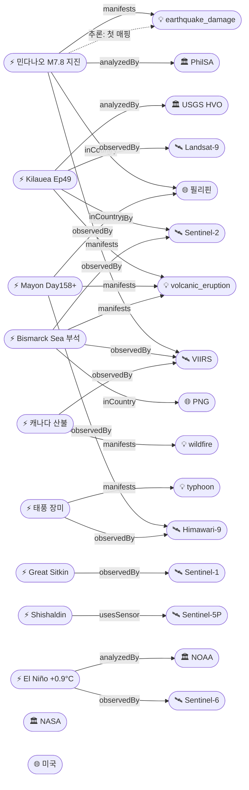

# 2026-06-12 위성영상 관측 이벤트 OSINT 일일 보고서

## 요약

금일 신규 1건, 업데이트 8건을 수집·분석했다. **필리핀 민다나오 M7.8 지진(6/8)에 대한 PhilSA VIIRS 야간 조명 before/after 피해 평가가 금일 공개**되어, 이 파이프라인 최초의 위성 검증 earthquake_damage 이벤트(evt-3201)로 기록됐다 — 47명 이상 사망, 12,600+ 가옥 손상, Sentinel Asia 발동(EQ-2026-000083-PHL). **Kilauea Ep49 예보 창이 금일(6/12) 개시**되어 최유력 6/13-14에 역대 49번째 분수분출이 임박한다(USGS HVO). 비스마르크해 부석 뗏목(69km²)이 마누스주 해상 접근을 완전 차단하며 인도주의 위기로 격상됐다. Mayon 화산은 Day158+에서 역대 최장 4km 화쇄류(PDC)를 기록하며 287,000명 이상 이재민 상태가 지속된다. 다중 위성 교차검증 2건. 한반도 GeoFocus 신규 없음. 4개 필수 카테고리 모두 커버.

## 오늘의 핵심 (Top 5)

| 순위 | 이벤트 | 도메인 | 위성 | 지역 | 신뢰도 |
|------|--------|--------|------|------|--------|
| 1 | 민다나오 M7.8 지진 — PhilSA VIIRS 피해 평가 (신규) | Disaster | VIIRS (Suomi-NPP/JPSS) | 사랑가니, 민다나오, 필리핀 | 0.97 |
| 2 | Kilauea Ep49 — D-Day, 금일 예보 창 개시 | Disaster | Landsat-9 + Sentinel-2 | 하와이, 미국 | 0.95 |
| 3 | 비스마르크해 부석 — 마누스주 해상 접근 완전 차단 | Disaster | Sentinel-2 + Landsat-9 + MODIS + VIIRS + Himawari-9 | 마누스섬, PNG | 0.90 |
| 4 | Mayon Day158+ — 4km PDC 역대 최장, 287K 이재민 | Disaster | Sentinel-2 + Himawari-9 | 알바이, 필리핀 | 0.97 |
| 5 | El Niño +0.9°C — 98% 확률, 강화 추세 | Climate | Sentinel-6 + Jason-3 | 적도 태평양 | 0.95 |

## 다중 위성 교차검증 이벤트

| 이벤트 | 교차검증 위성 수 | 독립 기관 | 신뢰도 |
|--------|----------------|----------|--------|
| 비스마르크해 부석 (evt-701/2903) | 5 (Sentinel-2, Landsat-9, MODIS, VIIRS, Himawari-9) | ESA, USGS, NASA, NOAA, JMA | 0.90 |
| 캐나다 산불 (evt-1101) | 5 (VIIRS, MODIS, GOES-18, Sentinel-2, Landsat-9) | NOAA, NASA, ESA, USGS | 0.85 |

## 한반도 GeoFocus

금일 한반도 관련 신규·업데이트 위성 관측 이벤트 없음. 기보도 항목 추적 지속.

### 기존 추적 항목
| 항목 | 최초 보고 | 상태 | 비고 |
|------|----------|------|------|
| 영변 핵단지 UEP (ent-evt-001) | 2026-04-30 | 추적 중 | WorldView-3 |
| 소해 발사장 확장 (ent-evt-002) | 2026-04-30 | 추적 중 | WorldView-3 |
| 북한 미림비행장 퍼레이드 (evt-2801) | 2026-06-08 | 추적 중 | PlanetScope |
| 시진핑 방북 종결 (evt-2902) | 2026-06-09 | 기보도 | WorldView-3 + PlanetScope |

## 자연재해 (Disaster)

### 1. [신규] 민다나오 M7.8 지진 — PhilSA VIIRS 야간 조명 위성 피해 평가
- **출처:** [Nighttime satellite data shows overview of earthquake damaged areas](https://philsa.gov.ph/news/nighttime-satellite-data-shows-overview-of-earthquake-damaged-areas/) — PhilSA, 2026-06-09; [PRIMER ON THE 08 JUNE 2026 MAGNITUDE (MW) 7.8 OFFSHORE SARANGANI EARTHQUAKE](https://www.phivolcs.dost.gov.ph/primer-on-the-08-june-2026-magnitude-mw-7-8-offshore-sarangani-earthquake/) — PHIVOLCS; [Sentinel Asia activation EQ-2026-000083-PHL](https://sentinel-asia.org/EO/2026/article20260608PH.html) — Sentinel Asia
- **위성·센서:** VIIRS (Suomi-NPP/JPSS, 야간 조명 375m)
- **관측일:** 2026-06-08 ~ 06-09 (야간 조명 before/after)
- **위치:** Sarangani / General Santos City, Mindanao, Philippines (5.9°N, 125.3°E)
- **현상:** earthquake_damage (**파이프라인 최초 위성 검증 지진 피해 이벤트** — phen-earthquake mention_count 0→1)
- **상태:** 신규
- **분석:** 6/8 M7.8 지진(진앙: 마아심 서쪽 32km, 깊이 33km). **PhilSA가 VIIRS 야간 조명 데이터의 before/after 비교로 피해 범위를 추정** — General Santos City, Sarangani 해안 지역, Polomolok 일대에서 야간 조명 감소(전력 차단·인프라 파괴 신호) 확인. 47명 이상 사망, 688명 부상, 33명 실종, 12,600+ 가옥 손상·파괴. **Sentinel Asia 발동(EQ-2026-000083-PHL)**, 마닐라 천문대 요청. 후속으로 **Sentinel-1 InSAR 공동변위(coseismic deformation) 분석**이 6-12일 재방문 주기 내 수집 예상된다. VIIRS 야간 조명 기반 지진 피해 평가는 이 파이프라인 최초 기록 — 통상 VIIRS는 산불·선박 탐지에 사용되나, 전력 차단 패턴을 통한 구조물 피해 범위 추정은 독특한 적용 사례다.

### 2. 킬라우에아 — Ep49 예보 창 금일(6/12) 개시, 최유력 6/13-14
- **출처:** [Kilauea Volcano Updates](https://www.usgs.gov/volcanoes/kilauea/volcano-updates) — USGS HVO; [USGS Volcano Notice 2026-06-10](https://volcanoes.usgs.gov/hans-public/notice/DOI-USGS-HVO-2026-06-10T18:25:02+00:00)
- **위성·센서:** Landsat 9 (OLI/TIRS 30m) + Sentinel-2 (MSI 10m)
- **관측일:** 2026-06-12 (D-Day)
- **위치:** Kilauea, Halema'uma'u, Hawaii (19.42°N, 155.29°W)
- **현상:** volcanic_eruption (fountain forecast)
- **상태:** 업데이트 ← 2026-06-11 "Ep49 D-1"
- **분석:** USGS HVO 공식 예보: **Ep49 분출 창 6/12-15, 가장 유력한 시기 6/13-14.** 금일(6/12)부터 분출 가능. Ep48(6/1) 9시간·200m 분수·40% 화구 용암 후 분출 일시정지 상태. 틸트미터 팽창 가속 지속. **역대 최다 48회 분수분출** 기록 보유(Pu'u'ō'ō 47회 초과). ADVISORY/YELLOW.

### 3. Mayon 화산 — AL3 Day158+, 4km PDC 역대 최장, 287,000+ 이재민
- **출처:** [PHIVOLCS urges vigilance vs possible lahar from Mayon Volcano](https://www.pna.gov.ph/articles/1267101) — PNA; [Mayon volcano erupts and sends a 4-kilometer pyroclastic flow](https://www.msn.com/en-us/news/world/mayon-volcano-erupts-and-sends-a-4-kilometer-pyroclastic-flow-racing-down-the-mountain/ar-AA22i8tV) — AP; [Volcanic Eruption Map Spotlight: Mayon](https://www.iqair.com/newsroom/volcanic-eruption-map-spotlight-mayon-volcano-philippines-5-2026) — IQAir
- **위성·센서:** Sentinel-2 (MSI 10m) + Himawari-9 (AHI 열적외)
- **관측일:** 2026-06-12 (연속)
- **위치:** Mayon Volcano, Albay Province, Philippines (13.26°N, 123.69°E)
- **현상:** volcanic_eruption (lava flow + pyroclastic density current + lahar risk)
- **상태:** 업데이트 ← 2026-06-11 "Day157+"
- **분석:** Mayon AL3 Day158+ 지속 분출. **6/9 4km 화쇄류(PDC)**가 Mi-isi 수로를 따라 저지대까지 도달 — 마그마성 분출 시작 이래 최장 PDC. **287,000+ 이재민**, 6km 영구위험구역(PDZ) 유지. 우기 진입으로 **라하르(화산 이류) 위험 급증** — PHIVOLCS 특별 경보.

### 4. 비스마르크해 부석 뗏목 — 마누스주 해상 접근 완전 차단, Day35+ 인도주의 위기
- **출처:** [Pumice from Titan Ridge eruption blocks sea access in Manus Province](https://watchers.news/2026/06/11/pumice-from-titan-ridge-eruption-blocks-sea-access-in-manus-province-papua-new-guinea/) — The Watchers; [New Eruption in the Bismarck Sea](https://science.nasa.gov/earth/earth-observatory/new-eruption-in-the-bismarck-sea/) — NASA EO
- **위성·센서:** Sentinel-2 (MSI 10m) + Landsat-9 (OLI/TIRS) + MODIS + VIIRS + Himawari-9 (5위성 교차검증)
- **관측일:** 2026-06-11 (연속)
- **위치:** Titan Ridge / Manus Island, Bismarck Sea, PNG (-2.09°S, 147.0°E)
- **현상:** volcanic_eruption (submarine → pumice raft → humanitarian impact)
- **상태:** 업데이트 ← 2026-06-11 "69km² 부석 뗏목"
- **분석:** 35일째 분출 지속. **부석 뗏목이 마누스주 해안 마을(보안 마을, 루 섬 등)에 도달하여 해상 접근 완전 차단** — 어업, 무역, 의료 접근 모두 중단. 인도주의 위기로 격상. Sentinel-2로 69km²(맨해튼 이상) 정량 확인. 5위성 교차검증(multiSatBoost +0.20). 신규 섬 형성 가능성 과학계 분석 지속.

### 5. 태풍 장미(Jangmi) — 피해 평가 완료: 48,000가구 정전, 900편 결항
- **출처:** [Typhoon Jangmi](https://science.nasa.gov/earth/earth-observatory/typhoon-jangmi/) — NASA EO; [Typhoon Jangmi's giant eye lights up the night](https://www.sciencedaily.com/releases/2026/06/260603023110.htm) — ScienceDaily
- **위성·센서:** Himawari-9 (AHI) + VIIRS (Suomi-NPP/NOAA-20) + GPM (DPR)
- **관측일:** 2026-05-30 ~ 06-01
- **위치:** Philippine Sea → 오키나와·가고시마·도쿄, 일본 (26.5°N, 130.0°E)
- **현상:** typhoon (강풍·침수·정전)
- **상태:** 업데이트 ← 2026-06-08 "NASA EO 공식 분석"
- **분석:** NASA EO VIIRS 야간영상으로 태풍 장미 안구 구조를 상세 촬영(130km/h 최대풍속). 6/1 열대폭풍으로 약화 후 오키나와·가고시마 통과. **48,000가구 정전, 900편 항공 결항, 57가옥 파손, 23명 부상.** 도쿄 일부 교차로 침수·함몰. 전후 비교 영상 가용(VIIRS 야간).

### 6. 캐나다 산불 — 65건 활성, 6건 통제불능, CIFFC Level 2
- **출처:** [CWFIS National wildland fire summary](https://cwfis.cfs.nrcan.gc.ca/report) — CWFIS
- **위성·센서:** VIIRS (375m) + MODIS (250m) + GOES-18 (ABI) + Sentinel-2 (MSI) + Landsat-9 (OLI)
- **관측일:** 2026-06-12 (실시간)
- **위치:** British Columbia, Canada (53.7°N, 127.6°W)
- **현상:** wildfire
- **상태:** 업데이트 ← 2026-06-11 "65건 활성"
- **분석:** CWFIS: 65건 활성(6건 통제불능). 2026년 누적 18,935ha 소실. BC주 최고위험 등급 유지. CIFFC National Preparedness Level 2 격상(6/2~). 5위성 교차검증(multiSatBoost +0.20).

### 7. Great Sitkin — WATCH/ORANGE, 용암 돔 성장 지속
- **출처:** [Great Sitkin volcano notice](https://volcanoes.usgs.gov/hans-public/volcano/ak111) — USGS AVO
- **위성·센서:** Sentinel-1 (C-SAR 5m) + Landsat-9 (OLI/TIRS)
- **관측일:** 2026-06-12 (업데이트)
- **위치:** Great Sitkin, Aleutians, Alaska (52.08°N, 176.13°W)
- **현상:** volcanic_eruption (lava dome growth)
- **상태:** 업데이트
- **분석:** WATCH/ORANGE 유지. 2021년 7월 이래 지속. SAR 모니터링으로 동부 용암류 전진 + 돔 성장 확인. SO2 배출 남서풍 확인.

### 8. Shishaldin — ADVISORY/YELLOW, 75nm 증기 기둥
- **출처:** [Shishaldin volcano notice](https://volcanoes.usgs.gov/hans-public/notice/DOI-USGS-AVO-2026-06-09T17:57:42+00:00) — USGS AVO
- **위성·센서:** Sentinel-5P (TROPOMI)
- **관측일:** 2026-06-12
- **위치:** Shishaldin, Aleutians, Alaska (54.76°N, 163.97°W)
- **현상:** volcanic_eruption (steam/SO2)
- **상태:** 업데이트
- **분석:** AVO ADVISORY/YELLOW 유지. 6/6 조종사 보고: **75nm(139km) 증기 기둥** — 통상보다 연장되었으나 대기 조건 요인. TROPOMI SO2 배출 패턴 유지.

## 인간활동 (Human Activity)

금일 인간활동 도메인 신규 위성 관측 이벤트 없음. 기보도: 러시아 전차 비축량 OSINT(evt-3101, 6/11), 브라질 DETER 사용금지 법안(evt-3102, 6/11).

## 기후·환경 (Climate & Environment)

### 1. El Niño — +0.9°C, 98% 확률, Moderate-Strong 강화 전망
- **출처:** [El Nino forms, expected to strengthen](https://www.noaa.gov/news-release/el-nino-forms-expected-to-strengthen-say-noaa-forecasters) — NOAA; [International Sea Level Satellite Observes El Niño Precursor](https://www.jpl.nasa.gov/images/pia26710-international-sea-level-satellite-observes-el-nino-precursor/) — NASA JPL
- **위성·센서:** Sentinel-6 Michael Freilich (해수면 고도계) + Jason-3 + GOES-16/18 (SST) + Himawari-9
- **관측일:** 2026-06-12 (연속)
- **위치:** 적도 태평양 (Niño 3.4 region)
- **현상:** sea_level_change / El Niño
- **상태:** 업데이트
- **분석:** NOAA: Niño 3.4 지수 +0.9°C(5/13 주간). 98% 확률 El Niño 확인. **63% 확률 >2.0°C "very strong" 전망.** Sentinel-6 해수면 고도 데이터: 페루 연안 해수면 평균 대비 **15cm 상승** 확인(3-5월). 2026-27 겨울 강화 예상.

## 농업·해양 (Agriculture & Maritime)

금일 농업·해양 도메인 신규 위성 관측 이벤트 없음. El Niño 해양 SST 변동이 교차 도메인으로 커버.

## 국방·안보 (Defense — OSINT 한정)

금일 국방·안보 도메인 신규 위성 관측 이벤트 없음. 기보도 항목(미림비행장 evt-2801, 시진핑 방북 evt-2902) 추적 지속.

## 인도주의 (Humanitarian)

### 1. 비스마르크해 부석 — 마누스주 해상 접근 차단 (인도주의 격상)
- 자연재해 섹션 4번 참조. 부석 뗏목이 해안 마을 해상 교통을 완전 차단하여 어업·의료·무역 접근이 중단됨. 인도주의 위기로 격상.

### 2. 민다나오 M7.8 지진 — 47+ 사망, 12,600+ 가옥 손상
- 자연재해 섹션 1번 참조. UN News 보도: 개학 첫날 지진 발생. 인도주의 대응 진행 중.

## 센서·플랫폼별 묶음

- **VIIRS (Suomi-NPP/JPSS):** 민다나오 지진 야간 조명 피해 평가(evt-3201), 태풍 장미 야간 영상(evt-2802), 캐나다 산불 실시간(evt-1101)
- **Sentinel-2 (MSI):** Kilauea 모니터링(evt-202), 비스마르크해 부석 69km² 정량화(evt-701), Mayon 변화탐지(evt-082)
- **Sentinel-1 (C-SAR):** Great Sitkin 용암 돔 SAR(evt-203), 민다나오 InSAR 후속 예상(evt-3201)
- **Sentinel-5P (TROPOMI):** Shishaldin SO2(evt-204)
- **Sentinel-6 (Poseidon-4):** El Niño 해수면 고도(temp-evt-1902)
- **Landsat 8/9 (OLI/TIRS):** Kilauea 열적외(evt-202), 비스마르크해(evt-701)
- **MODIS (Terra/Aqua):** 비스마르크해(evt-701), 캐나다 산불(evt-1101)
- **Himawari-9 (AHI):** Mayon 열적외(evt-082), 태풍 장미(evt-2802), 비스마르크해(evt-701)
- **GOES-18 (ABI):** 캐나다 산불(evt-1101)
- **GPM (DPR):** 태풍 장미 강수(evt-2802)
- **KOMPSAT-3A / 5 / CAS500-1:** 금일 직접 참조 없음

## 전후 비교(before/after) 영상 보유 이벤트

| 이벤트 | before/after 유형 | 위성 |
|--------|-------------------|------|
| 민다나오 M7.8 지진 (evt-3201) | VIIRS 야간 조명 before(6/8 01:30) / after(6/9 01:12) | VIIRS |
| 태풍 장미 (evt-2802) | VIIRS 야간 안구 구조 5/30 vs 5/31 | VIIRS (Suomi-NPP, NOAA-20) |

## 미검증 의혹

금일 위성 출처 미확인 이벤트 없음.

## 지식그래프

### 오늘의 주요 관계

**파이프라인 마일스톤:** `phen-earthquake`(earthquake_damage)이 스키마 초기화 이후 44일간 정의만 존재했으나, **evt-3201(민다나오 M7.8)이 최초의 위성 검증 지진 피해 이벤트**로 기록됐다. PhilSA VIIRS 야간 조명 before/after라는 독특한 센서 활용 패턴도 최초 기록.

- evt-3201 → phen-earthquake: 첫 매핑 (mention_count 0→1)
- evt-3201 → VIIRS: 야간 조명 피해 평가 (novel application)
- evt-3201 → PhilSA: 공식 우주기관 분석 (officialBoost +0.15)
- evt-3201 → Sentinel Asia: 국제 재해 위성 협조 발동
- evt-701 → 인도주의 격상: 해상 접근 차단 (cascading_disaster Day35+)
- evt-202 → Ep49 D-Day: 예보 창 개시 (temporal_progression)

### 전체 지식그래프 시각화

## 온톨로지 변경

| 변경 유형 | 대상 | 근거 |
|----------|------|------|
| 첫 이벤트 참조 | phen-earthquake (mention_count 0→1) | evt-3201 — 민다나오 M7.8, 파이프라인 최초 위성 검증 지진 피해 이벤트 |
| 기관 업데이트 | org-philsa (PhilSA) | VIIRS 야간 조명 지진 피해 평가 수행 확인 |
| 새 위치 | ent-loc-sarangani (Sarangani, Mindanao) | M7.8 진앙 인근, 5.9°N/125.3°E |
| 새 이벤트 | evt-3201 (민다나오 M7.8 지진) | 47+ 사망, Sentinel Asia 발동, 신뢰도 0.97 |

## 추론 결과

| 추론 | 신뢰도 | 근거 |
|------|--------|------|
| evt-3201 first_event_reference (phen-earthquake) | 0.99 | 스키마 초기화 44일 후 첫 실제 지진 피해 위성 이벤트 |
| evt-3201 officialBoost +0.15 | 0.95 | PhilSA(국가 우주기관) + Sentinel Asia(국제 재해 협조) |
| evt-3201 priorityBoost +0.20 | 0.95 | 47+ 사망, 12,600+ 가옥 손상 — 고위험 재해 |
| evt-3201 baCredibilityBoost +0.10 | 0.90 | VIIRS 야간 조명 before/after 비교 |
| evt-3201 expected Sentinel-1 InSAR | 0.85 | M7.8 규모 → InSAR 공동변위 분석 표준 대상 |
| evt-701 multiSatBoost +0.20 | 0.90 | 5위성 5기관 교차검증 유지 (Day35+) |
| evt-1101 multiSatBoost +0.20 | 0.95 | 5위성 4기관 교차검증 (캐나다 산불) |
| evt-701 cascading_disaster → humanitarian | 0.88 | 해저 분출 → 부석 뗏목 → 해상 접근 차단 (35일 연쇄) |
| evt-082 thermalBoost +0.10 | 0.90 | Himawari-9 열적외 PDC 탐지 |
| evt-204 tracegasBoost +0.15 | 0.85 | TROPOMI SO2 탐지 지속 |
| evt-203 sarBoost +0.10 | 0.85 | Sentinel-1 SAR 용암 돔 모니터링 |
| evt-202 officialBoost +0.15 | 0.95 | USGS HVO 공식 예보 |

## 분석 및 평가

금일은 **자연재해 집중일**이다. 필리핀에서 두 가지 대형 재해(M7.8 지진 + Mayon Day158+ 화산)가 동시 진행 중이며, 하와이 Kilauea Ep49 분출이 임박하고, PNG 비스마르크해 부석은 인도주의 위기로 격상됐다.

**센서 활용 혁신:** PhilSA가 VIIRS 야간 조명 데이터를 지진 피해 평가에 활용한 것은 주목할 만하다. 전력 차단 패턴은 구조물 파괴 범위를 신속하게 추정할 수 있는 보조 지표로서, 광학/SAR 기반 건물 피해 분석이 도착하기 전 초기 상황 파악에 효과적이다.

**시계열 관점:** Kilauea는 이 파이프라인 추적 기간(4/30~) 내 Ep44→Ep49로 6번째 에피소드에 진입하며, Mayon은 158일째, Bismarck Sea는 35일째 — 장기 추적 이벤트들의 누적 관측 데이터가 축적되고 있다.

**Sentinel-1 InSAR 후속 관측 예고:** M7.8 규모의 지진은 Sentinel-1 C-SAR InSAR 공동변위(coseismic deformation) 분석의 표준 대상이다. 6-12일 재방문 주기를 고려하면 6/14-20 사이 첫 InSAR 데이터 수집이 예상된다.

## 추적 항목

| 항목 | 최초 보고 | 상태 | 최신 업데이트 |
|------|----------|------|-------------|
| 민다나오 M7.8 지진 (evt-3201) | 2026-06-12 | 신규 추적 | PhilSA VIIRS 피해 평가, InSAR 후속 예상 |
| Kilauea Ep49 (evt-202) | 2026-04-30 | 추적 중 | D-Day 6/12, 최유력 6/13-14 |
| Mayon AL3 (evt-082) | 2026-05-01 | 추적 중 | Day158+, 4km PDC, 287K 이재민 |
| Bismarck Sea (evt-701) | 2026-05-13 | 추적 중 | Day35+, 마누스주 해상 차단, 인도주의 격상 |
| 캐나다 산불 (evt-1101) | 2026-05-19 | 추적 중 | 65건 활성, CIFFC L2 |
| Great Sitkin (evt-203) | 2026-05-08 | 추적 중 | WATCH/ORANGE |
| Shishaldin (evt-204) | 2026-05-08 | 추적 중 | ADVISORY/YELLOW |
| El Niño (temp-evt-1902) | 2026-05-31 | 추적 중 | +0.9°C, 63% very strong |
| 태풍 장미 (evt-2802) | 2026-06-08 | 피해 평가 완료 | 48K 정전, 900편 결항 |
| 영변 핵단지 UEP (ent-evt-001) | 2026-04-30 | 추적 중 | — |
| 소해 발사장 (ent-evt-002) | 2026-04-30 | 추적 중 | — |
| 미림비행장 퍼레이드 (evt-2801) | 2026-06-08 | 추적 중 | — |

## 출처 목록

1. [Nighttime satellite data shows overview of earthquake damaged areas](https://philsa.gov.ph/news/nighttime-satellite-data-shows-overview-of-earthquake-damaged-areas/) — PhilSA, 2026-06-09
2. [PRIMER ON THE 08 JUNE 2026 MAGNITUDE (MW) 7.8 OFFSHORE SARANGANI EARTHQUAKE](https://www.phivolcs.dost.gov.ph/primer-on-the-08-june-2026-magnitude-mw-7-8-offshore-sarangani-earthquake/) — PHIVOLCS, 2026-06-08
3. [Sentinel Asia activation EQ-2026-000083-PHL](https://sentinel-asia.org/EO/2026/article20260608PH.html) — Sentinel Asia, 2026-06-08
4. [A 7.8 magnitude quake in the Philippines kills at least 32](https://www.npr.org/2026/06/07/g-s1-126830/7-8-magnitude-quake-hits-southern-philippines-tsunami-risk-for-some-coasts) — NPR, 2026-06-08
5. [Powerful earthquake hits Philippines, killing at least 32](https://www.aljazeera.com/news/2026/6/8/tsunami-warnings-issued-after-8-2-magnitude-earthquake-off-philippines) — Al Jazeera, 2026-06-08
6. [Deadly quake strikes Philippines on first day of school year](https://news.un.org/en/story/2026/06/1167672) — UN News, 2026-06-08
7. [Kilauea Volcano Updates](https://www.usgs.gov/volcanoes/kilauea/volcano-updates) — USGS HVO, 2026-06-10
8. [USGS Volcano Notice HVO 2026-06-10](https://volcanoes.usgs.gov/hans-public/notice/DOI-USGS-HVO-2026-06-10T18:25:02+00:00) — USGS, 2026-06-10
9. [Kilauea Eruption Episode 49 Forecast](https://volcanodb.com/kilauea-eruption) — VolcanoDB
10. [PHIVOLCS urges vigilance vs possible lahar from Mayon Volcano](https://www.pna.gov.ph/articles/1267101) — PNA, 2026-06-10
11. [Mayon volcano erupts and sends a 4-kilometer pyroclastic flow](https://www.msn.com/en-us/news/world/mayon-volcano-erupts-and-sends-a-4-kilometer-pyroclastic-flow-racing-down-the-mountain/ar-AA22i8tV) — AP
12. [Mayon Volcano VAAC Advisory 690](https://www.volcanodiscovery.com/mayon/news/305158/vaac-advisory-2026-690.html) — VolcanoDiscovery, 2026-06-11
13. [Pumice from Titan Ridge eruption blocks sea access in Manus Province](https://watchers.news/2026/06/11/pumice-from-titan-ridge-eruption-blocks-sea-access-in-manus-province-papua-new-guinea/) — The Watchers, 2026-06-11
14. [New Eruption in the Bismarck Sea](https://science.nasa.gov/earth/earth-observatory/new-eruption-in-the-bismarck-sea/) — NASA EO
15. [Typhoon Jangmi](https://science.nasa.gov/earth/earth-observatory/typhoon-jangmi/) — NASA EO, 2026-06-03
16. [Typhoon Jangmi's giant eye lights up the night](https://www.sciencedaily.com/releases/2026/06/260603023110.htm) — ScienceDaily, 2026-06-03
17. [CWFIS National wildland fire summary](https://cwfis.cfs.nrcan.gc.ca/report) — CWFIS, 2026-06-12
18. [Great Sitkin volcano notice](https://volcanoes.usgs.gov/hans-public/volcano/ak111) — USGS AVO
19. [Shishaldin volcano notice](https://volcanoes.usgs.gov/hans-public/notice/DOI-USGS-AVO-2026-06-09T17:57:42+00:00) — USGS AVO, 2026-06-09
20. [El Nino forms, expected to strengthen](https://www.noaa.gov/news-release/el-nino-forms-expected-to-strengthen-say-noaa-forecasters) — NOAA
21. [International Sea Level Satellite Observes El Niño Precursor](https://www.jpl.nasa.gov/images/pia26710-international-sea-level-satellite-observes-el-nino-precursor/) — NASA JPL
