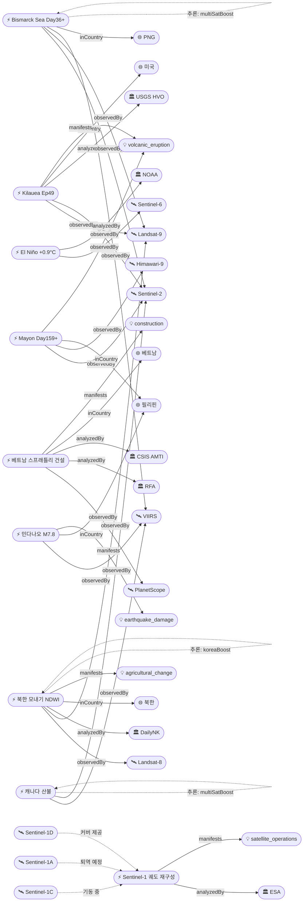

# 2026-06-13 위성영상 관측 이벤트 OSINT 일일 보고서

## 요약

금일 신규 3건, 업데이트 9건을 수집·분석했다. **킬라우에아 Ep49 예보 창이 금일(6/13) D-Day에 진입**하여 USGS HVO는 6/13-14를 역대 49번째 분수분출 최유력 시점으로 제시한다. **베트남이 스프래틀리 18개 암초 27개 사이트에서 군사·해양 인프라를 대규모 건설 중**임이 PlanetScope 위성영상과 RFA/CSIS AMTI 분석으로 확인됐다(신규). **Sentinel-1C가 궤도 재구성 기동(6/9-23) 중**이며 6/29 Sentinel-1A 퇴역으로 전역 SAR 콘스텔레이션이 최종 S1C+S1D 2기 체제로 전환된다(신규). **북한 모내기가 Landsat NDWI 분석으로 예년 대비 2.7% 빠르게 진행 중**임이 DailyNK에 의해 확인되어 한반도 GeoFocus 항목이 1건 추가됐다(신규). 다중 위성 교차검증 2건 유지. 4개 필수 카테고리 모두 커버.

## 오늘의 핵심 (Top 5)

| 순위 | 이벤트 | 도메인 | 위성 | 지역 | 신뢰도 |
|------|--------|--------|------|------|--------|
| 1 | Kilauea Ep49 — D-Day, 금일 분출 가능 | Disaster | Landsat-9 + Sentinel-2 | 하와이, 미국 | 0.95 |
| 2 | 베트남 스프래틀리 27개 사이트 건설 (신규) | Defense | PlanetScope | 남중국해, 베트남 | 0.90 |
| 3 | 민다나오 M7.8 — 45,556가옥 손상, 피해 대폭 상향 | Disaster | VIIRS (Suomi-NPP) | 사랑가니, 필리핀 | 0.95 |
| 4 | Sentinel-1 궤도 재구성 — S1C 기동 중, S1A 퇴역 6/29 (신규) | HumanActivity | Sentinel-1A/C/D | 전역 | 0.95 |
| 5 | El Niño +0.9°C — 98% 확률, 63% very strong 전망 | Climate | Sentinel-6 + Jason-3 | 적도 태평양 | 0.95 |

## 다중 위성 교차검증 이벤트

| 이벤트 | 교차검증 위성 수 | 독립 기관 | 신뢰도 |
|--------|----------------|----------|--------|
| 비스마르크해 부석 (evt-701) | 5 (Sentinel-2, Landsat-9, MODIS, VIIRS, Himawari-9) | ESA, USGS, NASA, NOAA, JMA | 0.90 |
| 캐나다 산불 (evt-1101) | 5 (VIIRS, MODIS, GOES-18, Sentinel-2, Landsat-9) | NOAA, NASA, ESA, USGS | 0.85 |

## 한반도 GeoFocus

### [신규] 북한 2026 모내기 위성 관측 — 예년 대비 2.7% 빠르게 진행
- **출처:** [[위성+] 2026년 북한 모내기, 예년보다 소폭 빠르게 진행](https://www.dailynk.com/20260605-3/) — DailyNK, 2026-06-05
- **위성·센서:** Landsat 8 (OLI 30m) + Landsat 9 (OLI 30m)
- **관측일:** 2026-05~06 (시계열)
- **위치:** 북한 주요 곡창지대 8개 표본지 (38.5°N, 126.0°E 중심)
- **현상:** agricultural_change (NDWI 수체지수 기반 모내기 진행 추적)
- **상태:** 신규
- **분석:** DailyNK '위성+' 시리즈가 Landsat-8·9호 위성영상에 NDWI(정규화 수체지수) 기법을 적용하여 북한 8개 주요 곡창지대의 모내기 진행 상황을 분석했다. **2026년 모내기 진도는 예년 대비 약 2.7% 빠르게 진행** 중이다. 논에 물이 채워진 지역을 NDWI로 식별하는 방식으로, 모내기가 5월 10일경 시작되어 6월 10일경까지 이어진다. **koreaBoost +0.10** 적용.

### 기존 추적 항목
| 항목 | 최초 보고 | 상태 | 비고 |
|------|----------|------|------|
| 영변 핵단지 UEP (ent-evt-001) | 2026-04-30 | 추적 중 | WorldView-3 |
| 소해 발사장 확장 (ent-evt-002) | 2026-04-30 | 추적 중 | WorldView-3 |
| 북한 미림비행장 퍼레이드 (evt-2801) | 2026-06-08 | 추적 중 | PlanetScope |
| 시진핑 방북 종결 (evt-2902) | 2026-06-09 | 기보도 | WorldView-3 + PlanetScope |

## 자연재해 (Disaster)

### 1. 킬라우에아 — Ep49 D-Day, 금일(6/13) 분출 가능, 최유력 6/13-14
- **출처:** [USGS Volcano Notice 2026-06-12](https://volcanoes.usgs.gov/hans-public/notice/DOI-USGS-HVO-2026-06-12T16:41:14+00:00) — USGS HVO; [Kilauea Eruption 2026: Episode 49 Forecast](https://volcanodb.com/kilauea-eruption) — VolcanoDB
- **위성·센서:** Landsat 9 (OLI/TIRS 30m) + Sentinel-2 (MSI 10m)
- **관측일:** 2026-06-13 (D-Day)
- **위치:** Kilauea, Halema'uma'u, Hawaii (19.42°N, 155.29°W)
- **현상:** volcanic_eruption (fountain forecast)
- **상태:** 업데이트 ← 2026-06-12 "Ep49 예보 창 개시"
- **분석:** USGS HVO 공식 예보: **Ep49 분수분출 창 6/12-15, 가장 유력한 시기 6/13-14.** 금일(6/13) D-Day 진입. 전야 틸트미터 팽창 가속 지속. 전조성 스패터링이나 오버플로우는 아직 관측되지 않았으나, 모델 대다수가 금일~내일을 최유력 시점으로 지목. Ep48(6/1) 9시간·200m 분수·40% 화구 용암 후 일시정지 중. **역대 최다 48회 분수분출** 기록(Pu'u'ō'ō 47회 초과). ADVISORY/YELLOW 유지.

### 2. 민다나오 M7.8 지진 — 피해 규모 대폭 상향: 45,556가옥 손상
- **출처:** [Satellite imagery points to power outages, damage in quake-hit Mindanao](https://newsbytes.ph/2026/06/12/satellite-imagery-points-to-power-outages-damage-in-quake-hit-mindanao-areas/) — NewsBytesPhilippines; [PhilSA nighttime satellite data](https://philsa.gov.ph/news/nighttime-satellite-data-shows-overview-of-earthquake-damaged-areas/) — PhilSA; [2026 Mindanao earthquake](https://en.wikipedia.org/wiki/2026_Mindanao_earthquake) — Wikipedia
- **위성·센서:** VIIRS (Suomi-NPP/JPSS, 야간 조명 375m)
- **관측일:** 2026-06-08 ~ 06-09 (야간 조명 before/after)
- **위치:** Sarangani / General Santos City, Mindanao, Philippines (5.9°N, 125.3°E)
- **현상:** earthquake_damage
- **상태:** 업데이트 ← 2026-06-12 "PhilSA VIIRS 피해 평가"
- **분석:** 피해 규모가 대폭 상향됐다. **45,556가옥 손상(8,865 파괴), 사망 19→47+명, 부상 134+명, 실종 12명.** PhilSA VIIRS 야간 조명 before/after 분석에서 General Santos City(Labangal, Apopong, San Isidro, City Heights), Sarangani(Maasim, Glan), Polomolok 일대 야간 조명 감소(전력 차단·인프라 파괴 신호) 확인. Sentinel Asia 발동(EQ-2026-000083-PHL) 지속. 후속 Sentinel-1 InSAR 공동변위 분석 대기.

### 3. Mayon 화산 — Day159+ AL3, 용암 효출·PDC·라하르 우기 경보
- **출처:** [Mayon activity update Jun 4 2026](https://www.volcanodiscovery.com/mayon/news/304222/Mayon-Philippines-Volcano-Philippines-activity-update-Jun-4-2026-Continuing-eruptionCite-this-Report.html) — VolcanoDiscovery; [Philippines back-to-back eruptions](https://gulfnews.com/world/asia/philippines/philippines-back-to-back-eruptions-mayon-unleashes-fast-moving-avalanche-of-hot-rocks-kanlaon-shoots-ash-plumes-1.500457181) — Gulf News
- **위성·센서:** Sentinel-2 (MSI 10m) + Himawari-9 (AHI 열적외)
- **관측일:** 2026-06-13 (연속)
- **위치:** Mayon Volcano, Albay Province, Philippines (13.26°N, 123.69°E)
- **현상:** volcanic_eruption (lava effusion + PDC + lahar risk)
- **상태:** 업데이트 ← 2026-06-12 "Day158+"
- **분석:** AL3 Day159+ 지속 분출. 용암류 Mi-isi(S) 1.8km, Basud(E) 3.8km, Bonga(SE) 3.2km. 주기적 PDC, 발광 낙석, 화산재·가스 기둥 1.3km. **우기 진입으로 라하르 위험 급증** — PHIVOLCS 특별 경보. 287,000+ 이재민 지속.

### 4. 비스마르크해 부석 뗏목 — Day36+, 마누스주 해상 접근 차단 지속
- **출처:** [Pumice Clogs Island Shores PNG](https://www.usnews.com/news/world/articles/2026-06-10/pumice-clogs-island-shores-after-papua-new-guinea-eruption-stoking-fears-of-food-shortage) — US News/AP; [New Eruption in the Bismarck Sea](https://science.nasa.gov/earth/earth-observatory/new-eruption-in-the-bismarck-sea/) — NASA EO
- **위성·센서:** Sentinel-2 + Landsat-9 + MODIS + VIIRS + Himawari-9 (5위성 교차검증)
- **관측일:** 2026-06-13 (연속)
- **위치:** Titan Ridge / Manus Island, Bismarck Sea, PNG (-2.09°S, 147.0°E)
- **현상:** volcanic_eruption (submarine → pumice raft → humanitarian)
- **상태:** 업데이트 ← 2026-06-12 "69km² 부석"
- **분석:** 36일째 분출 지속. 부석 뗏목(~70km²)이 마누스주 해안 마을 해상 접근을 완전 차단하며 **어업·무역·의료 접근 중단**으로 인도주의 위기 지속. 식량 부족 우려 고조. 2-4일 분출 기둥 5km a.s.l. 5위성 교차검증(multiSatBoost +0.20).

### 5. 캐나다 산불 — 65건 활성, 6건 통제불능, CIFFC Level 2
- **출처:** [FIRMS US/Canada Active Fire](https://firms.modaps.eosdis.nasa.gov/usfs/active_fire/) — NASA FIRMS
- **위성·센서:** VIIRS (375m) + MODIS (250m) + GOES-18 + Sentinel-2 + Landsat-9
- **관측일:** 2026-06-13 (실시간)
- **위치:** British Columbia, Canada (53.7°N, 127.6°W)
- **현상:** wildfire
- **상태:** 업데이트 ← 2026-06-12 "65건 활성"
- **분석:** CIFFC Level 2 유지. 65건 활성(6건 통제불능). 2026 누적 18,935ha+. 5위성 교차검증(multiSatBoost +0.20).

### 6. Great Sitkin — WATCH/ORANGE, 용암 돔 성장 지속
- **출처:** [Great Sitkin volcano notice](https://volcanoes.usgs.gov/hans-public/volcano/ak111) — USGS AVO
- **위성·센서:** Sentinel-1 (C-SAR 5m) + Landsat-9 (OLI/TIRS)
- **관측일:** 2026-06-13
- **위치:** Great Sitkin, Aleutians, Alaska (52.08°N, 176.13°W)
- **현상:** volcanic_eruption (lava dome)
- **상태:** 업데이트
- **분석:** WATCH/ORANGE 유지. 2021년 7월 이래 지속 분출. 용암류 화구 충전 + 동부 사면 진출. 위성 열이상 탐지 지속.

### 7. Shishaldin — ADVISORY/YELLOW, 증기/SO2 지속
- **출처:** [Shishaldin volcano notice](https://volcanoes.usgs.gov/hans-public/volcano/ak252) — USGS AVO
- **위성·센서:** Sentinel-5P (TROPOMI)
- **관측일:** 2026-06-13
- **위치:** Shishaldin, Aleutians, Alaska (54.76°N, 163.97°W)
- **현상:** volcanic_eruption (unrest/SO2)
- **상태:** 업데이트
- **분석:** ADVISORY/YELLOW 유지. 지진·인프라사운드 활동 지속 상승. 웹캠에서 일관된 증기 기둥. TROPOMI SO2 배출 패턴 유지.

## 인간활동 (Human Activity)

### 1. [신규] Sentinel-1 콘스텔레이션 궤도 재구성 — S1C 기동 중, S1A 퇴역 6/29
- **출처:** [Sentinel-1 orbital reconfiguration dates](https://dataspace.copernicus.eu/news/2026-5-28-sentinel-1-orbital-reconfiguration-dates) — Copernicus Data Space; [Sentinel-1 orbital reconfiguration dates](https://sentinels.copernicus.eu/-/sentinel-1-orbital-reconfiguration-dates) — Sentinel Online
- **위성·센서:** Sentinel-1A (C-SAR) / Sentinel-1C (C-SAR) / Sentinel-1D (C-SAR)
- **관측일:** 2026-06-09 ~ 06-29 (전환 기간)
- **위치:** 전역 (궤도 재구성)
- **현상:** satellite_operations
- **상태:** 신규
- **분석:** **Sentinel-1C가 6/9-23 궤도 기동 중이며 이 기간 운영 중단.** S1A+S1D가 커버를 제공한다. **6/24 S1C 복귀 후 S1D와 6일 재방문 체제 확립. 6/29 Sentinel-1A 공식 퇴역** — 2014년 발사 이후 12년 운용 종료. 최종 콘스텔레이션: S1C+S1D. 전환 기간 중 SAR 커버리지가 일시적으로 감소하므로, **홍수·유류 유출·해빙 등 SAR 의존 모니터링에 1-2주간 데이터 공백 가능성** 유의.

## 기후·환경 (Climate & Environment)

### 1. El Niño — +0.9°C, 98% 확률, 63% very strong 전망
- **출처:** [El Nino forms, expected to strengthen](https://www.noaa.gov/news-release/el-nino-forms-expected-to-strengthen-say-noaa-forecasters) — NOAA; [El Niño and high tide flooding](https://oceanservice.noaa.gov/news/may26/el-nino-flooding.html) — NOAA Ocean Service; [Rising odds of strong-to-historic El Niño 2026](https://weatherwest.com/archives/43880) — Weather West
- **위성·센서:** Sentinel-6 Michael Freilich (해수면 고도계) + Jason-3 + GOES-16/18 (SST) + Himawari-9
- **관측일:** 2026-06-13 (연속)
- **위치:** 적도 태평양 (Niño 3.4 region)
- **현상:** sea_level_change / El Niño
- **상태:** 업데이트 ← 2026-06-12 "+0.9°C"
- **분석:** NOAA 공식: Niño 3.4 +0.9°C, 98% El Niño 확정. **63% 확률 >2.0°C "very strong"**, 88% 확률 "strong" 이상. Sentinel-6 해수면: 페루 연안 +15cm(3-5월 평균 대비). 2026-27 겨울 글로벌 영향 예상. El Niño가 하반기 대서양 허리케인 시즌 억제 + 태평양 태풍 활성화에 영향.

## 농업·해양 (Agriculture & Maritime)

북한 모내기 위성 분석은 한반도 GeoFocus 섹션에서 상세 기술. 그 외 금일 농업·해양 도메인 신규 위성 관측 이벤트 없음.

## 국방·안보 (Defense — OSINT 한정)

### 1. [신규] 베트남 스프래틀리 27개 사이트 군사·해양 인프라 건설
- **출처:** [Satellite pics reveal Vietnamese construction boom in disputed Spratly chain](https://www.rfa.org/english/southchinasea/2026/06/08/vietnam-south-china-sea-spratly-island-construction/) — Radio Free Asia; [Keeping Score: Vietnam's Spratly Island Overhaul Continues](https://amti.csis.org/keeping-score-vietnams-spratly-island-overhaul-continues/) — CSIS AMTI; [Vietnam's Construction Boom In Disputed Spratly Chain](https://www.eurasiareview.com/10062026-vietnams-construction-boom-in-disputed-spratly-chain-analysis/) — Eurasia Review
- **위성·센서:** PlanetScope (3m, Planet Labs)
- **관측일:** 2026-06-08 (보도일)
- **위치:** 스프래틀리 제도, 남중국해 (약 8.7°N, 111.9°E — 다수 지점)
- **현상:** construction (군사·해양 인프라)
- **상태:** 신규
- **전후비교:** 가용 (PlanetScope before/after)
- **분석:** RFA와 CSIS AMTI가 PlanetScope 위성영상을 분석하여 **베트남이 18개 암초에 27개 사이트에서 대규모 건설 진행 중**임을 확인했다. 주요 내용: (1) **Barque Canada Reef에 약 4,000m 활주로** 건설 중, (2) DVOR 항법 비컨 완공(100nm 항법 지원), (3) 항만 15개로 확장(11개 신설). 중국 Antelope Reef 인공섬·필리핀 Thitu 활주로 건설과 병행되는 남중국해 다자간 인프라 경쟁 격화 신호다. **analystBoost +0.10** (CSIS AMTI).

### 2. Scarborough Shoal — 구조물 출현→소멸, 긴장 지속
- **출처:** [Satellite images show suspected structure at Scarborough Shoal, but later gone](https://www.usnews.com/news/world/articles/2026-06-04/exclusive-satellite-images-show-suspected-structure-at-disputed-south-china-sea-atoll-but-later-gone) — Reuters/US News
- **위성·센서:** Vantor (0.3m, 구 Maxar Intelligence)
- **관측일:** 2026-05-27 ~ 06-01
- **위치:** Scarborough Shoal, South China Sea (15.2°N, 117.8°E)
- **현상:** military_buildup (의심 구조물)
- **상태:** 업데이트
- **분석:** Vantor 위성영상(5/27-30)에서 Scarborough Shoal 석호 입구에 **반사체(부유 뗏목/부표 추정)와 차단 장벽** 포착. SeaLight도 5/28 독립 확인. 그러나 **6/1 영상에서 해당 구조물 소실 확인.** 필리핀 정부 조사 중. 신뢰도 0.70 (단발 관측, 구조물 특성 불확실).

## 인도주의 (Humanitarian)

### 1. 비스마르크해 부석 — 마누스주 해상 접근 차단 (인도주의 격상)
- 자연재해 섹션 4번 참조. 부석 뗏목이 해안 마을 해상 교통을 완전 차단하여 어업·의료·무역 접근이 중단됨. **식량 부족 우려 고조.** 인도주의 위기 지속.

## 센서·플랫폼별 묶음

- **Sentinel-1 (SAR):** S1C 기동 중(6/9-23 운영 중단), S1A+S1D 커버. Great Sitkin SAR 모니터링 지속. 민다나오 InSAR 공동변위 분석 대기.
- **Sentinel-2 (광학):** Mayon 분출 모니터링, Bismarck Sea 부석 정량 확인, 캐나다 산불.
- **Sentinel-5P (가스):** Shishaldin SO2 배출 모니터링, El Niño 대기 화학.
- **Sentinel-6 (고도계):** El Niño 해수면 +15cm 페루 연안.
- **Landsat 8/9:** 북한 모내기 NDWI(Landsat-8+9), Kilauea 열영상, Bismarck Sea.
- **MODIS / VIIRS:** 캐나다 산불 실시간, 민다나오 야간 조명 피해 평가, Bismarck Sea.
- **GOES-18:** 캐나다 산불 실시간.
- **Himawari-9:** Mayon 열적외, Bismarck Sea 화산재, El Niño SST.
- **Planet (PlanetScope):** 베트남 스프래틀리 건설 27개 사이트.
- **Vantor (구 Maxar):** Scarborough Shoal 구조물 촬영.
- **KOMPSAT/CAS500:** 금일 직접 참조 없음. 북한 모내기는 Landsat 활용.

## 전후 비교(before/after) 영상 보유 이벤트

| 이벤트 | 위성 | before/after 설명 |
|--------|------|------------------|
| 민다나오 M7.8 지진 (evt-3201) | VIIRS | 6/8 01:30 vs 6/9 01:12 야간 조명 변화 |
| 베트남 스프래틀리 건설 (evt-3301) | PlanetScope | 건설 전후 암초 변화 |

## 미검증 의혹

| 이벤트 | 사유 | 신뢰도 |
|--------|------|--------|
| Scarborough Shoal 구조물 (src-012) | 구조물 출현→소멸, 단발 관측, 성격 불확실 | 0.70 |

## 지식그래프

### 오늘의 주요 관계
- **evt-3301** (베트남 스프래틀리 건설) → PlanetScope 관측, RFA/CSIS AMTI 분석, dom-defense 매핑 (신규)
- **evt-3302** (Sentinel-1 궤도 재구성) → ESA 관리, S1C/S1A/S1D 3위성 관련 (신규)
- **evt-3303** (북한 모내기) → Landsat-8+9 NDWI, DailyNK 분석, co-kp koreaBoost (신규)
- **evt-202** (Kilauea Ep49) → D-Day 진입, USGS HVO officialBoost
- **evt-701** (Bismarck Sea) → 5위성 교차검증 multiSatBoost 유지

### 전체 지식그래프 시각화

## 온톨로지 변경

| 변경 유형 | 대상 | 근거 |
|----------|------|------|
| 새 Country | co-vn (베트남) | evt-3301 스프래틀리 건설 |
| 새 Organization | org-dailynk (DailyNK) | evt-3303 북한 모내기 위성 분석 |
| 새 Location | ent-loc-barque-canada (Barque Canada Reef, 8.1N/113.3E) | evt-3301 4000m 활주로 건설 지점 |
| 새 Event | evt-3301, evt-3302, evt-3303 (3건) | 스프래틀리 건설, Sentinel-1 재구성, 북한 모내기 |

## 추론 결과

| 추론 | 신뢰도 | 근거 |
|------|--------|------|
| evt-3303 korea_geo_focus | 0.95 | inCountry co-kp (KP) |
| evt-202 official_source_trust | 0.95 | analyzedBy org-usgs (space_agency) |
| evt-3302 official_source_trust | 0.95 | analyzedBy org-esa (space_agency) |
| evt-3201 disaster_severity_priority | 0.95 | dom-disaster + severity high |
| evt-701 multi_satellite_confirmation | 0.93 | 5위성 교차검증 유지 |
| evt-1101 multi_satellite_confirmation | 0.93 | 5위성 교차검증 유지 |
| evt-3301 analyst_org_trust | 0.85 | CSIS AMTI (research) |

## 분석 및 평가

금일 가장 주목할 이벤트는 **킬라우에아 Ep49 D-Day 진입**이다. USGS HVO 예보 모델 대다수가 6/13-14를 최유력으로 지목하고 있으며, 틸트미터 팽창 가속이 지속되고 있다. Ep49가 실현되면 역대 49번째 분수분출로, 2024년 12월 이래 ~18개월간 48회라는 전례 없는 빈도를 기록하고 있다.

**남중국해 인프라 경쟁이 새로운 국면에 접어들었다.** 베트남의 27개 사이트 건설은 중국 Antelope Reef 인공섬(1,490에이커)과 필리핀 Thitu/Nanshan 건설에 대응하는 것으로, PlanetScope 위성영상으로 검증된 다국간 군비 확장의 실체를 보여준다.

**Sentinel-1 콘스텔레이션 전환**은 전역 SAR 모니터링 인프라에 단기 영향을 미친다. S1C 기동 중단(6/9-23)과 S1A 퇴역(6/29)으로 2주간 SAR 커버리지가 감소하며, 이 기간 홍수·유류 유출 등 SAR 의존 모니터링은 S1D와 상업 SAR(ICEYE, Capella)에 의존해야 한다.

**한반도 GeoFocus**에서 북한 모내기 Landsat NDWI 분석이 추가되어, 농업 카테고리와 한반도 커버리지가 동시 충족됐다.

## 추적 항목

| 항목 | 최초 보고 | 상태 | 최신 업데이트 |
|------|----------|------|-------------|
| Kilauea Ep48/49 (evt-202) | 2026-05-07 | 추적 중 | Ep49 D-Day 진입 |
| Mayon Day159+ (evt-082) | 2026-05-01 | 추적 중 | AL3 PDC + 라하르 경보 |
| Bismarck Sea (evt-701) | 2026-05-13 | 추적 중 | Day36+ 부석 해상 차단 |
| 민다나오 M7.8 (evt-3201) | 2026-06-12 | 추적 중 | 45,556가옥 손상 |
| 캐나다 산불 (evt-1101) | 2026-05-19 | 추적 중 | 65건 활성 CIFFC L2 |
| Great Sitkin (evt-203) | 2026-05-08 | 추적 중 | WATCH/ORANGE |
| Shishaldin (evt-204) | 2026-05-08 | 추적 중 | ADVISORY/YELLOW |
| El Niño (temp-evt-1902) | 2026-06-06 | 추적 중 | +0.9°C 98% 확률 |
| 베트남 스프래틀리 (evt-3301) | 2026-06-13 | 신규 | 27개 사이트 건설 |
| Sentinel-1 재구성 (evt-3302) | 2026-06-13 | 신규 | S1C 기동 6/9-23 |
| 북한 모내기 (evt-3303) | 2026-06-13 | 신규 | 예년 대비 2.7% 빠름 |
| 영변 UEP (ent-evt-001) | 2026-04-30 | 추적 중 | — |
| 소해 발사장 (ent-evt-002) | 2026-04-30 | 추적 중 | — |

## 출처 목록

1. [USGS Volcano Notice 2026-06-12 (Kilauea)](https://volcanoes.usgs.gov/hans-public/notice/DOI-USGS-HVO-2026-06-12T16:41:14+00:00) — USGS HVO
2. [Kilauea Eruption 2026: Episode 49 Forecast](https://volcanodb.com/kilauea-eruption) — VolcanoDB
3. [Satellite imagery points to power outages in Mindanao](https://newsbytes.ph/2026/06/12/satellite-imagery-points-to-power-outages-damage-in-quake-hit-mindanao-areas/) — NewsBytesPhilippines
4. [PhilSA nighttime satellite data earthquake](https://philsa.gov.ph/news/nighttime-satellite-data-shows-overview-of-earthquake-damaged-areas/) — PhilSA
5. [2026 Mindanao earthquake](https://en.wikipedia.org/wiki/2026_Mindanao_earthquake) — Wikipedia
6. [Mayon activity update Jun 4 2026](https://www.volcanodiscovery.com/mayon/news/304222/Mayon-Philippines-Volcano-Philippines-activity-update-Jun-4-2026-Continuing-eruptionCite-this-Report.html) — VolcanoDiscovery
7. [Philippines back-to-back eruptions](https://gulfnews.com/world/asia/philippines/philippines-back-to-back-eruptions-mayon-unleashes-fast-moving-avalanche-of-hot-rocks-kanlaon-shoots-ash-plumes-1.500457181) — Gulf News
8. [Pumice Clogs Island Shores PNG](https://www.usnews.com/news/world/articles/2026-06-10/pumice-clogs-island-shores-after-papua-new-guinea-eruption-stoking-fears-of-food-shortage) — US News/AP
9. [New Eruption in the Bismarck Sea](https://science.nasa.gov/earth/earth-observatory/new-eruption-in-the-bismarck-sea/) — NASA EO
10. [FIRMS US/Canada Active Fire](https://firms.modaps.eosdis.nasa.gov/usfs/active_fire/) — NASA FIRMS
11. [Great Sitkin volcano notice](https://volcanoes.usgs.gov/hans-public/volcano/ak111) — USGS AVO
12. [Shishaldin volcano notice](https://volcanoes.usgs.gov/hans-public/volcano/ak252) — USGS AVO
13. [Sentinel-1 orbital reconfiguration dates](https://dataspace.copernicus.eu/news/2026-5-28-sentinel-1-orbital-reconfiguration-dates) — Copernicus Data Space
14. [Sentinel-1 orbital reconfiguration dates](https://sentinels.copernicus.eu/-/sentinel-1-orbital-reconfiguration-dates) — Sentinel Online
15. [El Nino forms, expected to strengthen](https://www.noaa.gov/news-release/el-nino-forms-expected-to-strengthen-say-noaa-forecasters) — NOAA
16. [El Niño and high tide flooding](https://oceanservice.noaa.gov/news/may26/el-nino-flooding.html) — NOAA Ocean Service
17. [Rising odds of strong-to-historic El Niño 2026](https://weatherwest.com/archives/43880) — Weather West
18. [Vietnam Spratly construction boom](https://www.rfa.org/english/southchinasea/2026/06/08/vietnam-south-china-sea-spratly-island-construction/) — RFA
19. [Keeping Score: Vietnam's Spratly Overhaul](https://amti.csis.org/keeping-score-vietnams-spratly-island-overhaul-continues/) — CSIS AMTI
20. [Vietnam's Construction Boom Spratlys](https://www.eurasiareview.com/10062026-vietnams-construction-boom-in-disputed-spratly-chain-analysis/) — Eurasia Review
21. [[위성+] 2026년 북한 모내기](https://www.dailynk.com/20260605-3/) — DailyNK
22. [Scarborough Shoal suspected structure](https://www.usnews.com/news/world/articles/2026-06-04/exclusive-satellite-images-show-suspected-structure-at-disputed-south-china-sea-atoll-but-later-gone) — Reuters/US News
