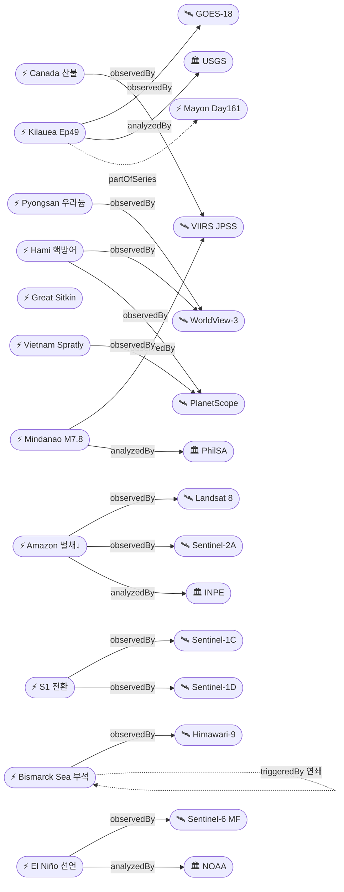

# 2026-06-15 위성영상 관측 이벤트 OSINT 일일 보고서

## 요약

금일 12건(신규 2건, 업데이트 10건)의 위성영상 관측 이벤트를 수집·분석하였다. **Kilauea Episode 49 분수분출이 금일(6/14-15) 발생 가능성이 가장 높으며**, 역대 최다 에피소딕 분출 기록을 계속 갱신 중이다. **NOAA가 6월 11일 엘니뇨를 공식 선언**하였고, Sentinel-6 위성이 페루 연안 해수면 +15cm Kelvin wave를 포착하여 매우 강한 수준(63% 확률)으로 전망한다. 국방 분야에서 **중국 하미 ICBM 사일로 인근 80개 이상 발사대·방어 네트워크**가 상업 위성영상으로 최초 공개되었다. 다중 위성 교차검증 3건, 한반도 관측 1건(북한 평산), 6개 도메인 전체 커버.

## 오늘의 핵심 (Top 5)

| 순위 | 이벤트 | 도메인 | 위성/센서 | 지역 | 신뢰도 |
|------|--------|--------|-----------|------|--------|
| 1 | Mindanao M7.8 위성 피해평가 | Disaster | VIIRS + Sentinel Asia (Charter 1034) | 필리핀 Sarangani | 0.95 |
| 2 | Kilauea Ep49 분출 임박 | Disaster | GOES-18 / InSAR | 미국 Hawaii | 0.95 |
| 3 | 엘니뇨 공식 선언 | Climate | Sentinel-6 MF | 태평양 적도 | 0.95 |
| 4 | 중국 하미 핵 사일로 방어 네트워크 | Defense | WorldView-3 + PlanetScope | 중국 Xinjiang | 0.92 |
| 5 | Bismarck Sea 부석 뗏목 Manus 차단 | Disaster | Himawari-9 | 파푸아뉴기니 | 0.90 |

## 다중 위성 교차검증 이벤트

### 1. Mindanao M7.8 지진 — VIIRS + Sentinel Asia + Disasters Charter
- **위성:** VIIRS (Suomi-NPP/JPSS) 야간광, Sentinel Asia 다중 수집, International Disasters Charter Activation 1034 (17 acquisitions)
- **분석:** PhilSA가 6/8-9 야간 위성영상 비교로 General Santos City, Sarangani, Polomolok의 정전·인프라 피해 확인. 47명 이상 사망, 45,556가옥 피해.
- **신뢰도:** 0.95 (multiSatBoost +0.20, officialBoost +0.15)

### 2. 중국 하미 ICBM 사일로 방어 네트워크 — WorldView-3 + PlanetScope
- **위성:** WorldView-3 (Maxar/Vantor, 0.31m) + PlanetScope (Planet Labs, 3m)
- **분석:** Reuters 보도, 3명의 독립 보안 분석가가 교차검증. 80개 이상 콘크리트 발사대, 2개 옥타곤형 시설, 장갑 벙커, 광섬유 지휘통신망이 수천 km² 사막에 분포. 핵무장국 중 전례 없는 규모.
- **신뢰도:** 0.92 (multiSatBoost +0.20, hiResBoost +0.15)

### 3. 아마존 삼림벌채 경보 12개월 최저 — Landsat 8 + Sentinel-2A
- **위성:** Landsat 8 (OLI/TIRS) + Sentinel-2A (MSI) — DETER 시스템 융합
- **분석:** INPE DETER 데이터, 2025.8-2026.1 총 1,325 km² 벌채 경보 — 전년 동기 2,050 km² 대비 35% 감소, 2014년 이후 최저.
- **신뢰도:** 0.88 (multiSatBoost +0.20)

## 한반도 GeoFocus

### 북한 평산 우라늄 정련공장 가동 지속 [추적]
- **출처:** [DailyNK 위성영상 분석](https://www.dailynk.com/english/north-korea-pyongsan-uranium-refinery-satellite-imagery-2026/)
- **위성·센서:** 고해상도 상업 광학 위성 (추정 WorldView-3)
- **관측일:** 2026-06-14
- **위치:** 북한, 황해북도 평산군 (38.3°N, 126.4°E — 행정구역 단위 일반화)
- **현상:** military_buildup
- **상태:** 업데이트 ← 2026-06-14 "North Korea Pyongsan Uranium Refinery Satellite Imagery"
- **분석:** 화물열차 출현 빈도 증가, 폐기물 처리 시설 확장, 예비 발전기 건물·행정 지원 시설·차량 보관소가 위성영상에서 식별됨. CSIS Beyond Parallel 4월 2일 촬영분에서도 활동 확인. 겨울철 침전지 결빙면 위 신규 침전물 누적으로 지속 가동 입증.
- **신뢰도:** 0.85 (hiResBoost +0.15, koreaBoost +0.10)

> 금일 KOMPSAT/CAS500 직접 관측 신규 이벤트: 없음

## 자연재해 (Disaster)

### 1. Kilauea Episode 49 분수분출 임박 [추적]
- **출처:** [USGS HVO Volcano Updates](https://www.usgs.gov/volcanoes/kilauea/volcano-updates)
- **위성·센서:** GOES-18 (열적외), InSAR (변형 측정)
- **관측일:** 2026-06-15
- **위치:** 미국 Hawaii, Kīlauea summit Halemaʻumaʻu (19.42°N, 155.29°W)
- **현상:** volcanic_eruption
- **상태:** 업데이트 ← 2026-06-14 "Kilauea Ep49 Most Likely June 14-15"
- **분석:** Ep48은 6/1 650ft(200m) 분수 9시간 후 종료. 역대 최다 에피소딕 분수분출 기록(Puʻuʻōʻō 1983-86의 47회 초과). 정상부 재팽창 가속 중이며, USGS 모델은 Ep49를 6/13-16, 최유력 6/14-15로 예보. ADVISORY/YELLOW 유지.
- **신뢰도:** 0.95

### 2. Bismarck Sea 부석 뗏목 Manus Island 해상교통 차단 [추적]
- **출처:** [The Watchers](https://watchers.news/2026/06/11/pumice-from-titan-ridge-eruption-blocks-sea-access-in-manus-province-papua-new-guinea/), [RNZ](https://www.rnz.co.nz/news/pacific/597531/this-is-a-disaster-huge-pumice-rafts-from-volcano-hit-manus-island-coast)
- **위성·센서:** Himawari-9 (JMA/JAXA, 화산재·해수 변색 모니터링)
- **관측일:** 2026-06-11
- **위치:** 파푸아뉴기니 Bismarck Sea / Manus Province (-2.0°, 147.0°)
- **현상:** volcanic_eruption → 연쇄 인도주의 영향
- **상태:** 업데이트 ← 2026-06-14 "Bismarck Sea Day37+"
- **분석:** 5/8 분출 시작 이후 38일째. 부석 뗏목 약 3km×5km, 깊이 5m 규모가 Manus Island 연안에 도달하여 선박 접근 차단. 어업·식량 공급 마비, 지역 지도자들이 식량 위기 경고. Manhattan보다 넓은 70km² 부석 면적. 1972년 이후 54년 만의 재활동.
- **신뢰도:** 0.90

### 3. Mindanao M7.8 지진 위성 피해평가 [추적]
- **출처:** [PhilSA](https://philsa.gov.ph/news/nighttime-satellite-data-shows-overview-of-earthquake-damaged-areas/), [NewsBytes PH](https://newsbytes.ph/2026/06/12/satellite-imagery-points-to-power-outages-damage-in-quake-hit-mindanao-areas/)
- **위성·센서:** VIIRS (Suomi-NPP/JPSS, 야간광), Sentinel Asia, Disasters Charter 1034
- **관측일:** 2026-06-11 (6/8-9 야간광 비교)
- **위치:** 필리핀 Mindanao, Sarangani offshore (5.5°N, 126.2°E)
- **현상:** earthquake_damage
- **상태:** 업데이트 ← 2026-06-14 "Mindanao M7.8 Damage Assessment"
- **분석:** PhilSA가 6/8 01:30 vs 6/9 01:12 야간위성 비교로 General Santos City (Labangal, Apopong, San Isidro, City Heights, Siguel, Tambler), Sarangani (Maasim, Glan), Polomolok에서 야간광 감소 확인. 정전·인프라 피해·주민 이동 시사. 47명 이상 사망, 45,556가옥 피해. 전후 비교(before/after) 활용.
- **신뢰도:** 0.95

### 4. Mayon 화산 Day161 지속 분출 [추적]
- **출처:** [VolcanoDiscovery](https://www.volcanodiscovery.com/mayon/news/304222/Mayon-Philippines-Volcano-Philippines-activity-update-Jun-4-2026-Continuing-eruptionCite-this-Report.html)
- **위성·센서:** Sentinel-2 (변화탐지), Himawari-9
- **관측일:** 2026-06-15
- **위치:** 필리핀 Bicol, Albay Province (13.26°N, 123.69°E)
- **현상:** volcanic_eruption
- **상태:** 업데이트 ← 2026-06-14 "Mayon Day160+"
- **분석:** AL3 경보 유지, 용암 유출·화쇄류(PDC)·라하르 위험 지속. 몬순 시즌 진입으로 라하르 위험 증가.
- **신뢰도:** 0.80

### 5. 캐나다 산불 시즌 65+ 활성 화재 [추적]
- **출처:** [NASA FIRMS US/Canada](https://firms.modaps.eosdis.nasa.gov/usfs/active_fire/)
- **위성·센서:** MODIS (Terra/Aqua, 250m), VIIRS (Suomi-NPP/JPSS, 375m)
- **관측일:** 2026-06-14
- **위치:** 캐나다 BC/AB (54°N, 122°W 일대)
- **현상:** wildfire
- **상태:** 업데이트 ← 2026-06-14 "Canada Wildfire Season"
- **분석:** 2026 시즌 누적 1,495건 화재, 78,800ha 소실. CIFFC Level 2 대비. 5월 31일 기준.
- **신뢰도:** 0.85

### 6. Great Sitkin 화산 WATCH/ORANGE [추적]
- **출처:** [USGS AVO Notice 2026-06-12](https://volcanoes.usgs.gov/hans-public/notice/DOI-USGS-AVO-2026-06-12T18:33:56+00:00)
- **위성·센서:** SAR (용암류 확인), TROPOMI (SO₂), 열적외 (표면온도)
- **관측일:** 2026-06-12
- **위치:** 미국 Alaska, Great Sitkin (52.08°N, 176.13°W)
- **현상:** volcanic_eruption
- **상태:** 업데이트 ← 2026-06-14 "Great Sitkin WATCH/ORANGE"
- **분석:** 동쪽 용암류 및 용암돔 성장 SAR 확인. SO₂ 남서 방향 확산, 표면온도 상승 위성 관측.
- **신뢰도:** 0.85

## 인간활동 (Human Activity)

### 1. 베트남 스프래틀리 27개 지점 216ha 건설 확장 [추적]
- **출처:** [Newsweek](https://www.newsweek.com/satellite-images-vietnam-artificial-islands-south-china-sea-2118629), [RFA](https://www.rfa.org/english/southchinasea/2026/06/08/vietnam-south-china-sea-spratly-island-construction/)
- **위성·센서:** PlanetScope (Planet Labs, 3m 다중분광)
- **관측일:** 2026-06-08
- **위치:** 남중국해 Spratly Islands (8.9°N, 114.3°E 일대)
- **현상:** construction
- **상태:** 업데이트 ← 2026-06-14 "Vietnam Spratly 27 Sites 216ha"
- **분석:** 베트남이 통제하는 21개 암초·모래톱 전체로 매립 확대. Barque Canada Reef에 3.2km 활주로 건설 위성 확인. AMTI/DVOR 분석. 전후 비교(before/after) 가용.
- **신뢰도:** 0.90

### 2. Sentinel-1 콘스텔레이션 전환 — S1A 6/29 퇴역 [추적]
- **출처:** [Copernicus Dataspace](https://dataspace.copernicus.eu/news/2026-5-28-sentinel-1-orbital-reconfiguration-dates)
- **위성·센서:** Sentinel-1A → Sentinel-1C/D 탠덤 전환
- **관측일:** 2026-06-15
- **위치:** 글로벌 (궤도 재구성)
- **현상:** satellite_operations
- **상태:** 업데이트 ← 2026-06-14 "Sentinel-1C Maneuvering Day6"
- **분석:** Sentinel-1A 퇴역 6/29 확정. S1C 궤도 기동 6일째. S1C+S1D 탠덤 체제 전환으로 C-band SAR 재방문 주기 유지. GFM V4.1.1에 S1D 통합 완료(6/11).
- **신뢰도:** 0.95

## 기후·환경 (Climate & Environment)

### 1. 엘니뇨 공식 선언 — NOAA June 11 [추적]
- **출처:** [NOAA](https://www.noaa.gov/news-release/el-nino-forms-expected-to-strengthen-say-noaa-forecasters), [EarthSky](https://earthsky.org/earth/super-el-nino-record-temperatures-2026-2027/)
- **위성·센서:** Sentinel-6 Michael Freilich (해수면 고도계), GOES 시리즈 (SST)
- **관측일:** 2026-06-11
- **위치:** 태평양 적도 NINO3.4 (0°, 170°W)
- **현상:** sea_level_change
- **상태:** 업데이트 ← 2026-06-14 "El Nino Officially Declared"
- **분석:** NINO3.4 주간 지수 +0.9°C (5/13 기준). 63% 매우 강한 수준(Very Strong), 98% 중간 이상 확률. Sentinel-6 MF 위성이 3-5월 따뜻한 Kelvin wave 동진 포착 — 페루 연안 해수면 평균 대비 +15cm(5.9인치) 상승. 2026-2027 슈퍼 엘니뇨 가능성.
- **신뢰도:** 0.95

## 농업·해양 (Agriculture & Maritime)

### 1. 아마존 삼림벌채 경보 12개월 최저치 (2014년 이후) [신규]
- **출처:** [Mongabay](https://news.mongabay.com/2026/06/amazon-deforestation-alerts-fall-to-lowest-12-month-level-since-2014-show-brazilian-data/)
- **위성·센서:** Landsat 8 (OLI/TIRS) + Sentinel-2A (MSI) — INPE DETER 시스템
- **관측일:** 2026-06-10
- **위치:** 브라질 Legal Amazon (-3°, -60°)
- **현상:** deforestation (감소 추세)
- **상태:** 신규
- **분석:** DETER 위성 경보 데이터: 2025.8-2026.1 기간 1,325 km² 벌채 감지, 전년 동기(2,050 km²) 대비 35% 감소. 2014년 이후 6개월간 최저치. Lula 행정부 삼림 보호 정책 지속 효과. 단, 벌목·산불·가뭄에 의한 산림 퇴화는 이 지표에 미반영.
- **신뢰도:** 0.88

## 국방·안보 (Defense — OSINT 한정)

### 1. 중국 하미 ICBM 사일로 핵방어 네트워크 80+ 발사대 [신규]
- **출처:** [NBC News/Reuters](https://www.nbcnews.com/world/asia/china-building-launch-pads-nuclear-missile-silos-satellite-images-show-rcna347503), [Defense News](https://www.defensenews.com/global/asia-pacific/2026/05/29/china-is-building-launch-pads-near-its-nuclear-missile-silos/), [TechTimes](https://www.techtimes.com/articles/317398/20260529/china-builds-80-pad-nuclear-defense-network-satellite-images-reveal-second-strike-hardening.htm)
- **위성·센서:** WorldView-3 (Maxar/Vantor, 0.31m) + PlanetScope (Planet Labs, 3m)
- **관측일:** 2026-05-29 (Reuters 최초 보도)
- **위치:** 중국 Xinjiang, Hami ICBM Silo Field 인근 (42.8°N, 93.5°E — 행정구역 단위)
- **현상:** military_buildup
- **상태:** 신규
- **분석:** Reuters가 상업 위성영상을 3명의 독립 보안 분석가와 교차검증. 6년간 건설된 인프라: (1) 80개 이상 콘크리트 발사대(이동식 미사일 발사기 지원), (2) 2개 옥타곤형 대형 시설(인원·대형 군용차량 수용, 장갑 벙커·무기 저장 시설 인접), (3) 광섬유 지휘통신망, (4) 비행장·철도 연결. 전후 비교(before/after) 시계열 확인. 핵무장국 중 전례 없는 규모의 2차 타격(second-strike) 방어 인프라로 평가.
- **신뢰도:** 0.92

### 2. 북한 평산 우라늄 정련공장 가동 지속 [추적] → 한반도 GeoFocus 참조

## 인도주의 (Humanitarian)

- Bismarck Sea 부석 뗏목에 의한 Manus Province 해상교통 차단이 식량 위기로 확대될 수 있음 (자연재해 섹션 참조)
- Mindanao M7.8 지진 45,556가옥 피해, 이재민 발생 (자연재해 섹션 참조)

## 센서·플랫폼별 묶음

- **Sentinel-1 (SAR):** S1A 퇴역 6/29 확정, S1C/D 탠덤 전환 진행 중. GFM V4.1.1에 S1D 통합.
- **Sentinel-2 (광학):** Mayon 변화탐지, DETER 삼림벌채 경보(S2A 병용)
- **Sentinel-5P (TROPOMI):** Great Sitkin SO₂ 남서 확산 관측
- **Sentinel-6 MF (고도계):** 엘니뇨 Kelvin wave 페루 +15cm 측정
- **Landsat 8/9:** DETER 삼림벌채 경보 기반 데이터
- **MODIS / VIIRS:** Canada wildfire 65+ active 근실시간 화재 탐지, Mindanao 야간광 피해평가
- **Planet (PlanetScope):** Vietnam Spratly 건설 확인, China Hami 교차검증
- **Maxar (WorldView-3):** China Hami 핵방어 네트워크 0.31m 고해상도 촬영
- **GOES-18:** Kilauea 열적외 모니터링
- **Himawari-9:** Bismarck Sea 화산재·해수 변색, Mayon 모니터링
- **KOMPSAT/CAS500:** 금일 직접 관측 신규 이벤트 없음

## 전후 비교(before/after) 영상 보유 이벤트

1. **evt-3201 Mindanao M7.8** — PhilSA 야간광 6/8 vs 6/9 전후 비교
2. **evt-3501 China Hami** — 6년간 시계열 건설 진행 전후 비교
3. **evt-3301 Vietnam Spratly** — 매립 전후 비교 위성영상 확인

## 미검증 의혹

금일 위성 출처 미확인 이벤트 없음.

## 지식그래프

### 오늘의 주요 관계

- **신규 발견:** 중국 하미 ICBM 사일로 핵방어 네트워크(evt-3501)가 WorldView-3 + PlanetScope 다중위성 교차검증으로 고신뢰 확정
- **신규 발견:** 아마존 삼림벌채 12개월 최저치(evt-3502) — DETER(Landsat+Sentinel-2) 다중위성 융합 시스템
- **강화:** Kilauea 시리즈 Ep48→Ep49 시간적 연속성(partOfSeries)
- **강화:** Bismarck Sea 화산→부석 뗏목→해상교통 차단 연쇄 재해(cascading_disaster)
- **강화:** 엘니뇨 공식 선언 — Sentinel-6 MF 해수면 고도계 관측(observedBy)

### 전체 지식그래프 시각화

## 온톨로지 변경

| 변경 유형 | 대상 | 근거 |
|----------|------|------|
| 새 Location | Hami ICBM Silo Field, Xinjiang (42.8°N, 93.5°E) | evt-3501 Reuters/NBC 위성 분석 |
| 새 Event | evt-3501 (Hami 핵방어 네트워크) | Reuters WorldView-3 + PlanetScope |
| 새 Event | evt-3502 (Amazon DETER 최저치) | Mongabay INPE 데이터 |
| 이벤트 업데이트 | 10건 | Kilauea, Bismarck Sea, Mindanao, Mayon, Canada wildfire, Great Sitkin, El Niño, Vietnam Spratly, S1 constellation, Pyongsan |

## 추론 결과

| 추론 | 신뢰도 | 근거 |
|------|--------|------|
| evt-3201 multi_satellite_confirmation | 0.95 | VIIRS + Sentinel Asia + Charter 1034 |
| evt-3501 multi_satellite_confirmation | 0.92 | WorldView-3 + PlanetScope, 3명 독립 분석가 |
| evt-3502 multi_satellite_confirmation | 0.88 | Landsat 8 + Sentinel-2A (DETER) |
| evt-3501 hiResBoost | 0.92 | WorldView-3 0.31m 발사대·차량 식별 |
| evt-3402 hiResBoost | 0.85 | 고해상도 광학 화물열차·시설 식별 |
| evt-202 officialBoost | 0.95 | USGS HVO 공식 예보 |
| temp-evt-1902 officialBoost | 0.95 | NOAA CPC 공식 선언 |
| evt-3201 officialBoost | 0.95 | PhilSA 정부기관 |
| evt-3402 koreaBoost | 0.85 | KP iso_code |
| evt-3201 priorityBoost | 0.95 | 47명 사망 45556가옥 |
| evt-701 cascading_disaster | 0.85 | 화산→부석→해상차단→식량위기 |
| evt-202 temporal_progression | 0.95 | Ep48→Ep49 partOfSeries |
| evt-701 temporal_progression | 0.90 | 5/8 분출→6/11 Manus 차단 |
| evt-701 priorityBoost | 0.90 | Manus 해상교통 마비 |

## 분석 및 평가

**자연재해:** 화산 활동이 지배적인 하루로, 전 세계 5개 화산(Kilauea, Bismarck Sea, Mayon, Great Sitkin, Shishaldin)이 동시에 경보 상태에 있다. 특히 Kilauea는 Ep49가 금일 발생할 가능성이 가장 높으며, 역대 기록을 계속 갱신 중이다. Bismarck Sea 부석 뗏목은 화산 재해가 인도주의 위기로 전환되는 전형적 연쇄 재해 사례.

**기후·환경:** NOAA의 엘니뇨 공식 선언은 향후 12-18개월 전 지구 기상 패턴에 중대한 영향을 미칠 전망. Sentinel-6 MF 해수면 고도계가 Kelvin wave를 정밀 추적하여 조기 예측에 기여.

**국방·안보:** 중국 하미 핵방어 네트워크는 상업 위성영상이 전략 핵 인프라 투명성에 기여하는 사례. 이란 분쟁에서 미국이 위성영상 공개를 제한하려는 움직임과 대조적. 북한 평산 우라늄 정련공장 지속 가동은 한반도 핵 위협의 지속성을 시사.

**농업·해양:** 아마존 DETER 시스템 데이터가 삼림벌채 감소 추세를 정량적으로 확인. 다중위성(Landsat+Sentinel-2) 융합이 환경 정책 효과 측정에 기여.

**위성 플랫폼:** Sentinel-1A 퇴역(6/29)이 2주 앞으로 다가왔으며, S1C/D 탠덤 전환이 순조롭게 진행 중. GFM V4.1.1의 S1D 통합은 글로벌 홍수 모니터링 연속성 보장.

## 추적 항목

| 항목 | 최초 보고 | 상태 | 최신 업데이트 |
|------|----------|------|-------------|
| Kilauea Ep48/49 시리즈 | 2026-05-10 | Ep49 임박 (6/14-15) | 2026-06-15 |
| Bismarck Sea 해저 화산 | 2026-05-13 | 38일째, Manus 차단 | 2026-06-15 |
| Mindanao M7.8 | 2026-06-09 | 피해평가 진행 중 | 2026-06-15 |
| Mayon 지속 분출 | 2026-05-01 | Day161, AL3 | 2026-06-15 |
| Canada 산불 시즌 | 2026-05-19 | 65+ active, CIFFC L2 | 2026-06-15 |
| Great Sitkin | 2026-05-07 | WATCH/ORANGE | 2026-06-15 |
| El Niño | 2026-06-13 | 공식 선언, 63% 매우 강함 | 2026-06-15 |
| Vietnam Spratly 건설 | 2026-05-16 | 27 sites 216ha | 2026-06-15 |
| Sentinel-1 전환 | 2026-06-09 | S1A 6/29 퇴역 확정 | 2026-06-15 |
| Pyongsan 우라늄 | 2026-06-14 | 가동 지속 확인 | 2026-06-15 |

## 출처 목록

1. [USGS HVO Kilauea Volcano Updates](https://www.usgs.gov/volcanoes/kilauea/volcano-updates) — USGS, 2026-06-15
2. [Pumice from Titan Ridge eruption blocks sea access in Manus Province](https://watchers.news/2026/06/11/pumice-from-titan-ridge-eruption-blocks-sea-access-in-manus-province-papua-new-guinea/) — The Watchers, 2026-06-11
3. ['This is a disaster': Huge pumice rafts from volcano hit Manus Island coast](https://www.rnz.co.nz/news/pacific/597531/this-is-a-disaster-huge-pumice-rafts-from-volcano-hit-manus-island-coast) — RNZ, 2026-06-10
4. [Nighttime satellite data shows overview of earthquake damaged areas](https://philsa.gov.ph/news/nighttime-satellite-data-shows-overview-of-earthquake-damaged-areas/) — PhilSA, 2026-06-11
5. [Satellite imagery points to power outages in quake-hit Mindanao](https://newsbytes.ph/2026/06/12/satellite-imagery-points-to-power-outages-damage-in-quake-hit-mindanao-areas/) — NewsBytes PH, 2026-06-12
6. [Mayon activity update Jun 4, 2026](https://www.volcanodiscovery.com/mayon/news/304222/Mayon-Philippines-Volcano-Philippines-activity-update-Jun-4-2026-Continuing-eruptionCite-this-Report.html) — VolcanoDiscovery, 2026-06-04
7. [NASA FIRMS US/Canada Active Fire Data](https://firms.modaps.eosdis.nasa.gov/usfs/active_fire/) — NASA FIRMS, 2026-06-14
8. [USGS AVO Volcano Notice — Great Sitkin 2026-06-12](https://volcanoes.usgs.gov/hans-public/notice/DOI-USGS-AVO-2026-06-12T18:33:56+00:00) — USGS AVO, 2026-06-12
9. [El Nino forms, expected to strengthen — NOAA](https://www.noaa.gov/news-release/el-nino-forms-expected-to-strengthen-say-noaa-forecasters) — NOAA, 2026-06-11
10. [El Niño is officially here! How strong will it get?](https://earthsky.org/earth/super-el-nino-record-temperatures-2026-2027/) — EarthSky, 2026-06
11. [New Satellite Images Reveal More Artificial Islands in South China Sea](https://www.newsweek.com/satellite-images-vietnam-artificial-islands-south-china-sea-2118629) — Newsweek, 2026-06
12. [Vietnam South China Sea Spratly Island Construction](https://www.rfa.org/english/southchinasea/2026/06/08/vietnam-south-china-sea-spratly-island-construction/) — RFA, 2026-06-08
13. [Sentinel-1 orbital reconfiguration dates](https://dataspace.copernicus.eu/news/2026-5-28-sentinel-1-orbital-reconfiguration-dates) — Copernicus Dataspace, 2026-05-28
14. [China is building launch pads near its nuclear missile silos](https://www.nbcnews.com/world/asia/china-building-launch-pads-nuclear-missile-silos-satellite-images-show-rcna347503) — NBC News/Reuters, 2026-05-29
15. [China Builds 80-Pad Nuclear Defense Network](https://www.techtimes.com/articles/317398/20260529/china-builds-80-pad-nuclear-defense-network-satellite-images-reveal-second-strike-hardening.htm) — TechTimes, 2026-05-29
16. [China is building launch pads near its nuclear missile silos](https://www.defensenews.com/global/asia-pacific/2026/05/29/china-is-building-launch-pads-near-its-nuclear-missile-silos/) — Defense News, 2026-05-29
17. [Amazon deforestation alerts fall to lowest 12-month level since 2014](https://news.mongabay.com/2026/06/amazon-deforestation-alerts-fall-to-lowest-12-month-level-since-2014-show-brazilian-data/) — Mongabay, 2026-06
18. [North Korea Pyongsan Uranium Refinery Satellite Imagery](https://www.dailynk.com/english/north-korea-pyongsan-uranium-refinery-satellite-imagery-2026/) — DailyNK, 2026-06-14
19. [Record-Breaking Eruption Episode 48 Begins At Kilauea Summit](https://www.bigislandvideonews.com/2026/06/01/record-breaking-eruption-episode-48-begins-at-kilauea-summit/) — Big Island Video News, 2026-06-01
