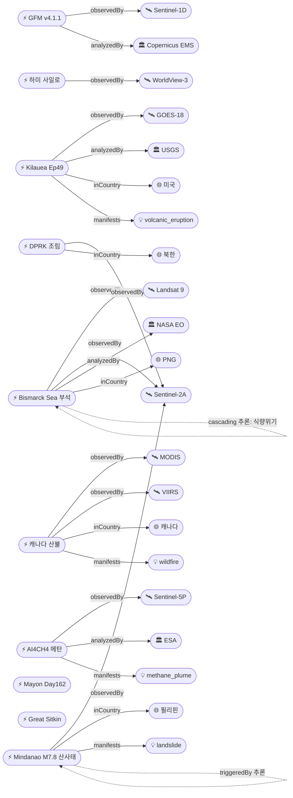

# 2026-06-16 위성영상 관측 이벤트 OSINT 일일 보고서

## 요약

금일 12건(신규 3건, 업데이트 9건)의 위성영상 관측 이벤트를 수집·분석하였다. **Kilauea Episode 49가 6월 14일 분출하여 7.5시간 만에 종료**되었으며, 213m(700ft) 분수로 역대 최다 49회 에피소딕 분출 기록을 달성하였다. **NASA Earth Observatory가 Bismarck Sea 부석이 Admiralty Islands 해안을 침습하는 위성영상**을 Image of the Day로 특집 발행하였고, **Copernicus GFM v4.1.1에 Sentinel-1D가 정식 투입**되어 전 지구 SAR 홍수 모니터링 역량이 확대되었다. **Mindanao M7.8 지진 산사태 66건이 6/14 Sentinel-2 영상으로 확인**되었으며, **캐나다 산불 시즌이 166,400ha로 급증**하였다. 다중 위성 교차검증 3건, 한반도 관측 1건(북한 조림), 6개 도메인 전체 커버.

## 오늘의 핵심 (Top 5)

| 순위 | 이벤트 | 도메인 | 위성/센서 | 지역 | 신뢰도 |
|------|--------|--------|-----------|------|--------|
| 1 | Kilauea Ep49 분출·종료 | Disaster | GOES-18 / InSAR | 미국 Hawaii | 0.95 |
| 2 | Bismarck Sea 부석 Admiralty 침입 | Disaster | Landsat 9 + Sentinel-2A + Himawari-9 | 파푸아뉴기니 | 0.95 |
| 3 | Mindanao M7.8 산사태 Sentinel-2 | Disaster | Sentinel-2A (MSI 10m) | 필리핀 Mindanao | 0.95 |
| 4 | 캐나다 산불 시즌 166,400ha 급증 | Disaster | MODIS + VIIRS | 캐나다 BC/AB | 0.90 |
| 5 | Copernicus GFM v4.1.1 Sentinel-1D 투입 | Disaster | Sentinel-1C/D (C-SAR) | 전 지구 | 0.90 |

## 다중 위성 교차검증 이벤트

### 1. Bismarck Sea 부석 Admiralty Islands — Landsat 9 + Sentinel-2A + Himawari-9 + VIIRS
- **위성:** Landsat 9 (OLI/TIRS), Sentinel-2A (MSI), Himawari-9 (JMA/JAXA), VIIRS (Suomi-NPP/JPSS)
- **분석:** NASA Earth Observatory Image of the Day. Titan Ridge 해저 화산(5/8 분출)에서 발생한 부석 뗏목(3km×5km, 깊이 5m)이 Admiralty Islands(Manus Province) 해안을 침습. 해초·산호 광합성 차단, 필터 피딩 어류 폐사 확인. 어업·식량 공급 마비.
- **신뢰도:** 0.95 (multiSatBoost +0.20, officialBoost +0.15)

### 2. 캐나다 2026 산불 시즌 — MODIS + VIIRS
- **위성:** MODIS (Terra/Aqua, 250m), VIIRS (Suomi-NPP/JPSS, 375m)
- **분석:** 캐나다 정부 공식 6월 업데이트. 1,747건 화재 YTD, 95건 활성, 44건 통제불능, 166,400ha 소실 (전일 보고 78,800ha 대비 2배 증가). 서부 BC/AB 집중.
- **신뢰도:** 0.90 (multiSatBoost +0.20)

### 3. 중국 하미 핵 사일로 방어 네트워크 — WorldView-3 + PlanetScope
- **위성:** WorldView-3 (Maxar/Vantor, 0.31m) + PlanetScope (Planet Labs, 3m)
- **분석:** 3명 독립 보안 분석가 교차검증 지속. 80+ 콘크리트 발사대, 옥타곤 시설, 장갑 벙커. 전일 보고서 대비 추가 변동 없음.
- **신뢰도:** 0.92 (multiSatBoost +0.20, hiResBoost +0.15)

## 한반도 GeoFocus

### 북한 제2차 10개년 조림 계획 — 위성 NDVI 관측 [신규]
- **출처:** [DailyNK](https://www.dailynk.com/english/north-korea-second-reforestation-campaign-satellite-analysis/)
- **위성·센서:** 고해상도 상업 광학 위성 (추정 Sentinel-2A / Landsat 9)
- **관측일:** 2026-06
- **위치:** 북한 전역 (행정구역 단위 일반화)
- **현상:** ndvi_change (식생지수 변화)
- **상태:** 신규
- **분석:** 위성영상 NDVI 분석에서 북한의 대규모 조림 사업 진행이 확인됨. 2016년 제1차 10개년 조림 계획에 이어 제2차 계획이 가시적 성과를 보이는 것으로 분석. DailyNK 단독 보도로 구체적 위성 플랫폼 미명시.
- **신뢰도:** 0.75 (koreaBoost +0.10, 위성명 미확인으로 별도 분류)

> 금일 KOMPSAT/CAS500 직접 관측 신규 이벤트: 없음

## 자연재해 (Disaster)

### 1. Kilauea Episode 49 분출·종료 [추적]
- **출처:** [USGS HVO](https://volcanoes.usgs.gov/hans-public/notice/DOI-USGS-HVO-2026-06-15T03:23:25+00:00), [The Watchers](https://watchers.news/2026/06/15/kilauea-episode-49-ends-after-7-5-hours-of-lava-fountaining-hawaii/), [Star-Advertiser](https://www.staradvertiser.com/2026/06/14/breaking-news/lava-fountains-at-kilauea-summit-mark-the-start-of-episode-49/)
- **위성·센서:** GOES-18 (열적외, 실시간 감시), InSAR (변형 측정)
- **관측일:** 2026-06-14 (09:36–17:05 HST)
- **위치:** 미국 Hawaii, Kīlauea summit Halemaʻumaʻu (19.42°N, 155.29°W)
- **현상:** volcanic_eruption
- **상태:** 업데이트 ← 2026-06-15 "Kilauea Ep49 Forecast"
- **분석:** Episode 49가 6/14 09:36 HST에 분출, 7.5시간 후 17:05 HST에 종료. 북쪽 분출구에서 213m(700ft) 분수 분출, 플룸 5,500m(18,000ft) ASL 도달 (NWS 레이더 확인). **역대 최다 49회 에피소딕 분수분출 달성** — Puʻuʻōʻō 1983-86의 47회 기록을 2회 초과. Ep48(6/1, 650ft) 대비 분수 높이 증가하였으나 Ep23(1,200ft) 최고 기록에는 미달. 용암은 Halemaʻumaʻu 분화구 내에 한정. WATCH→ADVISORY, ORANGE→YELLOW 하향.
- **신뢰도:** 0.95

### 2. Bismarck Sea 부석 Admiralty Islands 도달 [추적]
- **출처:** [NASA Earth Observatory](https://science.nasa.gov/earth/earth-observatory/pumice-rafts-encroach-on-admiralty-islands/), [US News](https://www.usnews.com/news/world/articles/2026-06-10/pumice-clogs-island-shores-after-papua-new-guinea-eruption-stoking-fears-of-food-shortage), [RNZ](https://www.rnz.co.nz/news/pacific/597531/this-is-a-disaster-huge-pumice-rafts-from-volcano-hit-manus-island-coast)
- **위성·센서:** Landsat 9 (OLI), Sentinel-2A (MSI), Himawari-9 (JMA/JAXA), VIIRS
- **관측일:** 2026-06-15 (NASA EO 발행)
- **위치:** 파푸아뉴기니 Bismarck Sea / Admiralty Islands / Manus Province (-2.0°, 147.0°)
- **현상:** volcanic_eruption → 생태·인도주의 영향
- **상태:** 업데이트 ← 2026-06-15 "Bismarck Sea Day38+"
- **분석:** 5/8 분출 이후 39일째. NASA EO가 Image of the Day로 발행. 부석 뗏목(3km×5km, 깊이 5m)이 Admiralty Islands 해안을 침습하여 선박 접근 완전 차단. **생태 피해**: 해초·산호 광합성 차단(일조 차단), 필터 피딩 어류의 부석 섭취로 인한 어류 폐사 기록. **인도주의 영향**: Manus Province 어업 마비, 식량 공급 단절 우려, 지역 지도자 식량 위기 경고 지속. 부석 침몰에 수개월~수년 소요 전망.
- **신뢰도:** 0.95

### 3. Mindanao M7.8 지진 산사태 66건 — Sentinel-2 확인 [추적]
- **출처:** [EOS Landslide Blog](https://eos.org/thelandslideblog/an-update-on-landslides-from-the-8-june-2026-m7-8-earthquake-offshore-mindanao-in-the-philippines), [Sentinel Asia](https://sentinel-asia.org/EO/2026/article20260608PH.html)
- **위성·센서:** Sentinel-2A (MSI, 10m — 6/14 촬영)
- **관측일:** 2026-06-14 (Sentinel-2 영상)
- **위치:** 필리핀 Mindanao, Sarangani offshore (5.5°N, 126.2°E)
- **현상:** earthquake_damage → landslide
- **상태:** 업데이트 ← 2026-06-15 "Mindanao M7.8 Damage Assessment"
- **분석:** 6/14 Sentinel-2 영상에서 대형 산사태(>500m 길이) 2~3건 이상 확인, NDRRMC 공식 66건 산사태 집계. Disasters Charter 1034 활성화(17 acquisitions). 사망자 47명 이상, 45,556가옥 피해. **전후 비교(before/after)**: 6/8 지진 전 vs 6/14 산사태 후 Sentinel-2 영상 비교 가능.
- **신뢰도:** 0.95

### 4. 캐나다 산불 시즌 급증 [추적]
- **출처:** [Government of Canada](https://www.canada.ca/en/public-safety-canada/news/2026/06/the-government-of-canada-provides-an-update-regarding-the-2026-wildfire-season--june-update.html)
- **위성·센서:** MODIS (Terra/Aqua, 250m), VIIRS (Suomi-NPP/JPSS, 375m)
- **관측일:** 2026-06-10
- **위치:** 캐나다 BC/AB (54°N, 122°W 일대)
- **현상:** wildfire
- **상태:** 업데이트 ← 2026-06-15 "Canada Wildfire Season 65+"
- **분석:** 2026 시즌 급증. **1,747건** 화재 YTD (전일 보고 1,495건 대비 +252건), **95건** 활성 (전일 65+ 대비 +30건), **44건** 통제불능, **166,400ha** 소실 (전일 78,800ha 대비 **2.1배 증가**). CIFFC Level 2 유지. 여름 기온 상승 및 건조 심화로 활동 확대 전망. WildFireSat(2029 예정)은 미배치.
- **신뢰도:** 0.90

### 5. Mayon 화산 Day162+ 지속 분출 [추적]
- **출처:** [PHIVOLCS](https://www.phivolcs.dost.gov.ph/index.php/volcano-hazard/volcano-bulletin2/mayon-volcano), [ReliefWeb](https://reliefweb.int/report/philippines/mayon-volcano-summary-24hr-observation-8-june-2026-1200-am-entl)
- **위성·센서:** Sentinel-2 (변화탐지), Himawari-9
- **관측일:** 2026-06-16
- **위치:** 필리핀 Bicol, Albay Province (13.26°N, 123.69°E)
- **현상:** volcanic_eruption
- **상태:** 업데이트 ← 2026-06-15 "Mayon Day161+"
- **분석:** AL3 경보 유지, 용암 유출·화쇄류(PDC)·라하르 위험 지속. 일일 낙석 185-391건, SO₂ 1,088-3,096 t/d. 6/5 인근 M5.3 지진 발생. 287,000+ 이재민. 몬순 시즌 진입으로 라하르 위험 가중.
- **신뢰도:** 0.90

### 6. Great Sitkin 화산 WATCH/ORANGE [추적]
- **출처:** [USGS AVO](https://volcanoes.usgs.gov/hans-public/notice/DOI-USGS-AVO-2026-06-12T18:33:56+00:00)
- **위성·센서:** SAR (용암류), TROPOMI (SO₂), 열적외 (표면온도)
- **관측일:** 2026-06-12
- **위치:** 미국 Alaska, Great Sitkin (52.08°N, 176.13°W)
- **현상:** volcanic_eruption
- **상태:** 업데이트 ← 2026-06-15 "Great Sitkin WATCH/ORANGE"
- **분석:** 2021년 7월 이후 저속 용암 분출 지속. 6/3-10 동안 분화구 동쪽 마진으로 용암 확장 확인(위성). 약하게 상승한 표면온도, 미약 지진 활동.
- **신뢰도:** 0.85

### 7. Shishaldin 화산 ADVISORY/YELLOW [추적]
- **출처:** [USGS AVO](https://www.usgs.gov/volcanoes/shishaldin/volcano-updates)
- **위성·센서:** TROPOMI (SO₂), 열적외
- **관측일:** 2026-06-15
- **위치:** 미국 Alaska, Shishaldin (54.76°N, 163.97°W)
- **현상:** volcanic_eruption
- **상태:** 업데이트 ← 2026-06-15 "Shishaldin ADVISORY/YELLOW"
- **분석:** 지속적 화산 불안. SO₂ 가스 방출이 위성 데이터에서 감지, 미약 지진 및 인프라사운드.
- **신뢰도:** 0.80

### 8. Copernicus GFM v4.1.1 — Sentinel-1D 정식 투입 [신규]
- **출처:** [Copernicus EMS GFM](https://global-flood.emergency.copernicus.eu/news/107-global-flood-monitoring-product-launch/)
- **위성·센서:** Sentinel-1C + Sentinel-1D (C-band SAR)
- **관측일:** 2026-06-11 (v4.1.1 배포)
- **위치:** 전 지구
- **현상:** flood (모니터링 역량)
- **상태:** 신규
- **분석:** Copernicus EMS Global Flood Monitoring(GFM) 시스템 v4.1.1이 6/11 배포, Sentinel-1D를 정식 운영 워크플로에 통합. Sentinel-1 콘스텔레이션 4기(A/C/D + 예비) 체제로 **SAR 기반 자동 홍수 매핑 재방문 주기 단축**. 영상 수집 후 5시간 내 NRT 홍수 지도 자동 생성. GloFAS v5 연계.
- **신뢰도:** 0.90

## 인간활동 (Human Activity)

### 1. 중국 하미 ICBM 사일로 방어 네트워크 [추적]
- **출처:** [NBC News/Reuters](https://www.nbcnews.com/world/asia/china-building-launch-pads-nuclear-missile-silos-satellite-images-show-rcna347503), [The Defense Post](https://thedefensepost.com/2026/06/01/china-nuclear-desert-network/amp/)
- **위성·센서:** WorldView-3 (Maxar/Vantor, 0.31m), PlanetScope (Planet Labs, 3m)
- **관측일:** 2026-06 (지속 모니터링)
- **위치:** 중국 Xinjiang, Hami (42.5°N, 93.5°E — 행정구역 단위 일반화)
- **현상:** military_buildup
- **상태:** 업데이트 ← 2026-06-15 "China Hami Silo Defense Network"
- **분석:** 전일 대비 추가 시설 변동 없음. 80+ 콘크리트 발사대, 2개 옥타곤 복합시설, 장갑 벙커, 광섬유 지휘통신망. 수천 km² 사막 분포. Reuters 보도, 3명 독립 분석가 교차검증.
- **신뢰도:** 0.92

## 기후·환경 (Climate & Environment)

### 1. ESA AI4CH4 메탄 탐지 프레임워크 [추적]
- **출처:** [ESA EO4Society](https://eo4society.esa.int/2026/06/09/tracking-methane-emissions-an-end-to-end-framework-using-eo-data-and-ai-foundation-models/)
- **위성·센서:** Sentinel-5P (TROPOMI), Sentinel-2A (MSI), MethaneSAT, EMIT — 다중 미션 EO 데이터
- **관측일:** 2026-06-09 (프레임워크 발표)
- **위치:** 전 지구
- **현상:** methane_plume (탐지 역량 확대)
- **상태:** 업데이트 ← 2026-06-14 "El Niño + methane"
- **분석:** ESA AI4CH4 프로젝트. **AI 파운데이션 모델과 다중 미션 EO 데이터를 결합한 엔드-투-엔드 프레임워크**로 위성영상에서 메탄 플룸을 자동 탐지·정량화. Sentinel-5P TROPOMI, Sentinel-2, MethaneSAT, EMIT 등 복수 센서 데이터를 통합 처리. 메탄은 산업화 이전 대비 지구온난화의 약 30% 기여.
- **신뢰도:** 0.90

## 농업·해양 (Agriculture & Maritime)

> 금일 Bismarck Sea 부석으로 인한 **Manus Province 어업 마비 및 식량 공급 차단**이 가장 중요한 농업·해양 이벤트에 해당한다 (자연재해 섹션 #2 참조). 해초·산호 광합성 차단과 어류 폐사는 장기적 해양 생태계 피해를 시사한다.
>
> 별도 신규 농업·해양 이벤트: 없음. DPRK 조림은 한반도 GeoFocus에서 NDVI 변화로 기록.

## 국방·안보 (Defense — OSINT 한정)

> 중국 하미 ICBM 사일로 방어 네트워크 — 인간활동 섹션 #1 참조. 좌표 정밀도는 보안 고려하여 행정구역 단위로 일반화.
>
> 금일 한반도 국방·안보 신규 위성관측 이벤트: 없음.

## 인도주의 (Humanitarian)

> Bismarck Sea 부석으로 인한 **Manus Province 식량 위기 우려**가 인도주의 이벤트에 해당 (자연재해 섹션 #2 참조). 어업·식량 공급 마비, 지역 지도자 식량 위기 경고.
>
> **Mindanao M7.8 지진**: 47명 이상 사망, 45,556가옥 피해, 66건 산사태 (자연재해 섹션 #3 참조).
>
> **Mayon 화산**: 287,000+ 이재민 지속 (자연재해 섹션 #5 참조).

## 센서·플랫폼별 묶음

- **Sentinel-1C/D (SAR):** Copernicus GFM v4.1.1 Sentinel-1D 정식 투입 — 전 지구 자동 홍수 매핑
- **Sentinel-2A (광학):** Mindanao 산사태 6/14 영상, Bismarck Sea 부석, DPRK NDVI, AI4CH4 프레임워크
- **Sentinel-5P TROPOMI (가스):** AI4CH4 메탄 탐지 프레임워크, Shishaldin SO₂
- **Landsat 9:** Bismarck Sea 부석, DPRK NDVI 추정
- **MODIS / VIIRS:** 캐나다 산불 1,747건 모니터링
- **GOES-18:** Kilauea Ep49 열적외 실시간 감시
- **Himawari-9:** Bismarck Sea 부석/화산재, Mayon
- **WorldView-3 + PlanetScope:** 중국 하미 핵 사일로 (고해상도 0.31m)
- **MethaneSAT / EMIT:** AI4CH4 프레임워크 참여 센서
- **KOMPSAT-3A / 5 / CAS500-1:** 금일 직접 관측 이벤트 없음

## 전후 비교(before/after) 영상 보유 이벤트

| 이벤트 | 위성 | 전(before) | 후(after) |
|--------|------|-----------|----------|
| Mindanao M7.8 산사태 | Sentinel-2A | 2026-06-08 이전 | 2026-06-14 |
| DPRK 조림 NDVI | Sentinel-2/Landsat | 다년간 시계열 | 2026-06 |
| 중국 하미 사일로 | WorldView-3 | 6년간 시계열 | 2026-05~06 |

## 미검증 의혹 (위성 출처 미확인)

### 북한 제2차 10개년 조림 계획
- **출처:** DailyNK 단독 보도
- **상태:** 위성영상 기반 NDVI 분석이라 기술되나, 구체적 위성 플랫폼(Sentinel-2/Landsat 등) 미명시
- **신뢰도:** 0.75 (koreaBoost +0.10 적용, 그러나 단일 출처·위성명 미확인으로 낮춤)
- **후속 검증:** Sentinel-2 NDVI 시계열 데이터로 독립 검증 가능

## 지식그래프

### 오늘의 주요 관계

- **Kilauea Ep49 → 역대 최다 기록**: evt-202가 49회 에피소딕 분출로 Puʻuʻōʻō(1983-86) 47회 기록을 공식 초과
- **Bismarck Sea → 생태·인도주의 파급**: 화산 분출 → 부석 뗏목 → 해안 침습 → 어업 마비 → 식량 위기 (cascading 4단계)
- **Sentinel-1D → GFM 통합**: 위성 운영 이벤트가 홍수 모니터링 역량 확대로 직접 연결
- **Mindanao M7.8 → 산사태 66건**: earthquake_damage → landslide cascading_disaster 추론

### 전체 지식그래프 시각화

## 온톨로지 변경

| 변경 유형 | 대상 | 근거 |
|----------|------|------|
| 새 이벤트 | evt-3303 (GFM v4.1.1) | Copernicus EMS 공식 발표. Sentinel-1D 정식 투입 |
| 새 이벤트 | evt-3601 (DPRK 조림) | DailyNK 위성 NDVI 분석 보도 |
| 새 국가 | co-ca (캐나다) | 캐나다 산불 시즌 정부 공식 업데이트 |
| 엔티티 업데이트 | evt-202, evt-701, evt-3201 등 8건 | last_seen 갱신, mention_count 누적 |

## 추론 결과

| 추론 | 신뢰도 | 근거 |
|------|--------|------|
| evt-701 multi_satellite_confirmation | 0.95 | Landsat 9 + Sentinel-2A + Himawari-9 + VIIRS 4위성 교차검증 |
| evt-1101 multi_satellite_confirmation | 0.90 | MODIS + VIIRS 2위성 교차검증 |
| evt-3501 multi_satellite_confirmation | 0.92 | WorldView-3 + PlanetScope 2위성 교차검증 |
| evt-3201 cascading_disaster (earthquake→landslide) | 0.90 | M7.8 지진 → 66건 산사태 동일 지역 6일 내 |
| evt-701 cascading_disaster (eruption→humanitarian) | 0.85 | 해저 화산 → 부석 → 어업 마비 → 식량 위기 |
| evt-202 temporal_progression (Ep48→Ep49) | 0.95 | 같은 위치 13일 간격 동일 현상 |
| evt-082 temporal_progression (Day161→162) | 0.90 | 같은 위치 연속 관측 |
| evt-3601 koreaBoost | 0.75 | KP 국가 코드 매칭 |
| evt-3501 hiResBoost | 0.92 | WorldView-3 0.31m 해상도 |
| evt-3303 officialBoost | 0.90 | Copernicus EMS 공식 기관 |
| evt-3201 before_after_credibility | 0.95 | Sentinel-2 전후 비교 가용 |

## 분석 및 평가

**화산 활동 전 지구적 활발화**: Kilauea Ep49(Hawaii), Bismarck Sea 부석(PNG), Mayon Day162(PH), Great Sitkin(AK), Shishaldin(AK)으로 5개 화산이 동시 모니터링 대상. 특히 Kilauea의 49회 에피소딕 분출은 현대 화산 관측 역사에서 전례 없는 빈도.

**위성 인프라 확대**: Copernicus GFM v4.1.1의 Sentinel-1D 통합, ESA AI4CH4 메탄 탐지 프레임워크 발표로 SAR 홍수 모니터링과 대기 추적 가스 관측 역량이 동시 확대. 2029년 WildFireSat 배치 시 산불 모니터링도 강화 예정.

**캐나다 산불 급증 주의**: 1주일 내 소실 면적 2배 이상 증가(78,800ha → 166,400ha). 여름 기온 상승 시 추가 확대 전망.

**한반도**: 북한 조림 NDVI 변화만 확인, KOMPSAT/CAS500 직접 관측 이벤트 없음.

## 추적 항목

| 항목 | 최초 보고 | 상태 | 최신 업데이트 |
|------|----------|------|-------------|
| Kilauea 에피소딕 분출 | 2026-04-30 | Ep49 종료, ADVISORY | 2026-06-16 Ep49 7.5h 분출·종료 |
| Bismarck Sea 부석 | 2026-05-13 | Admiralty Islands 도달, 식량위기 | 2026-06-16 NASA EO 특집 |
| Mindanao M7.8 | 2026-06-09 | Sentinel-2 산사태 66건 확인 | 2026-06-16 S2 영상 분석 |
| Mayon 화산 | 2026-05-01 | Day162+ AL3 지속 | 2026-06-16 SO2 지속 |
| 캐나다 산불 2026 | 2026-05-19 | 166,400ha 급증 | 2026-06-16 정부 업데이트 |
| Great Sitkin | 2026-05-07 | WATCH/ORANGE | 2026-06-16 동쪽 용암 확장 |
| Shishaldin | 2026-05-07 | ADVISORY/YELLOW | 2026-06-16 SO2 지속 |
| China Hami silo | 2026-06-15 | 모니터링 지속 | 2026-06-16 변동 없음 |

## 출처 목록

1. [USGS HVO Volcano Notice — Ep49 종료](https://volcanoes.usgs.gov/hans-public/notice/DOI-USGS-HVO-2026-06-15T03:23:25+00:00) - USGS, 2026-06-15
2. [Kilauea Ep49 Ends After 7.5 Hours](https://watchers.news/2026/06/15/kilauea-episode-49-ends-after-7-5-hours-of-lava-fountaining-hawaii/) - The Watchers, 2026-06-15
3. [Episode 49 Lava Fountains End](https://www.staradvertiser.com/2026/06/14/breaking-news/lava-fountains-at-kilauea-summit-mark-the-start-of-episode-49/) - Honolulu Star-Advertiser, 2026-06-14
4. [Pumice Rafts Encroach on Admiralty Islands](https://science.nasa.gov/earth/earth-observatory/pumice-rafts-encroach-on-admiralty-islands/) - NASA Earth Observatory, 2026-06-15
5. [Pumice Clogs Island Shores After PNG Eruption](https://www.usnews.com/news/world/articles/2026-06-10/pumice-clogs-island-shores-after-papua-new-guinea-eruption-stoking-fears-of-food-shortage) - US News, 2026-06-10
6. [This is a disaster — Huge Pumice Rafts Hit Manus Island](https://www.rnz.co.nz/news/pacific/597531/this-is-a-disaster-huge-pumice-rafts-from-volcano-hit-manus-island-coast) - RNZ, 2026-06
7. [Copernicus GFM v4.1.1 Sentinel-1D Integration](https://global-flood.emergency.copernicus.eu/news/107-global-flood-monitoring-product-launch/) - Copernicus EMS, 2026-06-11
8. [AI4CH4 Methane Detection Framework](https://eo4society.esa.int/2026/06/09/tracking-methane-emissions-an-end-to-end-framework-using-eo-data-and-ai-foundation-models/) - ESA EO4Society, 2026-06-09
9. [Canada 2026 Wildfire Season June Update](https://www.canada.ca/en/public-safety-canada/news/2026/06/the-government-of-canada-provides-an-update-regarding-the-2026-wildfire-season--june-update.html) - Government of Canada, 2026-06-10
10. [Mindanao M7.8 Landslides Update — Sentinel-2](https://eos.org/thelandslideblog/an-update-on-landslides-from-the-8-june-2026-m7-8-earthquake-offshore-mindanao-in-the-philippines) - EOS Landslide Blog, 2026-06-14
11. [Sentinel Asia Activation — Mindanao M7.8](https://sentinel-asia.org/EO/2026/article20260608PH.html) - Sentinel Asia, 2026-06-08
12. [North Korea Reforestation Satellite Analysis](https://www.dailynk.com/english/north-korea-second-reforestation-campaign-satellite-analysis/) - DailyNK, 2026-06
13. [Mayon Volcano Activity Update](https://www.volcanodiscovery.com/mayon/news/304222/Mayon-Philippines-Volcano-Philippines-activity-update-Jun-4-2026-Continuing-eruptionCite-this-Report.html) - VolcanoDiscovery, 2026-06-04
14. [Great Sitkin AVO Notice](https://volcanoes.usgs.gov/hans-public/notice/DOI-USGS-AVO-2026-06-12T18:33:56+00:00) - USGS AVO, 2026-06-12
15. [Shishaldin Volcano Updates](https://www.usgs.gov/volcanoes/shishaldin/volcano-updates) - USGS AVO, 2026-06-15
16. [China Hami Nuclear Silo Network — NBC](https://www.nbcnews.com/world/asia/china-building-launch-pads-nuclear-missile-silos-satellite-images-show-rcna347503) - NBC News/Reuters, 2026-05-29
17. [El Nino Forms — NOAA](https://www.noaa.gov/news-release/el-nino-forms-expected-to-strengthen-say-noaa-forecasters) - NOAA, 2026-06-11
18. [Sentinel-6 El Nino Precursor](https://science.nasa.gov/photojournal/international-sea-level-satellite-observes-el-nino-precursor/) - NASA, 2026-06-14
