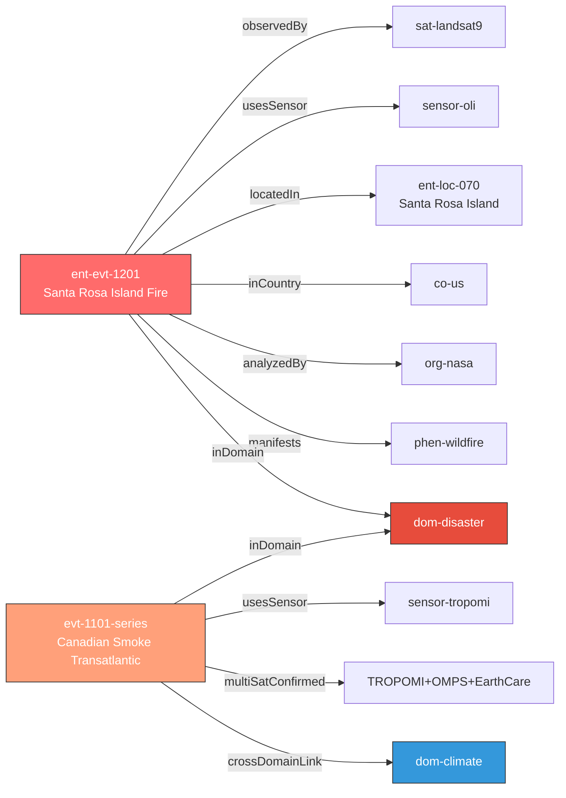

# 2026-05-21 보고서 기반 문서 (Phase 4 -> Phase 5)

## 보고서 구성 근거

### 1순위: 자연재해 (Disaster)

#### [신규] Santa Rosa Island Fire (ent-evt-1201)
- **위치:** Santa Rosa Island, Channel Islands National Park, CA (33.95N, 120.1W)
- **규모:** 16,942 acres (68.6 km2), 26% contained
- **원인:** 조난 선원 SOS 신호탄 (shipwrecked mariner)
- **위성:** Landsat 9 OLI (false-color bands 7-5-3 + natural-color)
- **출처:** NASA Earth Observatory Image of the Day (May 20)
- **신뢰도:** 0.95 (officialBoost + baCredibility + priorityBoost)
- **before/after:** 가용 — false-color burn scar extent
- **보고서 배치:** 1순위 섹션 첫 항목 (신규 고위험 재해)

#### [업데이트] Canadian Wildfire Smoke Transatlantic (evt-1101 시리즈)
- **핵심:** CAMS 확인 — 캐나다 산불 연기가 대서양 횡단, 그리스/동지중해 도달 (5/18-19, ~9,000m 고도)
- **탄소:** 56Mt (역대 2위 기록)
- **다중위성:** TROPOMI (Sentinel-5P, ESA) + OMPS (NOAA) + EarthCare (ESA/JAXA)
- **신뢰도:** 0.97 (multiSatBoost + officialBoost + tracegasBoost)
- **도메인 교차:** Disaster (산불) -> ClimateEnvironment (대기오염/탄소배출)
- **보고서 배치:** 1순위 섹션 (재해 후속 + 기후 교차)

#### [유지] Kilauea Ep48 (evt-202)
- ADVISORY/YELLOW, 9.5 urad, 5/22-26 예보 창 (D-1~5)
- 내일부터 분수분출 가능 — 주의 환기
- 보고서 배치: 화산 추적 항목

#### [유지] Bismarck Sea 해저화산 (evt-701)
- 부석 뗏목 70km2+, 열수분출 지속
- 10년래 최대 심해 해저분출
- 보고서 배치: 화산 추적 항목

#### [유지] 활성 화산 목록
- Great Sitkin (evt-203): WATCH/ORANGE, lava dome
- Shishaldin (evt-204): ADVISORY/YELLOW, SO2
- Mayon (evt-082): 지속 분출, Day 135+
- Bezymianny (evt-801): VAAC Tokyo advisory
- Ibu (evt-504): 641 eruptions in 2026

#### [유지] Everglades (evt-501)
- contained and controlled, 추적 유지

### 2순위: 인간활동 (HumanActivity)

#### [유지] Pemex Cantarell (evt-125), Kharg Island, 남중국해, NK 시설, Bellingcat 남레바논
- 상세: 추적 유지, 금일 변경 없음

### 3순위: 기후/환경 (ClimateEnvironment)

#### [업데이트] Canadian smoke -> 기후 교차 (1순위와 연결)
- 56Mt 탄소, 대서양 횡단, 동지중해 영향

#### [유지] 북극 해빙, Hektoria Glacier, UNEP MARS, Tanager-1, Climate TRACE

### 4순위: 농업/해양 (AgricultureMaritime)

#### [유지] 동해 어선, Amazon Xingu
#### 금일 신규 없음 — 보고서에 "금일 농업/해양 신규 이벤트 없음" 명시

## 미검증 의혹 (satellite_unverified)

- DPRK 조선중앙TV 산불 보도 (evt-090): 위성 영상 부재 지속. 신뢰도 0.55.
- Fuego 화산 GT: satellite_unverified 지속.

## KG 시각화 (Mermaid) — 금일 핵심 트리플

## 보고서 제목 제안

**2026-05-21 위성영상 관측 이벤트 일일 다이제스트**

핵심: Santa Rosa Island 산불 Landsat 9 관측 + 캐나다 연기 대서양 횡단 다중위성 확인
