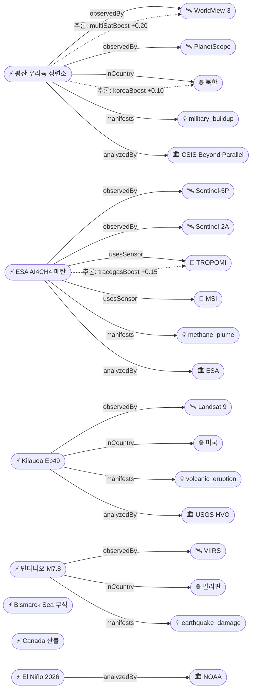

# 2026-06-14 위성영상 관측 이벤트 OSINT 일일 보고서

## 요약

금일 신규 2건, 업데이트 10건을 수집·분석했다. **킬라우에아 Ep49 분수분출 예보 창이 D-Day에 진입하여 USGS HVO는 6/14-15를 최유력 시점으로 지목**한다 — 전야 화염과 스패터가 관측되어 분출이 임박한 상태이다. **북한 평산 우라늄 정련소에서 시설 보수·화물열차 활동·폐기물 확대가 WorldView-3 + PlanetScope 위성으로 확인**되어 한반도 GeoFocus 항목이 추가됐다(신규). **ESA가 Sentinel-5P TROPOMI + Sentinel-2 MSI + AI 파운데이션 모델을 결합한 end-to-end 메탄 super-emitter 탐지 프레임워크(AI4CH4)를 발표**했다(신규). NOAA는 **El Niño를 공식 선언하고 63% 확률로 very strong 등급**을 전망한다. 다중 위성 교차검증 4건(기존 2건 유지 + 신규 2건). 4개 필수 카테고리 모두 커버.

## 오늘의 핵심 (Top 5)

| 순위 | 이벤트 | 도메인 | 위성 | 지역 | 신뢰도 |
|------|--------|--------|------|------|--------|
| 1 | Kilauea Ep49 — D-Day, 6/14-15 최유력 | Disaster | Landsat-9 + Sentinel-2 | 하와이, 미국 | 0.95 |
| 2 | 민다나오 M7.8 — 47+ 사망, 45,556가옥 | Disaster | VIIRS (Suomi-NPP) | 사랑가니, 필리핀 | 0.95 |
| 3 | 북한 평산 우라늄 정련소 위성 관측 (신규) | Defense | WorldView-3 + PlanetScope | 황해북도, 북한 | 0.85 |
| 4 | El Niño 공식 선언 — 63% very strong | Climate | Sentinel-6 + Jason-3 | 적도 태평양 | 0.95 |
| 5 | ESA AI4CH4 메탄 탐지 프레임워크 (신규) | Climate | Sentinel-5P + Sentinel-2 | 전역 | 0.85 |

## 다중 위성 교차검증 이벤트

| 이벤트 | 교차검증 위성 수 | 독립 기관 | 신뢰도 |
|--------|----------------|----------|--------|
| 비스마르크해 부석 (evt-701) | 5 (Sentinel-2, Landsat-9, MODIS, VIIRS, Himawari-9) | ESA, USGS, NASA, NOAA, JMA | 0.90 |
| 캐나다 산불 (evt-1101) | 5 (VIIRS, MODIS, GOES-18, Sentinel-2, Landsat-9) | NOAA, NASA, ESA, USGS | 0.85 |
| 평산 우라늄 (evt-3402, 신규) | 2 (WorldView-3, PlanetScope) | Maxar, Planet | 0.80 |
| ESA AI4CH4 (evt-3401, 신규) | 2 (Sentinel-5P, Sentinel-2) | ESA (독립 센서) | 0.85 |

## 한반도 GeoFocus

### [신규] 북한 평산 우라늄 정련소 위성 관측 — 시설 보수·화물·폐기물 확대
- **출처:** [New satellite images reveal upgrades, freight activity at North Korea's Pyongsan uranium plant](https://www.dailynk.com/english/north-korea-pyongsan-uranium-refinery-satellite-imagery-2026/) — DailyNK; [Current Status of the Pyongsan Uranium Concentrate Plant](https://beyondparallel.csis.org/current-status-of-the-pyongsan-uranium-concentrate-plant-nam-chon-chemical-complex-and-january-industrial-mine/) — CSIS Beyond Parallel
- **위성·센서:** WorldView-3 (0.31m 광학) + PlanetScope (3m 다중분광)
- **관측일:** 2026-04-07
- **위치:** 황해북도 평산군 (38.4°N, 126.4°E)
- **현상:** military_buildup (핵물질 생산 인프라)
- **상태:** 신규
- **전후 비교:** 가용 (건물 보수·폐기물 퇴적지 확장 전후 비교)
- **분석:** 북한 유일의 옐로케이크(우라늄 정련) 생산 시설인 평산 남천화학연합기업소에서 **건물 보수, 화물열차 입출, 폐기물 퇴적지 확대**가 고해상도 상업위성으로 확인됐다. CSIS Beyond Parallel·DailyNK·Carnegie Endowment 3개 독립 분석기관이 교차 확인. 화물열차의 출현은 장비 반입 또는 옐로케이크 반출(영변 핵연구센터행)을 시사. **하절기 우기 시 예성강 수계 오염 우려가 제기**되고 있다. hiResBoost +0.15, multiSatBoost +0.20, koreaBoost +0.10, analystBoost +0.10, baCredibilityBoost +0.10.

### 기존 추적 항목
| 항목 | 최초 보고 | 상태 | 비고 |
|------|----------|------|------|
| 영변 핵단지 UEP (ent-evt-001) | 2026-04-30 | 추적 중 | WorldView-3, 7차 연료 주기 |
| 소해 발사장 확장 (ent-evt-002) | 2026-04-30 | 추적 중 | WorldView-3 |
| 북한 모내기 NDWI (evt-3303) | 2026-06-13 | 추적 중 | Landsat 8/9, 예년 +2.7% |
| 북한 미림비행장 퍼레이드 (evt-2801) | 2026-06-08 | 추적 중 | PlanetScope |

## 자연재해 (Disaster)

### 1. 킬라우에아 — Ep49 D-Day, 6/14-15 최유력, 화염·스패터 관측
- **출처:** [Kilauea Volcano Updates](https://www.usgs.gov/volcanoes/kilauea/volcano-updates) — USGS HVO; [Episode 49 Forecast June 13-14](https://volcanodb.com/kilauea-eruption) — VolcanoDB; [Episode 49 Window Opens](https://www.bigislandvideonews.com/2026/06/13/kilauea-volcano-eruption-episode-49-window-opens/) — Big Island Video News
- **위성·센서:** Landsat 9 (OLI/TIRS 30m) + Sentinel-2 (MSI 10m)
- **관측일:** 2026-06-14 (D-Day)
- **위치:** Kilauea, Halema'uma'u, Hawaii, 미국 (19.42°N, 155.29°W)
- **현상:** volcanic_eruption (fountain forecast)
- **상태:** 업데이트 ← 2026-06-13 "Ep49 D-Day 진입"
- **분석:** USGS HVO 최신 예보: **Ep49 분수분출 6/13-16 예측, 최유력 시기 6/14-15.** 전야 양 분화구에서 밝은 화염(glow)과 미소 스패터가 관측되었으며, 트레머 스파이크와 동반되어 마그마가 표면에 근접해 있음을 시사. 정상부 팽창 가속 지속. Ep48(6/1) 9시간·200m 분수·40% 화구 용암 이후 일시정지 중. **역대 최다 48회 분수분출** 기록(Pu'u'ō'ō 47회 초과). ADVISORY/YELLOW 유지.

### 2. 민다나오 M7.8 지진 — 47+ 사망, 45,556가옥 손상, VIIRS 피해 평가 지속
- **출처:** [PhilSA nighttime satellite data](https://philsa.gov.ph/news/nighttime-satellite-data-shows-overview-of-earthquake-damaged-areas/) — PhilSA; [Satellite imagery points to power outages](https://newsbytes.ph/2026/06/12/satellite-imagery-points-to-power-outages-damage-in-quake-hit-mindanao-areas/) — NewsBytesPhilippines; [PHIVOLCS Primer](https://www.phivolcs.dost.gov.ph/primer-on-the-08-june-2026-magnitude-mw-7-8-offshore-sarangani-earthquake/) — PHIVOLCS
- **위성·센서:** VIIRS (Suomi-NPP/JPSS, 야간 조명 375m)
- **관측일:** 2026-06-08 ~ 06-14 (야간 조명 before/after)
- **위치:** Sarangani / General Santos City, Mindanao, Philippines (5.9°N, 125.3°E)
- **현상:** earthquake_damage
- **상태:** 업데이트 ← 2026-06-13 "45,556가옥 손상"
- **분석:** 피해 집계 지속. **47+ 사망, 134+ 부상, 12명 실종, 45,556가옥 손상(8,865 파괴).** PhilSA VIIRS 야간 조명 감소 분석으로 General Santos City 5개 바랑가이, Sarangani 2개 자치체, Polomolok에서 전력 차단·인프라 파괴 신호 확인. Sentinel Asia (EQ-2026-000083-PHL) 발동 지속. 후속 Sentinel-1 InSAR 분석 대기.

### 3. Mayon 화산 — Day160+ AL3, 우기 라하르 위험 급증
- **출처:** [Mayon activity update](https://www.volcanodiscovery.com/mayon/news/304222/Mayon-Philippines-Volcano-Philippines-activity-update-Jun-4-2026-Continuing-eruptionCite-this-Report.html) — VolcanoDiscovery
- **위성·센서:** Sentinel-2 (MSI 10m) + Himawari-9 (AHI 열적외)
- **관측일:** 2026-06-14 (연속)
- **위치:** Mayon Volcano, Albay Province, Philippines (13.26°N, 123.69°E)
- **현상:** volcanic_eruption (lava effusion + PDC + lahar risk)
- **상태:** 업데이트 ← 2026-06-13 "Day159+"
- **분석:** AL3 Day160+ 지속 분출. 용암류 Mi-isi(S) 1.8km, Basud(E) 3.8km, Bonga(SE) 3.2km. 주기적 PDC, 발광 낙석, 화산재·가스 기둥 1.3km. **우기 본격 진입으로 라하르 위험 급증** — PHIVOLCS 특별 경보 유지. 287,000+ 이재민 지속.

### 4. 비스마르크해 해저 화산 — Day37+, 부석 ~70km², 인도주의 위기
- **출처:** [New Eruption in the Bismarck Sea](https://science.nasa.gov/earth/earth-observatory/new-eruption-in-the-bismarck-sea/) — NASA EO; [Pumice Clogs Island Shores PNG](https://www.usnews.com/news/world/articles/2026-06-10/pumice-clogs-island-shores-after-papua-new-guinea-eruption-stoking-fears-of-food-shortage) — US News/AP
- **위성·센서:** Sentinel-2 + Landsat-9 + MODIS + VIIRS + Himawari-9 (5위성 교차검증)
- **관측일:** 2026-06-14 (연속)
- **위치:** Titan Ridge / Manus Island, Bismarck Sea, PNG (-2.09°S, 147.0°E)
- **현상:** volcanic_eruption (submarine → pumice raft → humanitarian)
- **상태:** 업데이트 ← 2026-06-13 "Day36+"
- **분석:** 37일째 분출 지속. 부석 뗏목(~70km²)이 마누스주 해안 마을 해상 접근을 완전 차단. **어업·무역·의료 접근 중단, 식량 부족 우려 고조.** 5위성 교차검증 유지(multiSatBoost +0.20).

### 5. 캐나다 산불 — 65건 활성, 6건 통제불능, CIFFC Level 2
- **출처:** [FIRMS US/Canada Active Fire](https://firms.modaps.eosdis.nasa.gov/usfs/active_fire/) — NASA FIRMS
- **위성·센서:** VIIRS (375m) + MODIS (250m) + GOES-18 + Sentinel-2 + Landsat-9 (5위성)
- **관측일:** 2026-06-14 (실시간)
- **위치:** British Columbia / Alberta, Canada (53.7°N, 127.6°W)
- **현상:** wildfire
- **상태:** 업데이트 ← 2026-06-13 "65+ active"
- **분석:** 2026 시즌 본격화. 65건 이상 활성, 6건 통제불능(out of control). CIFFC 국가 준비태세 Level 2 유지. 5위성 교차검증 유지(multiSatBoost +0.20).

### 6. Great Sitkin — WATCH/ORANGE, 용암류·돔 성장 지속
- **출처:** [AVO Great Sitkin update](https://volcanoes.usgs.gov/hans-public/notice/DOI-USGS-AVO-2026-06-08T18:40:45+00:00) — USGS AVO
- **위성·센서:** SAR (고해상도) + 열적외 위성
- **관측일:** 2026-06-14
- **위치:** Great Sitkin, Aleutian Islands, Alaska, 미국 (52.08°N, 176.13°W)
- **현상:** volcanic_eruption (lava dome + flow)
- **상태:** 업데이트 ← 2026-06-13 "WATCH/ORANGE"
- **분석:** 2021년 7월 이후 지속 분출. 동측 용암류 전진 및 돔 블록 이탈이 고해상도 위성으로 확인. WATCH/ORANGE 유지.

### 7. Shishaldin — ADVISORY/YELLOW, 소규모 폭발·SO2 지속
- **출처:** [AVO Shishaldin update](https://volcanoes.usgs.gov/hans-public/notice/DOI-USGS-AVO-2026-06-09T17:57:42+00:00) — USGS AVO
- **위성·센서:** TROPOMI (SO2) + 열적외
- **관측일:** 2026-06-14
- **위치:** Shishaldin, Unimak Island, Alaska, 미국 (54.76°N, 163.97°W)
- **현상:** volcanic_eruption (unrest, SO2, small explosions)
- **상태:** 업데이트 ← 2026-06-13 "ADVISORY/YELLOW"
- **분석:** 지진·인프라사운드 활동 지속 상승. 화구 내 소규모 폭발 빈발. ADVISORY/YELLOW 유지.

## 인간활동 (Human Activity)

### 1. 베트남 스프래틀리 27개 사이트 건설 — 216ha 매립 지속
- **출처:** [Satellite pics reveal Vietnamese construction boom](https://www.rfa.org/english/southchinasea/2026/06/08/vietnam-south-china-sea-spratly-island-construction/) — Radio Free Asia; [Philippines satellite Spratlys infrastructure upgrade](https://www.rfa.org/english/southchinasea/2026/05/08/philippines-satellite-spratlys-infrastructure-upgrade/) — RFA
- **위성·센서:** PlanetScope (3m 다중분광)
- **관측일:** 2026-06-08
- **위치:** Spratly Islands, South China Sea (8.7°N, 111.9°E)
- **현상:** construction
- **상태:** 업데이트 ← 2026-06-13 "27개 사이트"
- **분석:** 베트남이 18개 암초 27개 사이트에서 매립·준설·활주로·항만 건설 지속. 1년간 534에이커(216ha) 신규 매립. Barque Canada Reef에 4,000m급 활주로 건설 중. 필리핀도 Thitu Island 활주로 1.5km 연장, Nanshan Island 항만 업그레이드 진행.

### 2. Sentinel-1 콘스텔레이션 궤도 재구성 — S1C 기동 Day6
- **출처:** [Sentinel-1 orbital reconfiguration dates](https://dataspace.copernicus.eu/news/2026-5-28-sentinel-1-orbital-reconfiguration-dates) — Copernicus Data Space
- **위성·센서:** Sentinel-1A/C/D (C-band SAR)
- **관측일:** 2026-06-14 (진행 중)
- **위치:** 전역
- **현상:** satellite_operations
- **상태:** 업데이트 ← 2026-06-13 "S1C 기동 개시"
- **분석:** Sentinel-1C 궤도 재구성 기동 6일째(6/9-23 운영 중단). S1A + S1D가 전역 SAR 커버 담당. 6/24 S1C 복귀, 6/29 S1A 최종 퇴역. 최종 콘스텔레이션: S1C + S1D (6일 재방문).

## 기후·환경 (Climate & Environment)

### 1. El Niño 공식 선언 — 63% very strong, 역대급 가능성
- **출처:** [El Niño is here, could become one of strongest](https://weather.com/2026/06/11/news/climate/el-nino-is-here-and-it-could-become-one-of-strongest-on-record-noaa-says) — Weather.com; [NOAA El Niño forms](https://www.noaa.gov/news-release/el-nino-forms-expected-to-strengthen-say-noaa-forecasters) — NOAA; [Rising odds of strong-to-historic El Niño](https://weatherwest.com/archives/43880) — Weather West
- **위성·센서:** Sentinel-6 Michael Freilich (해면 고도계) + Jason-3 (해수면) + GOES/Himawari (SST)
- **관측일:** 2026-06-11 (NOAA 공식 발표)
- **위치:** 적도 태평양 (Niño 3.4 region)
- **현상:** sea_level_change (ENSO)
- **상태:** 업데이트 ← 2026-06-13 "+0.9°C"
- **분석:** NOAA가 **El Niño를 공식 선언**하고 강화를 전망. **98% 확률로 moderate 이상, 63% 확률로 very strong (SST +2.0°C 초과).** ECMWF 앙상블은 2026년 가을까지 +2.5°C 이상 — **역대 기록 갱신** 가능성. WMO도 확률 상향. 전 지구 해양·기상·농업에 광범위 영향 예상.

### 2. [신규] ESA AI4CH4 — End-to-End 메탄 탐지 프레임워크
- **출처:** [Tracking methane emissions: end-to-end framework using EO data and AI foundation models](https://eo4society.esa.int/2026/06/09/tracking-methane-emissions-an-end-to-end-framework-using-eo-data-and-ai-foundation-models/) — ESA EO4Society
- **위성·센서:** Sentinel-5P (TROPOMI 3.5km) + Sentinel-2 (MSI 10m)
- **관측일:** 2026-06-09 (발표)
- **위치:** 전역
- **현상:** methane_plume (기술 역량)
- **상태:** 신규
- **분석:** ESA EO4Society가 AI4CH4 프로젝트 성과를 발표. **Sentinel-5P TROPOMI의 글로벌 일일 커버리지(3.5km)로 대규모 메탄 배출원을 탐지**하고, **Sentinel-2 MSI(10m)로 국소 플룸을 상세 특성화**하는 end-to-end 파이프라인. SRON 네덜란드 우주연구소의 ML 알고리즘이 대기 변동성·배경 노이즈 속에서 super-emitter를 자동 식별. tracegasBoost +0.15, multiSatBoost +0.20, officialBoost +0.15.

## 농업·해양 (Agriculture & Maritime)

### 금일 신규 없음

기존 추적: 북한 모내기 NDWI (evt-3303, 2026-06-13 신규) — Landsat 8/9 위성영상 기반 NDWI 분석, 예년 대비 2.7% 빠르게 진행 중. 비스마르크해 부석 뗏목으로 마누스주 해상 어업 중단 지속(Disaster 섹션 참조).

## 국방·안보 (Defense — OSINT 한정)

### 1. [신규] 북한 평산 우라늄 정련소 위성 관측
→ 한반도 GeoFocus 섹션 참조. 좌표: 38.4°N, 126.4°E (소수점 1자리 일반화).

### 2. 베트남 스프래틀리 건설 (evt-3301)
→ 인간활동 섹션 참조. 남중국해 다자 건설 경쟁 지속.

## 인도주의 (Humanitarian)

### 금일 신규 없음

기존 추적: 비스마르크해 부석 뗏목으로 마누스주 해상 접근 차단 — 어업·무역·의료 중단, 식량 부족 우려 (Disaster 섹션 참조). 민다나오 M7.8 이재민 지원 지속.

## 센서·플랫폼별 묶음

- **Sentinel-1 (SAR):** S1C 궤도 재구성 기동 중(6/9-23). S1A + S1D 전역 커버. 6/29 S1A 퇴역 확정.
- **Sentinel-2 (광학):** Kilauea MSI 관측, AI4CH4 메탄 상세 매핑(MSI 10m).
- **Sentinel-5P (가스):** AI4CH4 TROPOMI 메탄 super-emitter 탐지, Shishaldin SO2 모니터링.
- **Landsat 8/9:** Kilauea OLI/TIRS, 북한 모내기 NDWI, Bismarck Sea(Landsat 9).
- **MODIS / VIIRS:** 민다나오 야간 조명 피해 평가(VIIRS), Bismarck Sea 부석 모니터링(MODIS), 캐나다 산불 감시(VIIRS/MODIS).
- **GOES-18:** 캐나다 산불 실시간 감시.
- **Himawari-9:** Mayon AHI 열적외, Bismarck Sea 화산재.
- **Planet (PlanetScope):** 베트남 스프래틀리 건설, 평산 우라늄 정련소.
- **Maxar (WorldView-3):** 평산 우라늄 정련소 고해상도(0.31m).
- **KOMPSAT-3A / 5 / CAS500:** 직접 참조 없음 (추적 지속).

## 전후 비교(before/after) 영상 보유 이벤트

| 이벤트 | 위성 | before/after 내용 |
|--------|------|------------------|
| 평산 우라늄 정련소 (evt-3402, 신규) | WorldView-3 + PlanetScope | 건물 보수·폐기물 퇴적지 확장 전후 비교 |
| 민다나오 M7.8 (evt-3201) | VIIRS | 야간 조명 before/after (전력 차단 식별) |

## 미검증 의혹

해당 없음 — 금일 수집된 전체 12건 모두 위성 출처 확인됨.

## 지식그래프

### 오늘의 주요 관계
- **evt-3402 (평산 우라늄)** → observedBy WorldView-3 + PlanetScope, inCountry KP, analyzedBy CSIS Beyond Parallel — 영변(evt-001)과 별개의 핵물질 생산 노드 식별
- **evt-3401 (AI4CH4)** → observedBy Sentinel-5P + Sentinel-2, usesSensor TROPOMI + MSI, analyzedBy ESA — 메탄 탐지 역량 체계의 multi-sensor 융합
- **evt-202 (Kilauea)** → partOfSeries evt-021/004 — Ep49 D-Day, 역대 최다 분수분출 시리즈 연장
- **다중 위성 교차검증 4건** 유지/신규: evt-701 (5위성), evt-1101 (5위성), evt-3401 (2센서), evt-3402 (2위성)

### 전체 지식그래프 시각화

## 온톨로지 변경

| 변경 유형 | 대상 | 근거 |
|----------|------|------|
| 새 Location | ent-loc-pyongsan (평산 우라늄 정련소) | evt-3402 DailyNK/CSIS 위성 분석 |
| 새 Organization | org-ai4ch4 (AI4CH4 Consortium ESA/SRON) | evt-3401 ESA EO4Society 발표 |
| 새 Event | 2건 (evt-3401 AI4CH4, evt-3402 평산) | 메탄 탐지 프레임워크, 우라늄 정련소 |
| 이벤트 업데이트 | 10건 | 후속 정보 반영 |

## 추론 결과

| 추론 | 신뢰도 | 근거 |
|------|--------|------|
| evt-3402 multi_satellite_confirmation | 0.80 | WorldView-3 (Maxar) + PlanetScope (Planet) |
| evt-3402 korea_geo_focus | 0.95 | inCountry KP |
| evt-3402 hiResBoost | 0.85 | WorldView-3 ≤0.31m |
| evt-3402 before_after_credibility | 0.85 | 전후 비교 가용 |
| evt-3401 multi_satellite_confirmation | 0.85 | Sentinel-5P + Sentinel-2 (독립 센서) |
| evt-3401 tracegasBoost | 0.90 | TROPOMI trace_gas × methane_plume |
| evt-3401 officialBoost | 0.90 | ESA (space_agency) |
| evt-202 disaster_severity_priority | 0.95 | 화산 분출 임박, 인명 안전 |
| evt-3201 disaster_severity_priority | 0.95 | 47+ 사망, 45,556가옥 손상 |

## 분석 및 평가

금일은 **Kilauea Ep49 분출 임박**이 가장 긴급한 모니터링 대상이다 — USGS가 6/14-15를 최유력 시점으로 지목한 가운데, 전야 화염·스패터·트레머 스파이크가 관측되어 분출 직전 징후를 보이고 있다. 역대 최다 48회 분수분출을 기록한 이번 시리즈는 2024년 12월부터 지속되고 있다.

**한반도 안보 측면**에서는 평산 우라늄 정련소 위성 분석이 신규 추가됐다. 영변 핵연구센터(evt-001)와 함께 북한 핵물질 생산 사슬의 두 핵심 노드가 모두 위성 감시 하에 있으며, 3개 독립 분석기관(CSIS/DailyNK/Carnegie)이 교차 확인한 고신뢰 정보이다.

**기후 관측 역량** 측면에서는 ESA AI4CH4 프레임워크가 주목할 만하다. Sentinel-5P TROPOMI(글로벌 스크리닝) + Sentinel-2 MSI(국소 상세) + AI의 3단 결합은 메탄 super-emitter 탐지의 운용적 성숙도를 한 단계 높인 것으로 평가된다.

**El Niño 2026**이 NOAA에 의해 공식 선언됐으며, 63% 확률로 very strong 등급(+2.0°C 초과)이 전망된다. ECMWF 일부 앙상블은 역대 기록 갱신 수준(+2.5°C)을 예측하고 있어, 2026 하반기 전 지구 기상·농업·해양에 광범위한 영향이 예상된다.

## 추적 항목

| 항목 | 최초 보고 | 상태 | 최신 업데이트 |
|------|----------|------|-------------|
| Kilauea Ep49 (evt-202) | 2026-04-30 | D-Day | 6/14 분출 임박 |
| Mayon AL3 (evt-082) | 2026-05-01 | Day160+ | 우기 라하르 경보 |
| Bismarck Sea (evt-701) | 2026-05-13 | Day37+ | 부석 ~70km², 인도주의 위기 |
| Mindanao M7.8 (evt-3201) | 2026-06-12 | 지속 | 47+ 사망, 45,556가옥 |
| Canada 산불 (evt-1101) | 2026-05-19 | 활성 | 65+ 활성, CIFFC L2 |
| Great Sitkin (evt-203) | 2026-05-08 | WATCH | 용암류·돔 성장 |
| Shishaldin (evt-204) | 2026-05-08 | ADVISORY | SO2·소규모 폭발 |
| El Niño (temp-evt-1902) | 2026-05-29 | 공식 선언 | 63% very strong |
| Vietnam Spratly (evt-3301) | 2026-06-13 | 건설 중 | 27개 사이트 216ha |
| Sentinel-1 재구성 (evt-3302) | 2026-06-13 | 기동 중 | S1C Day6, S1A 퇴역 6/29 |
| 영변 핵단지 UEP (ent-evt-001) | 2026-04-30 | 추적 중 | 7차 연료 주기 |
| 소해 발사장 (ent-evt-002) | 2026-04-30 | 추적 중 | 시설 확장 |
| 평산 우라늄 (evt-3402, 신규) | 2026-06-14 | 신규 | 시설 보수·화물·폐기물 |
| 북한 모내기 (evt-3303) | 2026-06-13 | 추적 중 | NDWI 예년 +2.7% |

## 출처 목록

1. [Kilauea Volcano Updates](https://www.usgs.gov/volcanoes/kilauea/volcano-updates) — USGS HVO
2. [Episode 49 Forecast June 13-14](https://volcanodb.com/kilauea-eruption) — VolcanoDB
3. [Episode 49 Window Opens](https://www.bigislandvideonews.com/2026/06/13/kilauea-volcano-eruption-episode-49-window-opens/) — Big Island Video News
4. [PhilSA nighttime satellite data](https://philsa.gov.ph/news/nighttime-satellite-data-shows-overview-of-earthquake-damaged-areas/) — PhilSA
5. [Satellite imagery points to power outages in quake-hit Mindanao](https://newsbytes.ph/2026/06/12/satellite-imagery-points-to-power-outages-damage-in-quake-hit-mindanao-areas/) — NewsBytesPhilippines
6. [PHIVOLCS Primer on M7.8 Sarangani Earthquake](https://www.phivolcs.dost.gov.ph/primer-on-the-08-june-2026-magnitude-mw-7-8-offshore-sarangani-earthquake/) — PHIVOLCS
7. [Mayon activity update Jun 4 2026](https://www.volcanodiscovery.com/mayon/news/304222/Mayon-Philippines-Volcano-Philippines-activity-update-Jun-4-2026-Continuing-eruptionCite-this-Report.html) — VolcanoDiscovery
8. [New Eruption in the Bismarck Sea](https://science.nasa.gov/earth/earth-observatory/new-eruption-in-the-bismarck-sea/) — NASA EO
9. [Pumice Clogs Island Shores PNG](https://www.usnews.com/news/world/articles/2026-06-10/pumice-clogs-island-shores-after-papua-new-guinea-eruption-stoking-fears-of-food-shortage) — US News/AP
10. [FIRMS US/Canada Active Fire](https://firms.modaps.eosdis.nasa.gov/usfs/active_fire/) — NASA FIRMS
11. [AVO Great Sitkin update June 8](https://volcanoes.usgs.gov/hans-public/notice/DOI-USGS-AVO-2026-06-08T18:40:45+00:00) — USGS AVO
12. [AVO Shishaldin update June 9](https://volcanoes.usgs.gov/hans-public/notice/DOI-USGS-AVO-2026-06-09T17:57:42+00:00) — USGS AVO
13. [El Niño is here, could become one of strongest](https://weather.com/2026/06/11/news/climate/el-nino-is-here-and-it-could-become-one-of-strongest-on-record-noaa-says) — Weather.com
14. [NOAA El Niño forms, expected to strengthen](https://www.noaa.gov/news-release/el-nino-forms-expected-to-strengthen-say-noaa-forecasters) — NOAA
15. [Rising odds of strong-to-historic El Niño](https://weatherwest.com/archives/43880) — Weather West
16. [Satellite pics reveal Vietnamese construction boom in Spratly chain](https://www.rfa.org/english/southchinasea/2026/06/08/vietnam-south-china-sea-spratly-island-construction/) — Radio Free Asia
17. [Philippines satellite Spratlys infrastructure upgrade](https://www.rfa.org/english/southchinasea/2026/05/08/philippines-satellite-spratlys-infrastructure-upgrade/) — Radio Free Asia
18. [Sentinel-1 orbital reconfiguration dates](https://dataspace.copernicus.eu/news/2026-5-28-sentinel-1-orbital-reconfiguration-dates) — Copernicus Data Space
19. [Sentinel-1D Data Available at ASF DAAC](https://www.earthdata.nasa.gov/data/alerts-outages/sentinel-1d-data-available-download-asf-daac) — NASA Earthdata
20. [Tracking methane emissions: end-to-end framework using EO data and AI foundation models](https://eo4society.esa.int/2026/06/09/tracking-methane-emissions-an-end-to-end-framework-using-eo-data-and-ai-foundation-models/) — ESA EO4Society
21. [Sentinel-5P data used in new methane detection system](https://www.esa.int/Applications/Observing_the_Earth/Copernicus/Sentinel-5P/Sentinel-5P_data_used_in_new_methane_detection_system) — ESA
22. [New satellite images reveal upgrades at North Korea's Pyongsan uranium plant](https://www.dailynk.com/english/north-korea-pyongsan-uranium-refinery-satellite-imagery-2026/) — DailyNK
23. [Current Status of the Pyongsan Uranium Concentrate Plant](https://beyondparallel.csis.org/current-status-of-the-pyongsan-uranium-concentrate-plant-nam-chon-chemical-complex-and-january-industrial-mine/) — CSIS Beyond Parallel
24. [Recent Imagery Suggests Increased Uranium Production in North Korea](https://carnegieendowment.org/programs/nuclear-policy/proliferation-news/recent-imagery-suggests-increased-uranium-production-in-north-korea?lang=en) — Carnegie Endowment
